<p align="center">
  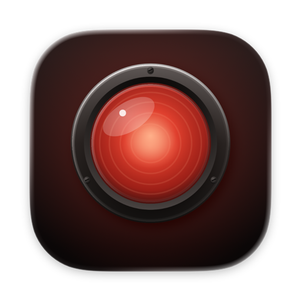
</p>

<h1 align="center">
  <picture>
    <source media="(prefers-color-scheme: light)" srcset="docs/brand/logo/redlamp-lockup-light.svg">
    
  </picture>
</h1>

<p align="center"><b>A native, open-source RAW photo editor for Mac, iPad, and iPhone that anyone who knows Lightroom will find familiar.</b></p>

<p align="center">
  <a href="https://ko-fi.com/pdcgomes"></a>
</p>

Redlamp is built from scratch in Swift and Metal for Apple Silicon. It focuses on one thing, *developing* photos, and aims to do it faster and more natively than anything else on the platform.

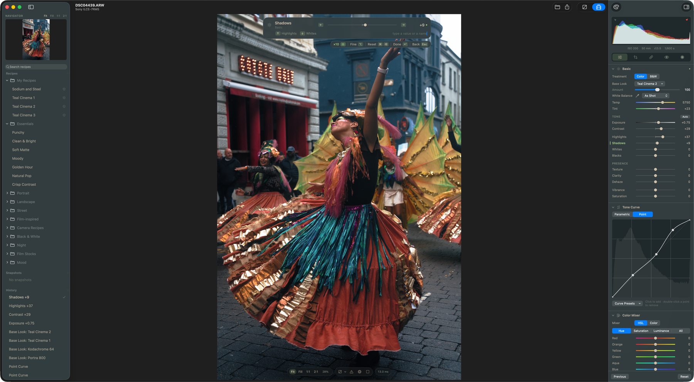

> **Status: pre-alpha, iteration 2 (macOS).** The core RAW pipeline and the Develop workspace work today: Basic (with Texture, Clarity and Dehaze), Tone Curve, Color Mixer, Color Grading, Detail (noise reduction and sharpening) and Effects, **masking** (gradients, brush, color and luminance range, Subject, Sky, Background, People and its parts, Objects, and Depth Range) with local adjustments, and **Recipes**, Redlamp's presets, profiles and LUTs in one, with film looks measured from cameras' own renderings and **[film simulations](#film-simulations)** of 36 film looks from 30 stocks, built from the manufacturers' datasheets. Crop, healing, Landscape masks, lens corrections, focus stacking, and the iPad and iPhone apps are next. See [Where we are](#where-we-are) and the [Roadmap](#roadmap).
>
> This README is the project's primary status page and is kept up to date as work lands. *Last updated: 1 October 2026.*

---

## Contents

- [Why Redlamp](#why-redlamp)
- [Goals](#goals)
- [Where we are](#where-we-are)
- [Film simulations](#film-simulations)
- [Screenshots](#screenshots)
- [Roadmap](#roadmap)
- [Installation](#installation)
- [Getting started](#getting-started)
- [Component harness](#component-harness)
- [Using Redlamp](#using-redlamp)
- [Architecture](#architecture)
- [Contributing](#contributing)
- [Support Redlamp](#support-redlamp)
- [License and acknowledgements](#license-and-acknowledgements)

---

## Why Redlamp

A **red lamp** is the darkroom safelight: the one light you can work by without fogging the paper. That is the idea behind the project: you can see and shape your photo freely, and the original is never harmed.

Lightroom defined how millions of photographers edit, but it is a cross-platform application that doesn't feel at home on a Mac, iPad, or iPhone, and it is tied to a subscription and a cloud. Redlamp keeps the workflow photographers already know, including the panel layout, slider names and ranges, and keyboard shortcuts, and rebuilds everything underneath as a native, GPU-first, open-source application.

**Redlamp is an editor, not a catalog.** It opens folders of photos and stores edits in small sidecar files next to them. Library management is a separate, later track.

## Goals

1. **Immediately familiar to Lightroom users.** The Develop module's layout, panel order, slider names, ranges and defaults, and single-key shortcuts all carry over. We copy conventions, never Adobe's assets. One deliberate exception: presets, profiles and LUTs are all **Recipes**, and a profile is a recipe's **Base Look**, because for most people they all do one thing, give a photo a look. Lightroom's words still work as tooltips and in search.
2. **Best-in-class masks.** Masks are part of the architecture from day one. Every edit is a layer (adjustments plus a mask), with Lightroom's model of components combined by add, subtract, and intersect, and on-device AI masks built on Apple Vision and SAM-class models.
3. **Modern, native UI and great UX.** The UI follows the macOS and iOS 26 design language. Liquid Glass is used only on floating chrome, and editing surfaces stay neutral grey so nothing distorts your color judgment. It is direct-manipulation first, every action can be undone, and there are no modal dialogs while you edit.
4. **Extreme responsiveness.** Rendering and UI are strictly separated. Slider changes should reach the screen within a frame (under 16 ms), and the UI thread never waits on the engine, the disk, or the GPU.
5. **Serious color science.** The pipeline is scene-referred and linear, with DCP camera profiles, LUTs, lens profiles, and our own looks. Some looks are fitted by measurement to match popular camera and editor renderings.
6. **Computational photography built into the editing workflow.**
   - **Best-in-class denoise:** a classical, noise-profiled denoiser plus an on-device AI denoiser that runs directly on raw data.
   - **Focus stacking in one click,** from detecting a bracketed sequence to an editable result, with pro-level strategies and retouching. This is something Lightroom doesn't offer at all, and dedicated tools only offer with a lot of friction.
   - **AI where it clearly wins:** masks, removal and upscaling, running on the device with no cloud and no credits.
7. **Mac first, then iPad and iPhone from the same engine.** A single platform-neutral engine sits under thin, native shells. The Mac editor comes first; iPad and iPhone follow once the main features are complete, and edits will move between devices through iCloud Drive, Files, and Photos.
8. **Open source (MPL-2.0).** The license is compatible with the App Store. Algorithms are implemented clean-room from papers and specifications.

## Where we are

### What works today (macOS)

**RAW pipeline (our own, GPU-first)**
- [x] Decodes RAW files through LibRaw (unpacking only). Black levels, white balance, demosaicing, and color are all done by Redlamp on the GPU.
- [x] Bayer demosaic by directional filtering with a posteriori decision (Menon, Andriani and Calvagno, 2007), with a dual pass that takes plain green where the neighbours differ only by noise, a first-generation X-Trans demosaic, and linear DNG support (for example iPhone ProRAW).
- [x] Hot pixels are repaired before demosaicing, judged against each photo's own noise level.
- [x] Row and column banding is measured in the sensor's masked (optical-black) margins and subtracted with the black level, only where the margins show more than their own noise.
- [x] **DNG gain maps** (OpcodeList2), such as phones' lens shading correction, are applied before demosaicing, and noise reduction scales with the noise they amplify.
- [x] **Highlight reconstruction:** channels are no longer clipped at 1 after white balance, and photosites that did clip are rebuilt from their bright unclipped neighbours, using the colour measured around the clipped area. Fully blown areas stay neutral.
- [x] Tested on Sony **ARW**, Canon **CR3**, Nikon **NEF**, Fujifilm **RAF** (X-Trans), Apple **ProRAW DNG** and Google **Pixel DNG**, plus JPEG, HEIC, TIFF, and PNG.
- [x] The demosaiced image is cached as a full mip pyramid, so interactive renders sample the right resolution for the zoom level.
- [x] A single fused Metal kernel applies every per-pixel adjustment. Frames are delivered as IOSurfaces, so pixels are never copied between engine and UI.
- [x] Latest-wins render scheduling: a burst of slider events collapses to the newest one.
- [x] Rendering stays off the main thread while you drag a slider. Frames go straight to the canvas, which a dedicated display-link thread presents, and each view observes only the values it shows.
- [x] Both side panels are AppKit: the histogram, tool strip and every Develop and Masking panel on the right, and the Navigator, Recipes, Snapshots and History on the left. They match the SwiftUI originals pixel for pixel, and a component harness is used to build and review them (see [Component harness](#component-harness)).
- [x] Temperature and tint use a proper camera white-balance model (Robertson's method with the camera's color matrix). As Shot, Auto, and the illuminant presets all work.

**Develop adjustments that render**
- [x] **White balance:** Temp and Tint, the presets, Auto, and the eyedropper.
- [x] **Basic:** Exposure, Contrast, Highlights, Shadows, Whites, Blacks, Vibrance, and Saturation, plus the **Auto** button.
- [x] **Treatment** (Color or B&W) and **Base Looks** (Lightroom's profiles) with an Amount slider (0–200) and a browser that renders every look on the photo. There are six built-in looks (Redlamp Color, Neutral, Vivid, Landscape, Portrait and Monochrome) and 15 film-style looks built on 3D look tables: slide, chrome, negative, cinema, bleach and black and white through color filters. Four of them are measured from cameras' own renderings by the look profiler (see [Recipes and looks](#recipes-and-looks)).
- [x] **Tone Curve:** a parametric curve with split points, and a point curve with presets.
- [x] **Color Mixer:** HSL (Hue, Saturation, Luminance, and All) and a per-color mode, working in OKLCh.
- [x] **Color Grading:** 3-way and individual wheels, Blending, and Balance. It also tints B&W images for split-toning.
- [x] **Effects:** post-crop vignette (amount, midpoint, roundness, feather) and zoom-stable film grain.
- [x] **Noise reduction** (Detail panel): Luminance with Detail and Contrast, and Color with Detail and Smoothness. It is scaled to each photo's own noise, read from the DNG NoiseProfile tag or measured from the raw data when the file opens. It runs as a cached stage in front of the fused kernel, so other sliders stay as fast as before, and exports render in tiles.
- [x] **Sharpening** (Detail panel): Amount, Radius, Detail and Masking, in the same cached stage after noise reduction. It is noise-aware: detail is measured on a denoised copy of the luminance and applied to the untouched image, so the photo's noise and grain pass through as they were instead of being sharpened. Detail moves from a halo-limited unsharp mask towards Richardson–Lucy deconvolution of the Radius's blur, and holds back halos on strong edges; Masking keeps flat areas untouched. It boosts luminance detail in stops, so it doesn't depend on exposure and leaves colors alone.
- [x] **Texture and Clarity** (global): gains on medium (about 2–8 px) and larger (about 8–64 px) luminance detail, taken from the image pyramid in the same cached stage, so tiles and zoom levels agree. Negative values soften.
- [x] **Dehaze** (global and in masks): the dark channel prior (He, Sun and Tang, 2009) with the airlight and a haze map measured when the photo opens; negative values add a neutral veil.

**Masking** (Lightroom's model)
- [x] Each mask is a layer: its own adjustments plus a mask built from components. Components combine with **Add**, **Subtract**, and **Intersect**, and each can be inverted.
- [x] **Linear and radial gradient** components.
  - Draw them on the photo.
  - Drag the handles to move, resize, and rotate; radial gradients also have a Feather control.
  - Pins select the other masks.
- [x] **Brush** (`K`): A and B brushes and Erase (hold Option), with Size, Feather, Flow, Density and Auto Mask, and pen pressure. Strokes are kept as vectors in the edit and painted on the GPU in mask space (up to 4096 px), redrawing only the stroke being painted. `[` and `]` change the size, with Shift the feather.
- [x] **Luminance Range** (`⇧Q`) and **Color Range** (`⇧J`): sample with the eyedropper, then shape the range with four handles (Show Luminance Map) or Refine up to five color samples. They select on the photo with its global edit, so the selection follows white balance and exposure.
- [x] **AI masks:** Subject, Background, People (each person, or parts: face skin, eyebrows, eye sclera, iris, lips, teeth, and hair from iPhone mattes) and Sky, with Apple Vision's built-in models and nothing to download. **Objects:** hover to preview, click to select, click again to add and Option-click to take away (Segment Anything 2.1, an 80 MB download on first use). **Depth Range:** from a photo's own depth map (iPhone), or estimated by Depth Anything V2. Sky is Segment Anything prompted inside a classical sky estimate, with the sky between bare branches given back. In the [bake-off](docs/research/notes/MSK-17-sky-bakeoff.md), averaging it with Depth Anything 3 (converted to Core ML, and not yet cleared to ship) did better still, and Redlamp does that when evaluation models are turned on.
- [x] AI masks are computed from the photo without its edit and kept as bitmaps in the edit, so they never move when you edit and render the same everywhere. **Update AI Masks** recomputes them with today's models, pasted settings recompute them for the new photo, and **Refine Edges** snaps them harder to the photo.
- [x] **Mask presets:** Blue Sky, Brighten Subject, Darken Background, Smooth Skin, Whiten Teeth and Pop Eyes compute their masks for each photo; save your own from any mask.
- [x] **Beyond Lightroom:** a mask's **Detail** keeps only its textured (or only its flat) areas, and any mask can be reused as a component of another (**Existing Mask** in Add, Subtract and Intersect).
- [x] **Local adjustments:** Temp, Tint, Exposure, Contrast, Highlights, Shadows, Whites, Blacks, Texture, Clarity, Dehaze, Hue, Saturation, Sharpness, and Noise, plus the mask's Amount (0–200%).
- [x] **Mask management:** a mask overlay (`O`) in Lightroom's modes (Color Overlay, on B&W, Image on Black or White, B&W) and colors, and a mask list where you can show and hide, rename, duplicate, "duplicate and invert", reset, and delete masks.
- [x] **Fast by design:** gradients and ranges are evaluated per pixel inside the same fused GPU kernel, and brush and AI masks are read from GPU textures. Up to 16 masks cost well under a millisecond extra at Fit.
- [x] **Models on demand:** Settings › Models lists the downloadable models with their size, and removes them. Every model runs on the Mac; photos are never uploaded. Models whose training data is still under licence review are offered only when you turn on evaluation models.

**Focus stacking** (a separate Stack workspace)
- [x] **Stacks are found for you:** runs of frames with the same camera settings a moment apart, whose sharp region moves from frame to frame, get a "Focus stack detected: N frames" banner with **Merge**. Bursts, time-lapses and pans aren't offered.
- [x] **The result develops like a raw.** Frames are stacked as demosaiced camera RGB before any edit, so every Develop slider, white balance included, works on it. The stack is a small `.redlampstack` document beside the frames; the merged pixels are cached and rebuilt when needed.
- [x] Alignment follows focus breathing, rotation and shift, brightness is matched frame to frame, and a depth map records which frame is sharpest where.
- [x] **Auto, Smooth and Detail:** Auto takes tone and color from the depth map and fine detail from the sharpest frames near it; Smooth blends between frames for clean surfaces; Detail keeps the sharpest detail from anywhere, for hair and bristles.
- [x] **The Stack workspace:** leave frames out, switch methods (each merge is cached), view the depth map, and **retouch** by painting the frame under the cursor, a chosen frame or another method's result over the merge.
- [x] One frame is in memory at a time, and `redlamp stack` does the same from the command line.

**Workspace**
- [x] A Lightroom-style layout. On the left: Navigator, Recipes, Snapshots, and History. In the center: the photo, with the filmstrip below. On the right: histogram, tool strip, and the Develop panels in Lightroom's order.
- [x] **Sliders:** click to jump, drag to adjust, Shift-drag for fine control, double-click to reset, and click the value to type one in. Option-dragging a tone slider shows clipping, as in Lightroom.
- [x] **Panels:** double-click a panel or group title to reset it, and Option-click a header for Solo Mode.
- [x] **Histogram:** clipping indicators, and you can drag across it to adjust Blacks, Shadows, Exposure, Highlights, or Whites.
- [x] **Recipes** (Lightroom's presets, profiles and LUTs, in one): 39 bundled recipes in eight groups, including camera-style ones built from Fujifilm-style recipe cards. Hover to preview, click to apply, then adjust the recipe's Amount. You can search (Lightroom's words work), mark favorites, save the current edit as a recipe with a settings checklist (⇧⌘N), and import or export `.redrecipe`, `.cube` and HaldCLUT files. Snapshots and full undo/redo history are also available.
- [x] **Camera-recipe controls** in the Effects panel: Dynamic Range, Color Chrome, Chrome FX Blue, and red and blue white-balance shift.
- [x] **Viewing:** Fit, Fill, 1:1, and 2:1 zoom, click to zoom, pan, pinch, and a clipping overlay. **Sensor clipping** (`⌥J`) marks the photosites the camera clipped, in the colour of each clipped channel (black where all three did), whatever the edit has done since; the **colour-assessment view** (`⇧L`) puts the photo on middle grey inside a white frame (ISO 12646). **Before/After** (`\`) in three layouts, full frame, side by side and a diagonal split, cycled with `Y` and `⇧Y`; the original is rendered once and cached, so edits don't re-render it.
- [x] **Themes:** Neutral greys by default, so nothing tints your judgment of color, plus a Redlamp theme and 20 dark and light families with a tint control, from the toolbar's Theme button or **Settings** (⌘,), which also has an About tab.
- [x] **Lightroom Classic's keyboard shortcuts**: 80 actions on 84 key bindings, from one registry that also drives the menus and an in-app ⌘/ reference (see [Keyboard shortcuts](#keyboard-shortcuts)).
- [x] **Find an adjustment** (⌘F): search the Develop sliders by name or the words people use (Lightroom's older names too), then jump to it; ⌘-scroll over any slider adjusts it (Shift coarse, Option fine), and value fields accept arithmetic such as `x+10`.
- [x] **Culling while you develop:** star ratings, pick/reject flags and color labels, shown on the filmstrip. There's also an Info overlay (`I`), Lights Out (`L`), full-screen preview (`F`), and Paste from Previous (`⌥⌘V` and the Previous button).
- [x] Non-destructive edits, saved automatically to a sidecar file next to each photo (`IMG_1234.ARW.redlamp`).
- [x] Export to JPEG, plus a headless `redlamp` command-line tool for rendering and export. Exports smaller than the photo are developed at full resolution and downscaled last, so sharpening, noise reduction and texture look the same at every size.

### Recipes and looks

- [x] **One `.redrecipe` format** for presets, profiles and LUTs: an explicit list of setting groups, an optional Base Look pinned by content hash, immutable versions, and namespaced ids ready for sharing ([format](docs/recipes/recipe-format.md), [JSON Schema](docs/recipes/recipe-format.schema.json)).
- [x] **Camera recipe cards:** Fujifilm-style recipes (film simulation, dynamic range, highlight and shadow tone, color, Color Chrome, white balance shift, grain) are a recipe dialect you can type in as the card lists them ([mapping](docs/recipes/camera-card-mapping.md)).
- [x] **Measured film looks.** The profiler fits a look to cameras' own JPEGs of the same raw files: Fujifilm raws carry the camera's rendering inside. On photos the fit never saw:

  | Base Look | Like | Measured from | ΔE to the camera (lower is closer) |
  | --- | --- | --- | --- |
  | Standard v3 | Provia | 120 photos, 50 bodies | 3.26 (Redlamp Color: 5.38) |
  | Vivid Slide v2 | Velvia | 10 bodies | 3.39 (4.45) |
  | Chrome v3 | Classic Chrome | 18 photos, 5 bodies | 4.61 (5.72) |
  | Soft Slide v2 | Astia | 5 photos, 3 bodies, provisional | 4.57 (12.84) |

  The others are hand-designed until there's data for them ([look development](docs/recipes/look-development.md#measured-base-looks-the-profiler)). Looks keep Redlamp's own names.
- [x] **Film simulations:** 36 looks from 30 stocks, built physically from the manufacturers' datasheets, including pushed, overexposed, bleach-bypass and cross-processed variants, with halation, bloom and film grain, a **Film Looks** window and film icons in the Base Look menu ([details](#film-simulations)).
- [x] **Look-development tools:** lint (neutral axis, skin hue, monotonic lightness, banding, clipping) on a synthetic chart, golden renders per recipe version, style fingerprints and a fitter, and the **Recipe Lab** in the [component harness](#component-harness).
- [x] **An agent recipe studio** ([docs](docs/recipes/agent-studio.md)): curator, colorist and critic agents work through `redlamp mcp` on briefs drawn from public-domain references. People approve the briefs and pick the winners in the Recipe Lab, and the critics are only trusted after they agree with human picks on held-out pairs.

### In progress

- **Focus stacking:** lens corrections before alignment, halo handling, vendor focus-bracketing tags for detection, and baking a stack to DNG.
- **Panels laid out but not yet rendering** (shown dimmed, with the phase they arrive in): Moiré and Defringe in masks, and the Lens Corrections, Transform, and Calibration panels. The Crop, Healing, and Red Eye tools show what is coming and when.

### Measured performance

Measured on an Apple M1 Ultra with a Release build.

| Operation | Time |
| --- | --- |
| Open a 24–26 MP raw file (decode, GPU upload, demosaic, pyramid) | 70–250 ms |
| Interactive render at Fit (every adjustment, fused) | 0.6–3 ms |
| Interactive render at Fit with two gradient masks | ~1.3 ms |
| Interactive render at 1:1 (full 26 MP frame) | ~13 ms |
| Full-resolution export render (24–26 MP) | ~45 ms |
| Full-resolution export render with noise reduction (24 MP, tiled) | ~100 ms |
| Focus stack of 25 × 17 MP Canon CR3 frames (decode, align, depth map, fuse) | ~8 s |
| Focus stack of 109 × 4 MP JPEG frames | ~15 s |
| Reopen a merged focus stack from its cache | ~0.1 s |
| Detail stage on a 1:1 region (about 10 MP of pyramid texels), GPU time: noise reduction, Texture and Clarity | ~5 ms, ~1 ms |
| Detail stage for a 2560 × 1600 view at 1:1 of a 24 MP frame, GPU time: noise reduction alone; default sharpening, first render; while dragging Radius; while dragging Amount, Detail, Masking or a noise slider (cached analysis) | ~1.9 ms, ~7.2 ms, ~5.5 ms, ~2.2 ms |

Dragging a slider at 120 events a second (`scripts/perf-sweep.sh`), with every panel open:

| Main thread during the drag | Iteration 2 | Off-main rendering | AppKit panels |
| --- | --- | --- | --- |
| Time busy | 100% | ~54% | ~34% |
| Typical run-loop iteration (median) | — | 2.3 ms | 0.17 ms |
| Slowest 5% of iterations | 157 ms | ~8 ms | ~5 ms |
| Slowest 1% of iterations | — | ~13 ms | ~8 ms |

With both side panels in AppKit, most of what remains is Core Animation committing the redrawn layers and the engine's frames arriving; SwiftUI is down to about 2% of the main thread.

### Known limitations

- Highlights and Shadows are per-pixel approximations for now. Lightroom-quality versions need edge-aware local tone mapping (an exposure-independent guided filter), planned for Phase 2.
- X-Trans demosaicing is a first-generation interpolation. A Markesteijn-class demosaic comes in Phase 2.
- Redlamp's exposure for Fujifilm raws differs from the camera's by up to ±0.9 EV depending on the body; the profiler removes it when measuring looks, and the engine fix is tracked (TON-14).
- Non-DNG raws use a single-illuminant Adobe-derived matrix (LibRaw's). DNGs interpolate their two calibrations by white balance, but the Temperature and Tint model still converts with one matrix, and DCP profiles (HueSatMap, LookTable) come later in Phase 2.
- Landscape masks (mountains, water, vegetation, ground, architecture) and people parts beyond the face (body skin, clothes, and hair without an iPhone matte) need a model trained on data Redlamp has rights to, which doesn't exist yet ([plan](docs/plans/2026-10-01-masking-plan.md#m8-trained-heads-msk-12-msk-13-only-if-m7-says-so)).
- Objects and Depth Range estimation use open models still under licence review (tracker DEC-02), offered only with evaluation models turned on. Vision's own tap-to-segment arrives with macOS 27.
- AI mask edges are snapped to the photo when the mask is made (a guided filter, freedom-to-operate pending as DEC-05), not refined again at render time.
- Local Whites and Blacks are approximated with tonal-region gains.
- The app is not sandboxed yet (required later for the Mac App Store). iPad and iPhone come in Phase 5.

**Fixed in iteration 2:**
- White balance now works for linear DNGs such as iPhone ProRAW.
- The Navigator outlines the zoomed viewport.
- The loading placeholder now shows while a photo decodes.
- Dragging a slider no longer stutters. Every change used to re-render every panel and wait on the canvas's drawable on the main thread.

## Film simulations

Redlamp's film looks are **physical simulations**, built from the data in each manufacturer's own datasheet: characteristic curves, spectral sensitivities and dye spectra, digitised into [`research/film-data/`](research/film-data/). Most film presets are tuned by eye.

<table>
  <tr>
    <td align="center" width="16%"><a href="#portra-160">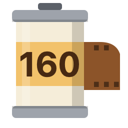</a><br><b>Portra 160</b><br><sub>Colour negative</sub></td>
    <td align="center" width="16%"><a href="#portra-400">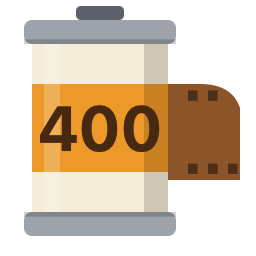</a><br><b>Portra 400</b><br><sub>Colour negative</sub></td>
    <td align="center" width="16%"><a href="#portra-800">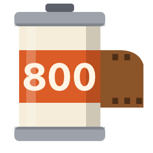</a><br><b>Portra 800</b><br><sub>Colour negative</sub></td>
    <td align="center" width="16%"><a href="#ektar-100">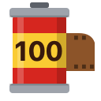</a><br><b>Ektar 100</b><br><sub>Colour negative</sub></td>
    <td align="center" width="16%"><a href="#gold-200"></a><br><b>Gold 200</b><br><sub>Colour negative</sub></td>
    <td align="center" width="16%"><a href="#ultramax-400">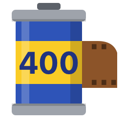</a><br><b>UltraMax 400</b><br><sub>Colour negative</sub></td>
  </tr>
  <tr>
    <td align="center" width="16%"><a href="#superia-400">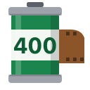</a><br><b>Superia 400</b><br><sub>Colour negative</sub></td>
    <td align="center" width="16%"><a href="#pro-400h">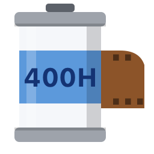</a><br><b>Pro 400H</b><br><sub>Colour negative</sub></td>
    <td align="center" width="16%"><a href="#cinestill-800t">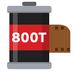</a><br><b>CineStill 800T</b><br><sub>Tungsten negative</sub></td>
    <td align="center" width="16%"><a href="#cinestill-50d">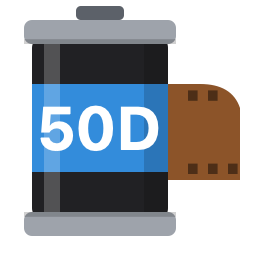</a><br><b>CineStill 50D</b><br><sub>Daylight negative</sub></td>
    <td align="center" width="16%"><a href="#vision3-500t-2383">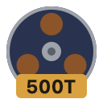</a><br><b>Vision3 500T</b><br><sub>Cinema print</sub></td>
    <td align="center" width="16%"><a href="#vision3-250d-2383">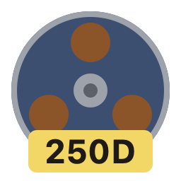</a><br><b>Vision3 250D</b><br><sub>Cinema print</sub></td>
  </tr>
  <tr>
    <td align="center" width="16%"><a href="#vision3-50d-2383">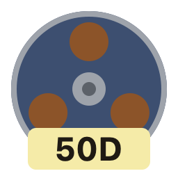</a><br><b>Vision3 50D</b><br><sub>Cinema print</sub></td>
    <td align="center" width="16%"><a href="#eterna-vivid-250d-2383">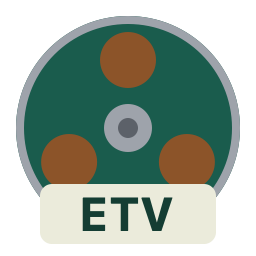</a><br><b>Eterna Vivid</b><br><sub>Cinema print</sub></td>
    <td align="center" width="16%"><a href="#provia-100f">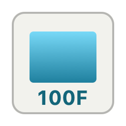</a><br><b>Provia 100F</b><br><sub>Slide</sub></td>
    <td align="center" width="16%"><a href="#velvia-50">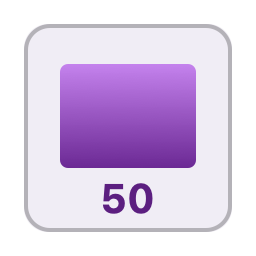</a><br><b>Velvia 50</b><br><sub>Slide</sub></td>
    <td align="center" width="16%"><a href="#velvia-100">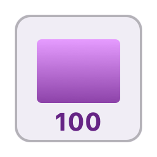</a><br><b>Velvia 100</b><br><sub>Slide</sub></td>
    <td align="center" width="16%"><a href="#ektachrome-e100">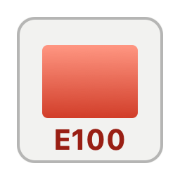</a><br><b>Ektachrome</b><br><sub>Slide</sub></td>
  </tr>
  <tr>
    <td align="center" width="16%"><a href="#kodachrome-64">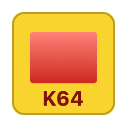</a><br><b>Kodachrome 64</b><br><sub>Slide</sub></td>
    <td align="center" width="16%"><a href="#tri-x-400">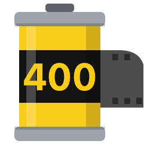</a><br><b>Tri-X 400</b><br><sub>Black and white</sub></td>
    <td align="center" width="16%"><a href="#t-max-100">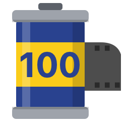</a><br><b>T-Max 100</b><br><sub>Black and white</sub></td>
    <td align="center" width="16%"><a href="#t-max-400">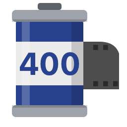</a><br><b>T-Max 400</b><br><sub>Black and white</sub></td>
    <td align="center" width="16%"><a href="#hp5-plus">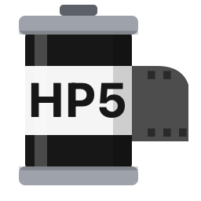</a><br><b>HP5 Plus</b><br><sub>Black and white</sub></td>
    <td align="center" width="16%"><a href="#delta-100">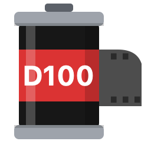</a><br><b>Delta 100</b><br><sub>Black and white</sub></td>
  </tr>
  <tr>
    <td align="center" width="16%"><a href="#delta-3200">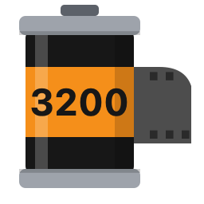</a><br><b>Delta 3200</b><br><sub>Black and white</sub></td>
    <td align="center" width="16%"><a href="#fp4-plus">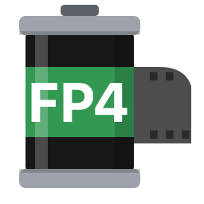</a><br><b>FP4 Plus</b><br><sub>Black and white</sub></td>
    <td align="center" width="16%"><a href="#pan-f-plus">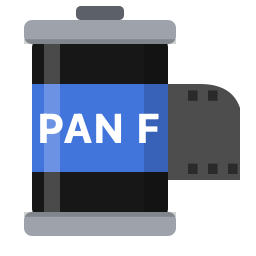</a><br><b>Pan F Plus</b><br><sub>Black and white</sub></td>
    <td align="center" width="16%"><a href="#tri-x-multigrade">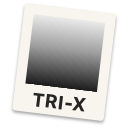</a><br><b>Darkroom Print</b><br><sub>Grade 2 print</sub></td>
    <td align="center" width="16%"><a href="#tri-x-multigrade-soft">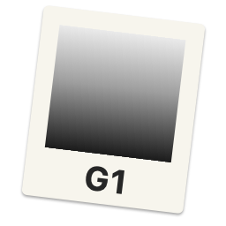</a><br><b>Soft Print</b><br><sub>Grade 1 print</sub></td>
    <td align="center" width="16%"><a href="#tri-x-multigrade-hard"></a><br><b>Hard Print</b><br><sub>Grade 4 print</sub></td>
  </tr>
  <tr>
    <td align="center" width="16%"><a href="#portra-400-overexposed">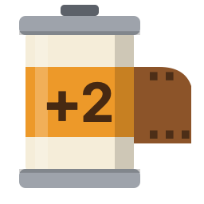</a><br><b>Portra 400 · +2</b><br><sub>Overexposed</sub></td>
    <td align="center" width="16%"><a href="#portra-800-1600">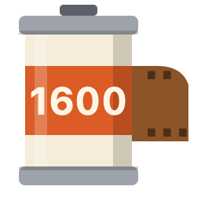</a><br><b>Portra 800 · 1600</b><br><sub>Pushed</sub></td>
    <td align="center" width="16%"><a href="#tri-x-1600">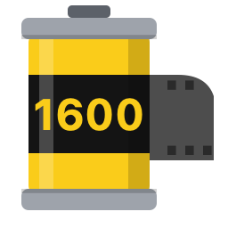</a><br><b>Tri-X · 1600</b><br><sub>Pushed</sub></td>
    <td align="center" width="16%"><a href="#vision3-2383-bleach-bypass">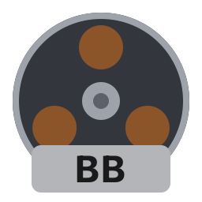</a><br><b>2383 Bleach Bypass</b><br><sub>Cinema print</sub></td>
    <td align="center" width="16%"><a href="#velvia-50-cross">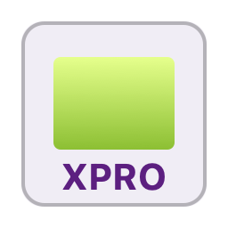</a><br><b>Velvia 50 · Cross</b><br><sub>Cross-processed</sub></td>
    <td align="center" width="16%"><a href="#provia-100f-cross">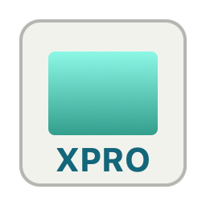</a><br><b>Provia 100F · Cross</b><br><sub>Cross-processed</sub></td>
  </tr>
</table>

### How the film engine works

The datasheets drive an offline model that bakes each film into a Base Look table and its effects settings. Only those ship, and the GPU applies them while you edit:

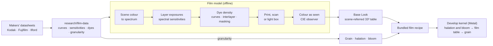

The [film model](docs/plans/2026-09-30-film-looks-design.md) follows the scene's light through the film:
1. Each colour becomes a spectrum.
2. The film's three layers record that spectrum through their own sensitivities.
3. The characteristic curves turn exposure into dye, with interlayer effects and colour masking.
4. A negative is printed on its print stock or scanned the way a lab scanner reads it. A slide is lit on a light box.
5. The result is seen through the colour-matching functions of human vision.

Each look ships as a scene-referred Base Look. It takes the place of Redlamp's tone curve, so the film's own toe, shoulder and colour crossovers reach the photo. Each look also comes with the film's **grain, halation and bloom** in the Effects panel. Grain follows each datasheet's published granularity, and halation is strongest on CineStill, which has no anti-halation layer.

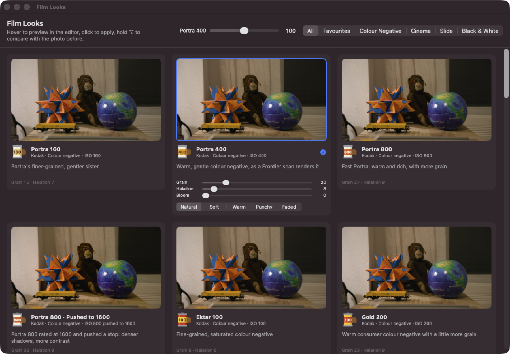

**Using them:**
- **Window ▸ Film Looks** (`⇧⌘L`) shows the open photo in every film. Hover over a card to preview the look in the editor; click to apply it with its grain, halation and bloom. Hold `⌥` over a card to see the photo before the look. Star a look to keep it under **Favourites**. The applied look's card has Grain, Halation and Bloom sliders, and the header an Amount slider. Tabs filter by colour negative, cinema, slide, and black and white.
- **Basic ▸ Base Look ▸ Film Stocks**, with each film's icon, sets only the look, as a Lightroom profile does.
- **Recipes ▸ Film Stocks** in the sidebar applies the look with its effects.
- **Effects ▸ Grain** (with a new **Color** slider for grain in each dye layer), **Halation** and **Bloom** work on any photo. Masks have their own **Halation** and **Bloom** sliders, to add glow to a sign or hold it back from a face.

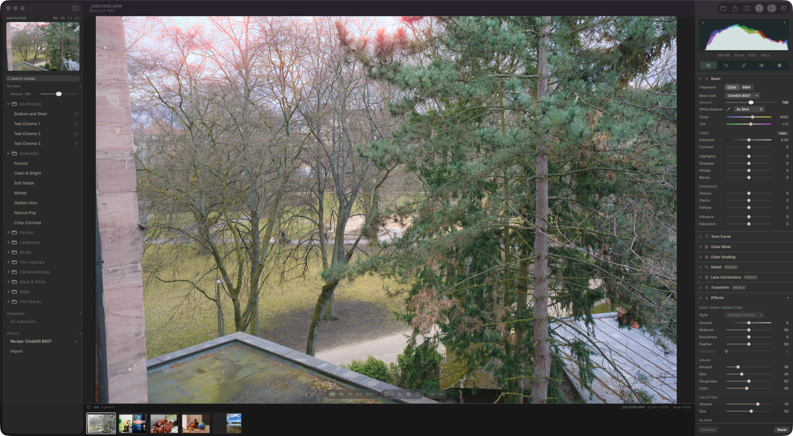

### The catalogue

| | Look | Film | Rendered as | Grain / halation |
| --- | --- | --- | --- | --- |
|  | [Portra 160](#portra-160) | Kodak · Colour negative · ISO 160 | Scanned, Frontier-like | 15 / 7 |
|  | [Portra 400](#portra-400) | Kodak · Colour negative · ISO 400 | Scanned, Frontier-like | 20 / 8 |
|  | [Portra 800](#portra-800) | Kodak · Colour negative · ISO 800 | Scanned, Frontier-like | 27 / 9 |
|  | [Portra 800 · Pushed to 1600](#portra-800-1600) | Kodak · Colour negative · ISO 800 pushed to 1600 | Scanned, Frontier-like | 32 / 9 |
|  | [Ektar 100](#ektar-100) | Kodak · Colour negative · ISO 100 | Scanned, Frontier-like | 8 / 6 |
|  | [Gold 200](#gold-200) | Kodak · Colour negative · ISO 200 | Scanned, Frontier-like | 23 / 9 |
|  | [UltraMax 400](#ultramax-400) | Kodak · Colour negative · ISO 400 | Scanned, Frontier-like | 25 / 9 |
|  | [Superia 400](#superia-400) | Fujifilm · Colour negative · ISO 400 | Scanned, Frontier-like | 24 / 8 |
|  | [Pro 400H](#pro-400h) | Fujifilm · Colour negative · ISO 400 (discontinued) | Scanned, Frontier-like | 24 / 8 |
|  | [CineStill 800T](#cinestill-800t) | CineStill · Tungsten colour negative · ISO 800 | Scanned, Noritsu-like | 26 / 70, bloom 8 |
|  | [CineStill 50D](#cinestill-50d) | CineStill · Daylight colour negative · ISO 50 | Scanned, Noritsu-like | 12 / 60, bloom 6 |
|  | [Vision3 500T · 2383](#vision3-500t-2383) | Kodak · Cinema negative on print film · ISO 500 | Printed on 2383 and projected | 24 / 14, bloom 6 |
|  | [Vision3 250D · 2383](#vision3-250d-2383) | Kodak · Cinema negative on print film · ISO 250 | Printed on 2383 and projected | 20 / 12, bloom 6 |
|  | [Vision3 50D · 2383](#vision3-50d-2383) | Kodak · Cinema negative on print film · ISO 50 | Printed on 2383 and projected | 12 / 10, bloom 5 |
|  | [Eterna Vivid 250D · 2383](#eterna-vivid-250d-2383) | Fujifilm · Cinema negative on print film · ISO 250 (discontinued) | Printed on 2383 and projected | 21 / 12, bloom 6 |
|  | [Provia 100F](#provia-100f) | Fujifilm · Slide film · ISO 100 | Slide, viewed on a light box | 8 / 4 |
|  | [Velvia 50](#velvia-50) | Fujifilm · Slide film · ISO 50 | Slide, viewed on a light box | 9 / 4 |
|  | [Velvia 100](#velvia-100) | Fujifilm · Slide film · ISO 100 | Slide, viewed on a light box | 8 / 4 |
|  | [Ektachrome E100](#ektachrome-e100) | Kodak · Slide film · ISO 100 | Slide, viewed on a light box | 8 / 4 |
|  | [Kodachrome 64](#kodachrome-64) | Kodak · Slide film · ISO 64 (discontinued) | Slide, viewed on a light box | 10 / 4 |
|  | [Tri-X 400](#tri-x-400) | Kodak · Black and white negative · ISO 400 | Scanned | 37 / 5 |
|  | [T-Max 100](#t-max-100) | Kodak · Black and white negative · ISO 100 | Scanned | 18 / 4 |
|  | [T-Max 400](#t-max-400) | Kodak · Black and white negative · ISO 400 | Scanned | 22 / 5 |
|  | [HP5 Plus](#hp5-plus) | Ilford · Black and white negative · ISO 400 | Scanned | 40 / 5 |
|  | [Delta 100](#delta-100) | Ilford · Black and white negative · ISO 100 | Scanned | 16 / 4 |
|  | [Delta 3200](#delta-3200) | Ilford · Black and white negative · ISO 3200 | Scanned | 52 / 6 |
|  | [FP4 Plus](#fp4-plus) | Ilford · Black and white negative · ISO 125 | Scanned | 24 / 5 |
|  | [Pan F Plus](#pan-f-plus) | Ilford · Black and white negative · ISO 50 | Scanned | 12 / 4 |
|  | [Tri-X · Darkroom Print](#tri-x-multigrade) | Kodak · Ilford · Black and white print · grade 2 | Printed on paper | 34 / 5 |
|  | [Portra 400 · +2](#portra-400-overexposed) | Kodak · Colour negative · ISO 400 rated 100 | Scanned, Frontier-like | 16 / 8 |
|  | [Tri-X 400 · Pushed to 1600](#tri-x-1600) | Kodak · Black and white negative · ISO 400 pushed to 1600 | Scanned | 46 / 6 |
|  | [Tri-X · Soft Print](#tri-x-multigrade-soft) | Kodak · Ilford · Black and white print · grade 1 | Printed on paper | 34 / 5 |
|  | [Tri-X · Hard Print](#tri-x-multigrade-hard) | Kodak · Ilford · Black and white print · grade 4 | Printed on paper | 34 / 5 |
|  | [Vision3 500T · 2383 Bleach Bypass](#vision3-2383-bleach-bypass) | Kodak · Cinema negative on print film, bleach bypass · ISO 500 | Printed on 2383 and projected | 26 / 12, bloom 6 |
|  | [Velvia 50 · Cross-Processed](#velvia-50-cross) | Fujifilm · Slide film in C-41 · ISO 50 | Developed in C-41, scanned | 12 / 5 |
|  | [Provia 100F · Cross-Processed](#provia-100f-cross) | Fujifilm · Slide film in C-41 · ISO 100 | Developed in C-41, scanned | 11 / 5 |

Every look on the same photo:

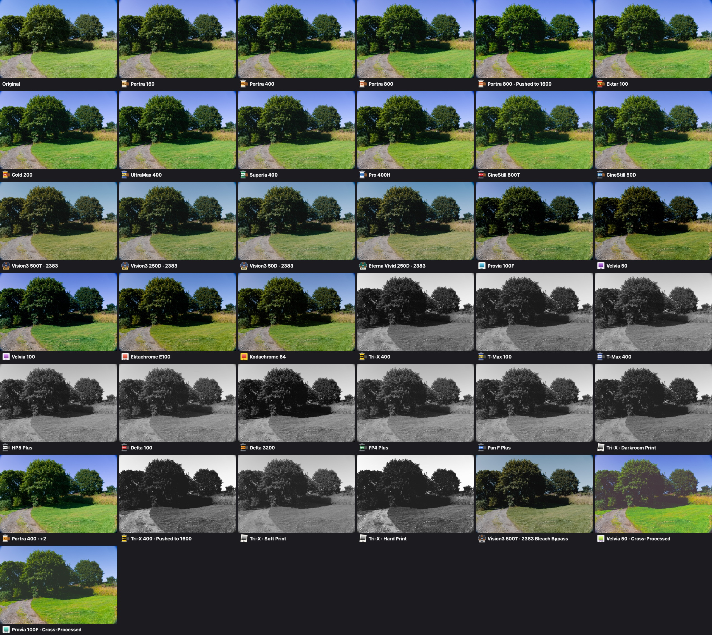

### Examples

Each example shows three CC0 photos from the [look-development set](docs/recipes/look-development.md#the-look-development-set): a landscape, flowers and a night street. The top row is Redlamp's default rendering, the bottom row the film look with its grain, halation and bloom.

<a id="portra-400"></a>

####  Portra 400

Warm and gentle. Kind to skin, with soft greens and a little extra warmth in the highlights, as a Frontier lab scan renders it.

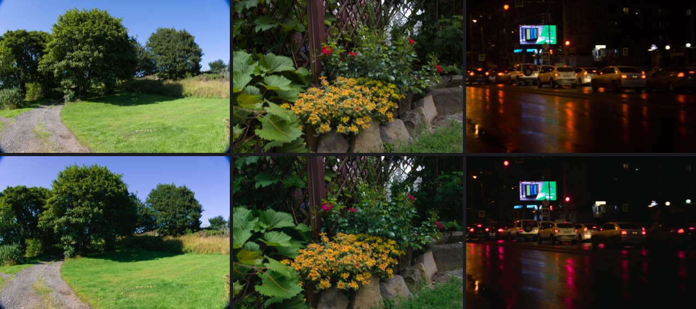

<a id="portra-160"></a>

####  Portra 160

Portra's slower sister: finer grain and an even gentler rendering, for portraits in good light.

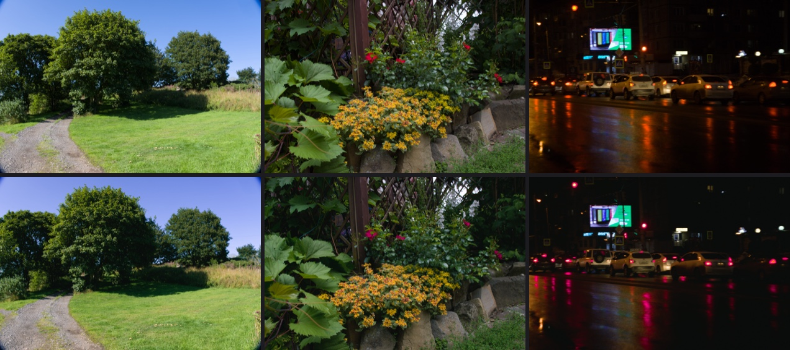

<a id="portra-800"></a>

####  Portra 800

Fast Portra: warmer and richer, with more grain and a little more contrast.


<a id="portra-800-1600"></a>

####  Portra 800 · Pushed to 1600

Portra 800 rated at 1600 and pushed a stop, from Kodak's own push curves: denser shadows, more contrast and grain.

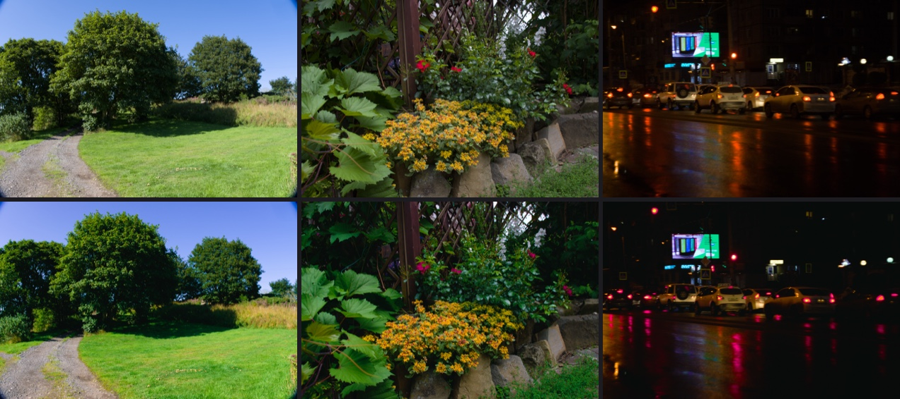

<a id="ektar-100"></a>

####  Ektar 100

Kodak's finest-grained colour negative: richer reds and deeper colour than Portra.

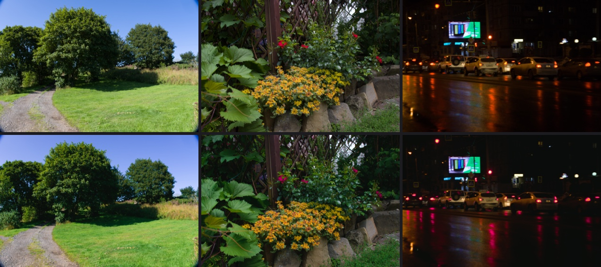

<a id="gold-200"></a>

####  Gold 200

Warm consumer film. Golden yellows, slightly greener foliage and more grain.

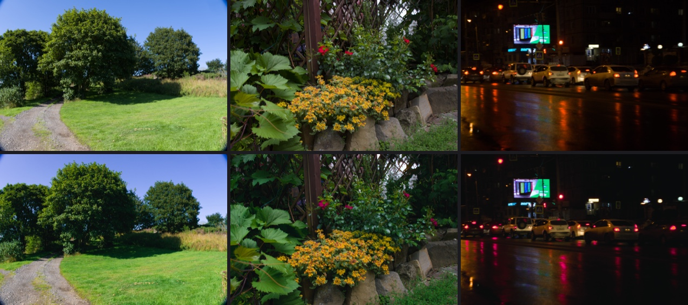

<a id="ultramax-400"></a>

####  UltraMax 400

Kodak's punchy everyday film: warm, saturated and a little grainy.

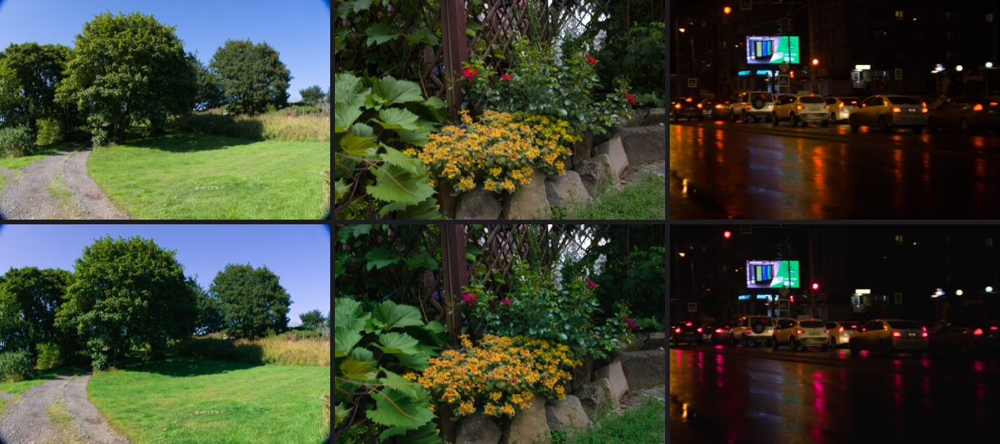

<a id="superia-400"></a>

####  Superia 400

Cooler than the Kodak stocks, with Fujifilm's greens.

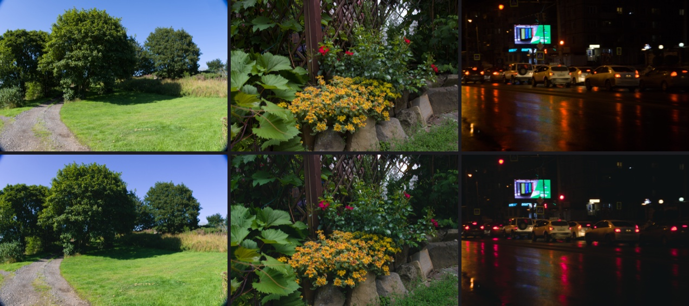

<a id="pro-400h"></a>

####  Pro 400H

Fujifilm's discontinued wedding film, with its fourth colour layer: soft contrast, pastel skin and minty greens.

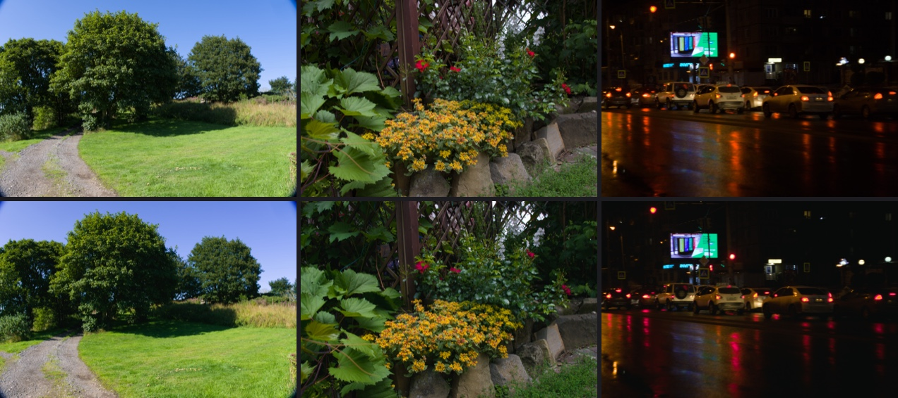

<a id="cinestill-800t"></a>

####  CineStill 800T

Vision3 500T without its anti-halation backing. Bright lights glow red-orange, the look of night streets and neon.

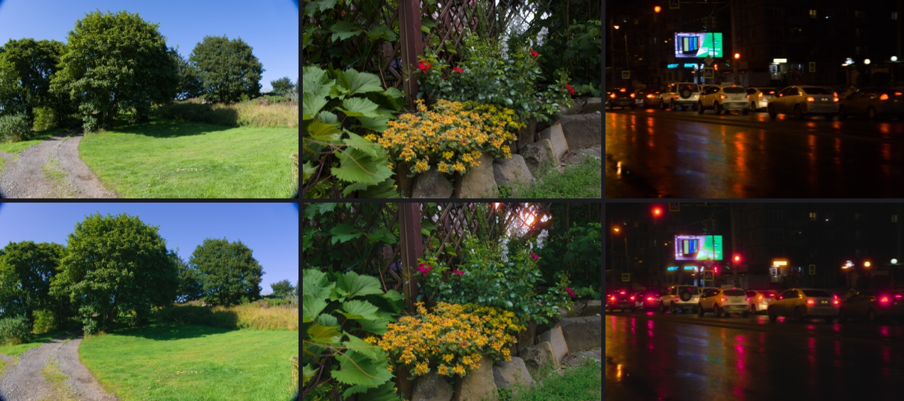

<a id="cinestill-50d"></a>

####  CineStill 50D

Vision3 50D without its anti-halation backing: very fine grain, daylight colour and glowing highlights.

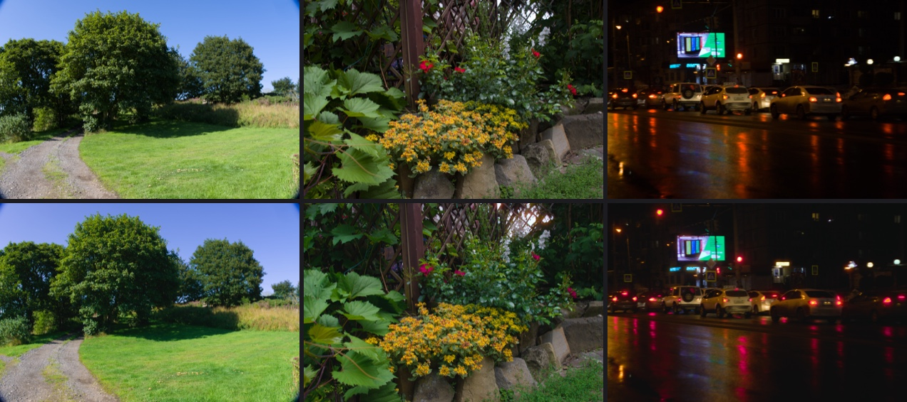

<a id="vision3-500t-2383"></a>

####  Vision3 500T · 2383

The motion-picture look: a cinema negative printed on release print film. Softer and denser, with cool shadows and warm highlights.


<a id="vision3-250d-2383"></a>

####  Vision3 250D · 2383

Kodak's daylight cinema negative printed on 2383: the bright exterior look of feature films.


<a id="vision3-50d-2383"></a>

####  Vision3 50D · 2383

The finest-grained cinema negative on 2383: clean, saturated daylight.


<a id="eterna-vivid-250d-2383"></a>

####  Eterna Vivid 250D · 2383

Fujifilm's discontinued vivid daylight cinema negative, printed on 2383: more saturated than Vision3.


<a id="provia-100f"></a>

####  Provia 100F

Clean, natural slide film. Contrasty, with deep skies and dense shadows, exposed for the highlights.


<a id="velvia-50"></a>

####  Velvia 50

The landscape slide: saturated greens, yellows and blues, and more contrast still.


<a id="velvia-100"></a>

####  Velvia 100

Velvia's faster sibling: just as saturated, a touch gentler in the shadows.


<a id="ektachrome-e100"></a>

####  Ektachrome E100

Kodak's modern slide film: clean, neutral to cool, with fine grain.


<a id="kodachrome-64"></a>

####  Kodachrome 64

The legendary K-14 slide film, from Kodak's archived datasheet: warm reds, deep blues and dense shadows.


<a id="tri-x-400"></a>

####  Tri-X 400

Classic black and white. Bright and crisp, with pronounced, sharp grain.


<a id="t-max-100"></a>

####  T-Max 100

Kodak's finest-grained black and white: smooth, sharp and long in tone.


<a id="t-max-400"></a>

####  T-Max 400

Modern fast black and white: tighter grain than Tri-X and a longer tonal range.


<a id="hp5-plus"></a>

####  HP5 Plus

Softer and grainier than Tri-X, with a gentler shoulder.


<a id="delta-100"></a>

####  Delta 100

Ilford's fine-grained modern black and white.


<a id="delta-3200"></a>

####  Delta 3200

Ilford's fastest film: big, gritty grain and hard contrast for low light.


<a id="fp4-plus"></a>

####  FP4 Plus

Classic medium-speed black and white with a gentle shoulder.


<a id="pan-f-plus"></a>

####  Pan F Plus

Slow, ultra-fine black and white with rich contrast.


<a id="tri-x-multigrade"></a>

####  Tri-X · Darkroom Print

A darkroom print: deeper blacks and the paper's own contrast.


### Variants and processes

The same datasheets also describe how a film behaves when it's exposed or processed differently, and the model follows them:
- **Exposure.** A lab calibrates its scanner at box speed and prints each frame up or down until mid-grey is right. Overexposed highlights crowd onto the film's shoulder, and underexposed shadows block up at the film base.
- **Push processing** uses the datasheet's own curves for longer development.
- **Paper grades** use Ilford's published curve for each Multigrade filter.
- **Bleach bypass** leaves the developed silver in with the dyes, as neutral density where dye formed.
- **Cross-processing** develops a slide emulsion as a negative: its curves are mirrored and there's no orange mask. Slide datasheets don't publish C-41 curves, so this one is an approximation.

<a id="portra-400-overexposed"></a>

####  Portra 400 · +2

The popular overexposed Portra: two stops of extra exposure crowd the highlights onto the film's shoulder, for an airy, pastel, soft look.


<a id="tri-x-1600"></a>

####  Tri-X 400 · Pushed to 1600

Push processing: two stops underexposed and developed longer, using the datasheet's own longest D-76 curve. The shadows block up and grain and contrast rise.


<a id="tri-x-multigrade-soft"></a>

####  Tri-X · Soft Print

A gentle, open darkroom print on a soft grade, using Ilford's published grade 1 curve.


<a id="tri-x-multigrade-hard"></a>

####  Tri-X · Hard Print

A hard grade: deep blacks and bright whites, using Ilford's published grade 4 curve.


<a id="vision3-2383-bleach-bypass"></a>

####  Vision3 500T · 2383 Bleach Bypass

The bleach-bypass print: the silver is left in with the dyes, so the image is desaturated, dense and hard, the look of many war films.


<a id="velvia-50-cross"></a>

####  Velvia 50 · Cross-Processed

Slide film developed as a negative: punchy, with the colour shifts that a slide emulsion with no orange mask gives.


<a id="provia-100f-cross"></a>

####  Provia 100F · Cross-Processed

Provia cross-processed: contrasty, with cool green-cyan shadows.


### Mood looks

Ten one-tap looks in the spirit of Prequel's filters. Each starts from a film look, with its grain, halation and bloom, and adds the new Effects: **Light Leak** (Amount, Warmth and Variation), **Dust & Scratches**, and a **Frame**. Frames come as a keyline, a white print border, a 35 mm rebate with its sprocket holes, or a slide mount. They're in the sidebar under **Recipes ▸ Mood**, and the effects work on any photo.

| Mood | Built on | Adds |
| --- | --- | --- |
| Golden Leak | Portra 400 · +2 | a warm light leak and soft bloom |
| Lost Roll | Gold 200 | leaks, dust, scratches and the 35 mm rebate |
| Summer '98 | UltraMax 400 | a warm leak and a white print border |
| Night Glow | CineStill 800T | strong halation, bloom and a little dust |
| Blue Hour | Pro 400H | a cool leak and a soft mist |
| Mist | Portra 160 | a diffusion filter's glow and gentler contrast |
| Home Movie | Vision3 50D · 2383 | projector scratches, dust, a dark edge and a keyline |
| Slide Show | Kodachrome 64 | a slide mount and a few specks of dust |
| Contact Sheet | Tri-X · Hard Print | the 35 mm rebate and darkroom dust |
| Neon Rain | Provia 100F · Cross-Processed | halation and a cool leak |


### Checked against photographs shot on the films

`research/film-references/` lists 477 photographs from Wikimedia Commons whose pages name the film. There are 8 to 20 per stock, licensed CC0, CC BY or CC BY-SA, and they're used as references only, never shipped or committed. `redlamp recipe film --validate` renders each look on the look-development set, and `research/film-references/analyse.py` compares them with the photographs in OKLab. It compares contrast and saturation, and the colour of foliage, sky, skin and near-neutral shadows and highlights.

The two sets show different scenes, so the useful tests are relative ones:
- **Ranking:** do the looks order the stocks as the photographs do?
- **Same-scene comparison:** what does each look change against Redlamp's own rendering of the same photos?

The check found one clear error, now fixed. The slides were *less* saturated than Redlamp's default, though in the photographs slide films are the most saturated of all. Slides get much of their saturation from strong interimage effects between their layers, which the model had set as mildly as for negatives. With stronger effects calibrated to the photographs' order (version 2 of the slide looks), saturation against the default rendering is:

| Look | Saturation |
| --- | --- |
| Velvia 50 | +31% |
| Velvia 100 | +20% |
| Provia 100F | +10% |
| Ektachrome E100 | +10% |
| Kodachrome 64 | +7% |

The colour negatives stay within a few percent of the default in saturation and are slightly softer, as lab scans are. The reference photographs differ too much in subject for finer conclusions: Pro 400H's are mostly weddings, CineStill's night streets, and Velvia's landscapes.

### How faithful are they?

- **The colour comes from the datasheets.** It follows each stock's own curves, sensitivities and dyes, and the stocks keep their published order of contrast and grain.
- **A lab's scan or print timing shapes the rest.** Negatives are scanned by a modelled lab scanner calibrated on a grey scale. Its Frontier-like and Noritsu-like profiles are characterised from how labs describe the two scanners, not measured from them. The 2383 print is timed partway back to neutral, as a colourist would.
- **Some data is fitted or uncertain.** Nine colour negatives publish no individual dye curves: Portra 160, 400 and 800, Ektar, Gold, UltraMax, Superia, Pro 400H and Eterna Vivid. Their dyes are Vision3's shapes, fitted until together they match the stock's own published mid-scale neutral. Kodak 2383's sensitivity was re-traced, and both 2383 looks are on version 2. Kodachrome 64 and Eterna Vivid come from Internet Archive copies of Kodak's and Fujifilm's own pages. Ilford publishes only relative scales, which the model's grey balance makes up for.
- **CineStill is modelled with no anti-halation layer,** as CineStill sells it. Kodak's current Vision3 datasheets describe an anti-halation undercoat in place of the old rem-jet backing, and no document settles which current CineStill stock has.
- **Grain follows film** (process 2, TON-19). It's sized to the frame, so it looks the same on any camera's resolution, and it's strongest in the low midtones and shadows. The fitted preview shows the grain the export will have.

Kodak, Portra, Ektar, Gold, Vision3, Tri-X, Fujifilm, Superia, Provia, Velvia, Ilford, HP5, Multigrade and CineStill are trademarks of their owners. Redlamp isn't affiliated with them: its looks are built from the published technical data.

**Rebuilding them:** `redlamp recipe film --all --install --readme` builds every look from the datasheets, installs the tables the app bundles, and regenerates the icons and images on this page. Bundled looks are versioned and never change once published; a test fails if the datasheets or the model would build a different look under the same version.

## Screenshots

**Masking on a Sony A7 III ARW.** A linear gradient darkens and cools the sky, and a feathered radial gradient warms and lifts the trees. The red overlay shows the selected mask's coverage.


**Color grading on a Canon EOS R6 CR3.** Split-toned shadows and highlights with the 3-way wheels.


**A camera recipe on a Fujifilm X-T3 RAF.** Chrome Street, built from a Fujifilm-style recipe card, on the measured Chrome Base Look. The recipe's Amount is in the Recipes panel, and its tone, Color Chrome and grain settings land in the Basic and Effects panels like any other edit.


**Black & white on a Sony A7 III ARW.** The Selenium recipe plus vignette and grain, with every step in History.


**Detail at 1:1 on a Canon EOS R6 CR3.** Noise reduction scaled to the photo's measured noise, and noise-aware sharpening that measures detail on a denoised copy, so grain isn't sharpened.


**Before and after, side by side, on a Nikon Z 6 NEF.** Exposure, Highlights, Shadows, Dehaze, Clarity and Vibrance; the original renders once and is cached.


**Fujifilm X-T3 X-Trans RAF at 1:1.** The full-resolution frame renders in about 13 ms, and the Color Mixer is shown in HSL mode.


**iPhone 12 Pro ProRAW (linear DNG).** Portrait orientation, with highlight recovery and blues tuned in the Color Mixer.


### The Recipe Lab

The Lab lives in the [component harness](#component-harness). It renders every recipe, Base Look and imported LUT on a 40-image CC0 look-development set.

**Gallery and split compare.** Thumbnails of every item on the chosen photo, filtered by kind, group, tag and lint result. On the right, the selected recipe (Chrome Street) against the original, with a draggable divider.


**One recipe across the set.** Gritty Street on landscapes, animals, night streets, foliage and interiors at once, to catch a look that only works on one kind of photo.


**A against B.** Two camera recipes, Chrome Street and Bright Slide, on the same photo.


**Inspect.** Every included setting with its key, the camera card the recipe was built from, and the Base Look's table statistics and lint.


**Agent studio runs.** A brief with the public-domain references it was drawn from, and the candidates developed against it with their lineage, lint and distance to the references. Each candidate opens in Compare at full size; pairwise picks and final picks are recorded for the critics' evals.


<sub>Sample images are CC0 files from [raw.pixls.us](https://raw.pixls.us); the brief's references are public-domain and CC0 photos from Wikimedia Commons. The screenshots are generated by `mise run screenshots`.</sub>

## Roadmap

The Mac comes first: Phases 1 to 4 build a high-quality editor and engine on macOS, and iPad and iPhone follow in Phase 5, once the main features are complete. The engine stays platform-neutral throughout, so the port is a new shell rather than a rewrite. The Lightroom feature inventory in [`docs/lightroom-feature-inventory.md`](docs/lightroom-feature-inventory.md) tags every Lightroom feature with the phase that delivers it.

### Phase 0: Foundations *(largely done)*
- [x] mise and Tuist workspace, module graph with enforced boundaries, and an engine purity gate
- [x] LibRaw vendored as a pinned, static XCFramework (macOS, iOS, and Simulator; arm64 only)
- [x] Engine API contract, headless CLI, and a unit and engine smoke-test suite
- [x] Lightroom feature inventory
- [x] GitHub Actions CI: purity gate, SwiftFormat lint, build, and tests, with cached LibRaw and fixtures
- [ ] Performance lab: a CI runner on Apple Silicon with regression gates that block merges (iPhone and iPad tiers come with Phase 5)
- [x] Golden-image color regression tests (ΔE2000) for camera files, and a golden render for every bundled recipe version
- [ ] Written clean-room policy and a license-audit gate in CI

### Phase 1: First light *(in progress; iterations 1 and 2 done)*
- [x] RAW pipeline core, fused develop kernel, cached pyramid, and latest-wins rendering
- [x] Develop workspace on macOS, Basic panel, histogram, before/after, sidecars, undo, and export
- [x] Layer and mask engine, with linear and radial gradient masks, local adjustments, and the Masking panel
- [ ] Sandboxed XPC decode helper
- [ ] Render scheduler with priority lanes, tile cancellation, and thermal awareness
- [ ] Coordinated sidecar I/O for iCloud Drive

### Phase 2: Develop parity *(in progress)*
- [x] Texture, Clarity and Dehaze, globally and inside masks
- [x] Detail panel: noise reduction scaled to each photo's measured noise, and noise-aware sharpening, with Lightroom's controls
- [x] Menon Bayer demosaic with a dual pass for flat noisy areas, hot-pixel repair and highlight reconstruction
- [x] **Recipes:** one format for presets, profiles and LUTs, Base Look tables, camera recipe cards, `.cube` and HaldCLUT import, 39 bundled recipes, and the Recipe Lab
- [x] Before/After layouts, themes and a Settings window
- [ ] Edge-aware Highlights and Shadows, and edge-refined Dehaze
- [ ] **Best-in-class classical noise reduction** on raw data, profiled per camera and ISO
- [ ] Better X-Trans demosaicing (Markesteijn)
- [ ] Full DCP camera profiles (dual and triple illuminant), ICC input profiles, and `.3dl` and log-space LUT import
- [ ] **Film effects for recipes:** halation (the red glow around bright lights), bloom and diffusion, and film grain that varies with density and scales with output size
- [ ] Lens corrections from the lensfun database, Adobe LCP import, and DNG opcodes
- [ ] Crop and straighten, Transform and Upright
- [x] Brush, color range, and luminance range masks, and Vision AI masks (subject, sky, background, people)
- [ ] Slider-feel calibration against Lightroom, and Lightroom XMP preset import
- [ ] Photos library integration and a Photos editing extension

### Phase 3: Pro masking, healing, AI denoise, focus stacking, and looks
- [x] SAM-class object and face-part masks, depth range, mask refinement, mask presets, and recomputing AI masks for pasted settings
- [ ] Landscape and body-part masks on a model trained on data we have rights to, and batch updating AI masks across photos
- [ ] Healing, clone, and content-aware remove, with AI inpainting on the device
- [ ] **AI Denoise:** an on-device model working on raw data, matching or beating the best commercial denoisers, with a fast 1:1 preview and non-destructive results
- [ ] **Focus stacking v1:** stacks detected automatically in the filmstrip, alignment (including focus breathing and handheld sequences), depth-map and pyramid fusion strategies, a retouch brush, and results that stay fully editable *(alignment, depth solve, fusion and `redlamp stack` done)*
- [ ] Manufacturer lens corrections embedded in RAW files (Sony, Fujifilm, Panasonic, OM System)
- [ ] `redlamp-profiler`: look matching by black-box measurement *(raw-against-camera-JPEG fitting done: four measured film looks ship)*. Still to do: the remaining film simulations (Eterna, Classic Negative, Nostalgic Negative, Pro Neg, Acros, Reala Ace), which need a shoot with one camera, a chart matrix solve, and a DCP writer
- [ ] **Analogue film stocks:** film and digital shot side by side with charts, scanned and fitted by the profiler, with halation, bloom and grain per stock
- [ ] **The agent recipe studio at scale:** many more recipes developed from briefs, once the critics agree with human picks (about 200 pairwise verdicts)

### Phase 4: 1.0
- [ ] Lightroom XMP sidecar import, HDR/EDR editing and export, and batch export
- [ ] **AI-assisted focus stacking:** learned fusion and halo suppression, occlusion and motion handling, and good stacks from fewer or handheld frames
- [ ] **AI Super Resolution** (2x and 4x) that stays faithful and doesn't invent detail
- [ ] Accessibility, usability testing, and the Mac App Store release

### Phase 5: iPad and iPhone
- [ ] iPad and iPhone shells on the same engine (compact layout, touch, Apple Pencil), with in-process decoding
- [ ] Coordinated sidecar I/O through Files, and edits moving between devices
- [ ] Tiled rendering for large exports within iPhone and iPad memory
- [ ] On-device timing of the AI models on iPhone and iPad, and performance-lab tiers for both
- [ ] App Store releases for iPad and iPhone

### Later
- CloudKit sync with lightweight proxy RAW files
- A library and catalog, tethered shooting, and panorama and HDR merge
- More AI features, subject to the research below: lens blur, distraction removal, and personalized auto settings

### Research

The [AI and computational photography brief](docs/research/ai-and-computational-photography-brief.md) covers denoise, AI across the product (upscaling, masks, removal, auto settings), and focus stacking. Its first round of [findings](docs/research/ai-findings.md) gives a verdict for each workstream, a license matrix for every candidate model and dataset, the engine AI architecture, measured Core ML and focus-stacking prototypes (in [`research/prototypes/`](research/prototypes/README.md)), and proposed changes to the phases above.

A [study of darktable](docs/research/darktable-findings.md), the most complete open-source raw developer, covers how it handles cameras, color science, modules and masks, presets and sidecars, lenses, performance and UX, and what Redlamp should adopt, do better or skip in each area. A [study of Topaz-style upscaling and sharpening](docs/research/notes/H-topaz-upscale-sharpen.md) includes a measured bake-off of open models. Every recommendation from these studies is tracked, with its decision, phase and status, in the [research intake tracker](docs/research/research-tracker.md).

## Installation

Redlamp runs on Apple Silicon Macs with **macOS 26** or later. Download the [latest release](https://github.com/pdcgomes/redlamp/releases/latest), a signed and notarized `Redlamp.app`, install it with Homebrew, or build it yourself from source.

### Homebrew

```bash
brew tap pdcgomes/redlamp https://github.com/pdcgomes/redlamp
brew install --cask redlamp
```

This installs the latest signed and notarized Redlamp.app in `/Applications` and puts the [`redlamp` command-line tool](#command-line-tool) on your `PATH`. The tap is this repository, so the explicit URL is needed the first time.

```bash
brew upgrade --cask redlamp          # update to the latest release
brew uninstall --cask redlamp        # remove the app and the CLI
brew uninstall --zap --cask redlamp  # also remove your recipes, looks and preferences
```

Edits live in sidecars next to your photos (see [where edits are stored](#where-edits-are-stored)), so no uninstall touches them.

### Build from source

You need **Xcode 26** or later and [**mise**](https://mise.jdx.dev). Then:

```bash
git clone https://github.com/pdcgomes/redlamp.git && cd redlamp
mise install                                   # Tuist, SwiftFormat, SwiftLint at pinned versions
mise run generate                              # builds vendored LibRaw, then generates Redlamp.xcworkspace
CONFIGURATION=Release mise run build           # the app
SCHEME=redlamp CONFIGURATION=Release mise run build   # the CLI
```

Both land in `build/DerivedData/Build/Products/Release/`. Copy the app into `/Applications`, and link the CLI from somewhere on your `PATH`. The CLI loads the frameworks next to it, so link it rather than copying it:

```bash
ditto build/DerivedData/Build/Products/Release/Redlamp.app /Applications/Redlamp.app
mkdir -p ~/.local/bin && ln -sf "$PWD/build/DerivedData/Build/Products/Release/redlamp" ~/.local/bin/redlamp
```

Builds are signed with the project's development team. To sign with your own, set `redlampDevelopmentTeam` in `Tuist/ProjectDescriptionHelpers/Module.swift` to your team ID and run `mise run generate` again.

## Getting started

This section is for working on Redlamp. To just use it, see [Installation](#installation).

### Requirements

- An Apple Silicon Mac running **macOS 26** or later
- **Xcode 26** or later
- [**mise**](https://mise.jdx.dev), which installs the pinned Tuist, SwiftFormat, and SwiftLint versions

### Build and run

```bash
git clone https://github.com/pdcgomes/redlamp.git && cd redlamp
mise install              # Tuist, SwiftFormat, SwiftLint at pinned versions
mise run generate         # builds vendored LibRaw, then generates Redlamp.xcworkspace
mise run fixtures         # optional: downloads CC0 sample raw files into tests/fixtures/raw
mise run run -- tests/fixtures/raw    # build and launch, opening a folder
```

You can also run `mise run run` on its own and choose **File → Open Folder…** (⌘O), or drop a folder or files onto the window. Redlamp reopens the last folder on launch.

### Command-line tool

The `redlamp` CLI uses the same engine API as the app. It is useful for scripting, quick checks, and reproducing renders.

```bash
mise run render -- info ~/Pictures/DSC01234.ARW
mise run render -- render ~/Pictures/DSC01234.ARW -o out.jpg --size 2048 \
  --set exposure=0.5 --set shadows=30 --wb auto --base-look vivid
```

`redlamp stack <frames or folder> -o out.jpg [--strategy auto|smooth|detail] [--depth depth.png]` merges a focus stack; `--save stack.redlampstack` writes a stack document instead, which `render` and the app open like any photo, and `--detect <folder>` lists the stacks the library would suggest.

`redlamp recipe …` holds the look-development tools: list, lint, render, contact sheets, `.cube` and HaldCLUT import, export, style fingerprints and fitting, golden renders, and rebuilding the bundled looks. `redlamp mcp` serves the engine and recipe library as an MCP server for agents. See [look development](docs/recipes/look-development.md) and the [agent recipe studio](docs/recipes/agent-studio.md).

### Development tasks

| Task | What it does |
| --- | --- |
| `mise run generate` (`g`) | Vendor LibRaw and generate the Xcode workspace |
| `mise run build` (`b`) | Build the macOS app |
| `mise run run` (`r`) | Build and launch; pass a folder after `--` |
| `mise run test` (`t`) | Engine purity gate plus all unit and engine tests |
| `mise run lint` (`l`) | Purity gate, SwiftFormat (lint mode), and SwiftLint |
| `mise run vendor` (`v`) | Build the vendored C/C++ libraries (pinned version and SHA in `config/vendored-libs.json`) |
| `mise run fixtures` | Download CC0 sample raw files |
| `mise run lookdev` | Download the 40-image CC0 look-development set into `build/look-dev` (checksums verified) |
| `mise run profile-data` | Download the CC0 Fujifilm raw and camera-JPEG pairs the look profiler fits against |
| `mise run render` | Build and run the `redlamp` CLI |
| `mise run screenshots` | Regenerate the README screenshots of the app and the harness, on temporary copies of the fixtures (needs Screen Recording permission, the fixtures and the look-development set) |
| `mise run harness` (`h`) | Build and launch the UI component harness |
| `mise run release` | Build `origin/main` in a clean worktree, then sign, notarize and publish it as a GitHub release (see [Releasing](#releasing)). `DRY_RUN=1` stops after signing |
| `mise run notarize -- <path>` | Notarize a signed `.app`, `.dmg` or `.zip`, then staple and check it with Gatekeeper |
| `scripts/perf-sweep.sh [Debug\|Release] [parameter] [script]` | Drag a slider for 3 s and report main-thread smoothness. `PROFILE=1` adds a main-thread profile; `PANELS=swiftui` measures the SwiftUI panels |
| `scripts/harness-capture.sh <scene> <png> [mode]` | Screenshot a harness scene; with `side` mode, `swift scripts/parity-diff.swift <png>` scores it and `scripts/parity-rows.swift` compares it row by row |

### Releasing

Releases are built and notarized on a Mac with the team's Developer ID Application certificate in the keychain. Notarization uses the notarytool keychain profile named by `REDLAMP_NOTARY_PROFILE` in `mise.toml`. It defaults to `driftstation-notarize`, since the credentials belong to the team's Apple ID rather than one app. On a Mac without that profile, create one with an [app-specific password](https://support.apple.com/102654), and override the name in `.mise.local.toml` if you pick another:

```bash
xcrun notarytool store-credentials driftstation-notarize --apple-id <apple-id> --team-id 3JP75Z3F98
```

Versions follow semver, with the stage as a pre-release suffix until 1.0: `0.1.0-prealpha`, then `-alpha` and `-beta`. The build number is the count of commits on `main`, so it only goes up.

To release, bump `MARKETING_VERSION` in `Version.xcconfig`, commit and push to `main`, and run `mise run release`. It always builds `origin/main` in a clean worktree, so uncommitted or untracked work in your checkout never ships. It builds the app and CLI, puts the CLI in `Redlamp.app/Contents/Helpers`, and signs everything. It then notarizes and staples through `mise run notarize`, tags `v<version>`, and publishes `Redlamp-<version>.zip` as the latest GitHub release. The **Update cask** workflow then points `Casks/redlamp.rb` at the new release, so `brew upgrade` finds it, and the download button on [redlamp.app](https://redlamp.app) links to it within the hour.

## Component harness

`mise run harness` opens **Redlamp Harness**, a development app for building and reviewing Redlamp's UI in isolation, in the spirit of a design-system workbench. It links the real frameworks and hosts the real editor, with a sample photo copied to a temporary folder so reviews never write sidecars. Scenes are listed on the left by section. The stage in the middle can sit on the panel background, the canvas grey or black (top right), and the theme, dark or light appearance and tint are under the scene list, so every scene can be checked in every theme.

| Section | Scenes | What they're for |
| --- | --- | --- |
| **Foundations** | Tokens, Theme gallery | The palette, the type ramp (SwiftUI and AppKit side by side) and metrics; every theme at once |
| **Controls** | Slider row, Panel chrome | Each component in every state worth reviewing, with a note on what would be wrong with it |
| **Panels** | Basic | A panel wired to the live editor |
| **Parity** | Slider rows, Basic, Tone Curve, Histogram, Color Mixer, Color Grading, Detail, Effects, Lens Corrections, Transform, Calibration, Masking, Inspector column, Navigator, the sidebar lists | A SwiftUI original and its AppKit port at the same width: side by side, as a difference blend (identical pixels are black), as an onion skin, or flickering. The inspector has knobs for drawing constants and a **Copy values** button |
| **Performance** | Basic panel drag | Drags a slider at 120 events a second through each implementation and reports how busy the main thread got |
| **Recipes** | Recipe Lab | Every recipe, Base Look and imported LUT on the look-development set and a lint chart (see below) |


Against their SwiftUI originals, the AppKit ports score a mean difference of 0.05 (Tone Curve) to 0.12 (Basic) grey levels, with at least 99.97% of pixels within 24 levels; the rest is anti-aliasing on the slider thumbs.

**The Recipe Lab** (screenshots [above](#the-recipe-lab)) has four tabs:
- **Compare:** the selected item against the original with a draggable split, before and after, A against B, flickering between them, or one recipe across the whole set. Double-click a comparison to hide the gallery.
- **Inspect:** included settings with their keys, the camera card, Base Look table statistics, and lint with each check's measurements.
- **Create:** a new recipe from the real Develop panels ("Edit in Develop", then "Capture"), a camera card, or an imported `.cube` or HaldCLUT, saved to My Recipes.
- **Runs:** the agent studio's runs. Approve briefs next to their references, open candidates in Compare, judge pairs large on any photo, and pick finals or add them to My Recipes.

**Launch options,** for reviews and scripted screenshots: `--scene <id>`, `--background panel|canvas|black`, `--parity-mode`, `--theme <id>`, `--appearance dark|light`, `--tint <0…1>`, `--stage-only` (no sidebar or inspector), `--window <width>x<height>` (in points, on a Retina screen when one is connected), and for the Lab `--lab-tab`, `--lab-select <recipe id>`, `--lab-compare <recipe id>`, `--lab-mode split|beforeAfter|sideBySide|flicker|acrossSet`, `--lab-image <camera>`, `--lab-run <run>` and `--lab-hide-gallery`. `--probe` measures SwiftUI and AppKit elements one by one and writes the sizes to `/tmp/redlamp-probe.txt`. `scripts/harness-capture.sh <scene> <png> [mode] [options…]` screenshots a scene; `scripts/theme-sweep.sh` captures scenes in every theme.

To add a component, write a scene in `apps/RedlampHarness/Sources/Scenes/` and register it in `BuiltInScenes.swift`.

## Using Redlamp

### Supported files

- **Raw:** through LibRaw 0.22, covering most cameras from Sony (A1, A7 II–IV, A7C, A7R II–V, A7S, A9, a6x00, ZV, RX), Canon, Nikon, Fujifilm (including X-Trans), Panasonic, OM System and Olympus, Pentax, Leica, Hasselblad, and DNG, including Apple ProRAW. Uncompressed, compressed, and lossless compressed formats are all supported. Bodies released after LibRaw 0.22 need a LibRaw update. A camera is verified once a CC0 sample file is in the decode regression suite (`tests/decode/cameras.json`), which checks layout, crop, black and white levels, white balance, color matrix, orientation and the sensor data on every test run; today that covers the Sony A7 III, Fujifilm X-T3, Canon EOS R6, Nikon Z 6 and iPhone 12 Pro ProRAW.
- **Bitmap:** JPEG, HEIC, TIFF, and PNG.

### Keyboard shortcuts

Redlamp follows Lightroom Classic's Develop-module shortcuts. Press **⌘/** in the app for the complete, always-current list (generated from the same registry the app uses). Shortcuts for tools that arrive later are already reserved and shown dimmed, with the phase they arrive in.

| Area | Keys |
| --- | --- |
| **View** | `\` before/after · `Z` or `Space` toggle Fit/100% · `⌘=` / `⌘-` zoom in/out · `J` clipping · `⌥J` sensor clipping · `⇧L` colour-assessment view · `I` cycle info overlay · `L` cycle Lights Out · `F` full-screen preview · `T` / `F5` toolbar · `Y`, `⌥Y`, `⇧Y` side-by-side before/after *(Phase 2)* |
| **Panels** | `Tab` hide side panels · `⇧Tab` hide all · `F6` filmstrip · `F7` left panel · `F8` right panel · `⌘1`–`⌘9` open or close Basic, Tone Curve, Color Mixer, Color Grading, Detail, Lens Corrections, Transform, Effects, Calibration |
| **Navigation** | `←` `→` or `⌘←` `⌘→` previous/next photo |
| **Develop** | `,` `.` select previous/next setting · `-` `=` decrease/increase it (`⇧` for larger steps) · `V` black & white · `W` white-balance selector · `⌘U` auto settings · `⇧⌘U` auto white balance · `⇧⌘C` / `⇧⌘V` copy/paste settings · `⌥⌘V` paste from previous · `⇧⌘R` reset all · `⌘N` new snapshot · `⌘Z` / `⇧⌘Z` undo/redo · hold `⌥` to turn group titles into "Reset …" |
| **Tools** | `D` Edit · `⇧W` Masking · `M` linear gradient · `⇧M` radial gradient · `K` brush · `⇧J` color range · `⇧Q` luminance range · `⇧Z` depth range · `R` crop, `A` crop aspect lock *(Phase 2)* · `Q` healing *(Phase 3)* |
| **Masking** | `O` show/hide overlay · `⇧O` cycle overlay color · `H` show/hide pins · `⌫` delete selected mask · `Esc` finish drawing or leave the tool · brushing: `[` `]` size (`⇧` feather), hold `⌥` to erase · Objects: `⌥`-click to take away |
| **Rating & flags** | `0`–`5` star rating · `[` `]` decrease/increase rating · `P` pick · `X` reject · `U` unflag · `6`–`9` red, yellow, green, blue label · add `⇧` to any of these to also move to the next photo |
| **File** | `⌘O` open folder · `⇧⌘E` export · `⌘/` keyboard shortcuts · `⇧⌘L` Film Looks window |

Ratings, flags and color labels are saved in the photo's sidecar and shown on the filmstrip.

**Slider gestures:**
- Double-click a label or thumb to reset it.
- Shift-drag for fine control.
- Option-drag Exposure, Highlights, Shadows, Whites, or Blacks to preview clipping.
- Click a value to type a new one, and use the arrow keys to step it (Shift steps by ten).

### Where edits are stored

Edits are saved next to the photo, in `IMG_1234.ARW.redlamp`. It is a package (Finder shows it as one file): `edit.json` holds the edit recipe and any snapshots, and `masks/` holds the bitmaps of AI masks as 8-bit PNGs named by their SHA-256, which the JSON refers to. Brush strokes and range masks are part of the JSON. Only values that differ from the defaults are stored, so sidecars stay small. Resetting a photo completely deletes its sidecar.

Sidecars carry two version numbers:
- The **format version** describes the file's syntax. Older formats are migrated silently when read.
- The **process version** records the rendering behavior the edit was made with, like Lightroom's process versions. An edit keeps rendering the way it did when it was made; moving it to a newer process is always an explicit choice. Process 2 (October 2026) sizes grain to the frame and makes it strongest in the shadows, as film's is. Process 3 shows a JPEG, HEIC, PNG or TIFF as the file at default settings, and gives halation's extra glow only to small lights. Edits made before each keep the behaviour they were made with.

Settings a newer Redlamp wrote, but this version doesn't know, are kept and written back unchanged. A sidecar written with a newer format or process version is never overwritten or deleted, and sidecars are only rewritten when their content changes. Format 2 renamed `profile` to `baseLook`; format-1 sidecars still read. Format 3 added brush, range and AI mask components and made sidecars packages; a single-file sidecar is read as it is and becomes a package on its next save.

### Where recipes are stored

Recipes are single `.redrecipe` JSON files ([format](docs/recipes/recipe-format.md)). Yours are in `~/Library/Application Support/Redlamp/Recipes/`, installed ones in `Recipes/Installed/`, and every Base Look ever installed in `Looks/`, by content. Applying a recipe writes its resolved values into the photo's edit, and a look table is pinned by its SHA-256, so deleting or updating a recipe never changes a photo already edited with it. If a pinned look is missing, the photo shows without it and says so. Recipe files are data, never code, and every value is checked when a file is read.

## Architecture

The rendering engine and the UI are completely separate. The UI talks to the engine only through `RedlampEngineAPI`, a small, message-based, value-type API. Rendered frames come back as IOSurfaces, so pixels are never copied across the boundary.


**The pipeline:**
1. LibRaw unpacks the sensor data.
2. The GPU applies black and white levels and the as-shot white balance, repairs hot pixels, and rebuilds clipped highlights.
3. The image is demosaiced and cached as a mip pyramid. Its noise level is read from the file or measured from the raw data.
4. When noise reduction is on, a spatial stage denoises the pyramid texels behind the rendered region: an à-trous wavelet decomposition in a noise-stabilized opponent space, with each scale's detail shrunk where it is indistinguishable from noise. Sharpening follows: a fixed-strength copy of the same denoiser gives a clean luminance, whose log detail (an unsharp mask mixed with four Richardson–Lucy iterations by the Detail slider) scales the untouched RGB, so noise isn't sharpened; that analysis is cached per region and Radius. Then Texture and Clarity, as gains on bands of log luminance between pyramid levels. The result is cached per region, pyramid level and settings.
5. The fused develop kernel first evaluates every mask's coverage for the pixel. It then applies, in order, each with its local (masked) adjustments where they exist: the white-balance ratio, the camera matrix to linear Rec.2020 (scene-referred), exposure and tone in log space, a hue-preserving tone curve that rolls highlights off smoothly to white at +4 EV above middle grey, OKLCh color work (vibrance, saturation, mixer, grading, profile look), the tone-curve lookup, vignette and grain, all still in Rec.2020 primaries, and finally a hue-preserving fit into the output gamut (sRGB or Display P3) and the output encoding.

**Packages** (`packages/`; `Tuist/ProjectDescriptionHelpers/Module.swift` is the single source of truth for which package may depend on which):

| Package | Role |
| --- | --- |
| `RedlampEngineAPI` | Public contract: `EditRecipe`, parameter schema, render requests and frames, `EditingEngine` |
| `RedlampKernels` | Metal shaders (demosaic, develop, histogram) and their parameter layouts |
| `RedlampColor` | Color spaces, color-temperature math (Robertson), camera color model, OKLab |
| `RedlampServices` | Decoding (LibRaw, ImageIO) and thumbnails |
| `RedlampDocument` | Sidecars, snapshots, library scanning, export writers |
| `RedlampRecipes` | Recipes and Base Looks: the `.redrecipe` format and validator, the library and look store, camera recipe cards, `.cube` and HaldCLUT import, lint, style fingerprints and the fitter, and the agent studio's run format. Platform-neutral and UI-free, so the apps, the CLI and a future companion app share it |
| `RedlampEngine` | Sessions, the GPU pyramid, render loop, analysis (auto WB, auto tone, eyedropper) |
| `RedlampCanvas` | Metal canvas that samples frame IOSurfaces directly, presented from its own display-link thread; zoom and pan |
| `RedlampDesign` | Design tokens (colors, type, metrics) for SwiftUI and AppKit, and the AppKit panel components: slider rows, panel sections, control rows |
| `RedlampUI` | Develop panels, sidebar, filmstrip, `EditorModel` |

**Apps** (`apps/`): `RedlampMac`, the macOS app and composition root; `RedlampCLI`, the headless `redlamp` tool; and `RedlampHarness`, the UI component harness (see [Component harness](#component-harness)).

**The panels are AppKit, drawn to match SwiftUI pixel for pixel.** SwiftUI re-walks its whole view tree on every change, however small, so dragging one slider in a window full of panels kept the main thread busy. The Develop panels are built from `RedlampDesign`'s AppKit components instead: each control observes only the values it shows (a small `Tracker` over Swift Observation) and redraws only itself. Native controls such as menus and segmented pickers stay SwiftUI, each hosted on its own. The SwiftUI originals are kept as the reference the ports are checked against (`--swiftui-panels` runs the app with them).

**Engineering principles:**
- **Swift for everything on the CPU side, Metal for every pixel.** C and C++ appear only in vendored libraries.
- **Swift 6 language mode**, with warnings treated as errors, on arm64 only.
- **CI-enforced boundaries.** `scripts/check-engine-purity.sh` fails the build if an engine package imports a UI framework, or if a UI package imports engine internals.
- **The parameter schema is shared.** Slider names, ranges, defaults, and whether a parameter renders yet are defined once, in `RedlampEngineAPI`, and both the engine and the UI read them.

## Contributing

Redlamp is at an early stage and moving quickly. Issues and discussion are very welcome.

- **Clean-room policy.** No GPL or LGPL code or data. Algorithms are implemented from published papers and specifications. Reading GPL projects such as darktable and RawTherapee to understand an idea is fine, but never port, translate or paraphrase their code, and never copy their data (profiles, tables, presets).
- **Third-party components:** LibRaw is used under its CDDL-1.0 option. Planned additions are lcms2 (MIT) and the lensfun database (CC-BY-SA, data only).
- **Conventions:**
  - Run `mise run lint` and `mise run test` before sending changes.
  - Keep engine code free of UI imports.
  - New parameters go into the schema in `RedlampEngineAPI/Sources/ParameterSpec.swift`.
- **Fixtures:** `mise run fixtures` downloads CC0 samples. Please don't commit RAW files.

## Support Redlamp

Redlamp is free, with no subscription and no cloud. If you'd like to support its development, you can do so on [Ko-fi](https://ko-fi.com/pdcgomes).

## License and acknowledgements

Redlamp is licensed under the **Mozilla Public License 2.0**; see [LICENSE](LICENSE).

Redlamp builds on the work of others:
- [LibRaw](https://www.libraw.org) for RAW unpacking (CDDL-1.0)
- [raw.pixls.us](https://raw.pixls.us) for CC0 sample files
- Björn Ottosson's [OKLab](https://bottosson.github.io/posts/oklab/) color space
- Robertson's method for correlated color temperature
- The Malvar–He–Cutler demosaicing paper, and Menon, Andriani and Calvagno's directional-filtering demosaic (2007)
- Zhang and Brainard's estimation of saturated pixel values (2004), for highlight reconstruction
- He, Sun and Tang's dark channel prior (2009), for Dehaze, and Liu, Tanaka and Okutomi's patch-based noise level estimation (2013)
- The à-trous wavelet and generalized Anscombe transform literature, for noise reduction
- Krzysztof Narkowicz's filmic curve fit

Redlamp is not affiliated with Adobe. Lightroom is a trademark of Adobe Inc. and is referenced only to describe familiar workflows.
