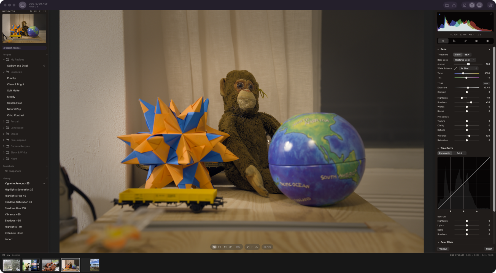
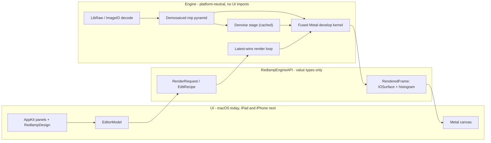

# Redlamp

**A native, open-source RAW photo editor for Mac, iPad, and iPhone that anyone who knows Lightroom will find familiar.**

Redlamp is built from scratch in Swift and Metal for Apple Silicon. It focuses on one thing, *developing* photos, and aims to do it faster and more natively than anything else on the platform.



> **Status: pre-alpha, iteration 2 (macOS).** The core RAW pipeline, the Develop workspace, and the Basic, Tone Curve, Color Mixer, Color Grading, and Effects adjustments and noise reduction work today, and so does **masking with linear and radial gradients** and local adjustments. Crop, healing, brush and AI masks, lens corrections, and the iPad and iPhone apps are next. See [Where we are](#where-we-are) and the [Roadmap](#roadmap).
>
> This README is the project's primary status page and is kept up to date as work lands. *Last updated: 29 September 2026.*

---

## Contents

- [Why Redlamp](#why-redlamp)
- [Goals](#goals)
- [Where we are](#where-we-are)
- [Screenshots](#screenshots)
- [Roadmap](#roadmap)
- [Getting started](#getting-started)
- [Using Redlamp](#using-redlamp)
- [Architecture](#architecture)
- [Contributing](#contributing)
- [License and acknowledgements](#license-and-acknowledgements)

---

## Why Redlamp

A **red lamp** is the darkroom safelight: the one light you can work by without fogging the paper. That is the idea behind the project: you can see and shape your photo freely, and the original is never harmed.

Lightroom defined how millions of photographers edit, but it is a cross-platform application that doesn't feel at home on a Mac, iPad, or iPhone, and it is tied to a subscription and a cloud. Redlamp keeps the workflow photographers already know, including the panel layout, slider names and ranges, and keyboard shortcuts, and rebuilds everything underneath as a native, GPU-first, open-source application.

**Redlamp is an editor, not a catalog.** It opens folders of photos and stores edits in small sidecar files next to them. Library management is a separate, later track.

## Goals

1. **Immediately familiar to Lightroom users.** The Develop module's layout, panel order, slider names, ranges and defaults, and single-key shortcuts all carry over. We copy conventions, never Adobe's assets.
2. **Best-in-class masks.** Masks are part of the architecture from day one. Every edit is a layer (adjustments plus a mask), with Lightroom's model of components combined by add, subtract, and intersect, and on-device AI masks built on Apple Vision and SAM-class models.
3. **Modern, native UI and great UX.** The UI follows the macOS and iOS 26 design language. Liquid Glass is used only on floating chrome, and editing surfaces stay neutral grey so nothing distorts your color judgment. It is direct-manipulation first, every action can be undone, and there are no modal dialogs while you edit.
4. **Extreme responsiveness.** Rendering and UI are strictly separated. Slider changes should reach the screen within a frame (under 16 ms), and the UI thread never waits on the engine, the disk, or the GPU.
5. **Serious color science.** The pipeline is scene-referred and linear, with DCP camera profiles, LUTs, lens profiles, and our own looks. Some looks are fitted by measurement to match popular camera and editor renderings.
6. **Computational photography built into the editing workflow.**
   - **Best-in-class denoise:** a classical, noise-profiled denoiser plus an on-device AI denoiser that runs directly on raw data.
   - **Focus stacking in one click,** from detecting a bracketed sequence to an editable result, with pro-level strategies and retouching. This is something Lightroom doesn't offer at all, and dedicated tools only offer with a lot of friction.
   - **AI where it clearly wins:** masks, removal and upscaling, running on the device with no cloud and no credits.
7. **Mac, iPad, and iPhone from one engine.** A single platform-neutral engine sits under thin, native shells for each platform. Edits move between devices through iCloud Drive, Files, and Photos.
8. **Open source (MPL-2.0).** The license is compatible with the App Store. Algorithms are implemented clean-room from papers and specifications.

## Where we are

### What works today (macOS)

**RAW pipeline (our own, GPU-first)**
- [x] Decodes RAW files through LibRaw (unpacking only). Black levels, white balance, demosaicing, and color are all done by Redlamp on the GPU.
- [x] Bayer demosaic (Malvar–He–Cutler), a first-generation X-Trans demosaic, and linear DNG support (for example iPhone ProRAW).
- [x] Hot pixels are repaired before demosaicing, judged against each photo's own noise level.
- [x] Tested on Sony **ARW**, Canon **CR3**, Nikon **NEF**, Fujifilm **RAF** (X-Trans), and Apple **ProRAW DNG**, plus JPEG, HEIC, TIFF, and PNG.
- [x] The demosaiced image is cached as a full mip pyramid, so interactive renders sample the right resolution for the zoom level.
- [x] A single fused Metal kernel applies every per-pixel adjustment. Frames are delivered as IOSurfaces, so pixels are never copied between engine and UI.
- [x] Latest-wins render scheduling: a burst of slider events collapses to the newest one.
- [x] Rendering stays off the main thread while you drag a slider. Frames go straight to the canvas, which a dedicated display-link thread presents, and each view observes only the values it shows.
- [x] Both side panels are AppKit: the histogram, tool strip and every Develop and Masking panel on the right, and the Navigator, Presets, Snapshots and History on the left. They match the SwiftUI originals pixel for pixel, and a component harness is used to build and review them (see [Component harness](#component-harness)).
- [x] Temperature and tint use a proper camera white-balance model (Robertson's method with the camera's color matrix). As Shot, Auto, and the illuminant presets all work.

**Develop adjustments that render**
- [x] **White balance:** Temp and Tint, the presets, Auto, and the eyedropper.
- [x] **Basic:** Exposure, Contrast, Highlights, Shadows, Whites, Blacks, Vibrance, and Saturation, plus the **Auto** button.
- [x] **Treatment** (Color or B&W) and six built-in **profiles**: Redlamp Color, Neutral, Vivid, Landscape, Portrait, and Monochrome.
- [x] **Tone Curve:** a parametric curve with split points, and a point curve with presets.
- [x] **Color Mixer:** HSL (Hue, Saturation, Luminance, and All) and a per-color mode, working in OKLCh.
- [x] **Color Grading:** 3-way and individual wheels, Blending, and Balance. It also tints B&W images for split-toning.
- [x] **Effects:** post-crop vignette (amount, midpoint, roundness, feather) and zoom-stable film grain.
- [x] **Noise reduction** (Detail panel): Luminance with Detail and Contrast, and Color with Detail and Smoothness. It is scaled to each photo's own noise, read from the DNG NoiseProfile tag or measured from the raw data when the file opens. It runs as a cached stage in front of the fused kernel, so other sliders stay as fast as before, and exports render in tiles.

**Masking** (Lightroom's model)
- [x] Each mask is a layer: its own adjustments plus a mask built from components. Components combine with **Add**, **Subtract**, and **Intersect**, and each can be inverted.
- [x] **Linear and radial gradient** components.
  - Draw them on the photo.
  - Drag the handles to move, resize, and rotate; radial gradients also have a Feather control.
  - Pins select the other masks.
- [x] **Local adjustments:** Temp, Tint, Exposure, Contrast, Highlights, Shadows, Whites, Blacks, Hue, and Saturation, plus the mask's Amount (0–200%).
- [x] **Mask management:** a red mask overlay (`O`), and a mask list where you can show and hide, rename, duplicate, "duplicate and invert", reset, and delete masks.
- [x] **Fast by design:** masks are evaluated analytically, per pixel, inside the same fused GPU kernel. Up to 16 masks cost well under a millisecond extra at Fit.
- [x] The **Create New Mask** grid already lists every Lightroom mask type (Subject, Sky, Background, Objects, People, Landscape, Brush, Color, Luminance, and Depth Range). Each shows the phase it arrives in.

**Workspace**
- [x] A Lightroom-style layout. On the left: Navigator, Presets, Snapshots, and History. In the center: the photo, with the filmstrip below. On the right: histogram, tool strip, and the Develop panels in Lightroom's order.
- [x] **Sliders:** click to jump, drag to adjust, Shift-drag for fine control, double-click to reset, and click the value to type one in. Option-dragging a tone slider shows clipping, as in Lightroom.
- [x] **Panels:** double-click a panel or group title to reset it, and Option-click a header for Solo Mode.
- [x] **Histogram:** clipping indicators, and you can drag across it to adjust Blacks, Shadows, Exposure, Highlights, or Whites.
- [x] **Presets:** hover to preview, click to apply. Snapshots and full undo/redo history are also available.
- [x] **Viewing:** Fit, Fill, 1:1, and 2:1 zoom, click to zoom, pan, pinch, before/after, and a clipping overlay.
- [x] **Lightroom Classic's keyboard shortcuts**: 79 actions on 83 key bindings, from one registry that also drives the menus and an in-app ⌘/ reference (see [Keyboard shortcuts](#keyboard-shortcuts)).
- [x] **Culling while you develop:** star ratings, pick/reject flags and color labels, shown on the filmstrip. There's also an Info overlay (`I`), Lights Out (`L`), full-screen preview (`F`), and Paste from Previous (`⌥⌘V` and the Previous button).
- [x] Non-destructive edits, saved automatically to a sidecar file next to each photo (`IMG_1234.ARW.redlamp`).
- [x] Export to JPEG, plus a headless `redlamp` command-line tool for rendering and export.

**Panels laid out but not yet rendering** (shown dimmed, with the phase they arrive in): Texture, Clarity, and Dehaze (both global and in masks), Sharpening in the Detail panel, and the Lens Corrections, Transform, and Calibration panels. The Crop, Healing, and Red Eye tools show what is coming and when.

### Measured performance

Measured on an Apple M1 Ultra with a Release build.

| Operation | Time |
| --- | --- |
| Open a 24–26 MP raw file (decode, GPU upload, demosaic, pyramid) | 70–250 ms |
| Interactive render at Fit (every adjustment, fused) | 0.6–3 ms |
| Interactive render at Fit with two gradient masks | ~1.3 ms |
| Interactive render at 1:1 (full 26 MP frame) | ~13 ms |
| Full-resolution export render (24–26 MP) | ~45 ms |
| Full-resolution export render with noise reduction (24 MP, tiled) | ~100 ms |
| Interactive render at 1:1 while dragging a noise-reduction slider | 9–10 ms (p95 14 ms) |

Dragging a slider at 120 events a second (`scripts/perf-sweep.sh`), with every panel open:

| Main thread during the drag | Iteration 2 | Off-main rendering | AppKit panels |
| --- | --- | --- | --- |
| Time busy | 100% | ~54% | ~34% |
| Typical run-loop iteration (median) | — | 2.3 ms | 0.17 ms |
| Slowest 5% of iterations | 157 ms | ~8 ms | ~5 ms |
| Slowest 1% of iterations | — | ~13 ms | ~8 ms |

With both side panels in AppKit, most of what remains is Core Animation committing the redrawn layers and the engine's frames arriving; SwiftUI is down to about 2% of the main thread.

### Known limitations

- Highlights and Shadows are per-pixel approximations for now. Lightroom-quality versions need edge-aware local tone mapping, which arrives with Clarity and Texture in Phase 2.
- X-Trans demosaicing is a first-generation interpolation. A Markesteijn-class demosaic (and AMaZE and RCD for Bayer sensors) comes in Phase 2.
- Color uses a single-illuminant Adobe-derived matrix: LibRaw's, or the DNG's own ColorMatrix. Dual-illuminant DCP profiles come in Phase 2.
- Masks support linear and radial gradients only. Brush, range, and AI masks come in Phases 2 and 3.
- Local Whites and Blacks are approximated with tonal-region gains.
- The app is not sandboxed yet (required later for the Mac App Store), and there is no iPad or iPhone app yet.

**Fixed in iteration 2:**
- White balance now works for linear DNGs such as iPhone ProRAW.
- The Navigator outlines the zoomed viewport.
- The loading placeholder now shows while a photo decodes.
- Dragging a slider no longer stutters. Every change used to re-render every panel and wait on the canvas's drawable on the main thread.

## Screenshots

**Masking on a Sony A7 III ARW.** A linear gradient darkens and cools the sky, and a feathered radial gradient warms and lifts the trees. The red overlay shows the selected mask's coverage.


**Color grading on a Canon EOS R6 CR3.** Split-toned shadows and highlights with the 3-way wheels.


**Black & white on a Sony A7 III ARW.** The Selenium preset plus vignette and grain, with every step in History.


**Fujifilm X-T3 X-Trans RAF at 1:1.** The full-resolution frame renders in about 13 ms, and the Color Mixer is shown in HSL mode.


**iPhone 12 Pro ProRAW (linear DNG).** Portrait orientation, with highlight recovery and blues tuned in the Color Mixer.


<sub>Sample images are CC0 files from [raw.pixls.us](https://raw.pixls.us). The screenshots are generated by `mise run screenshots`.</sub>

## Roadmap

Every phase ships on Mac, iPad, and iPhone. The Lightroom feature inventory in [`docs/lightroom-feature-inventory.md`](docs/lightroom-feature-inventory.md) tags every Lightroom feature with the phase that delivers it.

### Phase 0: Foundations *(largely done)*
- [x] mise and Tuist workspace, module graph with enforced boundaries, and an engine purity gate
- [x] LibRaw vendored as a pinned, static XCFramework (macOS, iOS, and Simulator; arm64 only)
- [x] Engine API contract, headless CLI, and a unit and engine smoke-test suite
- [x] Lightroom feature inventory
- [x] GitHub Actions CI: purity gate, SwiftFormat lint, build, and tests, with cached LibRaw and fixtures
- [ ] Performance lab: CI runner plus tethered iPhone and iPad, with per-tier regression gates that block merges
- [ ] Golden-image color regression tests (ΔE2000)
- [ ] Written clean-room policy and a license-audit gate in CI

### Phase 1: First light *(in progress; macOS iterations 1 and 2 done)*
- [x] RAW pipeline core, fused develop kernel, cached pyramid, and latest-wins rendering
- [x] Develop workspace on macOS, Basic panel, histogram, before/after, sidecars, undo, and export
- [x] Layer and mask engine, with linear and radial gradient masks, local adjustments, and the Masking panel
- [ ] Sandboxed XPC decode helper on macOS and in-process decoding on iOS
- [ ] Render scheduler with priority lanes, tile cancellation, and thermal awareness
- [ ] iPad and iPhone shells (compact layout, touch, Apple Pencil)
- [ ] Coordinated sidecar I/O for iCloud Drive and Files

### Phase 2: Develop parity
- [ ] Texture, Clarity, and Dehaze, plus edge-aware Highlights and Shadows
- [ ] Detail panel: sharpening and **best-in-class classical noise reduction**, profiled per camera and ISO, on raw data, with Lightroom's luminance and color controls
- [ ] Better demosaicing (RCD and AMaZE for Bayer, Markesteijn for X-Trans) and highlight reconstruction
- [ ] Full DCP camera profiles (dual and triple illuminant), ICC input profiles, **LUT import** (`.cube`, `.3dl`, HaldCLUT), and a Profile Browser
- [ ] Lens corrections from the lensfun database, Adobe LCP import, and DNG opcodes
- [ ] Crop and straighten, Transform and Upright
- [ ] Brush, color range, and luminance range masks, and Vision AI masks (subject, sky, background, people)
- [ ] Slider-feel calibration against Lightroom, and Lightroom XMP preset import
- [ ] Photos library integration and a Photos editing extension

### Phase 3: Pro masking, healing, AI denoise, focus stacking, and looks
- [ ] SAM-class object and people-part masks, mask refinement, mask presets, and syncing masks across photos
- [ ] Healing, clone, and content-aware remove, with AI inpainting on the device
- [ ] **AI Denoise:** an on-device model working on raw data, matching or beating the best commercial denoisers, with a fast 1:1 preview and non-destructive results
- [ ] **Focus stacking v1:** stacks detected automatically in the filmstrip, alignment (including focus breathing and handheld sequences), depth-map and pyramid fusion strategies, a retouch brush, and results that stay fully editable
- [ ] Manufacturer lens corrections embedded in RAW files (Sony, Fujifilm, Panasonic, OM System)
- [ ] `redlamp-profiler`: look matching by black-box measurement (Fujifilm film simulation–inspired looks, Adobe-compatible looks), with a DCP and LUT writer

### Phase 4: 1.0
- [ ] Lightroom XMP sidecar import, HDR/EDR editing and export, and batch export
- [ ] **AI-assisted focus stacking:** learned fusion and halo suppression, occlusion and motion handling, and good stacks from fewer or handheld frames
- [ ] **AI Super Resolution** (2x and 4x) that stays faithful and doesn't invent detail
- [ ] Accessibility, usability testing on every platform, and App Store releases

### Later
- CloudKit sync with lightweight proxy RAW files
- A library and catalog, tethered shooting, and panorama and HDR merge
- More AI features, subject to the research below: lens blur, distraction removal, and personalized auto settings

### Research

The [AI and computational photography brief](docs/research/ai-and-computational-photography-brief.md) covers denoise, AI across the product (upscaling, masks, removal, auto settings), and focus stacking. Its first round of [findings](docs/research/ai-findings.md) gives a verdict for each workstream, a license matrix for every candidate model and dataset, the engine AI architecture, measured Core ML and focus-stacking prototypes (in [`research/prototypes/`](research/prototypes/README.md)), and proposed changes to the phases above.

A [study of darktable](docs/research/darktable-findings.md), the most complete open-source raw developer, covers how it handles cameras, color science, modules and masks, presets and sidecars, lenses, performance and UX, and what Redlamp should adopt, do better or skip in each area. Every recommendation from both studies is tracked, with its decision, phase and status, in the [research intake tracker](docs/research/research-tracker.md).

## Getting started

### Requirements

- An Apple Silicon Mac running **macOS 26** or later
- **Xcode 26** or later
- [**mise**](https://mise.jdx.dev), which installs the pinned Tuist, SwiftFormat, and SwiftLint versions

### Build and run

```bash
git clone https://github.com/pdcgomes/redlamp.git && cd redlamp
mise install              # Tuist, SwiftFormat, SwiftLint at pinned versions
mise run generate         # builds vendored LibRaw, then generates Redlamp.xcworkspace
mise run fixtures         # optional: downloads CC0 sample raw files into tests/fixtures/raw
mise run run -- tests/fixtures/raw    # build and launch, opening a folder
```

You can also run `mise run run` on its own and choose **File → Open Folder…** (⌘O), or drop a folder or files onto the window. Redlamp reopens the last folder on launch.

### Command-line tool

The `redlamp` CLI uses the same engine API as the app. It is useful for scripting, quick checks, and reproducing renders.

```bash
mise run render -- info ~/Pictures/DSC01234.ARW
mise run render -- render ~/Pictures/DSC01234.ARW -o out.jpg --size 2048 \
  --set exposure=0.5 --set shadows=30 --wb auto --profile vivid
```

### Development tasks

| Task | What it does |
| --- | --- |
| `mise run generate` (`g`) | Vendor LibRaw and generate the Xcode workspace |
| `mise run build` (`b`) | Build the macOS app |
| `mise run run` (`r`) | Build and launch; pass a folder after `--` |
| `mise run test` (`t`) | Engine purity gate plus all unit and engine tests |
| `mise run lint` (`l`) | Purity gate, SwiftFormat (lint mode), and SwiftLint |
| `mise run vendor` (`v`) | Build the vendored C/C++ libraries (pinned version and SHA in `config/vendored-libs.json`) |
| `mise run fixtures` | Download CC0 sample raw files |
| `mise run render` | Build and run the `redlamp` CLI |
| `mise run screenshots` | Regenerate the README screenshots (needs Screen Recording permission) |
| `mise run harness` (`h`) | Build and launch the UI component harness |
| `scripts/perf-sweep.sh [Debug\|Release] [parameter] [script]` | Drag a slider for 3 s and report main-thread smoothness. `PROFILE=1` adds a main-thread profile; `PANELS=swiftui` measures the SwiftUI panels |
| `scripts/harness-capture.sh <scene> <png> [mode]` | Screenshot a harness scene; with `side` mode, `swift scripts/parity-diff.swift <png>` scores it and `scripts/parity-rows.swift` compares it row by row |

### Component harness

`mise run harness` opens Redlamp Harness, a development app for building and reviewing UI components in isolation, in the spirit of a design-system workbench. It hosts the real frameworks and the real editor (with a sample photo open, copied to a temporary folder so reviews never write sidecars):

- **Foundations:** the palette, the type ramp (SwiftUI and AppKit side by side), and metrics.
- **Controls and Panels:** every component in every state worth reviewing, each with a note on what would be wrong with it.
- **Parity:** a SwiftUI original and its AppKit port at the same width, shown side by side, as a difference blend (identical pixels are black), as an onion skin, or flickering. The inspector has knobs for drawing constants and a **Copy values** button. `--probe` measures SwiftUI and AppKit elements one by one and writes the sizes to `/tmp/redlamp-probe.txt`.
- **Performance:** drags a slider at 120 events a second through each implementation and reports how busy the main thread got.


To add a component, write a scene in `apps/RedlampHarness/Sources/Scenes/` and register it in `BuiltInScenes.swift`. Against their SwiftUI originals, the ports score a mean difference of 0.05 (Tone Curve) to 0.12 (Basic) grey levels, with at least 99.97% of pixels within 24 levels; the rest is anti-aliasing on the slider thumbs.

## Using Redlamp

### Supported files

- **Raw:** through LibRaw 0.22, covering most cameras from Sony (A1, A7 II–IV, A7C, A7R II–V, A7S, A9, a6x00, ZV, RX), Canon, Nikon, Fujifilm (including X-Trans), Panasonic, OM System and Olympus, Pentax, Leica, Hasselblad, and DNG, including Apple ProRAW. Uncompressed, compressed, and lossless compressed formats are all supported. Bodies released after LibRaw 0.22 need a LibRaw update. A camera is verified once a CC0 sample file is in the decode regression suite (`tests/decode/cameras.json`), which checks layout, crop, black and white levels, white balance, color matrix, orientation and the sensor data on every test run; today that covers the Sony A7 III, Fujifilm X-T3, Canon EOS R6, Nikon Z 6 and iPhone 12 Pro ProRAW.
- **Bitmap:** JPEG, HEIC, TIFF, and PNG.

### Keyboard shortcuts

Redlamp follows Lightroom Classic's Develop-module shortcuts. Press **⌘/** in the app for the complete, always-current list (generated from the same registry the app uses). Shortcuts for tools that arrive later are already reserved and shown dimmed, with the phase they arrive in.

| Area | Keys |
| --- | --- |
| **View** | `\` before/after · `Z` or `Space` toggle Fit/100% · `⌘=` / `⌘-` zoom in/out · `J` clipping · `I` cycle info overlay · `L` cycle Lights Out · `F` full-screen preview · `T` / `F5` toolbar · `Y`, `⌥Y`, `⇧Y` side-by-side before/after *(Phase 2)* |
| **Panels** | `Tab` hide side panels · `⇧Tab` hide all · `F6` filmstrip · `F7` left panel · `F8` right panel · `⌘1`–`⌘9` open or close Basic, Tone Curve, Color Mixer, Color Grading, Detail, Lens Corrections, Transform, Effects, Calibration |
| **Navigation** | `←` `→` or `⌘←` `⌘→` previous/next photo |
| **Develop** | `,` `.` select previous/next setting · `-` `=` decrease/increase it (`⇧` for larger steps) · `V` black & white · `W` white-balance selector · `⌘U` auto settings · `⇧⌘U` auto white balance · `⇧⌘C` / `⇧⌘V` copy/paste settings · `⌥⌘V` paste from previous · `⇧⌘R` reset all · `⌘N` new snapshot · `⌘Z` / `⇧⌘Z` undo/redo · hold `⌥` to turn group titles into "Reset …" |
| **Tools** | `D` Edit · `⇧W` Masking · `M` linear gradient · `⇧M` radial gradient · `R` crop, `A` crop aspect lock *(Phase 2)* · `Q` healing *(Phase 3)* · `K` brush, `⇧J` color range, `⇧Q` luminance range *(Phase 2)* · `⇧Z` depth range *(Phase 3)* |
| **Masking** | `O` show/hide overlay · `⇧O` cycle overlay color · `H` show/hide pins · `⌫` delete selected mask · `Esc` cancel drawing or leave the tool |
| **Rating & flags** | `0`–`5` star rating · `[` `]` decrease/increase rating · `P` pick · `X` reject · `U` unflag · `6`–`9` red, yellow, green, blue label · add `⇧` to any of these to also move to the next photo |
| **File** | `⌘O` open folder · `⇧⌘E` export · `⌘/` keyboard shortcuts |

Ratings, flags and color labels are saved in the photo's sidecar and shown on the filmstrip.

**Slider gestures:**
- Double-click a label or thumb to reset it.
- Shift-drag for fine control.
- Option-drag Exposure, Highlights, Shadows, Whites, or Blacks to preview clipping.
- Click a value to type a new one, and use the arrow keys to step it (Shift steps by ten).

### Where edits are stored

Edits are saved as JSON next to the photo, in `IMG_1234.ARW.redlamp`. The file holds the edit recipe and any snapshots. Only values that differ from the defaults are stored, so sidecars stay small. Resetting a photo completely deletes its sidecar.

Sidecars carry two version numbers:
- The **format version** describes the file's syntax. Older formats are migrated silently when read.
- The **process version** records the rendering behavior the edit was made with, like Lightroom's process versions. An edit keeps rendering the way it did when it was made; moving it to a newer process is always an explicit choice.

Settings a newer Redlamp wrote, but this version doesn't know, are kept and written back unchanged. A sidecar written with a newer format or process version is never overwritten or deleted, and sidecars are only rewritten when their content changes.

## Architecture

The rendering engine and the UI are completely separate. The UI talks to the engine only through `RedlampEngineAPI`, a small, message-based, value-type API. Rendered frames come back as IOSurfaces, so pixels are never copied across the boundary.



**The pipeline:**
1. LibRaw unpacks the sensor data.
2. The GPU applies black and white levels and the as-shot white balance, and repairs hot pixels.
3. The image is demosaiced and cached as a mip pyramid. Its noise level is read from the file or measured from the raw data.
4. When noise reduction is on, a spatial stage denoises the pyramid texels behind the rendered region: an à-trous wavelet decomposition in a noise-stabilized opponent space, with each scale's detail shrunk where it is indistinguishable from noise. The result is cached per region, pyramid level and settings.
5. The fused develop kernel first evaluates every mask's coverage for the pixel. It then applies, in order, each with its local (masked) adjustments where they exist: the white-balance ratio, the camera matrix to linear Rec.2020 (scene-referred), exposure and tone in log space, a hue-preserving tone curve that rolls highlights off smoothly to white at +4 EV above middle grey, OKLCh color work (vibrance, saturation, mixer, grading, profile look), the tone-curve lookup, vignette and grain, all still in Rec.2020 primaries, and finally a hue-preserving fit into the output gamut (sRGB or Display P3) and the output encoding.

**Packages** (`packages/`; `Tuist/ProjectDescriptionHelpers/Module.swift` is the single source of truth for which package may depend on which):

| Package | Role |
| --- | --- |
| `RedlampEngineAPI` | Public contract: `EditRecipe`, parameter schema, render requests and frames, `EditingEngine` |
| `RedlampKernels` | Metal shaders (demosaic, develop, histogram) and their parameter layouts |
| `RedlampColor` | Color spaces, color-temperature math (Robertson), camera color model, OKLab |
| `RedlampServices` | Decoding (LibRaw, ImageIO) and thumbnails |
| `RedlampDocument` | Sidecars, snapshots, presets, library scanning, export writers |
| `RedlampEngine` | Sessions, the GPU pyramid, render loop, analysis (auto WB, auto tone, eyedropper) |
| `RedlampCanvas` | Metal canvas that samples frame IOSurfaces directly, presented from its own display-link thread; zoom and pan |
| `RedlampDesign` | Design tokens (colors, type, metrics) for SwiftUI and AppKit, and the AppKit panel components: slider rows, panel sections, control rows |
| `RedlampUI` | Develop panels, sidebar, filmstrip, `EditorModel` |

**Apps** (`apps/`): `RedlampMac`, the macOS app and composition root; `RedlampCLI`, the headless `redlamp` tool; and `RedlampHarness`, the UI component harness (see [Component harness](#component-harness)).

**The panels are AppKit, drawn to match SwiftUI pixel for pixel.** SwiftUI re-walks its whole view tree on every change, however small, so dragging one slider in a window full of panels kept the main thread busy. The Develop panels are built from `RedlampDesign`'s AppKit components instead: each control observes only the values it shows (a small `Tracker` over Swift Observation) and redraws only itself. Native controls such as menus and segmented pickers stay SwiftUI, each hosted on its own. The SwiftUI originals are kept as the reference the ports are checked against (`--swiftui-panels` runs the app with them).

**Engineering principles:**
- **Swift for everything on the CPU side, Metal for every pixel.** C and C++ appear only in vendored libraries.
- **Swift 6 language mode**, with warnings treated as errors, on arm64 only.
- **CI-enforced boundaries.** `scripts/check-engine-purity.sh` fails the build if an engine package imports a UI framework, or if a UI package imports engine internals.
- **The parameter schema is shared.** Slider names, ranges, defaults, and whether a parameter renders yet are defined once, in `RedlampEngineAPI`, and both the engine and the UI read them.

## Contributing

Redlamp is at an early stage and moving quickly. Issues and discussion are very welcome.

- **Clean-room policy.** No GPL or LGPL code. Algorithms are implemented from published papers and specifications. Please don't port code from darktable, RawTherapee, or other GPL projects, and if you have studied a GPL implementation of something, please don't write Redlamp's version of it.
- **Third-party components:** LibRaw is used under its CDDL-1.0 option. Planned additions are lcms2 (MIT) and the lensfun database (CC-BY-SA, data only).
- **Conventions:**
  - Run `mise run lint` and `mise run test` before sending changes.
  - Keep engine code free of UI imports.
  - New parameters go into the schema in `RedlampEngineAPI/Sources/ParameterSpec.swift`.
- **Fixtures:** `mise run fixtures` downloads CC0 samples. Please don't commit RAW files.

## License and acknowledgements

Redlamp is licensed under the **Mozilla Public License 2.0**; see [LICENSE](LICENSE).

Redlamp builds on the work of others:
- [LibRaw](https://www.libraw.org) for RAW unpacking (CDDL-1.0)
- [raw.pixls.us](https://raw.pixls.us) for CC0 sample files
- Björn Ottosson's [OKLab](https://bottosson.github.io/posts/oklab/) color space
- Robertson's method for correlated color temperature
- The Malvar–He–Cutler demosaicing paper
- Krzysztof Narkowicz's filmic curve fit

Redlamp is not affiliated with Adobe. Lightroom is a trademark of Adobe Inc. and is referenced only to describe familiar workflows.
