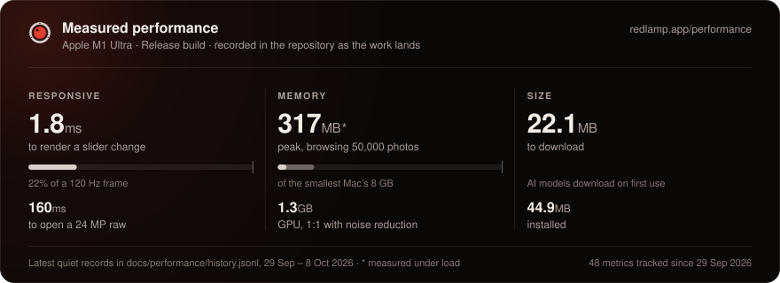
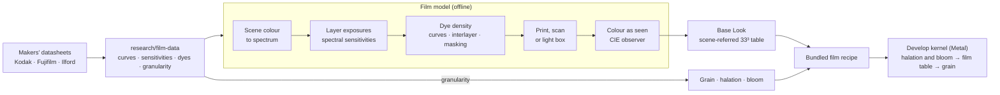
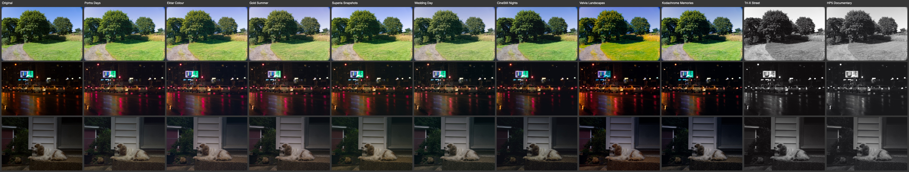
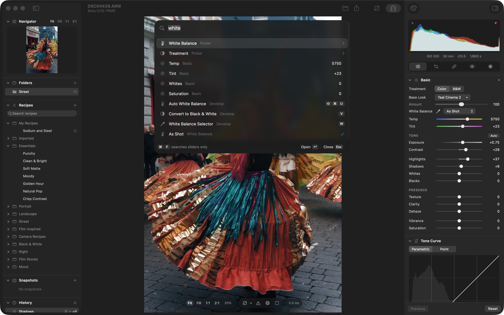
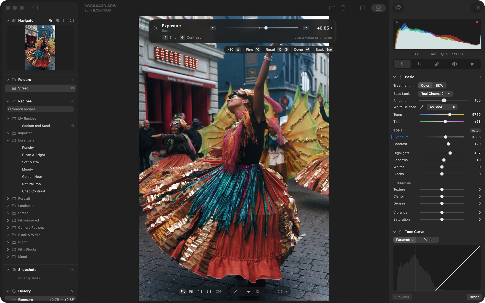
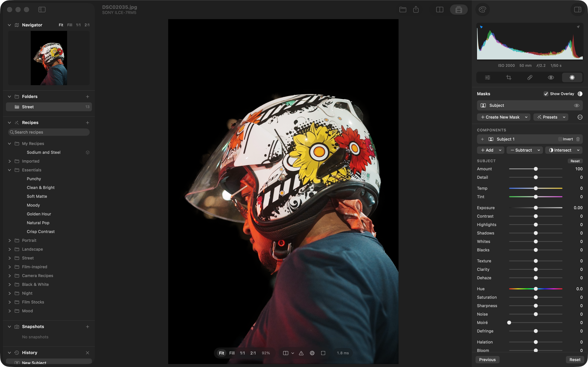
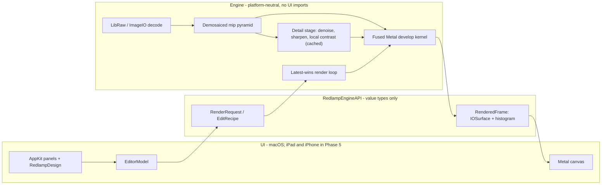

<p align="center">
  
</p>

<h1 align="center">
  <picture>
    <source media="(prefers-color-scheme: light)" srcset="docs/brand/logo/redlamp-lockup-light.svg">
    
  </picture>
</h1>

<p align="center"><b>A native, open-source RAW photo editor for Mac, iPad, and iPhone that anyone who knows Lightroom will find familiar.</b></p>

<p align="center">
  <a href="https://github.com/pdcgomes/redlamp/actions/workflows/ci.yml?query=branch%3Amain"></a>
  <a href="https://github.com/pdcgomes/redlamp/releases/latest"></a>
  <a href="#installation"></a>
  <a href="#architecture"></a>
  <a href="LICENSE"></a>
  <br>
  <a href="https://redlamp.app"></a>
  <a href="https://discord.gg/4VZpxpgRCA"></a>
  <a href="https://ko-fi.com/pdcgomes"></a>
</p>

Redlamp is built from scratch in Swift and Metal for Apple Silicon. It focuses on one thing, *developing* photos, and aims to do it faster and more natively than anything else on the platform.


<p align="center"><a href="https://www.youtube.com/watch?v=lvdLOtdbUX4"><b>Watch the film: Introducing Redlamp</b></a> (1:42, on YouTube)</p>

> **Status: pre-alpha, iteration 2 (macOS).** The core RAW pipeline and the Develop workspace work today: Basic (with Texture, Clarity and Dehaze), Tone Curve, Color Mixer, Color Grading, Detail (noise reduction and sharpening), Effects, lens corrections, crop and Upright, **masking** (gradients, brush, color and luminance range, Subject, Sky, Background, People and its parts, Objects, Landscape and Depth Range) with local adjustments, **healing and removal** (Heal, Clone, Remove, content-aware or generative, and Remove Dust), **focus stacking**, and **Recipes**, Redlamp's presets, profiles and LUTs in one, with film looks measured from cameras' own renderings and **[film simulations](#film-simulations)** of 36 film looks from 30 stocks, built from the manufacturers' datasheets. AI Denoise and the rest of Develop parity are next, then 1.0 and the iPad and iPhone apps. See [Where we are](#where-we-are), the [Roadmap](#roadmap), and [how Redlamp compares with Lightroom](docs/lightroom-comparison.md).
>
> This README is the project's primary status page and is kept up to date as work lands. *Last updated: 4 October 2026.*

<!-- performance-card:begin -->
<p align="center">
  <a href="https://redlamp.app/performance">
    <picture>
      <source media="(prefers-color-scheme: light)" srcset="docs/images/performance-card-light.svg">
      
    </picture>
  </a>
</p>
<!-- performance-card:end -->

---

## Contents

- [Why Redlamp](#why-redlamp)
- [Goals](#goals)
- [Where we are](#where-we-are)
- [Film simulations](#film-simulations)
- [Screenshots](#screenshots)
- [Roadmap](#roadmap)
- [Installation](#installation)
- [Getting started](#getting-started)
- [Component harness](#component-harness)
- [Using Redlamp](#using-redlamp)
- [Architecture](#architecture)
- [Contributing](#contributing)
- [Support Redlamp](#support-redlamp)
- [License and acknowledgements](#license-and-acknowledgements)

---

## Why Redlamp

A **red lamp** is the darkroom safelight: the one light you can work by without fogging the paper. That is the idea behind the project: you can see and shape your photo freely, and the original is never harmed.

Lightroom defined how millions of photographers edit, but it is a cross-platform application that doesn't feel at home on a Mac, iPad, or iPhone, and it is tied to a subscription and a cloud. Redlamp keeps the workflow photographers already know, including the panel layout, slider names and ranges, and keyboard shortcuts, and rebuilds everything underneath as a native, GPU-first, open-source application.

**Redlamp works on your folders.** It keeps a working set of folders, as Lightroom Classic's Folders panel does, and stores edits in small sidecar files next to the photos. A library built the same way is planned for 1.0 ([roadmap](#roadmap)): folders on your disk stay the organisation, ratings, keywords and collections are saved with each photo, and an index on your Mac, there only for speed, is designed for libraries of a million photos.

## Goals

1. **Immediately familiar to Lightroom users.** The Develop module's layout, panel order, slider names, ranges and defaults, and single-key shortcuts all carry over. We copy conventions, never Adobe's assets. One deliberate exception: presets, profiles and LUTs are all **Recipes**, and a profile is a recipe's **Base Look**, because for most people they all do one thing, give a photo a look. Lightroom's words still work as tooltips and in search.
2. **Best-in-class masks.** Masks are part of the architecture from day one. Every edit is a layer (adjustments plus a mask), with Lightroom's model of components combined by add, subtract, and intersect, and on-device AI masks built on Apple Vision and SAM-class models.
3. **Modern, native UI and great UX.** The UI follows the macOS and iOS 26 design language. Liquid Glass is used only on floating chrome, and editing surfaces stay neutral grey so nothing distorts your color judgment. It is direct-manipulation first, every action can be undone, and there are no modal dialogs while you edit.
4. **Extreme responsiveness.** Rendering and UI are strictly separated. Slider changes should reach the screen within a frame (under 16 ms), and the UI thread never waits on the engine, the disk, or the GPU.
5. **Serious color science.** The pipeline is linear and scene-referred up to the tone curve: white balance, exposure, tone, Dehaze and the detail stage, and their masked versions, work on the light the camera recorded, and the color controls, the point curve, vignette and grain work on the tone-mapped image after it ([the pipeline](#architecture)). It uses the camera profiles DNG files embed, and has LUTs, lens profiles, and our own looks. Some looks are fitted by measurement to cameras' own renderings.
6. **Computational photography built into the editing workflow.**
   - **Best-in-class denoise:** a classical, noise-profiled denoiser plus an on-device AI denoiser that runs directly on raw data.
   - **Focus stacking in one click,** from detecting a bracketed sequence to an editable result, with pro-level strategies and retouching. This is something Lightroom doesn't offer at all, and dedicated tools only offer with a lot of friction.
   - **AI where it clearly wins:** masks, removal and upscaling, running on the device with no cloud and no credits.
7. **Mac first, then iPad and iPhone from the same engine.** A single platform-neutral engine sits under thin, native shells. The Mac editor comes first; iPad and iPhone follow once the main features are complete, and edits will move between devices through iCloud Drive, Files, and Photos.
8. **Open source (MPL-2.0).** The license is compatible with the App Store. Algorithms are implemented clean-room from papers and specifications.

## Where we are

### What works today (macOS)

**RAW pipeline (our own, GPU-first)**
- [x] Decodes RAW files through LibRaw (unpacking only). Black levels, white balance, demosaicing, and color are all done by Redlamp on the GPU.
- [x] Bayer demosaic by directional filtering with a posteriori decision (Menon, Andriani and Calvagno, 2007), with a dual pass that takes plain green where the neighbours differ only by noise, Markesteijn's X-Trans demosaic (ported from LibRaw under its CDDL licence), and linear DNG support (for example iPhone ProRAW).
- [x] Hot pixels are repaired before demosaicing, judged against each photo's own noise level.
- [x] Row and column banding is measured in the sensor's masked (optical-black) margins and subtracted with the black level, only where the margins show more than their own noise.
- [x] **DNG gain maps** (OpcodeList2), such as phones' lens shading correction, are applied before demosaicing, and noise reduction scales with the noise they amplify.
- [x] **Highlight reconstruction:** channels are no longer clipped at 1 after white balance, and photosites that did clip are rebuilt from their bright unclipped neighbours, using the colour measured around the clipped area. Fully blown areas stay neutral. From process version 15, highlights clipped in one or two colours keep the colour of what's around them when Highlights or Exposure pull them below white, so a clipped sky stays blue instead of turning lilac, and areas clipped in every colour fade smoothly to neutral.
- [x] Tested on Sony **ARW**, Canon **CR3**, Nikon **NEF**, Fujifilm **RAF** (X-Trans), Apple **ProRAW DNG** and Google **Pixel DNG**, plus JPEG, HEIC, TIFF, and PNG.
- [x] The demosaiced image is cached as a full mip pyramid, so interactive renders sample the right resolution for the zoom level.
- [x] A single fused Metal kernel applies every per-pixel adjustment. Frames are delivered as IOSurfaces, so pixels are never copied between engine and UI.
- [x] Latest-wins render scheduling: a burst of slider events collapses to the newest one. Stills wait in two lanes, previews (look thumbnails) ahead of exports, and yield to the canvas between tiles, so an export never holds up a frame by more than a tile; a cancelled still stops at its next tile, and exports rest between tiles when the Mac runs hot.
- [x] Rendering stays off the main thread while you drag a slider. Frames go straight to the canvas, which a dedicated display-link thread presents, and each view observes only the values it shows.
- [x] Both side panels are AppKit: the histogram, tool strip and every Develop and Masking panel on the right, and the Navigator, Recipes, Snapshots and History on the left, built from the same panel component. The right column's panels match their SwiftUI originals pixel for pixel, and a component harness is used to build and review them (see [Component harness](#component-harness)).
- [x] Temperature and tint use a proper camera white-balance model (Robertson's method with the camera's color matrix). As Shot, Auto, and the illuminant presets all work.

**Develop adjustments that render**
- [x] **White balance:** Temp and Tint, the presets, Auto, and the eyedropper.
- [x] **Basic:** Exposure, Contrast, Highlights, Shadows, Whites, Blacks, Vibrance, and Saturation, plus the **Auto** button.
- [x] **Treatment** (Color or B&W) and **Base Looks** (Lightroom's profiles) with an Amount slider (0–200) and a browser that renders every look on the photo. There are six built-in looks (Redlamp Color, Neutral, Vivid, Landscape, Portrait and Monochrome) and 15 film-style looks built on 3D look tables: slide, chrome, negative, cinema, bleach and black and white through color filters. Four of them are measured from cameras' own renderings by the look profiler (see [Recipes and looks](#recipes-and-looks)).
- [x] **Tone Curve:** a parametric curve with split points, and a point curve with presets.
- [x] **Color Mixer:** HSL (Hue, Saturation, Luminance, and All) and a per-color mode, working in OKLCh.
- [x] **Color Grading:** 3-way and individual wheels, Blending, and Balance. It also tints B&W images for split-toning.
- [x] **Effects:** post-crop vignette (amount, midpoint, roundness, feather, and Highlights to keep bright areas bright under a darkening vignette) and zoom-stable film grain.
- [x] **Noise reduction** (Detail panel): Luminance with Detail and Contrast, and Color with Detail and Smoothness. It is scaled to each photo's own noise: the DNG NoiseProfile tag, else its camera's calibrated profile at its ISO, else measured from the raw data when the file opens (a raw far cleaner than its camera's profile has had noise reduction in camera, so the measurement wins). Luminance keeps fine texture: wavelet shrinkage judges each detail by its neighbourhood, and at 1:1 and in exports a non-local-means pass guided by that result brings back texture where the photo repeats it. It runs as a cached stage in front of the fused kernel, so other sliders stay as fast as before, and exports render in tiles.
- [x] **Sharpening** (Detail panel): Amount, Radius, Detail and Masking, in the same cached stage after noise reduction. It is noise-aware: detail is measured on a denoised copy of the luminance and applied to the untouched image, so the photo's noise and grain pass through as they were instead of being sharpened. Detail moves from a halo-limited unsharp mask towards Richardson–Lucy deconvolution of the Radius's blur, and holds back halos on strong edges; Masking keeps flat areas untouched. It boosts luminance detail in stops, so it doesn't depend on exposure and leaves colors alone.
- [x] **Texture and Clarity** (global): gains on medium (about 2–8 px) and larger (about 8–64 px) luminance detail, taken from the image pyramid in the same cached stage, so tiles and zoom levels agree. Negative values soften. For new edits (process version 9) Clarity is edge-aware: a strong edge isn't its detail, so it puts no bright and dark bands along a skyline or around a tree. From process 11, Texture, Clarity and sharpening read one decomposition of the noise-reduced photo: Texture keeps its strength on texture but no longer outlines strong edges, adds less noise, and matches a downscaled export at every preview size, and dragging Texture, Clarity, Amount, Detail or Masking takes a fraction of a millisecond at 1:1.
- [x] **Dehaze** (global and in masks): the dark channel prior (He, Sun and Tang, 2009) with the airlight and a haze map measured when the photo opens; negative values add a neutral veil. For new edits (process version 8) the haze map follows the photo's edges, so the sky beside a tree or a ridge has no pale glow.

**Masking** (Lightroom's model)
- [x] Each mask is a layer: its own adjustments plus a mask built from components. Components combine with **Add**, **Subtract**, and **Intersect**, and each can be inverted, as can the whole mask (**Invert**, as Lightroom's).
- [x] **Linear and radial gradient** components.
  - Draw them on the photo.
  - Drag the handles to move, resize, and rotate; radial gradients also have a Feather control.
  - Pins select the other masks.
- [x] **Brush** (`K`): A and B brushes and Erase (hold Option), with Size, Feather, Flow, Density and Auto Mask, and pen pressure. Strokes are kept as vectors in the edit and painted on the GPU in mask space (up to 4096 px), redrawing only the stroke being painted. `[` and `]` or ⌘-scroll change the size, with Shift the feather; the brush's ring shows its size as it changes, also from the panel's sliders, and Space-drag moves the photo while you paint. In every tool the wheel and pinch zoom.
- [x] **Luminance Range** (`⇧Q`) and **Color Range** (`⇧J`): sample with the eyedropper, then shape the range with four handles (Show Luminance Map) or Refine up to five color samples. They select on the photo with its global edit, so the selection follows white balance and exposure.
- [x] **AI masks:** Subject, Background, People (each person, or parts: face skin, eyebrows, eye sclera, iris, lips, teeth, and hair from iPhone mattes) and Sky, with Apple Vision's built-in models and nothing to download. **Objects:** hover to preview, then click, drag a box around the thing or brush over it to select it; click or brush again to add, with Option to take away (Segment Anything 2.1, an 80 MB download on first use). **Depth Range:** from a photo's own depth map (iPhone), or estimated by Depth Anything 3 (or V2 Small). **Landscape:** a picker lists the regions found (water, vegetation, mountains, architecture, natural and artificial ground, and snow), each with its share of the photo, to mask together or one each, with adaptive presets such as Brighten Snow: SAM 3, converted to Core ML (a 988 MB download, under Meta's SAM License, which comes with it; Snow's prompt, added later, is in the app with a copy of the licence, so it needs no new download); the same model adds hair on any photo, facial hair, body skin and clothes to People. Sky is Segment Anything prompted inside a classical sky estimate, combined with Depth Anything 3 (converted to Core ML, a 336 MB download) once it is downloaded; then every edge pixel is solved at full size against the sky's own colour, so twigs, leaf gaps and wires keep their own coverage. Subject, Background, People and Objects edges are solved per pixel too (closed-form matting), which brings back stray hairs and beard curls (see the [bake-off](docs/research/notes/MSK-17-sky-bakeoff.md)); with ViTMatte downloaded (Settings › Models, 109 MB), Subject, Background and People also gain the stray strands it finds beyond them.
- [x] AI masks are computed from the photo without its edit and kept as bitmaps in the edit, so they never move when you edit and render the same everywhere. **Update AI Masks** recomputes them with today's models, pasted settings recompute them for the new photo, **Refine Edges** solves their edges again from the photo, as masks of their kind are made now (bringing back strands an older mask missed), the **Refine Edge Brush** solves an edge again, hair by hair, wherever you paint over it (kept with the mask, so Update AI Masks applies it again), and **Feather** and **Edge** soften an AI mask's edge or move it out or in. From process version 13, coarse AI masks (iPhone mattes, face parts) are refined again at the size the photo is drawn at, so they stay sharp at full size. From process version 14, a Sky mask's edit reaches only the sky's share of each pixel along its edge, so twigs and leaves keep their own colour and brightness when the sky is darkened or warmed, and **Feather** and **Edge** shape an AI mask's body while keeping its stray hairs.
- [x] **Mask presets:** Blue Sky, Brighten Subject, Darken Background, Smooth Skin, Even Skin Tone, Whiten Teeth, Pop Eyes, Brighten Snow and Enhance Vegetation compute their masks for each photo, on one photo or every selected photo at once; save your own from any mask.
- [x] **Beyond Lightroom:** a mask's **Detail** keeps only its textured (or only its flat) areas, and any mask can be reused as a component of another (**Existing Mask** in Add, Subtract and Intersect).
- [x] **Local adjustments:** Temp, Tint, Exposure, Contrast, Highlights, Shadows, Whites, Blacks, Texture, Clarity, Dehaze, Hue, Saturation, Sharpness, Noise, a Color swatch that tints what the mask covers, and Curves (RGB, red, green and blue), plus the mask's Amount (0–200%).
- [x] **Mask management:** one picker for every mask, also behind a mask's Add, Subtract and Intersect, which asks for a model's download in place. The list shows a thumbnail of each mask's coverage, and the photo shows the overlay while the pointer is over a mask, a component or a mask's pin. Each mask and each component has a menu (show and hide, rename, duplicate, "duplicate and invert", invert, reset, delete), masks and components drag to reorder, and Option-click on an eye shows one mask alone. **People** opens a picker of who is in the photo, as crops to tick, with the parts to mask, and a mask for each person if you like. A mask overlay (`O`) in Lightroom's modes (Color Overlay, on B&W, Image on Black or White, B&W, Image on B&W), colors and opacity.
- [x] **Fast by design:** gradients and ranges are evaluated per pixel inside the same fused GPU kernel, and brush and AI masks are read from GPU textures. Up to 16 masks cost well under a millisecond extra at Fit.
- [x] **Models on demand:** Settings › Models lists the downloadable models with their size, and removes them. Every model runs on the Mac; photos are never uploaded. Each shows its licence, which comes with the download. Models still under licence review are offered only when you turn on evaluation models.

**Focus stacking** (a separate Stack workspace)
- [x] **Stacks are found for you:** runs of frames with the same camera settings a moment apart, whose sharp region moves from frame to frame, get a "Focus stack detected: N frames" banner with **Merge**, and the filmstrip slides up for a few seconds to show it. Bursts, time-lapses and pans aren't offered. **Photo › Merge to Focus Stack…** and **Edit Focus Stack…**, also in the command palette, open the Stack workspace from the menus.
- [x] **The result develops like a raw.** Frames are stacked as demosaiced camera RGB before any edit, so every Develop slider, white balance included, works on it. The stack is a small `.redlampstack` document beside the frames; the merged pixels are cached and rebuilt when needed.
- [x] Alignment follows focus breathing, rotation and shift, brightness is matched frame to frame, and a depth map records which frame is sharpest where.
- [x] **Auto, Smooth and Detail:** Auto takes tone and color from the depth map and fine detail from the sharpest frames near it; Smooth blends between frames for clean surfaces; Detail keeps the sharpest detail from anywhere, for hair and bristles.
- [x] **The Stack workspace:** leave frames out, switch methods (each merge is cached), view the depth map, and **retouch** by painting the frame under the cursor, a chosen frame or another method's result over the merge.
- [x] One frame is in memory at a time, and `redlamp stack` does the same from the command line.

**Workspace**
- [x] A Lightroom-style layout. On the left: Navigator, Folders, Recipes, Snapshots, and History, as collapsible panels like the Develop panels. In the center: the photo, with the filmstrip below. The filmstrip slides in when the pointer reaches the bottom of the window and away once it leaves; with **Hide Automatically** turned off (View › Filmstrip, the filmstrip's own right-click menu, or Settings › Appearance) it stays up, and the photo is fitted above it. F6 hides it altogether. On the right: histogram, tool strip, and the Develop panels in Lightroom's order, each a card whose header shows a grey Edited chip while the panel has edits, with how many kinds of setting it has changed, as Copy Settings lists them ("Edited · 2"); hovering it lists them.
- [x] **Folders**, as in Lightroom Classic: add folders with **+**, ⌘O or by dropping them on the window, and they're remembered (by bookmark, so a folder that's renamed or moved is followed). Each shows as a tree with the number of photos in every folder; click one to show it and everything beneath it in the filmstrip, its number counting its subfolders' photos too, as in Lightroom Classic, or turn off **Show Photos in Subfolders** (View menu or the folder's context menu) to see only its own photos. Nothing on disk is moved or changed. The filmstrip follows the disk by itself: photos copied in, deleted, renamed or rewritten appear, leave or update in place, a photo still being copied waits until it's complete, and the selection moves to the next photo when its own is deleted. A folder on a disk that isn't connected is dimmed with a question mark, **Locate…** points it at where it went, and it comes back when the disk does. Each folder reopens on the photo you last had in it.
- [x] **Built to stay fast with any number of photos:** a folder lists without reading a single sidecar (badges follow from light reads, visible photos first); thumbnails decode in parallel on every core at the cell's size, from the smallest preview the raw file embeds that's big enough (found by LibRaw; 3 to 11 times faster than ImageIO's full-size one for Sony, Canon and Nikon files), are kept within a 128 MB budget in memory and cached on disk in one file per folder (at most 1 GB), and are warmed in the background while you're not waiting; the filmstrip is AppKit with reused cells, so 50,000 photos cost what a screenful does. Focus stacks are looked for one folder at a time in the background, and remembered. See [Measured performance](#measured-performance) and the [design](docs/plans/2026-10-02-folders-design.md).
- [x] **Sliders:** click to jump, drag to adjust, Shift-drag for fine control, double-click to reset, and click the value to type one in or drag it to scrub (Shift for fine control). Option-dragging a tone slider shows clipping, as in Lightroom. The Color Grading wheels' hue, saturation and luminance, the tone curve's splits and its selected point's Input and Output, Base Look Amount, and in the Masks panel the overlay's Opacity, the Refine Edge brush's Size and the four stops of a luminance or depth range have values too.
- [x] **Panels:** double-click a panel or group title to reset it, and Option-click a header for Solo Mode. The left column's panels collapse the same way when you click their headers, and Option-click shows only one.
- [x] **Panel switches,** as in Lightroom: the eye at the right of every Develop panel's header but Basic's turns the panel's settings off and on, each a step in History. A panel that's off keeps its settings, dimmed, and does nothing to the photo, so Detail off is no sharpening and no noise reduction, and Lens Corrections off leaves out the lens correction the file carries. Changing one of its settings, or resetting it, turns it back on. The switches are saved with the edit and travel with the panel's settings when they're copied, pasted or synced.
- [x] **Histogram:** clipping indicators, and you can drag across it to adjust Blacks, Shadows, Exposure, Highlights, or Whites. While the pointer is over the photo, the line under it shows the R, G and B percentages there, or its L*a*b* values (relative to D50) with **Show L*a*b* Values** in the histogram's right-click menu, the View menu or ⌘K, read from the render without the overlays.
- [x] **Recipes** (Lightroom's presets, profiles and LUTs, in one): 39 bundled recipes in eight groups, including camera-style ones built from Fujifilm-style recipe cards. Hover to preview, click to apply, then adjust the recipe's Amount. You can search (Lightroom's words work), mark favorites, save the current edit as a recipe with a settings checklist (⇧⌘N), and import or export `.redrecipe`, `.cube`, `.3dl` and HaldCLUT files (LUTs made for camera log footage too, with their input space chosen on import, in the panel and the Recipe Lab). Lightroom develop presets (`.xmp`) import too, one, several or a folder at a time, by the menu or by dropping them on the panel, with a report of what came across exactly, approximately or not at all ([what maps](docs/recipes/lightroom-presets.md)). Snapshots are also available.
- [x] **History** with full undo and redo. Each step shows an icon for what it did, and the value before and after ("Exposure 0.00 → +0.50"). Every time you open a photo a new session starts. The earlier sessions are kept with the photo (the last 20) and listed under the current one, and choosing one of their steps brings that edit back as a new step.
- [x] **Camera-recipe controls** in the Effects panel: Dynamic Range, Color Chrome, Chrome FX Blue, and red and blue white-balance shift.
- [x] **Viewing:** Fit, Fill, 1:1, and 2:1 zoom, click to zoom, pan, pinch, and a clipping overlay. **Sensor clipping** (`⌥J`) marks the photosites the camera clipped, in the colour of each clipped channel (black where all three did), whatever the edit has done since; the **colour-assessment view** (`⇧L`) puts the photo on middle grey inside a white frame (ISO 12646). **Before/After** (`\`) in three layouts, full frame, side by side and a diagonal split, cycled with `Y` and `⇧Y`; the original is rendered once and cached, so edits don't re-render it.
- [x] **Themes:** Neutral greys by default, so nothing tints your judgment of color, plus a Redlamp theme and 20 dark and light families with a tint control, from the toolbar's Theme button or **Settings** (⌘,), which also has an About tab. The command palette follows the app's theme or takes one of its own.
- [x] **Lightroom Classic's keyboard shortcuts**: 104 actions on 100 key bindings, from one registry that also drives the menus and an in-app ⌘/ reference (see [Keyboard shortcuts](#keyboard-shortcuts)).
- [x] **Command palette** (⌘K): every action, with its shortcut shown beside it, every Develop slider, and pickers for white balance, treatment, Base Looks, recipes, Before / After, snapshots and history, all from the keyboard.
  - ↵ on a slider shrinks the palette to a slider bar over the photo: ← → step it (⇧ ×10, ⌥ finer), ↑ ↓ move to the next slider, and you can type a value or `x+0.3`. A run of presses is one history step.
  - Typing a name and a value, such as `exposure 0.7` or `temp 5600k`, sets it straight from the search.
  - Moving through a picker previews each choice on the photo; Esc goes back one level.
  - A hint bar always shows the keys that work right now, and each opening shows a tip.
  - ⌘F opens it for sliders only, searching by name or the words people use (Lightroom's older names too).
- [x] **Sliders by hand:** ⌘-scroll over any slider adjusts it (Shift coarse, Option fine), and value fields accept arithmetic such as `x+10`.
- [x] **Culling while you develop:** star ratings, pick/reject flags and color labels, shown on the filmstrip. There's also an Info overlay (`I`), Lights Out (`L`), full-screen preview (`F`), and Paste from Previous (`⌥⌘V` and the Previous button).
- [x] **Copy, paste and sync settings, as Lightroom does:** Copy Settings… (`⇧⌘C`) opens a checklist of every setting and mask, remembered for next time; Paste (`⇧⌘V`) applies what was ticked, and recomputes the pasted AI masks for the photo. ⌘- and ⇧-click select several photos in the filmstrip: Sync… (`⇧⌘S`) and Paste reach all of them in the background, with Undo, and Auto Sync (`⌥⇧⌘A`) repeats every change. Right-click a photo in the filmstrip to copy its settings or paste onto it without opening it; on a selected photo, the menu has the same Copy, Paste and Sync items.
- [x] Non-destructive edits, saved automatically to a sidecar file next to each photo (`IMG_1234.ARW.redlamp`).
- [x] **Export dialog** (`⇧⌘E`): JPEG, HEIC and AVIF (lossy, with quality and an optional file size limit) or PNG and TIFF (lossless, with TIFF compression), 8, 10 or 16 bits, sRGB or Display P3. Resize by long edge, short edge, width and height, megapixels or percentage, keep all metadata, all but the location, or none (the first two also embed the edit recipe in the file's XMP, [format](docs/recipes/sidecar-format.md)), and choose the folder and file name. Built-in and saved presets, and Export with Previous (`⌥⇧⌘E`) repeats the last export without the dialog.
- [x] **Report a Bug or Send Feedback** (the toolbar's Feedback button, the Help menu or the command palette, and Report… beside an error): files a GitHub issue for you, with no GitHub account needed, under an area picked from a list that mirrors the app (such as Masking › Objects), suggested from what you were doing. The report carries what you did in the last minutes, the open photo's camera and edit, and the Mac's details, and you see all of it before it's sent ([what it contains](#reporting-bugs-and-feedback)). Help › Your Reports lists what you've sent, with each issue's state and replies.
- [x] **Test Your Camera** (Help menu or the command palette): the camera bench checks how your camera's raw files decode and compares Redlamp's rendering of each with the JPEG the camera saved inside it, on your Mac. It groups photos by camera and raw mode, picks a few of each, shows them side by side and asks one question, then sends only the measurements, which you see first, to add to the [cameras page](https://redlamp.app/cameras) ([how it works](docs/camera-bench.md)). `redlamp camera-bench` runs the same checks from the command line.
- [x] **What's New:** after an update, the release's highlights open once, in the welcome window's look: the logo rises, the highlights are listed, and each has a page with a screenshot and a button that opens it, such as Test Your Camera…. **Help › What's New in Redlamp** shows the recent ones again. They come from redlamp.app, so they can be written after a release ships; when they can't be had, nothing opens and the next launch tries again.
- [x] A headless `redlamp` command-line tool for rendering and export. Exports smaller than the photo are developed at full resolution and downscaled last, so sharpening, noise reduction and texture look the same at every size.

### Recipes and looks

- [x] **One `.redrecipe` format** for presets, profiles and LUTs: an explicit list of setting groups, an optional Base Look pinned by content hash, immutable versions, and namespaced ids ready for sharing ([format](docs/recipes/recipe-format.md), [JSON Schema](docs/recipes/recipe-format.schema.json)).
- [x] **Camera recipe cards:** Fujifilm-style recipes (film simulation, dynamic range, highlight and shadow tone, color, Color Chrome, white balance shift, grain) are a recipe dialect you can type in as the card lists them ([mapping](docs/recipes/camera-card-mapping.md)).
- [x] **Measured film looks.** The profiler fits a look to cameras' own JPEGs of the same raw files: Fujifilm raws carry the camera's rendering inside. On photos the fit never saw:

  | Base Look | Like | Measured from | ΔE to the camera (lower is closer) |
  | --- | --- | --- | --- |
  | Standard v3 | Provia | 120 photos, 50 bodies | 3.26 (Redlamp Color: 5.38) |
  | Vivid Slide v2 | Velvia | 10 bodies | 3.39 (4.45) |
  | Chrome v3 | Classic Chrome | 18 photos, 5 bodies | 4.61 (5.72) |
  | Soft Slide v2 | Astia | 5 photos, 3 bodies, provisional | 4.57 (12.84) |

  The others are hand-designed until there's data for them ([look development](docs/recipes/look-development.md#measured-base-looks-the-profiler)). Looks keep Redlamp's own names.
- [x] **Film simulations:** 36 looks from 30 stocks, built physically from the manufacturers' datasheets, including pushed, overexposed, bleach-bypass and cross-processed variants, with halation, bloom and film grain, a **Film Looks** window and film icons in the Base Look menu ([details](#film-simulations)).
- [x] **Look-development tools:** lint (neutral axis, skin hue, monotonic lightness, banding, clipping) on a synthetic chart, golden renders per recipe version, style fingerprints and a fitter, and the **Recipe Lab** in the [component harness](#component-harness).
- [x] **An agent recipe studio** ([docs](docs/recipes/agent-studio.md)): curator, colorist and critic agents work through `redlamp mcp` on briefs drawn from public-domain references. People approve the briefs and pick the winners in the Recipe Lab, and the critics are only trusted after they agree with human picks on held-out pairs.

### In progress

- **Focus stacking:** lens corrections before alignment, halo handling, vendor focus-bracketing tags for detection, and baking a stack to DNG.
- **Remove, Heal and Clone** (`Q`): click the photo to add a spot. **Remove** fills it from the photo around it, patch by patch, continuing edges that run into it (content-aware fill), and with Click picks set to Person or Object, a click removes the whole person or object, shaped by its mask. **Find** outlines things named in words wherever they are in the photo (trash, litter, plastic bags, bottles, cans, cigarette butts, power lines, cables, signs, traffic cones, cars, people and birds, with OWLv2 from Settings › Models), and a click on one removes it the same way, or **Remove All** removes them all; Heal and Clone find their own source nearby; drag the spot or its source to move it, or its handle to resize it, and change Heal or Clone, Size, Feather and Opacity in the panel. Heal matches the source's texture to the light around the spot. Drag instead of clicking to brush a spot along a scratch, wire or twig. `H`, or **Show Spots** at the top of the panel, hides the spots, their outlines and pins, and shows them again, so a fill can be judged with nothing drawn over it; the selected spot stays selected, with its fills still to choose from. **Remove Dust** finds the soft, colourless specks sensor dust leaves on smooth areas (sky, walls, water) and heals them in one step; with several photos selected, it heals the specks found in the same place on the sensor in two or more of them (frames showing the same scene around a speck, as from a tripod, count as one), in all of them (one Undo puts the others back), and **Visualize Spots** shows the photo's edges in white so the rest stand out. Spots are saved with the edit, paste with Copy Settings, and `redlamp render --remove x,y,radius`, `--heal` or `--clone` (or `--remove-brush` and the others through several points) adds one from the command line, as `--remove-dust 50` heals the dust found and `--remove-found car` removes what's found by name.
- **Tools not yet working:** the Red Eye tool shows what is coming and when.

### Measured performance

Measured on an Apple M1 Ultra with a Release build. Every figure since 29 September, the benchmark harness's runs, and what's got faster or slower are at [redlamp.app/performance](https://redlamp.app/performance), from [`docs/performance/history.jsonl`](docs/performance/history.jsonl); `scripts/perf-record.sh` records a run. The card at the top of this README is drawn from the same history by `scripts/perf-card.py`, each figure from its latest quiet record, and CI fails when the card falls behind the history.

Each release's download and installed size is recorded from its zip on GitHub (`scripts/perf-history.py release`). 0.2.8 is a 22.2 MB download and 45.0 MB installed; the AI models download only when a feature first needs them. 0.2.5 added Generative Remove and its MLX frameworks and grew to 115.6 MB installed; 0.2.6 ships stripped of debugging symbols, with LibRaw built hidden so unused code is dropped and the decode service sharing the app's frameworks (AUD-11), and is smaller than 0.2.4 was. 0.2.7 ships its 69 Base Look tables compressed, each read when a render first uses it (AUD-11), and is 17% smaller installed than 0.2.6. The release check fails a bundle with an Intel slice, debugging symbols or more than its size budget (`scripts/check-release-bundle.sh`).

| Operation | Time |
| --- | --- |
| Open a 24–26 MP raw file (decode, GPU upload, demosaic, pyramid) | 70–250 ms |
| Interactive render at Fit (every adjustment, fused) | 0.6–3 ms |
| Interactive render at Fit with two gradient masks | ~1.3 ms |
| Interactive render at 1:1 (full 26 MP frame) | ~13 ms |
| Full-resolution export render (24–26 MP) | ~45 ms |
| Full-resolution export render with noise reduction (24 MP, tiled) | ~100 ms |
| Focus stack of 25 × 17 MP Canon CR3 frames (decode, align, depth map, fuse) | ~8 s |
| Focus stack of 109 × 4 MP JPEG frames | ~15 s |
| Reopen a merged focus stack from its cache | ~0.1 s |
| Detail stage on a 1:1 region (about 10 MP of pyramid texels), GPU time: noise reduction, Texture and Clarity | ~5 ms, ~1 ms |
| Detail stage for a 2560 × 1600 view at 1:1 of a 24 MP frame, GPU time: noise reduction alone (Luminance 50); default sharpening, first render; while dragging Radius; while dragging Amount, Detail or Masking (cached analysis); while dragging Luminance | ~3.6 ms, ~7.2 ms, ~5.5 ms, ~2.2 ms, ~4.3 ms |

The detail stage holds about 1.3 GB of GPU memory at 1:1 on a 24 MP photo and 2.3 GB on a 60 MP one, with noise reduction and sharpening on (3.1 GB and 7.5 GB before the [memory audit](docs/research/research-tracker.md), AUD-03); large views render in tiles within its budget, and nothing is kept once rendering stops for half a second.

Folders and the filmstrip on 50,000 photos in 500 folders (`scripts/make-folder-fixture.sh`, then `--folders-perf`), measured while the Mac was busy with other work (load average about 18):

| Operation | Time |
| --- | --- |
| First photos in the filmstrip, Show Photos in Subfolders on | 14 ms |
| All 50,000 photos listed (500 folders, in parallel, in order) | 209 ms |
| The visible thumbnails, decoded from the raw files | 33 ms |
| Background warming from the raw files | 705 a second |
| Thumbnails from the disk cache | 6,210 a second |
| Main thread while listing, decoding and warming (p99) | 0.15 ms |
| Main thread while scrolling the filmstrip end to end (p99) | 1.4 ms |
| Peak memory, 152 MB before opening | 317 MB (531 MB before the [memory budgets](docs/plans/2026-10-02-folders-design.md#memory-budgets)); 207 MB idle after a memory-pressure trim |

Dragging a slider at 120 events a second (`scripts/perf-sweep.sh`), with every panel open:

| Main thread during the drag | Iteration 2 | Off-main rendering | AppKit panels |
| --- | --- | --- | --- |
| Time busy | 100% | ~54% | ~34% |
| Typical run-loop iteration (median) | — | 2.3 ms | 0.17 ms |
| Slowest 5% of iterations | 157 ms | ~8 ms | ~5 ms |
| Slowest 1% of iterations | — | ~13 ms | ~8 ms |

With both side panels in AppKit, most of what remains is Core Animation committing the redrawn layers and the engine's frames arriving; SwiftUI is down to about 2% of the main thread.

### Known limitations

- Highlights and Shadows are edge-aware for new edits (process version 7): each region moves by its brightness and keeps the texture inside it. Edits made before keep the per-pixel version, and they haven't yet been compared against Lightroom's own exports.
- Redlamp's exposure for Fujifilm raws differs from the camera's by up to ±0.9 EV depending on the body; the profiler removes it when measuring looks, and the engine fix is tracked (TON-14).
- Non-DNG raws use a single-illuminant Adobe-derived matrix (LibRaw's). DNGs interpolate their two calibrations by white balance, and since process 4 apply their embedded profile's HueSatMap, but the Temperature and Tint model still converts with one matrix. The profile's look (LookTable and tone curve) is offered as a Base Look under "In This Photo", Apple ProRAW's look comes with its gain table map, Apple's local tone mapping, so it renders the way the iPhone does. Importing `.dcp` files is deferred.
- Landscape masks (mountains, water, vegetation, ground, architecture, snow) and people parts beyond the face (body skin, clothes, and hair without an iPhone matte) come from SAM 3, under Meta's SAM License; a model trained on data Redlamp has rights to, which would replace it, doesn't exist yet ([plan](docs/plans/2026-10-01-masking-plan.md#m8-trained-heads-msk-12-msk-13-only-if-m7-says-so)).
- Objects (Segment Anything 2.1), Depth Range and Sky (Depth Anything V2 Small and 3) use open models trained partly on data Redlamp couldn't use itself, offered to everyone by the owner's decisions (tracker DEC-24, DEC-02). Vision's own tap-to-segment arrives with macOS 27.
- AI mask edges are solved per pixel when the mask is made, at up to 4096 px on the long side, so on larger photos they're slightly soft at 100%. For new edits (process version 13), masks coarser than that (iPhone mattes, face parts, masks made before edges were solved per pixel) are refined again where the photo is drawn, at its resolution (a guided filter, freedom-to-operate pending as DEC-05); where the photo has no edge for such a mask's to follow, it keeps its own, which is soft at full size.
- The app is not sandboxed yet (required later for the Mac App Store), but photos and focus-stack frames decode in a sandboxed service with no file access (`RedlampDecoder.xpc`, sent each file's bytes), never in the app, so a damaged file can't crash the editor while it decodes. These reads still parse files in the app itself: filmstrip thumbnails (a raw's embedded preview, through LibRaw, or ImageIO), the Portrait mattes and depth a photo carries, focus-stack detection, the metadata an export copies from its source, an imported HALD look, and the Camera Bench window (Help › Test Your Camera…). iPad and iPhone come in Phase 5.
- Sidecars are read and written under file coordination, so iCloud Drive syncs them safely and conflicting copies merge (the newest edit wins, the others become snapshots, and the rating, flag and label each come from the newest copy that set them). A photo that is open doesn't reload when another Mac changes its edit, but its next save merges the two edits instead of writing over the other Mac's.
- Generative Remove has been tested only on Macs with 16 GB of memory or more. Macs with less are offered it with a note that it hasn't been tested on them, where it may be slow or not work (RM-15).
- Nikon's High Efficiency NEFs (HE and HE\*) open from the Z 9, Z 8, Z f, Z 6III, Z5 II and Z50 II, through Redlamp's fork of LibRaw (CAM-12, CAM-30); other bodies' HE files, the ZR's among them, are refused until one of their samples is verified. The Z5 II's and Z50 II's NEFs, HE or lossless, open without a colour matrix, and Sony's 15-bit YCbCr ARWs (the A1 II's, the RX1R III's, the FX2's) with a magenta cast (CAM-21).

**Fixed in iteration 2:**
- Phase One IIQ files develop with the back's black levels subtracted and its calibration applied; they had a magenta cast.
- Hasselblad FFF files (Phocus's format) open as raws.
- White balance now works for linear DNGs such as iPhone ProRAW.
- The Navigator outlines the zoomed viewport.
- The loading placeholder now shows while a photo decodes.
- Dragging a slider no longer stutters. Every change used to re-render every panel and wait on the canvas's drawable on the main thread.

## Film simulations

Redlamp's film looks are **physical simulations**, built from the data in each manufacturer's own datasheet: characteristic curves, spectral sensitivities and dye spectra, digitised into [`research/film-data/`](research/film-data/). Most film presets are tuned by eye.

<table>
  <tr>
    <td align="center" width="16%"><a href="#portra-160"></a><br><b>Portra 160</b><br><sub>Colour negative</sub></td>
    <td align="center" width="16%"><a href="#portra-400"></a><br><b>Portra 400</b><br><sub>Colour negative</sub></td>
    <td align="center" width="16%"><a href="#portra-800"></a><br><b>Portra 800</b><br><sub>Colour negative</sub></td>
    <td align="center" width="16%"><a href="#ektar-100"></a><br><b>Ektar 100</b><br><sub>Colour negative</sub></td>
    <td align="center" width="16%"><a href="#gold-200"></a><br><b>Gold 200</b><br><sub>Colour negative</sub></td>
    <td align="center" width="16%"><a href="#ultramax-400"></a><br><b>UltraMax 400</b><br><sub>Colour negative</sub></td>
  </tr>
  <tr>
    <td align="center" width="16%"><a href="#superia-400"></a><br><b>Superia 400</b><br><sub>Colour negative</sub></td>
    <td align="center" width="16%"><a href="#pro-400h"></a><br><b>Pro 400H</b><br><sub>Colour negative</sub></td>
    <td align="center" width="16%"><a href="#cinestill-800t"></a><br><b>CineStill 800T</b><br><sub>Tungsten negative</sub></td>
    <td align="center" width="16%"><a href="#cinestill-50d"></a><br><b>CineStill 50D</b><br><sub>Daylight negative</sub></td>
    <td align="center" width="16%"><a href="#vision3-500t-2383"></a><br><b>Vision3 500T</b><br><sub>Cinema print</sub></td>
    <td align="center" width="16%"><a href="#vision3-250d-2383"></a><br><b>Vision3 250D</b><br><sub>Cinema print</sub></td>
  </tr>
  <tr>
    <td align="center" width="16%"><a href="#vision3-50d-2383"></a><br><b>Vision3 50D</b><br><sub>Cinema print</sub></td>
    <td align="center" width="16%"><a href="#eterna-vivid-250d-2383"></a><br><b>Eterna Vivid</b><br><sub>Cinema print</sub></td>
    <td align="center" width="16%"><a href="#provia-100f"></a><br><b>Provia 100F</b><br><sub>Slide</sub></td>
    <td align="center" width="16%"><a href="#velvia-50"></a><br><b>Velvia 50</b><br><sub>Slide</sub></td>
    <td align="center" width="16%"><a href="#velvia-100"></a><br><b>Velvia 100</b><br><sub>Slide</sub></td>
    <td align="center" width="16%"><a href="#ektachrome-e100"></a><br><b>Ektachrome</b><br><sub>Slide</sub></td>
  </tr>
  <tr>
    <td align="center" width="16%"><a href="#kodachrome-64"></a><br><b>Kodachrome 64</b><br><sub>Slide</sub></td>
    <td align="center" width="16%"><a href="#tri-x-400"></a><br><b>Tri-X 400</b><br><sub>Black and white</sub></td>
    <td align="center" width="16%"><a href="#t-max-100"></a><br><b>T-Max 100</b><br><sub>Black and white</sub></td>
    <td align="center" width="16%"><a href="#t-max-400"></a><br><b>T-Max 400</b><br><sub>Black and white</sub></td>
    <td align="center" width="16%"><a href="#hp5-plus"></a><br><b>HP5 Plus</b><br><sub>Black and white</sub></td>
    <td align="center" width="16%"><a href="#delta-100"></a><br><b>Delta 100</b><br><sub>Black and white</sub></td>
  </tr>
  <tr>
    <td align="center" width="16%"><a href="#delta-3200"></a><br><b>Delta 3200</b><br><sub>Black and white</sub></td>
    <td align="center" width="16%"><a href="#fp4-plus"></a><br><b>FP4 Plus</b><br><sub>Black and white</sub></td>
    <td align="center" width="16%"><a href="#pan-f-plus"></a><br><b>Pan F Plus</b><br><sub>Black and white</sub></td>
    <td align="center" width="16%"><a href="#tri-x-multigrade"></a><br><b>Darkroom Print</b><br><sub>Grade 2 print</sub></td>
    <td align="center" width="16%"><a href="#tri-x-multigrade-soft"></a><br><b>Soft Print</b><br><sub>Grade 1 print</sub></td>
    <td align="center" width="16%"><a href="#tri-x-multigrade-hard"></a><br><b>Hard Print</b><br><sub>Grade 4 print</sub></td>
  </tr>
  <tr>
    <td align="center" width="16%"><a href="#portra-400-overexposed"></a><br><b>Portra 400 · +2</b><br><sub>Overexposed</sub></td>
    <td align="center" width="16%"><a href="#portra-800-1600"></a><br><b>Portra 800 · 1600</b><br><sub>Pushed</sub></td>
    <td align="center" width="16%"><a href="#tri-x-1600"></a><br><b>Tri-X · 1600</b><br><sub>Pushed</sub></td>
    <td align="center" width="16%"><a href="#vision3-2383-bleach-bypass"></a><br><b>2383 Bleach Bypass</b><br><sub>Cinema print</sub></td>
    <td align="center" width="16%"><a href="#velvia-50-cross"></a><br><b>Velvia 50 · Cross</b><br><sub>Cross-processed</sub></td>
    <td align="center" width="16%"><a href="#provia-100f-cross"></a><br><b>Provia 100F · Cross</b><br><sub>Cross-processed</sub></td>
  </tr>
</table>

### How the film engine works

The datasheets drive an offline model that bakes each film into a Base Look table and its effects settings. Only those ship, and the GPU applies them while you edit:



The [film model](docs/plans/2026-09-30-film-looks-design.md) follows the scene's light through the film:
1. Each colour becomes a spectrum.
2. The film's three layers record that spectrum through their own sensitivities.
3. The characteristic curves turn exposure into dye, with interlayer effects and colour masking.
4. A negative is printed on its print stock or scanned the way a lab scanner reads it. A slide is lit on a light box.
5. The result is seen through the colour-matching functions of human vision.

Each look ships as a scene-referred Base Look. It takes the place of Redlamp's tone curve, so the film's own toe, shoulder and colour crossovers reach the photo. Each look also comes with the film's **grain, halation and bloom** in the Effects panel. Grain follows each datasheet's published granularity, and halation is strongest on CineStill, which has no anti-halation layer.


**Using them:**
- **Window ▸ Film Looks** (`⇧⌘L`) shows the open photo in every film. Hover over a card to preview the look in the editor; click to apply it with its grain, halation and bloom. Hold `⌥` over a card to see the photo before the look. Star a look to keep it under **Favourites**. The applied look's card has Grain, Halation and Bloom sliders, and the header an Amount slider. Tabs filter by colour negative, cinema, slide, and black and white.
- **Basic ▸ Base Look ▸ Film Stocks**, with each film's icon, sets only the look, as a Lightroom profile does.
- **Recipes ▸ Film Stocks** in the sidebar applies the look with its effects.
- **Effects ▸ Grain** (with a new **Color** slider for grain in each dye layer), **Halation** and **Bloom** work on any photo. Masks have their own **Halation** and **Bloom** sliders, to add glow to a sign or hold it back from a face.


### The catalogue

| | Look | Film | Rendered as | Grain / halation |
| --- | --- | --- | --- | --- |
|  | [Portra 160](#portra-160) | Kodak · Colour negative · ISO 160 | Scanned, Frontier-like | 15 / 7 |
|  | [Portra 400](#portra-400) | Kodak · Colour negative · ISO 400 | Scanned, Frontier-like | 20 / 8 |
|  | [Portra 800](#portra-800) | Kodak · Colour negative · ISO 800 | Scanned, Frontier-like | 27 / 9 |
|  | [Portra 800 · Pushed to 1600](#portra-800-1600) | Kodak · Colour negative · ISO 800 pushed to 1600 | Scanned, Frontier-like | 32 / 9 |
|  | [Ektar 100](#ektar-100) | Kodak · Colour negative · ISO 100 | Scanned, Frontier-like | 8 / 6 |
|  | [Gold 200](#gold-200) | Kodak · Colour negative · ISO 200 | Scanned, Frontier-like | 23 / 9 |
|  | [UltraMax 400](#ultramax-400) | Kodak · Colour negative · ISO 400 | Scanned, Frontier-like | 25 / 9 |
|  | [Superia 400](#superia-400) | Fujifilm · Colour negative · ISO 400 | Scanned, Frontier-like | 24 / 8 |
|  | [Pro 400H](#pro-400h) | Fujifilm · Colour negative · ISO 400 (discontinued) | Scanned, Frontier-like | 24 / 8 |
|  | [CineStill 800T](#cinestill-800t) | CineStill · Tungsten colour negative · ISO 800 | Scanned, Noritsu-like | 26 / 70, bloom 8 |
|  | [CineStill 50D](#cinestill-50d) | CineStill · Daylight colour negative · ISO 50 | Scanned, Noritsu-like | 12 / 60, bloom 6 |
|  | [Vision3 500T · 2383](#vision3-500t-2383) | Kodak · Cinema negative on print film · ISO 500 | Printed on 2383 and projected | 24 / 14, bloom 6 |
|  | [Vision3 250D · 2383](#vision3-250d-2383) | Kodak · Cinema negative on print film · ISO 250 | Printed on 2383 and projected | 20 / 12, bloom 6 |
|  | [Vision3 50D · 2383](#vision3-50d-2383) | Kodak · Cinema negative on print film · ISO 50 | Printed on 2383 and projected | 12 / 10, bloom 5 |
|  | [Eterna Vivid 250D · 2383](#eterna-vivid-250d-2383) | Fujifilm · Cinema negative on print film · ISO 250 (discontinued) | Printed on 2383 and projected | 21 / 12, bloom 6 |
|  | [Provia 100F](#provia-100f) | Fujifilm · Slide film · ISO 100 | Slide, viewed on a light box | 8 / 4 |
|  | [Velvia 50](#velvia-50) | Fujifilm · Slide film · ISO 50 | Slide, viewed on a light box | 9 / 4 |
|  | [Velvia 100](#velvia-100) | Fujifilm · Slide film · ISO 100 | Slide, viewed on a light box | 8 / 4 |
|  | [Ektachrome E100](#ektachrome-e100) | Kodak · Slide film · ISO 100 | Slide, viewed on a light box | 8 / 4 |
|  | [Kodachrome 64](#kodachrome-64) | Kodak · Slide film · ISO 64 (discontinued) | Slide, viewed on a light box | 10 / 4 |
|  | [Tri-X 400](#tri-x-400) | Kodak · Black and white negative · ISO 400 | Scanned | 37 / 5 |
|  | [T-Max 100](#t-max-100) | Kodak · Black and white negative · ISO 100 | Scanned | 18 / 4 |
|  | [T-Max 400](#t-max-400) | Kodak · Black and white negative · ISO 400 | Scanned | 22 / 5 |
|  | [HP5 Plus](#hp5-plus) | Ilford · Black and white negative · ISO 400 | Scanned | 40 / 5 |
|  | [Delta 100](#delta-100) | Ilford · Black and white negative · ISO 100 | Scanned | 16 / 4 |
|  | [Delta 3200](#delta-3200) | Ilford · Black and white negative · ISO 3200 | Scanned | 52 / 6 |
|  | [FP4 Plus](#fp4-plus) | Ilford · Black and white negative · ISO 125 | Scanned | 24 / 5 |
|  | [Pan F Plus](#pan-f-plus) | Ilford · Black and white negative · ISO 50 | Scanned | 12 / 4 |
|  | [Tri-X · Darkroom Print](#tri-x-multigrade) | Kodak · Ilford · Black and white print · grade 2 | Printed on paper | 34 / 5 |
|  | [Portra 400 · +2](#portra-400-overexposed) | Kodak · Colour negative · ISO 400 rated 100 | Scanned, Frontier-like | 16 / 8 |
|  | [Tri-X 400 · Pushed to 1600](#tri-x-1600) | Kodak · Black and white negative · ISO 400 pushed to 1600 | Scanned | 46 / 6 |
|  | [Tri-X · Soft Print](#tri-x-multigrade-soft) | Kodak · Ilford · Black and white print · grade 1 | Printed on paper | 34 / 5 |
|  | [Tri-X · Hard Print](#tri-x-multigrade-hard) | Kodak · Ilford · Black and white print · grade 4 | Printed on paper | 34 / 5 |
|  | [Vision3 500T · 2383 Bleach Bypass](#vision3-2383-bleach-bypass) | Kodak · Cinema negative on print film, bleach bypass · ISO 500 | Printed on 2383 and projected | 26 / 12, bloom 6 |
|  | [Velvia 50 · Cross-Processed](#velvia-50-cross) | Fujifilm · Slide film in C-41 · ISO 50 | Developed in C-41, scanned | 12 / 5 |
|  | [Provia 100F · Cross-Processed](#provia-100f-cross) | Fujifilm · Slide film in C-41 · ISO 100 | Developed in C-41, scanned | 11 / 5 |

Every look on the same photo:


### Examples

Each example shows three CC0 photos from the [look-development set](docs/recipes/look-development.md#the-look-development-set): a landscape, flowers and a night street. The top row is Redlamp's default rendering, the bottom row the film look with its grain, halation and bloom.

<a id="portra-400"></a>

####  Portra 400

Warm and gentle. Kind to skin, with soft greens and a little extra warmth in the highlights, as a Frontier lab scan renders it.


<a id="portra-160"></a>

####  Portra 160

Portra's slower sister: finer grain and an even gentler rendering, for portraits in good light.


<a id="portra-800"></a>

####  Portra 800

Fast Portra: warmer and richer, with more grain and a little more contrast.


<a id="portra-800-1600"></a>

####  Portra 800 · Pushed to 1600

Portra 800 rated at 1600 and pushed a stop, from Kodak's own push curves: denser shadows, more contrast and grain.


<a id="ektar-100"></a>

####  Ektar 100

Kodak's finest-grained colour negative: richer reds and deeper colour than Portra.


<a id="gold-200"></a>

####  Gold 200

Warm consumer film. Golden yellows, slightly greener foliage and more grain.


<a id="ultramax-400"></a>

####  UltraMax 400

Kodak's punchy everyday film: warm, saturated and a little grainy.


<a id="superia-400"></a>

####  Superia 400

Cooler than the Kodak stocks, with Fujifilm's greens.


<a id="pro-400h"></a>

####  Pro 400H

Fujifilm's discontinued wedding film, with its fourth colour layer: soft contrast, pastel skin and minty greens.


<a id="cinestill-800t"></a>

####  CineStill 800T

Vision3 500T without its anti-halation backing. Bright lights glow red-orange, the look of night streets and neon.


<a id="cinestill-50d"></a>

####  CineStill 50D

Vision3 50D without its anti-halation backing: very fine grain, daylight colour and glowing highlights.


<a id="vision3-500t-2383"></a>

####  Vision3 500T · 2383

The motion-picture look: a cinema negative printed on release print film. Softer and denser, with cool shadows and warm highlights.


<a id="vision3-250d-2383"></a>

####  Vision3 250D · 2383

Kodak's daylight cinema negative printed on 2383: the bright exterior look of feature films.


<a id="vision3-50d-2383"></a>

####  Vision3 50D · 2383

The finest-grained cinema negative on 2383: clean, saturated daylight.


<a id="eterna-vivid-250d-2383"></a>

####  Eterna Vivid 250D · 2383

Fujifilm's discontinued vivid daylight cinema negative, printed on 2383: more saturated than Vision3.


<a id="provia-100f"></a>

####  Provia 100F

Clean, natural slide film. Contrasty, with deep skies and dense shadows, exposed for the highlights.


<a id="velvia-50"></a>

####  Velvia 50

The landscape slide: saturated greens, yellows and blues, and more contrast still.


<a id="velvia-100"></a>

####  Velvia 100

Velvia's faster sibling: just as saturated, a touch gentler in the shadows.


<a id="ektachrome-e100"></a>

####  Ektachrome E100

Kodak's modern slide film: clean, neutral to cool, with fine grain.


<a id="kodachrome-64"></a>

####  Kodachrome 64

The legendary K-14 slide film, from Kodak's archived datasheet: warm reds, deep blues and dense shadows.


<a id="tri-x-400"></a>

####  Tri-X 400

Classic black and white. Bright and crisp, with pronounced, sharp grain.


<a id="t-max-100"></a>

####  T-Max 100

Kodak's finest-grained black and white: smooth, sharp and long in tone.


<a id="t-max-400"></a>

####  T-Max 400

Modern fast black and white: tighter grain than Tri-X and a longer tonal range.


<a id="hp5-plus"></a>

####  HP5 Plus

Softer and grainier than Tri-X, with a gentler shoulder.


<a id="delta-100"></a>

####  Delta 100

Ilford's fine-grained modern black and white.


<a id="delta-3200"></a>

####  Delta 3200

Ilford's fastest film: big, gritty grain and hard contrast for low light.


<a id="fp4-plus"></a>

####  FP4 Plus

Classic medium-speed black and white with a gentle shoulder.


<a id="pan-f-plus"></a>

####  Pan F Plus

Slow, ultra-fine black and white with rich contrast.


<a id="tri-x-multigrade"></a>

####  Tri-X · Darkroom Print

A darkroom print: deeper blacks and the paper's own contrast.


### Variants and processes

The same datasheets also describe how a film behaves when it's exposed or processed differently, and the model follows them:
- **Exposure.** A lab calibrates its scanner at box speed and prints each frame up or down until mid-grey is right. Overexposed highlights crowd onto the film's shoulder, and underexposed shadows block up at the film base.
- **Push processing** uses the datasheet's own curves for longer development.
- **Paper grades** use Ilford's published curve for each Multigrade filter.
- **Bleach bypass** leaves the developed silver in with the dyes, as neutral density where dye formed.
- **Cross-processing** develops a slide emulsion as a negative: its curves are mirrored and there's no orange mask. Slide datasheets don't publish C-41 curves, so this one is an approximation.

<a id="portra-400-overexposed"></a>

####  Portra 400 · +2

The popular overexposed Portra: two stops of extra exposure crowd the highlights onto the film's shoulder, for an airy, pastel, soft look.


<a id="tri-x-1600"></a>

####  Tri-X 400 · Pushed to 1600

Push processing: two stops underexposed and developed longer, using the datasheet's own longest D-76 curve. The shadows block up and grain and contrast rise.


<a id="tri-x-multigrade-soft"></a>

####  Tri-X · Soft Print

A gentle, open darkroom print on a soft grade, using Ilford's published grade 1 curve.


<a id="tri-x-multigrade-hard"></a>

####  Tri-X · Hard Print

A hard grade: deep blacks and bright whites, using Ilford's published grade 4 curve.


<a id="vision3-2383-bleach-bypass"></a>

####  Vision3 500T · 2383 Bleach Bypass

The bleach-bypass print: the silver is left in with the dyes, so the image is desaturated, dense and hard, the look of many war films.


<a id="velvia-50-cross"></a>

####  Velvia 50 · Cross-Processed

Slide film developed as a negative: punchy, with the colour shifts that a slide emulsion with no orange mask gives.


<a id="provia-100f-cross"></a>

####  Provia 100F · Cross-Processed

Provia cross-processed: contrasty, with cool green-cyan shadows.


### Mood looks

One-tap looks in the spirit of Prequel's filters. Each starts from a film look, with its grain, halation and bloom, and adds the new Effects: **Light Leak** (Amount, Warmth and Variation), **Dust & Scratches**, and a **Frame**. Frames come as a keyline, a white print border, a 35 mm rebate with its sprocket holes, or a slide mount. They're in the sidebar under **Recipes ▸ Mood**, and the effects work on any photo.

| Mood | Built on | Adds |
| --- | --- | --- |
| Golden Leak | Portra 400 · +2 | a warm light leak and soft bloom |
| Lost Roll | Gold 200 | leaks, dust, scratches and the 35 mm rebate |
| Summer '98 | UltraMax 400 | a warm leak and a white print border |
| Night Glow | CineStill 800T | strong halation, bloom and a little dust |
| Blue Hour | Pro 400H | a cool leak and a soft mist |
| Mist | Portra 160 | a diffusion filter's glow and gentler contrast |
| Home Movie | Vision3 50D · 2383 | projector scratches, dust, a dark edge and a keyline |
| Slide Show | Kodachrome 64 | a slide mount and a few specks of dust |
| Contact Sheet | Tri-X · Hard Print | the 35 mm rebate and darkroom dust |
| Neon Rain | Provia 100F · Cross-Processed | halation and a cool leak |


Ten more are **tuned on the photographs shot on each film**. `redlamp recipe film --fit-moods` fits the style fingerprint of a film's 20 reference photographs with the recipe studio's fitter, adjusting tone, saturation, grading and grain on top of the film's own look. The fitted values are pinned in the source. Shared film scans are bright and open, and the moods carry that. The fit leaves out per-colour hue and saturation, which follow the photographs' subjects more than the film.

| Mood | Built on | Fitted to |
| --- | --- | --- |
| Portra Days | Portra 400 | bright, airy scans |
| Ektar Colour | Ektar 100 | warm, vivid colour with open shadows |
| Gold Summer | Gold 200 | sunny warmth, soft contrast, more grain |
| Superia Snapshots | Superia 400 | bright, cool-leaning snapshots |
| Wedding Day | Pro 400H | pastel, soft wedding scans |
| CineStill Nights | CineStill 800T | deep shadows and a cool split tone |
| Velvia Landscapes | Velvia 50 | open shadows and rich colour |
| Kodachrome Memories | Kodachrome 64 | bright slides with cool shadows |
| Tri-X Street | Tri-X 400 | open, bright street prints |
| HP5 Documentary | HP5 Plus | bright midtones with deep blacks |



### Checked against photographs shot on the films

`research/film-references/` lists 477 photographs from Wikimedia Commons whose pages name the film. There are 8 to 20 per stock, licensed CC0, CC BY or CC BY-SA, and they're used as references only, never shipped or committed. `redlamp recipe film --validate` renders each look on the look-development set, and `research/film-references/analyse.py` compares them with the photographs in OKLab. It compares contrast and saturation, and the colour of foliage, sky, skin and near-neutral shadows and highlights.

The two sets show different scenes, so the useful tests are relative ones:
- **Ranking:** do the looks order the stocks as the photographs do?
- **Same-scene comparison:** what does each look change against Redlamp's own rendering of the same photos?

The check found one clear error, now fixed. The slides were *less* saturated than Redlamp's default, though in the photographs slide films are the most saturated of all. Slides get much of their saturation from strong interimage effects between their layers, which the model had set as mildly as for negatives. With stronger effects calibrated to the photographs' order (version 2 of the slide looks), saturation against the default rendering is:

| Look | Saturation |
| --- | --- |
| Velvia 50 | +31% |
| Velvia 100 | +20% |
| Provia 100F | +10% |
| Ektachrome E100 | +10% |
| Kodachrome 64 | +7% |

The colour negatives stay within a few percent of the default in saturation and are slightly softer, as lab scans are. The reference photographs differ too much in subject for finer conclusions: Pro 400H's are mostly weddings, CineStill's night streets, and Velvia's landscapes.

### How faithful are they?

- **The colour comes from the datasheets.** It follows each stock's own curves, sensitivities and dyes, and the stocks keep their published order of contrast and grain.
- **A lab's scan or print timing shapes the rest.** Negatives are scanned by a modelled lab scanner calibrated on a grey scale. Its Frontier-like and Noritsu-like profiles are characterised from how labs describe the two scanners, not measured from them. The 2383 print is timed partway back to neutral, as a colourist would.
- **Some data is fitted or uncertain.** Nine colour negatives publish no individual dye curves: Portra 160, 400 and 800, Ektar, Gold, UltraMax, Superia, Pro 400H and Eterna Vivid. Their dyes are Vision3's shapes, fitted until together they match the stock's own published mid-scale neutral. Kodak 2383's sensitivity was re-traced, and both 2383 looks are on version 2. Kodachrome 64 and Eterna Vivid come from Internet Archive copies of Kodak's and Fujifilm's own pages. Ilford publishes only relative scales, which the model's grey balance makes up for.
- **CineStill is modelled with no anti-halation layer,** as CineStill sells it. Kodak's current Vision3 datasheets describe an anti-halation undercoat in place of the old rem-jet backing, and no document settles which current CineStill stock has.
- **Grain follows film** (process 2, TON-19). It's sized to the frame, so it looks the same on any camera's resolution, and it's strongest in the low midtones and shadows. The fitted preview shows the grain the export will have.

Kodak, Portra, Ektar, Gold, Vision3, Tri-X, Fujifilm, Superia, Provia, Velvia, Ilford, HP5, Multigrade and CineStill are trademarks of their owners. Redlamp isn't affiliated with them: its looks are built from the published technical data.

**Rebuilding them:** `redlamp recipe film --all --install --readme` builds every look from the datasheets, installs the tables the app bundles, and regenerates the icons and images on this page. Bundled looks are versioned and never change once published; a test fails if the datasheets or the model would build a different look under the same version.

## Screenshots

**The command palette (⌘K).** One search for every action, with its shortcut beside it, every Develop slider with its value, and pickers for white balance, treatment, Base Looks, recipes, Before / After, snapshots and history.



**Adjusting from the keyboard.** ↵ on a slider shrinks the palette to a slider bar over the photo: ← → step it (⇧ ×10, ⌥ finer), ↑ ↓ move to the next slider, and you can type a value or `x+0.3`. A run of presses is one history step.



**A Subject mask in the red overlay.** Made on the device by Apple Vision, with nothing to download, and given its own Exposure and Clarity. The Masks panel lists the mask's components, which combine by add, subtract and intersect.



**Masking on a Sony A7 III ARW.** A linear gradient darkens and cools the sky, and a feathered radial gradient warms and lifts the trees. The red overlay shows the selected mask's coverage.


**Color grading on a Canon EOS R6 CR3.** Split-toned shadows and highlights with the 3-way wheels.


**A camera recipe on a Fujifilm X-T3 RAF.** Chrome Street, built from a Fujifilm-style recipe card, on the measured Chrome Base Look. The recipe's Amount is in the Recipes panel, and its tone, Color Chrome and grain settings land in the Basic and Effects panels like any other edit.


**Black & white on a Sony A7 III ARW.** The Selenium recipe plus vignette and grain, with every step in History.


**Detail at 1:1 on a Canon EOS R6 CR3.** Noise reduction scaled to the photo's measured noise, and noise-aware sharpening that measures detail on a denoised copy, so grain isn't sharpened.


**Before and after, side by side, on a Nikon Z 6 NEF.** Exposure, Highlights, Shadows, Dehaze, Clarity and Vibrance; the original renders once and is cached.


**Fujifilm X-T3 X-Trans RAF at 1:1.** The full-resolution frame renders in about 13 ms, and the Color Mixer is shown in HSL mode.


**iPhone 12 Pro ProRAW (linear DNG).** Portrait orientation, with highlight recovery and blues tuned in the Color Mixer.


### The Recipe Lab

The Lab lives in the [component harness](#component-harness). It renders every recipe, Base Look and imported LUT on a 40-image CC0 look-development set.

**Gallery and split compare.** Thumbnails of every item on the chosen photo, filtered by kind, group, tag and lint result. On the right, the selected recipe (Chrome Street) against the original, with a draggable divider.


**One recipe across the set.** Gritty Street on landscapes, animals, night streets, foliage and interiors at once, to catch a look that only works on one kind of photo.


**A against B.** Two camera recipes, Chrome Street and Bright Slide, on the same photo.


**Inspect.** Every included setting with its key, the camera card the recipe was built from, and the Base Look's table statistics and lint.


**Agent studio runs.** A brief with the public-domain references it was drawn from, and the candidates developed against it with their lineage, lint and distance to the references. Each candidate opens in Compare at full size; pairwise picks and final picks are recorded for the critics' evals.


<sub>The hero image at the top and the first three screenshots are the author's own photos, captured in the default Neutral theme by `scripts/capture-hero.sh`. The other sample images are CC0 files from [raw.pixls.us](https://raw.pixls.us); the brief's references are public-domain and CC0 photos from Wikimedia Commons. Those screenshots are generated by `mise run screenshots`.</sub>

## Roadmap

The Mac comes first: Phases 1 to 4 build a high-quality editor and engine on macOS, and iPad and iPhone follow in Phase 5, once the main features are complete. The engine stays platform-neutral throughout, so the port is a new shell rather than a rewrite. Where each Lightroom feature stands, done, in progress, planned or left out, is in [Redlamp and Lightroom compared](docs/lightroom-comparison.md), also at [redlamp.app/compare](https://redlamp.app/compare); the [Lightroom feature inventory](docs/lightroom-feature-inventory.md) is the detailed reference.

Each item names the [tracker](docs/research/research-tracker.md) rows behind it in a comment, and `scripts/roadmap-sync.py` keeps the boxes in step with them.

### Phase 0: Foundations *(largely done)*
- [x] mise and Tuist workspace, module graph with enforced boundaries, and an engine purity gate
- [x] LibRaw vendored as a pinned, static XCFramework (macOS, iOS, and Simulator; arm64 only)
- [x] Engine API contract, headless CLI, and a unit and engine smoke-test suite
- [x] Lightroom feature inventory
- [x] GitHub Actions CI: purity gate, SwiftFormat lint, build, and tests, with cached LibRaw and fixtures
- [x] A benchmark harness and a recorded performance history, drawn at [redlamp.app/performance](https://redlamp.app/performance) <!-- internal -->
- [ ] Performance lab: a CI runner on Apple Silicon with regression gates that block merges (iPhone and iPad tiers come with Phase 5) <!-- internal; tracker: ARC-06 -->
- [x] An end-to-end regression suite that works the app through every feature by its keys, menus, clicks and drags, checks for crashes, hangs and slowdowns, and gates every release <!-- internal; tracker: ARC-07, ARC-08 -->
- [x] Golden-image color regression tests (ΔE2000) for camera files, and a golden render for every bundled recipe version
- [ ] Written clean-room policy and a license-audit gate in CI <!-- internal -->

### Phase 1: First light *(done)*
- [x] RAW pipeline core, fused develop kernel, cached pyramid, and latest-wins rendering
- [x] Develop workspace on macOS, Basic panel, histogram, before/after, sidecars, undo, and export
- [x] Layer and mask engine, with linear and radial gradient masks, local adjustments, and the Masking panel
- [x] Sandboxed XPC decode helper
- [x] Render scheduler with priority lanes, tile cancellation, and thermal awareness
- [x] Coordinated sidecar I/O for iCloud Drive

### Phase 2: Develop parity *(in progress)*
- [x] Texture, Clarity and Dehaze, globally and inside masks, and Moiré and Defringe inside masks <!-- tracker: MSK-03, TON-27 -->
- [x] Copy Settings with Lightroom's checklist, Sync and Auto Sync across a filmstrip selection <!-- tracker: EDT-08, EDT-17, EDT-18, EDT-19, EDT-20 -->
- [x] Detail panel: noise reduction scaled to each photo's measured noise, and noise-aware sharpening, with Lightroom's controls <!-- tracker: DN-02, SHP-01 -->
- [x] Menon Bayer demosaic with a dual pass for flat noisy areas, hot-pixel repair and highlight reconstruction that keeps a clipped sky's colour <!-- tracker: CAM-05, CAM-06, CAM-08, CAM-31 -->
- [x] **Recipes:** one format for presets, profiles and LUTs, Base Look tables, camera recipe cards, `.cube`, `.3dl` and HaldCLUT import (with LUTs for S-Log3, LogC3, V-Log and Apple Log footage), 39 bundled recipes, and the Recipe Lab <!-- tracker: EDT-07, TON-11, TON-28 -->
- [x] Before/After layouts, themes and a Settings window
- [x] Edge-aware Highlights and Shadows, and edge-refined Dehaze <!-- tracker: TON-05, TON-27 -->
- [x] **Film effects for recipes:** halation (the red glow around bright lights), bloom and diffusion, and film grain that varies with density and scales with output size <!-- tracker: TON-17, TON-18, TON-19 -->
- [x] DNG camera profiles: dual-illuminant colour, the embedded HueSatMap, and the profile's own look offered as a Base Look <!-- tracker: CAM-04 -->
- [x] Calibration panel: Shadows Tint and the red, green and blue primaries' Hue and Saturation, and the Process version, which moves an edit to a newer rendering only when you ask
- [x] Remove Chromatic Aberration, from the lens profile or measured from the photo's own edges, and Lightroom's Defringe (Purple and Green Amount and Hue) <!-- tracker: LNS-09 -->
- [x] Lens corrections the raw file carries (DNG opcodes, Sony's and Fujifilm's), and manual Distortion and Vignetting, in the same geometry map
- [x] Adobe LCP lens profiles you put in Redlamp's Lens Profiles folder, named in the Lens Corrections panel <!-- tracker: LNS-04, LNS-11 -->
- [x] **Crop and straighten** (aspect presets and lock, composition overlays, Angle and the Straighten tool, Constrain to Image), rotate and flip, and the manual Transform sliders, all one geometry map that masks follow <!-- tracker: LNS-06 -->
- [ ] Crop: custom aspect ratios kept in the Aspect menu, a button that swaps portrait and landscape, and turning the photo by dragging outside the crop <!-- tracker: LNS-12, LNS-13 -->
- [x] Upright: Auto, Level, Vertical and Full from the photo's own straight edges, found by Redlamp's line detector, and Guided from drawn guides. A correction is applied only when the edges agree on it, so a landscape or a still life is levelled at most, and Auto leaves strong perspective partly in place <!-- tracker: LNS-07 -->
- [x] Brush, color range, and luminance range masks, and Vision AI masks (subject, sky, background, people) <!-- tracker: MSK-05, MSK-08, MSK-16 -->
- [x] Lightroom XMP preset import, setting by setting, with a report of what came across
- [ ] **Best-in-class classical noise reduction** on raw data, profiled per camera and ISO, with the mosaic cleaned before demosaicing and deep shadows kept true <!-- tracker: DN-01, DN-05, DN-10, DN-12, DN-13 -->
- [x] Better X-Trans demosaicing (Markesteijn) <!-- tracker: CAM-07 -->
- [x] **Camera bench:** test your own camera's raws against the camera's own JPEG on your Mac, and send only the measurements, which build the evidence on the cameras page <!-- tracker: CAM-14, CAM-15, CAM-16, CAM-17 -->
- [ ] ICC input profiles <!-- tracker: TON-10 -->
- [x] **Point Color**, globally and inside masks, with Capture One's uniformity for evening out skin tones <!-- tracker: TON-29 -->
- [ ] Lens corrections from the lensfun database (waits on counsel) <!-- tracker: LNS-03 -->
- [ ] Slider-feel calibration against Lightroom: response curves fitted against Lightroom's renders <!-- tracker: EDT-11 -->
- [ ] Photos library integration and a Photos editing extension
- [x] Tools that behave like Lightroom's: zoom and pan in every tool, and every brush sized from the keyboard and pointer with its size shown as it changes <!-- tracker: UX-15 -->
- [x] The filmstrip hidden automatically or kept up, as a setting, with the photo fitted above it <!-- tracker: UX-19 -->
- [x] The pixel under the pointer under the histogram: its RGB percentages or L*a*b* values <!-- tracker: UX-32 -->
- [x] Masks: reorder masks and components, every overlay mode and its opacity <!-- tracker: MSK-21 -->
- [x] Masks: a Color swatch <!-- tracker: MSK-23 -->
- [x] Masks: local Whites and Blacks as true end points <!-- tracker: MSK-24 -->

### Phase 3: Pro masking, healing, AI denoise, focus stacking, and looks *(in progress)*
- [x] SAM-class object and face-part masks, depth range, mask refinement, mask presets, and recomputing AI masks for pasted settings <!-- tracker: MSK-10, MSK-14, MSK-17 -->
- [x] Updating AI masks across a selection of photos <!-- tracker: EDT-17 -->
- [x] Heal and Clone, as spots and brushed strokes, each finding its own source <!-- tracker: RM-01 -->
- [x] Content-aware Remove, and removing people, objects and things named in words with a click <!-- tracker: RM-07, RM-08 -->
- [ ] Removing an object picked by rectangle or brush, not only with a click <!-- tracker: RM-19 -->
- [x] Remove Dust and Visualize Spots, for one photo or across a shoot <!-- tracker: RM-02 -->
- [x] **Focus stacking:** stacks found in the filmstrip, alignment through focus breathing, depth-map fusion (Auto, Smooth and Detail), a retouch brush, and results that develop like a raw
- [x] `redlamp-profiler`: look matching by black-box measurement against cameras' own JPEGs; four measured film looks ship
- [x] Generative fill on the device, for areas too large for content-aware Remove <!-- tracker: RM-10 -->
- [ ] Landscape and body-part masks on a model trained on data we have rights to <!-- tracker: MSK-13 -->
- [x] AI mask edges solved per pixel, coarse masks refined at full resolution, with Feather and Edge sliders <!-- tracker: MSK-07, MSK-18, MSK-26 -->
- [x] Objects selected by rectangle or brush <!-- tracker: MSK-19 -->
- [x] Curves inside masks <!-- tracker: MSK-20 -->
- [x] Snow and adaptive Landscape presets <!-- tracker: MSK-22 -->
- [x] The Masks panel redesigned: one picker for every mask, its actions on screen, masks that preview themselves, Invert for a whole mask, one mask shown alone, People and Landscape pickers, and presets on every selected photo <!-- tracker: UX-20, UX-21, UX-22, UX-23, UX-24, UX-25, UX-26 -->
- [ ] **AI Denoise:** an on-device model working on raw data, matching or beating the best commercial denoisers, with a fast 1:1 preview and non-destructive results <!-- tracker: DN-06, DN-07, DN-08 -->
- [ ] Focus stacking: lens corrections before alignment, halo handling, vendors' focus-bracketing tags, and baking a stack to DNG <!-- tracker: FS-01, FS-02, FS-03 -->
- [ ] Manufacturer lens corrections embedded in Panasonic and OM System raw files <!-- tracker: LNS-02 -->
- [ ] The remaining film simulations (Eterna, Classic Negative, Nostalgic Negative, Pro Neg, Acros, Reala Ace), which need a shoot with one camera, a chart matrix solve, and a DCP writer <!-- tracker: TON-14, TON-20, TON-35 -->
- [ ] **Analogue film stocks:** film and digital shot side by side with charts, scanned and fitted by the profiler, with halation, bloom and grain per stock <!-- tracker: TON-21 -->
- [ ] **The agent recipe studio at scale:** many more recipes developed from briefs, once the critics agree with human picks (about 200 pairwise verdicts) <!-- internal -->
- [ ] **Reproduction work:** a scene-referred rendering with no tone curve or look, exposure tied to each camera's metering with readouts in stops, readout points pinned on the photo, and Adobe RGB, ProPhoto and eciRGB v2 export <!-- tracker: TON-39, CAM-28, UX-40, EDT-26 -->
- [ ] **Looks measured from other apps' filters at scale:** look references made on the iPhone with Redlamp Bench, fitted into ranked candidate looks in the Recipe Lab <!-- internal; tracker: TON-36, TON-37, TON-38 -->

### Phase 4: 1.0
- [ ] Lightroom XMP sidecar import <!-- tracker: EDT-12 -->
- [ ] HDR and EDR editing and export
- [ ] Batch export <!-- tracker: EDT-16 -->
- [x] The edit embedded in exported files <!-- tracker: EDT-14 -->
- [ ] **AI-assisted focus stacking:** learned fusion and halo suppression, occlusion and motion handling, and good stacks from fewer or handheld frames <!-- tracker: FS-14 -->
- [ ] **AI Super Resolution** (2x and 4x) that stays faithful and doesn't invent detail <!-- tracker: SR-01, SR-02 -->
- [ ] **A library for a million photos:** an index on your Mac of every photo under your folders, kept current as the disks change, with thumbnails and previews that let you browse slow, network and disconnected drives; edits and metadata stay beside each photo, or in Redlamp on this Mac for folders it can't write to, moved between the two from a folder's menu, and several Macs can share the same folders <!-- tracker: LIB-05, LIB-07, LIB-08, LIB-09, LIB-10, LIB-11, LIB-37 -->
- [ ] **Library and Develop in one window:** switch with a key or a click, with your selection, source and filmstrip carried across, and a second window for another screen <!-- tracker: LIB-13, LIB-20 -->
- [ ] **Search and filters:** results as you type, one query language for the filter bar, the command palette, smart collections and `redlamp library`, counts for every filter, traits such as long exposures and panoramas, and an empty search that names the filter in its way or a name a typo away <!-- tracker: LIB-06, LIB-12, LIB-18, LIB-19 -->
- [ ] **Grid and culling:** a grid and loupe that held arrow keys fly through, photos grouped into moments, days, cameras or lenses, Compare and Survey with sensor clipping and focus peaking, thumbnails that show your edits, and ratings, flags, colour labels and marks on whole selections, with Undo, by key, by mouse or from the command palette <!-- tracker: LIB-14, LIB-15, LIB-16, LIB-17, LIB-38, LIB-41 -->
- [ ] **Your own keyboard shortcuts:** any action on the key you choose, with keymaps for people coming from Lightroom Classic, Photo Mechanic and Bridge <!-- tracker: LIB-36 -->
- [ ] **Keywords, metadata and collections:** a keyword list with sets and a painter, IPTC fields, metadata presets and corrected capture times, and collections and smart collections, with a target collection and a rule editor, in the left panel beside All Photographs, Previous Import, Marked and Rejected, saved with each photo and carried into exports; other apps' XMP read, and written when you turn it on in Settings › Library, as Lightroom's Automatically write changes into XMP does <!-- tracker: LIB-21, LIB-22, LIB-23, LIB-24 -->
- [ ] **Files on disk:** naming templates, batch rename, moving files and new folders with Undo, importing from cards with a backup copy, stacks, and Library Health: exact duplicates, damaged and misnamed files, and a rule for raw and JPEG pairs, moved to the Trash only from a list you confirm <!-- tracker: LIB-25, LIB-26, LIB-27, LIB-28, LIB-39, LIB-40 -->
- [ ] **Coming from Lightroom:** a Lightroom Classic catalog's ratings, keywords and collections, and other apps' libraries <!-- tracker: LIB-29, LIB-30 -->
- [ ] Library research, and a design measured against a stress harness of up to two million photos on simulated spinning and network disks, with budgets that fail on regressions <!-- internal; tracker: LIB-01, LIB-02, LIB-03, LIB-04 -->
- [ ] Accessibility, usability testing, and the Mac App Store release <!-- internal -->

### Phase 5: iPad and iPhone
- [ ] iPad and iPhone shells on the same engine (compact layout, touch, Apple Pencil), with in-process decoding
- [ ] Coordinated sidecar I/O through Files, and edits moving between devices
- [ ] Tiled rendering for large exports within iPhone and iPad memory <!-- internal; tracker: ARC-05 -->
- [ ] On-device timing of the AI models on iPhone and iPad, and performance-lab tiers for both <!-- internal; tracker: DN-04 -->
- [ ] App Store releases for iPad and iPhone

### Later
- CloudKit sync with lightweight proxy RAW files
- Panorama and HDR merge <!-- tracker: OTH-04 -->
- **Soft frames in bursts:** the sharpest frame of each burst at the camera's focus point, proposed for you to accept <!-- tracker: LIB-42 -->
- **The library's AI and map:** AI-assisted culling, similar photos, suggested keywords and text search, natural-language search, people, a map, and sensor dust followed from shoot to shoot <!-- tracker: OTH-02, LIB-31, LIB-32, LIB-33, LIB-34, LIB-35, LIB-43 -->
- **Tethered shooting:** capture sessions with settings for the next captures and a hot folder for any camera, then camera control and Live View for Canon, Nikon, Sony and Fujifilm, wireless, and focus brackets straight into a stack ([research](docs/research/tethering-findings.md)) <!-- tracker: TET-01, TET-02, TET-04, TET-06, TET-07, TET-08, TET-09, TET-11, TET-13, TET-14 -->
- Importing your own `.dcp` camera profiles (deferred in October 2026)
- More AI features, subject to the research below: lens blur, distraction removal, and personalized auto settings <!-- tracker: OTH-03, AUT-03, AUT-04 -->
- **Cloud processing** for work too heavy for the Mac, generative fill first and then masking and denoise: through a provider you bring your own key for, a third-party provider, or a ComfyUI server ([study, paused](docs/research/notes/INF-11-README.md)) <!-- tracker: INF-11, INF-13, RM-17 -->

### Research

The [AI and computational photography brief](docs/research/ai-and-computational-photography-brief.md) covers denoise, AI across the product (upscaling, masks, removal, auto settings), and focus stacking. Its first round of [findings](docs/research/ai-findings.md) gives a verdict for each workstream, a license matrix for every candidate model and dataset, the engine AI architecture, measured Core ML and focus-stacking prototypes (in [`research/prototypes/`](research/prototypes/README.md)), and proposed changes to the phases above.

A [study of darktable](docs/research/darktable-findings.md), the most complete open-source raw developer, covers how it handles cameras, color science, modules and masks, presets and sidecars, lenses, performance and UX, and what Redlamp should adopt, do better or skip in each area. A [study of Topaz-style upscaling and sharpening](docs/research/notes/H-topaz-upscale-sharpen.md) includes a measured bake-off of open models. A [study of RapidRAW](docs/research/rapidraw-findings.md), an open-source raw editor whose AI runs built in, on a ComfyUI server the photographer runs or on a paid cloud, compares its AI with Redlamp's and leads to fills from a server on the local network, an AI-Free mode and Generative Remove on 8 GB Macs. Every recommendation from these studies is tracked, with its decision, phase and status, in the [research intake tracker](docs/research/research-tracker.md).

## Installation

Redlamp runs on Apple Silicon Macs with **macOS 26** or later. Download the [latest release](https://github.com/pdcgomes/redlamp/releases/latest), a signed and notarized `Redlamp.app`, install it with Homebrew, or build it yourself from source. Move a downloaded copy to Applications before you open it: a copy opened from Downloads or from the disk image can't update itself.

### Homebrew

```bash
brew tap pdcgomes/redlamp https://github.com/pdcgomes/redlamp
brew install --cask redlamp
```

This installs the latest signed and notarized Redlamp.app in `/Applications` and puts the [`redlamp` command-line tool](#command-line-tool) on your `PATH`. The tap is this repository, so the explicit URL is needed the first time.

```bash
brew upgrade --cask redlamp          # update to the latest release
brew uninstall --cask redlamp        # remove the app and the CLI
brew uninstall --zap --cask redlamp  # also remove your recipes, looks and preferences
```

Edits live in sidecars next to your photos (see [where edits are stored](#where-edits-are-stored)), so no uninstall touches them.

### Updates

From 0.2.0-prealpha, Redlamp keeps itself up to date with [Sparkle](https://sparkle-project.org), however you installed it. On its second launch it asks whether to check for updates automatically. **Redlamp › Check for Updates…** checks at any time, and **Settings › About** turns the automatic checks on or off. Copies of 0.1.0-prealpha and 0.1.1-prealpha can't update themselves, so download the latest release once more or run `brew upgrade --cask redlamp`. Builds from source never check for updates.

After an update, Redlamp asks redlamp.app for the release's highlights, its What's New, on the first launch of each new version and at most once a day after that. The request sends nothing about you, your Mac or your photos: the whole list comes down, and the app picks what its version has. **Settings › About** turns this off, and builds from source show What's New only from the Help menu.

### Build from source

You need **Xcode 26** or later and [**mise**](https://mise.jdx.dev). Then:

```bash
git clone https://github.com/pdcgomes/redlamp.git && cd redlamp
mise install                                   # Tuist, SwiftFormat, SwiftLint at pinned versions
mise run generate                              # builds vendored LibRaw, then generates Redlamp.xcworkspace
CONFIGURATION=Release mise run build           # the app
SCHEME=redlamp CONFIGURATION=Release mise run build   # the CLI
```

Both land in `build/DerivedData/Build/Products/Release/`. Copy the app into `/Applications`, and link the CLI from somewhere on your `PATH`. The CLI loads the frameworks next to it, so link it rather than copying it:

```bash
ditto build/DerivedData/Build/Products/Release/Redlamp.app /Applications/Redlamp.app
mkdir -p ~/.local/bin && ln -sf "$PWD/build/DerivedData/Build/Products/Release/redlamp" ~/.local/bin/redlamp
```

Builds are signed with the project's development team. To sign with your own, set `redlampDevelopmentTeam` in `Tuist/ProjectDescriptionHelpers/Module.swift` to your team ID and run `mise run generate` again.

## Getting started

This section is for working on Redlamp. To just use it, see [Installation](#installation).

### Requirements

- An Apple Silicon Mac running **macOS 26** or later
- **Xcode 26** or later
- [**mise**](https://mise.jdx.dev), which installs the pinned Tuist, SwiftFormat, and SwiftLint versions

### Build and run

```bash
git clone https://github.com/pdcgomes/redlamp.git && cd redlamp
mise install              # Tuist, SwiftFormat, SwiftLint at pinned versions
mise run generate         # builds vendored LibRaw, then generates Redlamp.xcworkspace
mise run fixtures         # optional: downloads CC0 sample raw files (about 1.4 GB) into tests/fixtures
mise run fixtures-shoots  # optional: about 800 MB more, for the dust evaluation
mise run run -- tests/fixtures/raw    # build and launch, opening a folder
```

You can also run `mise run run` on its own and choose **File → Open Folder…** (⌘O), or drop a folder or files onto the window: folders join the Folders panel. Redlamp remembers them and reopens the last folder, on the photo you were on.

### Command-line tool

The `redlamp` CLI uses the same engine API as the app. It is useful for scripting, quick checks, and reproducing renders.

```bash
mise run render -- info ~/Pictures/DSC01234.ARW
mise run render -- render ~/Pictures/DSC01234.ARW -o out.jpg --size 2048 \
  --set exposure=0.5 --set shadows=30 --wb auto --base-look vivid
```

`redlamp stack <frames or folder> -o out.jpg [--strategy auto|smooth|detail] [--depth depth.png]` merges a focus stack; `--save stack.redlampstack` writes a stack document instead, which `render` and the app open like any photo, and `--detect <folder>` lists the stacks the library would suggest.

`redlamp recipe …` holds the look-development tools: list, lint, render, contact sheets, `.cube`, `.3dl` and HaldCLUT import (`--space` for camera log LUTs), export, style fingerprints and fitting, golden renders, and rebuilding the bundled looks. `redlamp mcp` serves the engine and recipe library as an MCP server for agents. See [look development](docs/recipes/look-development.md) and the [agent recipe studio](docs/recipes/agent-studio.md).

`redlamp camera-bench <raws or folders…>` runs the camera bench: it checks how each raw decodes and compares Redlamp's default rendering with the JPEG the camera embedded, choosing up to eight photos per camera mode (`--all` for every file), and writes the report the app would send (`-o`) and side-by-side pairs (`--pairs`). `scripts/camera-bench-seed.py` runs it over raw.pixls.us, one CC0 file per camera without a verified sample, and `scripts/camera-bench.py` turns reports into the evidence on the cameras page ([the camera bench](docs/camera-bench.md)).

`redlamp noise calibrate <frames…>` fits a camera's noise profile from calibration frames (pairs of flat frames at several brightnesses per ISO, and bias frames), and `redlamp noise check <photos…>` shows which noise each photo renders with: its file's, its camera's profile or the measurement. Profiles ship in `packages/RedlampServices/Resources/NoiseProfiles`.

### Development tasks

| Task | What it does |
| --- | --- |
| `mise run setup` | Once per clone: use the repository's git hooks. The pre-commit hook lints the staged Swift files with SwiftFormat as CI does, and the pre-push hook runs the push gate before anything is pushed to main |
| `mise run generate` (`g`) | Vendor LibRaw and generate the Xcode workspace |
| `mise run build` (`b`) | Build the macOS app |
| `mise run run` (`r`) | Build and launch; pass a folder after `--` |
| `mise run test` (`t`) | Engine purity gate plus all unit and engine tests |
| `mise run gate` | The push gate, which the pre-push hook runs before every push to main and which stops a push that fails. It checks a commit (HEAD by default, or `-- <commit>`) in a worktree of its own beside the main checkout that holds only what's committed: CI's quick checks, and for a push that changes code, SwiftFormat, a build of everything with its tests, and the reference tests, which compare what the code makes with what the repository records (golden renders, process references, recorded reports, the sidecar schema, scenario coverage), in a few minutes. A push that changes only docs, the site, the video, research notes or tools takes seconds. A commit whose files have passed isn't checked again, so running it before pushing makes the push itself immediate. `-- --suite` runs the whole test suite instead, and `-- --full` adds CI's Release builds |
| `mise run e2e` (`e`) | The end-to-end regression suite: the smoke tier by default, `-- --tier full`, `release`, `performance` or `soak` (see [Regression suite](#regression-suite)) |
| `mise run lint` (`l`) | Purity and focus ring gates, SwiftFormat (lint mode), and SwiftLint |
| `mise run vendor` (`v`) | Build the vendored C/C++ libraries (pinned version and SHA in `config/vendored-libs.json`) |
| `mise run fixtures` | Download CC0 sample raw files: the development samples into `tests/fixtures/raw`, and the camera coverage set (`tests/decode/samples.json`, checksums verified) into `tests/fixtures/cameras` |
| `mise run lookdev` | Download the 40-image CC0 look-development set into `build/look-dev` (checksums verified) |
| `mise run profile-data` | Download the CC0 Fujifilm raw and camera-JPEG pairs the look profiler fits against |
| `mise run render` | Build and run the `redlamp` CLI |
| `mise run screenshots` | Regenerate the README screenshots of the app and the harness, on temporary copies of the fixtures (needs Screen Recording permission, the fixtures and the look-development set) |
| `scripts/capture-hero.sh <folder>` | Regenerate the hero shots for the README and redlamp.app (`docs/images/hero*.png`) from a folder of your own photos, in the default Neutral theme, through `scripts/capture-promo.sh`, whose header describes the folder's `promo.txt` (needs Screen Recording permission and a Debug build) |
| `mise run harness` (`h`) | Build and launch the UI component harness |
| `mise run release` | Build `origin/main` in a clean worktree, with the patch version bumped if it's been released, then sign, notarize and publish it as a GitHub release with its update feed (see [Releasing](#releasing)). `DRY_RUN=1` pushes nothing and stops after signing, and with it `REF=<commit>` builds another commit |
| `mise run notarize -- <path>` | Notarize a signed `.app`, `.dmg` or `.zip`, then staple and check it with Gatekeeper |
| `scripts/test-update.sh [--auto]` | Update an old copy of a dry run to the dry run itself through Sparkle, from a feed on 127.0.0.1 (see [Releasing](#releasing)) |
| `scripts/perf-sweep.sh [Debug\|Release] [parameter] [script]` | Drag a slider for 3 s and report main-thread smoothness, each frame's time from request to frame and the app's CPU, with every panel open by default (`select=3,panel=all`); `REPORT_DIR` names where the run's reports go. `IDLE=<seconds>` then leaves the app alone that long with the photo open and reports its CPU, wakeups and memory; `PROFILE=1` adds a main-thread profile; `PANELS=swiftui` measures the SwiftUI panels |
| `scripts/perf-card.py [--apply\|--check]` | Redraw the performance card at the top of this README (`docs/images/performance-card*.svg`) from `docs/performance/history.jsonl`; `scripts/perf-history.py` runs it whenever it adds a record |
| `scripts/make-folder-fixture.sh <folder> [folders] [per-folder]` | Build a tree of photos (500 folders of 100 by default) from APFS clones of one sample raw, using no disk space. Put it in a folder ending in `.noindex` so Spotlight leaves it alone |
| `--folders-perf <folder> [--folders-perf-warm N] [--folders-perf-quit]` (development builds) | Open a tree of photos in an editor of its own and measure listing, thumbnails, warming, the disk cache, the main thread while the filmstrip scrolls, the cores and memory; writes `/tmp/redlamp-perf.txt`, or `perf.txt` in the directory given with `--perf-report <directory>` |
| `scripts/harness-capture.sh <scene> <png> [mode]` | Screenshot a harness scene; with `side` mode, `swift scripts/parity-diff.swift <png>` scores it and `scripts/parity-rows.swift` compares it row by row |

### Regression suite

`mise run e2e` works the real app through its features the way a person does, by keys, menu items, clicks and drags, and fails if something is missing, not wired up, behaving wrongly, crashing, stalling the main thread or slow. Whether an edit renders correctly stays with the engine and golden tests; the suite checks that the features are there and work ([design](docs/plans/2026-10-05-regression-suite-design.md)).

- **How it runs.** `scripts/e2e.py` builds a copy of the app with the suite's driver compiled in (`packages/RedlampAutomation`, in Debug and profiling builds only) under the bundle ID `app.redlamp.mac.e2e`, gives it a home of its own (`CFFIXED_USER_HOME`) with clones of the sample raws and of your downloaded models, points Report a Bug and the camera bench at a stub relay on 127.0.0.1, and launches it in the background: it never takes your mouse or keyboard, and checks before and after that your own Redlamp files and preferences are untouched. The driver writes what happens to `events-*.jsonl` as it goes; the supervisor stops a launch that makes no progress, collects crash reports, retries a failed scenario once in a fresh app (a pass on retry is reported as flaky), and writes `report.md` and `report.json` under `build/e2e/<commit>-<time>/`, with a window snapshot of each failure and the stack of any main-thread stall over 2 seconds.
- **Tiers.** `smoke` (the default, about 2 to 3 minutes): every photo format opens, every action runs from its key and its menu item, every Develop slider moves and resets, the Export dialog exports, and a relaunch restores the folder, the photo and its edit. `full`: every scenario pack, with Metal's validation layer on. `soak`: a seeded random walk (5 minutes, `--soak-seconds`) over actions, sliders, masks and undo, checked after every step: no error, a consistent history, an edit that survives leaving the photo, and memory that stops growing once caches fill; a failure names its seed and its steps, which `--replay <soak-steps.jsonl>` walks again. `performance`: launch, opening, a slider drag, export, the palette and memory, on the optimised test build with validation off, against the budgets in `tests/e2e/budgets.json`. Budgets are judged only on a quiet Mac (a load average of 8 or below): a busy run waits up to 15 minutes for quiet (`--quiet-wait`), then asks whether to accept it unjudged (`--accept-busy` answers yes); `--record` adds the run to `docs/performance/history.jsonl` as source `e2e`. `release`: full and soak, which the release task runs.
- **Options.** `--scenario <id>` and `--step <name>` run part of it, `--focus` lets the scenarios that need a key window (gestures on the canvas) take focus, `--app <path>` uses a test app built already, and `--scenario diagnostics.identifiers` lists every identifier on screen for writing scenarios.
- **The contract.** `RedlampAutomationTests` (in `mise run test` and CI) require every action, parameter, panel, left panel, tool, mask kind and Report a Bug feature to be claimed by a scenario, or exempted with a reason in `tests/e2e/exemptions.json`, so a feature added without a scenario fails its pull request. Steps known to fail are listed with why in `tests/e2e/known-issues.json`; the report shows them, and says when one starts passing.


Releases are built and notarized on a Mac with the team's Developer ID Application certificate in the keychain. Notarization uses the notarytool keychain profile named by `REDLAMP_NOTARY_PROFILE` in `mise.toml`. It defaults to `driftstation-notarize`, since the credentials belong to the team's Apple ID rather than one app. On a Mac without that profile, create one with an [app-specific password](https://support.apple.com/102654), and override the name in `.mise.local.toml` if you pick another:

```bash
xcrun notarytool store-credentials driftstation-notarize --apple-id <apple-id> --team-id 3JP75Z3F98
```

Updates are signed with an EdDSA key that only the release Mac holds, in its login keychain. Installed copies check every update against its public half, `SUPublicEDKey` in `apps/RedlampMac/Project.swift`. Create the key once with Sparkle's `generate_keys`, which `mise run generate` installs, and keep a backup in your password manager:

```bash
Tuist/.build/artifacts/sparkle/Sparkle/bin/generate_keys --account redlamp      # create it, or print its public half
Tuist/.build/artifacts/sparkle/Sparkle/bin/generate_keys --account redlamp -x redlamp-sparkle.key   # export a backup, then delete the file
```

Import the backup on another Mac with `-f`. If the key is ever lost, the next release has to carry a new public key, which Sparkle accepts only from an app signed by the same Developer ID team.

Versions follow semver, with the stage as a pre-release suffix until 1.0: `0.1.0-prealpha`, then `-alpha` and `-beta`. The build number is the count of commits on `main`, so it only goes up.

To release, push to `main` and run `mise run release`. If the version in `Version.xcconfig` has been released already, the task first bumps its patch number, `0.2.0-prealpha` to `0.2.1-prealpha`, and pushes that to `main` as a commit of its own, so pull before you push again. For a minor or major release, set `MARKETING_VERSION` yourself and push it before you run the task. It always builds `origin/main` in a clean worktree, so uncommitted or untracked work in your checkout never ships. It builds the app and CLI, puts the CLI in `Redlamp.app/Contents/Helpers`, and signs everything, Sparkle's helpers included. It then notarizes and staples through `mise run notarize`, and zips the app without the extended attributes the build gave its files: Finder puts them back when it unpacks a download, and Gatekeeper on macOS 26 then refuses to open the app. `scripts/check-release-zip.sh` stops the release if the zip holds any, or if plain `unzip` doesn't unpack it to an app whose signature verifies, with its ticket stapled. Updates and Homebrew take the zip. The site's download is a disk image, Redlamp.app beside a link to `/Applications`, since Sparkle won't update a copy opened from Downloads or from the image: `scripts/release-dmg.sh` copies the app into a read-write image, clears its extended attributes there (whatever runs the release tags each file it writes with `com.apple.provenance`, and an image keeps the tags), and converts it to a compressed image. Its window shows them over a picture, `scripts/dmg/background.tiff`, which `scripts/dmg/background.sh` renders from `background.html`, in a layout Finder made once: `scripts/dmg/layout.sh`, run in Terminal, has Finder arrange a scratch image's window and keeps its `.DS_Store` as `scripts/dmg/DS_Store`, which every image carries. The task signs, notarizes and staples the image, and `scripts/check-release-dmg.sh` stops the release if it holds anything else or another window, if anything in the app carries an extended attribute, or if a signature or ticket is missing. Both scripts mount the image, which the agent's sandbox refuses; `SKIP_DMG="<why>"` leaves the image out, and the download button then offers the zip. The task then tags `v<version>` and publishes `Redlamp-<version>.zip` and `Redlamp-<version>.dmg` as the latest GitHub release, with `appcast.xml` beside them. That's the update feed: installed copies check `https://redlamp.app/appcast.xml`, which the site redirects to the latest release's `appcast.xml`, and the release fails if the feed doesn't offer the new build. The update window and the GitHub release show the same notes: the release's highlights from `docs/releases/<version>.md` when there is one, then the subjects of the commits since the previous release. The **Update cask** workflow then points `Casks/redlamp.rb` at the new release, so `brew upgrade` finds it, and the download button on [redlamp.app](https://redlamp.app) links to its disk image within the hour.

Before notarizing, the release runs the [regression suite](#regression-suite) on a test build of the same worktree, at `E2E_TIER` (`release` by default: the full and soak tiers on the optimised test build, then the performance tier), unless a passing run of that commit is in `build/e2e` already, as `mise run e2e -- --tier release` on a clean `main` leaves one; a quick rehearsal can set `E2E_TIER=smoke`. It then checks the signed app as a black box: its signature, that it carries none of the driver's code, that a copy of it opens photos, stays up and quits cleanly with no crash report, that its bundled CLI renders, and that Sparkle updates an older copy to it (`scripts/test-update.sh --auto`). A failure stops the release; `SKIP_E2E="<why>"` skips both, saying why. A dry run rehearses all of it.

The disk image must not hold the `com.apple.provenance` attribute that macOS gives every file written by a process started from a tagged binary, as Homebrew's `mise` is: Gatekeeper refuses an app dragged from such an image (#333). So before building, the task refuses to make the disk image while what it writes is tagged, and prints the line that replaces `mise`'s binary with a fresh copy without attributes (removing the attribute alone isn't enough: macOS keeps tracking the file), needed again after each Homebrew update of it.

To try a change to releasing or updating before it's on `main`, `REF=HEAD DRY_RUN=1 mise run release` builds your latest local commit. `scripts/test-update.sh` then updates an old copy of that build to it, from a feed on 127.0.0.1 and under a bundle ID of its own: choose **Check for Updates…** in the copy it opens, or pass `--auto` to let Sparkle install the update when the app quits.

## Component harness

`mise run harness` opens **Redlamp Harness**, a development app for building and reviewing Redlamp's UI in isolation, in the spirit of a design-system workbench. It links the real frameworks and hosts the real editor, with a sample photo copied to a temporary folder so reviews never write sidecars. Scenes are listed on the left by section. The stage in the middle can sit on the panel background, the canvas grey or black (top right), and the theme, dark or light appearance and tint are under the scene list, so every scene can be checked in every theme.

| Section | Scenes | What they're for |
| --- | --- | --- |
| **Foundations** | Tokens, Theme gallery | The palette, the type ramp (SwiftUI and AppKit side by side) and metrics; every theme at once |
| **Controls** | Slider row, Panel chrome | Each component in every state worth reviewing, with a note on what would be wrong with it |
| **Panels** | Basic, History, Folders | Panels wired to the live editor. History plays every kind of step, then opens the photo again so an earlier session shows, at the sidebar's normal and narrowest widths. Folders shows the Folders panel and the AppKit filmstrip on a folder of real photos (`--folders-root`, the fixtures by default) |
| **Parity** | Slider rows, Basic, Tone Curve, Histogram, Color Mixer, Color Grading, Detail, Effects, Lens Corrections, Transform, Calibration, Masks, Inspector column, Navigator, the sidebar lists | A SwiftUI original and its AppKit port at the same width: side by side, as a difference blend (identical pixels are black), as an onion skin, or flickering. The inspector has knobs for drawing constants and a **Copy values** button |
| **Performance** | Basic panel drag | Drags a slider at 120 events a second through each implementation and reports how busy the main thread got |
| **Recipes** | Recipe Lab | Every recipe, Base Look and imported LUT on the look-development set and a lint chart (see below) |
| **Command Palette** | Live, States | Live: the palette over the sample photo on the real editor, with its state, a log of every key and what it did, a checklist that ticks each interaction as it's tried, conditions (photo, clipboard, Masking tool, transparency, its own theme, tip), timing knobs and a Play walkthrough. States: every state as a still specimen |
| **Export** | Live, States | Live: the real Export dialog on the harness window, exporting the sample photo to a temporary folder, and Export with Previous. States: the dialog for each format, size mode and problem |


Against their SwiftUI originals, the AppKit ports score a mean difference of 0.05 (Tone Curve) to 0.12 (Basic) grey levels, with at least 99.97% of pixels within 24 levels; the rest is anti-aliasing on the slider thumbs.

**The Recipe Lab** (screenshots [above](#the-recipe-lab)) has four tabs:
- **Compare:** the selected item against the original with a draggable split, before and after, A against B, flickering between them, or one recipe across the whole set. Double-click a comparison to hide the gallery.
- **Inspect:** included settings with their keys, the camera card, Base Look table statistics, and lint with each check's measurements.
- **Create:** a new recipe from the real Develop panels ("Edit in Develop", then "Capture"), a camera card, or an imported `.cube`, `.3dl` or HaldCLUT (a camera log LUT too, with its input space chosen on import), saved to My Recipes.
- **Runs:** the agent studio's runs. Approve briefs next to their references, open candidates in Compare, judge pairs large on any photo, and pick finals or add them to My Recipes.

**Launch options,** for reviews and scripted screenshots: `--scene <id>`, `--background panel|canvas|black`, `--parity-mode`, `--theme <id>`, `--appearance dark|light`, `--tint <0…1>`, `--stage-only` (no sidebar or inspector), `--window <width>x<height>` (in points, on a Retina screen when one is connected), `--history-height <points>` for the History scene's lists, `--folders-root <path>` for the Folders scene, and for the Lab `--lab-tab`, `--lab-select <recipe id>`, `--lab-compare <recipe id>`, `--lab-mode split|beforeAfter|sideBySide|flicker|acrossSet`, `--lab-image <camera>`, `--lab-run <run>` and `--lab-hide-gallery`. `--probe` measures SwiftUI and AppKit elements one by one and writes the sizes to `/tmp/redlamp-probe.txt`. `scripts/harness-capture.sh <scene> <png> [mode] [options…]` screenshots a scene; `scripts/theme-sweep.sh` captures scenes in every theme.

To add a component, write a scene in `apps/RedlampHarness/Sources/Scenes/` and register it in `BuiltInScenes.swift`.

## Using Redlamp

### Supported files

- **Raw:** through LibRaw 0.22, built from Redlamp's fork ([redlamp-libraw](https://github.com/pdcgomes/redlamp-libraw), CAM-30), covering most cameras from Canon, Nikon, Sony, Fujifilm (X-Trans and GFX), Panasonic, OM System and Olympus, Pentax and Ricoh, Leica, Hasselblad (3FR and FFF), Phase One (IIQ), Sigma (the fp and fp L; not Foveon X3F files), Samsung and DJI, and DNG, including Apple ProRAW. Uncompressed, compressed and lossless compressed formats are supported, and Nikon's High Efficiency NEFs (HE and HE\*) from the six bodies that write them, through a decoder the fork carries and checks on 28 CC0 samples. Bodies LibRaw 0.22 doesn't list need a LibRaw update. A camera is verified once a CC0 sample file is in the decode regression suite (`tests/decode/cameras.json`), which checks layout, crop, black and white levels, white balance, color matrix, orientation and the sensor data on every test run, and compares its colours at the default edit with a recorded reference. 31 cameras are verified (the Nikon Z5 II and Z50 II without a colour matrix yet, CAM-21): medium format from Hasselblad (the X2D 100C in 3FR and FFF, the X1D II 50C) and Phase One (the IQ4 150MP), and one or more bodies from Fujifilm (the GFX100 II among them), Canon, Nikon, Sony, Panasonic, OM System, Pentax, Ricoh, Leica, Sigma, Samsung, DJI, Apple and Google, listed with their samples in `tests/decode/samples.json` (`mise run fixtures` downloads them). [Cameras](docs/cameras.md) (also at [redlamp.app/cameras](https://redlamp.app/cameras)) lists every camera LibRaw reads and which ones Redlamp's tests verify; `scripts/camera-list.py --apply` regenerates it when a sample is added or LibRaw is updated.
- **Bitmap:** JPEG, HEIC, TIFF, and PNG.

### Keyboard shortcuts

Redlamp follows Lightroom Classic's Develop-module shortcuts. Press **⌘/** in the app for the complete, always-current list (generated from the same registry the app uses). Shortcuts for tools that arrive later are already reserved and shown dimmed, with the phase they arrive in.

| Area | Keys |
| --- | --- |
| **View** | `\` before/after · `Z` or `Space` toggle Fit/100% · scroll or pinch to zoom, in every tool · hold `Space` and drag to move the photo in a tool · `⌘=` / `⌘-` zoom in/out · `J` clipping · `⌥J` sensor clipping · `⇧L` colour-assessment view · `I` cycle info overlay · `L` cycle Lights Out · `F` full-screen preview · `T` / `F5` toolbar · `Y`, `⌥Y`, `⇧Y` side-by-side before/after *(Phase 2)* |
| **Panels** | `Tab` hide side panels · `⇧Tab` hide all · `F6` filmstrip · `F7` left panel · `F8` right panel · `⌘1`–`⌘9` open or close Basic, Tone Curve, Color Mixer, Color Grading, Detail, Lens Corrections, Transform, Effects, Calibration |
| **Navigation** | `←` `→` or `⌘←` `⌘→` previous/next photo |
| **Library** | `⌥⌘1` / `⌥⌘2` Library and Develop · `⌥⌘↑` the previous module · `G` grid · `E` loupe · `C` `N` Compare and Survey (the loupe for now) · `=` / `-` thumbnail size · `J` cycle the grid's cell style · `\` filter bar · `⌘L` turn filters off and on · `⌘R` show the selection in Finder · `S` open or close a stack · `⌘G` group into a stack · `⇧⌘G` unstack · `⇧S` the stack's top |
| **Develop** | `,` `.` select previous/next setting · `-` `=` decrease/increase it (`⇧` for larger steps) · `V` black & white · `W` white-balance selector · `⌘U` auto settings · `⇧⌘U` auto white balance · `⇧⌘C` / `⇧⌘V` copy/paste settings · `⌥⌘V` paste from previous · `⇧⌘R` reset all · `⌘N` new snapshot · `⌘Z` / `⇧⌘Z` undo/redo · hold `⌥` to turn group titles into "Reset …" |
| **Tools** | `D` Edit · `⇧W` Masking · `M` linear gradient · `⇧M` radial gradient · `K` brush · `⇧J` color range · `⇧Q` luminance range · `⇧Z` depth range · `R` crop, `A` crop aspect lock, `⌘[` / `⌘]` rotate left and right · `Q` healing, `[` `]` or `⌘`-scroll size its brush (`⇧` feather), `H` hides and shows its spots, `⌫` deletes the selected spot |
| **Masking** | `O` show/hide overlay · `⇧O` cycle overlay color · `H` show/hide pins · `⌫` delete selected mask · `Esc` finish drawing or leave the tool · brushing: `[` `]` or `⌘`-scroll size (`⇧` feather), hold `⌥` to erase · Objects: drag a box or brush (the panel chooses), `⌥`-click or `⌥`-brush to take away |
| **Rating & flags** | `0`–`5` star rating · `[` `]` decrease/increase rating · `P` pick · `X` reject · `U` unflag · `6`–`9` red, yellow, green, blue label · `B` mark · add `⇧` to any of these to also move to the next photo · in Library they reach every selected photo; Purple, No Label and Auto Advance are in the Photo menu |
| **File** | `⌘O` open folder · `⇧⌘E` export · `⌥⇧⌘E` export with previous · `⌘/` keyboard shortcuts · `⇧⌘L` Film Looks window · `⌘K` command palette (`⌘F` for sliders only) |

Ratings, flags and color labels are saved in the photo's sidecar and shown on the filmstrip.

**Slider gestures:**
- Double-click a label or thumb to reset it.
- Shift-drag for fine control.
- Option-drag Exposure, Highlights, Shadows, Whites, or Blacks to preview clipping.
- Click a value to type a new one, and use the arrow keys to step it (Shift steps by ten).
- Drag a value left or right to scrub it, Shift for fine control; a drag is one history step.

### Where edits are stored

Edits are saved next to the photo, in `IMG_1234.ARW.redlamp`. It is a package (Finder shows it as one file): `edit.json` holds the edit recipe and any snapshots, and `masks/` holds the bitmaps of AI masks as 8-bit PNGs named by their SHA-256, which the JSON refers to. Brush strokes and range masks are part of the JSON. Only values that differ from the defaults are stored, so sidecars stay small. `history/` holds one file per editing session: its first step's edit, then each later step as a [JSON Patch](https://www.rfc-editor.org/rfc/rfc6902) from the one before, so a slider step stores one value. Resetting a photo completely deletes its sidecar, unless it still holds history. Filmstrip thumbnails are cached apart from the photos, in `~/Library/Caches/app.redlamp/Thumbnails`, one file per folder. The sidecar format is published, with a JSON Schema ([format](docs/recipes/sidecar-format.md)).

Sidecars carry two version numbers:
- The **format version** describes the file's syntax. Older formats are migrated silently when read.
- The **process version** records the rendering behavior the edit was made with, like Lightroom's process versions. An edit keeps rendering the way it did when it was made; moving it to a newer process is always an explicit choice. Process 2 (October 2026) sizes grain to the frame and makes it strongest in the shadows, as film's is. Process 3 shows a JPEG, HEIC, PNG or TIFF as the file at default settings, and gives halation's extra glow only to small lights. Process 4 corrects a DNG's colour with its embedded camera profile's HueSatMap, as Lightroom does. Process 5 applies the lens correction the file carries (DNG warp and vignetting opcodes, Sony's built-in profile), with Enable Profile Corrections in the Lens Corrections panel, and process 6 Fujifilm's too. Process 7 makes Highlights and Shadows edge-aware, process 8 makes Dehaze's haze map follow the photo's edges, process 9 makes Clarity edge-aware, and process 10 works out Highlights and Shadows, Clarity, Dehaze and glow from the photo as its Remove, Heal and Clone spots leave it, so a removed object leaves no trace, and process 11 puts Texture, Clarity and sharpening on one decomposition of the noise-reduced photo. Process 12 fills a Remove spot only from what the edit keeps, never from its other Remove spots or the spots after it, so removing several things at once doesn't copy one into another. Process 13 refines coarse AI masks' edges (iPhone mattes, face parts) at the size the photo is drawn at, guided by the photo's own edges, so they stay sharp at full size, and makes a mask's Whites and Blacks move the end points as the global sliders do. Process 14 applies a Sky mask's edit to the sky's share of each pixel along its edge, so a darkened sky leaves no light rim along twigs, and keeps an AI mask's stray hairs when its Feather or Edge is moved. Process 15 rebuilds highlights the camera clipped in one or two colours with the colour around them, and fades areas clipped in every colour to neutral, so a sky clipped in green and blue no longer turns lilac when Highlights or Exposure pull it below white. Edits made before each keep the behaviour they were made with.

Settings a newer Redlamp wrote, but this version doesn't know, are kept and written back unchanged, at every level of the edit. A sidecar that a save would change in any other way opens read-only, as does one written with a newer format or process version and one that can't be read; none of them is ever overwritten or deleted, and the photo says why it can't be edited. One that can't be read for now, such as an iCloud file not yet downloaded, is read again until it can be, and nothing else that writes edits (a rating, Sync or Paste) writes over it meanwhile. A damaged one, whose edit file is cut short or isn't JSON, can be started over: the damaged file stays in the sidecar, renamed, and the photo opens with a new edit. Conflicting iCloud copies are merged only when every one of them can be. Sidecars are only rewritten when their content changes. Saves are written one at a time, in order, at most 2 seconds after an edit (or when a drag pauses); quitting saves first. If a save fails, the photo says so, with Retry, and Redlamp keeps trying; a failed edit is kept and retried when the photo is opened again, and quitting with edits that still can't be saved asks first. When another app or Mac saved the open photo's sidecar meanwhile, Redlamp merges the two edits, keeping each side's changes, and keeps the other edit as a snapshot where both changed the same setting. An interrupted save or delete leaves nothing half-written behind. An export, from the app or the `redlamp` CLI, never replaces a photo: not its source, not a raw file, and not an image Redlamp didn't export. Format 2 renamed `profile` to `baseLook`; format-1 sidecars still read. Format 3 added brush, range and AI mask components and made sidecars packages; a single-file sidecar is read as it is and becomes a package on its next save.

### Where recipes are stored

Recipes are single `.redrecipe` JSON files ([format](docs/recipes/recipe-format.md)). Yours are in `~/Library/Application Support/Redlamp/Recipes/`, installed ones in `Recipes/Installed/`, and every Base Look ever installed in `Looks/`, by content. Applying a recipe writes its resolved values into the photo's edit, and a look table is pinned by its SHA-256, so deleting or updating a recipe never changes a photo already edited with it. If a pinned look is missing, the photo shows without it and says so. Recipe files are data, never code, and every value is checked when a file is read.

## Architecture

The rendering engine and the UI are completely separate. The UI talks to the engine only through `RedlampEngineAPI`, a small, message-based, value-type API. Rendered frames come back as IOSurfaces, so pixels are never copied across the boundary.



**The pipeline:**
1. LibRaw unpacks the sensor data.
2. The GPU applies black and white levels and the as-shot white balance, repairs hot pixels, and rebuilds clipped highlights.
3. The image is demosaiced and cached as a mip pyramid. Its noise level is read from the file or measured from the raw data.
4. When noise reduction is on, a spatial stage denoises the pyramid texels behind the rendered region: an à-trous wavelet decomposition in a noise-stabilized opponent space, with each scale's detail shrunk where it is indistinguishable from noise. Sharpening follows: a fixed-strength copy of the same denoiser gives a clean luminance, whose log detail (an unsharp mask mixed with four Richardson–Lucy iterations by the Detail slider) scales the untouched RGB, so noise isn't sharpened; that analysis is cached per region and Radius. Then Texture and Clarity, as gains on bands of log luminance between pyramid levels. The result is cached per region, pyramid level and settings.
5. The fused develop kernel first evaluates every mask's coverage for the pixel, and each mask's sliders join their global counterparts at the same step. On scene-referred linear light it applies Dehaze, the white-balance ratio, the camera matrix to linear Rec.2020, exposure, halation and bloom, and tone (Contrast, Highlights and Shadows) as luminance gains in log space. A hue-preserving tone curve then rolls highlights off smoothly to white at +4 EV above middle grey, with Whites and Blacks as its end points (a scene-referred Base Look takes its place), and the values become display-referred. On those it applies a display-referred Base Look's table, OKLCh color work (vibrance, saturation, mixer, grading), the tone-curve lookup, vignette and grain, all still in Rec.2020 primaries, and finally a hue-preserving fit into the output gamut (sRGB or Display P3) and the output encoding. Whether the color work should move before the tone curve is an open question, to be settled by an A/B test (TON-31).

**Packages** (`packages/`; `Tuist/ProjectDescriptionHelpers/Module.swift` is the single source of truth for which package may depend on which):

| Package | Role |
| --- | --- |
| `RedlampEngineAPI` | Public contract: `EditRecipe`, parameter schema, render requests and frames, `EditingEngine` |
| `RedlampKernels` | Metal shaders (demosaic, develop, histogram) and their parameter layouts |
| `RedlampColor` | Color spaces, color-temperature math (Robertson), camera color model, OKLab |
| `RedlampServices` | Decoding (LibRaw, ImageIO) and thumbnails |
| `RedlampDocument` | Sidecars, snapshots, library scanning, export writers |
| `RedlampRecipes` | Recipes and Base Looks: the `.redrecipe` format and validator, the library and look store, camera recipe cards, `.cube`, `.3dl` and HaldCLUT import with camera log input spaces, lint, style fingerprints and the fitter, and the agent studio's run format. Platform-neutral and UI-free, so the apps, the CLI and a future companion app share it |
| `RedlampEngine` | Sessions, the GPU pyramid, render loop, analysis (auto WB, auto tone, eyedropper) |
| `RedlampCanvas` | Metal canvas that samples frame IOSurfaces directly, presented from its own display-link thread; zoom and pan |
| `RedlampDesign` | Design tokens (colors, type, metrics) for SwiftUI and AppKit, and the AppKit panel components: slider rows, panel sections, control rows |
| `RedlampUI` | Develop panels, sidebar, filmstrip, `EditorModel` |

**Apps** (`apps/`): `RedlampMac`, the macOS app and composition root; `RedlampCLI`, the headless `redlamp` tool; and `RedlampHarness`, the UI component harness (see [Component harness](#component-harness)).

**The panels are AppKit, drawn to match SwiftUI pixel for pixel.** SwiftUI re-walks its whole view tree on every change, however small, so dragging one slider in a window full of panels kept the main thread busy. The Develop panels are built from `RedlampDesign`'s AppKit components instead: each control observes only the values it shows (a small `Tracker` over Swift Observation) and redraws only itself. Native controls such as menus and segmented pickers stay SwiftUI, each hosted on its own. The SwiftUI originals are kept as the reference the ports are checked against (`--swiftui-panels` runs the app with them).

**Engineering principles:**
- **Swift for everything on the CPU side, Metal for every pixel.** C and C++ appear only in vendored libraries.
- **Swift 6 language mode**, with warnings treated as errors, on arm64 only.
- **CI-enforced boundaries.** `scripts/check-engine-purity.sh` fails the build if an engine package imports a UI framework, or if a UI package imports engine internals.
- **The parameter schema is shared.** Slider names, ranges, defaults, and whether a parameter renders yet are defined once, in `RedlampEngineAPI`, and both the engine and the UI read them.

### Reporting bugs and feedback

Report a Bug or Send Feedback (the toolbar's Feedback button, or Help › Report a Bug or Send Feedback…) files an issue in [Redlamp's GitHub issues](https://github.com/pdcgomes/redlamp/issues), which are public. It goes through redlamp.app, which files it as the Redlamp Feedback bot, so you don't need a GitHub account. The first time, a short note asks you to keep reports friendly; Preview the Report shows exactly what will be posted.

You choose the area (Develop › Noise Reduction, Masking › Objects, Export › Formats and Quality, and so on through every part of the app; the list is in [docs/feedback/areas.json](docs/feedback/areas.json)), and the sheet suggests the one you were using. Each of these goes with your words unless you turn it off: the Redlamp version and the Mac (model, chip, memory, GPU, displays, macOS); the open photo's format, camera, lens, exposure, size and the kind of disk it's on; its edit (the settings you changed, masks and how they were made, the recipe) and this session's history; what you did in the last 15 minutes (photos opened, tools, panels, actions, edits, messages, exports, slow renders); and Redlamp's own log. A `diagnostics.json` beside the issue holds the same in full, with the edit in the sidecar format, so it can be tried on another photo from the same camera.

Paths, folder names, location and serial numbers are never included, and neither is the photo: photos are named Photo A, Photo B unless you choose to include file names, and a screenshot of Redlamp's window is sent only if you tick it. Images you add lose their metadata first. Screenshots and `diagnostics.json` are stored in the public [redlamp-feedback](https://github.com/pdcgomes/redlamp-feedback) repository. To show a video, add it to the issue on GitHub once it's sent.

Help › Your Reports lists the reports sent from this Mac (kept in `~/Library/Application Support/Redlamp/Feedback`), each opening on GitHub, where anyone can read it and its replies. Once you've sent one, Redlamp asks redlamp.app every few hours how your reports are doing, and the Feedback button counts replies and changes; turn this off in Your Reports. A report that can't be sent waits there and goes when redlamp.app can be reached, or can be saved as files or filed on GitHub's own page instead. Debug builds send dry runs (see [web/README.md](web/README.md) to try the relay locally).

## Contributing

Redlamp is at an early stage and moving quickly. Issues and discussion are very welcome: Report a Bug or Send Feedback in the app files an issue for you, with the details that help. To ask a question or follow along, join the [Redlamp Discord](https://discord.gg/4VZpxpgRCA).

- **Clean-room policy.** No GPL or LGPL code or data. Algorithms are implemented from published papers and specifications. Reading GPL projects such as darktable and RawTherapee to understand an idea is fine, but never port, translate or paraphrase their code, and never copy their data (profiles, tables, presets).
- **Third-party components:** LibRaw is used under its CDDL-1.0 option, and two files ported from it, Markesteijn's X-Trans demosaic (`DemosaicXTrans.metal`, `XTransDemosaic.swift`), are CDDL-1.0 too (`LICENSES/CDDL-1.0.txt`). MLX Swift (MIT) and Swift Numerics (Apache-2.0) run generative fill's models on the Mac. Planned additions are lcms2 (MIT) and the lensfun database (CC-BY-SA, data only).
- **Conventions:**
  - Run `mise run setup` once, so commits are linted and pushes to main are tested, and `mise run lint` and `mise run test` before sending changes.
  - Keep engine code free of UI imports.
  - New parameters go into the schema in `RedlampEngineAPI/Sources/ParameterSpec.swift`.
- **Working with agents:** most of Redlamp is written by AI agents, and every change meets the same checks whoever writes it. [docs/working-with-agents.md](docs/working-with-agents.md) sets out the bar, what agent work costs and the habits that keep it within a budget, and [docs/rooms.md](docs/rooms.md) describes the rooms that releases, reports, the blog, press outreach and support are run from.
- **Fixtures:** `mise run fixtures` downloads CC0 samples. Please don't commit RAW files.

## Support Redlamp

Redlamp is free, with no subscription and no cloud. If you'd like to support its development, you can do so on [Ko-fi](https://ko-fi.com/pdcgomes).

## License and acknowledgements

Redlamp is licensed under the **Mozilla Public License 2.0**; see [LICENSE](LICENSE).

Redlamp builds on the work of others:
- [LibRaw](https://www.libraw.org) for RAW unpacking (CDDL-1.0)
- [raw.pixls.us](https://raw.pixls.us) for CC0 sample files
- Björn Ottosson's [OKLab](https://bottosson.github.io/posts/oklab/) color space
- Robertson's method for correlated color temperature
- The Malvar–He–Cutler demosaicing paper, and Menon, Andriani and Calvagno's directional-filtering demosaic (2007)
- Zhang and Brainard's estimation of saturated pixel values (2004), for highlight reconstruction
- He, Sun and Tang's dark channel prior (2009), for Dehaze, and Liu, Tanaka and Okutomi's patch-based noise level estimation (2013)
- He, Sun and Tang's guided filter (2010) and He and Sun's fast guided filter (2015), for mask edges, edge-aware Highlights and Shadows, and Dehaze's haze map, with Vincent's grayscale reconstruction (1993)
- The à-trous wavelet and generalized Anscombe transform literature, for noise reduction
- Krzysztof Narkowicz's filmic curve fit

Redlamp is not affiliated with Adobe. Lightroom is a trademark of Adobe Inc. and is referenced only to describe familiar workflows.
