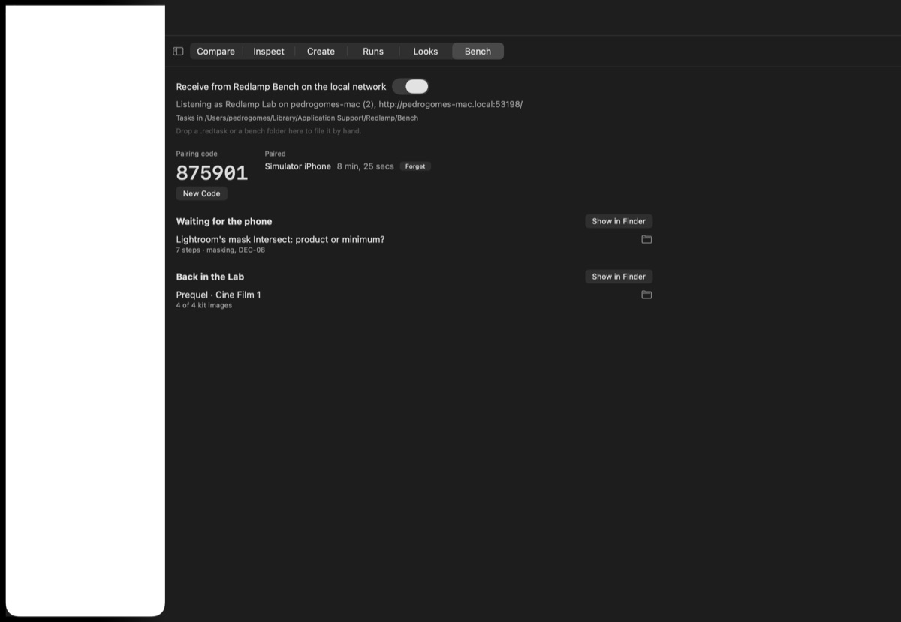
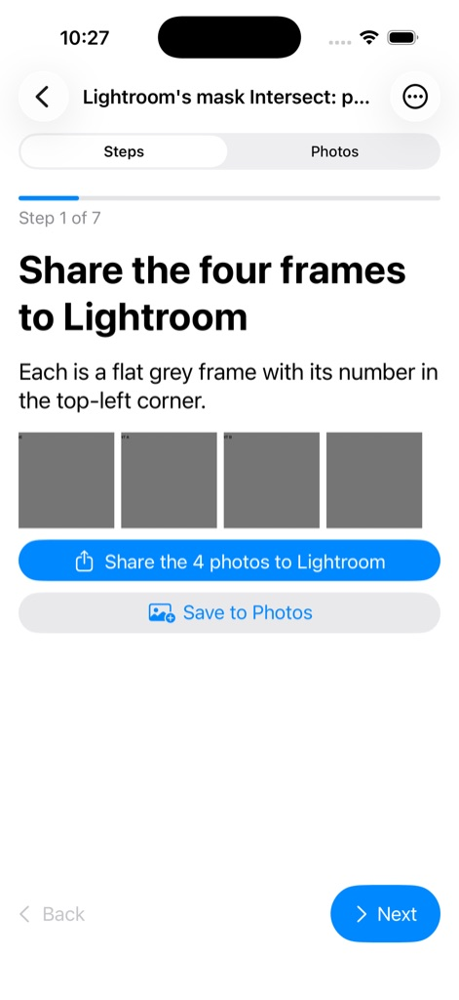
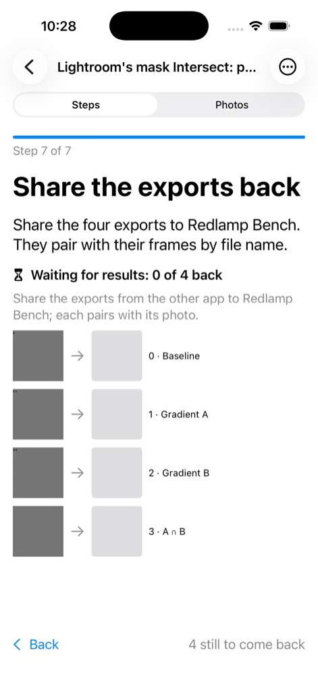
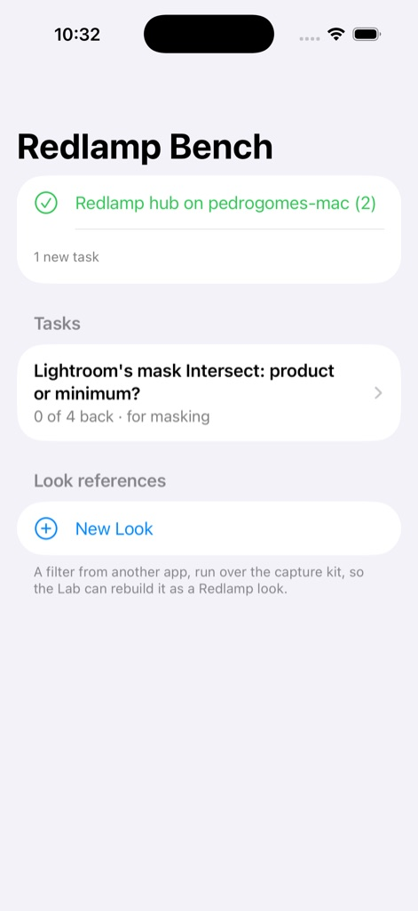

# Redlamp Bench: tasks in other apps, and look references

[Looks and the bench](bench-and-looks.md) explains both workflows from start to finish, and how to contribute a look; this page is the reference.

Some work needs the owner in another app: an agent measuring Lightroom's masks needs Lightroom's own masks on a set of photos, and a look captured from a phone app's filter needs the capture kit run through that filter. Redlamp Bench makes that a round trip with nothing moved by hand. An agent writes a **bench task**, the iPhone app pulls it from the Recipe Lab's **hub**, the owner follows its steps in the other app and shares the results back, and the phone sends the task back to the Lab as soon as it's complete. A **look reference** is the same round trip started on the phone. The code is in `packages/RedlampBench` (ARC-11), the hub runs in the harness's Recipe Lab (ARC-13), and the iPhone app is `apps/RedlampBenchApp` (ARC-12).

## A bench folder

Tasks and look references are each one self-contained folder, named by its ID:

| Path | What it is |
| --- | --- |
| `task.json` | The manifest (below) |
| `assets/` | The reference files the owner opens in the other app: JPEG, PNG, HEIC, TIFF, DNG or another raw |
| `pictures/` | Optional pictures for steps, such as a screenshot of the setting to find |
| `results/`, `results.json` | Written on the phone: each result as it arrived, and what it's paired with |

### `task.json`

| Field | Meaning |
| --- | --- |
| `format`, `version` | `redlamp-bench`, and the format version (1). A newer version is refused with a message; fields a newer Redlamp adds are kept on a round trip |
| `id` | Lowercase letters, digits, `-`, `_` and `.`, at most 100 characters; also the folder's name. `redlamp task new` makes one from the title and the date |
| `title`, `kind` | What the owner sees, and `lightroom-check`, `look-reference`, `look-kit` or any other kind |
| `requestedBy` | The workstream, tracker row and issue that asked |
| `app` | The app the steps happen in |
| `steps` | In order. Each has an `id`, a short `title`, a sentence or two of `detail` with exact menu names and values, an optional `picture`, and an optional `action` |
| `assets` | Each with an `id`, its `file`, a `label`, its `sha256` and `bytes`, the capture-kit `chart` number its barcode carries (1–3, or 9 for the one-image kit), and `counts` (false when the task is complete without it) |
| `completion` | `{"rule": "every-asset"}` (the default), `{"rule": "assets", "assets": [...]}`, or `{"rule": "manual"}` for a task the owner marks done |
| `pairing` | The methods tried for each result, in order: `file-name`, `capture-chart`, `similarity` |
| `questions` | Optional, each with fixed `choices`; a `required` one must be answered before the task is complete |
| `look` | For a look reference: `app`, `filter`, `variant`, `settings` notes, an optional `settingsScreenshot`, and the `kitSet` (`quick`, `standard` or `full`). Private provenance: never part of a recipe's name (DEC-19) |
| `revision`, `withdrawn` | Raised when an agent changes a task, and set when it takes one back |

A step's `action` is what its screen offers:

| Action | The step's screen |
| --- | --- |
| `{"type": "share", "assets": [...]}` | Shares the assets' original files to another app (all of them when `assets` is absent) |
| `{"type": "save", "assets": [...]}` | Saves them to Photos, for apps that only read the library |
| `{"type": "answer", "question": "id"}` | The question's choices |
| `{"type": "results", "assets": [...]}` | Waits for the results, and ticks itself when they're back |

### Pairing

Each result is paired with the asset it came from, by the folder's methods in order:

- **File name:** the result's name less the suffixes apps add, removed one at a time (`-2`, `-Edit`, ` copy`, ` (1)`), is an asset's file name or ID. Exporting with the original file names makes this the method that answers.
- **Capture-kit barcode:** a chart export's barcode names its chart. The three charts look alike, so only their barcodes tell them apart.
- **Similarity:** the result whose structure correlates best with an asset's (`PhotoPairAnalysis.similarity`, the high-pass of log luminance, which ignores tone curves and vignettes), among assets still without a result first; only above 0.5 and 0.08 ahead of the next best.

What doesn't pair waits in the folder, unpaired, and the owner can pair it by hand. The newest result for an asset is its current one, so a redo replaces an earlier export.

### Checks and limits

`BenchFolder.validate` is what the hub runs on every arrival and what `redlamp task check` prints. Errors: a path outside the folder (absolute, `..`, a link), a missing file, a file whose size or SHA-256 differs from the manifest, a step naming an asset or question the task doesn't have, more than 20 assets, 100 results or 1 GB. Warnings: a step's title over 60 characters, or its detail over 320, which won't fit one phone screen.

## On the Mac

The folders live in `~/Library/Application Support/Redlamp/Bench/`, outside every checkout, so agents in any worktree share them:

| Folder | What's in it |
| --- | --- |
| `Outbox/` | Tasks waiting for the phone |
| `Inbox/` | An arrival while it's checked; nothing stays here |
| `Done/` | What came back, read by agents |
| `Templates/` | `look-kit`, the capture kit new look references start from |

A complete task leaves the outbox when it reaches Done; a partial one sent early stays, and its later copy replaces the earlier one in Done.

### `.redtask`

A bench folder as one file: a zip of the folder, made by the system's archiver (`NSFileCoordinator`'s upload form), so no package is needed. The phone sends a task to the hub as one, and it's the fallback by AirDrop when the phone and the Mac can't reach each other. Before anything is extracted, the Mac reads the zip's directory and refuses an entry outside the folder, a link, more than 200 files, or more than 1 GB expanded; then `ditto` extracts it into `Inbox/`, and the folder is checked as above before it moves to Done.

## Commands

| Command | What it does |
| --- | --- |
| `redlamp task new --title … --app … [--step "Title \| detail"]… <assets…>` | A task in the outbox. Without `--no-auto-steps` it starts with a step sharing the assets and ends with one waiting for the results. `--workstream`, `--tracker`, `--issue`, `--note`, `--question "id \| text \| a, b"`, `--manual` |
| `redlamp task new --draft draft.json` | A task from a draft: `task.json`'s fields, with assets as `{"source": path, "id", "label", "counts"}` and step pictures in `"pictures"` |
| `redlamp task check <ID or folder>` | The checks above; exit 1 on errors |
| `redlamp task list`, `show <ID> [--json]` | The outbox and Done; a task's results and how each paired |
| `redlamp task wait <ID> [--timeout S]` | Returns once the task is in Done and complete; exit 2 on timeout |
| `redlamp task withdraw <ID>` | Takes a task back; the phone drops it unless it has results |
| `redlamp task look --app … --filter … [--variant] [--settings] [--set quick\|standard\|full] [--in DIR]` | A look reference from the kit template, as New Look makes one on the phone |
| `redlamp task add <folder> <files…>` | Files results into a folder and pairs them, as the share extension does |
| `redlamp task serve [--port N]` | The hub without the Lab, until interrupted: asks `y` or `n` when a phone asks to pair, prints the browser's pairing code and what arrives; look references aren't fitted |
| `redlamp recipe app-kit --task` | Publishes the capture kits already written as the `look-kit` template |

Agents follow `.cursor/skills/redlamp-bench/SKILL.md`, which covers writing steps for the phone and making Lightroom's results measurable.

## The hub

The hub runs in the harness's Recipe Lab, on the local network, advertised over Bonjour as `_redlamp-bench._tcp` (port 8765 when it's free). The iPhone app announces itself as `_redlamp-phone._tcp`, so the Lab can list the phones nearby; it takes no connections. Neither side needs an address typed. The phone pairs once and keeps a token: it asks the hub it found, and the owner clicks Allow in the Lab's Bench tab (or types `y` in `redlamp task serve`). A request the Lab doesn't answer within three minutes expires, and at most five wait at once. A browser pairs with the six-digit code the Lab shows instead; five wrong codes renew it, and the phone can use the code and an address too when Bonjour can't reach the Lab, from another subnet or over a VPN. Its API, JSON over HTTP, every route but the first four needing `Authorization: Bearer <token>`:

| Route | What it does |
| --- | --- |
| `GET /` | A page for a browser: pair, see what's waiting and what came back, upload a `.redtask` |
| `GET /api/hub` | The hub's name and protocol version, and whether the request's token is known |
| `POST /api/pair` | `{"code", "device"}` → `{"token", "hub"}`; without a code, a request for the Lab to allow: 202 and `{"request", "hub"}` |
| `GET /api/pair/<request>` | Where that request stands: `pending`, `approved` (with the `token`), `denied` or `expired` |
| `GET /api/tasks` | The outbox and the templates, each with its revision, whether it's withdrawn, and every file's path, size and SHA-256 |
| `GET /api/tasks/<id>/<path>` | One of those files |
| `GET /api/done`, `GET /api/done/<id>` | Receipts for what came back: title, summary ("12 results, all paired"), whether it's complete, and the digest of its `results.json` |
| `POST /api/inbox` | A `.redtask` as the body; the receipt, or 422 with the reason it was refused |

The server is Network.framework with a small HTTP/1.1 reader: one request per connection, bodies with a Content-Length only, bodies over 4 MB streamed to a scratch file. When another app has port 8765, it listens on any free port; the phone finds it over Bonjour either way.

### In the Recipe Lab

The Lab's **Bench** tab turns the hub on (it stays on whenever the harness runs: `mise run harness -- --scene recipe-lab --lab-tab bench`), lists pairing requests with Allow and Don't Allow (the harness also posts a notification for each), the phones nearby with Redlamp Bench open and whether each is paired, the browser's pairing code and the hub's address, the phones paired with it and when each was last in touch, what waits in the outbox and what came back, and what happened recently. A `.redtask` or a bench folder dropped on it, or a `.redtask` opened in the Finder, is filed as an arrival is. Look references go on to the **Looks** tab ([app-looks.md](recipes/app-looks.md#candidates-and-the-looks-tab)), which fits them as they arrive.

## The iPhone app

`apps/RedlampBenchApp` (scheme `RedlampBenchApp`): a SwiftUI app and a share extension, with standard iOS screens and Redlamp's icon, installed from Xcode on the owner's phone (DEC-53). It links `RedlampBench`, and through it RedlampRecipes, for pairing; no engine, LibRaw or Metal.

- **Home** lists the tasks pulled from the Lab, each with how many results are back and who asked, the look references, and New Look. The app checks the hub when it opens or comes to the front, and every few minutes while it's open. While it's in the foreground it watches for the hub over Bonjour, so it connects as soon as the Lab appears or moves to a new port or network, and announces itself to the Lab. Unpaired, it shows Pair with the Lab it found; one tap asks the Lab, and it connects once the owner allows it there.
- **A task opens on its steps, one at a time:** "Step 2 of 7" with a progress bar, the title in large type, the detail, its picture, and its action (Share the photos to the app, Save them to Photos, a question's answers, or the results coming back). Next and Back move between steps, a step whose results are back ticks itself, the view remembers where it was after a trip to Lightroom, and All Steps lists them with ticks.
- **Photos** shows the assets in a grid with Select, for sharing or saving any of them; each asset's result once it's paired, with pairing and unpairing by hand from its menu; the questions; a note for the agent; and Add Results from Photos.
- **The share extension** takes up to 20 images from Lightroom, Prequel or Photos, keeps their bytes as they arrived, preselects the last task or reference used (or a new reference with the next variant, when the last is already complete), pairs each image, and sends the folder to the Lab when that completes it. What can't reach the Lab waits in the app's queue.

### The phone's library

`BenchLibrary` keeps the phone's folders in the App Group container: `Tasks/` pulled from the hub, `Looks/` made on the phone, `Kit/` the capture kit. A pull fetches new tasks and those whose revision rose (unless they already have results), drops withdrawn tasks without results, and refreshes the kit when its manifest changes; every file is checked against its size and SHA-256 before it replaces anything. A folder is queued for the hub once it's complete, or when the owner sends it early; a send that fails stays queued with its error, and a folder whose results the hub already has (by the digest of `results.json`) isn't sent again.

## What's been tried

- **The hub and the phone's library over loopback,** in `RedlampBenchTests`: pairing with the code, a wrong code, pairing allowed in the Lab, pairing refused, an expired request, pulling a task, pairing results, sending it back, a withdrawn task, a damaged archive refused, and a second hub on a taken port.
- **The iPhone app in the iOS 26.5 simulator,** against `redlamp task serve`: the steps one at a time, pulling a task over the network, and sending it back as one archive that the hub checked and filed in Done, after which it left the outbox.
- **A look reference from the Cine Film 1 exports of 30 September:** the three charts paired by barcode and the bike photo by similarity (score 1.00), and the measured table byte for byte the one `app-import` made from the same files.
- **Bonjour in both directions on this Mac:** the app in the simulator found the harness's hub by itself and offered to pair with it, and `dns-sd -B _redlamp-phone._tcp` listed the simulator.
- **Not yet tried:** the share extension (the simulator can't drive another app's share sheet), Bonjour across a real Wi-Fi network, and a device install, which needs the owner's signing.

The harness's `--snapshot <path>` (with `--snapshot-delay S`) draws its window to a PNG without Screen Recording and quits, which is how the Lab's screenshots here were made.
