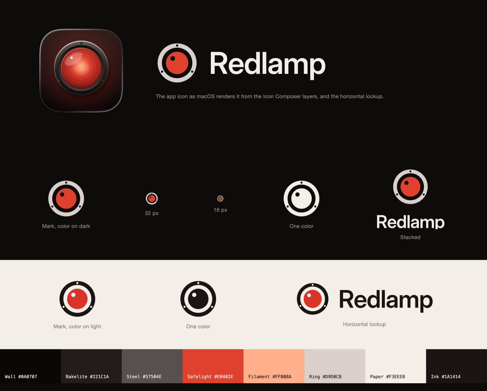

# Redlamp brand

The app icon, logo, colors, type and voice, and where each of them may be used.

## The idea

A red lamp is the darkroom safelight: the one light you can work by without fogging the paper. The brand is that light, and the object it comes from. The red is always light coming out of something, a ruby lens in a steel bezel, and never just a red shape.

Four rules follow from that, for the icon, the logo and anything drawn around them:

1. **The red is light.** It sits in glass and has a source. It is never a flat red fill or a red background.
2. **One light per picture.** It falls off into warm near-black, never pure black and never into a second color.
3. **Physical materials.** Steel, bakelite and ruby glass. No brass, chrome or plastic.
4. **Lit from above left.** Glass edges and highlights catch light from above left, the way Apple lights its own icons, so Redlamp sits well in the Dock.

The brand never appears on editing surfaces. The Develop workspace stays neutral grey so nothing tints the photographer's judgment of color (see `Palette` in `RedlampDesign`). Inside the editor the brand is the Dock icon and nothing else.

## App icon

The icon is a safelight seen head-on: a domed ruby lens with faint Fresnel rings, set in a machined steel bezel held by three screws, glowing against a warm wall. It is the "Darkroom Standard" design from the brand exploration.

It lives in `apps/RedlampMac/Resources/AppIcon.icon`, an Icon Composer file. Open it with Icon Composer (in Xcode's `Contents/Applications`) to edit it; Xcode compiles it into the app, and macOS derives the dark, clear and tinted appearances from its layers. The background is the file's gradient fill, from `#261C1B` at the top to `#0A0707` at the bottom. The layers, front to back:

| Group | Layer | What it is | Glass |
| --- | --- | --- | --- |
| 1 | `highlights.svg` | The sheen and the pinpoint highlight on the dome | Specular off, so the system doesn't add glass edges to the highlights themselves |
| 2 | `lens.svg` | The ruby lens, its Fresnel rings and the soft filament glow | System default |
| 3 | `bezel.svg` | The steel ring, its step down to the glass, and the three screws | System default, with a stronger shadow |
| 4 | `glow.svg` | The red light falling on the wall | Specular off |

The layers are plain vector. Glows are radial gradients rather than SVG blur filters, which the system renders with visible banding. Keep every stroke inside its shape's fill, since layers are cropped to their fill and a stroke that overhangs is cut flat.

**Keep it a lamp.** A glowing red lens in a dark ring is also HAL 9000's eye from *2001*. The screws and the soft, off-centre highlight are what keep it a lamp. Don't add a bright pinpoint in the middle of the lens, and don't drop the screws.

## Logo

The logo is a flat mark drawn from the icon, the "Fixed lens": the bezel becomes a ring with its three screws cut out, the lens becomes a disc, and the highlight is a small cut-out on the disc. The wordmark is "Redlamp" in Inter Display SemiBold with −2% tracking, outlined, so the files don't depend on any installed font. Don't retype the wordmark; use the files.

Every file is in `logo/`. Cut-outs are real holes, so the marks work on any background of the right lightness. `scripts/build-logo.py` regenerates them; it needs fontTools and `InterDisplay-SemiBold.ttf` from the [Inter 4.1 release](https://github.com/rsms/inter/releases).

| File | Use it on |
| --- | --- |
| `redlamp-mark.svg`, `redlamp-lockup.svg`, `redlamp-lockup-stacked.svg` | Dark backgrounds. This is the primary version. |
| `redlamp-mark-light.svg`, `redlamp-lockup-light.svg`, `redlamp-lockup-stacked-light.svg` | Light backgrounds |
| `redlamp-mark-white.svg`, `redlamp-lockup-white.svg` | One color on dark or photographic backgrounds |
| `redlamp-mark-black.svg`, `redlamp-lockup-black.svg` | One color on light backgrounds, print and stamps |

- **Clear space:** at least a quarter of the mark's height on every side.
- **Smallest size:** the mark reads at 16 px; the horizontal lockup needs at least 96 px of width.
- **Don't** recolor the mark, rotate it, add effects or glows to the flat mark, or put the color version on a mid-tone background. The glowing, three-dimensional version is the app icon.

## Color

These are the `Brand` tokens in `packages/RedlampDesign/Sources/Tokens/Brand.swift`.

| Token | Hex | Role |
| --- | --- | --- |
| `safelight` | `#E0402E` | The lit lens, and the mark's disc on dark backgrounds |
| `safelightOnLight` | `#D8352A` | The mark's disc on light backgrounds |
| `filament` | `#FFB08A` | The hot centre of the light; only ever part of a glow |
| `wall` | `#0A0707` | Warm near-black backgrounds |
| `bakelite` | `#221C1A` | Raised dark surfaces, such as the About window |
| `steel` | `#57504E` | Machined edges and highlights on dark |
| `ring` | `#D9D0CB` | The mark's ring on dark backgrounds |
| `paper` | `#F3EEE8` | Text on dark, and light backgrounds |
| `ink` | `#1A1414` | Text and the mark's ring on light backgrounds |

Red is used once per view at most, and always as light: a lens, a glow, the mark's disc, or the one primary button on the website.

## Type

- **Wordmark:** Inter Display SemiBold, outlined in the logo files.
- **App interface:** the system font, through `Typography` in `RedlampDesign`, as on every native Mac app.
- **Website and documents:** Inter for text and Inter Display for headings. Both are open source (SIL Open Font License), so anyone contributing can use them.

SF Pro stays inside the app. Apple's license doesn't allow it in logos or on the website.

## Voice

Calm, plain and precise, like someone who knows the darkroom and doesn't need to prove it.

- **Tagline:** Work by the light that never fogs the paper.
- **About window:** Redlamp develops your raw photos without ever touching the originals.
- **Empty state:** Open a folder. Nothing you do here harms a single original.

Say what the app does and what it protects. Avoid exclamation marks and superlatives.

## Motion

The brand's light moves in two places so far: the star nudge on the website's home page ([star-nudge.md](star-nudge.md)), and the star promo for social feeds, which plays the same nudge as a short film ([its design](../plans/2026-10-06-star-promo.md)). Light gathers behind the lamp while it trembles, shoots in an arc to the GitHub button, and a sign drops on a rope. Both keep the rules above: the light has a source and moves rather than multiplies, and the lens is never given a bright centre. Promos are made with the promo studio (`.cursor/skills/redlamp-promo-studio/`), whose kit draws the light the same way.

## Where the brand appears

| Place | What it uses |
| --- | --- |
| Dock, Finder and App Store | The app icon |
| About window, onboarding and empty states | The app icon or the mark, `wall` or `bakelite` backgrounds, the voice |
| Website and README | The lockups, the app icon, `wall` backgrounds lit by one red glow |
| Films and social promos | The app icon's lamp and its light in motion, the GitHub badge and the paper sign, `wall` backgrounds, the voice |
| Develop workspace, panels, sliders and canvas | Nothing. They stay neutral grey. |
