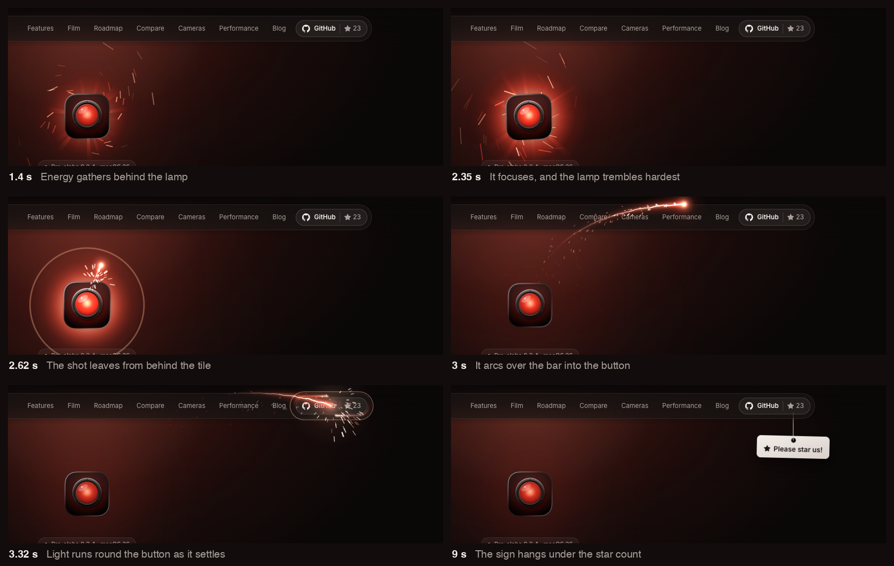
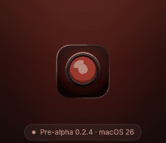

# The star nudge

The home page's star nudge points visitors at the GitHub star. Light gathers behind the hero's lamp while the lamp trembles harder and harder, then shoots in an arc into the header's GitHub button, which lights up and settles, and a paper sign saying "Please star us!" drops from under the button on a rope, to be dragged and thrown.

It is two pieces that can be used apart: **the lamp's shot**, light travelling from a source to a target, and **the hanging sign**, a tag on a rope that answers to the pointer. On the website they are `web/components/site/StarNudge.tsx` and `web/lib/hanging-sign.ts`.

## What happens

Times are from the start of the sequence, which begins 1.5 s after the page loads.

1. **Gathering, 0 to 2.4 s.** Light builds behind the lamp's tile: a glow that grows out from behind its edges, 18 rays that turn slowly, and motes of light that spiral in, quicker and thicker as it charges, and pass behind the tile. The lamp's own glow on the wall grows to 1.45 times its size.
2. **Focusing, the last 0.7 s of the charge.** The glow tightens and brightens, the rays draw in, and the motes rush to the centre.
3. **Trembling, through the charge.** The lamp shakes, faintly at first, then harder and faster: under a quarter of a pixel in the first second, about 1 px by 1.3 s, nearly 3 px by 2 s, and 4 px with a 2.3° turn just before it fires. The shake quickens from 6 to 26 times a second, and the lamp swells by 3.5% and brightens by 30%.
4. **Squash, 2.4 to 2.52 s.** The shaking stops, and the lamp shrinks to 94% and brightens to 1.6 times, as if holding its breath.
5. **The shot, 2.52 to 3.14 s.** The light leaves from behind the tile's top edge, rises, arcs over the header bar and comes down into the GitHub button, trailing a beam about half the arc long and shedding sparks. A ring spreads out behind the tile, the lamp's glow flares to 1.8 times, and the lamp recoils to 110% and settles in 0.8 s.
6. **The hit, from 3.14 s.** A flash, and a burst of sparks that fall. The button swells to 115% and springs back, its star spins once and turns filament, and two lights chase each other round its edge. All of it has faded 1.7 s later.
7. **The sign, from 4.29 s.** It drops from under the bar, hanging below the star count on its rope, swings and settles.

The sign is a link to the repository. It can be dragged as far as its rope reaches, turning about the point that's held, and thrown, and it swings until it comes to rest. A click that doesn't move it opens the repository. Once the visitor scrolls past 40% of a screen, the rope draws the sign up behind the bar and it's gone.

## When it plays

- Once per browser tab: session storage keeps `redlamp.star-nudge` once the sequence starts, so a visitor moving around the site sees it once. To see it again, open the home page in a new tab, or remove that key and reload.
- Only when the whole lamp is in view below the header, in a visible tab. If the lamp has been scrolled away by the time it would fire, the sequence ends there, without the shot or the sign.
- Never with Reduce Motion.

## The brand rules it keeps

The rules are the brand's ([README.md](README.md)); this is how the nudge keeps each.

- **The red is light with a source.** Every red thing comes out of the lamp and travels to the button. Nothing is a flat red fill, and the sign is paper and ink.
- **No bright point in the lens.** A glowing red lens with a bright centre is HAL 9000's eye. The light gathers behind the tile, the lens only brightens evenly, and the shot and its flash leave from behind the tile's top edge, never across the lens. A launch from the lens, captured on a phone, flashed a point onto it, which is why the launch moved.
- **One light per picture.** The light moves rather than multiplies: what gathered behind the lamp goes out as the shot leaves, the button's light fades as it settles, and the page is left with its usual single glow.
- **Lit from above left.** The sign's paper is lighter at its top left, and its eyelet is a steel ring.
- **The voice.** The sign says "Please star us!" as the owner wrote it; elsewhere the voice avoids exclamation marks.
- **Where it may appear.** The website and other places the brand appears; like the rest of the brand, never on the editor's surfaces.

## The timeline

| Stage | Starts | Lasts | In `StarNudge.tsx` |
| --- | --- | --- | --- |
| Gathering and trembling | 0 s | 2.4 s | `charge` |
| Squash | 2.4 s | 0.12 s | `fire`, `charge` + 0.12 |
| The shot | 2.52 s | 0.62 s | `hit`, `fire` + 0.62 |
| The hit and the light round the button | 3.14 s | 1.45 s, and 1.7 s for the button's own glow | `settled`, `hit` + 1.45 |
| The sign drops | 4.29 s | until it comes to rest | `drop`, `hit` + 1.15 |

The frame loop advances its clock by at most 1/20 s a frame, so a tab that comes back from the background carries on where it was rather than skipping ahead.

## How it's built

### Two layers

A canvas covers the window above the header (`z-50`) and draws all of the light; it's hidden once the last spark has faded. A second layer sits below the header (`z-30`) and holds the sign and its rope, so the sign comes out from under the bar, the frosted glass blurs it while it's behind, and the phone menu covers it.

### Light behind the lamp

The canvas lies over the page, so it draws the light and then cuts the lamp out of it: it draws the lamp's own image with `destination-out` at the position, shake, turn and scale the lamp has on screen, which leaves light only where the tile isn't. That's why the frame loop moves the lamp itself, through its inline transform, rather than a CSS animation: the cut-out has to match the lamp in every frame. Everything drawn behind the lamp is kept below the header.

The glow is a radial gradient from filament through safelight to the deep red, flickering slightly. The rays are thin triangles from the lens with a gradient along their length. The motes are short strokes, twice as long as their last step, placed by angle and distance from the lens, so they follow the lamp if the page scrolls.

### The shot

The path is a cubic Bézier from the tile's top edge, on the side nearer the target, rising above the target and coming down into it. Its first control point is 1.25 times the rise above the start and a tenth of the way across; its second is above the target by 0.4 times the rise, at least 50 px, and 30% of the way back. It's walked by distance along it, from a table of 96 samples, so the curve doesn't change the shot's speed, and the head moves with the 1.35th power of time, gathering speed into the target.

The beam is soft light stamped every 3.5 px along the path: two soft spots drawn once, in safelight and filament, growing and brightening towards the head, under a thin hot core that crackles a little across the path. Once the head arrives, the tail drains into the button in 0.3 s. Sparks are short strokes that cool from white to filament to safelight as they fade, slowed by the air and pulled down.

### The button

At the hit, Web Animations scale the button (1, 1.15, 0.96, 1.04, 1 over 1.7 s), light its border, give it a halo of box-shadows, and spin its star a full turn, growing to 1.9 times and turning filament, over 1.2 s. The two lights chasing round its edge are a conic gradient with two bright stops and their tails, stroked round the button's pill at 1.15 turns a second.

### The sign

`HangingSign` is a small physics model in CSS pixels and seconds, with y pointing down. The rope is a chain of 8 links between light point masses that resists stretching but not bending, so it goes slack when the sign is pushed up. The sign is a rigid frame of five masses, its four corners and the eyelet the rope is tied to, so it turns as it swings and as it's held. It's stepped 720 times a second, with two passes of position-based constraints in each step (Macklin et al., "Small Steps in Physics Simulation", 2019), and long-range attachments keep every point of the rope within its length of the anchor (Kim, Chentanez and Müller, "Long Range Attachments", 2012), so the rope never stretches, however hard the sign is pulled.

A drag holds the point of the sign that was grabbed and moves it to the pointer, as far as the rope reaches. The pointer's movement in each frame is spread over that frame's steps, so the sign leaves a drag with the pointer's speed and is thrown. A drag of more than 4 px doesn't follow the link, and the sign takes no touch scrolling, so it can be dragged on a phone. The frame loop stops once nothing has moved for half a second, and starts again at the next touch or resize.

| Setting | Value |
| --- | --- |
| Gravity | 3,200 px/s² |
| Rope | 56 px, or shorter, down to 30 px, where 56 px would hang the sign over the lamp, as on phones. 8 links; the 7 points between them weigh 0.02 each |
| Sign | 0.2 at each corner and at the eyelet, which is 9 px below the sign's top edge |
| Air resistance | 4 per second on the rope, 1.1 per second on the sign |
| Anchor | Under the star count, 3 px above the button's foot, kept far enough from the window's edge for the sign to fit |
| The drop | The eyelet starts behind the bar, half a rope to the left of the anchor, turned 0.2 rad and moving right at 160 px/s |
| Reeling in | The rope shortens to nothing over 450 ms while the sign fades |

## Reusing it

**The sign on its own.** `web/lib/hanging-sign.ts` knows nothing of the page. Make a `HangingSign` with an anchor, a rope length, the sign's size and the eyelet's depth, and where it starts; call `step(dt)` every frame and draw `pose` (the sign's centre and turn) and `rope` (the points from the anchor to the eyelet). `grab`, `drag` and `release` take pointer positions, `moveAnchor` follows whatever it hangs from, `setRopeLength` reels it in or lets it out, and `resting` says when the frame loop can stop. Its tests, `hanging-sign.test.ts`, show each behaviour, and `hang` in `StarNudge.tsx` shows the wiring: the pointer events, telling a drag from a click, reeling in on scroll, and following a resize.

**The shot at something else.** `findParts` finds what the nudge moves by `data-star-nudge`: the `lamp` and its `glow` in `Hero.tsx`, the `button` and its `star` in `SiteHeader.tsx`. To aim the shot elsewhere, `play` would take its source and target elements instead of finding them, and the target's reaction, `strike` and `aura`, would follow whatever the target is. The arc assumes the target is above the source, as the header is above the hero; for a target beside or below it, change the control points in `arc`.

**Somewhere other than the website.** The timeline, the amounts and the physics settings here are the specification; the app or the film would draw the same stages with their own tools. The physics comes from published papers, so it can be written again in Swift.

**A different feel:**

| To change | In `StarNudge.tsx` |
| --- | --- |
| How long it charges | `charge` |
| How hard and how fast the lamp shakes | `lampPose`, at most 3.4 px and 0.045 rad, and the shake's rate in `tick`, 6 to 26 a second |
| How much light gathers | `backlight`, and the motes' rate in `gather`, 30 to 250 a second |
| The shot's path and speed | `arc`, `hit`, and the head's 1.35 power in `tick` |
| How long the beam is | The 0.55 of the path behind the head, in `tick` |
| The button's reaction | `strike` and `aura` |

## Checking it

- `cd web && npm test` runs the sign's tests with the site's.
- `.cursor/skills/redlamp-site/capture-nudge.py <url>`, against a locally served build, regenerates the two images here and checks the sign at a desktop and a phone width: that nothing overflows sideways, a drag doesn't follow the link, a click does, and scrolling on reels the sign in. It steps the page with Playwright's fake clock, so each frame lands at an exact time in the sequence, and holds the button's Web Animations at the same time. In the agent sandbox, build and serve the site with `NODE_USE_ENV_PROXY=1`, so the header shows its star count.

## Known issues

- When the shot hits the button, a real browser stutters for a few frames. In headless Chrome the nudge's own script takes at most 1.2 ms a frame, so the time goes into painting. The likely cause is the button's halo and border, animated as box-shadows inside the header's frosted glass, which the browser repaints in every frame. The fix is to draw the halo on the canvas and keep only the scale on the button.
- Apart from the owner watching it on a Mac, it has been checked only in headless Chrome; other browsers and real phones are untried.
