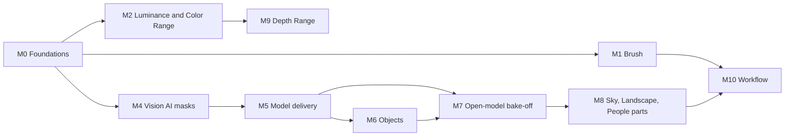

# Masking: every Lightroom mask type

The owner's goal: go from linear and radial gradients to every mask in Lightroom's "Create New Mask" menu. Brush, Color Range and Luminance Range come first, then Subject, Sky, Objects, People, Landscape and Depth Range.

## Where we start

- A mask is a `MaskLayer` of `MaskComponent`s combined by Add, Subtract and Intersect (`packages/RedlampEngineAPI/Sources/Masks.swift`). `MaskKind` lists every Lightroom type with the phase it arrives in.
- Coverage is evaluated per pixel in `packages/RedlampKernels/Sources/Shaders/Masks.h`, shared by the develop kernel and the detail stage, so both see the same masks.
- The research behind this plan: [C-masking](../research/notes/C-masking.md) (models, licences, timings), [darktable masking](../research/darktable/notes/C-modules-and-masking.md) §2.4, [INFRA](../research/notes/INFRA.md) §4 (model delivery), and tracker rows MSK-01 to MSK-17.
- Mask space is the EXIF-oriented image before crop, Transform and lens correction (DEC-07). AI mask bitmaps live in a sidecar package (DEC-11, accepted 2026-10-01).

Brush and AI masks need **raster** coverage, and range masks need the **pixel's colour**. Gradients needed neither.

## Which mask types need a model

| Mask | Source | Download |
| --- | --- | --- |
| Brush, Color Range, Luminance Range, Linear, Radial | Redlamp | None |
| Subject, Background, People, face parts | Apple Vision (system models), face landmarks for parts | None |
| Objects, macOS 27 | Vision tap-to-segment | Apple downloads its own model |
| Objects, macOS 26 | SAM 2.1 tiny or small (Apple's Core ML packages, Apache-2.0) | About 80 MB, on demand |
| Sky, Landscape, people parts (hair, skin, teeth, clothes) | Decided by the open-model bake-off (M7), then possibly our own head (M8) | On demand |
| Depth Range | Embedded depth; Depth Anything V2 Small only after DEC-02 | On demand |

Files that carry them get iPhone depth, portrait mattes and hair, skin, teeth, glasses and sky mattes for free.

**Why not just an open model from Hugging Face?** There are many, but almost every semantic segmenter that knows "sky" or "water" (SegFormer, Mask2Former, OneFormer) was trained on ADE20K or Cityscapes, which are licensed for non-commercial use only. The clean ones (SAM 2.1, DINOv2) are class-agnostic or backbones only. SAM 3 understands "sky" but carries a custom licence, is gated and has 848M parameters. The bake-off (M7) measures what each open candidate is worth, including an auto-prompted SAM 2.1 that needs no training at all.

## Milestones

### M0 Foundations

1. **Shapes.** `MaskShape` gains `brush`, `luminanceRange`, `colorRange`, `ai` (and later `depthRange`), plus `unknown`, which keeps a component written by a newer Redlamp and renders nothing, instead of failing to read the edit. Existing edits render the same, so no process version bump.
2. **Kernels.** Component kinds for rasters (brush and AI) and the two ranges. Rasters are bound as a texture array; `evaluateMaskComponent` takes a `MaskTextures` struct (rasters, guide, sampler) in both the develop kernel and the detail stage.
3. **Guides.** The *edit guide* is OKLab of the global edit without local adjustments, the colour range masks select on. The *analysis guide* is OKLab of the default develop, which never moves when the user edits; it feeds brush Auto Mask, AI providers and edge refinement.
4. **`MaskRasterCache`.** One coverage texture per raster component, keyed by content (the strokes' hash, a blob's SHA-256).
5. **Sidecar package.** `photo.ARW.redlamp/` holds `edit.json` and `masks/<sha256>.png`. Single-file sidecars are still read and become packages on the next save; blobs no edit references are removed on save. Format version 3.

### M1 Brush

Lightroom's A and B brushes and Erase, with Size, Feather, Flow, Density and Auto Mask.
- A brush component holds strokes: points, pressure, size (a fraction of image height, like radial radii), feather, flow, density, erase and auto mask. A and B are user settings, not part of the edit.
- Strokes are rasterised on the GPU into a coverage texture in mask space, at most 4096 px on the long side. Flow builds up per dab to the stroke's Density; Erase multiplies coverage down. Auto Mask weights each dab by colour distance on the analysis guide from the colour under the dab's centre.
- UI: `K`; a cursor ring for size and feather; `[` and `]` for size, with Shift for feather; `Alt` erases; tablet pressure. One stroke is one history step.

### M2 Luminance Range and Color Range (MSK-05)

- **Luminance Range:** a trapezoid on OKLab lightness (0–100) with four handles, set by eyedropper, plus a luminance map overlay.
- **Color Range:** up to five sample points. Each render reads their colour from the edit guide, so the selection follows global white balance. Coverage is the strongest of each sample's smooth falloff in OKLab, chroma and hue weighted above lightness, with Refine scaling the tolerance.
- The guide is sampled one mip down so coverage doesn't speckle with noise.
- To verify against Lightroom: whether its range masks follow global edits (this plan assumes they do).

### M3 Refinements (optional)

Detail refinement (MSK-04), "new mask from existing" (MSK-06) and the extra overlay modes from the [inventory](../lightroom-feature-inventory.md) §14.

### M4 Apple Vision masks (MSK-08, MSK-09, MSK-07)

- An *analysis render* (8-bit sRGB at about 2048 px, default develop, oriented, uncropped, hashed) is what Vision sees.
- Subject (`GenerateForegroundInstanceMaskRequest`), Background (Subject inverted), People (`GeneratePersonInstanceMaskRequest`, falling back to the all-people matte beyond four), face parts from `DetectFaceLandmarksRequest`, and embedded auxiliary mattes.
- Each AI mask stores its provider, request revision, OS build, prompts, analysis render hash and bitmap SHA. The bitmap (8-bit PNG, 1536 px; 2048 px for people parts and sky) always wins over recomputing; "Update AI Masks" is explicit.
- Render-time guided upsampling against full-resolution luminance. Shipping waits on DEC-05.

### M5 Model delivery (INF-01, INF-07, part of INF-06)

How Redlamp downloads "supporting data" as Lightroom does: a model manifest and registry, a CI licence gate in which the training data's licence wins, Apple-hosted Background Assets packs (one immutable pack per model version, `onDemand`), a size-disclosed download prompt and a Models pane, and an embedding cache in `Caches/`.

### M6 Objects (MSK-10, MSK-11)

Vision's iterative segmentation on macOS 27; SAM 2.1 on the GPU on macOS 26 (measured: 58–68 ms to encode, 9–12 ms per prompt on an M1 Ultra). Hover to highlight, click, box or brush to select. A bake-off between them. SAM 2.1 ships after DEC-02.

### M7 Open-model bake-off (MSK-17)

Each candidate runs on the CC0 test set ([C-masking §10](../research/notes/C-masking.md#10-test-data-list-segmentation)), measured by IoU, boundary F-score at tree lines and hair, M1 latency, and a licence verdict:
- **Auto-prompted SAM 2.1** (no training): seeds from a classical sky estimate, gated by `ClassifyImageRequest` "sky".
- **Depth Anything 3 Mono-L's sky output** (Apache weights, unclear data).
- **SAM 3 text prompts** (custom licence): an offline labeller at most.
- **Florence-2** (MIT, unclear data): a labeller.
- **OneFormer and Mask2Former**: a quality ceiling only; they can't ship.

Then: ship an open model if it's good enough and counsel clears it; ship auto-prompted SAM if that is; otherwise train (M8). Until then Sky uses an embedded matte when the file has one.

### M8 Trained heads (MSK-12, MSK-13; only if M7 says so)

The bake-off ([MSK-17](../research/notes/MSK-17-sky-bakeoff.md)) decided against a Sky head for now: auto-prompted SAM 2.1 scores IoU 0.92 against the ceiling. Landscape classes and people parts still need one, because nothing shippable knows those classes. This is blocked on data and decisions, not code:

- **Data:** 3,000–5,000 landscape photos we have rights to (our own, Commons CC0/CC BY, the CC BY subset of COCO-Stuff and Open Images V7 with attribution), plus consented portraits for people parts. Labels are drafted with `redlamp mask --kind objects --point …` (SAM 2.1) and the classical estimates, then checked by hand.
- **Model:** a frozen backbone (DINOv2 ViT-S/14, or the SAM 2.1 Hiera encoder Objects already runs, which costs no extra encode) with a DPT-lite decoder at 1/4 resolution. It outputs the seven Landscape classes (mountains, water, vegetation, natural ground, artificial ground, architecture, sky) and the people parts. A 2-week probe picks the backbone.
- **Shipping:** converted to Core ML with a placement check, delivered as a model manifest like `sam2.1-tiny.json`, and served through `MaskComputationError.unsupported` until then.
- **Blocked on:** DEC-02 (backbone weights), DEC-12 (an ML engineer and the labelling budget), and the hand-labelled evaluation set.

### M9 Depth Range (MSK-14)

Embedded depth first, with the Luminance Range trapezoid applied to depth.

### M10 Workflow

Mask presets and adaptive presets, updating AI masks on paste and sync, a Refine Edge brush, and later a learned matting refiner (MSK-15).

## Status (2026-10-02)

Built: M0 to M7, M9 and M10. M8's trained heads are still blocked as described above, but SAM 3 (converted to Core ML) stands in for them as an evaluation model. Where the build differs from the plan:

- **AI mask edges** are solved per pixel when the mask is made, at the size masks are stored at (4096 px), not refined again at render time: Sky by `SkyMatte` (against the sky's own colour), Subject, Background, People, Objects and Landscape by `ClosedFormMatte`, and SAM 3's people parts both ways (the person's matte where a part meets the background, SAM 3's edge where it meets skin). See [MSK-17](../research/notes/MSK-17-sky-bakeoff.md).
- **Refine Edges** is an action on an AI component (a guided filter); the **Refine Edge brush** solves an edge again per pixel where it paints, its strokes kept with the mask. Convert to Path isn't built.
- **Sky** is Segment Anything prompted inside the classical estimate, arbitrated with Depth Anything 3's sky when that evaluation model is installed.
- **Landscape and the people parts Vision can't give** (hair on any photo, facial hair, body skin, clothes) come from SAM 3, evaluation only: its licence isn't cleared, and the risk is accepted for evaluation. A shippable route is still M8's trained head.
- **Objects:** Vision's tap-to-segment needs the macOS 27 SDK, so Objects is SAM 2.1 only, and the Vision-against-SAM bake-off waits.
- **Models waiting on DEC-02** (SAM 2.1) and evaluation-only models (Depth Anything V2 Small, Depth Anything 3, SAM 3) are offered only with evaluation models turned on: Settings › Models, or `REDLAMP_EVALUATION_MODELS=1`. A manifest becomes `cleared` once its decision is accepted, and the licence gate checks that it is.
- **Warm-up:** opening the Masking tool prepares the open photo's renders, model loads and encodings in the background, and those of photos opened after it.
- **New module:** `RedlampMasking` (engine side) holds Vision, embedded mattes, the sky estimate and `SkyMatte`, `ClosedFormMatte`, SAM 2.1, SAM 3 and Depth Anything, the model store and the bitmap utilities.
- **CLI:** `redlamp mask` writes AI masks as PNGs (with `--refine` for Refine Edge strokes), and `redlamp render --mask <kind> --mask-set …` renders with them. The bake-off uses both.

## Gates

- **DEC-02** (counsel): SAM 2.1, DINOv2 and Depth Anything V2 Small. Blocks shipping M6, M8 and M9.
- **DEC-05**: the guided-filter patent check. Blocks shipping M4's refinement.
- **DEC-08**: Lightroom's Intersect, plus whether its range masks follow global edits. The owner measures both.
