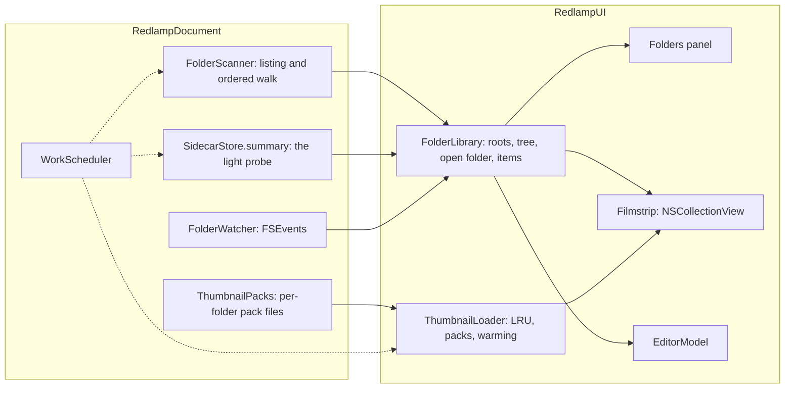

# Folders working set: design

The owner's requests (2 October 2026):

1. Bring back Lightroom Classic's folder navigation: the sidebar holds several folders the user added, a working set rather than a catalog.
2. "This absolutely cannot impact performance": the app stays responsive whatever the number of photos, and memory stays in check.
3. Use the whole machine (every core, fast I/O, the GPU where it wins) so Redlamp is instant and best in class.
4. The filmstrip follows changes on disk by itself.

Answers that fixed the scope: one folder at a time in the filmstrip, with "Show Photos in Subfolders"; read-only (nothing on disk changes); missing folders are flagged.

Until now Redlamp had one folder at a time, opened with ⌘O and remembered as `lastFolder`. Opening it read every photo's sidecar, coordinated and with its mask PNGs, one after another, before showing anything; the filmstrip was a SwiftUI `LazyHStack` whose cells all re-rendered whenever any thumbnail arrived, and thumbnails were kept forever.

## What users get

- **A Folders panel**, first in the scrolling column under the Navigator, collapsible like the others.
  - The header's **+** (Add Folder…), File › Open (⌘O) and dropping folders on the window add folders. Opening or dropping files adds their folder and selects them.
  - Each folder you added is a root that expands into its subfolders. Every row shows how many photos are directly in it.
  - Clicking a row opens that folder in the filmstrip. The open folder is highlighted.
  - The context menu: Show in Finder, Show Photos in Subfolders, Remove from Folders (roots only) and Locate… (missing roots).
- **One folder at a time in the filmstrip.** With Show Photos in Subfolders (View menu, or the panel's context menu) it shows everything beneath the folder, ordered by subfolder, then name. The header shows the folder's name and the total.
- **Read-only.** Nothing on disk is created, renamed or moved.
- **Live.** Photos added to the open folder (or beneath it, with subfolders on) slide into place, deleted ones leave, a rename moves, and the scroll position stays. The selected photo stays selected; if it goes, its neighbour is selected. A shoot being copied in arrives as a few batches, and a photo still being written shows a placeholder until its size settles. A file overwritten in place gets a new thumbnail. Sidecars changed elsewhere refresh their badges. Folder counts follow.
- **Missing folders.** A root that is missing or on an unmounted volume is dimmed with a "?" badge; if it was open, the filmstrip says so, and it fills again when the volume comes back.
- **Remembered:** the roots (as bookmarks, so a renamed or moved folder is followed), the open folder, the subfolders option, the expanded rows and the last photo in each folder. `lastFolder` becomes the first root.

## Performance contract

Every rule below is enforced by a test or by `--folders-perf` (see Verification).

- **No file I/O on the main thread**: listing, sidecar summaries, bookmark resolution (a network volume can block), and the sidecar read when a photo is selected (`select()` read it on the main thread when the photo was already decoded).
- **Listing reads no sidecars.** One directory listing, with the resource keys asked for up front, gives the photos, their sizes and dates, their iCloud state and which of them have a `.redlamp` package. Photos without one need nothing more.
- **Badges come from a light probe** of `edit.json`: the recipe and the metadata only, no mask PNGs, history or conflict resolution. Probes run in parallel, visible photos first, and are dropped when the folder changes. Conflicts are still resolved when a photo is opened.
- **Streaming.** The open folder's photos appear as soon as its listing returns. With subfolders on, the subfolders are listed in parallel and arrive in order, so nothing sorts 50,000 names at once.
- **O(1) lookups.** A URL-to-index map serves `select`, stepping, the prefetch working set, saving and ratings.
- **Bounded thumbnails.**
  - In memory: an LRU of decoded thumbnails with a 128 MB budget (about 1,200 at 192 × 140), trimmed to what's visible on a memory-pressure warning.
  - Decoded at the cell's pixel size (192 px), not 256.
  - On disk: one pack file per folder in `~/Library/Caches/app.redlamp/Thumbnails`, at most 1 GB across packs (about 100,000 thumbnails), least recently used packs first to go.
  - Files iCloud hasn't downloaded are never read: they show a cloud.
- **Per-cell updates.** A thumbnail or badge arriving touches only its own cell.
- **Budgets** (an M-series Pro's internal SSD):

| | Target |
| --- | --- |
| Main thread, while opening folders, streaming, scrolling and warming | p99 under 8.3 ms |
| First photos in the filmstrip | under 50 ms |
| A 50,000-photo tree in 500 folders, fully listed | under 300 ms |
| Visible thumbnails | under 150 ms from the pack, under 400 ms from the files |
| Background warming | at least 300 thumbnails a second from the files, 2,000 from the pack |
| Memory | about 150 B per photo, plus the 128 MB thumbnail budget; pack pages are file-backed |

## Using the hardware

Redlamp feels instant because it uses the whole machine, not because it does little.

- **`WorkScheduler`** (RedlampDocument) runs every bulk job: listings, probes, thumbnail decodes, warming and stack detection. It has three lanes:
  - **on-screen**, at user-initiated priority, as wide as the performance cores (`hw.perflevel0.logicalcpu`);
  - **look-ahead**, at utility priority, half as wide;
  - **background**, at utility priority, half as wide as the performance cores (at least as wide as the efficiency cores, `hw.perflevel1.logicalcpu`). It was background priority at first; see Results.

  Jobs run on GCD threads (blocking I/O doesn't belong on Swift's cooperative pool). A queued job is promoted when it becomes visible, and a job whose folder or cell went away is dropped before it starts. Background jobs start only while no on-screen job waits, and not at all in Low Power Mode or when the Mac is hot (`thermalState` serious or critical), as exports already rest.
- **I/O in parallel.** With subfolders on, each folder is listed by its own job. Probes read `edit.json` without file coordination, which is safe because it is always written atomically (directly, or by replacing the whole package), and skip sidecars iCloud hasn't downloaded. Probes run on the look-ahead lane in batches of 32 rows, the visible rows' batches promoted to on screen: decoding the JSON, not reading it, is most of their cost.
- **Decoding where it's cheapest.** ImageIO's thumbnail path decodes a raw file's embedded JPEG at reduced scale, and HEIC on the hardware decoder, on all performance cores at once. Stack detection's blur, correlation and sharpness use Accelerate (vDSP). Core Animation composites the filmstrip on the GPU, so scrolling never redraws a thumbnail.
- **Raw files without a usable preview** (rare: some DNGs) are the expensive case. The trial compares ImageIO's full decode with a reduced-size develop in the engine; see Results.
- **Warming.** While nothing is waiting on screen, thumbnails for the rest of the open folder, then for its sibling folders, are decoded into the pack on the background lane, so scrolling never waits. Warmed thumbnails go to the pack, not to memory.

## Components

- **`FolderLibrary`** (`@MainActor @Observable`, `model.library`) owns the roots, the lazily listed tree, the open folder, the subfolders option, the photos (`items`) with their index map, and the last photo per folder. `items` changes are published as diffs (inserted, removed, moved and updated rows) to the filmstrip, so a badge or a new file never reloads the strip. Views observe only `count` and `openFolder`, never the array, so a probe result doesn't re-render SwiftUI.
- **`EditorModel`** keeps the open photo's metadata itself, read from its sidecar when it opens, and saves that, not a lookup in `items`. A selection that isn't in `items` (a photo opened from elsewhere) no longer saves empty ratings.
- **Bookmarks.** A root is stored as bookmark data with its last known path, behind `FolderAccess`, which calls `startAccessingSecurityScopedResource`. That does nothing until the app is sandboxed, so the Mac App Store sandbox needs no model change.
- **Tree.** A row is listed the first time it is visible. That one listing gives its count and its subfolders, so expanding is instant. Packages (sidecars, `.photoslibrary`, apps) and hidden folders are not folders here.
- **`FolderWatcher`** is one FSEvents stream over all roots, with a 0.3 s latency. Only listed directories (the open folder, its subtree with subfolders on, visible tree rows) are listed again, and the result is diffed into what's shown. A new subfolder under an open subtree is walked and merged in. A file whose size or date is still changing waits for 2 s of quiet before its thumbnail is requested. Mounts and unmounts (NSWorkspace) drive the missing state. Network volumes have no FSEvents, so their listed folders are polled every 15 s.
- **Stack detection** runs per directory on the background lane, one directory at a time, and its result is cached per directory by the listing's names, sizes and dates, so opening a folder again doesn't read every photo's EXIF.

## Thumbnail packs

A pack is one file per folder, named by a hash of the folder's path. It starts with a header (`RLTP`, version 1) and is then a sequence of records, each a photo's name, size, modification date and a JPEG (quality 0.8, about 10 KB at 192 px).

- **Reading:** the pack is mapped into memory once and its records indexed by name; the last record for a name wins. A record is used only if its size and date match the listing's, so an overwritten file is decoded again.
- **Writing:** new records are appended under the pack's lock. Earlier records for the same name become stale.
- **Compaction:** when more than a third of a pack is stale, it is rewritten with only its live records and swapped in atomically.
- **Eviction:** when the packs pass 1 GB, the least recently opened packs go first.

The JPEG decode happens into the memory LRU, in parallel on the scheduler, so the pack's pages stay clean and the OS can reclaim them without counting them as Redlamp's memory.

## The filmstrip

An AppKit `NSCollectionView` (horizontal flow) inside the existing floating pane. The header (folder, count, stack banner, file info) stays SwiftUI. Cells are layer-backed: the thumbnail is a layer's contents, and badges (edited, flag, stars, label, stack, cloud) are small layers set only when they change. Cells are reused. The collection view's prefetch callbacks queue look-ahead thumbnails and cancel them again; a cell scrolling into view promotes its thumbnail to on-screen. Changing the selection scrolls it to the centre.

## Persistence

`UserDefaults`, written when something changes:

| Key | Holds |
| --- | --- |
| `folders.roots` | The roots: bookmark data and last known path |
| `folders.open` | The open folder's path |
| `folders.subfolders` | Show Photos in Subfolders |
| `folders.expanded` | Expanded rows' paths |
| `folders.lastPhotos` | The last photo per folder (name), the 200 most recent folders |

`lastFolder` is read once, when `folders.roots` doesn't exist yet.

## Verification

- **Tests:** the scheduler (lanes, widths, promotion, cancellation, background pausing), the scanner (sidecars, packages, hidden files, iCloud state, ordered walk), the probe, packs (append, reopen, stale records, compaction, eviction), the library (streaming, diffs, index map, persistence, migration, missing roots), the watcher (files added, removed, renamed and rewritten in a temporary tree), the filmstrip's cell reuse and per-cell updates, and the Folders panel.
- **`scripts/make-folder-fixture.sh`** builds a tree of 50,000 photos in 500 folders as APFS clones of one sample, which uses no disk space.
- **`--folders-perf <folder>`** opens the tree, measures time to first items, full listing, first thumbnails, warming throughput from the files and from the pack, how busy the performance and efficiency cores were (`host_processor_info`), main-thread statistics while scrolling the strip end to end, and peak footprint; it writes `/tmp/redlamp-perf.txt`.
- **Harness:** the Folders scene shows the panel and the filmstrip on the fixture.

## Results

Measured with `--folders-perf` on 50,000 photos in 500 folders (APFS clones of one 24 MP ARW), on an M1 Ultra (16 performance and 4 efficiency cores), Release build. The Mac was busy throughout (load average 17 to 30: Spotlight, endpoint security, another build), so these are conservative.

| | Target | Measured |
| --- | --- | --- |
| First photos (subfolders on) | under 50 ms | 13.7 ms |
| All 50,000 photos listed | under 300 ms | 209 ms |
| Visible thumbnails (15, from the files) | under 400 ms | 197 ms |
| Warming from the files | at least 300 a second | 253 a second |
| From the pack | at least 2,000 a second | 6,210 a second |
| Main thread while listing, decoding, warming | p99 under 8.3 ms | p99 0.15 ms, max 12 ms |
| Main thread scrolling the strip end to end in 4 s | p99 under 8.3 ms | p99 1.4 ms, max 22 ms |
| Memory | thumbnails 128 MB | 457 MB peak against 155 MB before opening; thumbnails 121 MB |

What the measurements changed:

- **Listing.** The first scanner took 1.4 s for 10,000 photos. Asking every file for iCloud Drive's download state cost ten times the rest of the listing, and sorting compared URLs' last path components on every comparison. The scanner now asks for download state only in a folder iCloud Drive syncs, and sorts native names once: 120 ms for 10,000. Calling `getattrlistbulk` directly wasn't needed.
- **Warming at utility priority.** At background priority macOS throttles a thread's reads behind every other reader. With Spotlight indexing, warming fell to 4 thumbnails a second, against 224 at utility priority for the same decodes (and 127 on the on-screen lane). Warming now runs at utility priority, half as wide as the performance cores. It still waits while anything on screen does, and pauses in Low Power Mode and when the Mac is hot.
- **Stack detection** decoded 256 px thumbnails for every candidate run across every core, from the look-ahead lane. On the fixture, where every folder looks like a run, it starved warming and took memory to 1.7 GB. It now runs on the background lane one directory at a time, single-threaded, so it never holds more than one core.
- **The Folders panel** first rebuilt every row on each change: 64 ms per reload with 5,000 subfolders. Its rows now come from the tree on demand, one node per folder, and a listing reloads only its own row. Only rows on screen get views (under 60 for 5,000) and only folders on screen are listed.
- **Raw files without a preview.** Every fixture has an embedded preview, decoded through ImageIO in 6 to 30 ms on one core. A full ImageIO decode, which a previewless file needs, takes 64 to 206 ms, and the engine's own open is 70 to 250 ms. LibRaw's unpacking dominates both, so a reduced-size develop in the engine has no room to win; ImageIO stays.
- **Where decoding time goes.** ImageIO decodes a raw's largest embedded JPEG (often full size) even for a 192 px thumbnail: about 25 ms each. Picking the smallest preview of at least 192 px through LibRaw's thumbnail list would cut that several times; that's for later.

## Later

Decoding the smallest embedded preview that fits instead of ImageIO's largest one, moving and renaming on disk, several folders in the filmstrip at once, a catalog, thumbnails that show the edit, collections, and a Library grid.
