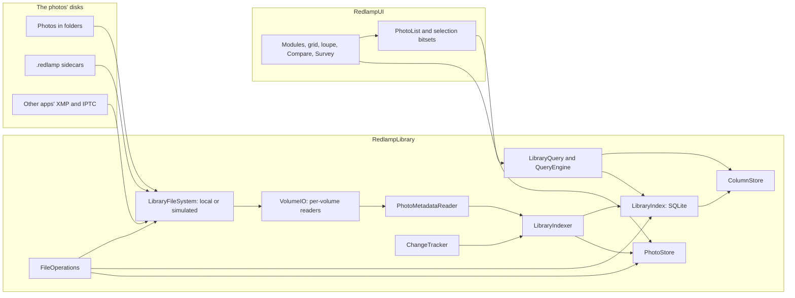

# Library and catalog: design

The owner's brief (5 October 2026): a library and catalog with Lightroom Classic's Library module at its heart, built for professionals' libraries of hundreds of thousands to millions of photos, some on spinning disks and network volumes, where searching shows results as you type, every action is instant and a held arrow key flies through the photos. The decisions are in the tracker (DEC-35 to DEC-44) and the work in its section 13 (LIB-01 to LIB-35, issues #215 to #249).

This document is the architecture every library row builds on. Its budgets are proposals until the stress harness (LIB-03, LIB-04) measures them; the Results section records what it measures, as the folders design does.

## What users get

- **Folders on disk stay the organisation.** Nothing is imported into a catalog that hides them. Each photo's ratings, flags, colour labels, marks, keywords, captions and collections are saved with the photo, in its `.redlamp` sidecar, so other Macs, the iPad and a lost index never lose them (DEC-35).
- **Sidecars beside each photo, or in Redlamp on this Mac.** Each added folder chooses; Redlamp chooses this Mac on its own wherever it can't write (a read-only share, a locked card). Move Edits and Metadata… moves them between the two, and Redlamp reads both (DEC-36).
- **Other apps' work comes across.** Ratings, labels, keywords and captions in a photo's XMP and IPTC, and in other apps' `.xmp` sidecars, are read; standard `.xmp` is written only when the user turns it on, keeping every field another app wrote (DEC-37).
- **Library and Develop are modules of one window**, switched by a key or a click, with the selection, source, filter and filmstrip carried across (DEC-42).
- **Every action three ways:** a key, the mouse and the command palette (DEC-41).

## Budgets

On 1,000,000 photos (the harness goes to 2,000,000), on an M-series Mac, with the photos on an internal or external SSD, a spinning disk or a network volume. The photos' own disks never affect the interactive budgets: browsing reads only from memory, the index and the store, all on the Mac's own disk.

| | Budget |
| --- | --- |
| Search as you type: the first page of results and the count | p95 under 16 ms |
| Facet counts (cameras, lenses, dates, keywords, labels) | p95 under 100 ms, never holding up the grid |
| An action (rate, flag, label, mark, keyword) on one photo or 10,000 | on screen within a frame |
| Switching between Library and Develop | on screen within a frame: main-thread work under 8 ms, no disk reads |
| Held arrow keys (key repeat, and 120 Hz) in the grid, the loupe and Develop | no dropped frames, main-thread p99 under 8.3 ms, no blank frame |
| A prefetched preview on screen | under 30 ms |
| Grid scrolling end to end over a million results | main-thread p99 under 8.3 ms |
| Launch with nothing changed: library visible and searchable | under 1 s |
| Memory over launch, browsing a million photos | under 250 MB |
| Memory idle after a memory-pressure trim | under 120 MB |
| Indexing | reported per kind of disk; the first results searchable within seconds |
| CPU while idle | none: no polling of local volumes |

## Components

The library is the `RedlampLibrary` package: platform-neutral, above `RedlampDocument` (folders, sidecars, scheduler, thumbnail packs), below `RedlampUI`, and linked by the CLI. It links macOS's own SQLite. Each component owns its files, so agents can build them in parallel.



| Component | Files (`packages/RedlampLibrary/Sources/`) | Row |
| --- | --- | --- |
| Paths | `LibraryPaths.swift` | LIB-05 |
| File system layer and simulated volumes | `FileSystem/` | LIB-03 |
| Fixtures and manifests | `Fixtures/` | LIB-03 |
| Benchmarks | `Bench/` (run by `redlamp library bench`) | LIB-04 |
| SQLite and the index | `Index/` | LIB-05 |
| Hot columns, the query language and engine | `Query/` | LIB-06 |
| Metadata reader, volumes and indexer | `Indexing/` | LIB-07 |
| Change tracking | `Changes/` | LIB-08 |
| Thumbnail and preview store | `Store/` | LIB-09 |
| Photo lists and selections | `Lists/` | LIB-10 |
| Sidecar location | `Sidecars/` | LIB-11 |
| Naming templates and file operations | `Naming/`, and `Files/` for the operations | LIB-25, LIB-26 |

## Photo identity

- **Where it is:** its path (volume, folder and name). The index's row ID is stable while the index lives: a rename or move Redlamp makes updates the row in place.
- **Which file it is, across renames and moves made in Finder:** the volume's UUID and the file's identifier (`URLResourceKey.fileIdentifierKey`, the inode, kept by APFS and HFS+ across renames and moves within a volume). A name that vanishes from a folder while a new one appears with the same file identifier, size and modification date is the same photo, renamed.
- **What it shows, across volumes and rebuilds:** the content key, the first 16 bytes of SHA-256 over the file's size and its first 64 KiB. Indexing reads those bytes anyway, for the metadata. The store is keyed by it, so a rename, a move, a copy to another drive or a rebuilt index finds the same thumbnails. A file rewritten in place gets a new key when its header or size changes; the store also checks the size and modification date it recorded.

## The index (LIB-05)

SQLite through a small wrapper of our own (`SQLiteDatabase`, `SQLiteStatement`), never a package.

- **On the Mac's own disk** (`LibraryPaths.index`), never on a network volume, with `journal_mode=WAL`, `synchronous=NORMAL`, `mmap_size` of 1 GB (mapped pages that aren't dirtied don't count against Redlamp's memory), `temp_store=MEMORY` and a bounded page cache (16 MB).
- **One writer and a few readers.** Writes run on the writer's own serial queue, in transactions of up to 1,000 rows; readers each hold a connection, used from the scheduler's lanes. Nothing touches SQLite on the main thread.
- **Schema** (`PRAGMA user_version` numbers it; each migration is a function from one version to the next, run in a transaction):

```sql
CREATE TABLE volumes (id INTEGER PRIMARY KEY, uuid TEXT UNIQUE NOT NULL, name TEXT, kind INTEGER NOT NULL,
  event_database TEXT, last_event INTEGER);                  -- kind: 0 unknown, 1 SSD, 2 spinning, 3 network
CREATE TABLE roots (id INTEGER PRIMARY KEY, volume INTEGER NOT NULL, path TEXT UNIQUE NOT NULL, bookmark BLOB,
  sidecars INTEGER NOT NULL DEFAULT 0);                      -- sidecars: 0 beside the photos, 1 on this Mac
CREATE TABLE folders (id INTEGER PRIMARY KEY, root INTEGER NOT NULL, parent INTEGER, path TEXT UNIQUE NOT NULL,
  signature INTEGER, indexed_signature INTEGER, listed_at REAL);
CREATE TABLE photos (id INTEGER PRIMARY KEY, folder INTEGER NOT NULL, name TEXT NOT NULL, kind INTEGER NOT NULL,
  size INTEGER NOT NULL, modified REAL NOT NULL, file_id INTEGER, content_key BLOB,
  captured REAL, captured_offset INTEGER, camera INTEGER, lens INTEGER, iso REAL, aperture REAL, shutter REAL,
  focal REAL, width INTEGER, height INTEGER, orientation INTEGER, latitude REAL, longitude REAL,
  rating INTEGER NOT NULL DEFAULT 0, flag INTEGER NOT NULL DEFAULT 0, label INTEGER NOT NULL DEFAULT 0,
  marked INTEGER NOT NULL DEFAULT 0, edited INTEGER NOT NULL DEFAULT 0, sidecar_modified REAL, xmp_modified REAL,
  title TEXT, caption TEXT, state INTEGER NOT NULL DEFAULT 0, indexed INTEGER NOT NULL DEFAULT 0,
  UNIQUE (folder, name));                                    -- state bits: missing, offline, settling
CREATE TABLE cameras (id INTEGER PRIMARY KEY, make TEXT, model TEXT, name TEXT UNIQUE NOT NULL);
CREATE TABLE lenses (id INTEGER PRIMARY KEY, name TEXT UNIQUE NOT NULL);
CREATE TABLE keywords (id INTEGER PRIMARY KEY, parent INTEGER, name TEXT NOT NULL, path TEXT UNIQUE NOT NULL);
CREATE TABLE photo_keywords (photo INTEGER NOT NULL, keyword INTEGER NOT NULL, PRIMARY KEY (photo, keyword))
  WITHOUT ROWID;
CREATE TABLE collections (id INTEGER PRIMARY KEY, parent INTEGER, name TEXT NOT NULL, kind INTEGER NOT NULL,
  query TEXT);                                               -- kind: 0 set, 1 collection, 2 smart collection
CREATE TABLE collection_photos (collection INTEGER NOT NULL, photo INTEGER NOT NULL, position INTEGER,
  PRIMARY KEY (collection, photo)) WITHOUT ROWID;
CREATE VIRTUAL TABLE photo_text USING fts5(name, keywords, title, caption,
  content='', contentless_delete=1, tokenize='trigram');     -- rowid is photos.id; written by the writer (Results)
CREATE TABLE settings (key TEXT PRIMARY KEY, value) WITHOUT ROWID;
CREATE TABLE photo_hashes (photo INTEGER PRIMARY KEY, size INTEGER NOT NULL, modified REAL NOT NULL,
  content_key BLOB NOT NULL, sha256 BLOB NOT NULL);          -- version 3 (LIB-39): a full hash, kept while
                                                              -- the file's size, date and content key hold
```

- **Snapshots and integrity.** While the index changes, a snapshot is taken with `VACUUM INTO` at most every 30 minutes, the last three kept (`LibraryPaths.snapshots`). `PRAGMA quick_check` runs in the background lane at launch once a week. A damaged index is replaced by its newest good snapshot and reconciled with the disks (LIB-08); with no snapshot, it's rebuilt.
- **Rebuilding** reads every folder, sidecar and photo header again in the indexer's order. It never starts from nothing for the user: the store survives it (content keys), and the sidecars hold everything that was decided.

## Hot columns and queries (LIB-06)

SQLite alone scans a million rows in tens to hundreds of milliseconds for a combination of predicates, which misses the search budget; the measurements decide. The plan is a **column store** in memory, one array per field the filters and sorts use, indexed by a dense row number:

| Column | Type | Bytes per photo |
| --- | --- | --- |
| photo ID | `Int64` | 8 |
| folder | `Int32` | 4 |
| captured (seconds) | `Int64` | 8 |
| camera, lens | `UInt16` each | 4 |
| rating (3 bits), flag (2), label (3), marked, edited | packed `UInt16` | 2 |
| ISO, aperture, focal length (bucketed), file kind | `UInt16`, `UInt8`, `UInt16`, `UInt8` | 6 |
| name order | `Int32` (rank in Finder order) | 4 |

About 36 bytes a photo, 36 MB for a million, plus 4 bytes a photo for each sort order kept (captured, name, edited). It's built from SQLite on a background thread at launch; until it's ready, queries go to SQLite. The writer updates it as it commits.

- **Evaluation:** text terms go to FTS5 (trigram, so substrings and prefixes of file names work) and come back as a bitset of rows; keyword, collection and folder terms come back as bitsets from their tables; then one pass over the columns, in the sort's permutation, keeps the rows every predicate accepts. The first page is ready as soon as it's full; the count finishes the pass. Facet counts are one more pass each, cancelled when the query changes.
- **Result:** a `PhotoList`, the matching photo IDs in order (`ContiguousArray<Int64>`, 8 MB for a million).

### The query language

One grammar for the filter bar, the command palette, smart collections and `redlamp library search`. Words are free text; `field:value` and comparisons filter; `-` negates; `OR` and parentheses group; quotes keep spaces.

```text
query    := term (("AND")? term | "OR" term)*
term     := "-"? (group | filter | text)
group    := "(" query ")"
filter   := field (":" | "=" | "!=" | "<" | "<=" | ">" | ">=") value
value    := word | quoted | range                          -- range: a..b, either end open
text     := word | quoted                                  -- matches name, folder, keywords, title, caption, camera, lens
```

| Field | Values | Examples |
| --- | --- | --- |
| `rating` (`stars`) | 0 to 5 | `rating>=3`, `rating:0` |
| `flag` | `pick`, `reject`, `none` | `flag:pick`, `-flag:reject` |
| `label` | `red`, `yellow`, `green`, `blue`, `purple`, `none`, custom names | `label:red,blue` |
| `marked` | `yes`, `no` | `marked:yes` |
| `edited` | `yes`, `no` | `edited:no` |
| `kw` (`keyword`) | a keyword or a path; a parent matches its children | `kw:birds`, `kw:"Places/Portugal"` |
| `camera`, `lens` | substring of the name | `camera:"X-T5"`, `lens:35` |
| `iso`, `f`, `focal`, `shutter` | numbers, ranges | `iso<=800`, `f:1.4..2.8`, `focal:24..70` |
| `date` (`taken`) | `2024`, `2024-06`, `2024-06-01`, ranges, `today`, `last:30d` | `date:2024-06..2024-08` |
| `folder` (`in`) | a path or part of one | `in:"Trips/2024"` |
| `name`, `ext` (`type`) | substring, extension or `raw`, `jpeg`, `heic`, `tiff`, `png` | `type:raw`, `name:DSC_12` |
| `collection` | a collection's name or path | `collection:"Portfolio"` |
| `has` | `gps`, `keywords`, `caption`, `title`, `xmp` | `has:gps` |
| `title`, `caption` | substring | `caption:wedding` |

Sorting is separate from the query: captured (the default), name, rating, edited, imported, file size, or a collection's own order.

## Indexing (LIB-07)

- **Volumes and their readers.** Each volume gets its own reader pool, sized by what it is (`volumeIsLocal`, `volumeIsInternal`; network volumes are never treated as local) and then by what it does: concurrency rises while throughput rises and falls when latency climbs (additive increase, multiplicative decrease), from 1 to the performance cores. SSDs settle wide, spinning disks at one or two readers in folder order, network volumes at several in flight.
- **One read per file.** A photo's first 256 KiB come through `LibraryFileSystem` once: the content key, the metadata (ImageIO, from the bytes; LibRaw's identity for files ImageIO can't read, passed in by the app since RedlampLibrary can't link RedlampServices) and, for raws, the location of the smallest embedded preview big enough for the grid. The preview's bytes are read next, and the grid thumbnail goes to the store.
- **Order:** the folders on screen first, then the newest folders by modification date, then the rest; the scheduler's on-screen, look-ahead and background lanes, background work paused in Low Power Mode and when the Mac is hot.
- **Resumable:** a folder is done when its `indexed_signature` matches its listing's `signature`; a restart picks up the folders that don't match.
- **Batched writes:** rows go to the writer in batches; the column store and open photo lists get diffs, never a reload.
- **Not in iCloud Drive, for now.** The app doesn't index folders in iCloud Drive: reading each photo's first bytes would download it. They're listed from the disk as before.

## Change detection (LIB-08)

- **FSEvents replayed at launch:** each local volume keeps its event database's UUID (`FSEventsCopyUUIDForDevice`) and the last event the index applied; launch opens one stream per volume from that event (`FSEventStreamCreateRelativeToDevice` with `sinceWhen`), and only the folders it names are listed again.
- **When the history is gone** (a different event database, `MustScanSubDirs`, a volume used on another Mac): folder signatures (the directory's modification date, its entry count and a hash of names, sizes and dates) are compared folder by folder, in the indexer's order.
- **Network volumes** have no FSEvents: the shown folders are polled every 15 s and the rest with backoff up to 15 minutes, and polling stops while the app is in the background.
- **Renames and moves made in Finder** are recognised by file identifier (Photo identity); sidecars left behind are offered back to their photos.
- **A volume that can't be reached** never blocks anything: every file operation on it has a timeout, its photos show as offline, and it's browsed and searched from the index and the store until it's back. A volume that only answers slowly isn't unreachable: an overdue operation asks the volume's root first, and an operation still going after thirty timeouts fails alone, leaving its folder to the next run.
- **Launch** shows the index at once and reconciles behind it: from the event history when there is one, by folder signatures otherwise, the folders on screen first.

## The store (LIB-09)

- **Keyed by content key**, in 256 shard files by the key's first byte, each an append-only pack with its own index (the `ThumbnailPacks` format, version 2, with 16-byte keys instead of names).
- **Two tiers:** grid thumbnails (384 px on the long edge, JPEG at quality 0.5, about 22 KB), kept for every indexed photo; previews at screen size (2048 px, JPEG at 0.6, about 560 KB), kept for recent, rated and picked photos within a budget (10 GB by default, about 18,000 previews). Edited thumbnails and previews are keyed by the content key and the edit's digest (LIB-17).
- **Budgets and location:** Settings shows the store's size and where it is; it can move to another disk; the grid tier is never evicted while its photo is indexed unless the user lowers the budget.
- **Memory:** decoded thumbnails in an LRU (the filmstrip's 128 MB budget), from pack JPEGs held in ImageIO's purgeable memory, as today.

As built (LIB-17): an edited photo the library shows is rendered with its edit by Redlamp's own engine, in an engine of the library's own, at the store's preview size, and both tiers are stored under its content key and its edit's digest; renders of an edit the photo no longer has leave both tiers unless another copy of the photo shows them. Until its render is in, its embedded preview shows, with ••• in place of the edited badge on grid and filmstrip cells and in the loupe's corner; when an edit changes, the embedded preview shows until the new edit is rendered, never the old edit's render. The photos on screen go first (the grid's, the filmstrip's and the active photo), then those within a screen of them, nearest first, then the rest of the source. A render goes from one step to the next (opening the photo, rendering it, storing its tiers) only while Develop has asked for no frame for a second and isn't opening a photo, no export runs and no dialog is open, no thumbnail on screen waits, and the Mac isn't hot or saving power. One renders at a time; the engine is let go once the photos it opened would take more than 256 MB of the GPU's memory, which is after each raw of about 24 MP or more, and after 10 s with nothing to render. An edit made by a newer Redlamp, or whose Base Look isn't on this Mac, isn't rendered. Develop's placeholder uses the render once it's stored. Not yet: after a relaunch, renders show only once each edited photo's sidecar has been read again.

## Photo lists and selections (LIB-10)

- A `PhotoList` is a source's photo IDs in order, with diffs (inserted, removed, moved, updated) for the views; cells fetch their rows from the column store when they appear.
- A selection is a bitset over photo IDs (125 KB for a million) and an active photo; not over the column store's rows, which compaction renumbers.
- `LibraryLive` keeps the open lists current: it applies the indexer's and change tracking's events to the query engine in batches, one update at a time, and publishes each list's diff. FSEvents doesn't report Redlamp's own writes on this Mac, so the app sends them to `LibraryLive` itself.
- The open folder becomes one source among the others (folder, folder with subfolders, collection, smart collection, search, All Photographs, Previous Import, Marked, Rejected). `FolderLibrary` keeps its listing and watching for folders the library hasn't indexed, and its `--folders-perf` budgets.

## Sidecars on this Mac (LIB-11)

`SidecarStore` gets a locator: by default `IMG_1234.ARW.redlamp` beside the photo; for a root that keeps them on this Mac, `LibraryPaths.sidecars/<volume UUID>/<path from the volume's root>.redlamp`. Reading looks in both, beside first, but a newer copy on this Mac wins, so edits made while a volume was read-only aren't hidden by the older sidecar beside the photo. A root is set to keep its sidecars on this Mac on its own when Redlamp can't write beside its photos: local volumes are checked for write access without writing anything, and only network shares get a hidden file, made and then removed. Move Edits and Metadata… moves a root's sidecars both ways, copying, checking and then removing the old copy, never overwriting; its journal in `LibraryPaths.root` lets the next launch finish an interrupted move, until the file-operations journal (LIB-26) takes over. The `.xmp` written for other apps (LIB-24) always sits beside the photo.

## What the sidecar gains

`metadata` is an open object, so older builds keep fields they don't know (`sidecar-format.md`, rule 2). It gains:

| Field | Holds |
| --- | --- |
| `keywords` | full paths, `Places/Portugal/Lisbon`, so a photo describes itself without the keyword list; a `/` inside a name is written `%2F` and a `%` as `%25` (`Music/AC%2FDC`); an empty list means no keywords, and no list at all lets other apps' XMP supply them (LIB-21) |
| `title`, `caption`, `creator`, `copyright`, `location` | IPTC Core fields |
| `collections` | the collections a photo is in, by path |
| `mark` | the quick-collection mark |
| `customLabel` | a custom label's name: an unknown `label` value makes a sidecar unreadable to older builds, so custom labels never go in `label` |
| `originalName` | the photo's file name before Redlamp first renamed it (LIB-26), kept by older builds as a field they don't know |

## Keywords (LIB-21)

- **Each photo's keywords** are in its sidecar as full paths (above); the index's `keywords` and `photo_keywords` tables are built from them, so the keyword list, with how many photos have each keyword or one inside it, comes from the index.
- **What photos can't carry** is in `Definitions/Keywords.json` in `LibraryPaths.root`: keywords no photo has yet, synonyms, the three export flags (include on export, export the keywords containing it, export synonyms), the category, private and person types, and keyword sets. Keys a newer build wrote are kept, and the index stays rebuildable (DEC-35).
- **Changes** (add and remove on a selection; rename, move, merge, delete) are one batch each, journaled in `Keyword Changes/` and undoable, rewriting the sidecars of the photos they touch off the main thread.
- **`kw:`** matches a keyword's path, any part of one, and its synonyms. **Completion** matches a prefix or any word of a keyword or its synonyms, best first.
- **Lightroom Classic's keyword-list file** imports and exports with everything it holds: levels by tabs, synonyms in braces, keywords not exported in brackets.
- **Other apps' keywords** come through XMP (LIB-24): `lr:hierarchicalSubject` as paths and `dc:subject` as flat names, both ways.

## Import (LIB-27)

- **Sources:** a card (a removable volume with a `DCIM` folder, as cameras write them) or any folder, several at once, each read through its own volume's readers.
- **Browsing before copying:** a source's photos are listed and their embedded previews made into the store, newest first, before anything is copied; the choices made while browsing (which photos, ratings, flags, labels) stay in the session and are written into each photo's `.redlamp` at the destination. A photo the library already has (by content key) is skipped before its preview is read.
- **The plan:** a folder template from capture dates and a name template (LIB-25), collisions numbered in capture order, an optional backup destination, raw-only (a raw's JPEG and photos that aren't raws stay on the source), and keywords and metadata to apply, previewed before anything is copied.
- **Copying** is journaled and resumable. Each file is read once and written to the destination and the backup as real copies (never clones), read back and matched by size and SHA-256, and renamed into place without replacing anything; the drives are flushed (`F_FULLFSYNC`) every 64 photos or every second.
- **Safe to erase,** card by card: the import finished and every photo chosen on that card is verified at every destination. Photos left out, by the user or by raw-only, don't count, and the plan lists them so the app can warn.
- **One ingest step** puts a new file where a session's templates say, with the same defaults, for the import window and, later, tethered capture (TET-01).

## Stacks (LIB-28)

Stacks are found from the index alone, never by reading a file, on every core:

- **Pairs:** a raw, a JPEG and a HEIC in one folder named alike but for the extension (case and Unicode's forms folded), with the raw on top.
- **Bursts:** one camera model, one folder and one exposure length, each frame starting at most a second after the last one ended (continuous drive at its slowest is about a frame a second); the first frame on top unless the user chose another.
- **Focus-stack suggestions:** `StackDetector`'s capture rules over each folder's frames, a pair counted once; the app still confirms them from thumbnails.
- **Manual stacks,** across folders; a photo in one is in no burst. Each photo's sidecar will hold `"stack": {"id": "<UUID>", "top": true}` in its metadata: the photos sharing an `id` are one stack, and `top` is written only when true. Until that field lands, manual stacks live in the index.

Every list can show its stacks closed, each one cell with a count, and open them one at a time or all at once, with diffs as they open, close and change. A closed stack's selection is all of its photos, so a pair's change reaches both files and nothing is chosen out of sight. Working out a list's stacks again costs about as much as building the list, so it runs off the main thread.

## Moments and grouping (LIB-41)

Any source (a folder, a collection, a search, a selection, or a card browsed for import) can be shown in the grid grouped, and walked in the loupe: no new module, and nothing new in sidecars ([LIB-katami §4](../research/notes/LIB-katami.md#4-moments-and-sessions)).

- **Moments** come from the column store: the list's photos in capture order, with a new moment where the gap to the previous frame is longer than both a floor and a multiple of the typical gap around it, starting from 60 s and four times the median of the 20 gaps around (the measurement in the open points sets the defaults). One Tighter–Looser control on the list moves both. Runs inside a moment are LIB-28's bursts.
- **Deterministic:** the same photos and setting always give the same moments, ties broken by capture time and then name, so a rebuilt index gives them back. Two bodies are one moment when their clocks agree; grouping by moment and camera splits them.
- **Group By** on any list: none, moment, day, folder, camera, lens or orientation, each group with a header, its count and its picks, opened and closed as stacks are. The moments without a pick are a count that filters to them.
- **A source's summary:** the days, bodies and lenses it spans, its ISO, shutter and aperture ranges, and its pairs and stacks, from the column store.
- **Stored:** the grouping and its setting are part of the source's view, which LIB-14 keeps for each source; moments are worked out for the list.
- **Budgets:** LIB-28's: one pass over sorted times, off the main thread, under 1 s for a million photos, a moment opened or closed in under 2 ms and all of them in under 50 ms, with diffs.

Soft frames (LIB-42) would propose a pick for each moment: the sharpest frame of each burst at the camera's focus point, measured on the largest embedded preview and judged only within its burst, kept in the index by content key, drawn dashed until accepted, never touching a frame the user decided, with Changed by You as a filter.

## Other apps' metadata (LIB-24)

`LibraryXMP` reads what other apps wrote and, when the library's option is on (off by default), writes standard `.xmp` beside each photo, whatever the root's sidecar placement. The `.redlamp` sidecar stays the source of truth (DEC-37); originals are never written.

| Redlamp | Read | Written |
| --- | --- | --- |
| Rating | `xmp:Rating` 1 to 5, IPTC's StarRating | `xmp:Rating` |
| Reject | `xmp:Rating` −1 | −1; the stars stay in the `.redlamp` |
| Pick | `xmpDM:good` | `xmpDM:good` |
| Label | `xmp:LabelColor`; `xmp:Label` in Lightroom's, Bridge's or Review Status names; `photoshop:Urgency` when turned on; darktable's labels | the name in the chosen set, with `xmp:LabelColor`; Urgency when turned on |
| Keywords (LIB-21) | `lr:hierarchicalSubject`, and flat names from `dc:subject` | both |
| Title and caption (LIB-22) | `dc:title`, `dc:description`, default language | the default language; other languages kept |

- **Which source wins.** Other apps' value comes from `name.xmp`, then darktable's `name.ext.xmp`, then the embedded XMP, then IPTC, field by field. The first time, the `.redlamp`'s fields win and the others fill gaps; after that, against each photo's record, a field only another app changed is taken, and where both changed, the later file wins.
- **A raw and its JPEG.** In a `name.xmp` they share, the raw decides, and a JPEG's write never clears a field. darktable's `name.ext.xmp` is read and never written.
- **Writing** happens only when a field changed, keeps every element and namespace Redlamp doesn't own, and is atomic; change tracking is told the file is Redlamp's own.
- **Records** of what was merged, per photo, are in the index's settings table for now.
- **The index reads them the same way.** The indexer parses other apps' XMP with `LibraryXMP`'s own code: the photo's embedded XMP from the ImageIO source its header is read from, so each photo is still read once, and `name.xmp` and darktable's `name.ext.xmp` beside it. It merges them with the `.redlamp` field by field as `XMPMerge` does, from a photo's record once it has been synced, so the index and `LibraryXMP` agree on every field, and a `.redlamp` without stars doesn't hide another app's rating.

## Modules and keys (LIB-13)

| Key | Library | Develop |
| --- | --- | --- |
| `G`, `E`, `C`, `N` | Grid, Loupe, Compare, Survey | the same, switching to Library |
| `D` | Develop, on the Edit tool | the Edit tool |
| ⌥⌘1, ⌥⌘2, ⌥⌘↑ | Library, Develop, the previous module | |
| `=` / `-` | thumbnail size | step the selected setting |
| `J` | cycle the grid's cell style | clipping |
| `\` | the filter bar | Before/After |
| `B` | mark (quick collection) | mark |
| 0–5, `P`, `X`, `U`, 6–9, `[`, `]` | on the whole selection, with Undo | on the active photo |
| arrows, Home, End, Page Up, Page Down | move; ⇧ extends the selection | previous and next photo |
| Return, Space, double-click | open in the Loupe | |
| `Z`, Space or a click in the Loupe | Fit and 1:1 | |
| ⌘R | show the selection in Finder | show the photo in Finder |
| ⌘K | the command palette | the command palette |

Every one has a menu item and most a mouse gesture: stars, flag and label on a cell; context menus on photos, folders, collections and keywords; drag and drop onto folders, collections and photos; a thumbnail-size slider; a module picker in the toolbar.

As built (LIB-13): Library and Develop share the editor window, each built once; a switch changes only which one is opaque, so nothing is rebuilt and nothing is read from the disk. Library shows the grid or the loupe (from the photo's preview), its own Folders and Photo info panels, and the filmstrip docked below; the grid and the filmstrip share one selection. C and N show the loupe until Compare and Survey exist (LIB-16), and say so in their menu items; D, R, Q and ⇧W open Develop with that tool. Develop keeps its photo open while Library is shown, and actions that would change that hidden photo (sliders, masks, Undo) are off until it's shown again. Undo is per module for now. No existing key moved.

As built (LIB-14): the grid's cells are layers recycled row by row, with thumbnails drawn off the main thread in the window's colour space. Sizes go from 80 to 400 points by `=`, `-` or a slider, from the store's grid tier and its preview tier for large cells. `J` cycles three cell styles: compact, expanded (the name, the date and the camera's settings) and thumbnails only. A rubber band selects, ⇧ or ⌘ adding to the selection, on photo IDs the filmstrip shares. Context menus on photos and on the grid's background, and a Library toolbar, hold every grid action; each source keeps its size, style, place and selection. The Loupe goes between Fit and 1:1 with `Z`, Space or a click, and pans by dragging. ⌘R went to an earlier ⇧⌘R menu item in AppKit, so it reset a photo's settings; it now shows the selection in Finder.

## File operations (LIB-25, LIB-26)

Renames, moves, new folders and moves to the Trash go through a journal in `LibraryPaths.root` written before anything moves: each step's source and destination, the photo's sidecar and other apps' `.xmp`. A forced quit leaves a journal the next launch finishes or rolls back; Undo replays it backwards. Nothing is ever overwritten; a collision stops the batch before it starts, in the preview.

- **The journal** (`File Operations/`, on the Mac's own disk) is a file of JSON lines per batch, its summary and then a step a line, written to a hidden name, synced (`F_FULLFSYNC`) and renamed into place before anything moves. Its log gets a line as each step is done, written straight to the file, so a forced quit loses none of them; a power cut may lose the last few, and the files themselves say how far the batch got.
- **Renames** take a raw with its JPEG, its `.redlamp` sidecar (wherever its root keeps it) and other apps' `.xmp`, in an order that goes through temporary names where renames form a cycle, and record each photo's first name in its sidecar's `originalName`.
- **Moves** within a volume are renames; across volumes each file is copied, synced and checked by size and full hash before its original goes, and a failed copy leaves the source as it was.
- **The Trash** keeps where each item went, so Undo brings it back while it's still there. Other plans, such as the duplicates' removal plan (LIB-39), go through the same step. The duplicates' batch is checked again just before it runs: no copy being kept is also being removed, the index still has every copy and every kept copy at the plan's path, each matches its size, date and full SHA-256, and only the copies' own files move (their sidecars, and `.xmp` no remaining photo shares). Size, date and sidecars are checked again right after; if anything differs, nothing moves and the report lists each difference.
- **The index and open lists** follow in one write a batch: photos keep their IDs and get their new paths, and `LibraryLive` hears each change.

### Naming templates

One grammar names files for renaming, importing (LIB-27), batch export (EDT-16) and capture sessions (TET-01): `NamingTemplate`, in `Sources/Naming/`. Text is kept as it's written, and tokens in braces put in a photo's fields, each with values after colons and modifiers after bars, applied left to right: `{date:yyyyMMdd-HHmmss.SS}-{camera|lower}-{sequence:4}`.

```text
template := (text | token)*
text     := (a character but { and } | "{{" | "}}")+
token    := "{" name (":" value)* ("|" name (":" value)*)* "}"
value    := bare | quoted          -- bare: no : | { } or ", and the spaces at its ends dropped
quoted   := '"' (a character but '"' | '""')* '"'
```

- **The only escapes are doubled characters:** `{{` and `}}` for braces in the name, and `""` for a quote in a quoted value. Backslashes mean nothing, so a regular expression is written as it reads: `{original|regex:"^IMG_(\d+)$":"Photo $1"}`.
- **The text reads back.** `description` is the template's canonical text (names in small letters, values bare where they can be), which parses back to the same template; presets keep it. Its parts, and where each is in that text, are what a template editor shows as tokens.
- **Errors** name the characters at fault in a sentence: `camra isn't a token; did you mean camera?`, `this { isn't closed: end the token with }`, `Q isn't part of a date: use yyyy, MM, dd, HH, mm, ss or SSS, and put text in 'quotes'`. As you type, a token still open at the end is left out, so the preview follows the typing; a name that isn't a token is an error as soon as something follows it.

| Tokens | |
| --- | --- |
| Dates | `{date}` (`taken`) when the photo was taken, by the camera's clock; `{modified}`; `{now}`, when the job runs. A format in Unicode's date pattern letters (`yyyyMMdd` by default), with `S` to `SSSSSS` the fraction of the second from the photo's sub-second time and `Z` the offset; then a zone: the camera's own (`{date}`'s default), `local`, `utc`, an offset (`+0530`) or a zone's name (`Europe/Lisbon`), reached from the offset the camera recorded |
| Camera | `{camera}` "Nikon Z 6", `{make}` "Nikon", `{model}` "Z 6", `{lens}`, `{iso}`, `{aperture}` (`f`) "2.8", `{shutter}` "1-250" or "2", `{focal}` "35", `{width}`, `{height}` |
| Metadata | `{title}`, `{caption}`, `{creator}`, `{copyright}`, `{city}`, `{state}`, `{country}`, `{sublocation}`, `{keywords}` (the last part of each, joined by spaces or the value given), `{rating}` (`stars`), `{label}`, `{flag}` |
| File | `{name}` (`filename`), the name now, and `{original}`, before Redlamp first renamed it, both taking characters (`{original:-4..}`); `{number}`, the digits that end the original name (Lightroom's original number suffix); `{ext}`; `{folder}`, and `{folder:2}` for its parent |
| Numbers | `{sequence:4}` (`seq`) in the job, `{sequence:4:folder}` in each folder the photos go to and `{sequence:4:extension}` among the photos with the raw's extension, from the job's first number; `{total}`; `{counter:shoot:4}`, a named counter that carries on from one job and session to the next |
| Text | `{text}` and `{text:shoot}`, texts the job is given: Lightroom's Custom Text and Shoot Name |

Modifiers: `upper`, `lower` and `title` (each word's first letter in capitals); `range:5..8`, characters counted from 1 at the start or from -1 at the end, either end open; `replace:IMG_:Photo-`; `regex:pattern:template:i`, in ICU's syntax, with `$1` for a group and `i` to ignore case; `default:Untitled`, which also stops the token being flagged as empty, so `default:""` marks one that may be; and `before:"("` and `after:" - "`, text put beside the value only when there is one.

- **Fields** come in a `NamingFields` value the caller fills from the index, the capture metadata and the sidecar (it has initializers for `PhotoRecord`, `CaptureMetadata` and `PhotoMetadata`), so naming reads no file.
- **Names are safe on macOS, on network shares and on Windows.** `/ : \ * ? " < > |` and control characters become `-` or `_` (an option, as replacing spaces is); marks that change which way text reads are dropped; leading dots and spaces and trailing spaces are trimmed; device names Windows keeps (`CON`, `NUL`, `COM1`) get an ending; names are in Unicode's composed form (NFC); and a name, its extension and the 8 bytes its `.redlamp` sidecar adds fit in 255 bytes of UTF-8. A long name loses its longest text fields first, evenly and between characters, so its dates and numbers stay. Extensions are kept, or put in small or capital letters.
- **Batches** (`NamingJob`, made once for a preview and named again at each keystroke). A raw and its JPEG (one folder, one name but for the extension) share a name made from the raw's fields and count once in sequences, and sequences follow the order the photos are given. No two photos get one name in a folder, ignoring case and Unicode's forms as APFS does, and none takes the name of a file already in the folder the photos go to, given as its listing. A name is taken by a file of that name with any extension, or by its sidecars, so a new name never pairs photos that aren't a raw and its JPEG. A photo that keeps its name keeps it; the others get theirs in capture order, and those after the first are numbered from 2 (`Wedding-2`), also in capture order. The job's own photos and their sidecars leave their names free, and the file operations order the renames, through temporary names where they form a cycle. Each photo's result says what was decided: the number it took and who has the name without it, the tokens that came out empty, and what was changed to make the name safe. A template that makes nothing leaves the photo its name.
- **Presets** (`NamingPreset`: a name, a template and its options, as JSON) include Lightroom Classic's nine file naming templates under their own names (Custom Name - Sequence, Date - Filename, Shoot Name - Original File Number and the others), and three of Redlamp's: the capture time to the millisecond, a shoot name with a counter, and a sequence in each folder.
- **`redlamp library names <template> --index <path> [<query>]`** prints each photo's path and its new name, the numbers and empty tokens beside it, and a summary, with `--json` and `--limit` as `search` has them and `--text` for the job's texts. It never renames.

## Library Health (LIB-40)

Checks that each list the photos needing a decision, from the index, the store and the indexer's one read per file ([LIB-katami §3](../research/notes/LIB-katami.md#3-library-health)). Exact duplicates (LIB-39) are the first.

- **Raw and JPEG pairs:** LIB-28's pairs, under a rule the user picks: keep both (the default), keep the raw or keep the JPEG. A half with anything of its own (an edit, keywords, a title or caption, or a rating, flag or label that differs from the other half's) is listed apart and left out unless chosen. A dropped half goes to the Trash with its own `.redlamp` and `.xmp`; a `name.xmp` the pair shares stays with the raw.
- **Damaged files:** a new index state, `unreadable`, set when the indexer's read fails for any reason but a missing file or an offline volume (today `LibraryIndexerEvent.failed` is reported and nothing is kept); empty files, from the listing; and files that end early, checked only where it takes a small read: a JPEG's end-of-image marker, a TIFF-based raw's strip and tile offsets in the 256 KiB already read, an ISO base media file's top-level box sizes. Files still being written are never listed. Nothing is repaired: Reveal in Finder, Move to Trash or Keep Anyway.
- **Wrong extensions:** the first bytes, which the indexer reads anyway, against the extension's family (a `.jpg` holding HEIC, a `.CR3` holding JPEG), never one TIFF-based raw's extension for another's. The fix is a rename through LIB-26, with the sidecar, `.xmp` and pair following.
- **Missing photos:** LIB-08's `missing` state, with Locate… and sidecars left behind offered back to their photos.
- **Shown only while there's something to decide.** A Library Health group in the Library panel (LIB-23) lists each check that has findings, with its count, and goes when every check is empty. Each check is a source (LIB-10), so the grid, the loupe, Compare and the filter bar work on it. There's no dashboard or score.
- **Proposals look like proposals.** A proposed keeper or drop is drawn apart from the user's own flags and never written as one. Accepting is one batch through LIB-26, to the Trash only, which one Undo reverses. A photo the user rated, flagged or labelled is never acted on because a proposal said so.
- **Keep Anyway** is kept in `Definitions/Health.json`, keyed by the photo's content key and the check (for duplicates, by the group's SHA-256, so a third copy reopens the group), not in sidecars, so it survives an index rebuild; a Kept Anyway list takes it back.
- **Budgets:** the checks that use only the index keep LIB-39's (a million photos grouped in under a second, off the main thread), with counts changing by diffs; reading the ends of files runs per volume in the background lane. `redlamp library health` lists the findings, with JSON.

## The stress harness (LIB-03, LIB-04)

- **Fixtures** (`redlamp library fixture <folder> --photos <n> --seed <s>`) in `/Volumes/SSD/redlamp-tmp/library-fixtures/` on the owner's Mac (not backed up):
  - a fifth of the photos are APFS clones of the CC0 raws, each with its capture date rewritten in place, which costs one 4 KB block per photo;
  - the rest are small JPEGs and HEICs with varied EXIF (25 cameras, 40 lenses, ISO, aperture, shutter, focal length, dates over 20 years), GPS on a third and IPTC keywords and captions on a fifth;
  - `.redlamp` sidecars with ratings, flags and labels on 15%, and other apps' `.xmp` on 5%;
  - folder shapes: years and days, clients and jobs, one folder of 20,000 photos, a tree 12 levels deep, Unicode and 200-character names;
  - a manifest with the count every benchmark query must return, from the generator's own (seeded) choices.
- **Simulated volumes:** `SimulatedFileSystem` wraps the local one with a profile: per-operation latency, bandwidth shared by the operations in flight, a cap on operations in flight (one for a spinning disk's head, with a seek between files), jitter, and disconnects (operations that fail or time out). Profiles: `ssd`, `spinning` (8 ms seeks, 160 MB/s, one at a time), `nas` (0.8 ms, 110 MB/s, 16 in flight), `wifi` (12 ms ± 50%, 25 MB/s, 8 in flight), `vpn` (40 ms, 5 MB/s). Cold-cache runs use a disk image detached between runs.
- **Headless scenarios** (`redlamp library bench <fixture> --profile <p>`): a cold index build, a warm launch, reconciling after changes made while closed, search as you type over the manifest's queries (each typed a character at a time), facets and sorts, 10,000 ratings written, a rename interrupted by a forced quit, a volume vanishing partway through indexing. Each ends PASS or FAIL against its budget and the manifest's counts; any FAIL exits 1.
- **In the app** (`--library-perf <fixture>`, as `--folders-perf`): grid scrolling, held arrow keys in the grid, the loupe and Develop, 200 switches between Library and Develop, culling 10,000 photos at once, 10,000 files arriving, and the footprint through each phase.
- **Regressions:** `scripts/library-perf.sh` runs both on a Release build and exits 1 on any FAIL; the metrics are in `docs/performance/metrics.json` (`library-*`), recorded by `scripts/perf-record.sh` and drawn on redlamp.app/performance.
- **Differential checks:** random queries are answered by the column engine and by SQLite alone, and must agree.

## Results

Measured by the harness as the rows land; nothing here is estimated. The first runs were on an M1 Ultra (16 performance and 4 efficiency cores) with other builds running (load average 35 to 80), so they are conservative.

### The index at a million photos (LIB-05)

`IndexBenchmarkTests` with `REDLAMP_INDEX_BENCH=1`, two runs:

| | Measured |
| --- | --- |
| Inserting, in batches of 1,000 | 11,500 to 12,700 photos a second |
| A full scan of the hot columns | 363 ms (2.7 million rows a second) |
| A photo by path | 7.6 to 7.9 µs |
| A trigram search for 4 characters of names | 0.22 ms (300 matches) |
| `count(*)` of rating ≥ 3 and one camera | 57 to 63 ms |
| Rating 10,000 photos | 26 ms when they're consecutive rows, 568 ms spread across the library |
| `quick_check` | 4.3 s |
| A snapshot (`VACUUM INTO`) | 2.8 s, 589 MB |
| The index file | 598 MB, 383 MB of it the text index |

What it changed:

- **SQLite alone misses the search budget.** A count over two predicates takes 60 ms at a million photos, four times the 16 ms budget, so the column store is needed; building it from the hot-column scan takes about 0.4 s at launch, in the background.
- **The text index covers name, keywords, title and caption.** Indexing all seven text columns ran inserts at 12,100 a second; these four, at 17,700. Folder paths, cameras and lenses are matched in their own small tables (thousands of rows, not millions) and become folder, camera and lens IDs for the column pass.
- **No index on the content key.** It alone took a C replica of the inserts from 104,000 to 20,000 rows a second. Lookups by content key (importing skips photos already in the library) load the keys into a set once instead.
- **The text index is written by the writer, not by triggers.** FTS5 flushes its pending terms at every statement savepoint, which a trigger opens, halving insert speed.
- **The integrity check runs in the background,** weekly: 4.3 s is too long for launch.

### Queries at a million photos (LIB-06)

The column store and engine on 1,000,000 synthetic rows in memory, every query of the fixture's corpus typed a character at a time (load average about 20):

| | Measured | Budget |
| --- | --- | --- |
| First page and count | p50 0.09 ms, p95 2.1 ms | p95 under 16 ms |
| The same, with every photo in order | p95 4.6 ms | |
| Facet counts | p95 11 ms | p95 under 100 ms |
| Column store | 70 bytes a photo | |

On the 20,000-photo fixture (`redlamp library bench … --scenario search`), all 43 counts equal the manifest's, with the first page and count in p95 0.12 ms and facets in p95 0.3 ms; the store builds in 26 ms. What helped: matching folder names as lowercased bytes instead of Foundation's case-insensitive search (p95 27 ms to 2.1 ms), keeping each term's matches per store, and sorting folders by key rather than with `localizedStandardCompare` for facets (29 ms to 11 ms).

### Metadata (LIB-07)

`PhotoMetadataReaderTests` with `REDLAMP_METADATA_BENCH=1`, on the 26 CC0 raws, under load:

- **The first 256 KiB are enough** for ARW, CR2, DNG, ORF, PEF, RW2, 3FR and the Z 8's NEF, passed to ImageIO padded with zeros to the file's length (ImageIO reports a raw's size only when the data looks as long as the file). CR3, RAF, the Z 6's NEF, FFF, IIQ and SRW need ImageIO to read the file itself, which touches 16 to 740 KB of it.
- **Reads a second:** 46 to 277 on one core, depending on the format, and 432 to 2,429 across all cores; content keys at 35,000 a second on one core. At a thousand photos a second, a million take about 17 minutes on an SSD, metadata only; searching works over what's indexed so far.

### M1's run at a million photos (LIB-04, LIB-07, LIB-08)

`redlamp library bench` on `lib-1m.noindex` (1,000,000 photos in 5,604 folders, the manifest's 43 queries) through the simulated SSD, a scenario at a time under `/usr/bin/time -l`, with three agents building (load average about 80):

| Scenario | Result | Budget | Peak memory |
| --- | --- | --- | --- |
| index-build | all 1,000,000 in 2,153 s, 464 a second, no failures; the first 1,000 searchable in 3.5 s | first 1,000 under 2 s: FAIL | 1.33 GB |
| warm-launch | visible and searchable in 419 to 428 ms with the index cold on the disk, 309 to 318 ms warm (12.0 s before); reconciled behind it in 17 to 37 s by folder signatures, or 322 to 471 ms after launch from the event history | under 1 s: PASS | 1.32 GB |
| vanishing-volume | every check passed (3 failed before) | PASS | 86 MB |
| search | all 43 counts equal the manifest's | p95 under 16 ms: PASS | 1.56 GB |
| facets | p95 17.2 ms | under 100 ms: PASS | 387 MB |
| lists | every check passed | PASS | 707 MB |

What it changed:

- **A crash only a million photos reach.** The batcher kept its commit callback, a closure, in a `Mutex`, and each read wrapped it in another thunk: 192 bytes of stack more per batch, until a 524 KB cooperative thread's stack ran out about a thousand batches in (5,560 nested frames in the crash report, whose own backtrace showed 27). The batcher now holds its run by a weak reference; a test of 5,000 one-photo batches crashed the test process before the fix.
- **Photos read while the walk goes on.** Every folder listing went to the volume ahead of every photo read, so nothing was searchable until the walk ended: the first 1,000 photos took 30.7 s. Now only the folders on screen and those above them go first.
- **A warm launch shows the index at once.** It listed all 5,604 folders before it was done, 12 s at this size. Now the index's file is read into memory and the column store loads in four parts across the index's readers (0.42 s, from 1.5 to 1.8), All Photographs and searches answer from it, and change tracking reconciles behind it. While every folder is compared by signature, the folder on screen is compared first, at about 445 ms, and searches typed meanwhile stay at p95 1.7 to 2.6 ms.
- **The folders on screen first, really.** Other folders' photos were read, and those folders finished, before the folder on screen had even been listed; that was what made "the folders asked for are indexed first" fail about one run in twenty. Their photos now wait while the way to it is listed.
- **A volume that answers slowly isn't gone.** Real listings stalled for up to 10.2 s under this load, and the 1 s reader timeout took the volume for gone. An overdue operation now asks the volume's root first, and only no answer means offline. One real operation then stalled for 68 minutes, so an operation still going after thirty timeouts fails alone, and its folder waits for the next run.
- Reconcile wasn't run at a million: it clones the fixture, a million files, which this Mac's security scanners make expensive. One warm-launch run died with signal 11 at 400,000 photos, with no crash report; nine Thread Sanitizer runs, 60,000 one-photo batches and sixteen warm launches didn't reproduce it. Thread Sanitizer flagged two intermittent races of one shape, an array built inside an index read and used after the `await`, in the indexer's run and in choosing roots' sidecar placements. They aren't races. When a read finishes before its caller awaits it, the Swift runtime orders the hand-off with its acquire and release instructions but doesn't tell Thread Sanitizer, and a probe that forces that order reproduces the report every time. A read's result now also passes through a lock, and Thread Sanitizer runs are clean.

### Photo lists and selections (LIB-10)

The `lists` scenario at a million photos in memory, Release, load average about 80, two runs agreeing:

| | Measured | Budget |
| --- | --- | --- |
| Building All Photographs | 5.2 ms | under 50 ms, off the main thread |
| Building a folder with its subfolders | 8.7 ms | under 50 ms |
| Building a query's list | 2.9 ms | under 50 ms |
| Select all | 0.8 µs | under 2 ms, on the main thread |
| Invert | 16 µs | under 2 ms |
| Extend across 500,000 photos | 433 µs | under 2 ms |
| The diff after 1,000 photos change | 7.2 ms, after the column store's own update of 23 ms | under 50 ms |

On the 20,000-photo fixture, every list's count equals the manifest's. The diff is worked out from the changed photos alone when they account for the change, and from the whole list otherwise.

### The store (LIB-09)

`StoreImageEncoderTests` with `REDLAMP_STORE_CODEC_BENCH=1` on the CC0 raws' previews, and `PhotoStoreBenchTests` with `REDLAMP_STORE_BENCH=1`, warm, with the store on the SSD, each measured at least twice:

| Mean size | 0.4 | 0.5 | 0.6 | 0.75 |
| --- | --- | --- | --- | --- |
| Grid thumbnail, JPEG | 16.5 KB | 21.7 KB | 27.5 KB | 38.0 KB |
| Preview, JPEG | 333 KB | 438 KB | 561 KB | 796 KB |

| | 100,000 thumbnails of 38 KB | 1,000,000 records of 1 KB |
| --- | --- | --- |
| Writing, 16 writers | 14,000 to 15,800 a second | 136,000 to 141,000 a second |
| Random reads, one at a time | 115,000 to 120,000 a second, p99 11 to 13 µs | 383,000 to 451,000 a second, p99 4.2 to 4.7 µs |
| Random reads, 16 readers | about 400,000 a second | 3.7 to 6.7 million a second |
| Tables in memory | 34.8 bytes a record | 33.6 bytes a record |
| On disk | 3.9 GB of packs | 1.09 GB of packs and 32 MB of index files, reopened in 55 to 170 ms |

On the 20,000-photo fixture (`redlamp library bench … --scenario store --photos 20000`), 28,000 writes and 123,000 reads a second, p99 12 µs.

What it changed:

- **JPEG, not HEIC.** A grid thumbnail decodes in 0.8 ms to HEIC's 5, and 16 threads decode 10,000 to 12,000 a second to HEIC's 650; a preview, in 16 ms to HEIC's 43 to 58, which held arrow keys at the key-repeat rate couldn't wait for. HEIC is a third smaller at the same quality.
- **Quality 0.5 for the grid and 0.6 for previews,** the owner's choice from crops of the busiest parts of the previews: a thumbnail looks as it does at 0.75, and a preview keeps the texture 0.4 and 0.5 soften. The grid tier for a million photos takes about 22 GB.
- **Decoding as a thumbnail.** ImageIO decodes whole images (`CGImageSourceCreateImageAtIndex`) one at a time across the process, about 1,800 a second, which today's `ThumbnailPacks.decode` does; asking for a thumbnail no larger than the image decodes on every thread at once, so the grid (LIB-14) decodes as `StoreImageEncoder.decode` does.
- **For the app:** 256 shard files open at once need a higher file-descriptor limit; the store is closed at quit so its index files are written; the thumbnail maker should take LibRaw's embedded previews, since ImageIO takes about 200 ms a raw to make one.

### The library in the app (LIB-04, LIB-09 to LIB-11)

`--library-perf`, Release, two runs, with the external SSD busy with the million-photo benchmarks (load average 70 to 110). The 20,000-photo fixture's setup stalled at about 3,900 photos while the disk was shared, so these are on its 2007 folder (1,398 photos); the full run waits for a quiet disk.

| | Measured | Budget |
| --- | --- | --- |
| Warm launch: the library visible and searchable | 112 and 181 ms | under 1 s |
| Every photo of the folder in the filmstrip | 13 and 29 ms | |
| The visible thumbnails, from the store | 19 ms | |
| Main thread while holding the arrow keys | p99 at most 6.2 ms | p99 under 8.3 ms |
| Blank frames while holding the arrow keys | 52 and 62, nearly all at 120 Hz | none |
| Memory while browsing | 19 and 49 MB | under 250 MB |

The blank frames come from the editor rather than the library: when a photo is already decoded, opening it clears the canvas's thumbnail before its first frame exists (LIB-16). `--folders-perf` on the 20,000-photo fixture, under the same load, missed 3 of its 13 budgets before the change and 3, then 1, after, different ones each time, so that's load rather than the library.

### Library and Develop in one window (LIB-13)

`--library-perf`, Release, on lib-20k's 2007 folder (1,398 photos), two runs at load average 50 to 72:

| | Measured | Budget |
| --- | --- | --- |
| A switch between Library and Develop, main thread | p99 2.3 and 3.8 ms | under 8 ms |
| Disk reads during 200 switches | none | none |
| Grid scrolling, main thread | p99 11.9 and 12.0 ms; with LIB-14, 1.26 and 1.25 ms | under 8.3 ms: PASS |
| Grid scrolling with expanded cells | p99 1.03 and 0.72 ms | under 8.3 ms |
| Grid scrolling with the largest thumbnails | p99 0.89 and 0.79 ms | under 8.3 ms |
| Blank frames while holding the arrow keys | none, from 52 and 62 before | none |

Hiding and showing the modules' views cost 12 to 15 ms a switch; changing only their opacity brought it under 4. Grid scrolling spent its main thread on NSCollectionView adding each reused cell's view again and on Core Animation converting each thumbnail's colours; cells as layers recycled by row, and thumbnails drawn off the main thread in the window's colour space, took p99 from 13.0 ms to 1.25 (LIB-14, at load average about 90). All 14 of `--library-perf`'s budgets passed twice; one run had a single 182 ms stall, probably load.

### Thumbnails that show the edit (LIB-17)

`--library-perf`, Release, on lib-20k's 2007 folder (111 edited photos, 22 of them raws of 12 to 26 MP), two runs at load average 45 to 55; all 15 of its budgets passed:

| | Run 1 | Run 2 |
| --- | --- | --- |
| Renders a second, Develop idle and busy | 4.0 and 1.33 | 3.75 and 1.87 |
| Grid scrolling while edits render, main thread | p99 0.90 ms | p99 0.93 ms |
| Develop's renders, p50 and p95, with renders paused and running | 1.6 and 3.0 ms, then 1.6 and 3.5 ms | 1.6 and 3.2 ms, then 1.3 and 4.3 ms |
| Peak memory above the phase before | 1.43 GB | 1.56 GB |

Develop busy is frames at 60 Hz for one second in every three. A raw takes about 550 ms to open, 150 ms to render and 55 ms to store. The memory peak is mostly the render engine's session for a raw; letting the engine go freed 0.18 and 0.81 GB.

### Exact duplicates (LIB-39)

`DuplicateBenchTests` and the `duplicates` scenario, load average 25 to 70:

- **Grouping candidates** (content key and size, in one pass): a million synthetic photos with 1% duplicated in 15 to 18 ms, 40.5 bytes a photo, against a budget of 1 s; from a real million-row index, 97 to 122 ms.
- **Confirming** (full SHA-256 through each volume's readers) on the fixture with duplicates turned on: 31 to 34 MB a second on the simulated spinning disk (its ceiling 160), 45 to 50 on the NAS (110), 18 on Wi-Fi (25) and 4.9 on the VPN (5). With the reads at a high priority, the spinning disk gave 64 and the NAS 107, so most of the gap is threads waiting on this busy Mac. The external SSD read 319 MB a second cold.
- Volumes read one file at a time get 4 MiB reads, a quarter faster on the simulated spinning disk.

### File operations (LIB-26)

The `files` scenario: 10,000 photos and 16,000 files in a temporary folder on the SSD, load average 80 to 110, three runs that overlapped:

| | Measured | Budget |
| --- | --- | --- |
| Planning the batch | 1.3 to 1.9 s | |
| Renaming | 194 to 369 s | 1 s: FAIL |
| Undoing it | 312 to 472 s | 1 s: FAIL |
| Stopped halfway by a forced quit, then finished | 87 to 202 s | |
| Stopped halfway, then rolled back | 74 to 183 s | |
| Photos lost, or parted from their sidecar or `.xmp` | 0 | 0 |

A bare `rename` cost 0.54 ms on the internal disk and 1.4 ms on the external SSD under the same load, so the batch spends 19 to 37 ms a photo on more than its two or three renames: the sidecar's `originalName` write is the first suspect. To be measured on a quiet Mac and brought down.

### Import (LIB-27)

The `import` scenario: 2,000 photos from a simulated card read at about 90 MB a second, to a destination and a backup, load average 46 to 81:

- **The first 100 previews,** before anything is copied: 0.63 to 0.87 s.
- **Copied to both destinations and verified:** 30 to 33 MB a second.
- **The same card again,** everything already imported and skipped: 3.6 to 4.5 s.
- At load average 80 to 120, all of it ran two to four times slower.

### Stacks (LIB-28)

The `stacks` scenario at a million synthetic photos, two runs:

| | Measured | Budget |
| --- | --- | --- |
| Finding every stack | 87 and 62 ms | under 1 s, off the main thread |
| The list with its stacks closed | 14 ms | under 50 ms |
| The list with them open | 26 and 21 ms | under 50 ms |
| Opening every stack, with its diff | 49.5 and 42 ms | under 50 ms |
| Closing every stack | 44 and 30 ms | under 50 ms |
| One stack opened or closed | about 2 µs | under 2 ms, on the main thread |

### Keywords (LIB-21)

The `keywords` scenario, two Debug runs, load average about 65:

- **Completion** over 100,000 keywords: p95 0.9 ms, against 2 ms; building its tables takes about 0.7 s.
- **A keyword added to 10,000 photos:** 37.5 and 46.1 s, of which the index and lists took 0.44 s, the journal 0.07 s and the sidecars the rest; Undo, 43 to 50 s. A sidecar saved alone costs about 8 ms here: 1.7 ms of file coordination, 2.9 ms for the atomic write, 1.4 ms for the read before it.

Saving sidecars one after another is what every change to many photos waits on: keywords here, and the original names renames record (LIB-26). Ratings on 10,000 photos (LIB-15) will too. The edit is on screen at once from the index; the sidecars follow in the background, but 40 s for 10,000 is too long to leave to a quit. Batches now save through `SidecarStore.change` (below): the same keyword on 10,000 photos takes 14 to 17 s.

### Batches of sidecar writes

A single save cost 10 to 29 ms under load (two runs, load average 60 to 110): coordinating the write and the read 3.7 to 4.6 and 3.4 to 4.0 ms, three reads of the edit 0.8 to 1.2 ms each, and `Data.write(options: .atomic)` 4.2 to 8.5 ms where a bare write of the same bytes cost 0.7 to 3.3. `SidecarStore.change` (`SidecarStore+Batch.swift`) reads each sidecar once under coordination, makes the change from what it read and writes the bytes a single save would write, with every single-save rule kept; sidecars with conflicting copies take the single-save path. What each step bought, in ms a sidecar at load average 35 to 55:

| | ms a sidecar |
| --- | --- |
| One coordination and one read | from 10.4 to 6.6 to 6.9 |
| 64 sidecars coordinated at once | 5.3 to 7.7, no reliable gain alone |
| 8 groups in flight | 1.0 to 1.35 |
| The edit renamed into place within its package | 0.75 to 0.79 |
| New packages written directly | 0.57 |
| An unchanged sidecar, nothing written | 0.25 to 0.28 |

| | Before | After |
| --- | --- | --- |
| A keyword on 10,000 photos | 41 and 71 s | 14 and 17 s |
| Its Undo (5,000 removals) | 33 and 32 s | 42 and 39 s |
| Renaming 10,000 photos | 93 and 110 s | 55 and 41 s |
| Of that, their original names | 59 and 62 s | 15 and 11 s |
| The rename's Undo, names cleared | 86 and 58 s | 35 and 67 s |

Removing a sidecar still costs 4 to 5 ms even eight at a time, so Undo didn't gain; the rename's remaining 30 to 40 s is its moves. The disk's own floor for the keywords mix is about 7.8 s at load average 47, so 10,000 changes in 5 s isn't reachable on this Mac. Single saves would gain the same if their way of writing changed.

### Metadata with other apps (LIB-24)

The `xmp` scenario, two runs, load average about 90:

- Reading and merging the 20,000-photo fixture's `.xmp`: 11.8 to 17.5 s cold, 3.2 to 8.1 s warm.
- 2,000 photos synced, 1,828 `.xmp` written: 9 to 22 s; the same photos again, unchanged, in 0.15 s.
- 10,000 single writes: p50 6.4 to 9.9 ms, p95 about 70 ms, about 50 a second.
- The index reading other apps' metadata through `LibraryXMP`'s code isn't slower. The 20,000-photo index build, Release, at a load average of 63 to 127: 160.4 and 61.6 s, against 171.5 and 110.2 s before; alternating warm runs, 31.5 and 24.4 s against 33.7 and 28.0 s, about 75 s of CPU each.

### Naming templates (LIB-25)

Measured with `NamingBenchTests` (`REDLAMP_NAMING_BENCH=1`) and `redlamp library bench … --scenario naming`, on synthetic photos (a fifth of them a raw beside its JPEG, times to the millisecond, each folder's listing) on the M1 Ultra with other builds running (load average 31 to 72), three runs:

| | Measured | Budget |
| --- | --- | --- |
| 10,000 files named as five templates are typed, 194 keystrokes | p50 3.1 to 3.9 ms, p95 5.2 to 6.2 ms | p95 under 16 ms |
| 1,000,000 files: the job made (pairs, sequences, listings) | 545 to 578 ms | |
| 1,000,000 files: named, collisions resolved | 159 to 221 ms | |
| 1,000,000 files: made and named, off the main thread | 723 to 798 ms | under 2 s |

What it changed: the first version took 3.7 s for the million, keeping 13 to 16 cores busy at a thirtieth of their speed, because threads counting references to the same template's arrays, and to the job's, waited on each other. Each chunk of 2,048 photos now compiles its own template and reads the job through pointers, collisions are resolved folder by folder in parallel, and listings are checked against each folder's own photos. Making the job is now the larger part, grouping the photos by folder and name on one thread; spreading that over the folders would bring a million under half a second.

### The harness (LIB-03)

- **Fixtures** generate at about 1,300 photos a second: each file creation costs about 0.4 ms of kernel time on this Mac (with endpoint security inspecting every file event). ImageIO writes metadata under a process-wide lock, so photos are written from 16 encoded templates with their EXIF, GPS and IPTC patched in.
- **Listing a 20,000-photo fixture:** 100 to 128 ms on the SSD profile against its 120 ms budget (300 ms for 50,000), 115 to 124 ms on the NAS profile.
- **Cold-cache runs** need `hdiutil attach`, which Cursor's sandbox denies; they run from the owner's terminal (`COLD=1 scripts/library-perf.sh`).

## Open points

- One Undo across both modules, as in Lightroom, or one per module (per module for now).
- The shared selection is on photo URLs for now: `PhotoSelection` needs a public way to build a `PhotoList` from IDs, and IDs for folders the library hasn't indexed.
- Collections in sidecars by path (a renamed collection rewrites its photos' sidecars) or by ID (the definitions file is then needed to read them).
- The XMP merge records: a table of their own rather than one settings row per photo.
- Photo Mechanic's Urgency numbers for its colour classes (purple 1, red 2, yellow 4, green 5, blue 6), which nothing confirmed yet.
- The capture-time zone: EXIF's offset tags when present, else the Mac's zone at import, recorded per photo.
- Whether the map (LIB-35) moves into 1.0.
- Soft frames (LIB-42) in 1.0 or after: first measured on three shoots the owner has culled (an event, travel, portraits). They go into 1.0 if the proposal is the owner's pick in at least 70% of bursts and would set aside an owner's pick in under 10% ([LIB-katami §6](../research/notes/LIB-katami.md#6-before-the-changes-are-accepted)). The same shoots set the moments' defaults (LIB-41), which stand if 45 of 50 boundaries are right in each.
- Dust followed across shoots (LIB-43) needs each body's serial number in the index.
- Indexing folders in iCloud Drive without downloading every photo: from what's already downloaded, and the rest as it arrives.
- A batch's own check (the duplicates' one) runs before the file operations' queue, so another batch could move a kept copy in between; `FileOperations` needs a way to run a check inside its queue. `planTrash` also drops photos the index no longer has without saying so.
