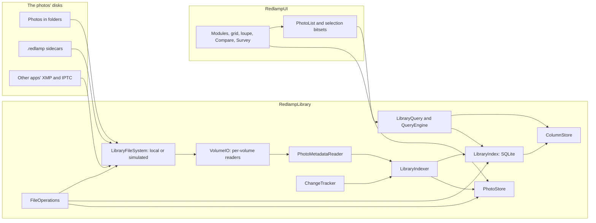

# Library and catalog: design

The owner's brief (5 October 2026): a library and catalog with Lightroom Classic's Library module at its heart, built for professionals' libraries of hundreds of thousands to millions of photos, some on spinning disks and network volumes, where searching shows results as you type, every action is instant and a held arrow key flies through the photos. The decisions are in the tracker (DEC-35 to DEC-44) and the work in its section 13 (LIB-01 to LIB-35, issues #215 to #249).

This document is the architecture every library row builds on. Its budgets are proposals until the stress harness (LIB-03, LIB-04) measures them; the Results section records what it measures, as the folders design does.

## What users get

- **Folders on disk stay the organisation.** Nothing is imported into a catalog that hides them. Each photo's ratings, flags, colour labels, marks, keywords, captions and collections are saved with the photo, in its `.redlamp` sidecar, so other Macs, the iPad and a lost index never lose them (DEC-35).
- **Sidecars beside each photo, or in Redlamp on this Mac.** Each added folder chooses; Redlamp chooses this Mac on its own wherever it can't write (a read-only share, a locked card). Move Edits and Metadata… moves them between the two, and Redlamp reads both (DEC-36).
- **Other apps' work comes across.** Ratings, labels, keywords and captions in a photo's XMP and IPTC, and in other apps' `.xmp` sidecars, are read; standard `.xmp` is written only when the user turns it on, keeping every field another app wrote (DEC-37).
- **Library and Develop are modules of one window**, switched by a key or a click, with the selection, source, filter and filmstrip carried across (DEC-42).
- **Every action three ways:** a key, the mouse and the command palette (DEC-41).

## Budgets

On 1,000,000 photos (the harness goes to 2,000,000), on an M-series Mac, with the photos on an internal or external SSD, a spinning disk or a network volume. The photos' own disks never affect the interactive budgets: browsing reads only from memory, the index and the store, all on the Mac's own disk.

| | Budget |
| --- | --- |
| Search as you type: the first page of results and the count | p95 under 16 ms |
| Facet counts (cameras, lenses, dates, keywords, labels) | p95 under 100 ms, never holding up the grid |
| An action (rate, flag, label, mark, keyword) on one photo or 10,000 | on screen within a frame |
| Switching between Library and Develop | on screen within a frame: main-thread work under 8 ms, no disk reads |
| Held arrow keys (key repeat, and 120 Hz) in the grid, the loupe and Develop | no dropped frames, main-thread p99 under 8.3 ms, no blank frame |
| A prefetched preview on screen | under 30 ms |
| Grid scrolling end to end over a million results | main-thread p99 under 8.3 ms |
| Launch with nothing changed: library visible and searchable | under 1 s |
| Memory over launch, browsing a million photos | under 250 MB |
| Memory idle after a memory-pressure trim | under 120 MB |
| Indexing | reported per kind of disk; the first results searchable within seconds |
| CPU while idle | none: no polling of local volumes |

## Components

The library is the `RedlampLibrary` package: platform-neutral, above `RedlampDocument` (folders, sidecars, scheduler, thumbnail packs), below `RedlampUI`, and linked by the CLI. It links macOS's own SQLite. Each component owns its files, so agents can build them in parallel.



| Component | Files (`packages/RedlampLibrary/Sources/`) | Row |
| --- | --- | --- |
| Paths | `LibraryPaths.swift` | LIB-05 |
| File system layer and simulated volumes | `FileSystem/` | LIB-03 |
| Fixtures and manifests | `Fixtures/` | LIB-03 |
| Benchmarks | `Bench/` (run by `redlamp library bench`) | LIB-04 |
| SQLite and the index | `Index/` | LIB-05 |
| Hot columns, the query language and engine | `Query/` | LIB-06 |
| Metadata reader, volumes and indexer | `Indexing/` | LIB-07 |
| Change tracking | `Changes/` | LIB-08 |
| Thumbnail and preview store | `Store/` | LIB-09 |
| Photo lists and selections | `Lists/` | LIB-10 |
| Sidecar location | `Sidecars/` | LIB-11 |
| Naming templates and file operations | `Files/` | LIB-25, LIB-26 |

## Photo identity

- **Where it is:** its path (volume, folder and name). The index's row ID is stable while the index lives: a rename or move Redlamp makes updates the row in place.
- **Which file it is, across renames and moves made in Finder:** the volume's UUID and the file's identifier (`URLResourceKey.fileIdentifierKey`, the inode, kept by APFS and HFS+ across renames and moves within a volume). A name that vanishes from a folder while a new one appears with the same file identifier, size and modification date is the same photo, renamed.
- **What it shows, across volumes and rebuilds:** the content key, the first 16 bytes of SHA-256 over the file's size and its first 64 KiB. Indexing reads those bytes anyway, for the metadata. The store is keyed by it, so a rename, a move, a copy to another drive or a rebuilt index finds the same thumbnails. A file rewritten in place gets a new key when its header or size changes; the store also checks the size and modification date it recorded.

## The index (LIB-05)

SQLite through a small wrapper of our own (`SQLiteDatabase`, `SQLiteStatement`), never a package.

- **On the Mac's own disk** (`LibraryPaths.index`), never on a network volume, with `journal_mode=WAL`, `synchronous=NORMAL`, `mmap_size` of 1 GB (mapped pages that aren't dirtied don't count against Redlamp's memory), `temp_store=MEMORY` and a bounded page cache (16 MB).
- **One writer and a few readers.** Writes run on the writer's own serial queue, in transactions of up to 1,000 rows; readers each hold a connection, used from the scheduler's lanes. Nothing touches SQLite on the main thread.
- **Schema** (`PRAGMA user_version` numbers it; each migration is a function from one version to the next, run in a transaction):

```sql
CREATE TABLE volumes (id INTEGER PRIMARY KEY, uuid TEXT UNIQUE NOT NULL, name TEXT, kind INTEGER NOT NULL,
  event_database TEXT, last_event INTEGER);                  -- kind: 0 unknown, 1 SSD, 2 spinning, 3 network
CREATE TABLE roots (id INTEGER PRIMARY KEY, volume INTEGER NOT NULL, path TEXT UNIQUE NOT NULL, bookmark BLOB,
  sidecars INTEGER NOT NULL DEFAULT 0);                      -- sidecars: 0 beside the photos, 1 on this Mac
CREATE TABLE folders (id INTEGER PRIMARY KEY, root INTEGER NOT NULL, parent INTEGER, path TEXT UNIQUE NOT NULL,
  signature INTEGER, indexed_signature INTEGER, listed_at REAL);
CREATE TABLE photos (id INTEGER PRIMARY KEY, folder INTEGER NOT NULL, name TEXT NOT NULL, kind INTEGER NOT NULL,
  size INTEGER NOT NULL, modified REAL NOT NULL, file_id INTEGER, content_key BLOB,
  captured REAL, captured_offset INTEGER, camera INTEGER, lens INTEGER, iso REAL, aperture REAL, shutter REAL,
  focal REAL, width INTEGER, height INTEGER, orientation INTEGER, latitude REAL, longitude REAL,
  rating INTEGER NOT NULL DEFAULT 0, flag INTEGER NOT NULL DEFAULT 0, label INTEGER NOT NULL DEFAULT 0,
  marked INTEGER NOT NULL DEFAULT 0, edited INTEGER NOT NULL DEFAULT 0, sidecar_modified REAL, xmp_modified REAL,
  title TEXT, caption TEXT, state INTEGER NOT NULL DEFAULT 0, indexed INTEGER NOT NULL DEFAULT 0,
  UNIQUE (folder, name));                                    -- state bits: missing, offline, settling
CREATE TABLE cameras (id INTEGER PRIMARY KEY, make TEXT, model TEXT, name TEXT UNIQUE NOT NULL);
CREATE TABLE lenses (id INTEGER PRIMARY KEY, name TEXT UNIQUE NOT NULL);
CREATE TABLE keywords (id INTEGER PRIMARY KEY, parent INTEGER, name TEXT NOT NULL, path TEXT UNIQUE NOT NULL);
CREATE TABLE photo_keywords (photo INTEGER NOT NULL, keyword INTEGER NOT NULL, PRIMARY KEY (photo, keyword))
  WITHOUT ROWID;
CREATE TABLE collections (id INTEGER PRIMARY KEY, parent INTEGER, name TEXT NOT NULL, kind INTEGER NOT NULL,
  query TEXT);                                               -- kind: 0 set, 1 collection, 2 smart collection
CREATE TABLE collection_photos (collection INTEGER NOT NULL, photo INTEGER NOT NULL, position INTEGER,
  PRIMARY KEY (collection, photo)) WITHOUT ROWID;
CREATE VIRTUAL TABLE photo_text USING fts5(name, keywords, title, caption,
  content='', contentless_delete=1, tokenize='trigram');     -- rowid is photos.id; written by the writer (Results)
CREATE TABLE settings (key TEXT PRIMARY KEY, value) WITHOUT ROWID;
```

- **Snapshots and integrity.** While the index changes, a snapshot is taken with `VACUUM INTO` at most every 30 minutes, the last three kept (`LibraryPaths.snapshots`). `PRAGMA quick_check` runs in the background lane at launch once a week. A damaged index is replaced by its newest good snapshot and reconciled with the disks (LIB-08); with no snapshot, it's rebuilt.
- **Rebuilding** reads every folder, sidecar and photo header again in the indexer's order. It never starts from nothing for the user: the store survives it (content keys), and the sidecars hold everything that was decided.

## Hot columns and queries (LIB-06)

SQLite alone scans a million rows in tens to hundreds of milliseconds for a combination of predicates, which misses the search budget; the measurements decide. The plan is a **column store** in memory, one array per field the filters and sorts use, indexed by a dense row number:

| Column | Type | Bytes per photo |
| --- | --- | --- |
| photo ID | `Int64` | 8 |
| folder | `Int32` | 4 |
| captured (seconds) | `Int64` | 8 |
| camera, lens | `UInt16` each | 4 |
| rating (3 bits), flag (2), label (3), marked, edited | packed `UInt16` | 2 |
| ISO, aperture, focal length (bucketed), file kind | `UInt16`, `UInt8`, `UInt16`, `UInt8` | 6 |
| name order | `Int32` (rank in Finder order) | 4 |

About 36 bytes a photo, 36 MB for a million, plus 4 bytes a photo for each sort order kept (captured, name, edited). It's built from SQLite on a background thread at launch; until it's ready, queries go to SQLite. The writer updates it as it commits.

- **Evaluation:** text terms go to FTS5 (trigram, so substrings and prefixes of file names work) and come back as a bitset of rows; keyword, collection and folder terms come back as bitsets from their tables; then one pass over the columns, in the sort's permutation, keeps the rows every predicate accepts. The first page is ready as soon as it's full; the count finishes the pass. Facet counts are one more pass each, cancelled when the query changes.
- **Result:** a `PhotoList`, the matching photo IDs in order (`ContiguousArray<Int64>`, 8 MB for a million).

### The query language

One grammar for the filter bar, the command palette, smart collections and `redlamp library search`. Words are free text; `field:value` and comparisons filter; `-` negates; `OR` and parentheses group; quotes keep spaces.

```text
query    := term (("AND")? term | "OR" term)*
term     := "-"? (group | filter | text)
group    := "(" query ")"
filter   := field (":" | "=" | "!=" | "<" | "<=" | ">" | ">=") value
value    := word | quoted | range                          -- range: a..b, either end open
text     := word | quoted                                  -- matches name, folder, keywords, title, caption, camera, lens
```

| Field | Values | Examples |
| --- | --- | --- |
| `rating` (`stars`) | 0 to 5 | `rating>=3`, `rating:0` |
| `flag` | `pick`, `reject`, `none` | `flag:pick`, `-flag:reject` |
| `label` | `red`, `yellow`, `green`, `blue`, `purple`, `none`, custom names | `label:red,blue` |
| `marked` | `yes`, `no` | `marked:yes` |
| `edited` | `yes`, `no` | `edited:no` |
| `kw` (`keyword`) | a keyword or a path; a parent matches its children | `kw:birds`, `kw:"Places/Portugal"` |
| `camera`, `lens` | substring of the name | `camera:"X-T5"`, `lens:35` |
| `iso`, `f`, `focal`, `shutter` | numbers, ranges | `iso<=800`, `f:1.4..2.8`, `focal:24..70` |
| `date` (`taken`) | `2024`, `2024-06`, `2024-06-01`, ranges, `today`, `last:30d` | `date:2024-06..2024-08` |
| `folder` (`in`) | a path or part of one | `in:"Trips/2024"` |
| `name`, `ext` (`type`) | substring, extension or `raw`, `jpeg`, `heic`, `tiff`, `png` | `type:raw`, `name:DSC_12` |
| `collection` | a collection's name or path | `collection:"Portfolio"` |
| `has` | `gps`, `keywords`, `caption`, `title`, `xmp` | `has:gps` |
| `title`, `caption` | substring | `caption:wedding` |

Sorting is separate from the query: captured (the default), name, rating, edited, imported, file size, or a collection's own order.

## Indexing (LIB-07)

- **Volumes and their readers.** Each volume gets its own reader pool, sized by what it is (`volumeIsLocal`, `volumeIsInternal`; network volumes are never treated as local) and then by what it does: concurrency rises while throughput rises and falls when latency climbs (additive increase, multiplicative decrease), from 1 to the performance cores. SSDs settle wide, spinning disks at one or two readers in folder order, network volumes at several in flight.
- **One read per file.** A photo's first 256 KiB come through `LibraryFileSystem` once: the content key, the metadata (ImageIO, from the bytes; LibRaw's identity for files ImageIO can't read, passed in by the app since RedlampLibrary can't link RedlampServices) and, for raws, the location of the smallest embedded preview big enough for the grid. The preview's bytes are read next, and the grid thumbnail goes to the store.
- **Order:** the folders on screen first, then the newest folders by modification date, then the rest; the scheduler's on-screen, look-ahead and background lanes, background work paused in Low Power Mode and when the Mac is hot.
- **Resumable:** a folder is done when its `indexed_signature` matches its listing's `signature`; a restart picks up the folders that don't match.
- **Batched writes:** rows go to the writer in batches; the column store and open photo lists get diffs, never a reload.

## Change detection (LIB-08)

- **FSEvents replayed at launch:** each local volume keeps its event database's UUID (`FSEventsCopyUUIDForDevice`) and the last event the index applied; launch opens one stream per volume from that event (`FSEventStreamCreateRelativeToDevice` with `sinceWhen`), and only the folders it names are listed again.
- **When the history is gone** (a different event database, `MustScanSubDirs`, a volume used on another Mac): folder signatures (the directory's modification date, its entry count and a hash of names, sizes and dates) are compared folder by folder, in the indexer's order.
- **Network volumes** have no FSEvents: the shown folders are polled every 15 s and the rest with backoff up to 15 minutes, and polling stops while the app is in the background.
- **Renames and moves made in Finder** are recognised by file identifier (Photo identity); sidecars left behind are offered back to their photos.
- **A volume that can't be reached** never blocks anything: every file operation on it has a timeout, its photos show as offline, and it's browsed and searched from the index and the store until it's back.

## The store (LIB-09)

- **Keyed by content key**, in 256 shard files by the key's first byte, each an append-only pack with its own index (the `ThumbnailPacks` format, version 2, with 16-byte keys instead of names).
- **Two tiers:** grid thumbnails (384 px on the long edge, HEIC or JPEG, about 15 KB), kept for every indexed photo; previews at screen size (2048 px, about 200 KB), kept for recent, rated and picked photos within a budget (10 GB by default). Edited thumbnails and previews are keyed by the content key and the edit's digest (LIB-17).
- **Budgets and location:** Settings shows the store's size and where it is; it can move to another disk; the grid tier is never evicted while its photo is indexed unless the user lowers the budget.
- **Memory:** decoded thumbnails in an LRU (the filmstrip's 128 MB budget), from pack JPEGs held in ImageIO's purgeable memory, as today.

## Photo lists and selections (LIB-10)

- A `PhotoList` is a source's photo IDs in order, with diffs (inserted, removed, moved, updated) for the views; cells fetch their rows from the column store when they appear.
- A selection is a bitset over the column store's rows (125 KB for a million) and an active photo.
- The open folder becomes one source among the others (folder, folder with subfolders, collection, smart collection, search, All Photographs, Previous Import, Marked, Rejected). `FolderLibrary` keeps its listing and watching for folders the library hasn't indexed, and its `--folders-perf` budgets.

## Sidecars on this Mac (LIB-11)

`SidecarStore` gets a locator: by default `IMG_1234.ARW.redlamp` beside the photo; for a root that keeps them on this Mac, `LibraryPaths.sidecars/<volume UUID>/<path from the volume's root>.redlamp`. Reading looks in both, beside first. Move Edits and Metadata… moves a root's sidecars through the file-operations journal (LIB-26). The `.xmp` written for other apps (LIB-24) always sits beside the photo.

## What the sidecar gains

`metadata` is an open object, so older builds keep fields they don't know (`sidecar-format.md`, rule 2). It gains:

| Field | Holds |
| --- | --- |
| `keywords` | full paths, `Places/Portugal/Lisbon`, so a photo describes itself without the keyword list |
| `title`, `caption`, `creator`, `copyright`, `location` | IPTC Core fields |
| `collections` | the collections a photo is in, by path |
| `mark` | the quick-collection mark |
| `customLabel` | a custom label's name: an unknown `label` value makes a sidecar unreadable to older builds, so custom labels never go in `label` |

## Modules and keys (LIB-13)

| Key | Library | Develop |
| --- | --- | --- |
| `G`, `E`, `C`, `N` | Grid, Loupe, Compare, Survey | the same, switching to Library |
| `D` | Develop, on the Edit tool | the Edit tool |
| ⌥⌘1, ⌥⌘2, ⌥⌘↑ | Library, Develop, the previous module | |
| `=` / `-` | thumbnail size | step the selected setting |
| `J` | cycle the grid's cell style | clipping |
| `\` | the filter bar | Before/After |
| `B` | mark (quick collection) | mark |
| 0–5, `P`, `X`, `U`, 6–9, `[`, `]` | on the whole selection, with Undo | on the active photo |
| arrows, Home, End, Page Up, Page Down | move; ⇧ extends the selection | previous and next photo |
| Return, Space, double-click | open in the Loupe | |
| ⌘K | the command palette | the command palette |

Every one has a menu item and most a mouse gesture: stars, flag and label on a cell; context menus on photos, folders, collections and keywords; drag and drop onto folders, collections and photos; a thumbnail-size slider; a module picker in the toolbar.

## File operations (LIB-25, LIB-26)

Renames, moves, new folders and moves to the Trash go through a journal in `LibraryPaths.root` written before anything moves: each step's source and destination, the photo's sidecar and other apps' `.xmp`. A forced quit leaves a journal the next launch finishes or rolls back; Undo replays it backwards. Nothing is ever overwritten; a collision stops the batch before it starts, in the preview.

## The stress harness (LIB-03, LIB-04)

- **Fixtures** (`redlamp library fixture <folder> --photos <n> --seed <s>`) in `/Volumes/SSD/redlamp-tmp/library-fixtures/` on the owner's Mac (not backed up):
  - a fifth of the photos are APFS clones of the CC0 raws, each with its capture date rewritten in place, which costs one 4 KB block per photo;
  - the rest are small JPEGs and HEICs with varied EXIF (25 cameras, 40 lenses, ISO, aperture, shutter, focal length, dates over 20 years), GPS on a third and IPTC keywords and captions on a fifth;
  - `.redlamp` sidecars with ratings, flags and labels on 15%, and other apps' `.xmp` on 5%;
  - folder shapes: years and days, clients and jobs, one folder of 20,000 photos, a tree 12 levels deep, Unicode and 200-character names;
  - a manifest with the count every benchmark query must return, from the generator's own (seeded) choices.
- **Simulated volumes:** `SimulatedFileSystem` wraps the local one with a profile: per-operation latency, bandwidth shared by the operations in flight, a cap on operations in flight (one for a spinning disk's head, with a seek between files), jitter, and disconnects (operations that fail or time out). Profiles: `ssd`, `spinning` (8 ms seeks, 160 MB/s, one at a time), `nas` (0.8 ms, 110 MB/s, 16 in flight), `wifi` (12 ms ± 50%, 25 MB/s, 8 in flight), `vpn` (40 ms, 5 MB/s). Cold-cache runs use a disk image detached between runs.
- **Headless scenarios** (`redlamp library bench <fixture> --profile <p>`): a cold index build, a warm launch, reconciling after changes made while closed, search as you type over the manifest's queries (each typed a character at a time), facets and sorts, 10,000 ratings written, a rename interrupted by a forced quit, a volume vanishing partway through indexing. Each ends PASS or FAIL against its budget and the manifest's counts; any FAIL exits 1.
- **In the app** (`--library-perf <fixture>`, as `--folders-perf`): grid scrolling, held arrow keys in the grid, the loupe and Develop, 200 switches between Library and Develop, culling 10,000 photos at once, 10,000 files arriving, and the footprint through each phase.
- **Regressions:** `scripts/library-perf.sh` runs both on a Release build and exits 1 on any FAIL; the metrics are in `docs/performance/metrics.json` (`library-*`), recorded by `scripts/perf-record.sh` and drawn on redlamp.app/performance.
- **Differential checks:** random queries are answered by the column engine and by SQLite alone, and must agree.

## Results

Measured by the harness as the rows land; nothing here is estimated. The first runs were on an M1 Ultra (16 performance and 4 efficiency cores) with other builds running (load average 35 to 80), so they are conservative.

### The index at a million photos (LIB-05)

`IndexBenchmarkTests` with `REDLAMP_INDEX_BENCH=1`, two runs:

| | Measured |
| --- | --- |
| Inserting, in batches of 1,000 | 11,500 to 12,700 photos a second |
| A full scan of the hot columns | 363 ms (2.7 million rows a second) |
| A photo by path | 7.6 to 7.9 µs |
| A trigram search for 4 characters of names | 0.22 ms (300 matches) |
| `count(*)` of rating ≥ 3 and one camera | 57 to 63 ms |
| Rating 10,000 photos | 26 ms when they're consecutive rows, 568 ms spread across the library |
| `quick_check` | 4.3 s |
| A snapshot (`VACUUM INTO`) | 2.8 s, 589 MB |
| The index file | 598 MB, 383 MB of it the text index |

What it changed:

- **SQLite alone misses the search budget.** A count over two predicates takes 60 ms at a million photos, four times the 16 ms budget, so the column store is needed; building it from the hot-column scan takes about 0.4 s at launch, in the background.
- **The text index covers name, keywords, title and caption.** Indexing all seven text columns ran inserts at 12,100 a second; these four, at 17,700. Folder paths, cameras and lenses are matched in their own small tables (thousands of rows, not millions) and become folder, camera and lens IDs for the column pass.
- **No index on the content key.** It alone took a C replica of the inserts from 104,000 to 20,000 rows a second. Lookups by content key (importing skips photos already in the library) load the keys into a set once instead.
- **The text index is written by the writer, not by triggers.** FTS5 flushes its pending terms at every statement savepoint, which a trigger opens, halving insert speed.
- **The integrity check runs in the background,** weekly: 4.3 s is too long for launch.

### Queries at a million photos (LIB-06)

The column store and engine on 1,000,000 synthetic rows in memory, every query of the fixture's corpus typed a character at a time (load average about 20):

| | Measured | Budget |
| --- | --- | --- |
| First page and count | p50 0.09 ms, p95 2.1 ms | p95 under 16 ms |
| The same, with every photo in order | p95 4.6 ms | |
| Facet counts | p95 11 ms | p95 under 100 ms |
| Column store | 70 bytes a photo | |

On the 20,000-photo fixture (`redlamp library bench … --scenario search`), all 43 counts equal the manifest's, with the first page and count in p95 0.12 ms and facets in p95 0.3 ms; the store builds in 26 ms. What helped: matching folder names as lowercased bytes instead of Foundation's case-insensitive search (p95 27 ms to 2.1 ms), keeping each term's matches per store, and sorting folders by key rather than with `localizedStandardCompare` for facets (29 ms to 11 ms).

### Metadata (LIB-07)

`PhotoMetadataReaderTests` with `REDLAMP_METADATA_BENCH=1`, on the 26 CC0 raws, under load:

- **The first 256 KiB are enough** for ARW, CR2, DNG, ORF, PEF, RW2, 3FR and the Z 8's NEF, passed to ImageIO padded with zeros to the file's length (ImageIO reports a raw's size only when the data looks as long as the file). CR3, RAF, the Z 6's NEF, FFF, IIQ and SRW need ImageIO to read the file itself, which touches 16 to 740 KB of it.
- **Reads a second:** 46 to 277 on one core, depending on the format, and 432 to 2,429 across all cores; content keys at 35,000 a second on one core. At a thousand photos a second, a million take about 17 minutes on an SSD, metadata only; searching works over what's indexed so far.

### The harness (LIB-03)

- **Fixtures** generate at about 1,300 photos a second: each file creation costs about 0.4 ms of kernel time on this Mac (with endpoint security inspecting every file event). ImageIO writes metadata under a process-wide lock, so photos are written from 16 encoded templates with their EXIF, GPS and IPTC patched in.
- **Listing a 20,000-photo fixture:** 100 to 128 ms on the SSD profile against its 120 ms budget (300 ms for 50,000), 115 to 124 ms on the NAS profile.
- **Cold-cache runs** need `hdiutil attach`, which Cursor's sandbox denies; they run from the owner's terminal (`COLD=1 scripts/library-perf.sh`).

## Open points

- One Undo across both modules, as in Lightroom, or one per module.
- Collections in sidecars by path (a renamed collection rewrites its photos' sidecars) or by ID (the definitions file is then needed to read them).
- `.xmp` names for raw and JPEG pairs with the same base name.
- The capture-time zone: EXIF's offset tags when present, else the Mac's zone at import, recorded per photo.
- Whether the map (LIB-35) moves into 1.0.
