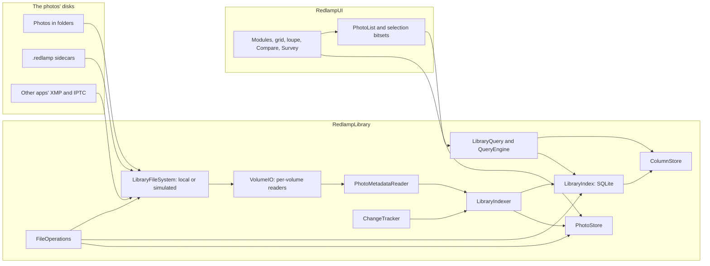

# Library and catalog: design

The owner's brief (5 October 2026): a library and catalog with Lightroom Classic's Library module at its heart, built for professionals' libraries of hundreds of thousands to millions of photos, some on spinning disks and network volumes, where searching shows results as you type, every action is instant and a held arrow key flies through the photos. The decisions are in the tracker (DEC-42 to DEC-51) and the work in its section 13 (LIB-01 to LIB-35, issues #215 to #249).

This document is the architecture every library row builds on. Its budgets are proposals until the stress harness (LIB-03, LIB-04) measures them; the Results section records what it measures, as the folders design does.

## What users get

- **Folders on disk stay the organisation.** Nothing is imported into a catalog that hides them. Each photo's ratings, flags, colour labels, marks, keywords, captions and collections are saved with the photo, in its `.redlamp` sidecar, so other Macs, the iPad and a lost index never lose them (DEC-42).
- **Sidecars beside each photo, or in Redlamp on this Mac.** Each added folder chooses; Redlamp chooses this Mac on its own wherever it can't write (a read-only share, a locked card). Move Edits and Metadata… moves them between the two, and Redlamp reads both (DEC-43).
- **Other apps' work comes across.** Ratings, labels, keywords and captions in a photo's XMP and IPTC, and in other apps' `.xmp` sidecars, are read; standard `.xmp` is written only when the user turns it on, keeping every field another app wrote (DEC-44).
- **Library and Develop are modules of one window**, switched by a key or a click, with the selection, source, filter and filmstrip carried across (DEC-49).
- **Every action three ways:** a key, the mouse and the command palette (DEC-48).

## Budgets

On 1,000,000 photos (the harness goes to 2,000,000), on an M-series Mac, with the photos on an internal or external SSD, a spinning disk or a network volume. The photos' own disks never affect the interactive budgets: browsing reads only from memory, the index and the store, all on the Mac's own disk.

| | Budget |
| --- | --- |
| Search as you type: the first page of results and the count | p95 under 16 ms |
| Facet counts (cameras, lenses, dates, keywords, labels) | p95 under 100 ms, never holding up the grid |
| An action (rate, flag, label, mark, keyword) on one photo or 10,000 | on screen within a frame |
| Switching between Library and Develop | on screen within a frame: main-thread work under 8 ms, no disk reads |
| Held arrow keys (key repeat, and 120 Hz) in the grid, the loupe and Develop | no dropped frames, main-thread p99 under 8.3 ms, no blank frame |
| A prefetched preview on screen | under 30 ms |
| Grid scrolling end to end over a million results | main-thread p99 under 8.3 ms |
| Launch with nothing changed: library visible and searchable | under 1 s |
| Memory over launch, browsing a million photos | under 250 MB |
| Memory idle after a memory-pressure trim | under 120 MB |
| Indexing | reported per kind of disk; the first results searchable within seconds |
| CPU while idle | none: no polling of local volumes |

## Components

The library is the `RedlampLibrary` package: platform-neutral, above `RedlampDocument` (folders, sidecars, scheduler, thumbnail packs), below `RedlampUI`, and linked by the CLI. It links macOS's own SQLite. Each component owns its files, so agents can build them in parallel.



| Component | Files (`packages/RedlampLibrary/Sources/`) | Row |
| --- | --- | --- |
| Paths | `LibraryPaths.swift` | LIB-05 |
| File system layer and simulated volumes | `FileSystem/` | LIB-03 |
| Fixtures and manifests | `Fixtures/` | LIB-03 |
| Benchmarks | `Bench/` (run by `redlamp library bench`) | LIB-04 |
| SQLite and the index | `Index/` | LIB-05 |
| Hot columns, the query language and engine | `Query/` | LIB-06 |
| Metadata reader, volumes and indexer | `Indexing/` | LIB-07 |
| Change tracking | `Changes/` | LIB-08 |
| Thumbnail and preview store | `Store/` | LIB-09 |
| Photo lists and selections | `Lists/` | LIB-10 |
| Sidecar location | `Sidecars/` | LIB-11 |
| Naming templates and file operations | `Naming/`, and `Files/` for the operations | LIB-25, LIB-26 |

## Photo identity

- **Where it is:** its path (volume, folder and name). The index's row ID is stable while the index lives: a rename or move Redlamp makes updates the row in place.
- **Which file it is, across renames and moves made in Finder:** the volume's UUID and the file's identifier (`URLResourceKey.fileIdentifierKey`, the inode, kept by APFS and HFS+ across renames and moves within a volume). A name that vanishes from a folder while a new one appears with the same file identifier, size and modification date is the same photo, renamed.
- **What it shows, across volumes and rebuilds:** the content key, the first 16 bytes of SHA-256 over the file's size and its first 64 KiB. Indexing reads those bytes anyway, for the metadata. The store is keyed by it, so a rename, a move, a copy to another drive or a rebuilt index finds the same thumbnails. A file rewritten in place gets a new key when its header or size changes; the store also checks the size and modification date it recorded.

## The index (LIB-05)

SQLite through a small wrapper of our own (`SQLiteDatabase`, `SQLiteStatement`), never a package.

- **On the Mac's own disk** (`LibraryPaths.index`), never on a network volume, with `journal_mode=WAL`, `synchronous=NORMAL`, `mmap_size` of 1 GB (mapped pages that aren't dirtied don't count against Redlamp's memory), `temp_store=MEMORY` and a bounded page cache (16 MB).
- **One writer and a few readers.** Writes run on the writer's own serial queue, in transactions of up to 1,000 rows; readers each hold a connection, used from the scheduler's lanes. Nothing touches SQLite on the main thread.
- **Schema** (`PRAGMA user_version` numbers it; each migration is a function from one version to the next, run in a transaction):

```sql
CREATE TABLE volumes (id INTEGER PRIMARY KEY, uuid TEXT UNIQUE NOT NULL, name TEXT, kind INTEGER NOT NULL,
  event_database TEXT, last_event INTEGER);                  -- kind: 0 unknown, 1 SSD, 2 spinning, 3 network
CREATE TABLE roots (id INTEGER PRIMARY KEY, volume INTEGER NOT NULL, path TEXT UNIQUE NOT NULL, bookmark BLOB,
  sidecars INTEGER NOT NULL DEFAULT 0);                      -- sidecars: 0 beside the photos, 1 on this Mac
CREATE TABLE folders (id INTEGER PRIMARY KEY, root INTEGER NOT NULL, parent INTEGER, path TEXT UNIQUE NOT NULL,
  signature INTEGER, indexed_signature INTEGER, listed_at REAL);
CREATE TABLE photos (id INTEGER PRIMARY KEY, folder INTEGER NOT NULL, name TEXT NOT NULL, kind INTEGER NOT NULL,
  size INTEGER NOT NULL, modified REAL NOT NULL, file_id INTEGER, content_key BLOB,
  captured REAL, captured_offset INTEGER, camera INTEGER, lens INTEGER, iso REAL, aperture REAL, shutter REAL,
  focal REAL, width INTEGER, height INTEGER, orientation INTEGER, latitude REAL, longitude REAL,
  rating INTEGER NOT NULL DEFAULT 0, flag INTEGER NOT NULL DEFAULT 0, label INTEGER NOT NULL DEFAULT 0,
  marked INTEGER NOT NULL DEFAULT 0, edited INTEGER NOT NULL DEFAULT 0, sidecar_modified REAL, xmp_modified REAL,
  title TEXT, caption TEXT, state INTEGER NOT NULL DEFAULT 0, indexed INTEGER NOT NULL DEFAULT 0,
  UNIQUE (folder, name));                                    -- state bits: missing, offline, settling, unreadable
CREATE TABLE cameras (id INTEGER PRIMARY KEY, make TEXT, model TEXT, name TEXT UNIQUE NOT NULL);
CREATE TABLE lenses (id INTEGER PRIMARY KEY, name TEXT UNIQUE NOT NULL);
CREATE TABLE keywords (id INTEGER PRIMARY KEY, parent INTEGER, name TEXT NOT NULL, path TEXT UNIQUE NOT NULL);
CREATE TABLE photo_keywords (photo INTEGER NOT NULL, keyword INTEGER NOT NULL, PRIMARY KEY (photo, keyword))
  WITHOUT ROWID;
CREATE TABLE collections (id INTEGER PRIMARY KEY, parent INTEGER, name TEXT NOT NULL, kind INTEGER NOT NULL,
  query TEXT);                                               -- kind: 0 set, 1 collection, 2 smart collection
CREATE TABLE collection_photos (collection INTEGER NOT NULL, photo INTEGER NOT NULL, position INTEGER,
  PRIMARY KEY (collection, photo)) WITHOUT ROWID;
CREATE VIRTUAL TABLE photo_text USING fts5(name, keywords, title, caption,
  content='', contentless_delete=1, tokenize='trigram');     -- rowid is photos.id; written by the writer (Results)
CREATE TABLE settings (key TEXT PRIMARY KEY, value) WITHOUT ROWID;
CREATE TABLE photo_hashes (photo INTEGER PRIMARY KEY, size INTEGER NOT NULL, modified REAL NOT NULL,
  content_key BLOB NOT NULL, sha256 BLOB NOT NULL);          -- version 3 (LIB-39): a full hash, kept while
                                                              -- the file's size, date and content key hold
-- version 4 (LIB-15, LIB-22, LIB-23, LIB-28): the rest of the sidecar's organising fields, so a rebuild
-- from the sidecars loses nothing; manual stacks the settings table held move to their columns
ALTER TABLE photos ADD COLUMN creator TEXT;  -- and copyright, sublocation, city, province, country,
                                             -- country_code and custom_label, all TEXT
ALTER TABLE photos ADD COLUMN stack TEXT;    -- a manual stack's UUID, with stack_top INTEGER
ALTER TABLE photos ADD COLUMN other_fields INTEGER NOT NULL DEFAULT 0;  -- bits: the fields showing other
                                                                        -- apps' values, not the .redlamp's
ALTER TABLE photos ADD COLUMN xmp_signature INTEGER;  -- changes whenever either of the photo's .xmp does
ALTER TABLE collections ADD COLUMN path TEXT;         -- unique: collections are found by path
-- version 5 (LIB-22): the camera's own capture time and zone, kept only while a sidecar shifts the time
-- or sets the zone, so the camera's time can always be had again and a changed sidecar needs no read
ALTER TABLE photos ADD COLUMN camera_captured REAL;
ALTER TABLE photos ADD COLUMN camera_offset INTEGER;
-- version 6 (LIB-40): what indexing found wrong with a photo's file, for the photos with something to
-- say, with the size and modification date the file had when read, so a row stands while they match;
-- rows outlive their photos, as hashes do, so a photo Undo or Put Back brings back finds its row again
CREATE TABLE photo_health (photo INTEGER PRIMARY KEY, size INTEGER NOT NULL, modified REAL NOT NULL,
  format INTEGER NOT NULL DEFAULT 0, damage INTEGER NOT NULL DEFAULT 0, missing INTEGER, reason TEXT,
  end_unread INTEGER NOT NULL DEFAULT 0, extension TEXT);
-- version 7 (DEC-52): the text index built again ignoring accents, its text folded by the writer
-- version 8: CREATE INDEX photos_sidecars ON photos (folder) WHERE sidecar_modified IS NOT NULL, for a root's photos with sidecars
-- (`redlamp_text`: case, accents and width), since the tokenizer leaves Greek and Cyrillic accents,
-- ß and ligatures as they are; typed text is folded the same way
DROP TABLE photo_text;
CREATE VIRTUAL TABLE photo_text USING fts5(name, keywords, title, caption,
  content='', contentless_delete=1, tokenize='trigram remove_diacritics 1');
```

- **Snapshots and integrity.** While the index changes, a snapshot is taken with `VACUUM INTO` at most every 30 minutes, the last three kept (`LibraryPaths.snapshots`). `PRAGMA quick_check` runs in the background lane at launch once a week. A damaged index is replaced by its newest good snapshot and reconciled with the disks (LIB-08); with no snapshot, it's rebuilt.
- **Rebuilding** reads every folder, sidecar and photo header again in the indexer's order. It never starts from nothing for the user: the store survives it (content keys), and the sidecars hold everything that was decided.

## Hot columns and queries (LIB-06)

SQLite alone scans a million rows in tens to hundreds of milliseconds for a combination of predicates, which misses the search budget; the measurements decide. The plan is a **column store** in memory, one array per field the filters and sorts use, indexed by a dense row number:

| Column | Type | Bytes per photo |
| --- | --- | --- |
| photo ID | `Int64` | 8 |
| folder | `Int32` | 4 |
| captured (seconds) | `Int64` | 8 |
| camera, lens | `UInt16` each | 4 |
| rating (3 bits), flag (2), label (3), marked, edited | packed `UInt16` | 2 |
| ISO, aperture, focal length (bucketed), file kind | `UInt16`, `UInt8`, `UInt16`, `UInt8` | 6 |
| name order | `Int32` (rank in Finder order) | 4 |

About 36 bytes a photo, 36 MB for a million, plus 4 bytes a photo for each sort order kept (captured, name, edited). It's built from SQLite on a background thread at launch; until it's ready, queries go to SQLite. The writer updates it as it commits.

- **Evaluation:** text terms go to FTS5 (trigram, so substrings and prefixes of file names work) and come back as a bitset of rows; keyword, collection and folder terms come back as bitsets from their tables; then one pass over the columns, in the sort's permutation, keeps the rows every predicate accepts. The first page is ready as soon as it's full; the count finishes the pass. Facet counts are one more pass each, cancelled when the query changes.
- **Result:** a `PhotoList`, the matching photo IDs in order (`ContiguousArray<Int64>`, 8 MB for a million).

### The query language

One grammar for the filter bar, the command palette, smart collections and `redlamp library search`. Words are free text; `field:value` and comparisons filter; `-` negates; `OR` and parentheses group; quotes keep spaces. Text ignores case, accents and width everywhere (DEC-52), so `sao` finds São Paulo; free text under three characters is matched against folders, cameras, lenses, creators, places and keyword synonyms, and only the text index, which needs three, leaves it out.

```text
query    := term (("AND")? term | "OR" term)*
term     := "-"? (group | filter | text)
group    := "(" query ")"
filter   := field (":" | "=" | "!=" | "<" | "<=" | ">" | ">=") value
value    := word | quoted | range                          -- range: a..b, either end open
text     := word | quoted                                  -- matches name, folder, keywords, title, caption, camera, lens,
                                                           -- creator, location
```

| Field | Values | Examples |
| --- | --- | --- |
| `rating` (`stars`) | 0 to 5 | `rating>=3`, `rating:0` |
| `flag` | `pick`, `reject`, `none` | `flag:pick`, `-flag:reject` |
| `label` | `red`, `yellow`, `green`, `blue`, `purple`, `none` (neither a colour nor a custom name), a custom label's name, or a label set's name for its colour | `label:red,blue`, `label:Hero`, `label:approved` |
| `marked` | `yes`, `no` | `marked:yes` |
| `edited` | `yes`, `no` | `edited:no` |
| `kw` (`keyword`) | a keyword or a path; a parent matches its children | `kw:birds`, `kw:"Places/Portugal"` |
| `camera`, `lens` | substring of the name | `camera:"X-T5"`, `lens:35` |
| `iso`, `f`, `focal`, `shutter` | numbers, ranges | `iso<=800`, `f:1.4..2.8`, `focal:24..70` |
| `date` (`taken`) | `2024`, `2024-06`, `2024-06-01`, a time of day to the hour, minute or second (`2024-06-01T14`, `…T14:03`, `…T14:03:12`), ranges of any of them, `today`, `last:30d` | `date:2024-06..2024-08` |
| `orientation` | `landscape`, `portrait`, `square`, `none`: from the photo's upright size, so a rotated raw is portrait (LIB-41) | `orientation:portrait` |
| `folder` (`in`) | a path or part of one | `in:"Trips/2024"` |
| `name`, `ext` (`type`) | substring, extension or `raw`, `jpeg`, `heic`, `tiff`, `png` | `type:raw`, `name:DSC_12` |
| `collection` | a collection's name or path, as `kw:` matches keywords; a set matches the collections in it; smart collections aren't matched | `collection:"Portfolio"` |
| `has` | `gps`, `keywords`, `caption`, `title`, `xmp`, `creator`, `copyright`, `location` | `has:gps` |
| `title`, `caption` | substring | `caption:wedding` |
| `creator`, `copyright` | substring | `creator:Sousa` |
| `sublocation`, `city`, `state` (`province`), `country`, `countrycode` | substring | `city:Lisbon`, `countrycode:PT` |
| `megapixels`, `aspect` | numbers, ranges; an aspect also as a ratio | `megapixels>=40`, `aspect:3:2` |
| `is` | traits, each a query over the fields above: `long-exposure` (`shutter>=1`), `panorama` (`aspect>=2`), `high-resolution` (`megapixels>=40`), `low-light` (`iso>=3200`), `no-location` (`-has:gps`), `damaged` (what Library Health's Damaged Files check lists: unreadable, empty, unrecognised and truncated files, those still being written or kept anyway left out), `unpicked-moment` (in a moment without a pick, found among the photos the query filters: the source's, with its Tighter–Looser setting, in the filter bar; the library's in a search, with `--tighter` and `--looser`; the library's at the default setting for a smart collection's or a source's own query) | `is:low-light` |
| `missing`, `offline` | `yes`, `no`: gone from its folder, or on a volume that isn't connected (LIB-18) | `offline:yes` |
| `unreadable` | `yes`, `no`: a file whose read failed (LIB-40). Lists, searches and facets leave these out unless the query names `unreadable` or keeps photos with `is:damaged`; empty files, files no format starts and files that end early stay in lists, and Library Health finds them | `unreadable:yes` |

Sorting is separate from the query: captured (the default), name, rating, edited, the file's modification date, file size, imported, or a collection's own order, each either way.

## Text, completion and a mapped column store (DEC-52, LIB-44, LIB-18, LIB-19)

From the Cling study ([LIB-cling](../research/notes/LIB-cling.md)), whose changes the owner accepted on 7 October 2026: the first three are built, the last one planned.

- **Text ignores accents and width everywhere (DEC-52, LIB-06), built.** Every match uses completion's fold (`QueryVocabulary.fold`: case, accents and width): `FoldedText` for folders, cameras, lenses, creators, copyrights, places and custom labels, `kw:`, `collection:` and synonyms, with the same functions registered with SQLite, and a match never starts or ends inside a character (ß, 👍🏽, ガ). The text index, schema version 7, is built with `tokenize='trigram remove_diacritics 1'`, and its writer (`redlamp_text`) folds case and accents as well as width, since the tokenizer leaves Greek and Cyrillic accents, ß and ligatures as they are; typed text is folded the same way, so São Paulo, Zürich and Café are found from `sao`, `zurich` and `cafe`. The migration rebuilds the index in one transaction when the index opens: 5.7 and 9.6 s on copies of lib-1m's index. Nothing can search while it runs; another process waits for the lock (a search started alongside waited 4.6 s, then ran), and a wait over 5 s fails with "database is locked".
- **Short text (LIB-06), built.** Free text is always kept; the plan and the SQL leave out only the text index's match, so `ab` still finds a folder or a camera with ab in it. Search at a million photos took p95 5.3 ms with it, against 3.6 to 3.7 before and 16 allowed, one- and two-character text running up to five column passes; with their lookups in one pass (c9570aa), it's 3.7 to 3.9 ms.
- **The column store mapped from a snapshot (LIB-44), built.** The store is saved beside the index as `Index.columns`, one page-aligned file: a 16 KB header (format, page size, schema version, a generation with a random token, and each section's checksum), then each column, the sort orders, `rowOfID` and the live rows on 16 KB boundaries as they're laid out in memory, then the small tables' names, 85 MB at a million photos. It's written to a temporary file, synced and renamed over the old one: after a build, once the store and the index have been quiet for 10 s (at most five minutes apart), and when `saveSnapshot()` is called; when only the generation moved, just the header is written again in place. Every transaction that changes the index bumps its generation, and a journal of what each one changed lets the store catch up before it saves; another process's write means nothing is saved. At launch the file is mapped copy-on-write when its generation and schema match the index's, so later changes copy only the pages they touch, and a cold file gets one read-ahead request. A file from another generation, schema, format or page size is deleted, a truncated or damaged one is moved to `Index.columns.damaged`, and the store is built from SQLite as before. Memory is measured as the budgets mean it, by `phys_footprint`.

  | A million photos | Before | After |
  |---|---|---|
  | Relaunch, searchable (from the snapshot) | 505 and 509 ms | 106 and 224 ms, most of it SQLite's own open |
  | First launch, no snapshot | 588 and 621 ms, peak 267 MB | 697 and 716 ms, peak 223 to 225 MB |
  | Memory over launch and idle after a trim | 225 to 236 MB | 28 to 32 MB (budgets 250 and 120 MB) |
  | Search p95, short text's lookups in one pass | 5.1 and 5.0 ms | 3.7 and 3.9 ms |

  (`redlamp library bench … --scenario warm-launch`, `--scenario search --scenario facets`, Release, twice each on copies of lib-1m's index.) Facets measured 9 to 37 ms against 22.6 and 24.1, too noisy to call.
- **Completion and the palette ranked (LIB-18, LIB-19).** By where the text matches (the start, a word's start, inside), then by its letters in order, then by a word one typo away (two from eight letters; letters only, four or more, never a word's first letter), always after every name that holds the text as typed, within a quality floor of the best match; a filter that finds nothing also offers a name one or two typos away. The palette finds folders, collections, keywords, cameras, lenses and places by name, ranked the same way, and photos by name through the text index. The prototype (`research/prototypes/library_search/completion.swift`, written from fzf's first algorithm, which is MIT-licensed, Hyyrö's bit-parallel LCS and the restricted Damerau–Levenshtein distance) took p95 1.6 ms a keystroke over 8,673 names on one thread. Cling is GPL-3.0: nothing is taken from its code.

  As built (`NameRanking`, 533d8ca3 to 020b4788): letters in order must keep half the best match's score and 40% of its tightness and coverage, and a misspelt name is scored as its correctly spelt twin, so `landscpae` finds Landscapes; the typo rules are as above, a plural `s` aside. Places are completed too, and ties go to the index's order. Names at a word's start and typos' twins are looked up by their first two bytes, a key scans only the names that held the previous key's text, and a scan of 16,384 names or more runs in up to eight parts at once, never on the main thread. Over 109,563 names a keystroke takes p95 1.10 and 1.12 ms (Release; p50 0.22 ms over 1,881 keystrokes, load 29 to 53); the table is made in one pass in 270 ms and holds about 20 MB at 100,000 names, estimated from its layout. `QueryEngine.suggestion(for:in:)` gives an empty filter's term, its replacement, the name and its photo count (838a58ea); the filter bar doesn't show it yet. The palette lists the library's names under its commands, whose order is unchanged, then up to five photos by name and a Photos Named… row; a folder or photo is shown and anything else becomes the filter's term (3678c76f, scenario `library.palette-names`).

## Indexing (LIB-07)

- **Volumes and their readers.** Each volume gets its own reader pool, sized by what it is (`volumeIsLocal`, `volumeIsInternal`; network volumes are never treated as local) and then by what it does: concurrency rises while throughput rises and falls when latency climbs (additive increase, multiplicative decrease), from 1 to the performance cores. SSDs settle wide, spinning disks at one or two readers in folder order, network volumes at several in flight.
- **One read per file.** A photo's first 256 KiB come through `LibraryFileSystem` once: the content key, the metadata (ImageIO, from the bytes; LibRaw's identity for files ImageIO can't read, passed in by the app since RedlampLibrary can't link RedlampServices) and, for raws, the location of the smallest embedded preview big enough for the grid. The preview's bytes are read next, and the grid thumbnail goes to the store.
- **Order:** the folders on screen first, then the newest folders by modification date, then the rest; the scheduler's on-screen, look-ahead and background lanes, background work paused in Low Power Mode and when the Mac is hot.
- **Resumable:** a folder is done when its `indexed_signature` matches its listing's `signature`; a restart picks up the folders that don't match.
- **Batched writes:** rows go to the writer in batches; the column store and open photo lists get diffs, never a reload.
- **Not in iCloud Drive, for now.** The app doesn't index folders in iCloud Drive: reading each photo's first bytes would download it. They're listed from the disk as before.

## Change detection (LIB-08)

- **FSEvents replayed at launch:** each local volume keeps its event database's UUID (`FSEventsCopyUUIDForDevice`) and the last event the index applied; launch opens one stream per volume from that event (`FSEventStreamCreateRelativeToDevice` with `sinceWhen`), and only the folders it names are listed again.
- **When the history is gone** (a different event database, `MustScanSubDirs`, a volume used on another Mac): folder signatures (the directory's modification date, its entry count and a hash of names, sizes and dates) are compared folder by folder, in the indexer's order.
- **Network volumes** have no FSEvents: the shown folders are polled every 15 s and the rest with backoff up to 15 minutes, and polling stops while the app is in the background.
- **Renames and moves made in Finder** are recognised by file identifier (Photo identity); sidecars left behind are offered back to their photos.
- **A volume that can't be reached** never blocks anything: every file operation on it has a timeout, its photos show as offline, and it's browsed and searched from the index and the store until it's back. A volume that only answers slowly isn't unreachable: an overdue operation asks the volume's root first, and an operation still going after thirty timeouts fails alone, leaving its folder to the next run.
- **Launch** shows the index at once and reconciles behind it: from the event history when there is one, by folder signatures otherwise, the folders on screen first.
- **A volume caught up:** the tracker's `.caughtUp(volume:)` comes once a volume's first full pass has run to its end, and again when the volume is back after it stopped answering, so the app marks a volume's roots current on it and not current on `.volumeOffline`, rather than working it out from the other events.
- **Following other folders** restarts change tracking: each start is a session, and what the one before left going (volumes it was still finding, its volumes' events and polls, its worker) follows no volume and runs no work once the next has started, since volumes and work carry their session (88bc0f5c). Before, a session still finding its volumes as Folders changed could follow them under the next one and compare a folder just removed, bringing its photos back under a new root, and its worker could take the next session's work and drop it.
- **What the library writes stands** over what change tracking read before it (740924c4, 35575eb0): metadata and keyword batches register their photos as being written from their first index write until their sidecars' dates are recorded; the indexer writes a read only if the photo isn't being written and its row is as its listing found it, and otherwise the run lists the folder again once the library is done and reads the photo whole, so what another app wrote in its `.xmp`, or another Mac in its `.redlamp`, which the batch kept, still comes in. The app's own saves and the XMP sync write the files, then the index in one transaction that changes the row, so the row's comparison catches them.

## The store (LIB-09)

- **Keyed by content key**, in 256 shard files by the key's first byte, each an append-only pack with its own index (the `ThumbnailPacks` format, version 2, with 16-byte keys instead of names).
- **Two tiers:** grid thumbnails (384 px on the long edge, JPEG at quality 0.5, about 22 KB), kept for every indexed photo; previews at screen size (2048 px, JPEG at 0.6, about 560 KB), kept for recent, rated and picked photos within a budget (10 GB by default, about 18,000 previews). Edited thumbnails and previews are keyed by the content key and the edit's digest (LIB-17).
- **Budgets and location:** Settings shows the store's size and where it is; it can move to another disk; the grid tier is never evicted while its photo is indexed unless the user lowers the budget.
- **Memory:** decoded thumbnails in an LRU (the filmstrip's 128 MB budget), from pack JPEGs held in ImageIO's purgeable memory, as today.

As built (LIB-17): an edited photo the library shows is rendered with its edit by Redlamp's own engine, in an engine of the library's own, at the store's preview size, and both tiers are stored under its content key and its edit's digest; renders of an edit the photo no longer has leave both tiers unless another copy of the photo shows them. Until its render is in, its embedded preview shows, with ••• in place of the edited badge on grid and filmstrip cells and in the loupe's corner; when an edit changes, the embedded preview shows until the new edit is rendered, never the old edit's render. The photos on screen go first (the grid's, the filmstrip's and the active photo), then those within a screen of them, nearest first, then the rest of the source. A render goes from one step to the next (opening the photo, rendering it, storing its tiers) only while Develop has asked for no frame for a second and isn't opening a photo, no export runs and no dialog is open, no thumbnail on screen waits, and the Mac isn't hot or saving power. One renders at a time; the engine is let go once the photos it opened would take more than 256 MB of the GPU's memory, which is after each raw of about 24 MP or more, and after 10 s with nothing to render. An edit made by a newer Redlamp, or whose Base Look isn't on this Mac, isn't rendered. Develop's placeholder uses the render once it's stored. Not yet: after a relaunch, renders show only once each edited photo's sidecar has been read again.

## Photo lists and selections (LIB-10)

- A `PhotoList` is a source's photo IDs in order, with diffs (inserted, removed, moved, updated) for the views; cells fetch their rows from the column store when they appear.
- A selection is a bitset over photo IDs (125 KB for a million) and an active photo; not over the column store's rows, which compaction renumbers.
- `LibraryLive` keeps the open lists current: it applies the indexer's and change tracking's events to the query engine in batches, one update at a time, and publishes each list's diff. The app also sends Redlamp's own writes to `LibraryLive` itself, so open lists follow them at once whether or not FSEvents reports them (an open point).
- The open folder becomes one source among the others (folder, folder with subfolders, collection, smart collection, search, All Photographs, Previous Import, Marked, Rejected). `FolderLibrary` keeps its listing and watching for folders the library hasn't indexed, and its `--folders-perf` budgets.
- A folder shows its subfolders' photos and counts them by default, as Lightroom Classic's Show Photos in Subfolders does (ce2b68e6). The setting is kept under a new key, `folders.includesSubfolders`, since the old one held "off" for everyone, so every user starts with it on. The Folders panel's counts come from one query on the index, run off the main thread at most once a second (42 to 45 ms over lib-1m's folders), and only the rows whose count changed are drawn again: the main thread's p99 2.48 ms while counts changed (`scripts/e2e.py --tier performance --scenario performance.folder-counts`, Release, a copy of lib-1m). Folders the index doesn't have yet list from the disk, and while the setting is on, one with subfolders shows no count.
- A collection, a set (its smart collections included) or a smart collection's query is a source (`PhotoSource.collection(path)`), its list kept current by `LibraryLive` and showing stacks as every list does (LIB-23).

## Sidecars on this Mac (LIB-11)

`SidecarStore` gets a locator: by default `IMG_1234.ARW.redlamp` beside the photo; for a root that keeps them on this Mac, `LibraryPaths.sidecars/<volume UUID>/<path from the volume's root>.redlamp`. Reading looks in both, beside first, but a newer copy on this Mac wins, so edits made while a volume was read-only aren't hidden by the older sidecar beside the photo. A root is set to keep its sidecars on this Mac on its own when Redlamp can't write beside its photos: local volumes are checked for write access without writing anything, and only network shares get a hidden file, made and then removed. Move Edits and Metadata… moves a root's sidecars both ways, copying, checking and then removing the old copy, never overwriting; its journal in `LibraryPaths.root` lets the next launch finish an interrupted move, until the file-operations journal (LIB-26) takes over. The `.xmp` written for other apps (LIB-24) always sits beside the photo.

As built in the app (a20c3812 to b04c47cd): Move Edits and Metadata… is on a root's menu in Folders, above Remove from Folders, and in the Library menu and the palette for the root holding the folder open. Its sheet names where the folder's edits and metadata are kept and where they'd go, counts the photos that have them (from the index at once, then from the disk, Move turning on once the disk is looked through), says what moving does, and refuses, with the reason, a move into a folder Redlamp can't write in or a folder where photos have a copy in both places. The open photo's edit and any pending saves are written first; the move runs off the main thread in parts of 256 through `LibrarySidecars.move`, each journaled, all in one turn of the library's changes, so no batch or XMP sync writes a sidecar meanwhile; Cancel stops after the current part and puts back what moved; after a quit the library finishes the part in its journal as it opens and the app plans the rest from the disk. Moving 10,000 photos, every one rated and one in ten edited (Release, load 39 to 65): to Redlamp on this Mac in 21.4 to 28.1 s, main-thread p99 1.81 to 2.49 ms; back beside the photos in 24.5 to 33.6 s, p99 6.85 to 6.99 ms; the sheet's numbers from the index in 3.7 to 5.9 ms, 28.9 to 43.0 ms the first time in a launch; since schema 8's index (076d19bf) the read is over 0.8 ms after the command, about 1 ms at 150,000 photos, but the main thread takes the numbers about 46 ms after it the first time in a launch (0.8 ms the second). The 46 ms, and the 32 to 48 ms measured later, were the regression suite choosing the item while the menu was still opening, so the command ran inside the menu's tracking behind its layout and a SwiftUI update; a click runs it once the menu has closed, as the scenarios now do (8ca67b43). The sheet now opens at once, where the library's locator says the root keeps the edits, without waiting on the read (ef0883e9), which can queue behind other reads on the index's four readers: the read is over 0.5 to 1 ms after the command and the sheet on screen 23 to 35 ms after it with the numbers in it, the rest AppKit making and attaching its window. With every photo edited the main thread misses (p99 12.5 to 25.7 ms): the move itself is cheap, and the views react about 25 ms to each change as the indexer reads sidecars come back, likely the edited thumbnails.

## What the sidecar gains

`metadata` is an open object, so older builds keep fields they don't know (`sidecar-format.md`, rule 2). It gains these, each written only when set, so sidecars written before them save unchanged:

| Field | Holds |
| --- | --- |
| `keywords` | full paths, `Places/Portugal/Lisbon`, so a photo describes itself without the keyword list; a `/` inside a name is written `%2F` and a `%` as `%25` (`Music/AC%2FDC`); an empty list means no keywords, and no list at all lets other apps' XMP supply them (LIB-21) |
| `title`, `caption`, `creator`, `copyright` | IPTC Core fields, as strings; an empty string means none and stops other apps' value coming back, as an empty keyword list does (LIB-22) |
| `location` | IPTC Core's location: `sublocation`, `city`, `state`, `country` and `countryCode`; `{}` means none, as above (LIB-22) |
| `collections` | the collections a photo is in, by path, written as keywords' paths are (LIB-23) |
| `mark` | the quick-collection mark, written only when `true` |
| `customLabel` | a custom label's name: an unknown `label` value makes a sidecar unreadable to older builds, so custom labels never go in `label` |
| `stack` | a manual stack, `{"id": "<UUID>", "top": true}`, `top` written only when true (LIB-28) |
| `originalName` | the photo's file name before Redlamp first renamed it (LIB-26), kept by older builds as a field they don't know |
| `captureShift`, `captureOffset` | LIB-22's shifting of capture times: whole seconds added to the camera's time, written only when not 0, and the camera's zone in seconds east of UTC (up to ±50,400), written only when set; the photo's file is never touched, and the index reads both into `captured` and `captured_offset`, so sorting, `date:`, bursts and `{date}` follow |

When Develop saves an edit over a sidecar another writer changed since it was read, the save keeps every metadata field that writer changed, these included, as it keeps ratings and keywords.

## Keywords (LIB-21)

- **Each photo's keywords** are in its sidecar as full paths (above); the index's `keywords` and `photo_keywords` tables are built from them, so the keyword list, with how many photos have each keyword or one inside it, comes from the index.
- **What photos can't carry** is in `Definitions/Keywords.json` in `LibraryPaths.root`: keywords no photo has yet, synonyms, the three export flags (include on export, export the keywords containing it, export synonyms), the category, private and person types, and keyword sets. Keys a newer build wrote are kept, and the index stays rebuildable (DEC-42).
- **Changes** (add and remove on a selection; rename, move, merge, delete) are one batch each, journaled in `Keyword Changes/` and undoable, rewriting the sidecars of the photos they touch off the main thread.
- **`kw:`** matches a keyword's path, any part of one, and its synonyms. **Completion** matches a prefix or any word of a keyword or its synonyms, best first.
- **Lightroom Classic's keyword-list file** imports and exports with everything it holds: levels by tabs, synonyms in braces, keywords not exported in brackets.
- **Other apps' keywords** come through XMP (LIB-24): `lr:hierarchicalSubject` as paths and `dc:subject` as flat names, both ways.
- **In the app** (4e05da16 to 9c939ef1): a right-hand column in Library, as Lightroom Classic has, with Photo, Keywording, the Keyword List and Metadata, each collapsible and kept so across launches; F8 and View › Show / Hide Right Panel (⌥⌘→) show and hide it, shared with Develop's. Keywording shows the selection's keywords as full paths, those only some photos have marked with an asterisk and "n of N"; a field adds keywords with completion from the library's keywords and synonyms, making new ones, and a button removes one; keyword sets are chosen in the panel or Photo › Keyword Set, and ⌥1 to ⌥9 toggle a set's keywords in Library. The Keyword List shows the hierarchy with counts and a name filter; a row's checkbox adds or removes its keyword on the selection, its arrow shows the keyword's photos through the filter bar, and a keyword is edited (name, synonyms, export flag, types), created, merged and deleted there; File imports and exports Lightroom's keyword-list file. Each change is one batch off the main thread, and ⌘Z and ⇧⌘Z take changes back in order with culling's. A selection's keywords and fields come from the query engine in one read (`QueryEngine+Keywords`, `LibraryMetadata+Selection`), since a read per photo can't meet 16 ms at 10,000.

  | `scripts/e2e.py --tier performance --scenario performance.library-panels`, Release, load 25 to 42 | Run 1 | Run 2 | Budget |
  |---|---|---|---|
  | The panels following a selection change, 2007 folder (slowest) | 1.6 ms | 1.4 ms | 16 ms |
  | The panels following a selection of 10,000 (slowest) | 11.7 ms | 11.3 ms | 16 ms |
  | A keyword added to 1,000 photos, main thread p99 | 3.4 ms | 4.2 ms | 8.3 ms |
  | A preset applied to 1,000 photos, main thread p99 | 3.7 ms | 3.8 ms | 8.3 ms |

  (A windowless editor measures them, so drawing the panels isn't counted.) The first read of a selection's keywords loads the library's keyword pairs, about 80 MB at a million photos, and the Keyword List is counted again after each keyword change.

## Metadata and collections (LIB-15, LIB-22, LIB-23)

- **Changes on many photos** (`LibraryMetadata`, `LibraryCollections`): ratings, flags, labels, custom labels and marks (the library half of culling, LIB-15), IPTC Core's fields, collections and manual stacks, one batch each through `SidecarStore.change`, off the main thread, journaled with keywords' changes (`BatchJournal`) and undoable. A batch remembers which of its fields showed other apps' values, so Undo shows them as theirs again.
- **Presets** apply only the fields ticked, replacing, appending or prefixing, as Photo Mechanic's templates do, and are kept in `Definitions/`. **Code replacements** come from a tab-separated file of codes and texts, and `\code\` in a field is expanded.
- **Collections** are in each photo's sidecar by path, as keywords are, and the index's `collections` and `collection_photos` come from them. A rename or move rewrites the sidecars of the photos in it. What photos can't carry (sets, empty collections, smart collections as saved queries in the query language, the target collection) is in `Definitions/Collections.json`, keeping keys a newer build wrote, so the index stays rebuildable (DEC-42).
- **Capture times** (`CaptureTimeChange`): shifted by an amount, set on one photo with the rest shifted by as much, as Lightroom Classic's Edit Capture Time does, or given the camera's zone, each one batch with Undo; `captured` is the camera's time plus the shift.
- **In the app** (70470fc7): the Metadata panel shows the selection's IPTC Core fields, Mixed where its photos differ, each edit one batch with Undo; presets are applied by mode (only the ticked fields, each replacing, appending or prefixing) and made, edited and deleted there; Photo › Edit Capture Time… shifts the selection, sets the active photo and shifts the others by as much, or gives the selection a time zone, one in use or the one its files record (f2281b0c). Edit Code Replacements… edits `Definitions/Code Replacements.txt`, kept as written, its codes expanded in fields typed and presets applied (e2a2cb2b). The import window's To has a preset picker, its fields written at the destination by mode through `ImportMetadata.fields` (f9a4357b).
- **The Library panel and collections in the app** (3f683bca to 22a72c07): the left panel gains a Library section above Folders (All Photographs, Previous Import, Marked, Rejected and Library Health's checks, each with its count and shown once it holds photos) and a Collections section (collections, sets and smart collections with counts; New Collection on ⌘N in Library, New Smart Collection and New Collection Set; rename, delete with Undo, move into a set; photos added from the Photo menu and the palette, removed with ⌫ in a collection's source; a target collection, marked in the list, with Photo › Add to Target Collection; ⌘B shows Marked, and B stays the mark's until the owner decides). The smart collection editor is a sheet of rules (field, comparison, value) matching all, any or none, made from and into the query's text and counted once typing pauses. A source's summary (its days, cameras, lenses, ISO, shutter and aperture ranges, pairs and stacks) opens from its row. Counts are worked out off the main thread at most once a second: p99 1.4 to 3.0 ms while they change on a copy of lib-1m (`scripts/e2e.py --tier performance --build qa --scenario performance.library-sources`); a 10,000-photo collection shows every photo in 104 to 125 ms (budget 300) and Rejected (14,972 photos) in 174 to 196 ms, with the main thread's p99 at 7.5 to 14.9 and 14.7 to 24.1 ms against 8.3, at a load of 68 to 83 and most of it other work, the panels' own about 1.5 ms.
- **Every source a library view** (d2c83974 to 3cc938b9): All Photographs, Previous Import, Marked, Rejected, Library Health's checks, collections and smart collections are taken as shown from the library, as folders are, so the right panels, Group By, Tighter–Looser and the filter bar, with its narrowing counts, work on them. Each source's list is filtered and sorted off the main thread and the filters follow the source; Previous Import is a source of the photos an import copied (`PhotoSource.photos`), so it counts them apart from the others in their folders. A filter that finds nothing offers a name a typo away, as a button beside the removal one ("Did you mean Lisbon? 2 photos"), its names prepared when the bar opens and looked for as the query reaches the list.
- **Drag and drop and the keyword painter** (ef741213 to 5c3bc843): photos dragged from the grid onto a folder move there as one batch with Undo, its progress in the grid's toolbar, refused on their own folder or a folder outside the library; ⌥ for a copy says it isn't offered yet, as the library has no copy batch. Onto a collection, they go in it as one change with Undo; smart collections and sets refuse. A keyword dragged from the Keyword List tags the photo under it, or the selection it's in. The painter (the grid's toolbar, the Keywording panel, the Library menu, the palette, ⌥⌘K) paints the typed keyword or the active keyword set's, ⌥-click takes it off and Esc puts it away, each stroke one change with Undo. Main thread p99, on the 2007 folder and at 20,000: drag start 1.3 to 3.0 ms, a 1,000-photo drop 4.9 to 5.7 ms, painting 0.5 to 5.3 ms.
- **Removing a root** (2265afbc to 0d5ce4e1): Remove from Folders marks the root in the settings table (`library.removing.<id>`, no schema change), and the column store, searches, the palette, Library Health, the counts and every open list leave its photos out at once; its collection and keyword links go next, and its rows are deleted in batches in the indexer's turn. A removal a quit cuts short finishes at the next launch, a store snapshot saved mid-removal still leaves the photos out, and at launch the library takes out the roots Folders lost, keeping import destinations. A missing root keeps its photos; nested roots are handled. Adding the folder back restores ratings, keywords and collections from the sidecars. It asks no confirmation and ⌘Z doesn't put a folder back: nothing on disk changes, and Folders' other changes aren't undoable. A shown Previous Import follows a newer import, its photos selected. On 150,000 photos of a copy of lib-1m's index (load about 17): out of the store and searches in 83 ms, out of a shown Rejected in 123 ms, the counts in 242 ms, the rows swept in 10.3 s with the main thread's p99 at 0.03 ms meanwhile. Then (cdca918b to 900bf691): the index gives IDs from counters in its settings (`index.lastID.photos`, `.folders`, `.roots`), never twice, so the ID space grows with churn; the readers outside the store (duplicates, custom-label counts, Write .xmp for All Photos, the import's skip list, the statistics) leave a removed root out through one SQL condition, `inLibrary(folder:)`; Folders' watcher starts and stops its FSEvents streams on a queue of its own, each callback holding its own reference to its handler, which ended the crash that had kept it on the main thread; the panels count again however a folder leaves; and a list takes a change from the photos it names once its first full update is done. Then (e34837a2 to e4f36a79): collection, keyword, camera and lens IDs never repeat either, and each table's last ID is kept in `Index.ids` beside the index, kept a block ahead of the IDs given and synced only when an ID passes the mark; as the index opens, its counters and the file's are brought up to the higher, so an index restored from a snapshot or rebuilt gives no ID it gave before, and every holder of an ID (the metadata, keyword and file journals, the photos waiting for an XMP sync, the sidecar move) finds the photo it meant or nothing; after a rebuild, Undo can't reach photos given new IDs. Put Back finds collections by path and reads again a photo whose camera or lens the index lacks; a sidecar move resumes by its root's path. Each sweep batch removes its photos' health findings, hashes and XMP merge records, keeping those of any photo a file journal's batch could still put back. A source of many photos reads its rows in one pass over their IDs, 32,768 at a time on three of the index's four readers.
- **Stacks in the app** (40012035 to 7977bc38): the grid and the filmstrip show a closed stack as one cell with its count, inside Group By's groups too; Group into Stack (⌘G), Unstack (⇧⌘G), Move to Top of Stack (⇧S), Open or Close Stack (S), Open All and Close All, with Undo, in the menus, the grid's and filmstrip's menus (the filmstrip's Stacking submenu in Library only) and the palette; Open All also opens stacks found later, until Close All. The scenarios not about stacks see the run's folder with every stack open. Culling's and keywording's scenarios take their photos from the grid's cells. Which stacks are open is kept with each source's view, as its Group By is, for the 25 latest sources and across launches, and restored once the source's stacks are found.
- **The grid's order, followed** (5a215445 to e557f332): `GridOrder` gives the grid's order three ways, grouped, stacked or a plain list, and `GroupedList` the cells on show, a step past closed groups and the cell after a set of photos; with Group By on, the filmstrip, ← and → in the grid and the loupe, Auto Advance and ⇧ with a key, and Develop's read-ahead all follow it, Auto Advance to the cell after the photos culled. A regrouping keeps the photos' index IDs while the list and its order stay, makes groups' names and filters when asked for, counts picks off the main thread, keeps the filmstrip's cells when the order stays and tells the menus only when their checks change.
- **One order for Undo** (1e2be459 to 49c3b7b2): every library change takes a turn from one clock per editor as it goes on Undo or Redo (`EditorModel+LibraryUndo`), so ⌘Z takes back the newest change of any kind (culling's, the panels', renames' and moves', Put Back's) and ⇧⌘Z the one taken back last, a change of any kind ends every Redo, and renames, moves and Put Backs take their turn when asked for, their Undo waiting behind their batch; a drop gives the actions back in its move's own turn. After every rename or move batch, and its Undo or Redo, the panels read the selection's folders again, a read begun before it not kept. The Keyword List changes its outline in place, the right column lays out only when a panel's height changes, and each panel keeps its measured height until its rows change.
- **The moments without a pick in the filter bar** (e3d899b9 to 0a157dea): `is:unpicked-moment` is a trait, evaluated in one pass over the source's photos in capture order and kept for each version of the store, source and setting, so later keys are cheap; a search with it waits for the column store rather than asking SQL. The bar follows the source's Tighter–Looser setting shown or hidden, and lists again when it changes or a pick or flag does. It's in the text's completion with its count, and the Attribute section has a Moment group with one button; the row narrows its gaps, then drops the Flag and Rating labels to fit. A photo goes to the moment of its own capture time, so a stack made by hand across moments is split here, where the grid's groups keep it whole. Release, two runs each: the term's query at p95 0.23 to 0.48 ms; a key's photos on screen at p95 18.9 to 21.2 ms on the 2007 folder and 66 to 132 ms at 20,000, about as without it, the filter bar's own miss; at a million evenly spread photos its first evaluation takes 78 to 80 ms off the main thread. A list without stacks before or after a change isn't restacked, so a filter no longer reloads the filmstrip.
- **Library Health in the app** (4cc67b4b to affeac1c): on a check's list each cell shows its proposal as a pill with its symbol and a word (Keep, To Trash, Left Out, Empty, Unreadable, Not an Image, Ends Early, No Access, → .heic, Name Taken) and a dashed frame when the batch acts on it, orange for the Trash, blue for a rename; the word alone in cells too small for both. Accept Health Proposals… (the Library menu, the palette, a check's photo menu, titled with its batch) plans off the main thread and opens a sheet that says what the batch does and what stays; a photo that's rated, flagged or labelled is never acted on, and one listed apart only when selected and ticked; the batch runs through the file journal, checked again before it runs, with progress in the sheet. Keep Anyway lasts until the photo's content key or modification date changes; List Again takes it back. The batch, Keep Anyway and List Again each take their turn in the one order for Undo. Exact Duplicates are confirmed in the background at utility priority. Release, 10,000 duplicate groups (20,000 photos): scrolling with proposals at p99 0.85 to 5.41 ms, the sheet on screen in 35 to 38 ms, its plan (reading 20,000 copies whole) in 4.5 to 4.8 s at p99 0.13 to 1.83 ms, the batch of 10,000 to the Trash at p99 6.5 to 11.6 ms, its Undo at 11.4 to 14.8 ms.
- **The index's writes and the sweep** (edbf7e3e to 39c586a6): the writer's commits no longer checkpoint; a connection of its own checkpoints, every 256 pages since bdc9e6d9 (Apple's SQLite syncs the log, then the database, with `F_BARRIERFSYNC` at every checkpoint whatever `checkpoint_fullfsync` says, and macOS makes writes to a file wait while that file is synced, so a checkpoint's sync can only be shortened), and a write waits for it only once the log reaches 32,768 pages, so the log can reach 128 MB while a writer never pauses. A sweep's batch deletes with FTS5's automerge off and stops after 8 ms, a merge pass follows (16 pages a write, about 4 ms, worst about 50), and the sweep waits while the checkpoints are 2,048 pages behind: another write's wait during a 150,000-photo sweep is a median of 0.1 to 0.5 ms and p99 15 to 20 ms, from 86 and 1,479, the sweep 6.7 to 7.3 s from 11.8. A photo takes its XMP merge record with it however it leaves the index, unless a kept file batch can put it back. The library's sidecar move takes a whole plan in one journal (`SidecarMoveJournal`), 256 at a time, stops on its control or the task's cancellation and puts back what moved, and `resumeMove` finishes it at launch; `writeAccess(in:probing:)` says whether a folder can be written and why not. `Index.ids` is reserved a block ahead (65,536 photos, 4,096 folders, 256 for the other tables, as some arrays are sized by folder and keyword IDs), written only when an ID passes its table's mark and brought back to the exact last IDs 2 s after the last write and when the index closes, so a normal reopen skips no ID and a crash at most a block per table; the build at a million is 12% faster. The text index is merged in steps of about 8 ms on the writer's queue after each transaction that writes photos' text, FTS5's automerge off for every writer (a setting kept in the table), and a write of text returns only once no level holds 8 segments, so FTS5's merge inside a commit never comes; transactions that only delete text, like the sweep's, start none.
- **Small gaps closed** (f3163eec to 4a2782ff): `is:damaged`, with a Damaged button in the filter bar's Status group; the palette completing the query's terms, traits, orientations and colour labels as terms with the bar's counts for its source, a typed field's values (`is:dam`, `-label:re`), ↵ on a field typing it, a chosen term added to the filter as the bar would; open stacks kept per source; the stacks found again on Undo only for a stack change; one limit of 20 steps for Library's Undo across every kind.
- **Sources keyed by the index's IDs** (1afc31cb to f43e436c): a Library entry's and a collection's photos carry the index's IDs, handed over as a list built off the main thread, and the three tables keyed by URL are gone: a photo is found from its URL by its folder and name, and its content key by its ID. The selection follows a photo through filter changes, and the panels take the selection's IDs without a lookup by URL. Photos the app lists itself (folders, Recently Trashed) take IDs at least 2,097,152 above the index's highest (kept as `library.highestPhotoID` in the settings table), so an old list's state can't name a photo of a new one. ⌘Z and ⇧⌘Z while a drop's move runs wait for it, then take it back and make it again.
- **Rows read as their cells appear** (f7a1a217 to 5e158773): a source of more than 50,000 photos (`LibrarySourceList.largestRead`) hands over its list of IDs with the rows of its first 1,000 photos (`firstRead`, 4 to 24 ms), and the grid and filmstrip read the rest as their cells appear (`FolderLibrary+Items`), keeping at most 10,000 rows beyond what an action asked for (`keptRows`). What acts on photos out of sight reads their rows first or takes their IDs, so an action on the whole of a selection at a million (Sync, Paste, Show in Finder) waits 2.9 to 3.1 s for its rows. Stacks are found on the index's IDs, a large source's renders look only at photos with an edit, and a folder shown from the library takes the index's IDs from its list. All Photographs at a million opens in 16 to 20 ms and takes a removal of 150,000 photos in 99 to 103 ms, against 300 (from 3.2 s and 1.0 s), the main thread's p99 1.9 to 2.0 ms during it; at lib-20k the filmstrip's 20,000 photos take 241 ms, scrolling p99 2.7 ms and held arrows 2.5 to 2.6 ms, as before. A folder of more than 50,000 photos shown from the library does the same, its rows read through `LargeListRows` as a large source's are, and sorts each folder's photos as Folders does (a186e958, 82cc61f2): lib-1m's 2024 (50,066 photos) opens in 47 ms from 660, Clients (150,000) in 62 ms from 2.0 s, the whole library in 0.87 s from 15.3 s, most of the old time spent sorting a million photos into Folders' order.
- **The menu bar's state** (458a75aa to ff77f7a8): the menus read `MenuBarState`, which runs the items' checks in the turn after something they read changes (0.1 to 0.7 ms) and publishes only a change to what an item shows, so SwiftUI rebuilds the menu bar (2.5 to 3 ms) only then: held arrows at 20,000 rebuild it twice in 200 presses rather than 400 times, the Undo of a 10,000-photo Library Health batch 5 times rather than 40, and the turns holding Move Edits' and Library Health's sheets' rebuilds take 2 to 5 ms rather than 213 to 331. A menu item reads its state through `MenuBarState`, and an item with a checkmark adds its case to `MenuBarState.isOn`: anything in the menus' code that reads the model directly brings a rebuild back on every change to what it reads, which `performance.menu-bar` catches at one rebuild in ten held presses. SwiftUI's top-level menus auto-enable, but SwiftUI disables an item by giving it no target and sets targets only as the menu opens; its submenus don't auto-enable. AppKit's search for a ⌘ key doesn't open the menu, so a key met its item as the menu last showed it: before AppKit looks, the key monitor fills in the menu holding the key's item, as opening it would, and if the item is still disabled though its action can run, takes the key and chooses the item once SwiftUI catches up (`MenuBarKeys`, 561b1f09; a median of 0.11 ms a ⌘ key). An action asked about for the first time after the checks narrowed gets the model's answer at once (dd1ec2d0). `AppCommands`' menus are built in 13 parts, the slowest type-checking in 50 ms, far from CI's 1,500 ms limit for a function body (fbb771fa).
- **Naming's metadata tokens** (`{title}`, `{caption}`, `{creator}`, `{copyright}`, `{city}`, `{state}`, `{country}`, `{sublocation}`) read the merged fields.
- **Exports** carry the photo's fields under the export's metadata setting (`ExportMetadataPolicy`). All writes the title, caption, creators, copyright, location, keywords, rating and label in IPTC and XMP, replacing the source's, with EXIF's Artist, Copyright and ImageDescription following them, since ImageIO reads those before IPTC; keywords follow each one's export flags and synonyms in `Keywords.json`, flat in IPTC and `dc:subject`, as paths in `lr:hierarchicalSubject`. All Except Location leaves out the location fields, as it leaves out GPS; None writes none. A shifted capture time is the export's DateTimeOriginal and OffsetTimeOriginal, IPTC's date and time and `photoshop:DateCreated`; DateTimeDigitized stays the camera's. Exports sit below the library, so the app finds the photo in the index, its folder and name in either of Unicode's forms, and passes its fields (`exportFields(ofPhoto:)`); without them an export is byte for byte what it was.
- **Sidecars a batch leaves as they are** keep the index's date for them, in keyword and metadata batches alike, and the XMP sync records the dates of the `.redlamp` sidecars it writes, so change tracking reads none of them again.
- **`redlamp library metadata`, `metadata shift` and `zone`, `collections` and `stacks stack|unstack|top`** change the photos a query finds, each with `--dry-run`.
- **In searches:** custom labels, `collection:`, and the creator, copyright and location as filters and free text, matched against small tables of names rather than the text index, so indexing isn't slower (The query language).

## Culling in the app (LIB-15)

As built: in Library, `0` to `5`, `[` and `]`, `P`, `X` and `U`, `6` to `9`, Purple, No Label, custom labels and `B` reach the whole selection, each change one `LibraryMetadata` batch per group of photos given the same fields, on screen at once in the grid, the filmstrip and the loupe; ⌘Z and ⇧⌘Z take back and make again the library's last 20 steps of every kind together. In Develop they reach the open photo only. Clicking a cell's stars, flag, label or mark sets it on that photo, or on the selection when the cell is in it; the context menus, the Photo menu and the command palette hold every action. `⇧` with a key moves to the photo after those culled, and Photo › Auto Advance does it for every key. A photo a filter no longer finds leaves the list at once, so the grid, the counts and "N of M" match the query, and ⌘Z brings it back. Photos the library hasn't indexed, those whose rows already show the change, and the photo Develop has open go through their own saves.

Results (`--library-perf`, Release, at a load average of 50 to 100; the budget is each change on screen within 8.3 ms, with the main thread's p99 under 8.3 ms). The 20,000-photo runs were made before ca84cea, which finds a change's photos by row and list ID instead of URL and stops copying the photo list on each change.

| Photos culled at once | On screen | Main thread p99 | Sidecars left changed after Undo |
|---|---|---|---|
| The 2007 folder (1,398), run 7 | 1.6 to 4.9 ms | 4.1 ms | 1 |
| The 2007 folder, run 8 | 1.5 to 4.4 ms, one 61 ms | 1.3 ms | 0 |
| 20,000, run 2 | 16 to 38 ms | 71 ms | 0 |
| 20,000, run 3 | 17 to 89 ms | 160 ms | 0 |

Undo and the batches since (73e4354 to 51910f1): the photo left changed after Undo in run 7 had had a sidecar read fail during its batch, most likely interrupted, which `SidecarStore.change` took for no sidecar, so the journal logged it as unrated before and after. A read that fails now fails that photo's change, interrupted reads, opens and renames are tried again, and a photo Undo can't put back is named in the activity log. A change is one batch with each photo's own values, so `[` and `]` are one batch too, and Redo is the Undo of the Undo while the journal has it. Three more runs on the 2007 folder left no sidecar changed after Undo, culling's main thread at p99 2.0, 1.4 and 1.5 ms, each change on screen within 5.8 ms.

The grid's budgets since (086a639a to fd305af4; clean runs at a load of 45 to 85, against a baseline run before them). The list takes `LibraryLive`'s next update only once the main thread has applied the last, so a step at 20,000 photos arrives as 335 to 1,762 changes, depending on load, rather than one each (6b381c7a). On the 2007 folder a step's slowest is 5.8 ms on screen and its main thread's p99 1.6 ms, within budget; at 20,000 a step is on screen in 12.8 to 40.7 ms, against 9.9 to 36.9 before, with the main thread's p99 at 5.8 ms, against 10.6 and 5.6. The stall of 7 to 12 s in every run was App Nap throttling the hidden app (d7467710) and the harness removing renders on the main thread (37888f18); no run since has it, and the longest turns left, 1.3 to 2.2 s, are the harness setting up: closing its indexing service and making windows whose Metal pipelines compile on the main thread. What's left at 20,000 is in the folder library's model: `FolderLibrary.setMetadata` changes each row through the observed `items` (3.1 ms at 20,000, against 0.06 ms for one mutation), `apply(library:)` looks up each URL twice and merges every row's content key, and `ActivityRecorder` watches `selectedPhotos.count`, a walk over every photo on each change, where `photoSelection.count` avoids it.

The budgets' second round (22146909 to 5ac95351), baselines at a load of 21 to 31 and the 20,000-photo runs after at 52 to 110, so pessimistic. The harness had kept the views of every window it ordered out following the model through each later phase, which made the earlier misses on the 2007 folder two to four times too high (22146909); the numbers before are from the harness as fixed. Culling sets a batch's badges in one pass, its rows as ranges, finds `LibraryLive`'s rows by ID and counts the selection without a walk (da398bd1), and frees the steps a change drops from Undo and Redo in the background (0a99c260). Group By counts its picks in one pass and starts grouping off the main thread (005e1609); the toolbar's selection and the filmstrip's header follow only what they show (0408a4ea); a filtered list hands over its content keys whole (5ac95351). `--library-perf-profile-turns` writes the sampled stacks itself, as `sample` and Instruments can't attach from Cursor's sandbox (3872ac01).

| `build/perf/run.sh`, Release with profiling | 2007 folder, before → after | 20,000 photos, before → after | Budget |
|---|---|---|---|
| A culling step on screen | 3.6 → 3.0 ms | 21.0 → 4.8 to 5.8 ms (the first 13.7) | 8.3 ms |
| Culling, main thread p99 | 1.4 → 1.6 ms | 5.9 → 1.1 to 1.4 ms | 8.3 ms |
| Typing: a key's photos on screen p95, main thread p99 | 33.7, 17.0 → 34.3, 18.7 ms | 67.5, 14.9 → 39.7, 14.0 ms | 16, 8.3 ms: FAIL |
| Group By changed: main thread p99, on screen | 7.3, 13.6 → 8.6, 13.8 ms | 14.9, 38.6 → 7.1 to 8.5, 32.8 ms | 8.3, 16 ms |
| Held arrow keys, main thread p99, ungrouped and grouped | 7.2, 7.4 → 7.3, 8.5 ms | 9.5, 9.8 → 5.8 to 7.9, 9.1 to 9.3 ms | 8.3 ms |

## Import (LIB-27)

- **Sources:** a card (a removable volume with a `DCIM` folder, as cameras write them) or any folder, several at once, each read through its own volume's readers.
- **Browsing before copying:** a source's photos are listed and their embedded previews made into the store, newest first, before anything is copied; the choices made while browsing (which photos, ratings, flags, labels) stay in the session and are written into each photo's `.redlamp` at the destination. A photo the library already has (by content key) is skipped before its preview is read.
- **The plan:** a folder template from capture dates and a name template (LIB-25), collisions numbered in capture order, an optional backup destination, raw-only (a raw's JPEG and photos that aren't raws stay on the source), and keywords and metadata to apply, previewed before anything is copied.
- **Copying** is journaled and resumable. Each file is read once and written to the destination and the backup as real copies (never clones), read back and matched by size and SHA-256, and renamed into place without replacing anything; the drives are flushed (`F_FULLFSYNC`) every 64 photos or every second.
- **Safe to erase,** card by card: the import finished and every photo chosen on that card is verified at every destination. Photos left out, by the user or by raw-only, don't count, and the plan lists them so the app can warn.
- **One ingest step** puts a new file where a session's templates say, with the same defaults, for the import window and, later, tethered capture (TET-01).

The window, as built (e75fc8e to 1ea33ef): File › Import Photos… (⇧⌘I) and the palette open it, and it opens by itself when a card is inserted (Settings › Import, on by default as in Lightroom Classic). From lists the cards as they're inserted and any folder added, several importing together, each with its count and the photos already in the library counted apart and left out. The photos fill in from their previews, newest first, and are chosen, rated, flagged and labelled with Library's keys and clicks. To holds the destination, the folder and name templates with a live example and their errors in words, the backup, raw-only and keywords completed from the library's, remembered between imports. Import is one journaled run off the main thread, with progress per source and destination and Cancel; after a forced quit the window offers Resume. At the end each card says whether it's safe to erase, with Eject (and Eject after Import, off by default), and Library shows the photos imported, selected. On 2,000 copies of raws, Release, twice (`scripts/e2e.py --tier performance --scenario import.performance`): the first previews on screen in 186 and 197 ms, against 1 s; the grid's main thread at p99 3.4 ms while browsing, 3.4 to 3.6 ms once browsed and 3.5 to 4.3 ms while copying, against 8.3. The library gained per-source progress, a public `ImportSession.add`, and a fix: an empty folder template had made `/IMG_0001.JPG`.

## Stacks (LIB-28)

Stacks are found from the index alone, never by reading a file, on every core:

- **Pairs:** a raw, a JPEG and a HEIC in one folder named alike but for the extension (case and Unicode's forms folded), with the raw on top.
- **Bursts:** one camera model, one folder and one exposure length, each frame starting at most a second after the last one ended (continuous drive at its slowest is about a frame a second); the first frame on top unless the user chose another. A copy of a frame is in no burst: a photo from the same camera in the same folder at the same moment (to the millisecond, or to the second when either time has no sub-seconds) whose name is the frame's stem followed by a separator, or the same stem in a format a pair doesn't hold; exports and other formats beside their original stay unstacked. Found bursts start closed (`StackedList.opensFoundBursts`), the owner to decide.
- **Focus-stack suggestions:** `StackDetector`'s capture rules over each folder's frames, a pair counted once; the app still confirms them from thumbnails.
- **Manual stacks,** across folders; a photo in one is in no burst. Each photo's sidecar holds `"stack": {"id": "<UUID>", "top": true}` in its metadata: the photos sharing an `id` are one stack, and `top` is written only when true. The index's stacks are built from the sidecars, so a rebuilt index keeps them; stack, unstack and choosing the top are journaled batches with Undo.

Every list can show its stacks closed, each one cell with a count, and open them one at a time or all at once, with diffs as they open, close and change. A closed stack's selection is all of its photos, so a pair's change reaches both files and nothing is chosen out of sight. Working out a list's stacks again costs about as much as building the list, so it runs off the main thread.

## Moments and grouping (LIB-41)

Any source (a folder, a collection, a search, a selection, or a card browsed for import) can be shown in the grid grouped, and walked in the loupe: no new module, and nothing new in sidecars ([LIB-katami §4](../research/notes/LIB-katami.md#4-moments-and-sessions)).

- **Moments** come from the column store: the list's photos in capture order, with a new moment where the gap to the previous frame is longer than both a floor and a multiple of the typical gap around it, starting from 60 s and four times the median of the 20 gaps around (the measurement in the open points sets the defaults). One Tighter–Looser control on the list moves both. Runs inside a moment are LIB-28's bursts.
- **Deterministic:** the same photos and setting always give the same moments, ties broken by capture time and then name, so a rebuilt index gives them back. Two bodies are one moment when their clocks agree; grouping by moment and camera splits them.
- **Group By** on any list: none, moment, day, folder, camera, lens or orientation, each group with a header, its count and its picks, opened and closed as stacks are. The moments without a pick are a count that filters to them.
- **A source's summary:** the days, bodies and lenses it spans, its ISO, shutter and aperture ranges, and its pairs and stacks, from the column store.
- **Stored:** the grouping and its setting are part of the source's view, which LIB-14 keeps for each source; moments are worked out for the list.
- **Budgets:** LIB-28's: one pass over sorted times, off the main thread, under 1 s for a million photos, a moment opened or closed in under 2 ms and all of them in under 50 ms, with diffs.

As built (LIB-41), in the library and the command line; Group By in the grid and groups opening and closing in lists come later:

- **Moments:** the photos in capture order, ties broken by name and then ID. A new moment starts at a pause longer than the floor and longer than the multiple times the median of the 20 nearest gaps over a second; bursts and raw and JPEG pairs are left out of that median, so they don't set the pace, and it counts as 15 minutes at most, so a pause over an hour always splits (without that, five photos a year apart are one moment). The setting's steps, −4 to 4, move the floor from 15 s to 4 min and the multiple from 2 to 8 together; the default is 60 s and 4. Stacks go whole to their top photo's moment, and photos without a capture time come last.
- **Group By:** moments and days by time, newest first when the list is; the other keys' names in the Finder's order, photos without a value last. A group's filter is `date:`, or `folder:`, `camera:` or `lens:` with the other values left out, since the language matches parts of names and a folder's filter would also find its subfolders; a group has none where a stack crosses values. A moment's filter is its span to the second as a `date:` range, with its camera's term when it has one camera.
- **Coverage** (`MomentCoverage`): the moments without a pick and their photos. **A source's summary** (`summary(of:)`): its days, cameras, lenses, ISO, shutter and aperture ranges, pairs and stacks. **Cards** (`MomentFinder.moments(captured:names:)`): a card's photos grouped as the index's are, before anything is copied.
- **`redlamp library groups`** takes a search or `--collection`, `--by`, `--tighter` or `--looser`, and `--json`.

Results (`redlamp library bench --scenario groups`, Release, twice at a load average of 74 to 80, a million synthetic photos in sessions of known cadences; all nine exact counts held):

| Grouping | A million photos |
|---|---|
| Moments | 46 to 48 ms |
| Moment, then camera | 53 ms |
| Day, folder, camera, lens or orientation | 18 to 25 ms |
| The moments without a pick | 49 ms |
| The source's summary | 22 ms |
| A card of 20,000 photos, into moments | 2.7 ms |

Groups in lists (`GroupedList`): a list's photos under their groups, stacks closed inside each group, groups opened and closed with diffs, regrouped off the main thread when the list changes, keeping what was open and selected. Orientation is a column, one byte a photo from the index's upright sizes, so grouping by it reads nothing more; the store loads at a million in 451 to 483 ms, against 464 to 523 before, within noise. Measured twice at a million photos (`redlamp library bench --scenario groups`, Release), with no item out of place in any diff:

| Grouped list, a million photos | Measured | Budget |
|---|---|---|
| Made (401,735 items) | 59 to 61 ms | |
| Every moment closed or opened | 0.1 ms median, 9.8 ms at the slowest | under 50 ms |
| One moment closed or opened | 0.75 to 0.88 µs median, 36 µs at the slowest | under 2 ms |
| Regrouped after 1,000 flags change | 75 to 77 ms | |

In the grid (612a5f5d to d172fb32): Group By none, moment, day, folder, camera, lens, orientation, or moment then camera, from View › Group By, the grid's toolbar and the palette, kept with each source's view. Each group's header holds its title, count and picks, and a click opens or closes it, ⌥-click every group; the grid follows `GroupedList`'s diffs, keeping the selection and the focused photo without reloading, and ← and → step in the grid's order past closed groups. ⌥← and ⌥→ go to the first photo of the group before or after, opening it, also from the Photo menu and the palette. The Tighter–Looser control sits in the toolbar while grouped by moment, kept with the source. Orientations are completed with their titles and have a column in the filter bar. The moments without a pick are counted in a toolbar button that shows them alone, and in the View menu. A source's first grouping takes about 180 ms at 20,000 photos, most of it reading index IDs off the main thread, and badges' changes regroup once they've been quiet for half a second.

| `--library-perf … --library-perf-groups-only`, Release, load 15 to 40 | 2007 folder (1,398 photos, 129 moments) | 20,000 photos (1,766 moments) | Budget |
|---|---|---|---|
| Group By or the Tighter–Looser setting changed: main thread p99, on screen | 12 to 15 ms, up to 17.5 ms | 9.0 to 9.3 ms, up to 20 ms | 8.3 ms, 16 ms: FAIL |
| Every group opened and closed: main thread p99, on screen | 5.9 to 7.4 ms, up to 7.3 ms | 7.8 to 8.3 ms, up to 8.2 ms | 8.3 ms, 16 ms |
| Held arrow keys, grouped (ungrouped) | 6.5 to 11 ms (7.5 to 9.2) | 9.6 and 9.7 ms (9.2 to 9.5), one run 16.2 ms | 8.3 ms |

Soft frames (LIB-42) would propose a pick for each moment: the sharpest frame of each burst at the camera's focus point, measured on the largest embedded preview and judged only within its burst, kept in the index by content key, drawn dashed until accepted, never touching a frame the user decided, with Changed by You as a filter.

## Other apps' metadata (LIB-24)

`LibraryXMP` reads what other apps wrote and, when the library's option is on (off by default), writes standard `.xmp` beside each photo, whatever the root's sidecar placement. The `.redlamp` sidecar stays the source of truth (DEC-44); originals are never written.

| Redlamp | Read | Written |
| --- | --- | --- |
| Rating | `xmp:Rating` 1 to 5, IPTC's StarRating | `xmp:Rating` |
| Reject | `xmp:Rating` −1 | −1; the stars stay in the `.redlamp` |
| Pick | `xmpDM:good` | `xmpDM:good` |
| Label | `xmp:LabelColor`; `xmp:Label` in Lightroom's, Bridge's or Review Status names; `photoshop:Urgency` when turned on; darktable's labels | the name in the chosen set, with `xmp:LabelColor`; Urgency when turned on |
| Keywords (LIB-21) | `lr:hierarchicalSubject`, and flat names from `dc:subject` | both |
| Title and caption (LIB-22) | `dc:title`, `dc:description`, default language | the default language; other languages kept |
| A shifted capture time (LIB-22) | `exif:DateTimeOriginal` and `photoshop:DateCreated` other than the photo's own EXIF time, taken as `captureShift` and `captureOffset` | both, with the zone |

- **Which source wins.** Other apps' value comes from `name.xmp`, then darktable's `name.ext.xmp`, then the embedded XMP, then IPTC, field by field. The first time, `redlamp library xmp` lets the `.redlamp`'s fields win and fills its gaps from the others, while the app copies nothing: other apps' fields stay in their files and the index shows them as theirs, so a photo with no `.redlamp` doesn't get one, and Undo after culling leaves none (LIB-15). After that, against each photo's record, a field only another app changed is taken, and where both changed, the later file wins. With `.xmp` writing on, Undo clears another app's label or keywords in its `.xmp` rather than putting them back: the record doesn't keep their earlier values.
- **A raw and its JPEG.** In a `name.xmp` they share, the raw decides, and a JPEG's write never clears a field. darktable's `name.ext.xmp` is read and never written.
- **Writing** happens only when a field changed, keeps every element and namespace Redlamp doesn't own, and is atomic; change tracking is told the file is Redlamp's own.
- **Records** of what was merged, per photo, are in the index's settings table for now.
- **A shifted capture time** in another app's `.xmp` is read by the indexer as a shift from the camera's time and merged field by field with the `.redlamp`'s, so `date:`, the capture-time sort and `{date}` follow it before the XMP sync writes it into the sidecar.
- **The index reads them the same way.** The indexer parses other apps' XMP with `LibraryXMP`'s own code: the photo's embedded XMP from the ImageIO source its header is read from, so each photo is still read once, and `name.xmp` and darktable's `name.ext.xmp` beside it. It merges them with the `.redlamp` field by field as `XMPMerge` does, from a photo's record once it has been synced, so the index and `LibraryXMP` agree on every field, and a `.redlamp` without stars doesn't hide another app's rating.

## Modules and keys (LIB-13)

| Key | Library | Develop |
| --- | --- | --- |
| `G`, `E`, `C`, `N` | Grid, Loupe, Compare, Survey | the same, switching to Library |
| `D` | Develop, on the Edit tool | the Edit tool |
| ⌥⌘1, ⌥⌘2, ⌥⌘↑ | Library, Develop, the previous module | |
| `=` / `-` | thumbnail size | step the selected setting |
| `J` | cycle the grid's cell style | clipping |
| `\` | the filter bar | Before/After |
| `B` | mark (quick collection) | mark |
| 0–5, `P`, `X`, `U`, 6–9, `[`, `]` | on the whole selection, with Undo | on the active photo |
| arrows, Home, End, Page Up, Page Down | move; ⇧ extends the selection | previous and next photo |
| Return, Space, double-click | open in the Loupe | |
| `Z`, Space or a click in the Loupe | Fit and 1:1 | |
| ⌘R | show the selection in Finder | show the photo in Finder |
| ⌘K | the command palette | the command palette |

Every one has a menu item and most a mouse gesture: stars, flag and label on a cell; context menus on photos, folders, collections and keywords; drag and drop onto folders, collections and photos; a thumbnail-size slider; a module picker in the toolbar.

As built (LIB-13): Library and Develop share the editor window, each built once; a switch changes only which one is opaque, so nothing is rebuilt and nothing is read from the disk. Library shows the grid or the loupe (from the photo's preview), its own Folders and Photo info panels, and the filmstrip docked below; the grid and the filmstrip share one selection. C and N show the loupe until Compare and Survey exist (LIB-16), and say so in their menu items; D, R, Q and ⇧W open Develop with that tool. Develop keeps its photo open while Library is shown, and actions that would change that hidden photo (sliders, masks, Undo) are off until it's shown again. Undo is per module for now. No existing key moved.

As built (LIB-14): the grid's cells are layers recycled row by row, with thumbnails drawn off the main thread in the window's colour space. Sizes go from 80 to 400 points by `=`, `-` or a slider, from the store's grid tier and its preview tier for large cells. `J` cycles three cell styles: compact, expanded (the name, the date and the camera's settings) and thumbnails only. A rubber band selects, ⇧ or ⌘ adding to the selection, on photo IDs the filmstrip shares. Context menus on photos and on the grid's background, and a Library toolbar, hold every grid action; each source keeps its size, style, place and selection. The Loupe goes between Fit and 1:1 with `Z`, Space or a click, and pans by dragging. ⌘R went to an earlier ⇧⌘R menu item in AppKit, so it reset a photo's settings; it now shows the selection in Finder.

As built (LIB-18): `\` in Library shows the filter bar above the grid, in three parts: Text, the query language with Tab completing keywords, cameras, lenses, folders and labels; Attribute, flags, stars with a comparison, labels, edited or not, raw, JPEG or HEIC, and missing or offline photos; and Metadata, up to eight columns with counts, each narrowing the next. Every choice is written into the query's text, and editing the text changes the choices, so the bar and the query are one. Seven sort orders go either way; filters are saved as presets and kept with each source, a lock keeps one across sources, ⌘L turns them off and on, and the filmstrip says how many photos a filter leaves out ("12 of 40 photos"). The query engine gained `missing:` and `offline:`, sorts by modification date and file size, counts per metadata column, filtered lists, a rule form and completions. Typing misses its budgets by about three times, at a load average near 30 as above 100, so the cost is in the path, not the load: most of each key goes to AppKit's layout and drawing and to SwiftUI views laying out again (Results). `missing:yes` finds nothing yet, since the indexer removes the photos that leave their folders. Since then: Metadata columns for the creator, city, country, collection and custom label; Tab completing collections, custom labels and traits; and a filter that finds nothing naming, in the bar's header, the term whose removal brings back the most photos ("Remove kw:zzzz: 12 photos"), from one count per term, cancelled when the filter changes.

## File operations (LIB-25, LIB-26)

Renames, moves, new folders and moves to the Trash go through a journal in `LibraryPaths.root` written before anything moves: each step's source and destination, the photo's sidecar and other apps' `.xmp`. A forced quit leaves a journal the next launch finishes or rolls back; Undo replays it backwards. Nothing is ever overwritten; a collision stops the batch before it starts, in the preview.

- **The journal** (`File Operations/`, on the Mac's own disk) is a file of JSON lines per batch, its summary and then a step a line, written to a hidden name, synced (`F_FULLFSYNC`) and renamed into place before anything moves. Its log gets a line as each step is done, written straight to the file, so a forced quit loses none of them; a power cut may lose the last few, and the files themselves say how far the batch got.
- **Renames** take a raw with its JPEG, its `.redlamp` sidecar (wherever its root keeps it) and other apps' `.xmp`, in an order that goes through temporary names where renames form a cycle, and record each photo's first name in its sidecar's `originalName`.
- **Moves** within a volume are renames; across volumes each file is copied, synced and checked by size and full hash before its original goes, and a failed copy leaves the source as it was.
- **In the app** (3c798ab0 to a11ef129): Rename Photos (F2 in Library, the Photo menu, the photo menus and the palette) opens a sheet with the template field the import window shares: presets (Lightroom Classic's nine and saved, named ones), an Insert Token menu and errors in words, and a preview naming every photo off the main thread, flagging empty tokens and numbering collisions in capture order. Rename is one journaled batch with progress; photos keep their IDs, so the selection follows, and ⌘Z and ⇧⌘Z take it back and make it again in the order it was made with the library's other changes. Move to Folder (the Photo menu and the palette) moves the selection into a folder chosen from an Open panel that refuses folders outside the library, with a progress sheet, and Undo puts the selection back. Main thread p99, Release, twice (`REDLAMP_PERF_SCRATCH=/Volumes/SSD/redlamp-tmp scripts/e2e.py --tier performance --scenario library.rename-performance`): typing a template over 10,000 names 4.8 and 4.9 ms; renaming 1,000 photos (2.3 to 2.7 s) 22.6 and 23.5 ms and its Undo 21.4 and 21.7 ms; moving them (1.9 to 2.1 s) 26.8 and 28.0 ms and its Undo 20.1 and 20.4 ms, against 8.3, most of it the Folders outline built again on each change to the list (`FolderOutlineView.showRoots`, 9 to 16%) and the panels' layout (8 to 15%).
- **The Trash** keeps where each item went, so Undo brings it back while it's still there. Other plans, such as the duplicates' removal plan (LIB-39), go through the same step; `planTrash` returns the photos the index no longer has (`notInIndex`) rather than moving fewer photos than it was asked to. The duplicates' batch is checked again just before it runs, inside the file operations' queue (`FileOperations.run(_:checkedBy:)`), so no other batch moves a copy between the check and the run: no copy being kept is also being removed, the index still has every copy and every kept copy at the plan's path, each matches its size, date and full SHA-256, and only the copies' own files move (their sidecars, and `.xmp` no remaining photo shares). Size, date and sidecars are checked again right after; if anything differs, nothing moves and the report lists each difference.
- **Recently Trashed** (`trashed()`) lists, newest first, the photos Redlamp's batches moved to the Trash that are still there, from the journal: a photo is listed only while the file at its Trash path has the file ID, size and date the journal recorded, a Trash folder that's gone counts as its volume being away, and when a file is trashed again the newer batch owns its place. `trashedUpdates()` tells the app when the list changes, and `checkTrash()` looks again, on activation and when a volume comes back.
- **Put Back** (`planPutBack`, by photo or by batch) is a batch of Undo's own step out of the Trash: a raw comes back with its JPEG, a photo from a folder trashed whole brings the folder back, as Finder does, and the index gets each row back (its ID, content key, keywords and collections) without reading a file. Undo moves them to the Trash again. The journal keeps every column of a photo's row (`IndexedPhoto`), so Undo and Put Back give back exactly the row that was trashed; a test fails if a field of `PhotoRecord` isn't carried, so a new schema version can't leave one out, and journals from before a new field still undo.
- **How long journals stay:** Undo reaches the 50 newest batches. An older batch's journal stays while one of its photos is still in the Trash or its volume is away, and goes once none is; there's no other age limit, so Finder emptying the Trash after 30 days, when that's turned on, ends them. Older builds ignore the journal's Put Back entries.
- **A file changed since its batch was planned** stops the batch before it moves: one that moved, or one rewritten in place (its file ID, size or modification date differ). A sidecar or `.xmp` written since goes with its photo as it is.
- **The index and open lists** follow in one write a batch: photos keep their IDs and get their new paths, and `LibraryLive` hears each change. While a batch runs, the indexer lists none of the folders it changes: the batch holds them once the listings of them under way are done and lets them go once its index is written, so change tracking never reads a folder half moved (20429d56, 325986dd). A run's late writes leave alone a row a batch has moved since, and a vanished row goes only from the folder it vanished from. Indexing every folder again after a batch or its Undo finds nothing to change.

### Naming templates

One grammar names files for renaming, importing (LIB-27), batch export (EDT-16) and capture sessions (TET-01): `NamingTemplate`, in `Sources/Naming/`. Text is kept as it's written, and tokens in braces put in a photo's fields, each with values after colons and modifiers after bars, applied left to right: `{date:yyyyMMdd-HHmmss.SS}-{camera|lower}-{sequence:4}`.

```text
template := (text | token)*
text     := (a character but { and } | "{{" | "}}")+
token    := "{" name (":" value)* ("|" name (":" value)*)* "}"
value    := bare | quoted          -- bare: no : | { } or ", and the spaces at its ends dropped
quoted   := '"' (a character but '"' | '""')* '"'
```

- **The only escapes are doubled characters:** `{{` and `}}` for braces in the name, and `""` for a quote in a quoted value. Backslashes mean nothing, so a regular expression is written as it reads: `{original|regex:"^IMG_(\d+)$":"Photo $1"}`.
- **The text reads back.** `description` is the template's canonical text (names in small letters, values bare where they can be), which parses back to the same template; presets keep it. Its parts, and where each is in that text, are what a template editor shows as tokens.
- **Errors** name the characters at fault in a sentence: `camra isn't a token; did you mean camera?`, `this { isn't closed: end the token with }`, `Q isn't part of a date: use yyyy, MM, dd, HH, mm, ss or SSS, and put text in 'quotes'`. As you type, a token still open at the end is left out, so the preview follows the typing; a name that isn't a token is an error as soon as something follows it.

| Tokens | |
| --- | --- |
| Dates | `{date}` (`taken`) when the photo was taken, by the camera's clock; `{modified}`; `{now}`, when the job runs. A format in Unicode's date pattern letters (`yyyyMMdd` by default), with `S` to `SSSSSS` the fraction of the second from the photo's sub-second time and `Z` the offset; then a zone: the camera's own (`{date}`'s default), `local`, `utc`, an offset (`+0530`) or a zone's name (`Europe/Lisbon`), reached from the offset the camera recorded |
| Camera | `{camera}` "Nikon Z 6", `{make}` "Nikon", `{model}` "Z 6", `{lens}`, `{iso}`, `{aperture}` (`f`) "2.8", `{shutter}` "1-250" or "2", `{focal}` "35", `{width}`, `{height}` |
| Metadata | `{title}`, `{caption}`, `{creator}`, `{copyright}`, `{city}`, `{state}`, `{country}`, `{sublocation}`, `{keywords}` (the last part of each, joined by spaces or the value given), `{rating}` (`stars`), `{label}`, `{flag}` |
| File | `{name}` (`filename`), the name now, and `{original}`, before Redlamp first renamed it, both taking characters (`{original:-4..}`); `{number}`, the digits that end the original name (Lightroom's original number suffix); `{ext}`; `{folder}`, and `{folder:2}` for its parent |
| Numbers | `{sequence:4}` (`seq`) in the job, `{sequence:4:folder}` in each folder the photos go to and `{sequence:4:extension}` among the photos with the raw's extension, from the job's first number; `{total}`; `{counter:shoot:4}`, a named counter that carries on from one job and session to the next |
| Text | `{text}` and `{text:shoot}`, texts the job is given: Lightroom's Custom Text and Shoot Name |

Modifiers: `upper`, `lower` and `title` (each word's first letter in capitals); `range:5..8`, characters counted from 1 at the start or from -1 at the end, either end open; `replace:IMG_:Photo-`; `regex:pattern:template:i`, in ICU's syntax, with `$1` for a group and `i` to ignore case; `default:Untitled`, which also stops the token being flagged as empty, so `default:""` marks one that may be; and `before:"("` and `after:" - "`, text put beside the value only when there is one.

- **Fields** come in a `NamingFields` value the caller fills from the index, the capture metadata and the sidecar (it has initializers for `PhotoRecord`, `CaptureMetadata` and `PhotoMetadata`), so naming reads no file.
- **Names are safe on macOS, on network shares and on Windows.** `/ : \ * ? " < > |` and control characters become `-` or `_` (an option, as replacing spaces is); marks that change which way text reads are dropped; leading dots and spaces and trailing spaces are trimmed; device names Windows keeps (`CON`, `NUL`, `COM1`) get an ending; names are in Unicode's composed form (NFC); and a name, its extension and the 8 bytes its `.redlamp` sidecar adds fit in 255 bytes of UTF-8. A long name loses its longest text fields first, evenly and between characters, so its dates and numbers stay. Extensions are kept, or put in small or capital letters.
- **Batches** (`NamingJob`, made once for a preview and named again at each keystroke). A raw and its JPEG (one folder, one name but for the extension) share a name made from the raw's fields and count once in sequences, and sequences follow the order the photos are given. No two photos get one name in a folder, ignoring case and Unicode's forms as APFS does, and none takes the name of a file already in the folder the photos go to, given as its listing. A name is taken by a file of that name with any extension, or by its sidecars, so a new name never pairs photos that aren't a raw and its JPEG. A photo that keeps its name keeps it; the others get theirs in capture order, and those after the first are numbered from 2 (`Wedding-2`), also in capture order. The job's own photos and their sidecars leave their names free, and the file operations order the renames, through temporary names where they form a cycle. Each photo's result says what was decided: the number it took and who has the name without it, the tokens that came out empty, and what was changed to make the name safe. A template that makes nothing leaves the photo its name.
- **Presets** (`NamingPreset`: a name, a template and its options, as JSON) include Lightroom Classic's nine file naming templates under their own names (Custom Name - Sequence, Date - Filename, Shoot Name - Original File Number and the others), and three of Redlamp's: the capture time to the millisecond, a shoot name with a counter, and a sequence in each folder.
- **`redlamp library names <template> --index <path> [<query>]`** prints each photo's path and its new name, the numbers and empty tokens beside it, and a summary, with `--json` and `--limit` as `search` has them and `--text` for the job's texts. It never renames.

## Library Health (LIB-40)

Checks that each list the photos needing a decision, from the index, the store and the indexer's one read per file ([LIB-katami §3](../research/notes/LIB-katami.md#3-library-health)). Exact duplicates (LIB-39) are the first.

- **Raw and JPEG pairs:** LIB-28's pairs, under a rule the user picks: keep both (the default), keep the raw or keep the JPEG. A half with anything of its own (an edit, keywords, a title or caption, or a rating, flag or label that differs from the other half's) is listed apart and left out unless chosen. A dropped half goes to the Trash with its own `.redlamp` and `.xmp`; a `name.xmp` the pair shares stays with the raw.
- **Damaged files:** a new index state, `unreadable`, set when the indexer's read fails for any reason but a missing file or an offline volume (today `LibraryIndexerEvent.failed` is reported and nothing is kept); empty files, from the listing; and files that end early, checked only where it takes a small read: a JPEG's end-of-image marker, a TIFF-based raw's strip and tile offsets in the 256 KiB already read, an ISO base media file's top-level box sizes. Files still being written are never listed. Nothing is repaired: Reveal in Finder, Move to Trash or Keep Anyway.
- **Wrong extensions:** the first bytes, which the indexer reads anyway, against the extension's family (a `.jpg` holding HEIC, a `.CR3` holding JPEG), never one TIFF-based raw's extension for another's. The fix is a rename through LIB-26, with the sidecar, `.xmp` and pair following.
- **Missing photos:** LIB-08's `missing` state, with Locate… and sidecars left behind offered back to their photos.
- **Shown only while there's something to decide.** A Library Health group in the Library panel (LIB-23) lists each check that has findings, with its count, and goes when every check is empty. Each check is a source (LIB-10), so the grid, the loupe, Compare and the filter bar work on it. There's no dashboard or score.
- **Proposals look like proposals.** A proposed keeper or drop is drawn apart from the user's own flags and never written as one. Accepting is one batch through LIB-26, to the Trash only, which one Undo reverses. A photo the user rated, flagged or labelled is never acted on because a proposal said so.
- **Keep Anyway** is kept in `Definitions/Health.json`, keyed by the photo's content key, its modification date and the check (for duplicates, by the group's SHA-256, so a third copy reopens the group), not in sidecars, so it survives an index rebuild; a Kept Anyway list takes it back.
- **Budgets:** the checks that use only the index keep LIB-39's (a million photos grouped in under a second, off the main thread), with counts changing by diffs; reading the ends of files runs per volume in the background lane. `redlamp library health` lists the findings, with JSON.

As built (LIB-40), in the library and the command line; the app's half and missing photos come later:

- **Damaged files:** a read that fails for any reason but a missing file or an offline volume keeps the photo as `unreadable`, with the reader's reason, in `photo_health` (schema version 6). Empty files are found from the listing, and files no format starts from their first bytes; both stay in lists, as before. Files that end early are found from a JPEG's or PNG's ending, a TIFF's strips and tiles, a RAF's parts and an ISO base media file's top-level boxes; ends past the first 256 KiB are read per volume in the background lane. Files modified in the last minute aren't listed yet.
- **Wrong extensions** are found from the first bytes against the extension's family, and renamed through the file operations with the sidecar and `.xmp`.
- **Pairs** follow the rule both, raw or JPEG; a half with decisions of its own is listed apart and acted on only when chosen.
- **Lists:** unreadable photos are left out of every list, search, facet and SQL query unless the query names `unreadable`. Each check is a source, `PhotoSource.health(check)`, and Kept Anyway is `.keptAnyway`; both follow diffs. A check with no findings isn't offered.
- **Acting** is one batch, checked again just before it runs, which one Undo takes back. **Keep Anyway** is keyed by content key, modification date and check, so a photo rewritten since it was kept is listed again, and for duplicates by SHA-256 and the number of copies.
- **`redlamp library health`** takes `--json`, `--rule`, `--hash`, `--trash` or `--rename` (nothing moves without `--confirm`), `--choose`, `--keep`, `--unkeep` and `--kept`.
- **Pairs follow the store's diffs:** the query engine keeps the pairs beside its column store and judges again only the pairs whose photos changed, so a request after a one-photo change at a million photos takes 0.42 to 0.53 ms, from 146 to 181 ms; the first takes 0.59 to 0.60 s for both rules.
- **Files Redlamp may not read** (permission denied, operation not permitted) are listed with the reason and proposed for nothing, since they aren't damaged; other failed reads keep the Trash. Wrong extensions are renamed through the file operations' public planner (`planRename`).
- **Health rows and hashes** stay while a kept batch can bring their photo back under its ID, and go after.

Results (Release, twice each, at a load average of 80). Neither fixture has pairs, so the pairs check times its lookup; 166,331 synthetic pairs at a million took 143 to 152 ms in Debug. All are within LIB-39's second.

| Check | 20,000 photos | A million photos (a copy of the index) |
|---|---|---|
| Exact duplicates | 2.7 to 3.0 ms | 109 to 115 ms |
| Raw and JPEG pairs | 5.3 to 5.9 ms | 174 to 182 ms |
| Damaged files | 0.2 to 0.3 ms | 1.3 to 1.6 ms |
| Wrong extensions | 0.1 to 0.2 ms | 0.1 to 0.2 ms |

## The stress harness (LIB-03, LIB-04)

- **Fixtures** (`redlamp library fixture <folder> --photos <n> --seed <s>`) in `/Volumes/SSD/redlamp-tmp/library-fixtures/` on the owner's Mac (not backed up):
  - a fifth of the photos are APFS clones of the CC0 raws, each with its capture date rewritten in place, which costs one 4 KB block per photo;
  - the rest are small JPEGs and HEICs with varied EXIF (25 cameras, 40 lenses, ISO, aperture, shutter, focal length, dates over 20 years), GPS on a third and IPTC keywords and captions on a fifth;
  - `.redlamp` sidecars with ratings, flags and labels on 15%, and other apps' `.xmp` on 5%;
  - folder shapes: years and days, clients and jobs, one folder of 20,000 photos, a tree 12 levels deep, Unicode and 200-character names;
  - a manifest with the count every benchmark query must return, from the generator's own (seeded) choices.
- **Simulated volumes:** `SimulatedFileSystem` wraps the local one with a profile: per-operation latency, bandwidth shared by the operations in flight, a cap on operations in flight (one for a spinning disk's head, with a seek between files), jitter, and disconnects (operations that fail or time out). Profiles: `ssd`, `spinning` (8 ms seeks, 160 MB/s, one at a time), `nas` (0.8 ms, 110 MB/s, 16 in flight), `wifi` (12 ms ± 50%, 25 MB/s, 8 in flight), `vpn` (40 ms, 5 MB/s). Cold-cache runs use a disk image detached between runs.
- **Headless scenarios** (`redlamp library bench <fixture> --profile <p>`): a cold index build, a warm launch, reconciling after changes made while closed, search as you type over the manifest's queries (each typed a character at a time), facets and sorts, 10,000 ratings written, a rename interrupted by a forced quit, a volume vanishing partway through indexing. Each ends PASS or FAIL against its budget and the manifest's counts; any FAIL exits 1.
- **In the app** (`--library-perf <fixture>`, as `--folders-perf`): grid scrolling, held arrow keys in the grid, the loupe and Develop, 200 switches between Library and Develop, culling 10,000 photos at once, 10,000 files arriving, and the footprint through each phase.
- **Regressions:** `scripts/library-perf.sh` runs both on a Release build and exits 1 on any FAIL; the metrics are in `docs/performance/metrics.json` (`library-*`), recorded by `scripts/perf-record.sh` and drawn on redlamp.app/performance.
- **Differential checks:** random queries are answered by the column engine and by SQLite alone, and must agree.

## Results

Measured by the harness as the rows land; nothing here is estimated. The first runs were on an M1 Ultra (16 performance and 4 efficiency cores) with other builds running (load average 35 to 80), so they are conservative.

### The index at a million photos (LIB-05)

`IndexBenchmarkTests` with `REDLAMP_INDEX_BENCH=1`, two runs:

| | Measured |
| --- | --- |
| Inserting, in batches of 1,000 | 11,500 to 12,700 photos a second |
| A full scan of the hot columns | 363 ms (2.7 million rows a second) |
| A photo by path | 7.6 to 7.9 µs |
| A trigram search for 4 characters of names | 0.22 ms (300 matches) |
| `count(*)` of rating ≥ 3 and one camera | 57 to 63 ms |
| Rating 10,000 photos | 26 ms when they're consecutive rows, 568 ms spread across the library |
| `quick_check` | 4.3 s |
| A snapshot (`VACUUM INTO`) | 2.8 s, 589 MB |
| The index file | 598 MB, 383 MB of it the text index |

What it changed:

- **SQLite alone misses the search budget.** A count over two predicates takes 60 ms at a million photos, four times the 16 ms budget, so the column store is needed; building it from the hot-column scan takes about 0.4 s at launch, in the background.
- **The text index covers name, keywords, title and caption.** Indexing all seven text columns ran inserts at 12,100 a second; these four, at 17,700. Folder paths, cameras and lenses are matched in their own small tables (thousands of rows, not millions) and become folder, camera and lens IDs for the column pass. Their names are folded once (case, accents and width since DEC-52, and both of Unicode's forms, since APFS keeps names as they were made) and the typed text once per keystroke, then matched by bytes: a keystroke over 5,604 accented folder names takes p95 0.38 to 0.78 ms, from 45 ms with Foundation's case-insensitive search, which also finds `ß` in `sx` (and `fi` likewise), so it isn't what the language matches against.
- **No index on the content key.** It alone took a C replica of the inserts from 104,000 to 20,000 rows a second. Lookups by content key (importing skips photos already in the library) load the keys into a set once instead.
- **The text index is written by the writer, not by triggers.** FTS5 flushes its pending terms at every statement savepoint, which a trigger opens, halving insert speed.
- **The integrity check runs in the background,** weekly: 4.3 s is too long for launch.

### Queries at a million photos (LIB-06)

The column store and engine on 1,000,000 synthetic rows in memory, every query of the fixture's corpus typed a character at a time (load average about 20):

| | Measured | Budget |
| --- | --- | --- |
| First page and count | p50 0.09 ms, p95 2.1 ms | p95 under 16 ms |
| The same, with every photo in order | p95 4.6 ms | |
| Facet counts | p95 11 ms | p95 under 100 ms |
| Column store | 70 bytes a photo | |

On the 20,000-photo fixture (`redlamp library bench … --scenario search`), all 43 counts equal the manifest's, with the first page and count in p95 0.12 ms and facets in p95 0.3 ms; the store builds in 26 ms. What helped: matching folder names as lowercased bytes instead of Foundation's case-insensitive search (p95 27 ms to 2.1 ms), keeping each term's matches per store, and sorting folders by key rather than with `localizedStandardCompare` for facets (29 ms to 11 ms).

With the organising fields, the traits and the empty search (LIB-06, LIB-18, LIB-23), `redlamp library bench` on lib-1m, two runs each:

| | Before (load 24) | After (load 34) |
| --- | --- | --- |
| Search, p95 | 2.6 and 2.5 ms | 2.5 and 2.5 ms |
| Facets, p95 | 15.3 and 15.3 ms | 6.0 and 10.6 ms, with four cheap facets added |
| The column store loaded | 337 and 323 ms | 634 and 459 ms |
| Column store | 74.4 bytes a photo | 87.5 bytes a photo |

The 13 bytes are the creator (2), copyright (2), custom label (1), place (4), megapixels (2) and aspect (2). In memory at a million, the new fields' and traits' queries take p95 2.1 ms and the empty search's counts p95 9.7 ms; lib-20k stays at or under 0.5 ms. Free text that isn't ASCII still takes about 45 ms a keystroke over 5,604 folders, since folder paths are then matched with Foundation's slower search.

### Metadata (LIB-07)

`PhotoMetadataReaderTests` with `REDLAMP_METADATA_BENCH=1`, on the 26 CC0 raws, under load:

- **The first 256 KiB are enough** for ARW, CR2, DNG, ORF, PEF, RW2, 3FR and the Z 8's NEF, passed to ImageIO padded with zeros to the file's length (ImageIO reports a raw's size only when the data looks as long as the file). CR3, RAF, the Z 6's NEF, FFF, IIQ and SRW need ImageIO to read the file itself, which touches 16 to 740 KB of it.
- **Reads a second:** 46 to 277 on one core, depending on the format, and 432 to 2,429 across all cores; content keys at 35,000 a second on one core. At a thousand photos a second, a million take about 17 minutes on an SSD, metadata only; searching works over what's indexed so far.

### M1's run at a million photos (LIB-04, LIB-07, LIB-08)

`redlamp library bench` on `lib-1m.noindex` (1,000,000 photos in 5,604 folders, the manifest's 43 queries) through the simulated SSD, a scenario at a time under `/usr/bin/time -l`, with three agents building (load average about 80):

| Scenario | Result | Budget | Peak memory |
| --- | --- | --- | --- |
| index-build | all 1,000,000 in 2,153 s, 464 a second, no failures; the first 1,000 searchable in 3.5 s | first 1,000 under 2 s: FAIL | 1.33 GB |
| warm-launch | visible and searchable in 419 to 428 ms with the index cold on the disk, 309 to 318 ms warm (12.0 s before); reconciled behind it in 17 to 37 s by folder signatures, or 322 to 471 ms after launch from the event history | under 1 s: PASS | 1.32 GB |
| vanishing-volume | every check passed (3 failed before) | PASS | 86 MB |
| search | all 43 counts equal the manifest's | p95 under 16 ms: PASS | 1.56 GB |
| facets | p95 17.2 ms | under 100 ms: PASS | 387 MB |
| lists | every check passed | PASS | 707 MB |

What it changed:

- **A crash only a million photos reach.** The batcher kept its commit callback, a closure, in a `Mutex`, and each read wrapped it in another thunk: 192 bytes of stack more per batch, until a 524 KB cooperative thread's stack ran out about a thousand batches in (5,560 nested frames in the crash report, whose own backtrace showed 27). The batcher now holds its run by a weak reference; a test of 5,000 one-photo batches crashed the test process before the fix.
- **Photos read while the walk goes on.** Every folder listing went to the volume ahead of every photo read, so nothing was searchable until the walk ended: the first 1,000 photos took 30.7 s. Now only the folders on screen and those above them go first.
- **A warm launch shows the index at once.** It listed all 5,604 folders before it was done, 12 s at this size. Now the index's file is read into memory and the column store loads in four parts across the index's readers (0.42 s, from 1.5 to 1.8), All Photographs and searches answer from it, and change tracking reconciles behind it. While every folder is compared by signature, the folder on screen is compared first, at about 445 ms, and searches typed meanwhile stay at p95 1.7 to 2.6 ms.
- **The folders on screen first, really.** Other folders' photos were read, and those folders finished, before the folder on screen had even been listed; that was what made "the folders asked for are indexed first" fail about one run in twenty. Their photos now wait while the way to it is listed, and until the last photo of the folders asked for has been read, not only handed out: idle readers had started small folders that then finished first under load. The 20,000-photo index build took 184.5 and 205.0 s after, against 224.6 and 173.1 s before, within its noise.
- **A volume that answers slowly isn't gone.** Real listings stalled for up to 10.2 s under this load, and the 1 s reader timeout took the volume for gone. An overdue operation now asks the volume's root first, and only no answer means offline. One real operation then stalled for 68 minutes, so an operation still going after thirty timeouts fails alone, and its folder waits for the next run.
- Reconcile wasn't run at a million: it clones the fixture, a million files, which this Mac's security scanners make expensive. One warm-launch run died with signal 11 at 400,000 photos, with no crash report; nine Thread Sanitizer runs, 60,000 one-photo batches and sixteen warm launches didn't reproduce it. Thread Sanitizer flagged two intermittent races of one shape, an array built inside an index read and used after the `await`, in the indexer's run and in choosing roots' sidecar placements. They aren't races. When a read finishes before its caller awaits it, the Swift runtime orders the hand-off with its acquire and release instructions but doesn't tell Thread Sanitizer, and a probe that forces that order reproduces the report every time. A read's result now also passes through a lock, and Thread Sanitizer runs are clean.

### Photo lists and selections (LIB-10)

The `lists` scenario at a million photos in memory, Release, load average about 80, two runs agreeing:

| | Measured | Budget |
| --- | --- | --- |
| Building All Photographs | 5.2 ms | under 50 ms, off the main thread |
| Building a folder with its subfolders | 8.7 ms | under 50 ms |
| Building a query's list | 2.9 ms | under 50 ms |
| Select all | 0.8 µs | under 2 ms, on the main thread |
| Invert | 16 µs | under 2 ms |
| Extend across 500,000 photos | 433 µs | under 2 ms |
| The diff after 1,000 photos change | 7.2 ms, after the column store's own update of 23 ms | under 50 ms |

On the 20,000-photo fixture, every list's count equals the manifest's. The diff is worked out from the changed photos alone when they account for the change, and from the whole list otherwise.

### The store (LIB-09)

`StoreImageEncoderTests` with `REDLAMP_STORE_CODEC_BENCH=1` on the CC0 raws' previews, and `PhotoStoreBenchTests` with `REDLAMP_STORE_BENCH=1`, warm, with the store on the SSD, each measured at least twice:

| Mean size | 0.4 | 0.5 | 0.6 | 0.75 |
| --- | --- | --- | --- | --- |
| Grid thumbnail, JPEG | 16.5 KB | 21.7 KB | 27.5 KB | 38.0 KB |
| Preview, JPEG | 333 KB | 438 KB | 561 KB | 796 KB |

| | 100,000 thumbnails of 38 KB | 1,000,000 records of 1 KB |
| --- | --- | --- |
| Writing, 16 writers | 14,000 to 15,800 a second | 136,000 to 141,000 a second |
| Random reads, one at a time | 115,000 to 120,000 a second, p99 11 to 13 µs | 383,000 to 451,000 a second, p99 4.2 to 4.7 µs |
| Random reads, 16 readers | about 400,000 a second | 3.7 to 6.7 million a second |
| Tables in memory | 34.8 bytes a record | 33.6 bytes a record |
| On disk | 3.9 GB of packs | 1.09 GB of packs and 32 MB of index files, reopened in 55 to 170 ms |

On the 20,000-photo fixture (`redlamp library bench … --scenario store --photos 20000`), 28,000 writes and 123,000 reads a second, p99 12 µs.

What it changed:

- **JPEG, not HEIC.** A grid thumbnail decodes in 0.8 ms to HEIC's 5, and 16 threads decode 10,000 to 12,000 a second to HEIC's 650; a preview, in 16 ms to HEIC's 43 to 58, which held arrow keys at the key-repeat rate couldn't wait for. HEIC is a third smaller at the same quality.
- **Quality 0.5 for the grid and 0.6 for previews,** the owner's choice from crops of the busiest parts of the previews: a thumbnail looks as it does at 0.75, and a preview keeps the texture 0.4 and 0.5 soften. The grid tier for a million photos takes about 22 GB.
- **Decoding as a thumbnail.** ImageIO decodes whole images (`CGImageSourceCreateImageAtIndex`) one at a time across the process, about 1,800 a second, which today's `ThumbnailPacks.decode` does; asking for a thumbnail no larger than the image decodes on every thread at once, so the grid (LIB-14) decodes as `StoreImageEncoder.decode` does.
- **For the app:** 256 shard files open at once need a higher file-descriptor limit; the store is closed at quit so its index files are written; the thumbnail maker should take LibRaw's embedded previews, since ImageIO takes about 200 ms a raw to make one.

### The library in the app (LIB-04, LIB-09 to LIB-11)

`--library-perf`, Release, two runs, with the external SSD busy with the million-photo benchmarks (load average 70 to 110). The 20,000-photo fixture's setup stalled at about 3,900 photos while the disk was shared, so these are on its 2007 folder (1,398 photos); the full run waits for a quiet disk.

| | Measured | Budget |
| --- | --- | --- |
| Warm launch: the library visible and searchable | 112 and 181 ms | under 1 s |
| Every photo of the folder in the filmstrip | 13 and 29 ms | |
| The visible thumbnails, from the store | 19 ms | |
| Main thread while holding the arrow keys | p99 at most 6.2 ms | p99 under 8.3 ms |
| Blank frames while holding the arrow keys | 52 and 62, nearly all at 120 Hz | none |
| Memory while browsing | 19 and 49 MB | under 250 MB |

The blank frames come from the editor rather than the library: when a photo is already decoded, opening it clears the canvas's thumbnail before its first frame exists (LIB-16). `--folders-perf` on the 20,000-photo fixture, under the same load, missed 3 of its 13 budgets before the change and 3, then 1, after, different ones each time, so that's load rather than the library.

### Library and Develop in one window (LIB-13)

`--library-perf`, Release, on lib-20k's 2007 folder (1,398 photos), two runs at load average 50 to 72:

| | Measured | Budget |
| --- | --- | --- |
| A switch between Library and Develop, main thread | p99 2.3 and 3.8 ms | under 8 ms |
| Disk reads during 200 switches | none | none |
| Grid scrolling, main thread | p99 11.9 and 12.0 ms; with LIB-14, 1.26 and 1.25 ms | under 8.3 ms: PASS |
| Grid scrolling with expanded cells | p99 1.03 and 0.72 ms | under 8.3 ms |
| Grid scrolling with the largest thumbnails | p99 0.89 and 0.79 ms | under 8.3 ms |
| Blank frames while holding the arrow keys | none, from 52 and 62 before | none |

Hiding and showing the modules' views cost 12 to 15 ms a switch; changing only their opacity brought it under 4. Grid scrolling spent its main thread on NSCollectionView adding each reused cell's view again and on Core Animation converting each thumbnail's colours; cells as layers recycled by row, and thumbnails drawn off the main thread in the window's colour space, took p99 from 13.0 ms to 1.25 (LIB-14, at load average about 90). All 14 of `--library-perf`'s budgets passed twice; one run had a single 182 ms stall, probably load.

### Thumbnails that show the edit (LIB-17)

`--library-perf`, Release, on lib-20k's 2007 folder (111 edited photos, 22 of them raws of 12 to 26 MP), two runs at load average 45 to 55; all 15 of its budgets passed:

| | Run 1 | Run 2 |
| --- | --- | --- |
| Renders a second, Develop idle and busy | 4.0 and 1.33 | 3.75 and 1.87 |
| Grid scrolling while edits render, main thread | p99 0.90 ms | p99 0.93 ms |
| Develop's renders, p50 and p95, with renders paused and running | 1.6 and 3.0 ms, then 1.6 and 3.5 ms | 1.6 and 3.2 ms, then 1.3 and 4.3 ms |
| Peak memory above the phase before | 1.43 GB | 1.56 GB |

Develop busy is frames at 60 Hz for one second in every three. A raw takes about 550 ms to open, 150 ms to render and 55 ms to store. The memory peak is mostly the render engine's session for a raw; letting the engine go freed 0.18 and 0.81 GB.

### The filter bar (LIB-18)

`--library-perf`, Release, on lib-20k's 2007 folder, the fixture's queries typed in the bar a character at a time, two runs:

| | Run 1 | Run 2 | Budget |
| --- | --- | --- | --- |
| Main thread while typing, p99 | 22.4 ms | 23.3 ms | under 8.3 ms: FAIL |
| A key's photos on screen, p95 | 34.9 ms | 37.4 ms | under 16 ms: FAIL |

The other 14 budgets of `--library-perf` pass. The miss is about the same at a load average near 30 as above 100. Typing does less on the main thread than it first did (the columns counted once the photos settle and recounted in place, the bar and the grid laid out only where they change), and the last profile puts most of what's left in AppKit's layout and drawing and in SwiftUI views laying out again, outside the bar's own code. The column store grows by 9 bytes a photo.

After the grid's budgets (c27cce4e to fd305af4), clean runs at a load of 45 to 85, against a baseline run before them:

| | Before | After | Budget |
| --- | --- | --- | --- |
| 2007 folder: a key's photos on screen, p95 | 34.6 and 34.0 ms | 32.8 and 33.7 ms | under 16 ms: FAIL |
| 2007 folder: main thread while typing, p99 | 18.6 and 18.5 ms | 18.8 and 17.4 ms | under 8.3 ms: FAIL |
| 20,000 photos: a key's photos on screen, p95 | 82.5 and 71.8 ms | 68.7 ms | under 16 ms: FAIL |
| 20,000 photos: main thread while typing, p99 | 19.8 and 18.4 ms | 22.4 ms | under 8.3 ms: FAIL |

Only one clean run after exists at 20,000: another session's smoke tier spoiled the other. A key's query takes under 1 ms and making its list p95 33 ms at 20,000, off the main thread; the rest is the main thread's layout and Core Animation's commits. A filter that finds the photos the last one found hands that list back at once, hashing each URL once (862f8a10); the list it replaced is freed off the main thread (74ac123a); one that finds nothing keeps the filmstrip, so a key never hides it and shows it again, laying the grid out each time (eae1c842). Keeping the edited renders of the photos a filter leaves out roughly doubled a key's median listing time (11 to 12 ms against 6 to 7), so it was taken out again (b4d46cac, fd305af4).

### Exact duplicates (LIB-39)

`DuplicateBenchTests` and the `duplicates` scenario, load average 25 to 70:

- **Grouping candidates** (content key and size, in one pass): a million synthetic photos with 1% duplicated in 15 to 18 ms, 40.5 bytes a photo, against a budget of 1 s; from a real million-row index, 97 to 122 ms.
- **Confirming** (full SHA-256 through each volume's readers) on the fixture with duplicates turned on: 31 to 34 MB a second on the simulated spinning disk (its ceiling 160), 45 to 50 on the NAS (110), 18 on Wi-Fi (25) and 4.9 on the VPN (5). With the reads at a high priority, the spinning disk gave 64 and the NAS 107, so most of the gap is threads waiting on this busy Mac. The external SSD read 319 MB a second cold.
- Volumes read one file at a time get 4 MiB reads, a quarter faster on the simulated spinning disk.
- **The check before the Trash** reads every copy being removed and every copy being kept again, whole: on fixtures with duplicates, Release, load average 105 to 140, with nothing moved, 109 groups (2.1 GB) took 8.7 and 5.6 s and 980 groups (18.4 GB) 281 and 93 s, the first while another test loaded the disk. The cost is in the bytes. Trusting the recorded hash when the size, date, file ID and content key all hold would save 65% of the reading if it were done only for the copies being removed, which Undo can bring back; for a copy being kept it isn't safe, since bit rot or a write past the first 64 KiB that keeps the date would go unseen and the good copies go to the Trash. The check now holds the file operations' queue while it reads.

### File operations (LIB-26)

The `files` scenario: 10,000 photos and 16,000 files in a temporary folder on the SSD, load average 80 to 110, three runs that overlapped:

| | Measured | Budget |
| --- | --- | --- |
| Planning the batch | 1.3 to 1.9 s | |
| Renaming | 194 to 369 s | 1 s: FAIL |
| Undoing it | 312 to 472 s | 1 s: FAIL |
| Stopped halfway by a forced quit, then finished | 87 to 202 s | |
| Stopped halfway, then rolled back | 74 to 183 s | |
| Photos lost, or parted from their sidecar or `.xmp` | 0 | 0 |

A bare `rename` cost 0.54 ms on the internal disk and 1.4 ms on the external SSD under the same load, so the batch spends 19 to 37 ms a photo on more than its two or three renames: the sidecar's `originalName` write is the first suspect. To be measured on a quiet Mac and brought down.

### Import (LIB-27)

The `import` scenario: 2,000 photos from a simulated card read at about 90 MB a second, to a destination and a backup, load average 46 to 81:

- **The first 100 previews,** before anything is copied: 0.63 to 0.87 s.
- **Copied to both destinations and verified:** 30 to 33 MB a second.
- **The same card again,** everything already imported and skipped: 3.6 to 4.5 s.
- At load average 80 to 120, all of it ran two to four times slower.

### Stacks (LIB-28)

The `stacks` scenario at a million synthetic photos, two runs:

| | Measured | Budget |
| --- | --- | --- |
| Finding every stack | 87 and 62 ms | under 1 s, off the main thread |
| The list with its stacks closed | 14 ms | under 50 ms |
| The list with them open | 26 and 21 ms | under 50 ms |
| Opening every stack, with its diff | 49.5 and 42 ms | under 50 ms |
| Closing every stack | 44 and 30 ms | under 50 ms |
| One stack opened or closed | about 2 µs | under 2 ms, on the main thread |

With the copy rule, every stack found at a million in 64.9 to 67.0 ms (median of 5, three runs, load 26 to 30). In the app (Release, not recorded; the 2007 folder at a load of 33 to 38, 20,000 photos at 41):

| | 2007 folder | 20,000 photos | Budget |
| --- | --- | --- | --- |
| One stack opened, median and p95 | 1.78 and 2.33 ms | 1.35 and 1.58 ms | 2 ms |
| One stack closed, median and p95 | 1.74 and 2.07 ms | 1.37 and 1.54 ms | 2 ms |
| Frames while toggling, p99 | 7.33 ms | 6.04 ms | 8.3 ms |
| Frames during Open All and Close All, p99 | 7.60 ms | 6.82 ms | 8.3 ms |
| Scrolling, p99 | 1.51 ms | 2.79 ms | 8.3 ms |

The 2007 folder's p95 for one stack opened went over at this load (its median 1.27 to 1.34 ms at 21 to 31). Each toggle had rebuilt the whole menu bar, as SwiftUI re-asks every item when anything the menus observe changes: the observed outline now holds only what a toggle doesn't change, so anything added to it that does brings the rebuild back. Since `MenuBarState` (f26e5955) the menus read a state that changes only when an item does. The filmstrip reloads its data on a toggle rather than running an animated batch update, and the grid tiles once. A reload lays the strip out at once (3a34d883): left to the next layout, a photo arriving in the same turn was counted twice by the batch update that followed, which raised 'attempt to delete item 0 from section 0 which only contains 0 items' and quit the app.

### Keywords (LIB-21)

The `keywords` scenario, two Debug runs, load average about 65:

- **Completion** over 100,000 keywords: p95 0.9 ms, against 2 ms; building its tables takes about 0.7 s.
- **A keyword added to 10,000 photos:** 37.5 and 46.1 s, of which the index and lists took 0.44 s, the journal 0.07 s and the sidecars the rest; Undo, 43 to 50 s. A sidecar saved alone costs about 8 ms here: 1.7 ms of file coordination, 2.9 ms for the atomic write, 1.4 ms for the read before it.

Saving sidecars one after another is what every change to many photos waits on: keywords here, and the original names renames record (LIB-26). Ratings on 10,000 photos (LIB-15) will too. The edit is on screen at once from the index; the sidecars follow in the background, but 40 s for 10,000 is too long to leave to a quit. Batches now save through `SidecarStore.change` (below): the same keyword on 10,000 photos takes 14 to 17 s.

### Batches of sidecar writes

A single save cost 10 to 29 ms under load (two runs, load average 60 to 110): coordinating the write and the read 3.7 to 4.6 and 3.4 to 4.0 ms, three reads of the edit 0.8 to 1.2 ms each, and `Data.write(options: .atomic)` 4.2 to 8.5 ms where a bare write of the same bytes cost 0.7 to 3.3. `SidecarStore.change` (`SidecarStore+Batch.swift`) reads each sidecar once under coordination, makes the change from what it read and writes the bytes a single save would write, with every single-save rule kept; sidecars with conflicting copies take the single-save path. What each step bought, in ms a sidecar at load average 35 to 55:

| | ms a sidecar |
| --- | --- |
| One coordination and one read | from 10.4 to 6.6 to 6.9 |
| 64 sidecars coordinated at once | 5.3 to 7.7, no reliable gain alone |
| 8 groups in flight | 1.0 to 1.35 |
| The edit renamed into place within its package | 0.75 to 0.79 |
| New packages written directly | 0.57 |
| An unchanged sidecar, nothing written | 0.25 to 0.28 |

| | Before | After |
| --- | --- | --- |
| A keyword on 10,000 photos | 41 and 71 s | 14 and 17 s |
| Its Undo (5,000 removals) | 33 and 32 s | 42 and 39 s |
| Renaming 10,000 photos | 93 and 110 s | 55 and 41 s |
| Of that, their original names | 59 and 62 s | 15 and 11 s |
| The rename's Undo, names cleared | 86 and 58 s | 35 and 67 s |

Removing a sidecar still costs 4 to 5 ms even eight at a time, so Undo didn't gain; the rename's remaining 30 to 40 s is its moves. The disk's own floor for the keywords mix is about 7.8 s at load average 47, so 10,000 changes in 5 s isn't reachable on this Mac. Single saves would gain the same if their way of writing changed.

### Metadata, collections and stacks (LIB-22, LIB-23, LIB-28)

`redlamp library bench`, Release, two runs each at load average 25 to 90, on a copy of lib-20k (the `metadata` and `collections` scenarios check each sidecar and put it back):

| | Measured | Before |
| --- | --- | --- |
| The 20,000-photo index build, schema version 4 | 20.0 and 20.9 s | 32.5 and 23.4 s |
| A keyword on 10,000 photos, then indexed again | 15 and 23 s, no photo read again | 49 and 53 s, 3,369 photos read again |
| A caption on 10,000 photos | 8.5 and 9.7 s | |
| Its Undo | 11.6 and 12.4 s | |
| 10,000 photos put in a collection | 10 and 25 s | |
| Renaming the set that holds it | 20 and 23 s | |
| 10,000 photos' capture times shifted (load 30 to 50) | 12.5 and 14.2 s, then indexed again with nothing read | |
| Its Undo | 21.8 and 22.7 s | |

The index build isn't slower with the new fields. A change only the `.redlamp` has now keeps the fields its row shows from other apps and reads the photo again only for a field that was the `.redlamp`'s, which is what the re-reads after a keyword were.

### Metadata with other apps (LIB-24)

The `xmp` scenario, two runs, load average about 90:

- Reading and merging the 20,000-photo fixture's `.xmp`: 11.8 to 17.5 s cold, 3.2 to 8.1 s warm.
- 2,000 photos synced, 1,828 `.xmp` written: 9 to 22 s; the same photos again, unchanged, in 0.15 s.
- 10,000 single writes: p50 6.4 to 9.9 ms, p95 about 70 ms, about 50 a second.
- The index reading other apps' metadata through `LibraryXMP`'s code isn't slower. The 20,000-photo index build, Release, at a load average of 63 to 127: 160.4 and 61.6 s, against 171.5 and 110.2 s before; alternating warm runs, 31.5 and 24.4 s against 33.7 and 28.0 s, about 75 s of CPU each.

### Naming templates (LIB-25)

Measured with `NamingBenchTests` (`REDLAMP_NAMING_BENCH=1`) and `redlamp library bench … --scenario naming`, on synthetic photos (a fifth of them a raw beside its JPEG, times to the millisecond, each folder's listing) on the M1 Ultra with other builds running (load average 31 to 72), three runs:

| | Measured | Budget |
| --- | --- | --- |
| 10,000 files named as five templates are typed, 194 keystrokes | p50 3.1 to 3.9 ms, p95 5.2 to 6.2 ms | p95 under 16 ms |
| 1,000,000 files: the job made (pairs, sequences, listings) | 545 to 578 ms | |
| 1,000,000 files: named, collisions resolved | 159 to 221 ms | |
| 1,000,000 files: made and named, off the main thread | 723 to 798 ms | under 2 s |

What it changed: the first version took 3.7 s for the million, keeping 13 to 16 cores busy at a thirtieth of their speed, because threads counting references to the same template's arrays, and to the job's, waited on each other. Each chunk of 2,048 photos now compiles its own template and reads the job through pointers, collisions are resolved folder by folder in parallel, and listings are checked against each folder's own photos. Making the job is now the larger part, grouping the photos by folder and name on one thread; spreading that over the folders would bring a million under half a second.

### The harness (LIB-03)

- **Fixtures** generate at about 1,300 photos a second: each file creation costs about 0.4 ms of kernel time on this Mac (with endpoint security inspecting every file event). ImageIO writes metadata under a process-wide lock, so photos are written from 16 encoded templates with their EXIF, GPS and IPTC patched in.
- **Listing a 20,000-photo fixture:** 100 to 128 ms on the SSD profile against its 120 ms budget (300 ms for 50,000), 115 to 124 ms on the NAS profile.
- **Cold-cache runs** need `hdiutil attach`, which Cursor's sandbox denies; they run from the owner's terminal (`COLD=1 scripts/library-perf.sh`).

## Open points

- One Undo across both modules, as in Lightroom, or one per module (per module for now).
- The shared selection is on photo URLs for now: `PhotoSelection` needs a public way to build a `PhotoList` from IDs, and IDs for folders the library hasn't indexed.
- Recently Trashed in the app (f6752270): a row under the folders, with its count, its photos in the grid and the filmstrip from the store's thumbnails, and Put Back for a photo, the selection or a batch from the context menu, the Photo menu, the palette and ⌘⌫ (the Finder's key), through the journal. Its photos stay in Library with editing and culling off, never opened in Develop, and culling leaves photos in the Trash alone. Each refresh reads every kept Trash journal and checks each file, and pruning does the same for the old batches it keeps; neither is measured yet.
- The XMP merge records: a table of their own rather than one settings row per photo.
- Photo Mechanic's Urgency numbers for its colour classes (purple 1, red 2, yellow 4, green 5, blue 6), which nothing confirmed yet.
- The capture-time zone of a photo whose sidecar gives none (`captureOffset`) and whose file records none in EXIF's offset tags: the Mac's zone at import, recorded per photo, isn't done.
- Whether the map (LIB-35) moves into 1.0.
- Soft frames (LIB-42) in 1.0 or after: first measured on three shoots the owner has culled (an event, travel, portraits). They go into 1.0 if the proposal is the owner's pick in at least 70% of bursts and would set aside an owner's pick in under 10% ([LIB-katami §6](../research/notes/LIB-katami.md#6-before-the-changes-are-accepted)). The same shoots set the moments' defaults (LIB-41), which stand if 45 of 50 boundaries are right in each.
- Dust followed across shoots (LIB-43) needs each body's serial number in the index.
- The traits Wide Open, Telephoto and Ultra Wide need the lens's widest aperture and the 35 mm-equivalent focal length as index columns.
- Indexing folders in iCloud Drive without downloading every photo: from what's already downloaded, and the rest as it arrives.
- Whether FSEvents reports Redlamp's own writes on this Mac. The streams don't ask to leave them out (`kFSEventStreamCreateFlagIgnoreSelf` isn't set), so they should, but the app's saves were seen going unreported, perhaps only inside Cursor's sandbox. The app reports its writes to `LibraryLive` either way.
- Moments in the app: a change of Group By at 20,000 on screen at a median of 11.0 ms and p95 15.4 ms against 16 since the grouped order's work (5a215445 to e557f332), its maximum 17.5 ms, the rest of its main-thread time in SwiftUI updating its views with one menu-bar rebuild for Group By's checkmark, the grid refilling and laying out (about 2 ms) and Core Animation's commit (about 2 ms); the Tighter–Looser setting (main thread p99 9 to 15 ms against 8.3), and held arrow keys, which miss 8.3 ms at this load grouped or not (one run at 16.2 ms, its cause not found); stacks closed inside groups. The defaults, 60 s, four times the median and the median's 15-minute cap, are to be measured on the owner's culled shoots.
- The filter bar works but doesn't look or feel native: small, and dated beside the Mac's own controls. The library's UI is revamped in a polish phase once its parts are in the app, the filter bar first (LIB-45); until then a part only has to offer every feature it has.
- The import window resumes an import cut short but can't roll a whole one back, and doesn't show Library after a Resume.
- Renaming and moving 1,000 photos, and their Undo, at main-thread p99 20 to 28 ms against 8.3: the Folders outline is built again on each change to the photo list, and the panels lay out again. Folder lists now carry the index's IDs (5e158773). Dragging photos to a folder, Stop in the middle of a batch, and progress for Undo and Redo are left out.
- A collection or a Library entry shown at quit isn't opened again at launch. Group By and Tighter–Looser are kept per source through a hook when another source opens, as Library/Grid's view key covers folders only; that key covering sources would be cleaner.
- The query engine's name order puts punctuation before digits (DSC_5513 before DSC05507) where Folders puts digits first, so a large folder reads its photos' names to sort them as Folders does; were the two brought into line, it could skip that (43 and 689 ms rather than 47 and 862 at 50,066 photos and a million). A large folder stays large while shown, its recently written photos don't wait to settle as they do in smaller folders, and one listed from disk first and then taken over by the library loses a multi-selection, keeping the active photo. An action on the whole of a selection at a million (Sync, Paste, Show in Finder) waits 2.9 to 3.1 s for its rows.
- The index's writes: a sweep batch sometimes overruns its 8 ms, to 70 to 90 ms, not from checkpoints (perhaps FTS5 rebuilding a large segment's deletion list, or pages read cold); a merge step can't stop inside one term, so one on a very common term can hold another write 60 to 70 ms; `is:damaged`'s first search in a new store reads every damaged photo's row (13 to 19 ms), which a covering index would end; the app never closes the index at quit, so quitting within 2 s of new IDs skips up to a block at the next launch.
- Custom labels' colours need a definitions file, a palette, the grid's badges and an XMP mapping.
- Culling's errors appear only in the activity log; the library shows no banner.
- Still over budget after the second round: typing at both sizes (a key's photos on screen p95 34 ms on the 2007 folder and 40 ms at 20,000, against 16), its cost in the window's layout, Core Animation's commits, SwiftUI and a layer tree built again on each key; Group By on screen at 20,000 (33 ms against 16), 12 to 13 ms of it off the main thread, 4.5 ms finding index IDs and 6 to 7 ms in `LibraryGrouping`; held arrow keys through groups at 20,000 (p99 9.1 to 9.3 ms), split between Core Animation's commits, `LibraryInfoColumn` and Develop's views; and the first culling step at 20,000 under a high load (13.7 ms). The smoke tier waits out a stall in AppKit's Open panel it knows of.
- The palette's other parts (LIB-19): actions on the selection, recent commands and per-row actions on ⌘↵.
- `--library-perf` and `mise run e2e` both run the app as `app.redlamp.mac.e2e`, since copies under another bundle ID can't use the external disk, so never both at once. This workstream's runs take a lock (`/Volumes/SSD/redlamp-tmp/app-e2e.lock`) one at a time, but other sessions on the Mac run their own smoke tiers under the same ID and can spoil a run, which is then made again. A wait for the lock checks for a running app with `pgrep -f '^/[^ ]*/Redlamp E2E\.app/Contents/MacOS/Redlamp'`: unanchored, the pattern also matches another shell waiting with the same text in its command line, and two such waits never end. `--library-perf` needs a build with `REDLAMP_PROFILING`; a plain Release build doesn't read launch arguments. Eight sidecars in lib-20k store `{"rating": 0}`, which any save writes as no metadata and reads back the same, so runs compare sidecars by what they hold.
- Library Health in the app: `is:damaged`'s first search after a store change at p95 127 ms with 11,000 damaged, against 16, as `HealthChecker.damaged` reads every damaged photo's path and sorts them where the trait needs only IDs (being fixed); in a folder's or All Photographs' grid, the Damaged filter leaves out files that can't be read at all, as the bar only narrows the source's list; the Undo of a 10,000-photo batch at main-thread p99 11.4 to 14.8 ms against 8.3, in SwiftUI's menus, Core Animation's commits and the grid and source list following the diff.
- Missing photos in Library Health: the indexer has to keep a photo that leaves its folder as missing rather than remove it, which changes what every list shows.
- Photos indexed before schema version 6 have no health facts until they're read again. JPEGs and PNGs larger than 256 KiB take one more read each while indexing, for their endings; indexing is to be measured again on a quiet Mac.
- The text index's migration to schema version 7 takes 5.7 to 9.6 s at a million photos, in one transaction when the index opens, with nothing searchable meanwhile and another process's wait over 5 s failing with "database is locked". While a migration runs, Settings › Library says so, and the palette and the filter bar say what search waits for (86809c72).
- With `.xmp` writing on: a photo never synced keeps its `.redlamp` value against another app's first change; an older value from another app isn't restored by Undo; syncs still waiting at a forced quit are lost; a culling batch can wait behind one 500-photo sync; and Write .xmp for All Photos would take an estimated 75 to 180 minutes at a million photos, not measured.
- No contract claim covers settings, so a setting without a scenario fails nothing in RedlampAutomationTests.
- Every transaction that changes the index now bumps its generation through an update hook and two settings writes, and each snapshot save writes 85 MB at a million photos: to watch in indexing's and culling's budgets. A run with the file cache emptied needs `sudo purge` in the owner's terminal: `cd /Volumes/SSD/redlamp-tmp/indexfix && sudo purge && ./fused/redlamp library bench /Volumes/SSD/redlamp-tmp/library-fixtures/lib-1m.noindex --scenario search --index after2-search`.