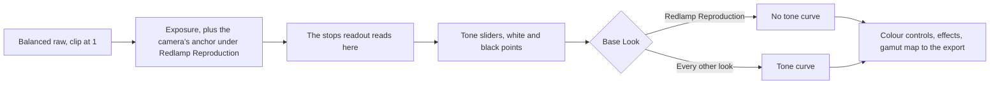

# Reproduction rendering and camera calibration: design (TON-39, CAM-28)

A museum imaging department tried Redlamp on raw target shots from Canon, Leica, Hasselblad and Sony cameras, exposed by an incident meter and white-balanced on the target. Its exports came out slightly dark, and the grey scale's L* wasn't linear against the target's values. Both come from how Redlamp renders, as [the note](../research/notes/TON-39-tone-reproduction.md) measures:

- Every look ends in a tone curve with a toe and a shoulder, which bends a grey scale. No exposure undoes that.
- Where a metered grey lands depends on each maker's ISO calibration, and only a DNG's BaselineExposure corrects for it.

This design adds **Redlamp Reproduction**, a Base Look with no tone curve, and calibrates each camera's exposure from a target, so that a metered grey and every patch of a target render at their own L*. It also adds a readout in stops. The article [Linear vs scene-referred](../../web/content/articles/linear-vs-scene-referred/index.md) explains the two words for readers new to them.

Tracker: TON-39 ([#360](https://github.com/pdcgomes/redlamp/issues/360)) and CAM-28 ([#359](https://github.com/pdcgomes/redlamp/issues/359)). The related rows are UX-40 ([#363](https://github.com/pdcgomes/redlamp/issues/363)), EDT-26 ([#361](https://github.com/pdcgomes/redlamp/issues/361)) and UX-39 ([#362](https://github.com/pdcgomes/redlamp/issues/362)). All five were accepted to land before 0.3.0, alongside the library.

**Status (2026-10-09):** approved; not started.

## Decisions (the owner, 2026-10-09)

- **Opt-in, as a Base Look named Redlamp Reproduction,** in its own section at the bottom of the Base Look menu. Nothing changes by default: the rendering makes ordinary photos look flat and turns anything brighter than a white card pure white. The name stays until users have seen it.
- **Exposure is anchored only under Redlamp Reproduction.** No existing edit and no other look renders differently, so no new process version is needed. Anchoring every render, with the default curve re-tuned, is a decision about Redlamp's default look; it is proposed as CAM-29.
- **Each camera is calibrated from the user's own target.** The calibration is kept per camera and written into each edit that uses it. A camera without one gets a typical anchor, marked as not calibrated. Redlamp ships no table of cameras yet.
- **Highlights above white clip,** and the clipping warning shows where.
- **The sliders keep working under it.** A status line says when the edit no longer renders the scene's own values.
- **The readout in stops appears only under Redlamp Reproduction,** where 0.0 means the metered grey. It counts Exposure: it reads the light as edited, before the tone sliders.

## What Redlamp Reproduction renders (TON-39)

- **No tone curve.** In `rl_develop` (`Develop.metal`), `display = toneCurve(scene / whitePoint)` becomes `scene / whitePoint` itself. It is mixed with the curve by the look's Amount, as a scene-referred look's table is: Amount 0 renders as Redlamp Color, and 100 or more has no curve at all. The look's parameters are contrast 1, saturation 1 and no warmth.
- **Nothing else bends it at the defaults.** With every other setting at its default, the stages before and after the curve leave values as they are. The tone controls' slope around 18% grey is 1, the colour controls go through OKLab and back unchanged, and the Tone Curve, vignette, grain and effects are off. So a flat patch renders at its scene value. Scene 1.0 is a perfect white diffuser: with the anchor, a metered 18% grey renders at 0.18 (L* 49.5), and each patch of a target at its own L*.
- **The expected result on the CC0 Sigma fp chart.** It is worked out from the note's measured renders by undoing Neutral's curve; it is not a render. The grey row reads 22.5, 35.5, 50.9, 66.4, 80.9 and 95.2, against references of 20.5, 35.7, 50.9, 66.8, 81.3 and 96.5. Black reads 2 L* lighter because of flare in the shot. The references are BabelColor's averages, since this chart's own aren't known.
- **Above white,** the output's gamut map clips each channel and keeps hue, as it does today, and the clipping warning marks it.
- **The camera's colour calibration stays:** its matrices, and a DNG profile's HueSatMap from process 4 on. A profile's LookTable and tone curve are a look, so they don't apply.
- **Bitmaps** (JPEG, HEIC, PNG, TIFF) skip process 3's undoing of the tone curve under Redlamp Reproduction. A file's own light then passes through unchanged, so a linear TIFF stays linear. No anchor applies to a bitmap.
- **In the code,** it is `BuiltInBaseLook.reproduction` (`redlamp/base/reproduction`, version 1). The Base Look menu and browser show it in a section of its own after the others. The CLI's `--base-look reproduction` follows from the enum, with `--anchor <stops>`; without it, the CLI uses the typical anchor.

### The status line

When Redlamp Reproduction is chosen, a line under the Base Look shows two things:

- **The calibration:** "Calibrated for Canon EOS R5 from a target, 9 Oct", or "Not calibrated: typical exposure". It also offers Calibrate from Target, Update Calibration and forgetting the camera's calibration.
- **What bends the rendering,** when anything does, for example "Contrast and Saturation changed: tones no longer as measured". What counts: Amount below 100, any tone, presence or colour control (Exposure excepted), the Tone Curve, Calibration's primaries, Black & White, the effects, and masks with adjustments. White Balance, Exposure, detail (sharpening and noise reduction) and lens corrections don't count.

The sliders keep their usual meaning. Exposure scales the light, and Contrast pivots around 18% grey. Highlights and Shadows lift regions, Whites and Blacks set the white and black points, and lowering Blacks a little takes out flare.

## Exposure tied to the camera (CAM-28)

### The anchor

- **What it is.** The anchor is the number of stops that puts a metered 18% grey at scene 0.18, measured from the white-balanced raw with its clip at 1.
- **How it applies.** Under Redlamp Reproduction, `DevelopParameters` sets the develop exposure to Exposure plus the edit's anchor. The anchor takes the place of a DNG's BaselineExposure, which is a maker's rendering offset rather than a metering calibration: it runs from −0.51 (Ricoh GR III) to +1.32 (DJI) across the decode samples.
- **Auto.** Under this look, Auto's analysis (`ImageAnalysis.autoTone`) uses the same exposure.

### The typical anchor

The typical anchor is +1.03 EV: a metered grey 3.5 stops below clip, the middle of the 3.3 to 3.7 stops cameras use by their ISO calibration. On those cameras it puts a metered grey between L* 46.5 and 52.6, against 49.5. The status line marks it "not calibrated", and the readout puts "≈" before its stops.

### Calibrate from Target

The status line and the command palette offer it. It is used after white balancing on the same patch with the White Balance Selector.

1. Click the target's grey patch.
2. A popover asks for the patch's reference L*, from the target's data sheet. It remembers the last value.
3. Redlamp reads the patch's light: the readout's scene luminance (below), at the edit's current Exposure and anchor. It works out the anchor that makes the patch read that L* at Exposure 0: `log2(Y(L*) / Y) + exposure + anchor`.
4. Two choices follow:
   - **Calibrate [camera]**, the default, saves the anchor for the camera model, writes it into the edit and sets Exposure to 0.
   - **Set This Photo's Exposure** changes only Exposure (`log2(Y(L*) / Y) + exposure`), which normalises this photo to the target. Nothing is saved.

Calibrate with a shot exposed as the meter read, with the camera set manually. The anchor absorbs the meter's calibration and the lens's light loss along with the camera's, so it holds for that meter and lens.

### Kept per camera

- **The store.** A small JSON store in Application Support (`Redlamp/Cameras/`) holds one entry per camera model, by make and model as the file names them. Each entry has the anchor, the ISO and date it was measured, and the photo's name. Recalibrating replaces the entry, and the status line can forget it.
- **Later.** EDT-06's per-camera defaults can absorb this store when they're built.

### Written into each edit

- **When.** Choosing Redlamp Reproduction writes the photo's own camera's anchor into the edit, in the same history step: the stored one, or the typical one. Receiving the look by Paste Settings, Sync or a preset does the same.
- **Never copied.** The anchor is never copied from one photo to another, and never into `.redrecipe` files: each photo gets its own camera's anchor.
- **Stable.** An edit renders with its own anchor on every Mac. A later calibration reaches it only through **Update Calibration**, which is explicit and undoable, and is offered when the camera's stored anchor differs from the edit's.

### Format

- **The key.** `exposureAnchor` on the recipe, with `stops`, `source` (`target` or `typical`) and `camera`.
- **Older Redlamps** keep the key, as they keep any recipe key they don't know. They render the unknown look as a missing one, with Redlamp Color's curve, as they do with any newer setting.
- **The docs.** `sidecar-format.md` and the schema describe the key and the new look's id (`SidecarSchemaTests`).
- **Versions.** The format version doesn't change. Neither does the process version: edits without Redlamp Reproduction render, and are written, as before.

## The readout in stops

- **What it shows.** Under Redlamp Reproduction, the histogram's line adds the exposure in stops from the anchored 18% grey, for example `L* 50.9  a* 0.1  b* −0.3  +0.08 EV`, and likewise after the RGB values. It has two decimals, since 0.01 EV is 0.15 L* at middle grey.
- **What it measures.** The light the tone sliders receive, after white balance, Exposure, the anchor and a mask's exposure where one covers the point: `log2(Y / 0.18)`, where Y is the Rec. 2020 luminance averaged over the readout's 5 × 5 area. At Exposure 0, that is the camera's own exposure against its meter.
- **How.** A readout output encoding gives both readings in one render. It is `.linear` with alpha carrying that luminance, where the kernel writes 1 today, so the RGB and L* the readout shows stay exactly as they are.
- **The field.** `PixelReadout` gains `stops: Double?`, which is nil under other looks. UX-40 codes against the same field.
- **What L* means here.** Under Redlamp Reproduction, while the status line reports nothing that bends the rendering, L* describes the scene relative to a perfect white diffuser.

## How the related rows fit

- **UX-40, readout points pinned on the photo.** It can be built in parallel. Each point shows a `PixelReadout`, so stops appear wherever the readout has them, and its render can batch several areas through the readout encoding. A reference L* and ΔL* per point would turn points on a grey scale into a check of the whole scale, and could fit the anchor over several patches; that is a follow-up, not part of this design.
- **EDT-26, reference export spaces.** L* survives any colour-managed export, so Redlamp Reproduction's exports are already right in sRGB and Display P3. EDT-26 adds the spaces masters are delivered in: Adobe RGB, ProPhoto, eciRGB v2 and linear 16-bit TIFF. eciRGB v2's L* curve makes a neutral's numbers proportional to its L*. EDT-26 needs:
  - the kernel's gamut map into the export's primaries, with a D50 white for ProPhoto and eciRGB v2;
  - an encoding pass for each space's curve;
  - the space's ICC profile in the file.
  
  It gets a short design of its own. Later, the readout's RGB could follow the export's space.
- **UX-39, the clipping triangle's preview.** It is independent and small. With highlights clipping at white, it is the quick way to see what clipped.

## Steps

1. `look`: the Base Look, its section in the menu and browser, the kernel path (no curve, mixed by Amount), bitmaps without the curve undo, and the CLI.
2. `anchor`: `exposureAnchor`, the per-camera store, the typical anchor, writing it on choose, paste, sync and presets, Update Calibration, and the exposure in `DevelopParameters` and Auto.
3. `readout`: the readout encoding, `PixelReadout.stops` and the histogram's line.
4. `target`: Calibrate from Target, its popover and two choices, the status line, the command palette's entries, Report a Bug's features, and the `develop.reproduction` scenario.
5. `measure`: a Redlamp Reproduction row in `research/tone-reproduction/greyscale.py`, with Exposure set so the anchor patch reads its reference. On the Sigma fp, it should be within 0.5 L* of the row worked out above. The department's files follow when they arrive.
6. `docs`: the tracker, the README, the Lightroom comparison, `sidecar-format.md`, `raw-pipeline.md` (where BaselineExposure is added to Exposure), the user manual, and the line "Neither exists in Redlamp yet" in the article, in step with the site's session.

## Testing

- **Renders.** A synthetic raw grey scale with known scene values renders each patch at its own value under Redlamp Reproduction, to half-float precision. Values above white clip with hue kept. Amount 0 renders as Redlamp Color, and a bitmap passes through as itself.
- **Stability.** Every existing edit and every other look renders exactly as before (`ProcessStabilityTests` and the golden renders). New golden renders are recorded for a Redlamp Reproduction edit.
- **The anchor.**
  - An uncalibrated camera gets the typical anchor, and a calibrated one the store's.
  - The anchor is written on choose, paste, sync and presets, each photo with its own camera's. It is never copied between cameras.
  - It replaces BaselineExposure only under the look.
- **Calibration.** On a synthetic patch, Calibrate makes the patch read the typed L* at Exposure 0. Set This Photo's Exposure leaves the anchor alone.
- **The readout.** It reads 0.00 EV on a scene 0.18 patch and +1.00 at Exposure +1, and has no stops under other looks. RGB and L* are unchanged from the `.linear` readout.
- **Format.** `exposureAnchor` round-trips, the schema accepts it, and unknown keys inside it are kept.
- **The app.** The `develop.reproduction` scenario chooses the look from the menu, calibrates on a point with L* 50, and checks that the histogram's line reads L* 50.0 and 0.00 EV there and that the status line says the camera is calibrated. Then it raises Contrast and checks that the status line says so. The automation contract (`RedlampAutomationTests`) covers the new action, tool and Report a Bug features.

## Gates

- **Performance.** The develop kernel gains one branch on a uniform, and the readout one more output. Neither is expected to move any metric; a performance run after merging confirms it, as `.cursor/rules/performance.mdc` asks.
- **Versions.** No process version: the process-stability gate must pass unchanged.

## What waits for the department

- **The standard's definitions.** Its draft could change the readout's zero point (18% grey at L* 49.5, or L* 50), the stage the readout reads at, how highlights are handled, and the white L* is measured against (D50). Each is a constant or a branch here.
- **The files.** The metered target shots give each of the four cameras' anchors. They test Redlamp Reproduction against the targets' values, and show whether Leica's DNG BaselineExposure matches its meter.
- **The output spaces.** Which spaces they need decides EDT-26's order.
- **Colour accuracy.** Each camera's matrix decides a* and b*. Their targets will show whether a chart-fitted profile is needed: TON-14's chart matrix solve, or TON-09's deferred `.dcp` import.

## Later

- **CAM-29:** anchoring every render, with the default curve re-tuned, behind a new process version.
- **A shipped table** of camera anchors, which a user's calibration overrides. Its numbers could come from metered chart shots, the department's first, or be estimated from the camera bench's raw and JPEG pairs.
- **Settings that move where a camera puts a metered grey:** extended ISO, Canon's Highlight Tone Priority and Fujifilm's DR modes, each about a stop. The calibration records its ISO; reading the settings from the files comes later.
- **Flat-field correction** from a white reference shot, if the department needs it in the raw processor.
