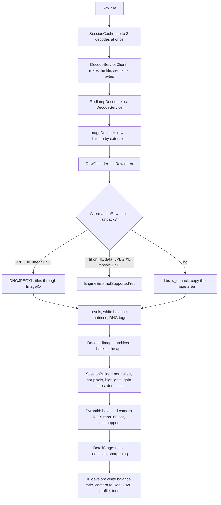

# How Redlamp handles raw files

A technical description of what happens between a raw file on disk and the camera colour the develop kernel works in: how a file is opened, what LibRaw does and doesn't do, what Redlamp reads itself, the GPU stages that run on sensor data, how colour is set up, and how all of it is verified. It is written for anyone changing this code, agents included, and describes the code on `main` on 5 October 2026 (process version 12, LibRaw 0.22.2). It cites files and symbols rather than line numbers. When the code changes, change this document in the same commit.

## Abstract

Redlamp uses LibRaw only to parse raw files and unpack their sensor data. Black levels, white levels, white balance, highlight reconstruction, lens shading, demosaicing and colour are Redlamp's own, and all of them run on the GPU in a scene-linear pipeline. Decoding happens in a sandboxed XPC service that receives the file's bytes and returns a `DecodedImage`: the mosaic or linear samples cut to the image area, with the calibration needed to develop them. A session then normalises the samples, repairs hot photosites, rebuilds clipped ones, applies DNG gain maps and demosaics into a mipmapped pyramid of white-balanced camera RGB. Every render converts that to linear Rec. 2020 for the chosen white balance. Formats LibRaw can't unpack are either read by Redlamp's own side decoders (JPEG XL linear DNGs) or refused with a message saying they aren't supported yet. Support is claimed only for cameras with a sample in the decode tests, and the camera bench measures the rest against each camera's own JPEG.

## 1. Principles

- **LibRaw unpacks; Redlamp develops.** `RawDecoder` (`packages/RedlampServices/Sources/RawDecoder.swift`) calls `libraw_open_*` and `libraw_unpack`, copies out the samples and the calibration, and nothing more. LibRaw's own processing (`dcraw_process`, its demosaics, its colour conversion) is never used. The one exception is Phase One, below.
- **Scene-linear.** Sensor values are normalised to 0 for black and 1 for white, balanced, demosaiced and converted to linear Rec. 2020. Values above 1 survive normalisation, so highlights can be reconstructed and recovered.
- **No sample, no support claim.** A camera counts as supported only once a sample of it decodes in the decode regression suite (`DecodeRegressionTests`). LibRaw's camera list says what may open, not what opens correctly ([docs/cameras.md](cameras.md)).
- **Rendering is versioned.** An edit records the process version it was made with, and a change to how an existing edit renders needs a new process version ([sidecar format](recipes/sidecar-format.md#process-versions)). Wrong pixels (NaN, black, out of range) are fixed in every version.
- **Licences.** LibRaw is used under CDDL-1.0 (`config/vendored-libs.json`). Everything else is implemented from published specifications and papers; no GPL code, and no Adobe files are shipped or converted (`AGENTS.md`).

## 2. Overview

## 3. Opening a file

**Dispatch.** `ImageDecoder.decode` (`DecodedImage.swift`) sends files whose extension is in `SupportedFormats.rawExtensions` to `RawDecoder` and everything else to `BitmapDecoder`, which decodes through ImageIO into float16 linear sRGB. The raw extensions are `3fr arw cr2 cr3 crw dcr dng erf fff iiq kdc mef mos mrw nef nrw orf pef raf raw rw2 rwl sr2 srf srw`.

**The decode service.** On the Mac, the engine decodes through `DecodeServiceClient` (`DecodeService.swift`). It memory-maps the file and sends its bytes over a new `NSXPCConnection` to `RedlampDecoder.xpc`, whose `DecodeService` has no file system access and decodes from the bytes. The reply is `DecodedImage.archived()`: an 8-byte little-endian header length, a JSON header with everything but the samples, then the samples. The app rebuilds the image with `DecodedImage(archive:url:)`, which refuses a header that fails `Header.isValid` (sample counts, a black level per pattern position, finite numbers, 3 × 3 matrices, valid tables). A damaged or hostile file can only crash the service. Each decode has its own connection, so photos decode in parallel. Errors come back as JSON-encoded `EngineError`s. If the service isn't bundled the client decodes in process without saying so; if it stops mid-decode, the error is "the decoder stopped while reading … the file may be damaged". The CLI and the tests use `InProcessDecoder`.

**Caching.** `SessionCache` (`packages/RedlampEngine/Sources/SessionCache.swift`) holds built sessions in a least-recently-used cache whose budget is a quarter of the GPU's recommended working set, at most 3 GiB. It runs at most three decodes at once (two for prefetching), and doesn't prefetch a file that failed again; opening it again tries again.

**What people see when a file won't open.** `EngineError` (`packages/RedlampEngineAPI/Sources/Rendering.swift`) supplies the text: "<name> is not a supported image." (LibRaw's refusal), "The image could not be decoded: <reason>", or, for a format Redlamp knows and plans to read, `.notSupportedYet(formats, tracker:)`: "<formats> aren't supported yet." `EditorModel` shows the text on the canvas (`CanvasArea.statusLayer`). For a format that isn't supported yet it sets `formatNotSupportedYet`, and the button beside the message is **Send Feedback…**, which opens Report a Bug or Send Feedback as an Idea under Photos & Cameras › Unsupported Camera or Format (`raw.unsupported`), the message quoted (`EditorModel.openErrorReport`). Any other failure gets **Report…**, a bug under A Photo Won't Open (`raw.wont-open`). The camera bench maps a `notSupportedYet` refusal to its tracker row (`CameraBenchChecks.knownLimitation`).

## 4. LibRaw

**The pin.** `config/vendored-libs.json` names LibRaw's version, tarball URL and SHA-256. `scripts/vendor-libraw.sh` downloads and checks the tarball, compiles the sources listed in LibRaw's `Makefile.dist` with `-DUSE_ZLIB -DLIBRAW_NODLL` (reentrant: no `LIBRAW_NOTHREADS`) for macOS, iOS and the simulator, and builds `vendor/build/LibRaw.xcframework`. No Adobe DNG SDK, RawSpeed or JPEG library is compiled in, which is why JPEG XL DNGs need a side decoder. A stamp of the version, the tarball's hash and the shim's hash skips rebuilds; `FORCE=1` forces one. A LibRaw snapshot that isn't a tagged release is pinned by its full 40-character commit SHA as the version, with `https://github.com/LibRaw/LibRaw/archive/<sha>.tar.gz` as the URL, since GitHub's archive of a commit unpacks to `LibRaw-<sha>`.

**The shim.** Swift can't import LibRaw's large fixed arrays, 2-D arrays or C strings directly, so `vendor/shims/redlamp_libraw.h` has inline accessors: `rl_cblack`, `rl_cam_mul`, `rl_pre_mul`, `rl_rgb_cam`, `rl_cam_xyz`, `rl_baseline_exposure`, `rl_dng_illuminant`, `rl_dng_colormatrix`, `rl_xtrans`, `rl_make`, `rl_model` and `rl_lens`. Changing the shim rebuilds the framework.

**Unpacking.** `RawDecoder.decode` calls `libraw_init`, `libraw_open_file` or `libraw_open_buffer`, then `RawDecoder.unpack`, then reads the result. **A failed `libraw_unpack` clears everything LibRaw parsed**, so anything that decides not to unpack (a side decoder, a refusal) must run before it. LibRaw's status −2 becomes `EngineError.unsupportedFile`, any other failure `decodeFailed` with LibRaw's message.

**Layouts.** The samples are copied out of LibRaw's buffers, cut to the image area (`sizes.top_margin`, `left_margin`, `width`, `height`), into one of `DecodedImage.Layout`'s cases:

- `.mosaic(CFAPattern)`: one `UInt16` per photosite, from `rawdata.raw_image` when `idata.filters != 0`. Bayer patterns come from LibRaw's `filters` (green 2 folded into green); `filters == 9` is X-Trans, read 6 × 6 from `idata.xtrans`.
- `.linearRGB`: three `UInt16` per pixel, from `color3_image` or `color4_image` (linear DNGs such as ProRAW), or from the JPEG XL side decoder.
- `.linearSRGBHalf` (bitmaps) and `.balancedCameraHalf` (focus stacks) never come from `RawDecoder`.

While copying a mosaic, `RawDecoder.copyMosaic` builds a 65,536-bin histogram for the white level.

**Phase One.** LibRaw applies a Phase One back's black levels (global, per row, per column) and its flat-field and sensor-half calibration only in `raw2image`, so for those files `correctedPhaseOneMosaic` calls `libraw_raw2image` and takes each photosite from its own colour's channel. Banding and margin measurements are skipped for them.

## 5. Formats LibRaw can't unpack

**JPEG XL linear DNGs** (DNG 1.7, Compression 52546, as in recent iPhone ProRAW): before unpacking, `DNGJPEGXL.decode` (`DNGJPEGXL.swift`) finds the NewSubfileType 0 directory with that compression, decodes its tiles concurrently through ImageIO, and maps the stored codes through the DNG's LinearizationTable. The result is `.linearRGB`, cut to the image area by `RawDecoder.cropped`. Mosaic JPEG XL DNGs are refused as not supported yet (CAM-10).

**Nikon's High Efficiency NEFs** (HE and HE*, CAM-12) store the raw image as a JPEG XS codestream (intoPIX's TicoRAW). LibRaw 0.22.2 looks for it only in the Z 9, Z 8, Z f and Z 6III, where its `nikon_he_load_raw` is a stub that refuses it, and sends other bodies' HE data (the Z5 II's and Z50 II's) to its ordinary Nikon decoder, which turns it into noise. `NikonHighEfficiency.libRawCantDecode` (`NikonHighEfficiency.swift`) reads the NEF's raw directory with `TIFFReader`, checks for JPEG XS's `FF10 FF50` markers, and refuses the file unless LibRaw has routed it to `nikon_he_load_raw` without flagging that decoder `LIBRAW_DECODER_UNSUPPORTED_FORMAT`. The guard therefore steps aside once LibRaw ships a working decoder, and keeps catching bodies it still misroutes. `RawDecoder.identify` reports such files with the decoder `nikon_he_load_raw`, so the camera bench keeps them apart from the same body's lossless files. The routes to opening them are in the [CAM-12 note](research/notes/CAM-12-nikon-high-efficiency.md).

**Adding a side decoder or a refusal** takes two places in `RawDecoder`: a branch in `unpack`, before `libraw_unpack`, that returns the stored samples or throws; and, for a decoder, a branch in `decode`'s layout chain (as `jpegXL` has) with a crop to the image area. Everything else (sizes, margins, black, white, white balance, matrices, `ImageInfo`) still comes from LibRaw's parse, so a side decoder only produces samples. Test it with synthetic files built in the test, as `DNGJPEGXLTests` and `NikonHighEfficiencyTests` do, and with a CC0 sample in the coverage set. A refusal uses `EngineError.notSupportedYet` with the format named in the plural and its tracker row.

## 6. What a decode carries

`DecodedImage` (`DecodedImage.swift`) holds the samples and layout, and:

- **Black levels, one per pattern position** (`RawDecoder.blackPattern`): LibRaw's `color.black`, plus `cblack[channel]`, plus its spatial pattern (`cblack[4]` × `cblack[5]` values from `cblack[6]`). Linear layouts get one per channel.
- **Banding** (`BandingCorrection`, `OpticalBlack.measure`): per-row and per-column offsets measured in the sensor's masked margins, kept only where lines vary more than their noise explains and enough masked photosites exist. Subtracted with the black level.
- **The white level** (`WhiteLevel.measured`): LibRaw's `color.maximum`, unless the histogram has a spike at its maximum (the top five codes holding at least 20 times the background, and at least 16 photosites or one in 500,000), which marks where photosites actually clip. Without a spike nothing clipped, and the nominal level stands.
- **As-shot white balance** (`asShotMultipliers`): LibRaw's `cam_mul`, else `pre_mul`, with green at 1; neutral if neither is usable.
- **Colour matrices.** `cameraToSRGB` is LibRaw's `rgb_cam` (camera RGB to linear sRGB, from LibRaw's Adobe-derived tables for non-DNG raws). `xyzToCamera` is `cam_xyz`, or for DNGs where LibRaw leaves it empty, the file's ColorMatrix (preferring the D65 calibration) scaled by AnalogBalance (`RawDecoder.dngColorMatrix`).
- **Orientation** (LibRaw's `sizes.flip`: 0, 3, 5 or 6) and **BaselineExposure** (LibRaw's negative sentinel for "none" becomes 0).
- **What Redlamp reads itself**, with `TIFFReader` on the file's bytes, since LibRaw doesn't expose it: `DNGNoiseProfile` (tag 0xC761), `DNGGainMaps` (OpcodeList2 GainMap opcodes), `DNGColorCalibration` (both illuminants' ColorMatrix, CameraCalibration and ForwardMatrix, AnalogBalance), `DNGProfile` (HueSatMap, LookTable, tone curve, ProfileGainTableMap) and `LensCorrectionReader` (DNG OpcodeList3 warp and vignetting, Sony's ARW and Fujifilm's RAF correction tables).
- **Diagnostics** (`RawDiagnostics.swift`): the file's identity (`RawFileIdentity`: camera, LibRaw's decoder, bits, sizes, previews; nothing that identifies a person) and measurements for the camera bench (`DecodeMeasurements`: black against the masked margins and the 0.1th percentile, clipped and zero shares, dark edge strips). `ImageDecoder.identify` reads the identity without unpacking, falling back to EXIF with LibRaw's reason when LibRaw won't open the file.

The user's own lens profiles (LCP files) are matched after decoding, in the app (`LensCorrectionReader.correction(for:profiles:)`), because the decode service can't see them; a correction the file carries comes first.

Thumbnails don't decode at all: `Thumbnails` asks LibRaw for the smallest embedded JPEG preview at least as large as needed.

## 7. Raw-domain processing on the GPU

`SessionBuilder.build` (`packages/RedlampEngine/Sources/SessionBuilder.swift`) uploads the samples and encodes the raw stages in one command buffer, into level 0 of an `rgba16Float` pyramid with a mip level per halving. `encodeMosaic` runs, in this order:

1. **Normalise** (`rl_cfa_normalize`, `Demosaic.metal`): `(raw − black − banding) / (white − black)`, times the as-shot multiplier of the photosite's colour. The multipliers are `SessionBuilder.balance`: the as-shot white balance divided by its smallest channel, so the mosaic is neutral for the stages after it but nothing is darkened. Values are clamped at 0 only: a channel with a large multiplier clips at its own level, above 1.
2. **Hot photosites** (`rl_cfa_repair_hot_pixels`): a photosite 8 noise sigmas above every neighbour within two pixels and twice as bright as the brightest of them (`hotPixelThreshold`, `hotPixelRatio`) is replaced by the mean of its same-colour neighbours. Adjacent photosites of other colours count as neighbours, because a real point highlight spills into them. The count is kept for the session.
3. **Highlight reconstruction** (`rl_cfa_reconstruct_highlights`, CAM-08), only for mosaics with clipped photosites (`HighlightModel.fit` returns nil otherwise): a clipped photosite is predicted in cube-root space from the means of its unclipped, bright (at least half the clip level) neighbours of the other colours, with a colour offset fitted on the unclipped pixels bordering clipped areas: the constant-chromaticity case of Zhang and Brainard (2004). The result lies between the clip level and four times it. Where every colour clipped, the lowest neutral consistent with all of them.
4. **DNG gain maps** (`rl_cfa_apply_gain_maps`, CAM-03): lens shading from OpcodeList2. Deliberately last among the raw stages, so clipping and hot photosites are judged against the sensor's own levels.
5. **Demosaic.** 2 × 2 Bayer patterns use Menon, Andriani and Calvagno (2007) in four passes (`rl_menon_directional`, `rl_menon_green`, `rl_menon_rb_at_green`, `rl_menon_rb_at_rb`, `DemosaicMenon.metal`; CAM-05). The last pass includes the dual-demosaic blend (CAM-06): where the four green neighbours span less than 3 noise sigmas, fully by 6, green becomes their plain average, so flat areas don't get Menon's directional noise. The sigma comes from the white-balanced noise model times the gain maps' gain there. Malvar, He and Cutler (2004) (`rl_demosaic_bayer`) is kept for comparison. Every other pattern, X-Trans included, uses `rl_demosaic_generic`, a distance-weighted same-colour interpolation over 5 × 5 (a Markesteijn-class X-Trans demosaic is CAM-07).

Linear layouts skip all of that: `rl_rgb_normalize` black-subtracts, scales, applies gain maps per channel and the as-shot multipliers, and **clamps to [0, 1]**, so linear DNGs have no highlight headroom or reconstruction. Bitmaps and focus stacks are copied into level 0 as they are.

Mipmaps are then generated, and `SessionBuilder.maps` makes the analysis copy and the maps later stages read (haze, the edge-aware tone and Clarity bases, glow sources). `SessionBuilder.checkGainMaps` validates the gain maps before any encoder opens, because an encoder left open by a throw aborts under Metal's validation layer.

## 8. Noise

`NoiseModel` (`NoiseEstimate.swift`) is the Poisson–Gaussian model, `variance = a · value + b` per channel in normalised units. `DecodedImage.noise(profiles:)` takes the file's DNG NoiseProfile if it has one; otherwise a calibrated profile for the camera at its ISO from `NoiseProfileCatalog.bundled`, measured from calibration frames with `redlamp noise` (DN-01); otherwise an estimate from the image itself (`NoiseEstimator`). A measurement below 40% of the profile's signal-dependent term wins over the profile: the camera has reduced noise already, or the profile isn't this camera's. `NoiseGain` turns the gain maps into a 64-texel field of per-channel gain, so stages that use the noise model treat shaded corners as noisier.

The model sets the hot-photosite threshold and the dual-demosaic blend. No noise reduction runs on the mosaic: the Detail panel's noise reduction and sharpening run in `DetailStage`, on the pyramid, in front of the develop kernel (an à-trous B3-spline decomposition in a noise-stabilised opponent space, then non-local means at full resolution), cached by region, pyramid level and settings.

## 9. Colour

The pyramid holds balanced camera RGB. `ImageSession` (`ImageSession.swift`) sets up the matrix to linear Rec. 2020, the working space:

- **DNGs with calibrations** use `DNGColorCalibration.cameraToWorking(temperature:)` (`DNGColor.swift`, CAM-04): the two calibrations interpolated linearly in inverse colour temperature and clamped between their illuminants, as the DNG specification describes. With ForwardMatrix, balanced camera RGB goes to XYZ D50, then by Bradford to D65 and Rec. 2020; without, the interpolated XYZ-to-camera matrix is inverted with its rows normalised so neutral stays neutral. The as-shot temperature is found by iterating McCamy's approximation, since the interpolation needs the temperature and the temperature the interpolation.
- **Other raws** have one matrix: `sRGBToRec2020 × cameraToSRGB`.

Each render, `rl_develop` (`Develop.metal`) multiplies balanced camera RGB by `ImageSession.whiteBalanceRatio(for:)`, the gains from the as-shot balance to the requested one (Temperature and Tint through `CameraColorModel`, which still uses one matrix even for DNGs), then by `cameraToWorking(for:)`. A DNG profile's HueSatMap (process 4 on) and ProfileGainTableMap (process 5 on) apply after that; BaselineExposure is added to Exposure. Tone mapping and gamut mapping to the output follow; they aren't raw-specific and aren't described here.

## 10. Lens corrections

`LensCorrection` (`packages/RedlampEngineAPI/Sources/LensCorrection.swift`) holds one radial model from any source: the file's own (DNG OpcodeList3, Sony, Fujifilm) or a user's LCP profile. Each source has the first process version that applies it (`Source.process`), enforced in `Geometry`: edits made before a source was supported keep rendering without it. Distortion and lateral chromatic aberration are applied as warps of source coordinates in the develop kernel (`outputToImage` in `Develop.metal`), red and blue each read from where the lens put them.

## 11. Stability

`EditRecipe.currentProcessVersion` is 12. Rendering changes are gated by comparisons such as `recipe.processVersion >= 4` in `DevelopParameters`, `DetailStage`, `RetouchStage` and `RedlampEngine`; the [sidecar format](recipes/sidecar-format.md#process-versions) lists what each version changed. `ProcessStabilityTests` (`packages/RedlampEngine/Tests`) develops each fixture with each test edit at every version from 1, and compares patch colours (CIEDE2000) and detail with references recorded when each version shipped (`tests/golden/process`), with limits of 0.02 mean and 0.2 worst, room only for another GPU's rounding. Raw-stage changes reach every edit, since the raw stages aren't gated by version: a change to normalisation, hot photosites, highlights, gain maps or the demosaic needs a new process version and a gate, unless it fixes wrong pixels.

## 12. Verification

- **Fixtures.** `mise run fixtures` (`mise/tasks/fixtures`) downloads six development samples into `tests/fixtures/raw` and the camera coverage set (`tests/decode/samples.json`, CC0 files from raw.pixls.us, each checked against its SHA-256) into `tests/fixtures/cameras`. Neither is committed. The manifest's `gaps` list what isn't covered.
- **Decode regression** (`packages/RedlampServices/Tests/DecodeRegressionTests.swift`): every sample's layout, crop, black and white levels, as-shot white balance, colour matrix, orientation, baseline exposure and a checksum of its sensor data, against `tests/decode/cameras.json`. After an intended decoder change, regenerate it (`TEST_RUNNER_REDLAMP_UPDATE_DECODE_GOLDEN=1`) and review the diff: only the files the change meant to touch may move.
- **Camera colour** (`packages/RedlampEngine/Tests/CameraGoldenTests.swift`): each sample rendered at the default edit, its patches compared by CIEDE2000 with `tests/golden/cameras`, mean under 0.5 and worst under 2.
- **Process stability**, above.
- **The camera bench** ([docs/camera-bench.md](camera-bench.md)): `redlamp camera-bench`, or Help › Test Your Camera… in the app, checks a decode's levels, colour matrix and edges, and compares the default rendering with the camera's embedded JPEG. Its reports, from people's cameras and from the raw.pixls.us seed run (`scripts/camera-bench-seed.py`, [note](research/notes/CAM-14-seed-run.md)), are aggregated by `scripts/camera-bench.py` into `docs/camera-bench.json`, and `scripts/camera-list.py` writes [docs/cameras.md](cameras.md), which redlamp.app/cameras shows.
- **Performance.** Opening raws is measured by `redlamp bench` and recorded with `scripts/perf-record.sh` (`.cursor/rules/performance.mdc`); a change to decoding or the raw stages records a run on a quiet Mac.

## 13. Known gaps

| Gap | Tracker |
| --- | --- |
| JPEG XL mosaic DNGs are refused | CAM-10 |
| Nikon High Efficiency NEFs are refused, waiting on LibRaw's next snapshot | CAM-12 |
| Bodies newer than LibRaw 0.22.2 are refused, or open without a matrix or with a wrong black level | CAM-13, CAM-21 |
| Monochrome raws are refused | CAM-20 |
| Fujifilm SuperCCD files crash the decode service | CAM-22 |
| X-Trans uses the generic interpolation | CAM-07 |
| Non-DNG raws have one matrix; Temperature and Tint use one matrix for DNGs too | CAM-04 |
| Per-camera measured white levels | CAM-02 |
| Linear DNGs have no highlight headroom (clamped at normalisation) | — |

## 14. Procedures

**Supporting a new camera.** Find a CC0 sample (raw.pixls.us), add it to `tests/decode/samples.json` with its SHA-256, run `mise run fixtures`, regenerate the decode goldens and record the camera colour golden, then run `scripts/camera-list.py --apply`. If it decodes wrongly, `redlamp camera-bench <file>` says which check fails; fix the cause, not the golden.

**Updating LibRaw.** Change `config/vendored-libs.json` (a tag, or a snapshot's full commit SHA, and the tarball's SHA-256), run `FORCE=1 scripts/vendor-libraw.sh`, then the full RedlampServices suite. Regenerate the decode goldens and read every changed record; check the camera colour goldens and `ProcessStabilityTests`; re-run the camera bench on the cameras the update is for; run `scripts/camera-list.py --apply` (it reads the camera list from `vendor/cache`); update the README's limitations and the tracker rows (CAM-12, CAM-13, CAM-21). For CAM-12, check that the HE guard steps aside on bodies LibRaw now decodes and still refuses those it doesn't.

**Adding a side decoder or a refusal.** Section 5.

**Changing a raw stage.** Gate it by a new process version (section 11), record that version's references, and say in the commit which pixels move.

**Investigating "won't open" or "looks wrong".** A report from the app names its feature (`raw.wont-open`, `raw.unsupported`, `raw.colours` and others) and its activity says which photo failed. `redlamp info <file>` decodes it and prints the error or the decode's summary; `redlamp camera-bench <file>` measures it against the camera's JPEG; `ImageDecoder.identify` shows LibRaw's decoder and the file's mode. Compare with the coverage set's sample of the same camera, if there is one.

## 15. Constraints that are easy to break

- Anything that decides not to unpack runs before `libraw_unpack`, which clears LibRaw's data when it fails.
- Gain maps apply after hot-photosite repair and highlight reconstruction, not in the DNG specification's opcode order, so clipping is judged at the sensor's own levels.
- Mosaic normalisation keeps values above 1; linear normalisation clamps to 1.
- The decode service sees only bytes: anything that needs the file system (the user's lens profiles) runs in the app after decoding, and `Header.isValid` is the only check on what the service returns.
- A missing decode service falls back to decoding in the app without saying so.
- A throw while a Metal encoder is open aborts under the validation layer, which every test target turns on: validate before encoding.
- The white level can come out below LibRaw's nominal level when the histogram shows a clip spike there; lossy formats spread the spike over a few codes.

## References

- LibRaw, [documentation](https://www.libraw.org/docs) and [source](https://github.com/LibRaw/LibRaw), licence LGPL-2.1 or CDDL-1.0.
- Adobe, *Digital Negative (DNG) Specification*, version 1.7.1.0 (2023): ColorMatrix, CameraCalibration, ForwardMatrix and their interpolation; NoiseProfile; opcode lists; JPEG XL compression.
- ISO/IEC 21122-1, *JPEG XS: Core coding system*, 2nd edition ([jpeg.org/jpegxs](https://jpeg.org/jpegxs/index.html)).
- D. Menon, S. Andriani, G. Calvagno, "Demosaicing with directional filtering and a posteriori decision", *IEEE Transactions on Image Processing* 16(1), 2007.
- H. S. Malvar, L. He, R. Cutler, "High-quality linear interpolation for demosaicing of Bayer-patterned color images", *ICASSP* 2004.
- X. Zhang, D. H. Brainard, "Estimation of saturated pixel values in digital color imaging", *JOSA A* 21(12), 2004.
- A. Foi, M. Trimeche, V. Katkovnik, K. Egiazarian, "Practical Poissonian-Gaussian noise modeling and fitting for single-image raw-data", *IEEE Transactions on Image Processing* 17(10), 2008.
- C. S. McCamy, "Correlated color temperature as an explicit function of chromaticity coordinates", *Color Research & Application* 17(2), 1992.
- Redlamp: [the tracker](research/research-tracker.md) (CAM-, DN-, LNS- and ARC- rows), [darktable findings §3](research/darktable-findings.md) and [its evidence](research/darktable/notes/A-cameras-and-raw.md), [the camera bench](camera-bench.md), [the sidecar format](recipes/sidecar-format.md).
