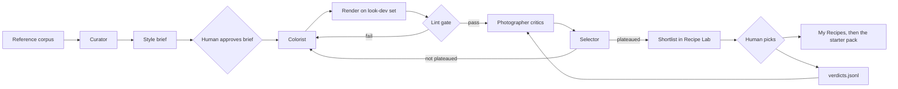

# Agent recipe studio

A team of agents develops candidate recipes from style references and iterates on them. Humans approve the briefs the agents work towards and pick what ships. The code is in [research/recipe-studio](../../research/recipe-studio/README.md); the Recipe Lab's **Runs** tab (in the harness) is where people see runs and record verdicts.

## Roles

- **Curator.** Clusters the references in each style bucket by their measured fingerprint (seeded k-means), and writes one brief per cluster: title, description, and what the look must do to skin, sky and foliage, plus the cluster's target fingerprint. Briefs start as `proposed`; nothing works on them until a human approves them in the Lab.
- **Colorist.** Starts from the fitter's result (`fit_to_fingerprint`), proposes variants with deliberate changes, and later revises the best candidates from the critics' change requests.
- **Photographer critics.** Three personas (portrait, landscape and travel, street and documentary), each with a rubric. They score every candidate that passes lint from its contact sheet across the look-dev set, write change requests, and judge pairs with the order randomised and names hidden.
- **Selector.** Turns pairwise choices into Bradley-Terry ratings, counting human verdicts three times. It subtracts a penalty for candidates whose fingerprint is close to a recipe the library already has, stops a brief when the best rating plateaus, and shortlists the top three.
- **Technical QA is not an agent.** Lint and fingerprint distance are deterministic MCP tools. A candidate that fails lint never reaches a critic.

## The tools

Agents reach Redlamp only through `redlamp mcp`, the engine and recipe library as a Model Context Protocol server:

| Tool | What it does |
| --- | --- |
| `schema` | Every parameter (key, range, default, group), setting groups, film slots, Base Looks and the recipe JSON shape |
| `list_images` | The look-development set by category, the lint chart, the fixtures |
| `list_recipes` | The library, with search |
| `render`, `contact_sheet`, `compare` | Renders, returned as images and saved in the run |
| `fingerprint` | The style fingerprint of images, or of a recipe's renders; optional distance to a target |
| `fit_to_fingerprint` | Seeded search of recipe settings (and optionally a look table) towards a target |
| `lint` | The five lint checks |
| `save_candidate` | Saves a candidate with lineage, lints it and renders its contact sheet |

Cursor agents can use the same server directly. Add it to `.cursor/mcp.json` as `{"mcpServers": {"redlamp": {"command": "<checkout>/build/DerivedData/Build/Products/Debug/redlamp", "args": ["mcp"]}}}`.

## Run directories

Everything a run produces lives in `build/recipe-runs/<run>/` (gitignored). The Swift side (`RecipeRun`, `RunStore`) and the Python side (`studio/store.py`) read and write the same files:

| File | Written by |
| --- | --- |
| `run.json` | The orchestrator: seed, model, rubric version, budgets, status, whether critics are trusted |
| `briefs/<id>.json` | The Curator |
| `candidates/<id>.redrecipe`, `candidates/<id>.json` | The MCP server (recipe, lineage, lint, contact sheet), then the Selector (rating) |
| `critiques.jsonl`, `comparisons.jsonl`, `scores.jsonl` | The critics and the Selector |
| `shortlist.json` | The Selector |
| `verdicts.jsonl` | People, in the Lab: brief approvals, pairwise picks, final picks (append-only) |
| `transcripts/` | Every model call: prompt, images, context and reply |
| `renders/` | Contact sheets and comparisons |

Runs are seeded, so the same references, model and seed reproduce the same run with the offline model. With a hosted model, the transcripts record exactly what it was asked and answered. Budgets cap model calls and renders; a run that hits one stops cleanly and still writes its shortlist.

## Keeping the critics honest

`python -m studio eval` scores the current critic configuration: the model plus the hash of every rubric in `studio/rubrics/`. A report is stored per configuration in `build/recipe-runs/_evals/`, so any change to a rubric, a prompt or the model is re-scored against the same verdicts.

- **Agreement with humans.** Held-out human pairwise verdicts (a fixed 30%, chosen by hashing the pair) are replayed to the critic. It must agree on at least 70% of them, over at least 30 verdicts. Collect about 200 verdicts in the Lab before trusting critics on a larger batch.
- **Order consistency.** Every pair is judged in both orders; at least 80% must agree with themselves.
- **Bias probes.** A neutral edit against itself with +30 saturation or +30 contrast, the "more" side alternating. Choosing "more" over 75% of the time fails, and so does choosing the left image outside 35–65% of the time.

Until a configuration passes, `studio run` works on a single brief, which is the plan's "one brief end to end" start.

## References

The fetcher contacts only allowlisted hosts and keeps only items the source itself marks as public domain or CC0. That means Library of Congress items marked "no known restrictions", Met Open Access, Art Institute of Chicago public-domain works, NASA, Wikimedia Commons PD and CC0 files, Smithsonian CC0, Rijksmuseum, and Flickr Commons. Every image gets a manifest entry (source, page, image URL, license, author, date, title, style), and references are never shipped. Some sources block automated requests from some networks (loc.gov answered 403 in testing); the fetcher reports them and carries on.

Public-domain photographs lean historical. For modern styles (pastel lifestyle, teal-orange cinematic, moody editorial), add own or commissioned CC0 photos with `references add-own`, or write the brief in words only. Recipes are never named after photographers, brands or film stocks, and agents have no web access, so no third-party presets or LUTs can come in.

## Verified

A dry run with the offline model over the landscape references (`studio run --styles expansive-landscape --auto-approve --iterations 2`) produced 5 candidates with lineage, critiques, comparisons, ratings, contact sheets and a shortlist, in about 16 seconds on an M1 Ultra. `studio eval` flagged the offline critic's position bias and, with `--model offline:saturation`, its saturation bias.
