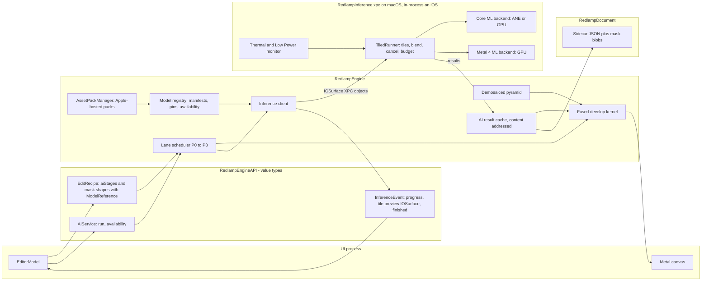
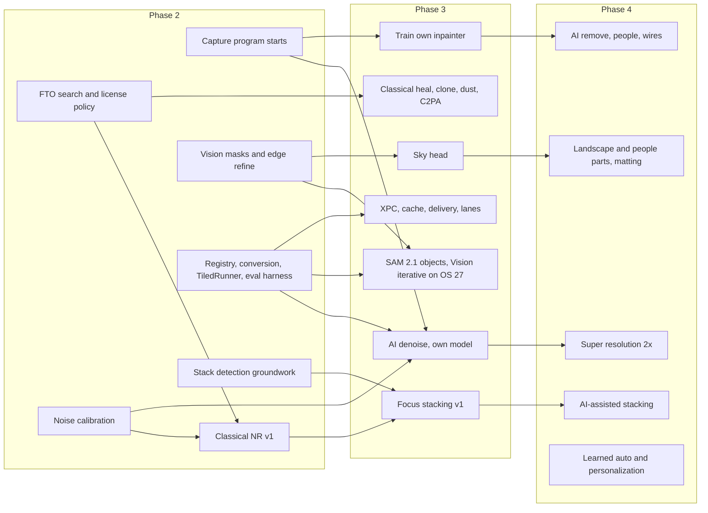
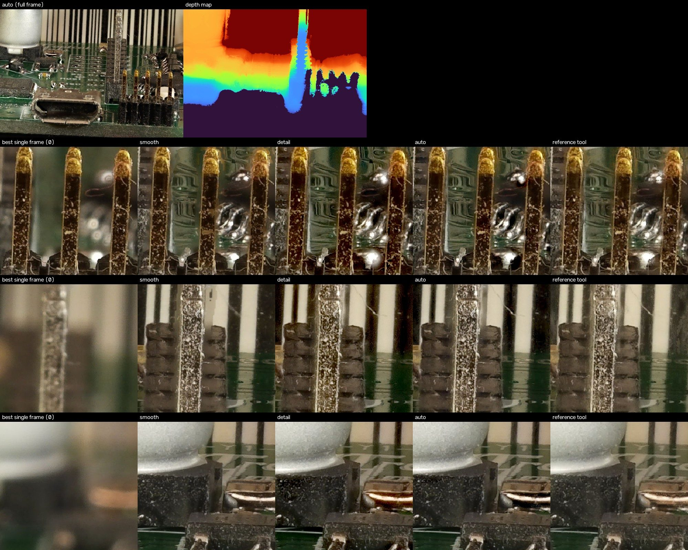
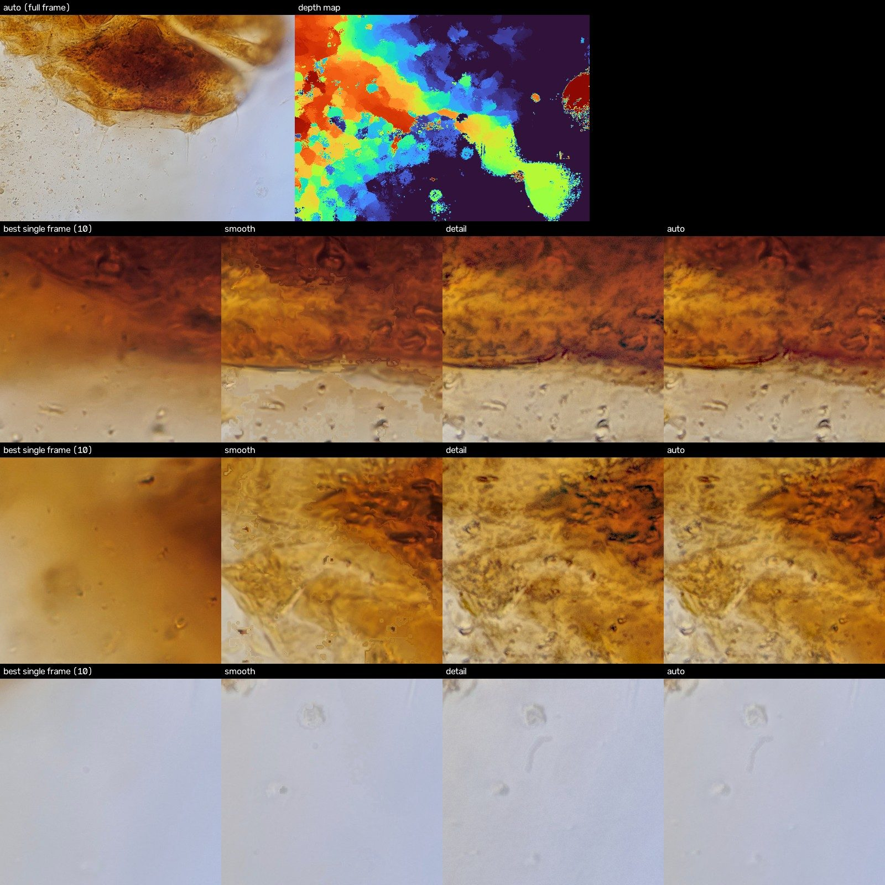

# AI and Computational Photography in Redlamp: Findings

**Answers:** [the research brief](ai-and-computational-photography-brief.md). **Date:** 29 September 2026.
**Status:** first full pass. Every workstream is covered; prototypes ran on the Apple M1 Ultra test machine (macOS 26.6).

## How to read this document

- **Evidence** is cited inline to papers (arXiv IDs or DOIs), repositories, model cards, dataset terms and vendor documentation, all fetched on 29 September 2026. **Assessment** marks our judgement. Estimates are labelled as estimates.
- Licenses were checked against primary sources: LICENSE files, Hugging Face model cards and API, dataset terms pages, Apple's documentation. Anything missing, contradictory or dependent on unclear training data is marked **UNCLEAR**. A set of the most decision-critical facts was re-verified independently a second time; those rows say **Re-verified** in Appendix B.
- License verdicts:
  - **Shippable:** code, weights and training data all allow commercial App Store distribution under MPL-2.0.
  - **Shippable (OS API):** an Apple framework.
  - **Fine-tune only:** the architecture or code is usable, but the released weights or their data are not, so we retrain on data we have rights to.
  - **Research-only:** internal benchmarking at most, and only where the terms allow it.
  - **Avoid:** GPL/LGPL/AGPL code, or terms that forbid use.
- **Patent statements are not legal findings.** Patent databases were largely unreachable from the research environment. Where a patent number and status are given, they come from Google Patents' own non-legal status field. Everything patent-related needs counsel.
- Effort is in engineer-weeks (ew) and excludes design and QA unless stated.
- The full per-workstream evidence, with every citation and verification log, is in [notes/](notes/README.md).

## Contents

1. [Executive summary](#1-executive-summary)
2. [A. Denoise](#2-a-denoise)
3. [G. Focus stacking](#3-g-focus-stacking)
4. [B. Super resolution](#4-b-super-resolution-and-upscaling)
5. [C. Masking and segmentation](#5-c-masking-and-segmentation)
6. [D. Object removal and healing](#6-d-object-removal-healing-and-distraction-removal)
7. [E. Auto adjustments and personalization](#7-e-auto-adjustments-and-personalization)
8. [F. Other opportunities](#8-f-other-opportunities)
9. [Shared infrastructure and the engine AI architecture](#9-shared-infrastructure-and-the-engine-ai-architecture)
10. [Sequence, effort and roadmap changes](#10-sequence-effort-and-roadmap-changes)
11. [Risks, decisions needed and open questions](#11-risks-decisions-needed-and-open-questions)
12. [Appendix A: prototype results](#appendix-a-prototype-results)
13. [Appendix B: license matrix](#appendix-b-license-matrix)
14. [Appendix C: test data](#appendix-c-test-data)

---

## 1. Executive summary

**The headline: almost nothing off the shelf can ship, so Redlamp's AI strategy is "Apple frameworks where they exist, our own models everywhere else".** Across 221 models and codebases and 78 datasets, the only third-party learned components that pass the brief's licensing rules today are Meta's SAM 2.1 (including Apple's Core ML conversion) and the DINOv2 backbone, both Apache-2.0 and trained by the publisher on data it owns or licensed. Every public denoiser, upscaler, inpainter, matting network, auto-tone model and deep focus-fusion model is either non-commercial itself or trained on data that is (SIDD being the one notable exception for denoise). The architectures are mostly permissive, so the cost is training, not invention. The binding constraint is **data we own**, which means a capture program has to start in Phase 2.

The second finding: **the classical work is where the first two product priorities are won.** Best-in-class denoise and one-click focus stacking both start as classical GPU pipelines in our own Metal, and only then get AI on top. Both are feasible within the budgets in the brief.

### Recommendation per workstream

| Workstream | Verdict | What we do | Phase |
| --- | --- | --- | --- |
| **A. Denoise, classical** | **Build** | Noise-profiled multi-scale denoiser in camera-linear RGB, plus a pre-demosaic sensor-cleanup stage, driven by per-camera Poisson–Gaussian profiles | 2 |
| **A. Denoise, AI** | **Build (train our own)** | NAFNet-style raw-to-raw network (MIT architecture) trained on synthetic noise over clean raws we own and CC0 raws; non-destructive cached stage | 3 |
| **G. Focus stacking v1** | **Build** | Classical Metal stacker: tag-based detection, ECC alignment, depth-map and pyramid fusion with three strategies (Auto, Smooth, Detail), retouch brush, result as a "virtual raw" | 3 |
| **G. AI-assisted stacking** | **Build (train our own)** | Halo and boundary refinement, noise-robust fusion for high-ISO and phone sweeps, motion masks; depth prior spike (FOSSA ViT-S) pending legal | 4 |
| **B. Super resolution** | **Adopt, then build** | Ship 2x on Apple's OS 26 VideoToolbox super-resolution scaler with a fidelity guard; later a 2x head on the AI denoise raw network. Skip diffusion upscalers | 4 |
| **C. Masks: Subject, Background, People, face parts** | **Adopt** | Apple Vision, plus our own guided-filter edge refinement | 2 |
| **C. Masks: Objects (hover/click)** | **Adopt** | SAM 2.1 via Apple's Core ML packages on the GPU for OS 26; Vision's new tap-to-segment request on OS 27 | 3 |
| **C. Masks: Sky, Landscape, people parts** | **Build** | Small segmentation heads on DINOv2 or SAM 2.1 features, trained on data we have rights to | 3 (sky), 3–4 (rest) |
| **C. Depth** | **Adopt, gated** | Embedded depth from iPhone files first; Depth Anything V2 Small (Apple Core ML package) only after a legal decision on its training data | 3 |
| **D. Heal, clone, dust** | **Build** | Classical Poisson-style healing and dust detection. **No PatchMatch** (Adobe patents live to about 2031) | 3 |
| **D. Content-aware remove (AI)** | **Build (train our own)** | LaMa-class inpainter retrained from scratch on public-domain photos (PD12M, Megalith-10M) plus our own; generative fill deferred | 3→4 |
| **D. Content Credentials** | **Adopt** | `c2pa-swift` / `c2pa-rs` (Apache / MIT OR Apache) to label AI fill | 3 |
| **E. Auto tone and white balance** | **Build** | Harden the existing heuristic and add a classical white-balance ensemble now; a small learned slider predictor later, on our own expert-edited raws | 2, then 4 |
| **E. Personalization** | **Build** | On-device, predicts slider values from the user's own edits (kNN, then a Create ML regressor); never outputs pixels | 4 |
| **F. Other** | **Mixed** | Pursue face/eye detection, smart crop/straighten, dust, C2PA; later lens blur, culling, HDR/pano, ML demosaic (as part of A); skip sky replacement and relighting | 2–4 |
| **Infrastructure** | **Build** | Core ML fp16 with measured per-device compute-unit choice, model registry pinned in the recipe, cached results, Apple-hosted Background Assets delivery, shared tiled-inference component, CI license gate | 2–3 |

### What we measured (Appendix A)

- **NAFNet runs 100% on the Neural Engine** after a plain `coremltools` conversion, and the precision drift between GPU, Neural Engine and PyTorch fp32 is negligible (76–86 dB PSNR agreement; denoise quality identical to 0.01 dB). A raw-domain NAFNet-w32 would denoise a 24 MP frame in an estimated **1.3 s on the M1 Ultra GPU** or about 4 s on its Neural Engine.
- **On the M1 Ultra, the GPU beats the Neural Engine** by 1.2× (small tiles) to 3.2× (512² tiles), and **Core ML's `.all` setting was up to 2.8× slower than the Neural Engine alone** (8× slower than the GPU) at 512² tiles, because it splits the graph across devices. Compute units must be chosen per device class from measurements, never left to `.all` by default. The Neural Engine should matter more on iPhone, which we have not yet measured.
- **SAM 2.1 tiny hover takes 6–8 ms on the GPU** (encoder 61 ms per photo). Its mask decoder falls back to the CPU in the Neural Engine configuration (53 ms), and the first Neural Engine compile of the encoder took **290 s**, cached afterwards (0.10 s).
- **Weight palettization to 8 or 6 bits halves or more than halves model size with no measurable quality loss** on the sRGB test (−0.02 dB at 8 bits), and does not change latency.
- **The classical focus-stacking PoC works end to end**, including on a 109-frame transparent-amber microscope stack, and its results agree closely with an independent open-source stacker. The constrained **Auto** hybrid was the best balance on the hard stack, which supports making it the default.

### Decisions needed from the team (details in section 11)

1. **Training-data policy for "publisher-granted" weights.** Do we accept commercial weights whose publisher trained them on data we couldn't use ourselves (SAM 2.1, DINOv2: yes, arguably; Depth Anything V2 Small: its teacher saw non-commercial data)? This decides whether we ship monocular depth in Phase 3 or train our own.
2. **ShareAlike data** (RawNIND, HDR+, INTEL-TAU, Hypersim). Are weights trained on CC BY-SA data "Adapted Material", and does App Store DRM conflict with it? Until counsel answers, we train only on CC0, CC BY and our own data.
3. **Freedom-to-operate search** before Phase 2 ships, covering the guided filter, BM3D, HDR+ merge, fast bilateral solver, LSD, FFCC/HDRNet, and Adobe's Upright and distractor patents.
4. **Budget for data and an ML engineer from Phase 2**: a capture program (calibration frames, high-ISO series, clean base-ISO library, raw focus stacks, expert edits; roughly US$15–40k for expert editing alone) and about US$26–71k per year of cloud training compute at full program scale.

---

## 2. A. Denoise

**Recommendation: build both.** A classical, noise-profiled denoiser in Phase 2, and our own raw-domain AI denoiser in Phase 3. They share one noise-calibration pipeline and one set of dark-frame banks, so the Phase 2 work directly de-risks Phase 3.

### 2.1 Classical denoiser ("NR v1")

**Evidence.**
- On the Darmstadt raw benchmark, BM3D with a variance-stabilizing transform scores 47.15 dB raw / 37.86 dB sRGB at 6.9 s per image, while a small learned raw CNN scores 48.89 / 40.17 dB at 22 ms (Brooks et al., "Unprocessing", arXiv 1811.11127, Table 1). Classical methods remain the right tool for an interactive, parameterized control; AI wins on absolute quality by 1–2+ dB.
- BM3D's reference code is "non-commercial scope only" (Tampere legal notice), the IPOL re-implementation is GPL, and BM3D's grouping and scatter-add aggregation are GPU-hostile. Its patent status is unverified.
- Wavelet and pyramid shrinkage (Portilla et al. 2003; Sendur & Selesnick 2002) cost a few passes over a decimated pyramid and map naturally onto Lightroom-style Detail and Smoothness controls. darktable's profiled denoiser uses wavelets by default for the same reason (product precedent only; GPL code, not read).
- The guided filter (He, Sun & Tang, TPAMI 2013) is an O(1)-per-pixel, edge-following chroma filter when guided by luma.
- Google's HDR+ spatial stage (Hasinoff et al., SIGGRAPH Asia 2016) uses overlapping 16×16 DFT tiles with Wiener shrinkage and frequency-dependent noise shaping; it is a strong single-image option and the stepping stone to burst merge.

**Design.**
1. **Input:** demosaiced camera-linear RGB (before highlight reconstruction and the color matrix) at the pyramid level being displayed, with per-channel Poisson–Gaussian parameters (a, b), corrected once per demosaic algorithm for the noise correlation it introduces, and a clip mask.
2. **Decorrelate** into an opponent space (Y, R−G, B−G) in the white-balanced linear domain, propagating the per-pixel variance.
3. **Luma:** a 5–6 level decimated Laplacian pyramid with per-band Wiener or garrote shrinkage, thresholds set by σ from the noise model evaluated on the local low-pass signal (the HDR+ approach), plus a parent–child term.
4. **Chroma:** guided filter per pyramid level with same-level luma as the guide, strongest at coarse levels where color blotches live.
5. **HQ pass** for 1:1 and export only: non-local means (Buades et al. 2005) through a generalized Anscombe transform on the two finest luma bands, or HDR+-style DFT Wiener tiles.
6. **Clipped samples** get zero filter weight and pass through unchanged, so highlight reconstruction receives honest data (Foi, "Clipped noisy images", 2009).

**Cost (estimate, bandwidth-bound RGBA16F):** fast path about 8–10 ms for a screen-sized viewport on a base M1 (1–2 ms on the M1 Ultra), about 35–45 ms for a 24 MP export; HQ pass 60–120 ms extra at 24 MP. Below 100% zoom the fast path runs on the matching mip level, so slider-to-screen stays well under 16 ms. To be confirmed with a Metal prototype.

**Placement:**

```text
LibRaw unpack → black level → [sensor cleanup: hot/dead pixels, row/column banding, color bias]   (cached)
              → [AI raw→raw denoise, Bayer, optional]                                            (cached per model version)
              → demosaic → mip pyramid                                                           (cached)
              → [NR v1 in camera-linear RGB, per displayed level, clip-aware]                    (live)
              → highlight reconstruction → camera matrix → Rec.2020 → capture sharpening → edits
X-Trans with AI, v1: demosaic → [AI linear-RGB denoise] → continue as above
```

Classical NR stays after demosaicing so the demosaic cache survives slider changes, and it works identically for Bayer, X-Trans and linear DNG. Denoising happens before highlight reconstruction (denoising clipped pixels pulls them below white and causes magenta casts) and before sharpening, whose masking should use the same noise model.

**Lightroom Detail panel mapping** (Redlamp already has the parameters and Lightroom's defaults in `ParameterSpec.swift`; Adobe's help pages were unreachable, so semantics should be re-checked):

| Control | Mapping in NR v1 |
| --- | --- |
| Luminance (Amount) | Threshold multiplier k = k_max · L^0.7 in units of σ per band; 0 bypasses luma NR |
| Luminance Detail | Protects the two finest bands (lower thresholds) and raises the parent–child edge term |
| Luminance Contrast | Lowers thresholds in mid bands and re-injects texture where the structure tensor shows coherent structure |
| Color (Amount) | Guided-filter strength on the chroma channels at all levels; 0 bypasses chroma NR |
| Color Detail | Blends filtered and unfiltered chroma at the two finest levels; sharpens the guide |
| Color Smoothness | Number and weight of coarse chroma levels processed, up to an extra 1/64-scale level |

The mapping table is versioned (`nrMappingVersion` in the recipe) so later tuning never changes old edits.

### 2.2 Noise profiles and calibration

- **Three-source cascade:** the DNG `NoiseProfile` tag 51041 when present (it is exactly the Poisson–Gaussian model: N(x) = √(S·x + O) per CFA plane, DNG 1.6 spec), then our calibrated per-camera profile, then single-image blind estimation (PCA on weak-texture patches, Liu, Tanaka & Okutomi, TIP 2013/2014). Blind estimation also sanity-checks the other two and detects raws with in-camera NR already applied.
- **Model:** Poisson–Gaussian per channel (Foi et al., TIP 2008), plus the physics-based terms from ELD (Wei et al., CVPR 2020): Tukey-λ read noise, row noise, per-channel color bias, quantization, and log-linear fits across ISO with piecewise breaks at dual-gain switch points. For training, signal-independent noise is sampled from real dark frames (Zhang et al., ICCV 2021, MIT code), which captures banding and fixed-pattern noise for free.
- **Calibration protocol per body** (about half a day, about 600 frames, 15–25 GB): 16 bias frames per full-stop ISO (plus 1/3 stops around dual-gain switches); dark frames at 1/30 s, 1 s and 30 s at five ISOs; a flat-field photon-transfer series of about 8 exposure levels per ISO under DC LED light, pairs differenced to cancel fixed-pattern noise.
- **Size:** a parametric profile is about 5 KB per camera (darktable's GPL profile file, counted but not copied, is about 4 KB per camera), so 1,000 cameras fit in 5 MB and can be bundled. Optional fixed-pattern data (hot-pixel lists, row and column offsets, dark-shading maps) is 0.5–3 MB per camera and should be downloaded on demand.

### 2.3 AI denoise

**Nothing off the shelf is raw-domain, trained on commercially usable data and suited to large-sensor cameras**, so we train our own.

| Candidate | Code | Weights | Training data | Quality evidence | Apple Silicon fit | Verdict |
| --- | --- | --- | --- | --- | --- | --- |
| **Own NAFNet-style raw model** | MIT (NAFNet) | Ours | Own captures + raw.pixls.us CC0 (+ RawNIND if cleared) | NAFNet raw variant 40.05 dB vs PMRID 39.76 dB at about 1.1 GMAC (arXiv 2204.04676, Table 8) | **Measured: 100% Neural Engine; 24 MP in about 1.3 s (GPU) / 4 s (ANE) on M1 Ultra** | **Build (primary)** |
| NAFNet-SIDD w32/w64 | MIT | No stated license | SIDD (MIT per its site) | SIDD 40.30 dB (w64, 65 GMAC) | Measured, as above | Prototype; fine-tune only (phone sRGB domain) |
| PMRID (Megvii) | Apache-2.0 | Apache-2.0 (in repo, 4 MB) | Clean images from SID (terms UNCLEAR) | 39.76 dB on its benchmark; 70.7 ms/MP on a Snapdragon 855 GPU | Conv-only, excellent | Fine-tune only; mobile raw reference design |
| Restormer | MIT | No stated license | SIDD | SIDD 40.02 / DND 40.03 dB | GPU-first | Fine-tune only; "XD" Mac tier candidate |
| KBNet | MIT | UNCLEAR | SIDD, SenseNoise | SIDD 40.35 dB (best verified) | Poor (dynamic per-pixel kernels) | Research-only benchmark |
| SCUNet, SwinIR, Uformer, MambaIR | Apache/MIT | Tainted (DIV2K etc.) or UNCLEAR | Various | 39.9–40.0 dB class | Mixed; MambaIR's selective scan has no Core ML op | Fine-tune only or defer |
| MIRNet-v2, LED, Noise Flow, Noise2Noise | NC licenses | NC | — | — | — | **Avoid** (ideas may be re-implemented from papers) |

**What the commercial products disclose.** Adobe Denoise is joint demosaic+denoise on Bayer and X-Trans raw, trained on "millions of pairs" with "an extensive noise simulation" and "a large data set of 'dark frames'", running on "the Apple Neural Engine", and outputs a new DNG (Eric Chan, [Denoise demystified](https://blog.adobe.com/en/publish/2023/04/18/denoise-demystified), 2023). DxO's current generation, DeepPRIME 3 and XD3, is ML demosaic+denoise for Bayer and X-Trans, XD3 "built using a larger neural network". Topaz offers local and cloud rendering. darktable 5's neural restore denoises Bayer on the CFA and X-Trans after demosaicing, and bakes a DNG. **Assessment:** the industry default is baking a DNG; being non-destructive is a genuine differentiator.

**Training data verdicts** (full table in Appendix B):

| Dataset | Terms | Commercial training? |
| --- | --- | --- |
| raw.pixls.us | CC0 for 1,870 files; **146 files are CC BY-NC-SA** | Yes, after per-file filtering |
| SIDD | "The dataset and the associated code repositories are under the MIT License." (Re-verified) | Yes per site; get written confirmation |
| RawNIND (Bayer + X-Trans, 2,831 raws) | CC BY-SA 4.0 | ShareAlike risk; counsel |
| HDR+ bursts | CC BY-SA 4.0, "scientific purposes" intention, people | ShareAlike risk |
| SID, ELD | No data terms stated | UNCLEAR; do not use |
| DND, PolyU, RAISE, LRID, FiveK, DIV2K, LSDIR | Non-commercial or research-only | No |
| Our own captures | Owned | Yes, and the best option |

**Synthetic training route.** Clean base-ISO raws (our own tripod captures with 4–8-frame averages, 1,500–3,000 scenes over at least 20 bodies, plus the CC0 raw.pixls.us subset), noise synthesized per sample from a calibrated camera: shot noise, dark-frame patch sampling, color bias, black-level jitter, and a noise-level map as an input channel (+0.38 dB from noise conditioning in Brooks et al.). A k-sigma normalization (PMRID) keeps fp16 well-conditioned. Evidence that this scale works: 460 curated clean raws plus synthetic noise gave a sensor-agnostic denoiser competitive with the state of the art (Buades et al. 2026, arXiv 2604.17453). X-Trans v1 uses a linear-RGB model after our demosaic, trained on noise synthesized on the CFA before demosaicing; a raw X-Trans model is v2. **Compute (estimate):** 100–400 A100-hours per run, 10–20 runs, so about USD 5–20k.

### 2.4 Product integration

- **Non-destructive, cached, versioned.** The recipe stores `{modelId, modelVersionHash, amount, profileSource}`; the engine caches the output keyed by source hash, model hash and noise profile. The Amount slider is a live blend over the cached output in the k-sigma domain. "Bake to DNG" (CFA DNG for Bayer, linear DNG for X-Trans) is an export and interop option, not the workflow.
- **Reproducibility.** Measured: Neural Engine and GPU outputs agree to 76–80 dB PSNR, with a maximum absolute difference from PyTorch fp32 of at most 0.0011 on a 0–1 scale. That makes "recompute on another device when the cache is missing" viable within a tolerance (proposed: ≥ 50 dB and ΔE2000 p99 < 0.5 after the default render), with the cached result always preferred when present.
- **Tiling.** Packed Bayer tiles of 256² or 512² (512–1024 sensor pixels), CFA-phase aligned, with an overlap chosen by measuring tiled against full-frame output. NAFNet's global-pooling channel attention makes outputs tile-dependent; replace it with fixed-window pooling (TLC, arXiv 2112.04491) or feed global statistics from a low-resolution pass. The tile grid is fixed to image coordinates, so the loupe preview is exactly what exports.
- **Preview.** On toggle, the tiles under the 1:1 loupe run first (target about 0.3 s), the rest fill in the background at priority lane P3, and the fit view downsamples completed tiles as they arrive.
- **Interactions.** Classical NR sliders default to 0 when AI is on (as Adobe does) but stay available; sharpening defaults are re-tuned because AI output is already crisp; Redlamp's Grain covers the "too smooth" complaint.

### 2.5 Evaluation

- Raw-domain PSNR/SSIM on held-out synthetic pairs from cameras not in training, our own tripod pairs, and (where terms allow evaluation) RawNIND and SIDD; sRGB metrics after a fixed Redlamp render. Targeted checks for shadow color bias, texture retention (dead-leaves chart), hallucination (text, regular patterns), banding residual and highlight edges.
- A blind pairwise study: at least 60 scenes on Sony (including a dual-gain body), Canon (including an older banding-prone body), Nikon, Fujifilm X-Trans V and iPhone ProRAW at ISO 3200, 12800 and 51200, against Lightroom Denoise, DxO DeepPRIME XD3 and Topaz (local rendering), under vendor defaults and at matched residual noise. Analysis with Bradley–Terry scores and bootstrap confidence intervals. Exit criteria: classical beats Lightroom manual NR at Phase 2 exit; AI is not significantly worse than the best competitor at Phase 3 exit.
- The popular IQA toolbox pyiqa is PolyForm Noncommercial and CLIP-IQA is S-Lab non-commercial, so both are out even for internal tooling. LPIPS and DISTS code is permissive but their learned weights have unclear data terms, so internal evaluation only.

### 2.6 Effort

| Item | Phase | ew |
| --- | --- | --- |
| Noise-profile infrastructure (DNG tag, schema, blind estimator) | 2 | 2 |
| Calibration tool and the first 10 bodies | 2 | 3 (+0.5 day per body) |
| Sensor cleanup stage | 2 | 2 |
| NR v1 fast path, HQ path, slider mapping and tuning | 2 | 8–11 |
| **Classical subtotal** | **2** | **15–18** |
| Data program (own captures, CC0 curation, legal on ShareAlike sets) | 2–3 | 4–5 |
| Noise synthesis and training pipeline | 3 | 3–4 |
| Training and ablations (Bayer raw; X-Trans linear) | 3 | 6–8 (+USD 5–20k compute) |
| Engine integration (stage, tiling, cache, loupe preview, DNG bake) | 3 | 4–5 |
| Evaluation harness and blind study | 3 | 3 |
| **AI subtotal** | **3** | **24–30** |

---

## 3. G. Focus stacking

**Recommendation: build a classical stacker in Metal for Phase 3, with three user-facing strategies and a retouch brush, stored as a re-renderable "virtual raw"; add learned assistance in Phase 4, trained on our own stacks.** Fifty 45 MP frames in under 60 s is realistic on every M-series Mac.

### 3.1 Competitive landscape

| Tool | Methods | Strengths | Failure modes | Workflow cost |
| --- | --- | --- | --- | --- |
| Helicon Focus | A (weighted average), B (depth map), C (pyramid); radius and smoothing | Fast; B clean on smooth surfaces; C on crossings and deep stacks; DNG out (Pro); good retouch | A blurs long stacks; B halos at small radius, needs consecutive order; C raises contrast, glare and noise | Separate app, export and re-import; method choice is expert-level |
| Zerene Stacker | PMax (pyramid), DMap (depth map + threshold); slabbing; stack selected frames | Best on hair and bristles (PMax); cleanest colors (DMap); most powerful retouching | PMax noise, contrast, color shifts, "inversion halos"; DMap loses detail; transparent foregrounds | Java app, TIFF conversion, manual retouch |
| Photoshop | Auto-Align + Auto-Blend | Already installed; lens-correction-aware alignment | Hard-mask seams, halos, slow for many layers | Layers, flattened display-referred output |
| Affinity Photo | Focus Merge (one method) + source cloning | One click inside an editor | No strategy choice; raw baked first; retouching desktop-only | Low, but the result is not raw |
| In-camera (OM System, Canon, Panasonic) | Proprietary | Zero effort | JPEG only, crop (OM 7%), limited frames (OM ≤15) | None, but not editable |
| Phone apps (Zeus etc.), Luminar Neo | Undisclosed | Handheld capture, one tap | JPEG/HEIC only; no disclosed method | Tied to the app |

Sources: Helicon Focus 8 user guide, Zerene "How to use it" and FAQ, Affinity help, vendor camera manuals (OM-1, Canon EOS R7 and siblings, Nikon Z8, Sony α7R V, Fujifilm X-H2, Panasonic). **Assessment:** no shipping product shows learned fusion beating Helicon or Zerene on real macro; the real 2023–2026 development is handheld phone sweeps becoming a product category, which validates the casual-user thesis. Lightroom has nothing.

### 3.2 Stack detection

Detection is a **suggestion** ("Focus stack detected: 32 frames"), never an automatic merge. Tags come from ExifTool's tag documentation (facts only; no ExifTool source read). LibRaw already parses several of them and exposes a maker-note callback for the rest, so no second parser is needed.

| Vendor | Tags | Strength |
| --- | --- | --- |
| Canon | `FocusBracketingInfo` (0x4053): enabled, image count, focus increment, depth composite | Strong |
| Nikon Z8/Z9 | `SeqInfoZ9` `FocusShiftShooting`; `MenuSettings` shot count and step width | Strong once decoded (value semantics undocumented) |
| OM System / Olympus | `DriveMode` (mode + shot number), `FocusBracketStepSize`, `StackedImage` (marks in-camera composites), `FocusInfo` focus distance and steps | Strong |
| Panasonic | `BurstMode` = 3 (focus bracketing), `SequenceNumber`, `FocusBracket`, `VideoBurstMode` (Post Focus) | Strong |
| Sony | `SequenceImageNumber` / `SequenceLength`, `ReleaseMode3` = bracketing | Weak (no focus-bracket code documented) |
| Fujifilm | `SequenceNumber`, `AutoBracketing` (no focus value documented) | Weak |
| Apple | `BurstUUID`, `FocusPosition` | Medium |

Fallback heuristics: consecutive frames from the same body and lens with identical focal length, aperture and ISO, and small time gaps; a thumbnail similarity check (small scale change and translation per step); and a **focus signature** (the location of the per-frame sharpness peak moves monotonically), which separates stacks from static bursts and time-lapses. Exclude exposure brackets, panoramas, pixel-shift sets and in-camera composites. Sony, Fujifilm and Nikon sample files are needed to finish decoding.

### 3.3 Classical pipeline and defaults

1. **Alignment.** Undistort (and correct lateral CA) per frame first. ECC (Evangelidis & Psarakis, TPAMI 2008) on log- or sqrt-encoded luma from linear RGB at 2048 px, coarse to fine, similarity model by default (affine and homography as options), chained frame to frame with periodic re-anchoring against the reference. The **reference is the narrowest-field-of-view end** (Zerene's rule), so every other frame is scaled down into it. Feature-based fallback (AKAZE/ORB with RANSAC; SIFT's patent expired in March 2020) when ECC fails. Dense flow (DIS, or Vision optical flow) only to flag residual motion. Photometric normalization is a per-channel gain in linear light, which is physically exact in our pipeline.
2. **Focus measure:** sum-modified-Laplacian (Nayar & Nakagawa 1994) on encoded luma, window radius about 5 px at 45 MP, with a noise threshold of 3σ from the workstream A noise profile (an automatic version of Zerene's DMap threshold).
3. **Depth solve** at quarter resolution: cost volume regularized by a guided filter (cost-volume filtering, Hosni et al. CVPR 2011), argmax with parabolic sub-frame refinement, confidence, and a coarser solve for low-confidence areas.
4. **Streaming fusion** at full resolution, one frame in memory at a time, into accumulator pyramids.

| Strategy | What it does | Closest equivalent | Default for |
| --- | --- | --- | --- |
| **Auto** (default) | Laplacian-domain hybrid: coarse levels from the depth-map blend (clean tone and color); fine levels take the most salient coefficient among frames within ±2 of the depth estimate, released to other frames only when they are 1.5× more salient (crossing hairs); grit suppression at the finest levels | An automated "PMax retouched into DMap" | Everything |
| **Smooth** | Depth map with a soft blend between the two frames around the fractional depth | Zerene DMap, Helicon B | Landscapes, products, smooth surfaces, high ISO |
| **Detail** | Pyramid max-saliency (Burt & Kolczynski 1993), averaged base | Zerene PMax, Helicon C | Insects, fur, bristles, microscopy |

Auto is our own design, not a published method. **The PoC supports it** (Appendix A.3): on a transparent amber microscope stack, Smooth showed depth-label patches, Detail showed a dark halo along the specimen edge, and Auto kept most of Detail's structure with fewer artifacts.

**Artifacts.** Halos come from the defocus spread effect: a defocused foreground edge spreads beyond its boundary, so no frame has correct pixels in a band about one blur radius wide (MFFW, arXiv 2002.04780). Mitigations: the Auto constraint window, larger radius near strong edges, edge-aware depth regularization guided by the composite, halo removal by dilated-contrast masking, and retouching. Transparent foregrounds get a one-click "stack selected frames" sub-stack as a retouch source (Zerene's documented fix). Dust and hot-pixel trails are detected as pixels constant in sensor coordinates and removed before alignment. Clipped channels get zero confidence.

**Retouching.** A brush reveals an aligned source (any frame, a sub-stack, or another strategy's output) over the result, with size, hardness, opacity and color tolerance; hover shows the frame under the cursor (free from the depth map), scroll scrubs through depth, and holding S flashes the source. Strokes are stored as normalized points with a source reference in the stack recipe.

### 3.4 AI assistance (Phase 4)

- **Evidence on deep fusion.** Benchmarks are too easy: on real pairs with visible defocus spread "most state-of-the-art methods … cannot robustly generate satisfactory fusion images" (MFFW), and existing deep methods "are designed for very short image sequences (two to four images)" (Araujo et al., arXiv 2311.17846). Most repos have no license, are LGPL/GPL (SESF-Fuse, DDFF, DFV, HybridDepth), or are trained on non-commercial data (StackMFF). Diffusion-based fusion (GMFF) deliberately invents content, which is unacceptable here.
- **Best real-world evidence:** Araujo et al. train a joint raw-burst demosaic/fuse/denoise model on 94 real 30-frame raw bursts; it is "significantly more tolerant to noise", including on an iPhone burst. No code license, no released weights, data unlicensed, ground truth generated by Helicon. It inspires our Phase 4 model.
- **Near-shippable:** FOSSA ViT-S (depth from defocus over the whole stack; code and weights BSD-3), pending review of its CC BY-SA Hypersim training data. A better depth prior than monocular depth, which is unreliable at macro scale.
- **Where learning helps:** noise-robust fusion for high-ISO and phone sweeps; halo and boundary refinement near depth discontinuities; motion masks (classical first); a depth prior in textureless areas; subject masks from workstream C to snap depth labels to object boundaries. Learning cannot recover detail no frame recorded without inventing it; casual users will get good results from 8–20-frame handheld phone sweeps, not from 3 frames. iPhone focus bracketing has to be built from `setFocusModeLocked(lensPosition:)` calls, because `AVCapturePhotoBracketSettings` only brackets exposure.

### 3.5 Placement and result format

- **Stack after demosaicing, in camera-native linear RGB, before white balance, the color matrix and any user edit.** Warping a mosaic breaks the CFA pattern (Zerene: raw structure "is fundamentally incompatible with the image alignment process"), and Araujo's raw-input model scores lower than its RGB variant. Before white balance, so a stack behaves exactly like a single raw when the user changes WB or profile later. Redlamp's existing linear-RGB decode path (`DecodedImage.layout == .linearRGB` in `SessionBuilder`) already consumes this, so a stack becomes a **new decode source, not a new pipeline**.
- **Virtual raw, with "Bake to linear DNG" as an explicit export.** A small JSON stack recipe (sources with SHA-256, per-frame transforms and gains, strategy, parameters, retouch strokes, algorithm version) plus an evictable cached fused image in half-float (45 MP is 272 MB uncompressed, an estimated 120–200 MB losslessly compressed). The normal sidecar holds user edits on top. Re-rendering after cache eviction takes an estimated 5–30 s on a Mac and needs the sources; a missing-sources warning and a "bake before deleting sources" prompt cover that case.

### 3.6 Performance (estimate, to be confirmed in Metal)

| Stage, 50 × 45 MP | M1 Ultra | Base M4 / iPad Pro M4 |
| --- | --- | --- |
| Read files (2.5 GB) | about 0.5 s from internal SSD (**about 10 s from a UHS-II card**) | 0.5–1 s |
| Raw decode (CPU, parallel) | 1.5–3 s | 3–6 s |
| Demosaic, low-res alignment, focus volume, depth solve | about 2 s | 4–7 s |
| Full-res warp, pyramid, fusion (bandwidth-bound) | 0.6–1 s | 4–6 s |
| **Total** | **about 4–10 s** | **about 10–25 s** |

Decode and I/O dominate, not GPU fusion, so the priorities are parallel decoding overlapped with GPU work, and importing before stacking. Streaming fusion keeps the GPU working set at about 1.5–2.5 GB regardless of frame count (holding 50 full frames would need 18 GB). iPad M-series is feasible with the increased-memory-limit entitlement and an on-disk CFA cache. iPhone is fine for its own 12–48 MP stacks. The PoC ran in CPU Python (Appendix A.3); it validates the algorithm, not the speed.

### 3.7 UX outline

1. **Filmstrip:** a badge and banner, "Focus stack detected: 32 frames (Nikon focus shift)", with **Merge to Focus Stack** and Dismiss. Manual path: select frames, then Photo > Merge to Focus Stack.
2. **Merge sheet** (one click works with defaults): Auto · Smooth · Detail with one-line explanations; a frame strip with a sharpness sparkline and exclude/reverse controls; a live low-resolution preview in about 1–2 s; Merge runs in the background with progress while the user keeps editing.
3. **Result:** a new stacked item in the filmstrip after the sources, which collapse under it. It opens like a raw; every Develop slider works.
4. **Stack panel** (Develop inspector, stack items only): strategy and Re-render; **depth-map overlay** with a low-confidence highlight; the **retouch brush**; warnings ("Subject movement detected in 3 regions").
5. **Pro disclosure:** radius, smoothing, noise threshold, pyramid levels, constraint window, grit suppression, alignment model, brightness normalization, crop mode, export depth map, bake to DNG.

### 3.8 Effort

| Item | ew |
| --- | --- |
| Detection (maker-note callback, vendor tables, heuristics, labelled fixtures per vendor) | 2–3 |
| Alignment (GPU ECC, chaining, gains, lens/CA pre-correction, feature fallback) | 3–4 |
| Focus measure, depth solve, streaming Auto/Smooth/Detail fusion, tiling | 4–5 |
| Artifact handling | 2 |
| Virtual raw (recipe, decode source, cache, hashing, bake to DNG) | 2–3 |
| Retouch brush | 2–3 |
| UX | 2–3 |
| Performance and memory (parallel decode, iPad/iPhone, checkpointing) | 1.5–2 |
| Evaluation against Helicon and Zerene | 1.5–2 |
| **Phase 3 v1 total** | **20–27** |
| **Phase 4 AI-assisted** (own dataset of 150–300 stacks, boundary/halo refiner, noise-robust fusion, FOSSA spike, motion masks, handheld phone sweeps) | **19–30** |

---

## 4. B. Super resolution and upscaling

**Recommendation: keep in Phase 4. Ship 2x on Apple's own scaler first (3–4 ew), then add a 2x output to the AI denoise raw network (10–16 ew plus compute). Skip diffusion upscalers; defer burst super resolution.**

- **No open model ships as-is.** Permissive architectures (SwinIR, HAT, DAT, SPAN, Real-ESRGAN, OSEDiff) have weights trained on research-only data (DIV2K: "academic research purpose only"; ImageNet; FFHQ) or data without stated terms (Flickr2K, OST, LAION), so they are fine-tune only. StableSR, InvSR, SUPIR and SRFormer are non-commercial outright.
- **Apple provides a usable, fidelity-leaning scaler on OS 26:** `VTSuperResolutionScalerConfiguration` with `VTFrameProcessor` (Re-verified: introduced in iOS/macOS 26.0). Measured by the research pass on the M1 Ultra: 4x only (2x means 4x then downsample), at most 1920×1920 input per call on macOS, half-float RGBA, **output clipped to [0, 1]** (so linear data has to be range-encoded in and out), about 0.59 s per full tile, so about 5–6 s for 24 MP at 2x. On two CC0 photos it beat Lanczos by 1.0–2.0 dB and did not visibly invent texture, while Real-ESRGAN scored 1.7–4.8 dB below Lanczos and painted over texture. Its weights are an OS-managed download, so results can't be pinned: bake or cache them, and record the OS build.
- **Raw-aware SR is better in principle and in the literature** (Adobe trains Super Resolution on raw jointly with Raw Details; Zhang et al. 2019; NTIRE raw SR), mainly on fine detail and X-Trans. But the published comparisons are against weak RGB baselines; the gap over a strong demosaic followed by a fidelity-trained RGB upscaler is plausibly moderate. That is why the recommended path adds SR to the raw network we train anyway, rather than a separate model.
- **Hallucination is the core product risk.** GAN and diffusion upscalers invent texture by design (the perception–distortion trade-off). Our rules: regression-trained (L1/Charbonnier) models only; a consistency check that the output downsamples back to the input; a "where detail was added" overlay; cap at 2x.

---

## 5. C. Masking and segmentation

**Recommendation: Apple Vision for Subject, Background, People and face parts in Phase 2; SAM 2.1 (Apple's Core ML packages, on the GPU) for object selection in Phase 3, with Vision's OS 27 tap-to-segment where available; our own small heads for Sky, Landscape and people parts; embedded depth first and Depth Anything V2 Small only after the legal decision; classical edge refinement now, learned matting in Phase 4.**

### 5.1 What Apple Vision provides (measured on the M1 Ultra, warm)

| Request (Swift API: iOS 18 / macOS 15) | Output resolution | Time | Notes |
| --- | --- | --- | --- |
| `GenerateForegroundInstanceMaskRequest` (subject) | 512×512 label map; soft mask at input size | 29–45 ms | Class-agnostic; found **no subject** in crowd and landscape test images |
| `GeneratePersonSegmentationRequest` | 256×192 / 512×384 / 2016×1512 (fixed 4:3) | 8–74 ms | "accurate" recommended for photography |
| `GeneratePersonInstanceMaskRequest` | 512×384 | 128–515 ms | Up to four people |
| Saliency (attention, objectness) | 68×68 | 5–16 ms | Crop and prompt seeding only |
| `DetectFaceLandmarksRequest` | 76 points | 9–116 ms | Basis for lips, brows, eyes, iris, face-skin polygons |
| `DetectLensSmudgeRequest` | score | — | New in OS 26 |
| **`GenerateIterativeSegmentationRequest`** | three quality levels | not testable here | **OS 27 only** (Re-verified); points, box or scribble; downloads its model on first use |

**Gaps (verified against the full Vision index):** no sky, landscape, hair or clothes request. Hair, skin, teeth and glasses mattes exist only as capture-time auxiliary images (readable from files when present, mostly iPhone HEIC). Feed Vision an 8-bit display-referred "analysis render" of about 2048 px (default develop, no user edits, uncropped), so masks don't shift when the user changes Exposure; that also matches Lightroom, where AI masks change only on an explicit update. Face parts in Phase 2 come from landmark polygons intersected with the person matte.

### 5.2 Objects: SAM 2.1

- **SAM 2.1** (Apache-2.0 code and checkpoints; trained by Meta on SA-1B and SA-V) with Apple's official packages `apple/coreml-sam2.1-{tiny,small,baseplus,large}` (Apache-2.0; Re-verified). **Measured (Appendix A.2):** tiny encoder 61 ms per photo and hover 6–8 ms on the GPU. The Neural Engine is 3× slower for the encoder on this machine, the decoder falls back to the CPU in the Neural Engine configuration, and the first Neural Engine compile took 290 s. **Ship the GPU path**; put an ANE-friendly re-export of the encoder (static shapes, ANE attention layout) on the backlog for iPhone power.
- **Third-party distillations** (MobileSAM, EfficientViT-SAM, RepViT-SAM, TinySAM) were trained on SA-1B by licensees under its research-only terms, so they are UNCLEAR; EdgeSAM is S-Lab non-commercial. If we need a smaller encoder, we distil from SAM 2.1 on images we own.
- **SAM 3 and DINOv3** use custom Meta licenses with pass-through and no-reverse-engineering clauses and gated weights; poor fit with MPL-2.0. At most an offline labelling tool, after legal review.
- **Embeddings are 8 MiB per image** (measured), so they go in a purgeable cache, not the sidecar; the sidecar stores prompts and the resulting mask bitmap.
- **Phase 3 bake-off:** Vision iterative segmentation vs SAM 2.1 tiny/small on IoU, boundary F-score, clicks to 90% IoU and latency on A17 Pro and M1. If Vision matches, SAM becomes the OS 26 fallback only.

### 5.3 Sky, Landscape, people parts

Every open semantic-segmentation checkpoint is trained on non-commercial data (ADE20K: "non-commercial research and educational purposes", with the employer bound too; Cityscapes: "non-commercial purposes") or on mixed-license COCO images, and SegFormer's code itself is NVIDIA non-commercial. **Build:** a sky head (binary plus soft edge) on DINOv2 ViT-S/14 (Apache-2.0; a frozen linear probe reaches 44.3 mIoU on ADE20K per the DINOv2 paper) or on the SAM 2.1 encoder we already run, whichever wins a two-week probe; trained on 3–5k images from our own captures, Open Images V7 (annotations CC BY 4.0, images listed as CC BY 2.0) and the CC-licensed subset of COCO-Stuff, with labels drafted by SAM 2.1 prompts and a human pass. Extend the same head to Landscape classes and people parts (which need consented portraits). Interim Phase 2 Sky: the embedded ImageIO sky matte when present, else a classical estimator gated by Vision's image-level "sky" classification.

### 5.4 Depth

| Candidate | Weights license | Training data | Verdict |
| --- | --- | --- | --- |
| Embedded depth (`AVDepthData`), portrait mattes | n/a | n/a | **Adopt now** (free, capture-accurate) |
| Depth Anything V2 Small (Apple Core ML package, about 25–34 ms per Apple on iPhone and Mac, Neural Engine) | Apache-2.0 (Re-verified) | Teacher trained partly on Virtual KITTI 2 (CC BY-NC-SA 3.0); student on 62M pseudo-labelled images incl. SA-1B, ImageNet-21K | **UNCLEAR:** ship only under a publisher-grant policy |
| Depth Anything V2 Base/Large/Giant | CC BY-NC 4.0 | — | Research-only |
| Depth Anything 3 Small/Base, MoGe-2 | Apache-2.0 / MIT | "public academic datasets" / mixed | UNCLEAR; evaluate |
| Depth Pro | GitHub: permissive sample-code license; Hugging Face: "exclusively for Research Purposes" (contradiction) | — | Research-only until Apple clarifies |
| UniDepth, DepthCrafter | NC / academic-only | — | Avoid |

Owning a depth model outright would need a synthetic dataset we render ourselves; distilling from a tainted teacher inherits the taint. Deferred.

### 5.5 Edge refinement, matting and mask storage

- **Build classical first:** render-time guided joint upsampling of every AI mask against full-resolution luminance, plus a "Refine edge" brush that solves alpha in a trimap band. Every learned matting checkpoint is trained on research-only or non-commercial matting sets (Adobe Composition-1k, DIS5K, Distinctions-646), and BRIA's RMBG is non-commercial. A learned band refiner on our own studio hair and fur captures is Phase 4 (8–12 ew).
- **Storage (measured):** 8-bit single-channel PNG at 1536 px long edge, 37–47 KiB per mask (2048 px for people parts and sky), in normalized sensor coordinates so crop and rotate never invalidate them. Each mask records full provenance: provider, model or Vision revision, **OS build** (Vision models can change with OS updates at the same revision), prompts, analysis-render hash, mask hash. **Never recompute silently**: a cached bitmap always wins; "Update AI masks" is an explicit user action, as in Lightroom.

### 5.6 Effort

| Item | Phase | ew |
| --- | --- | --- |
| Analysis render, Vision wrappers, face-part heuristics, embedded auxiliary data reader, mask storage and provenance | 2 | 6–7 |
| Guided upsampling and Refine edge brush | 2 | 2–3 |
| Vision tap-to-segment (OS 27) | 3 | 1–2 |
| SAM 2.1 path (GPU), hover UX, embedding cache, A17 Pro profiling | 3 | 4–6 |
| ANE-optimized encoder re-export (or distil our own) | 3–4 | 2–3 (6–10 to distil) |
| Sky head | 3 | 6–8 + labelling |
| Landscape classes and people-parts head | 3–4 | 12–20 + labelling and consented capture |
| Depth (DA-V2 Small, Depth Range mask) | 3 | 2–3 |
| Learned matting refiner | 4 | 8–12 |

---

## 6. D. Object removal, healing and distraction removal

**Recommendation: classical Heal, Clone and Dust in Phase 3 (no PatchMatch); train our own LaMa-class inpainter from scratch on public-domain images, landing late Phase 3 or Phase 4; defer generative fill; adopt the C2PA SDK.**

- **No shippable learned inpainter exists.** Every good non-diffusion inpainter (LaMa/Big-LaMa, MI-GAN, MAT, CoModGAN, FcF, ZITS, MISF) is trained on Places2, whose terms say "only for non-commercial research and educational purposes" (archived terms page; the live site was unreachable). Several also include NVIDIA non-commercial code or CC BY-NC weights. Diffusion inpainters are non-commercial (FLUX [dev]), revenue-capped (SD 3.5), LAION-derived OpenRAIL-M (SD 1.5/SDXL, whose use restrictions must flow down into our license and conflict with MPL-2.0), or too big for an 8 GB iPhone.
- **Our model:** the LaMa architecture (Apache-2.0, about 27–51M parameters) retrained from scratch on PD12M (public domain and CC0; metadata CDLA-Permissive-2.0) and Megalith-10M (Flickr public domain and CC0; "conduct your own independent analysis"), after an audit pass, plus our own captures. LaMa's perceptual loss uses an ADE20K-trained segmenter, so the loss network must be replaced with one we have rights to, or counsel must say loss networks don't taint weights. A smaller MI-GAN-style student (about 7M parameters, re-implemented without its NVIDIA files) serves iPhone. Estimate: 6–8 ew plus roughly 1–3k A100-hours. LaMa's Fourier convolutions are not a Neural Engine op, so it runs on the GPU.
- **Patents (Google Patents status, not a legal finding).** Adobe's core PatchMatch patent US8285055B1 is active to 2031-04-09, Generalized PatchMatch US8571328B2 to 2031-10-19, the constrained content-aware fill patent US8355592B1 to 2031-08-12, low-memory content-aware fill US9396530B2 to 2034, and **distractor detection US9665962B2 to 2035** (relevant to any "remove people" ranker). Expired: Poisson image editing (Microsoft US6856705B2), Criminisi exemplar fill (US6987520B2, US7088870B2) and Adobe's Healing Brush (US6587592B2). So classical healing is clear, PatchMatch-shaped search is not; use an exhaustive GPU source search instead.
- **Where AI clearly wins:** large regions, structure continuation (building edges, horizons) and semantic fill. Classical wins for small spots and texture, and is deterministic.
- **Distractions:** people via Vision person instance masks (Adopt); dust classically, per image and by consistency across a shoot in sensor coordinates (matching Camera Raw's newer dust detection); wires need a model trained on synthetic wires over public-domain images (Phase 4; Adobe's wire dataset has no license); reflections deferred.
- **Apple provides no public inpainting or "Clean Up" API and no C2PA support** in any framework on OS 26 or 27.
- **C2PA policy.** Spec 2.4 (April 2026). `c2pa-rs` (MIT OR Apache-2.0) and `c2pa-swift` (Apache-2.0) are compatible with MPL-2.0. Label learned fill as `c2pa.edited` with digital source type `compositeWithTrainedAlgorithmicMedia`, the edited regions and a model disclosure; label classical retouching as plain `c2pa.edited`. "Include Content Credentials" is an export option that is pre-checked whenever a photo contains AI fill, with a visible "Generated fill" badge in the app. No personal identity is embedded; signing with a device key means validators show an unrecognized signer.

| Item | Phase | ew |
| --- | --- | --- |
| Clone and Heal (Poisson/multigrid), brush UX, exhaustive auto-source | 3 | 5–7 |
| Dust detection and removal, Visualize Spots | 3 | 3–4 |
| C2PA export and badge | 3 | 2–3 |
| Inpainting data pipeline and mask generator | 3 | 2–3 |
| Train LaMa-class inpainter, evaluation | 3→4 | 6–8 + 1–3k GPU-hours |
| Core ML/Metal integration (crop around mask, coarse to fine, noise re-synthesis, caching) | 3 | 3–4 |
| MI-GAN-class iPhone student | 4 | 3–4 |
| Remove People (Vision + ranker + fill; check against US9665962B2) | 4 | 2–3 |
| Wire segmentation and removal | 4 | 5–7 |

---

## 7. E. Auto adjustments and personalization

**Recommendation: predict slider values, never pixels.** Improve the heuristic now, learn a small parameter predictor later on our own expert-edited raws, and personalize on device from the user's own edits.

- **The benchmark datasets can't train a shippable model.** MIT-Adobe FiveK: "solely for your own research purposes". PPR10K: non-commercial research only, including derived data. For white balance, only **Cube++** (CC BY 4.0, 4,890 raws with SpyderCube ground truth) is cleanly commercial; INTEL-TAU and HDR+ are CC BY-SA; Gehler-Shi, NUS 8-camera and Cube+ state no license. Model code is mostly permissive (HDRNet, 3D LUT, AdaInt, SepLUT, FFCC and C5 are Apache-2.0), but every released checkpoint is trained on the non-commercial sets, so all are fine-tune only.
- **Now (Phase 2–3):** Redlamp's heuristic Auto (`ImageAnalysis.autoTone`, `autoWhiteBalance`) is a sound base. Add scene-intent rules (backlit, high-key, night), clipping-aware Whites and Blacks, Lightroom's Shift-double-click per-slider auto, and a classical white-balance ensemble (gray-world, shades-of-gray, gray-edge, bright pixels, confidence-weighted) evaluated on Cube++. A per-camera histogram-based AWB in the style of FFCC (Barron 2017) comes after a patent check.
- **Later (Phase 4):** a small (under 1 MB) model that predicts corrections to the heuristic's slider values, trained through a differentiable replica of the Basic panel on 2,000–5,000 raws with rights, edited in Redlamp by 3–5 professional editors (estimated US$15–40k). Output is ordinary recipe values, so it is reproducible by construction.
- **Personalization on device:** features from Vision feature prints and image statistics; kernel regression or kNN over the user's own edits for the first ~20 examples, then per-slider residual regressors trained on device with Create ML (`MLBoostedTreeRegressor`, `MLLinearRegressor`, iOS 15+ / macOS 10.14+). Everything stays local; controls to exclude a photo from learning and to reset. Store the feature-print revision with vectors and re-embed when it changes.
- **Adaptive profile:** Adobe's documented Adaptive Color is image-adaptive, raw-only, has an Amount of 0–200 and must be "updated" after geometry or removal edits, which means it is a cached, image-computed result. Ours: a cached parameter set (local tone-mapping strength, scene key, region adjustments via Vision and SAM masks, later learned globals) with Amount 0–200 and an explicit update when stale.

| Item | Phase | ew |
| --- | --- | --- |
| Harden heuristic Auto; classical AWB ensemble with Cube++ evaluation | 2–3 | 4–5 |
| Per-camera histogram AWB (after patent check) | 3 | 3–4 + capture days |
| Expert-edited dataset program | 3 | 3–4 + US$15–40k |
| Adaptive profile v1 | 3–4 | 4–6 |
| Differentiable Basic-panel replica and parameter predictor | 4 | 5–7 |
| On-device personalization | 4 | 4–6 |

---

## 8. F. Other opportunities

| Item | Verdict | When | ew | Why |
| --- | --- | --- | --- | --- |
| Face and eye detection (masks, healing, red-eye, pet eye) | **Pursue now** | 2–3 | 2–3 | Vision landmarks and animal-pose eye joints; no license risk |
| Smart crop and straighten, Upright Auto/Full | **Pursue now** | 2–3 | 5–8 | Vision horizon detection and saliency, plus a clean-room line detector (the reference LSD code is AGPL; patent unverified) |
| Dust-spot detection | **Pursue** | 3 | 1–2 | Classical; part of D |
| Content Credentials | **Pursue** | 3 | 2–3 | Part of D |
| AI-assisted culling | **Pursue with the library track** | 3 or Later | 4–6 + UI | Lightroom's Assisted Culling has been generally available since June 2026, so this is parity. Vision provides aesthetics scores, face capture quality, feature prints for near-duplicates and lens-smudge detection; eyes-closed must be derived from landmarks |
| Lens blur | **Later** | 3–4 | 6–10 | Mostly classical rendering; gated on depth (C) and its legal decision |
| ML demosaic ("Raw Details") | **Later, only inside A's raw network** | 3–4 | 2–4 on top of A | The raw denoiser already does most of the work; the RCD description is GPL code, so classical RCD/AMaZE need clean-room care |
| HDR merge with deghosting, panorama | **Later**, classical | 3–4 | 6–10 | Reuses G's alignment |
| Chromatic aberration, defringe, moiré, dehaze | **Classical now** | 2 | 2–4 | No ML needed; dark-channel dehaze patent unverified |
| Lens deblur / optical sharpening | **Later** | 4+ | 6–12 | Watch Lightroom's "AI Sharpen" (June 2026) |
| Sky replacement | **Skip** | — | — | Not in Lightroom; licensing of shipped skies; conflicts with "truthful" editing |
| Relighting | **Skip** | — | — | Low value for a raw developer |

---

## 9. Shared infrastructure and the engine AI architecture

### 9.1 Runtime

- **Core ML (ML Program, fp16) for every shipped network.** It is the only public path to the Neural Engine. Classical image operations stay in our Metal kernels. Metal 4's `MTL4MachineLearningCommandEncoder` (OS 26) is the GPU path for small networks that should run on the GPU timeline next to our kernels. MPSGraph covers FFT-heavy models. MLX (MIT; CPU and GPU only) is for training and experiments, not the app.
- **Choose compute units per device class from measurements, not `.all`.** Measured on the M1 Ultra: the GPU beat the Neural Engine by 1.2–3.2× for NAFNet and 3× for the SAM encoder, and `.all` was 1.7–2.8× slower than the Neural Engine alone for NAFNet at 512² tiles, because Core ML moved 8–26% of the estimated cost to the GPU and paid for the handoffs. The Neural Engine runs in parallel with the GPU, so on iPhone (where it matters most for power) and while the user is dragging sliders (when the GPU is busy with P0 renders) it is still the better home for background work. The model manifest carries a per-device-class preference that CI keeps current.
- **Neural Engine constraints** (Apple ML Research, "Deploying Transformers on the ANE" and "Deploying Attention-Based Vision Transformers to ANE"; coremltools docs): fp16 only; at most 5D tensors; the last axis is padded to 64 bytes (tile widths should be multiples of 32 fp16 values); prefer 4D channels-first layout, 1×1 convolutions instead of linear layers, per-head softmax splits; fixed or enumerated shapes (range shapes pushed SAM's prompt encoder to the CPU and its decoder off the ANE in our test). Placement is checked in CI with `MLComputePlan` (iOS 17.4 / macOS 14.4); our prototype does exactly that.
- **Compile cost:** the first Neural Engine load compiles the model (5–6 s for NAFNet, 290 s for the SAM encoder measured); later loads from a stable compiled path take about 0.1 s. Compile in the background right after a model is downloaded, never on the user's first click.

### 9.2 Compression

Ship fp16. Weight palettization is nearly free: measured on NAFNet, 8-bit halved the package (56 → 29 MB) at −0.02 dB, 6-bit cut it to 22 MB with no measurable loss on the test image, and neither changed latency. That test was 8-bit sRGB content; linear HDR raw data has a larger dynamic range, so each shipped model passes a gate of ΔPSNR ≤ 0.05 dB and no visible shadow banding after a +4 EV push. Weight-and-activation int8 (W8A8) is faster on A17 Pro and M4 Neural Engines per Apple, but published super-resolution results lose 0.7–4.4 dB at 4 bits (PAMS, arXiv 2011.04212; 2DQuant, arXiv 2406.06649), so it stays off for pixel-output networks unless quantization-aware training proves otherwise. Segmentation and embedding networks tolerate compression like classifiers.

### 9.3 Determinism, versioning and caching

Apple states that Core ML "execution precision varies based on the hardware and software versions, since the partitioning of the graph varies" (coremltools, Typed Execution). Measured drift is small (76–80 dB between GPU and Neural Engine for NAFNet), but not zero and not guaranteed. Policy:

1. **Pixel-affecting outputs are data, not a function.** Masks, denoised planes and inpainted patches are stored once and reused; re-inference happens only when there is no cached result.
2. **Recipes pin models:** `ModelReference(id, version, sha256)` per AI stage, following the existing `ProfileReference.contentHash` precedent in `EditRecipe.swift`. AI masks become a `MaskShape` case in the in-progress `Masks.swift` model carrying the model reference, prompts and a result hash; whole-image stages (denoise, super resolution) go in a new `aiStages` list. `EditRecipe` already ignores unknown keys, so older builds skip them and should say "this edit needs a newer Redlamp".
3. **Old edits never change silently.** A model update adds a version; "Update to Denoise 3" is an explicit, undoable edit, per photo or in batch.
4. **Cache keys:** SHA-256 over the source file hash, model hash, canonical parameters, region, upstream state (for example the demosaic version) and output spec. Masks travel with the sidecar as content-addressed blobs; denoised planes (about 192 MB per 24 MP before compression) and SAM embeddings live in a local LRU cache (10 GB Mac, 2 GB iPhone/iPad) and are recomputable because the model is pinned.
5. **Cross-device drift is measured** in the evaluation suite on every tier. If a model exceeds the tolerance, its output travels with the edit (or is baked) instead of being recomputed.

### 9.4 Model delivery (verified)

- **On-Demand Resources is deprecated as of iOS 27** (`NSBundleResourceRequest`: "Use Background Assets instead", Re-verified), and macOS never supported it. `MLModelCollection` (Core ML Model Deployment) is also deprecated.
- **Apple-hosted Managed Background Assets** (OS 26+, all our platforms): download policies essential, prefetch or on-demand; 200 GB total and 200 packs per app. **A newly approved pack version replaces the old one for every installed app version**, so we publish **one immutable pack per model version** and never replace contents. App size limits are 4 GB on iOS and 200 GB on macOS. The cellular prompt threshold (commonly 200 MB) was not verified, so packs stay under 200 MB.
- **Bundle no large models.** Vision covers Phase 2 masks with zero download. On iPhone and iPad everything is on-demand with a size-disclosed prompt on first use (App Review 4.2.3); on Mac the current denoise model can prefetch.

| Budget | Mac | iPad | 8 GB iPhone |
| --- | --- | --- | --- |
| Total AI models on disk | ≤ 800 MB | ≤ 400 MB | ≤ 300 MB |
| Peak AI runtime memory | ≤ 4 GB | ≤ 1.5 GB | ≤ 1 GB (check `os_proc_available_memory()` per job) |
| Denoise / SAM-class / inpainting (iPhone) | — | — | ≤ 40 / 50 / 50 MB |

### 9.5 Tiled inference and scheduling

One engine-side component, `TiledRunner`, owns tiling for every model: tile size from the manifest (default 512², 256² fallback under memory pressure and for the loupe), CFA-phase alignment (even offsets for Bayer, multiples of 6 for X-Trans), valid-region crop plus a 16-pixel cosine feather, an overlap chosen by measuring tiled against full-frame output (gate: ΔE2000 p99 < 0.1), IOSurface-backed fp16 buffers (`MLMultiArray(pixelBuffer:shape:)`, `outputBackings`), a bounded number of tiles in flight rather than batches, and cancellation at tile granularity (Core ML's async prediction "will do its best to respond to cancellation").

| Lane | Work | Policy |
| --- | --- | --- |
| P0 | Interactive develop render (existing latest-wins loop) | Always wins; AI never holds the render queue |
| P1 | AI for the visible viewport or loupe (denoise preview, SAM hover) | Preempts P2 and P3 at tile boundaries |
| P2 | Export and still renders that need AI results | Runs when P0 is idle |
| P3 | Whole-image AI, filmstrip embeddings, batch | Yields between tiles; paused while a slider is being dragged |

Thermal state and Low Power Mode reduce tiles in flight and switch off speculative P3 work (serious: speculative work off; critical: pause at a tile boundary). On iOS, user-initiated batch jobs run under `BGContinuedProcessingTask` (iOS 26, GPU in the background with an entitlement; Neural Engine use in the background is undocumented). On macOS, inference runs in a separate `RedlampInference.xpc` service (separate from the decode helper so a crash or jetsam doesn't take out decoding), receiving IOSurfaces over XPC with shared events for GPU synchronization. **Core ML and Neural Engine use inside a sandboxed XPC service is undocumented** and is the first infrastructure prototype (about 1 week); the fallback is in-process inference on Mac too.

### 9.6 Architecture



A new engine-side module, `RedlampInference` (depending on `RedlampEngineAPI` and `RedlampKernels`), fits the existing module graph in `Tuist/ProjectDescriptionHelpers/Module.swift`; the purity gate is extended to cover it. The develop kernel treats cached AI output as an extra input: raw-domain denoise replaces the source plane before demosaicing, masks feed the layer and mask engine. `RedlampDocument` sees only recipe references and blobs.

**Public API sketch** (value types, behind `RedlampEngineAPI`):

```swift
public struct ModelReference: Codable, Sendable, Hashable {
    public var id: String
    public var version: String
    public var sha256: String
}

public struct AIStage: Codable, Sendable, Hashable {
    public var kind: Kind
    public var model: ModelReference
    public var parameters: [String: Double]
    public var region: NormalizedRect?
    public var resultHash: String?
    public enum Kind: String, Codable, Sendable { case denoise, inpaint, superResolution }
}

public protocol AIService: AnyObject, Sendable {
    func availability(of models: [ModelReference]) async -> [ModelAvailability]
    func latestModel(for kind: AIStage.Kind) async -> ModelReference?
    /// Cancelling the iterating Task stops the job at the next tile boundary.
    func run(_ request: InferenceRequest) -> AsyncThrowingStream<InferenceEvent, any Error>
}
```

### 9.7 Model manifest and license gate

Each model version ships a manifest (in the asset pack and in the repo): id, version, SHA-256, asset pack ID, functions with input and output specs (dtype, shape, layout, color space, normalization), tile spec (size, overlap, alignment, CFA phase, blend), compute preferences per device class, compression, peak memory, whether it affects pixels, **licenses for code, weights and architecture reference**, **training-data provenance with a manifest hash**, training commit, config and seed, and the evaluation report. A CI script fails the build when a manifest is missing or mismatched, when any license field is missing or UNCLEAR, when an SPDX ID is on the denylist (GPL, LGPL, AGPL, any NC, PolyForm Noncommercial, S-Lab, OpenRAIL, research-only), when an ID outside the allowlist (MIT, BSD-2/3, Apache-2.0, MPL-2.0, CC0, CC BY 4.0, Redlamp-owned) lacks a review record (CC BY-SA always needs one), or when permissive weights were trained on a non-permissive dataset (**the dataset license wins**). The same script generates the in-app acknowledgements (Apache NOTICE texts, CC BY credits).

### 9.8 Training and evaluation

- **Compute:** NAFNet trains on 8 GPUs for 400k iterations; Big-LaMa took about 1,920 V100-hours; SAM ViT-H took 68 hours on 256 A100s; MobileSAM distilled in under a day on one GPU. Estimated yearly program (raw denoiser for Bayer and X-Trans, a larger Mac denoiser, segmentation heads, SAM-class distillation, LaMa-scale inpainting, evaluation): **about 10–29k GPU-hours, USD 26–71k per year** at public prices (Lambda H100 USD 3.99–4.29 per GPU-hour, A100 80 GB USD 2.79). One ML engineer and the capture work cost several times more. The M1 Ultra suits data preparation, conversion, evaluation and small fine-tunes, not full training runs.
- **Reproducible training:** JSONL data manifests (hash, source, license, camera, ISO, consent or release, split) whose hash goes into the model manifest; pinned environments; seeded runs; conversion as code (checkpoint → `.mlpackage` → compression → placement report → golden evaluation → manifest).
- **Shared evaluation suite:** PSNR, SSIM, MS-SSIM and ΔE2000 implemented ourselves; NIQE fitted on our own pristine set; LPIPS and DISTS internal only. Golden sets we own and can publish as CC0: `golden-denoise` (60 high-ISO raws with tripod references), `golden-masks` (200 annotated), `golden-inpaint` (100 with holes), `golden-tiling` (20 crops). Gates: no model regression above 0.1 dB mean or 0.5 dB on any image; compression within 0.05 dB; tiling ΔE2000 p99 < 0.1; cross-device drift p99 < 0.5. Device benchmarks per tier (median and p95 tile latency, load time cold and warm, peak memory, Neural Engine op fraction, energy, 10-minute sustained runs). Blind pairwise studies with 20–30 raters and Bradley–Terry scaling, with a pre-registered ship rule.

### 9.9 Infrastructure effort

| Item | ew | Phase |
| --- | --- | --- |
| Manifest schema, registry, `ModelReference`/`AIStage`, license gate | 2–3 | 2 |
| Conversion and compression pipeline with `MLComputePlan` CI check | 2–3 | 2 |
| `TiledRunner` with Core ML backend | 4–6 | 2 |
| Evaluation harness (metrics, golden sets, device bench, pairwise tooling) | 4–6 | 2 |
| Lane scheduler integration, thermal and Low Power budget | 2–3 | 3 (after the Phase 1 scheduler) |
| `RedlampInference.xpc` (sandbox verification first) | 3–4 | 3 |
| Result cache, sidecar blob store, model-update UX | 3–4 | 3 |
| Background Assets delivery and storage management | 2–3 | 3 |
| iOS continued processing | 1–2 | 3 |
| Metal 4 ML backend (optional) | 2–3 | 3–4 |
| Training infrastructure (shared with the classical noise calibration) | 4–6 | 2–3 |
| **Total** | **29–43** | |

---

## 10. Sequence, effort and roadmap changes

### 10.1 Recommended sequence



**Why this order.** The noise calibration and data capture feed both denoisers and have the longest lead time, so they start first. The shared infrastructure (registry, conversion, tiling, evaluation) is needed by every Phase 3 model and is cheap to build while classical work proceeds. Focus stacking depends on the Phase 2 demosaic upgrade (pyramid fusion selects demosaic artifacts), lens corrections and the noise profile (for its threshold), so it stays in Phase 3. Masks follow Apple first, because Vision is free, licensed and fast.

### 10.2 Effort by phase (engineer-weeks, from the sections above)

| Phase | Work | ew |
| --- | --- | --- |
| **2** | Classical denoise (15–18), Vision masks and refinement (8–10), Auto and AWB (4–5), face/eye and crop/straighten (7–11), AI infrastructure foundations (12–18), stack-detection groundwork (2–3) | **about 48–65** |
| **3** | AI denoise (24–30), masks (SAM, Vision iterative, sky, depth, ANE re-export: 15–22), removal (classical, C2PA, inpainter data, training, integration: 21–29), focus stacking v1 (18–24 after moving detection), remaining infrastructure (11–16), auto (adaptive v1, dataset program: 7–10) | **about 96–131** |
| **4** | AI-assisted stacking (19–30), super resolution (13–20), landscape/people parts and matting (20–32), removal extensions (10–14), learned auto and personalization (9–13), lens blur and ML demosaic (8–14) | **about 79–123** |

Plus cloud compute (USD 5–20k for the denoiser alone; USD 26–71k per year at full program scale), expert editing (USD 15–40k), labelling for sky and landscape, and counsel.

### 10.3 Recommended changes to the roadmap

1. **Pull AI infrastructure into Phase 2:** model registry and manifest, conversion pipeline, `TiledRunner` prototype, evaluation harness and the license gate. Phase 3 then starts models on finished plumbing.
2. **Start the capture program and noise calibration in Phase 2**, not Phase 3. They serve classical NR, AI denoise, focus-stacking thresholds and the golden sets.
3. **Sky moves to Phase 3 as a learned mask.** Vision has no sky request. Phase 2 ships Subject, Background, People and heuristic face parts from Vision; Sky in Phase 2 would be the embedded matte plus a classical estimator only, clearly labelled.
4. **Add Vision's tap-to-segment (OS 27) to Phase 3 alongside SAM 2.1**, and let a bake-off decide whether SAM remains only the OS 26 fallback.
5. **Healing in Phase 3 is classical, without PatchMatch.** "AI content-aware remove" of large regions depends on training our own inpainter and should be planned as late Phase 3 or Phase 4; generative fill stays deferred.
6. **Add Content Credentials to Phase 3**, shipping with the first AI fill.
7. **Super resolution:** Phase 4a on VideoToolbox is cheap (3–4 ew) and could be a Phase 3 stretch goal; the raw-network SR stays Phase 4.
8. **Depth Range mask and lens blur are gated on the depth licensing decision.** Without it, only files with embedded depth get a Depth Range mask.
9. **Add a legal track to Phase 0/2:** freedom-to-operate search, the publisher-grant and ShareAlike policy decisions, written confirmation of SIDD's terms, and review of competitor EULAs before any published comparison.
10. **Staff one ML engineer from Phase 2.**

---

## 11. Risks, decisions needed and open questions

### 11.1 Risks

| # | Risk | Impact | Mitigation |
| --- | --- | --- | --- |
| 1 | **Training-data taint** on nearly every public checkpoint (Places2, DIV2K, FiveK, ImageNet, ADE20K, Cityscapes, third-party SA-1B distillations) | Few adoptable models; schedule depends on our own data | Capture program from Phase 2; CI taint rule; publisher-grant policy decision |
| 2 | **ShareAlike vs App Store DRM** (CC BY-SA forbids "Effective Technological Measures" on Adapted Material) | RawNIND, HDR+, INTEL-TAU, Hypersim unusable for shipped weights | Train on CC0, CC BY and own data until counsel decides |
| 3 | **Live Adobe patents** on PatchMatch and content-aware fill (to 2029–2034) and distractor detection (to 2035) | Rules out PatchMatch-shaped healing; constrains a "remove people" ranker | Exhaustive GPU source search; claim map before Phase 4 |
| 4 | **Unverified patents** (guided filter, BM3D, bilateral solver, HDR+ merge, burst SR, FFCC/HDRNet, LSD, Upright, dark-channel dehaze) | The guided filter is used in denoise, masks and focus stacking | FTO search before Phase 2 ships; joint-bilateral and bilateral-grid fallbacks exist |
| 5 | **Cross-device drift** of recomputed outputs | Edits look different on another device | Cache as authoritative; measured tolerance; output travels with the edit if a model fails the gate |
| 6 | **Neural Engine behavior** varies by chip and OS (slower than the GPU on M1 Ultra; minutes-long first compile; placement changes with OS updates) | Latency and power regressions | Per-device compute-unit choice from benchmarks; background compile after download; nightly `MLComputePlan` diffs |
| 7 | **Core ML in a sandboxed XPC service** is undocumented | Could force in-process inference on Mac | One-week prototype first |
| 8 | **Asset pack semantics** (a new pack version replaces old ones everywhere; 200-pack cap) | Old edits could get new pixels; old models archived | One immutable pack per model version; cached results; "nearest version" fallback with a badge |
| 9 | **Quality bar vs cloud competitors** (Adobe Generative Remove, Topaz cloud) | A LaMa-class model loses on large semantic fills | Honest positioning (on-device, private); multi-candidate UI; focus on denoise and stacking where on-device can win |
| 10 | **Sony and Fujifilm stack detection** lacks documented tags; Nikon's semantics undocumented | Lower recall for those vendors | Sample files and maker-note diffs; heuristic fallback; suggestion-only UX |
| 11 | **Virtual raw source availability** | Unrenderable stacks if sources move and the cache is evicted | Relinking, pinned cache option, bake-before-delete prompt |
| 12 | **iPhone memory and thermals** (8 GB, jetsam) with 45 MP files and large tiles | Crashes, slow jobs | Memory checks per job, 256² fallback, one tile in flight, increased-memory-limit entitlement |

### 11.2 Decisions needed

1. **Publisher-grant policy:** accept Apache-licensed weights whose publisher trained on data we couldn't use ourselves? Yes for SAM 2.1 and DINOv2 (Meta owns or licensed the data) is our recommendation; Depth Anything V2 Small is the borderline case (non-commercial Virtual KITTI 2 in its teacher's data).
2. **ShareAlike training data:** allowed for shipped weights or not.
3. **Loss networks:** does a perceptual loss network trained on non-commercial data (LaMa's ADE20K segmenter) taint the weights it helps train?
4. **Mac-only larger models:** would a Mac "XD" denoiser that the iPhone can't run be acceptable, given recipes pin models (iPhone would render from the cache or the portable bake)?
5. **Sidecar format:** a companion data directory or a sidecar package for mask blobs, which affects the iCloud coordination work in Phase 1.

### 11.3 Open questions (to verify)

- A17 Pro (8 GB) latency, memory and Neural Engine vs GPU balance for NAFNet raw variants and SAM 2.1; whether the Neural Engine runs in iOS background tasks.
- Whether `MLMultiArray(pixelBuffer:shape:)` accepts a planar fp16 buffer for rank-4 inputs (zero-copy tiles).
- The iOS 26 cellular download threshold.
- Whether iPhone Camera writes sky mattes into HEIC, and whether ProRAW DNGs embed depth or semantic mattes.
- How Vision handles linear or half-float input and color management.
- Adobe's current Lightroom mask category lists and whether Lightroom Denoise still requires a new DNG (Adobe's help site blocked automated access).
- Evaluation rights from dataset authors (LSFD raw focus stacks, DND) and from Helicon and Zerene for side-by-side comparisons; whether training on their outputs breaches their EULAs.
- The patent status items listed in risk 4.

---

## Appendix A: prototype results

All measurements on the Apple M1 Ultra (20-core CPU, 64-core GPU, 32-core Neural Engine), macOS 26.6, coremltools 9.0, PyTorch 2.7. Code and instructions are in [`research/prototypes/`](../../research/prototypes/README.md); raw results were written to `build/proto-out/`. Latencies are medians of 10–12 warm runs from Python, which adds about 1 ms of overhead per call.

### A.1 NAFNet on Core ML

Converted with `ct.convert` to an fp16 ML Program (macOS 15 target), fixed input shapes, no model changes. The sRGB model uses the official NAFNet-SIDD-width32 weights (timing and fidelity only: no stated weights license). The raw models use NAFNet's topology with 4-channel packed-Bayer input and seeded random weights, because latency doesn't depend on weights.

| Model | Params | Package | Tile | GPU | Neural Engine | `.all` |
| --- | --- | --- | --- | --- | --- | --- |
| sRGB w32 | 29.2M | 56 MB | 256² | 15.2 ms | 26.8 ms | 26.6 ms |
| sRGB w32 | 29.2M | 56 MB | 512² | 36.2 ms | 115.8 ms | 310.2 ms |
| raw w16 | 7.4M | 14.5 MB | 256² | 11.6 ms | 13.9 ms | 13.9 ms |
| raw w16 | 7.4M | 14.5 MB | 512² | 20.1 ms | 57.8 ms | 98.2 ms |
| raw w32 | 29.2M | 56 MB | 256² | 15.0 ms | 25.3 ms | 25.4 ms |
| raw w32 | 29.2M | 56 MB | 512² | 36.5 ms | 107.9 ms | 301.5 ms |

**Estimated 24 MP frame** (6000×4000 sensor, packed to 3000×2000 for raw; 32-pixel overlap; tile count × median latency): raw w32 **1.3 s on the GPU** (512² tiles) or **3.8–4.5 s on the Neural Engine**; raw w16 0.7 s GPU or 2.0–2.5 s Neural Engine; the sRGB model on full-resolution RGB 4.6 s GPU or 14.6 s Neural Engine, which shows the 4× saving from denoising packed raw.

**Placement (`MLComputePlan`):** with `cpuAndNeuralEngine`, 100% of ops for every NAFNet variant are placed on the Neural Engine (1,027–1,099 ops). With `.all` at 512², Core ML moves 52–158 ops (8–26% of the estimated cost) to the GPU, which makes it 1.7–2.8× slower than the Neural Engine alone. At 256², `.all` matches the Neural Engine.

**Fidelity and drift** (noisy input: an MIT-licensed PCB photo with σ = 25/255 Gaussian noise; reference: PyTorch fp32):

| | GPU | Neural Engine |
| --- | --- | --- |
| PSNR vs PyTorch fp32 output | 82–86 dB | 76–80 dB |
| Maximum absolute difference (0–1 scale) | ≤ 0.0006 | ≤ 0.0011 |
| GPU vs Neural Engine | 76–80 dB | |
| Denoise PSNR (noisy input 20.9 dB; PyTorch 31.07 / 31.13 dB at 256² / 512²) | 31.07 / 31.13 dB | 31.06 / 31.12 dB |

**Compression** (sRGB w32, 512²; latency unchanged in every case):

| Weights | Package | Denoise PSNR (GPU) | Agreement with fp32 |
| --- | --- | --- | --- |
| fp16 | 56.2 MB | 31.13 dB | 85 dB |
| 8-bit palettized (k-means) | 28.7 MB | 31.11 dB | 70–71 dB |
| 6-bit palettized | 21.7 MB | 31.17 dB | 58 dB |
| int8 linear weights | 28.8 MB | 31.14 dB | 55–73 dB |

**Load time:** the first load per model with the Neural Engine takes 5.0–6.5 s (compilation); later processes load the same compiled model in 0.1 s. GPU loads take 0.1–0.7 s.

**Caveats:** one test image, 8-bit sRGB content (linear HDR raw is harder for compression), random weights for the raw shapes, and the M1 Ultra's unusually large GPU. iPhone numbers are the most important missing measurement.

### A.2 SAM 2.1 tiny (Apple's Core ML packages)

| Compute units | Encoder (per photo) | Hover (prompt encoder + mask decoder) | First load of encoder |
| --- | --- | --- | --- |
| GPU | 61–62 ms | 6–8 ms | 0.1–0.2 s |
| Neural Engine | 170–178 ms | 53–54 ms | **290 s** (compile), then 0.10 s in the next process |
| `.all` | 197–208 ms | 12 ms | 9.4 s, then 0.14 s |

- **Placement:** the image encoder places 395 of 398 ops (99% of cost) on the Neural Engine in the Neural Engine configuration. The prompt encoder runs entirely on the CPU (its inputs have range shapes). The mask decoder falls back entirely to the CPU in the Neural Engine configuration and logs `Failed to PropagateInputTensorShapes … conv_transpose`; under `.all` it runs mostly on the GPU.
- **Embedding cache:** 8.0 MiB per image in fp16 (image embedding plus two high-resolution feature maps).
- These results independently reproduce the workstream C measurements (57.8 ms encoder, 9–12 ms hover on the GPU) and resolve its open question: the minutes-long Neural Engine compile is a one-time cost when the compiled model has a stable path.

### A.3 Classical focus stacking

The PoC implements section 3.3 in Python with OpenCV and NumPy (CPU only): chained ECC affine alignment referenced to the narrowest-view end and refined against the reference, per-channel gains in linear light, a quarter-resolution sum-modified-Laplacian focus volume, guided-filter depth solve with sub-frame refinement and low-confidence fill, and streaming Smooth, Detail and Auto fusion. `compare.py` builds crop sheets and scores results.

| Stack | Frames | Size | Focus breathing found | Confident depth | Time (CPU Python) |
| --- | --- | --- | --- | --- | --- |
| PCB, `focus-stack` examples (MIT) | 7 | 2048×1536 | 3.7% scale | 91% | 5.2 s (align 1.5, focus volume 1.0, depth 0.06, fusion 2.6) |
| Mite in Burmese amber, figshare (CC BY 4.0) | 109 | 2304×1728 | 3.3% scale | 63% | 97 s (align 44, focus volume 17, depth 1, fusion 35); 2.8 GB peak memory |

**PCB, compared with the open-source `focus-stack` tool's own result** (`examples/pcb/expected.jpg`, aligned to ours). Agreement is not ground truth; it shows two independent stackers converge. Tenengrad is a no-reference sharpness score (higher is sharper, but also rises with noise and halos).

| Result | PSNR vs focus-stack | SSIM vs focus-stack | Tenengrad (×1000) |
| --- | --- | --- | --- |
| Sharpest single frame | 18.7 dB | 0.640 | 37.5 |
| Smooth | 27.1 dB | 0.914 | 111.4 |
| Auto | 25.0 dB | 0.875 | 129.4 |
| Detail | 24.0 dB | 0.828 | 135.9 |
| focus-stack result | — | — | 108.2 |



<sub>Source frames and reference result from [PetteriAimonen/focus-stack](https://github.com/PetteriAimonen/focus-stack) (MIT).</sub>

**Mite in amber** (no reference result available). The transparent medium produces weak, multi-peaked focus curves, which is the hard case the literature and Zerene's documentation describe. Tenengrad: single frame 1.9, Smooth 8.0, Auto 13.1, Detail 15.3. Visually, Smooth shows patchy depth-label artifacts, Detail recovers the most structure but draws a dark halo along the specimen edge, and Auto keeps most of Detail's structure with fewer artifacts.



<sub>Source frames: "Fossil mesostigmatic mite (Acari: Mesostigmata: Sejida) from Cretaceous Burmese amber", figshare, [doi:10.6084/m9.figshare.14707077](https://doi.org/10.6084/m9.figshare.14707077), CC BY 4.0. Crops are derived works.</sub>

**What the PoC shows and doesn't show.** It confirms that the pipeline works end to end, that focus breathing of 3–4% is real and handled, that the Auto hybrid is a sensible default, and that the Smooth/Detail failure modes are the expected ones. It does not measure product speed (the product runs in Metal; the CPU Python PoC spends most of its time in per-frame warps and pyramids) or compare against a commercial tool. **Still to do:** run the same stacks through Helicon Focus and Zerene Stacker (needs a licensed copy and a check of their EULAs), and shoot our own raw stacks.

---

## Appendix B: license matrix

Consolidated from the research notes for every workstream, all checked on 29 September 2026. Tags in brackets name the workstream a row comes from: [A]–[G] as in this document, [I] for infrastructure. **Re-verified** means the fact was independently re-checked from the primary source and agrees. **CONFLICT** means two workstreams disagreed; both findings are kept and the conflict register below explains the resolution. Product labels used during research map onto the verdicts: permissive code with tainted or unstated weights becomes **Fine-tune only**; a method with no code and an unverified patent is **UNCLEAR** until a freedom-to-operate check. Nothing here is legal advice.

### (a) Models and code

#### A. Denoise

| Candidate | Code license | Weights license | Training data (terms) | Obligations | Verdict | Source URLs |
|---|---|---|---|---|---|---|
| NAFNet [A, I] | MIT, "MIT License Copyright (c) 2022 megvii-model"; bundles a BasicSR Apache-2.0 notice | Not stated upstream (Google Drive / Baidu links in README); HF mirrors `mlx-community/NAFNet-SIDD-width64` and `qualcomm/NAFNet-DeNoise` tagged MIT, so UNCLEAR | SIDD: "under the MIT License" (site) | MIT notice + Apache NOTICE for BasicSR-derived code. Architecture retrained by us is infrastructure "Shippable (retrain)" example. A: Core ML timing prototype | Fine-tune only | https://github.com/megvii-research/NAFNet (LICENSE: **Re-verified** MIT) · https://huggingface.co/mlx-community/NAFNet-SIDD-width64 · https://huggingface.co/qualcomm/NAFNet-DeNoise · https://drive.google.com/file/d/1lsByk21Xw-6aW7epCwOQxvm6HYCQZPHZ/view |
| Own NAFNet-style raw model (planned) [A, I] | MIT architecture base (NAFNet) | Ours (MPL-2.0 in infrastructure manifest example) | Own captures + raw.pixls.us CC0 subset (+ RawNIND only if legal clears ShareAlike) | NAFNet citation; MIT has no patent grant. Shippable only if every training source is clean | Shippable | https://github.com/megvii-research/NAFNet · arXiv 2204.04676 |
| PMRID [A] | Apache-2.0 | Apache-2.0 (checkpoints are repo files, `models/torch_pretrained.ckp`, 4.18 MB) | Clean images from a SID subset (SID terms UNCLEAR) + own OPPO Reno 10x noise calibration | Apache NOTICE. A: ANE baseline | Fine-tune only | https://github.com/MegEngine/PMRID (LICENSE: **Re-verified** Apache-2.0) |
| Restormer [A, I] | MIT (GitHub API) | Not stated (Google Drive), UNCLEAR | SIDD (MIT per site) | MIT notice. A: "XD" Mac tier candidate | Fine-tune only | https://github.com/swz30/Restormer (LICENSE.md: **Re-verified** MIT) |
| KBNet [A] | MIT | Not stated (Baidu / OneDrive), UNCLEAR | SIDD; SenseNoise (terms not checked) | MIT | Research-only | https://github.com/zhangyi-3/KBNet |
| SCUNet [A] | Apache-2.0 | Not stated; tainted by DIV2K ("academic research purpose only") | Synthetic degradations of WED + DIV2K + Flickr2K ("We did not use the paired noisy/clean data by DND and SIDD") | Apache NOTICE | Fine-tune only | https://github.com/cszn/SCUNet (LICENSE: **Re-verified** Apache-2.0) |
| Uformer [A] | MIT | UNCLEAR | SIDD | MIT | Fine-tune only | https://github.com/ZhendongWang6/Uformer |
| MIRNet-v2 [A] | "ACADEMIC PUBLIC LICENSE ... ❌ Commercial Use ... contact us" | NC | SIDD | n/a | Avoid | https://github.com/swz30/MIRNetv2 (LICENSE.md) |
| Xformer [A] | README "released under the Apache 2.0 license", but **no LICENSE file** (GitHub API: none), so UNCLEAR | UNCLEAR | SIDD, DIV2K etc. | Restormer/BasicSR licenses. A: research-only until clarified | UNCLEAR | https://github.com/gladzhang/Xformer |
| MambaIR / MambaIRv2 [A] | Apache-2.0 | Apache-2.0 (HF `cguoh/MambaIR` cardData.license) | SIDD for real denoise; DIV2K for other tasks | Apache. A: defer (Core ML has no selective-scan op; CUDA `mamba_ssm`) | Fine-tune only | https://github.com/csguoh/MambaIR · https://huggingface.co/cguoh/MambaIR |
| LED [A] | "Creative Commons Attribution-NonCommercial 4.0 ... for non-commercial use only" (README + LICENSE) | NC | SID / ELD | Idea (few-shot calibration) may be re-implemented from the paper | Avoid | https://github.com/Srameo/LED |
| PNNP [A] | Apache-2.0 | Released (Sony A7S2, IMX686); IMX686 weights tainted by LRID `cc-by-nc-4.0` | ELD / SID / LRID | Apache. Adopt technique only | Fine-tune only | https://github.com/fenghansen/PNNP · https://huggingface.co/datasets/hansen97/LRID |
| Noise-Synthesis, "Rethinking Noise Synthesis" (Zhang 2021) [A] | MIT | Not stated (Baidu) | SIDD, ELD | MIT. Dark-frame sampling technique | Fine-tune only | https://github.com/zhangyi-3/Noise-Synthesis |
| Sony "Noise modeling in one hour" [A] | MIT | Not stated (Google Drive) | ELD / SID / LRID | MIT | Fine-tune only | https://github.com/SonyResearch/raw_image_denoising |
| YOND [A] | MIT | Tainted: "crops from ... DIV2K dataset and SID Sony" (README) | DIV2K (NC), SID (UNCLEAR) | MIT | Fine-tune only | https://github.com/fenghansen/YOND_public |
| Nonlocal match-filter (Buades 2026) [A] | MIT | Release assets; license not separately stated | SID / ELD / SIDD / RawNIND / Nikon / CRVD (mixed) | MIT | Fine-tune only | https://github.com/MIA-UIB/nonlocal-matchfilter |
| ELD [A] | MIT; noise-model and calibration code withheld ("Due to the business license, we are unable to provide ...") | Not stated | ELD data: no license (UNCLEAR) | MIT. Technique only | Fine-tune only | https://github.com/Vandermode/ELD |
| SID, Learning-to-See-in-the-Dark [A] | MIT (LICENSE.md, "Copyright (c) 2018 Chen Chen, Qifeng Chen, Jia Xu, and Vladlen Koltun") | Not checked | SID: no dataset terms (UNCLEAR) | MIT. Reference only | Fine-tune only | https://github.com/cchen156/Learning-to-See-in-the-Dark |
| Unprocessing (Brooks 2019) [A] | Apache-2.0 (google-research) | Not verified | MIR Flickr (per-image Flickr licenses mixed, UNCLEAR) | Adopt noise-level conditioning idea; avoid sRGB-derived raws | Fine-tune only | arXiv 1811.11127 (repo URL not given in A) |
| Noise Flow [A] | CC BY-NC-SA 4.0 | NC | SIDD | n/a | Avoid | https://github.com/BorealisAI/noise_flow |
| Noise2Noise [A] | CC BY-NC 4.0 (NVlabs) | NC | n/a | Idea OK, code not | Avoid | https://github.com/NVlabs/noise2noise |
| Noise2Void / Neighbor2Neighbor [A] | BSD-3-Clause / BSD-3-Clause | n/a | n/a | BSD notice. Not needed for v1 | Shippable | https://github.com/juglab/n2v · https://github.com/TaoHuang2018/Neighbor2Neighbor |
| AP-BSN, KPN [A] | Not checked | Not checked | Not checked | Listed as literature only | UNCLEAR | arXiv 2203.11799 · arXiv 1712.02327 |
| BPN (burst) [A] | MIT | UNCLEAR | UNCLEAR | MIT. A: defer to burst-merge feature | Fine-tune only | https://github.com/likesum/bpn |
| HDR+ Halide reimplementation [A] | MIT | n/a | n/a | HDR+ merge / spatial DFT denoise patent status UNVERIFIED (FTO) | Shippable | https://github.com/timothybrooks/hdr-plus · https://hdrplusdata.org/hdrplus.pdf |
| BM3D / BM3D-CFA reference code [A] | TAU limited license: "non-profit education and scientific research ... industrial or profit-oriented activities is expressively prohibited"; legal notice "non-commercial scope only"; PyPI `bm3d` "Free for non-commercial use"; IPOL re-implementation GPL-3.0-or-later | n/a | n/a | Patent UNVERIFIED (FTO). Clean-room from the paper only; not the interactive path | Avoid | https://webpages.tuni.fi/foi/GCF-BM3D/ (+ `/legal_notice.html`) · https://www.ipol.im/pub/art/2012/l-bm3d/ |
| Non-local means, IPOL code [A] | GPL (IPOL) | n/a | n/a | IPOL cites EP 1,749,278 (see patents). Implement from the paper after FTO | Avoid | https://www.ipol.im/pub/art/2011/bcm_nlm/article.pdf |
| Foi Poisson–Gaussian estimator (`ClipPoisGaus_stdEst2D`) [A] | TUT limited, non-commercial | n/a | n/a | Clean-room from TIP 2008 (DOI 10.1109/TIP.2008.2001399) | Avoid | https://webpages.tuni.fi/foi/sensornoise.html |
| darktable (denoise profiled, neural restore, `noiseprofiles.json`) [A] | GPL | n/a | `noiseprofiles.json` is GPL data (437 cameras, 8,672 ISO profiles; counted only) | Do not read code; do not ship the profile file | Avoid | https://docs.darktable.org/usermanual/development/en/module-reference/processing-modules/denoise-profiled/ · https://raw.githubusercontent.com/darktable-org/darktable/master/data/noiseprofiles.json |

#### B. Super resolution

| Candidate | Code license | Weights license | Training data (terms) | Obligations | Verdict | Source URLs |
|---|---|---|---|---|---|---|
| VideoToolbox `VTSuperResolutionScalerConfiguration` + `VTFrameProcessor` (`.image`) [B] | Apple SDK (platform API) | Apple-owned model, OS-downloaded; no redistribution by us | Undisclosed | Apple Developer Program terms. 4x only on M1 Ultra, max 1920×1920 input (macOS) / 1920×1080 (iOS), `RGhA` only, output clipped to [0, 1], `revision1` only; bake/cache and record revision + OS build | Shippable (OS API) | https://developer.apple.com/tutorials/data/documentation/videotoolbox/vtsuperresolutionscalerconfiguration.json (**Re-verified**: introduced iOS/macOS 26.0) · https://developer.apple.com/videos/play/wwdc2025/300/ |
| `VTLowLatencySuperResolutionScalerConfiguration` [B] | Apple SDK | Apple | Undisclosed | Video-conferencing scaler (max 960×960); not for stills | Shippable (OS API) | same VideoToolbox docs |
| MetalFX spatial / temporal scalers (+ OS 26 `MTLFXTemporalDenoisedScaler`) [B] | Apple SDK | n/a | n/a | Real-time game upscaling; B: skip for SR | Shippable (OS API) | https://developer.apple.com/tutorials/data/documentation/metalfx.json |
| Core Image `CILanczosScaleTransform`, `CIEdgePreserveUpsample` [B] | Apple SDK | n/a | n/a | Lanczos baseline and highlight fallback; no ML SR filter found | Shippable (OS API) | developer.apple.com `documentation/coreimage/` |
| Own raw→RGB joint demosaic + 2x SR (planned) [B] | Ours (MPL-2.0) | Ours | Own raw captures + synthetic degradation (documented provenance; model releases where people appear) | None extra | Shippable | workstream B |
| SwinIR [A, B] | Apache-2.0 (GitHub API) | Release assets, no separate licence: UNCLEAR [B]; "tainted" (DIV2K) [A] | DIV2K / DF2K; real-world variant adds OST, WED, FFHQ (CC BY-NC-SA), Manga109, SCUT-CTW1500 | Apache. A: defer (Gaussian only, poor ANE fit) | Fine-tune only | https://github.com/JingyunLiang/SwinIR |
| HAT / HAT-S [B] | Apache-2.0 | UNCLEAR (Drive / Baidu) | DF2K + ImageNet ("non-commercial research") | Apache | Fine-tune only | https://github.com/XPixelGroup/HAT |
| DAT [B] | Apache-2.0 | UNCLEAR (Drive) | DF2K | Apache | Fine-tune only | https://github.com/zhengchen1999/DAT |
| SRFormer / SRFormerV2 [B] | CC BY-NC 4.0 (LICENSE.txt "Attribution-NonCommercial 4.0 International") | Same | DF2K | NC | Research-only | https://github.com/HVision-NKU/SRFormer |
| SPAN [B] | Apache-2.0 (README "released under the Apache 2.0 license") | UNCLEAR (Drive) | DIV2K / LSDIR | Apache. Architecture reference for an ANE-friendly 2x head | Fine-tune only | https://github.com/hongyuanyu/SPAN |
| EMSR (NTIRE 2025 ESR winner) [B] | Not cited (B's shortlist groups it with SPAN under Apache-2.0, but no EMSR repo or licence is cited) | Not cited | DIV2K / LSDIR (per shortlist) | Verify before use | UNCLEAR | arXiv 2504.10686 |
| ESRGAN [B] | Apache-2.0 (GitHub API) | UNCLEAR (as Real-ESRGAN) | DIV2K / Flickr2K / OST | Apache NOTICE; patent grant | Fine-tune only | arXiv 1809.00219 |
| Real-ESRGAN [B] | BSD-3-Clause (GitHub API) | Release `.pth` assets, no separate licence: UNCLEAR | DF2K + OST ("We use DF2K (DIV2K and Flickr2K) + OST datasets") | BSD notice. Wrong objective (paints texture; −1.7/−4.8 dB vs Lanczos locally), skip | Fine-tune only | https://github.com/xinntao/Real-ESRGAN |
| Real-ESRGAN-ncnn-vulkan [B] | NOASSERTION (GitHub API) | Not examined | n/a | Not examined | UNCLEAR | GitHub API (repo URL not given) |
| LDL [B] | Not checked | Not checked | n/a | Idea relevant to fidelity guard | UNCLEAR | arXiv 2203.09195 |
| StableSR [B] | S-Lab License 1.0: "use for non-commercial purpose" | Same (HF card "other") | DF2K + OST | NC; built on SD 2.1 | Research-only | arXiv 2305.07015 (LICENSE.txt) |
| SUPIR [B] | SUPIR Software License: "strictly for non-commercial purposes" | Proprietary NC; SDXL (openrail++) + LLaVA | Not examined | NC | Research-only | arXiv 2401.13627 (LICENSE, README) |
| SeeSR [B] | Apache-2.0 | UNCLEAR; SD-2-base (OpenRAIL++-M, via third-party HF mirror) + RAM (Apache-2.0) | LSDIR + FFHQ10k | OpenRAIL use restrictions (infrastructure CI gate denylists `OpenRAIL*`). B: skip | Fine-tune only | arXiv 2311.16518 |
| OSEDiff [B] | Apache-2.0 | UNCLEAR; SD 2.1-base (official HF repo returned HTTP 401; README mirror card `openrail++`) | LSDIR (84,991) + FFHQ 10k | OpenRAIL use restrictions. B: skip | Fine-tune only | arXiv 2406.08177 · https://huggingface.co/Manojb/stable-diffusion-2-1-base |
| DiffBIR [B] | Apache-2.0 | HF `lxq007/DiffBIR-v2` apache-2.0, on SD 2.1 | v2 "filtered laion2b-en"; v2.1 "filtered unsplash"; v1 ImageNet-1k (UNCLEAR) | OpenRAIL. B: skip | Fine-tune only | https://huggingface.co/lxq007/DiffBIR-v2 |
| PASD [B] | Apache-2.0 | HF `yangtao9009/PASD-SDXL` apache-2.0, on SDXL (openrail++) | DIV2K, DIV8K, FFHQ_5K, Flickr2K, OST, Unsplash2K | OpenRAIL. B: skip | Fine-tune only | https://huggingface.co/yangtao9009/PASD-SDXL |
| InvSR [B] | S-Lab License 1.0 (NC) | NC; on SD-Turbo (Stability AI Community License) | Not examined | NC | Research-only | arXiv 2412.09013 (LICENSE) |
| DBSR + BurstSR dataset [B] | CC BY-NC-SA 4.0: "released for academic research use only" | Same | BurstSR (same) | NC-SA | Research-only | https://github.com/goutamgmb/deep-burst-sr |
| BSRT [B] | MIT | UNCLEAR (Drive) | BurstSR / SyntheticBurst (NC per B) | MIT notice | Fine-tune only | arXiv 2204.08332 |
| **CONFLICT** Burstormer [A, B] | MIT | UNCLEAR | [A]: SyntheticBurst / BurstSR "UNCLEAR"; [B]: BurstSR "(NC)" | MIT notice. A: defer | Fine-tune only (both notes) | https://github.com/akshaydudhane16/Burstormer |
| Zoom-Learn-Zoom + SR-RAW [B] | CC BY-NC 4.0 | NC | SR-RAW (same repo) | NC | Research-only | https://github.com/ceciliavision/zoom-learn-zoom |
| Wronski 2019 handheld multi-frame SR [A, B] | No official code; paper only | n/a | n/a | Patent status unverified (Google Pixel Super Res Zoom); implement from paper only after a patent check. Defer | UNCLEAR | arXiv 1905.03277 · https://research.google/blog/see-better-and-further-with-super-res-zoom-on-the-pixel-3/ |
| Raw SR literature: Xu 2019, Qian 2019, BSRAW, NTIRE 2024/2025 RAW SR [B] | Not checked | Not checked | Not checked | Evidence for joint raw processing only | UNCLEAR | arXiv 1905.12156 · 1905.02538 · 2312.15487 · 2404.16223 · 2506.02197 |

#### C. Masking, segmentation, depth and matting

| Candidate | Code license | Weights license | Training data (terms) | Obligations | Verdict | Source URLs |
|---|---|---|---|---|---|---|
| Apple Vision requests: foreground instance mask, person segmentation, person instance mask, saliency, face rectangles/landmarks, face capture quality, body/hand pose, animals and animal pose, horizon, contours, rectangles, classify, feature print, aesthetics, `DetectLensSmudgeRequest` (OS 26), image registration, optical flow [C, D, E, F, G] | System SDK | System (Apple) | Apple | Apple SDK agreement. Swift structs iOS 18 / macOS 15 (VN classes older). Low-res outputs (512² subject, 512×384 instances, 2016×1512 best person matte); outputs can change with OS updates, so cache bitmaps + OS build. No sky/hair/landscape request | Shippable (OS API) | https://developer.apple.com/tutorials/data/documentation/vision/ (DocC JSON) · WWDC23-10176 · WWDC23-111241 · WWDC21-10040 |
| Vision `GenerateIterativeSegmentationRequest` (tap / box / scribble) [C, D, F] | System SDK | Apple model, downloaded on first use (`DownloadableAssetsRequest`) | Apple | OS 27 only: availability-gate above our OS 26 floor; pin `revision1`; ≤13 points (point/scribble) or 11 (box) | Shippable (OS API) | https://developer.apple.com/tutorials/data/documentation/vision/generateiterativesegmentationrequest.json (**Re-verified**: introduced iOS/macOS 27.0) · https://developer.apple.com/videos/play/wwdc2026/237/ |
| AVFoundation semantic mattes (hair/skin/teeth/glasses), ImageIO auxiliary data (portrait matte, depth/disparity, sky-matte type), Core Image `CIPersonSegmentation`, VisionKit subject lift [C] | System SDK | System | Apple | Capture-time mattes exist only in camera captures; whether Camera writes sky mattes or ProRAW embeds depth/mattes is unverified. VisionKit is out-of-process (UI only) | Shippable (OS API) | DocC `avsemanticsegmentationmatte`, `imageio/kcgimageauxiliarydatatypesemanticsegmentationskymatte` |
| SAM 2.1 (Hiera T/S/B+/L) [C, I] | Apache-2.0 (license API) | README: "The SAM 2 model checkpoints … are licensed under Apache 2.0" | SA-1B (Meta-owned; research terms bind third-party downloaders) + SA-V (CC BY 4.0) | Apache NOTICE and attribution; Apache patent grant. Relies on a "publisher grant" policy (Meta owns/licensed the data) | Shippable | https://github.com/facebookresearch/sam2 (LICENSE: **Re-verified** Apache-2.0) |
| `apple/coreml-sam2.1-{tiny,small,baseplus,large}` [C] | n/a | Apache-2.0 (HF card) | As SAM 2.1 | As SAM 2.1. Measured GPU prompt decode 9–12 ms on M1 Ultra; not ANE-friendly (ANE 3× slower, 5–6 min first compile) | Shippable | https://huggingface.co/apple/coreml-sam2.1-tiny (**Re-verified**: HF card apache-2.0; image encoder, prompt encoder and mask decoder fp16 mlpackages) |
| SAM v1 (segment-anything) [C] | Apache-2.0 | README: "The model is licensed under the Apache 2.0 license" | SA-1B (Meta) | Publisher grant. Obsolete and heavy (ViT-B encoder 6.2 s on M1 Pro) | Shippable | https://ai.meta.com/datasets/segment-anything/ · arXiv 2304.02643 |
| SAM 3 / 3.1 [C] | SAM License (custom, 2025-11-19) | Same; HF `facebook/sam3` gated (manual) | SA-Co data engine | Commercial grant, but pass-through ("you may only do so under the terms of this Agreement"), no-reverse-engineering clause, trade controls, publication acknowledgement. Possible offline labelling tool only after legal | UNCLEAR | https://github.com/facebookresearch/sam3/blob/main/LICENSE |
| EfficientSAM [C] | Apache-2.0 | Apache-2.0 (HF) | SAMI pre-training on ImageNet-1K, then fine-tuned on SA-1B (third party) | Apache | UNCLEAR | https://github.com/yformer/EfficientSAM |
| MobileSAM [C, I] | Apache-2.0 | Apache-2.0 (repo) vs MIT (third-party HF mirror `dhkim2810/MobileSAM`): contradictory sources | 1% SA-1B distillation (third party) | Apache. infrastructure uses "MobileSAM-class" only as an iPhone size budget | UNCLEAR | https://github.com/ChaoningZhang/MobileSAM · https://huggingface.co/dhkim2810/MobileSAM |
| EdgeSAM [C] | S-Lab License 1.0: "Redistribution and use for non-commercial purpose" | Same (no licence on HF) | 1–10% SA-1B | Latency reference only (38.7 FPS iPhone 14) | Research-only | https://github.com/chongzhou96/EdgeSAM/blob/master/LICENSE |
| EfficientViT-SAM [C] | Apache-2.0 | Apache-2.0 (HF) | SA-1B (third party) | Apache | UNCLEAR | https://github.com/mit-han-lab/efficientvit |
| RepViT-SAM [C] | Apache-2.0 | Repo releases (Apache) | SA-1B distillation (third party) | Apache. Architecture template for an ANE encoder | UNCLEAR | https://github.com/THU-MIG/RepViT/tree/main/sam |
| TinySAM [C] | Apache-2.0 | Apache-2.0 (README) | SA-1B distillation (third party) | Apache | UNCLEAR | https://github.com/xinghaochen/TinySAM |
| SAM-HQ / Light HQ-SAM [C] | Apache-2.0 | Apache-2.0 (HF) | HQSeg-44K, which includes DIS5K ("non-commercial use in research or educational purpose") | HQ-token idea reusable | Fine-tune only | https://github.com/SysCV/sam-hq |
| DINOv2 (ViT-S/B/L/g) [C] | Apache-2.0 | README: "DINOv2 code and model weights are released under the Apache License 2.0" | LVD-142M (Meta-curated, not released) | Apache; publisher grant. Recommended backbone for our sky/landscape head | Shippable | https://github.com/facebookresearch/dinov2 (LICENSE: **Re-verified** Apache-2.0) |
| DINOv3 [C] | DINOv3 License (custom, 2025-08-19) | Same; HF gated (manual) | LVD-1689M | Same clause shape as the SAM License | UNCLEAR | https://github.com/facebookresearch/dinov3/blob/main/LICENSE.md |
| Mask2Former [C] | MIT | HF `facebook/mask2former-*` "other"; no separate weights licence | ADE20K (NC), Cityscapes (NC), COCO (Flickr ToU) | Architecture only | Fine-tune only | arXiv 2112.01527 |
| OneFormer [C] | MIT | HF card MIT, contradicting its NC training data | ADE20K / Cityscapes / COCO | Architecture only | Fine-tune only | arXiv 2211.06220 |
| SegFormer [C] | NVIDIA Source Code License: "'non-commercially' means for research or evaluation purposes only" | HF "other" (same) | ADE20K / Cityscapes | Clean-room from paper possible | Avoid | https://github.com/NVlabs/SegFormer/blob/master/LICENSE |
| SegGPT (BAAI/Painter) [C] | MIT | MIT (HF) | ADE20K, COCO, etc. | Architecture only | Fine-tune only | BAAI/Painter |
| Grounded-SAM / OpenSeeD / SAN / CAT-Seg / FC-CLIP [C] | Apache / Apache / MIT / MIT / Apache | Various | COCO panoptic + CLIP / Grounding-DINO training sets | C: "Fine-tune only / UNCLEAR"; too heavy for interactive use | UNCLEAR | workstream C |
| OWL-ViT / OWLv2 [C] | Apache-2.0 (scenic) | Apache-2.0 (HF) | WebLI (Google internal) + detection sets | Boxes only | UNCLEAR | arXiv 2306.09683 |
| Florence-2 base/large [C] | n/a | MIT (HF LICENSE) | FLD-5B (Microsoft-built from public images) | MIT notice. Offline labelling assistant candidate only | UNCLEAR | arXiv 2311.06242 |
| **CONFLICT** Depth Anything V2 Small [C, F, G] | Apache-2.0 | Apache-2.0. README: "Depth-Anything-V2-Small model is under the Apache-2.0 license. Depth-Anything-V2-Base/Large/Giant models are under the CC-BY-NC-4.0 license." | [C]: teacher trained on 595K synthetic images incl. **VKITTI 2** ("non-commercial purposes only … CC BY-NC-SA 3.0"); student on 62M pseudo-labelled images incl. SA-1B, ImageNet-21K, Places365, LSUN, BDD100K, Open Images (paper Table 7). [F]: per-set terms "not verified", UNCLEAR. [G]: "synthetic + pseudo-labelled real (see C)" | Apache NOTICE. Gate on a legal "publisher grant" decision | [C] UNCLEAR / [F] Fine-tune only / [G] Shippable ("Shippable-candidate") | https://github.com/DepthAnything/Depth-Anything-V2 · https://huggingface.co/depth-anything/Depth-Anything-V2-Small (**Re-verified**: HF card apache-2.0) · arXiv 2406.09414 |
| `apple/coreml-depth-anything-v2-small` [C] | n/a | Apache-2.0 (HF) | As DA-V2 Small | Apple-published 31.1 ms iPhone 12 Pro Max, 33.9 ms iPhone 15 Pro Max, 24.6 ms M3 Max ("Dominant compute unit: Neural Engine") | UNCLEAR | https://huggingface.co/apple/coreml-depth-anything-v2-small |
| Depth Anything V2 Base / Large / Giant [C, F] | Apache-2.0 | CC-BY-NC-4.0 (README; HF) | As above | NC | Research-only | https://github.com/DepthAnything/Depth-Anything-V2 |
| DA-V2 Metric Hypersim / VKITTI (S/L) [C] | Apache-2.0 | HF cards say apache-2.0 even for Large, which is fine-tuned from the NC Large model on NC VKITTI: contradiction | Hypersim / VKITTI 2 | n/a | UNCLEAR | workstream C |
| Depth Anything 3 Small / Base / Mono-Large / Metric-Large [C] | Apache-2.0 | Apache-2.0 (README table + HF); Mono/Metric-L include a sky-segmentation output | "trained exclusively on public academic datasets" (README) | Evaluate vs DA-V2-S; no Core ML conversion found | UNCLEAR | https://github.com/ByteDance-Seed/Depth-Anything-3 |
| Depth Anything 3 Large / Giant [C] | Apache-2.0 | CC BY-NC 4.0 (README), but HF `DA3-LARGE-1.1` says apache-2.0: contradiction | As above | NC per README | Research-only | https://github.com/ByteDance-Seed/Depth-Anything-3 |
| **CONFLICT** Depth Pro [C, F, G] | Apple sample-code-style licence (GitHub LICENSE): "use, reproduce, modify and redistribute"; grants "no … patent rights" | [C]: HF `apple/DepthPro` `apple-amlr`: "exclusively for Research Purposes … 'Research Purposes' does not include any commercial exploitation, product development or use in any commercial product". [F, G]: README also says "The model weights are released under the LICENSE terms" (the permissive GitHub licence), contradicting the HF card | Real + synthetic (C); undisclosed (F) | Attribution notice required. Ask Apple / legal first | [C] Research-only / [F] UNCLEAR (treat as Research-only) / [G] UNCLEAR | https://github.com/apple-aiml-research/ml-depth-pro · https://huggingface.co/apple/DepthPro · arXiv 2410.02073 |
| MoGe-2 [C] | MIT (+ Apache parts) | MIT (HF `Ruicheng/moge-2-vit{s,b,l}-normal`) | "large corpus of mixed" real + synthetic (not audited) | Evaluate ViT-S | UNCLEAR | https://github.com/microsoft/MoGe |
| MiDaS v3.x [C] | MIT | Intel `dpt-*` on HF: apache-2.0 | Multi-dataset mix (not audited) | n/a | UNCLEAR | isl-org/MiDaS |
| ZoeDepth [C] | MIT | MIT (HF) | MiDaS + NYU / KITTI (C: KITTI is NC) | n/a | Fine-tune only | workstream C |
| Metric3D v2 [C] | BSD-2-Clause | Not stated on HF | 16M images from many datasets (not audited) | n/a | UNCLEAR | workstream C |
| UniDepth [C] | CC BY-NC 4.0 | n/a | n/a | NC code | Avoid | workstream C |
| Marigold [C] | Apache-2.0 | HF v1.1 `openrail++` (SD2 lineage); LCM v1.0 apache-2.0 | SD2 base (LAION) + synthetic | RAIL use restrictions; ~1B params | UNCLEAR | prs-eth/Marigold · arXiv 2312.02145 |
| Lotus [C] | Apache-2.0 | apache-2.0 (HF), SD2-derived | SD2 lineage | n/a | UNCLEAR | arXiv 2409.18124 |
| DepthCrafter (Tencent) [C] | "only for academic, research and education purposes" | Same | n/a | n/a | Avoid | workstream C |
| Video Depth Anything Small [C] | Apache-2.0 | apache-2.0 (HF) | As DA-V2 lineage | Not needed for stills | UNCLEAR | workstream C |
| Video Depth Anything Base / Large [C] | Apache-2.0 | cc-by-nc-4.0 (HF) | n/a | NC | Research-only | workstream C |
| ViTMatte [C] | MIT | apache-2.0 (HF) | Composition-1k (Adobe Deep Image Matting set; terms not published, commonly research-only) / Distinctions-646 ("If you use it for non-commercial uses, please send us an email") | Good architecture for a trimap-band refiner | Fine-tune only | https://github.com/hustvl/ViTMatte (LICENSE: **Re-verified** MIT) · arXiv 2305.15272 |
| BiRefNet [C] | MIT | MIT (HF, all variants) | DIS5K (NC), DUTS, HRSOD, P3M-10k, AM-2k, Distinctions-646 and others | n/a | Fine-tune only | https://github.com/ZhengPeng7/BiRefNet |
| RMBG-1.4 / 2.0 (BRIA) [C] | n/a | 1.4: "source-available model for non-commercial use" (paid commercial licence); 2.0: CC BY-NC 4.0 (gated) | BRIA-licensed data | Paid licence conflicts with open-source redistribution | Research-only | workstream C |
| MODNet [C] | Apache-2.0 | apache-2.0 (Xenova/modnet mirror) | "trained on the datasets mentioned in our paper" (Adobe matting data) | n/a | Fine-tune only | arXiv 2011.11961 |
| MatAnyone [C] | S-Lab License 1.0 (non-commercial) | n/a | n/a | NC | Avoid | arXiv 2501.14677 |
| Matting Anything [C] | MIT | n/a | Matting sets (not audited) | n/a | UNCLEAR | arXiv 2306.05399 |
| Matte-Anything [C] | MIT | Uses SAM + ViTMatte weights | Inherits ViTMatte's data | n/a | Fine-tune only | arXiv 2306.04121 |
| Guided filter (He, Sun, Tang) [A, C, G] | Paper method; our clean-room Metal implementation | n/a | n/a | Patent status UNVERIFIED (C: Microsoft Research). FTO before shipping; joint-bilateral / bilateral-grid fallback | UNCLEAR | DOI 10.1109/TPAMI.2012.213 |
| Fast bilateral solver (Barron & Poole) [C] | Paper method; clean-room | n/a | n/a | Patent status not verified (Google). FTO | UNCLEAR | arXiv 1511.03296 |

#### D. Inpainting, removal and content credentials

| Candidate | Code license | Weights license | Training data (terms) | Obligations | Verdict | Source URLs |
|---|---|---|---|---|---|---|
| **CONFLICT** LaMa / Big-LaMa [D, I] | Apache-2.0 (GitHub API `license.spdx_id`) | Unstated upstream; HF `smartywu/big-lama` tagged apache-2.0 | [D]: Places365 / Places-Challenge: "You will use the data only for non-commercial research and educational purposes. You will NOT distribute the above images." (Wayback 2021-02-20; live site unreachable). [I]: Places2 "UNCLEAR (not verified here)" | Apache NOTICE. The "high receptive field" perceptual loss uses an ADE20K-pretrained segmenter; a clean retrain must replace it. Retrain from scratch on PD12M / Megalith-10M / own | Fine-tune only (both notes) | https://github.com/advimman/lama (LICENSE: **Re-verified** Apache-2.0) · https://huggingface.co/smartywu/big-lama · https://web.archive.org/web/20210220220343/http://places2.csail.mit.edu/download.html |
| LaMa ports: `mlboydaisuke/LaMa-CoreML`, `mallman/CoreMLaMa`, `john-rocky/lama-cleaner-iOS`, `Carve/LaMa-ONNX` [D] | Apache-2.0 (CoreMLaMa); MIT (lama-cleaner-iOS); others not stated | HF card apache-2.0 (LaMa-CoreML), but all derive from Places-trained weights | Places (NC) | Do not ship Places-trained weights, even as an experimental download | Research-only | https://huggingface.co/mlboydaisuke/LaMa-CoreML |
| MI-GAN [D] | `LICENSE` MIT, but vendored NVIDIA `torch_utils/` headers say "Any use, reproduction, disclosure or distribution ... without an express license agreement from NVIDIA CORPORATION is strictly prohibited" | `LICENSE-WEIGHTS` MIT; ONNX `andraniksargsyan/migan` | Places2 (NC), FFHQ (per-image incl. BY-NC); distilled from a Co-Mod-GAN teacher (NVIDIA NC code) | Reimplement from paper; avoid the NVIDIA files | Fine-tune only | https://github.com/Picsart-AI-Research/MI-GAN |
| MAT [D] | CC BY-NC 4.0 (repo LICENSE) | CC BY-NC 4.0 | Places, CelebA-HQ | NC | Research-only | arXiv 2203.15270 |
| CoModGAN [D] | BSD-3-style own code + bundled "Nvidia Source Code License-NC": "only may be used or intended for use non-commercially" | Unstated | Places, FFHQ | NC code | Avoid | https://github.com/zsyzzsoft/co-mod-gan |
| FcF [D] | Apache-2.0 "except for the third-party components"; stylegan2-ada under NVIDIA licence ("research or evaluation purposes only") | Unstated | Places2, CelebA-HQ | NC parts | Research-only | https://github.com/SHI-Labs/FcF-Inpainting |
| ZITS / ZITS++ [D] | Apache-2.0 (GitHub API) | Unstated | Places2 and others | Heavy for on-device | Fine-tune only | arXiv 2203.00867 · 2210.05950 |
| MISF [D] | No licence file (GitHub API `license: null`), all rights reserved | Unstated | Places2 etc. | D: "Research-only / UNCLEAR" | Research-only | https://github.com/tsingqguo/misf |
| CM-GAN (Adobe) [D] | Apache-2.0 (GitHub API) | Unstated | Places2 | Watch Samsung application US20250173835A1 | Fine-tune only | arXiv 2203.11947 |
| AOT-GAN [D] | Apache-2.0 | Unstated | Places2, CelebA-HQ and others | n/a | Fine-tune only | workstream D |
| lama-with-refiner (Geomagical) [D] | Apache-2.0 | Uses LaMa weights | Places (via LaMa) | Needs inference-time gradients; Mac-only "HD" option at best | Fine-tune only | https://github.com/geomagical/lama-with-refiner · arXiv 2206.13644 |
| IOPaint / lama-cleaner (archived 2025) [D] | Apache-2.0 | Bundles third-party weights | Various | Reference for "HD strategy" only | Fine-tune only | https://github.com/Sanster/IOPaint |
| **CONFLICT** SD 1.5 inpainting (`stable-diffusion-v1-5/stable-diffusion-inpainting`) [D, I] | n/a | `creativeml-openrail-m` (HF cardData); use-based restrictions must flow down | "440k steps of inpainting training at resolution 512x512 on 'laion-aesthetics v2 5+'" | [D]: defer, LAION provenance risk. [I]: OpenRAIL-M Attachment A restrictions "MUST be included as an enforceable provision", conflicting with MPL-2.0 §3; `OpenRAIL*` on the CI denylist | [D] UNCLEAR / [I] Avoid | https://huggingface.co/spaces/CompVis/stable-diffusion-license/raw/main/license.txt · `jc-builds/sd-v1-5-inpainting-coreml` |
| SD 2 inpainting (`stabilityai/stable-diffusion-2-inpainting`) [D] | n/a | HF API returned "Invalid username or password" (repo gone or private, 2026-09-29) | LAION-5B subsets | Availability unclear | UNCLEAR | workstream D |
| **CONFLICT** SDXL inpainting 0.1 (`diffusers/...-inpainting-0.1`) [D, I] | n/a | `openrail++` | LAION-derived | [D]: defer / UNCLEAR. [I]: `OpenRAIL*` denylisted by the model licence gate (Avoid unless counsel approves). 2.6B UNet, Mac only | [D] UNCLEAR / [I] Avoid | workstream D · infrastructure |
| SD 3.5 Large / Medium [D] | n/a | Stability Community License: free only for those "generating annual revenue of less than US $1,000,000"; above that "any licenses granted ... shall terminate" | Undisclosed | Revenue cap incompatible with an open-source App Store product | Avoid | https://stability.ai/community-license-agreement |
| FLUX.1 Fill [dev], Kontext [dev], FLUX.2 [dev] [D] | n/a | FLUX [dev] Non-Commercial License: "use ... in direct interactions with or that has impact on end users ... is not a Non-Commercial Purpose" | Undisclosed | NC | Research-only | https://bfl.ai/legal/non-commercial-license-terms |
| FLUX.2 [klein] 4B [D] | Apache-2.0 | Apache-2.0 (HF card: "Open weights available for commercial use") | **Undisclosed** | ~13 GB VRAM; editing, not mask inpainting. Watch | UNCLEAR | workstream D |
| Qwen-Image-Edit (-2509) [D] | n/a | Apache-2.0 (HF cardData) | Undisclosed | ~20B params, not on-device | UNCLEAR | workstream D |
| BrushNet (TencentARC) [D] | Apache-2.0 "except for the third-party components" | Built on SD 1.5 / SDXL | LAION via base | Inherits base-model terms. Defer | UNCLEAR | workstream D |
| PowerPaint (open-mmlab) [D] | MIT (GitHub API) | HF `JunhaoZhuang/PowerPaint-v2-1` tagged apache-2.0, on SD 1.5 | LAION via base | Inherits OpenRAIL-M. Defer | UNCLEAR | https://huggingface.co/JunhaoZhuang/PowerPaint-v2-1 |
| CommonCanvas-XL-C [D] | n/a | CC BY-SA 4.0 (HF) | CommonCatalog CC-BY images | BY-SA includes "You may not ... apply any Effective Technological Measures" (App Store DRM question) | UNCLEAR | workstream D |
| Reflection removal: ERRNet / IBCLN / DSRNet / YTMT / perceptual-reflection-removal [D] | MIT / BSD-2-Clause / Apache-2.0 / Apache-2.0 / Apache-2.0 | Unstated | PASCAL VOC-style synthetic blends + small real pair sets (terms unclear) | Defer; own glass-in/out pairs if revived | Fine-tune only | workstream D |
| RDNet (CVPR 2025) [D] | No licence | Unstated | n/a | n/a | Research-only | workstream D |
| Automatic wire segmentation and removal (Chiu et al., Adobe + UIUC) [D] | No licence (GitHub API `license: null`); no code released | n/a | WireSegHR (test images only released) | Do not use even for evaluation without permission | UNCLEAR | https://github.com/adobe-research/auto-wire-removal · arXiv 2304.00221 |
| TTPLA [D] | Apache-2.0 (repo) | YOLACT models | Aerial transmission-tower images on Google Drive; no image terms | Domain mismatch for ground-level photos | UNCLEAR | https://github.com/R3ab/ttpla_dataset |
| Apple: no public inpainting / Clean Up / C2PA API; Image Playground is prompt-to-image only [D] | System SDK | n/a | n/a | Apple provides masks, not fills | Shippable (OS API) | https://developer.apple.com/tutorials/data/index/<framework> (symbol-index scan) |
| c2pa-rs [D, F] | "MIT OR Apache-2.0" (crate); repo has LICENSE-MIT ("© Copyright 2020 Adobe") and LICENSE-APACHE | n/a | n/a | Notices. `deny.toml` allows only permissive + MPL-2.0 dependencies | Shippable | https://github.com/contentauth/c2pa-rs |
| c2pa-swift [D] / c2pa-ios [F] | Apache-2.0 (both notes) | n/a | n/a | NOTICE; iOS 16+ / macOS 14+; Secure Enclave signing. Signing certificate and trust-list requirements not verified. D and F name different repos (not confirmed to be the same SDK) | Shippable | `contentauth/c2pa-swift` · https://github.com/contentauth/c2pa-ios |
| c2patool / c2pa-js [D] | Apache-2.0 / MIT | n/a | n/a | Notices | Shippable | workstream D |

#### E. Auto adjustments and white balance

| Candidate | Code license | Weights license | Training data (terms) | Obligations | Verdict | Source URLs |
|---|---|---|---|---|---|---|
| HDRNet [E] | Apache-2.0 | Trained on FiveK / HDR+ | FiveK (research-only), HDR+ (CC BY-SA 4.0) | Google patents on bilateral learning unchecked | Fine-tune only | https://github.com/google/hdrnet |
| Image-Adaptive 3D LUT [E] | Apache-2.0 (API) | Trained on FiveK / PPR10K | NC | n/a | Fine-tune only | https://github.com/HuiZeng/Image-Adaptive-3DLUT |
| AdaInt / SepLUT [E] | Apache-2.0 / Apache-2.0 (API) | FiveK / PPR10K | NC | n/a | Fine-tune only | arXiv 2204.13983 · 2207.08351 |
| CLUT-Net [E] | No licence file (API null) | FiveK | NC | n/a | Research-only | https://github.com/Xian-Bei/CLUT |
| NILUT [E] | MIT (API) | FiveK / styles | NC | n/a | Fine-tune only | https://github.com/mv-lab/nilut |
| DeepLPF [E] | MIT (API) | FiveK | NC | n/a | Fine-tune only | https://github.com/sjmoran/deeplpf-image-enhancement |
| CURL [E] | README says "BSD-3-Clause", **no LICENSE file** | FiveK | NC | E: confirm licence | Fine-tune only | workstream E |
| Exposure (Hu 2018) [E] | MIT (API) | FiveK (unpaired) | NC | White-box filter idea | Fine-tune only | https://github.com/yuanming-hu/exposure |
| CSRNet [E] | No licence file (API null) | FiveK | NC | n/a | Research-only | arXiv 2009.10390 |
| StarEnhancer [E] | MIT (API) | FiveK | NC | n/a | Fine-tune only | https://github.com/IDKiro/StarEnhancer |
| FFCC (+ CCC) [E] | Apache-2.0 | Per-dataset | Gehler-Shi etc. (UNCLEAR) | Apache patent grant covers contributions as licensed in that repo; a clean-room reimplementation may not be covered. Google (Barron) patents unchecked | Fine-tune only | https://github.com/google/ffcc |
| FC4 [E] | MIT (API) | Gehler-Shi / NUS | UNCLEAR | n/a | Fine-tune only | https://github.com/yuanming-hu/fc4 |
| C5 [E] | Apache-2.0 (API) | NUS / Cube+ / Gehler / INTEL-TAU | Mixed UNCLEAR / CC BY-SA | n/a | Fine-tune only | https://github.com/mahmoudnafifi/C5 |
| Deep WB editing / WB_sRGB [E] | CC BY-NC-SA 4.0 (LICENSE.md) | Same | Own set | NC | Research-only | arXiv 2004.01354 |
| PPR10K code [E] | Apache-2.0 (repo) | Pretrained on PPR10K | PPR10K: NC incl. "derived data" | Dataset terms govern | Research-only | arXiv 2105.09180 |
| Personalization literature: PieNet, Kosugi & Yamasaki 2023, Personalized Image Filter, FedPAIE [E] | Not checked | Not checked | Not checked | Literature only | UNCLEAR | arXiv 2306.09334 · 2510.16791 · 2607.27659 |
| Vision feature print / aesthetics / classify [E] | Apple SDK | System | n/a | Swift API ≥ iOS 18 / macOS 15; store revision with vectors | Shippable (OS API) | Vision docs |
| Create ML `MLBoostedTreeRegressor` / `MLLinearRegressor`; Core ML `MLUpdateTask` [E] | Apple SDK | Per-user | User's own edits | Create ML iOS 15+ / macOS 10.14+; `MLUpdateTask` not deprecated | Shippable (OS API) | Apple docs |

#### F. Other (lens blur, culling, upright, demosaic, lens, C2PA)

| Candidate | Code license | Weights license | Training data (terms) | Obligations | Verdict | Source URLs |
|---|---|---|---|---|---|---|
| Core Image red-eye (`CIImageAutoAdjustmentOption.redEye`) [F] | Apple SDK | Apple | n/a | We prefer our own linear-light version for determinism | Shippable (OS API) | coreimage docs |
| Vision face / landmarks / horizon / aesthetics / smudge / feature print [F] | See the Apple Vision row in C | See C | See C | `FaceObservation` has no blink attribute (derive from landmarks) | Shippable (OS API) | See C |
| LSD, IPOL reference code v1.6 [F] | AGPL-3.0-or-later (IPOL citation block `license = {AGPL-3.0-or-later}`) | n/a | n/a | Clean-room from TPAMI 2010 (DOI 10.1109/TPAMI.2008.300); patents not verified | Avoid | https://www.ipol.im/pub/art/2012/gjmr-lsd/ |
| OpenCV `modules/imgproc/src/lsd.cpp` [F] | OpenCV BSD-style header (4.x); file provenance history unverified; open PR to move `LineSegmentDetector` to contrib | n/a | n/a | Do not copy. (G reports OpenCV as a whole as Apache-2.0; different scope, see G) | Avoid | https://github.com/opencv/opencv/pull/29349 |
| BokehMe [F] | Apache-2.0 (GitHub API) | Not stated, UNCLEAR | BLB synthetic set (Blender) | Apache NOTICE. Reference for a clean-room renderer | Fine-tune only | https://github.com/JuewenPeng/BokehMe |
| Dr.Bokeh [F] | No licence (all rights reserved) | n/a | n/a | Read the paper only | Avoid | https://github.com/ShengCN/DrBokeh · arXiv 2308.08843 |
| SkyAR [F] | CC BY-NC-SA 4.0 (README) | Same | n/a | NC-SA | Research-only | https://github.com/jiupinjia/SkyAR |
| demosaicnet (Gharbi 2016) [A, F] | MIT ("Copyright (c) 2016 Michael Gharbi") | Not stated, UNCLEAR | Mined patches; source-image terms not verified | MIT notice. Architecture reference | Fine-tune only | https://github.com/mgharbi/demosaicnet |
| RCD-Demosaicing [F] | GPL-3.0 (GitHub API) | n/a | n/a | No formal paper; clean-room spec needs legal review; prefer ARI/MLRI | Avoid | https://github.com/LuisSR/RCD-Demosaicing |
| AMaZE (in RawTherapee) [F] | GPL | n/a | n/a | Do not read | Avoid | workstream F |
| LibRaw (incl. `src/demosaic/xtrans_demosaic.cpp`, Markesteijn lineage) [F] | LGPL-2.1 or CDDL-1.0, user's choice ("you can choose the license that better suits your needs") | n/a | n/a | Use under CDDL (file-level copyleft; modified files stay CDDL); legal to confirm MPL-2.0 compatibility | Shippable | LibRaw README |
| dcraw (Markesteijn origin) [F] | Site unreachable | n/a | n/a | n/a | UNCLEAR | workstream F |
| Residual interpolation (RI / MLRI / ARI), LMMSE [F] | Published papers; clean-room | n/a | n/a | Clean-room from Kiku et al. and Zhang & Wu 2005 | Shippable | workstream F |
| UHDM demoiré [F] | Apache-2.0 (GitHub API) | UNCLEAR | UHDM dataset (terms unverified) | F: skip | Fine-tune only | https://github.com/CVMI-Lab/UHDM |
| DPDD dual-pixel deblur [F] | MIT (GitHub API) | UNCLEAR | Canon DP dataset (unverified) | F: skip | Fine-tune only | arXiv 2005.00305 |
| Lensfun [F] | LGPL-3.0 libraries / GPL-3.0 apps; database CC BY-SA 3.0 (README) | n/a | Lens DB | Libraries: avoid. DB possibly usable with attribution + ShareAlike on the data file (legal review) | Avoid | lensfun README |
| Dark-channel dehaze (He et al. 2009) [F] | Paper method | n/a | n/a | Patent not verified; check before shipping | UNCLEAR | workstream F |

#### G. Focus stacking

| Candidate | Code license | Weights license | Training data (terms) | Obligations | Verdict | Source URLs |
|---|---|---|---|---|---|---|
| focus-stack (PetteriAimonen) [G] | MIT (LICENSE.md, GitHub API) | n/a | n/a | MIT notice if code is copied; Forster 2004 method (no known patent). We may read it but implement in Metal | Shippable | https://github.com/PetteriAimonen/focus-stack (LICENSE.md: **Re-verified** MIT) · https://github.com/PetteriAimonen/focus-stack/blob/master/docs/Algorithms.md |
| OpenCV [G] | Apache-2.0 (GitHub API) | n/a | n/a | NOTICE; Apache patent grant. (F: `lsd.cpp` carries a BSD-style header; do not copy it) | Shippable | https://github.com/opencv/opencv |
| SIFT / ORB / AKAZE / ECC / DIS (papers) [G] | n/a (clean-room) | n/a | n/a | SIFT US6711293 expired March 2020 (OpenCV commit df10411e05) | Shippable | DOIs 10.1109/TPAMI.2008.113 · 10.1109/ICCV.2011.6126544 · 10.5244/C.27.13 · arXiv 1603.03590 |
| enblend / enfuse [G] | GPL-2.0 (COPYING, GitHub mirror) | n/a | n/a | Do not read source | Avoid | https://github.com/jackmitch/enblend-enfuse |
| Hugin [G] | GPL-2.0-or-later (widely documented; not re-verified, SourceForge unreachable) | n/a | n/a | Copyleft | Avoid | workstream G |
| OpenFocus (app) [G] | MIT (LICENSE) | Bundles StackMFF-V4 `weights/stackmffv4.pth` (3.97 MB), no separate terms | Per StackMFF-V3: NYU-V2, DUTS, DIODE, Cityscapes, ADE (includes NC) | README: "please follow each algorithm's original license terms". Code: reference only | Fine-tune only | https://github.com/Xinzhe99/OpenFocus |
| StackMFF V1–V4 [G] | README badge MIT, **no LICENSE file** (GitHub API: none) | UNCLEAR (in repo) | V1: synthetic stacks from Open Images V7; V3/V4: NYU-V2, DUTS, DIODE, Cityscapes, ADE | Re-implement architecture from paper; retrain on own data | Fine-tune only | Research Square 10.21203/rs.3.rs-5315538/v1 |
| GMFF [G] | Badge MIT, no LICENSE file | IFControlNet + SD 2.1 `v2-1_512-ema-pruned.ckpt` (CreativeML Open RAIL++-M) | LAION (SD base) | Generative: invents content for missing focal planes | Avoid | arXiv 2512.21495 |
| IFCNN [G] | No LICENSE | None | Authors' synthetic set | n/a | Research-only | https://github.com/uzeful/IFCNN |
| U2Fusion [G] | No LICENSE | None | Baidu-hosted set | n/a | Research-only | https://github.com/hanna-xu/U2Fusion |
| SwinFusion [G] | No LICENSE (based on SwinIR, Apache-2.0) | None | MFI-WHU | n/a | Research-only | DOI 10.1109/JAS.2022.105686 |
| MFF-GAN [G] | MIT (GitHub API) | MIT (in repo) | MFI-WHU (MIT repo, but "full-clear source images come from some public datasets", unnamed) | MIT notice; pair-based | Fine-tune only | DOI 10.1016/j.inffus.2020.08.022 |
| SESF-Fuse [G] | LGPL-2.1 (GitHub API) | n/a | n/a | Copyleft | Avoid | DOI 10.1007/s00521-020-05358-9 |
| DRPL [G] | No LICENSE | None | Synthetic | n/a | Research-only | DOI 10.1109/TIP.2020.2976190 |
| ZMFF (zero-shot) [G] | No LICENSE | n/a (per-image optimisation) | None | Method could be clean-roomed, but pairs only and slow | Research-only | DOI 10.1016/j.inffus.2022.11.014 |
| DeFusion [G] | MIT | Google Drive, no stated licence | COCO (Flickr images under mixed licences, some NC) | Pair-based | Fine-tune only | DOI 10.1007/978-3-031-19797-0_41 |
| MUFusion [G] | MIT | n/a | Mixed (TNO, RoadScene, SICE, a multi-focus set) | Pair-based | Fine-tune only | Information Fusion 2023 |
| FusionDiff [G] | Repo not found | n/a | n/a | n/a | UNCLEAR | DOI 10.1016/j.eswa.2023.121664 |
| ReDiffuse [G] | No LICENSE | `weights/model.pt`, no licence | Real-MFF (UNCLEAR) | n/a | Research-only | https://github.com/MorvanLi/ReDiffuse |
| Araujo et al. FocusDeep + LSFD [G] | No LICENSE | Not released | LSFD: no licence; pseudo ground truth is Helicon Focus output | Possible Helicon EULA issue; ask the authors | Research-only | https://github.com/araujoalexandre/FocusStackingDataset · arXiv 2311.17846 |
| DDFF / DDFFNet [G] | GPL-3.0 | n/a | DDFF 12-Scene (terms not verified) | Copyleft | Avoid | https://github.com/soyers/ddff-pytorch |
| AiFDepthNet [G] | No LICENSE | Released, no licence | FlyingThings3D_FS, DefocusNet, 4D LF, Mobile Depth | n/a | Research-only | arXiv 2108.10843 |
| DFV [G] | LICENSE: "All contributions from DDFF… GPLv3" plus MIT for its own parts | n/a | DDFF12, FoD500 | Copyleft contamination; paper OK | Avoid | arXiv 2112.01712 |
| HybridDepth [G] | GPL-3.0 | n/a | NYU v2 and others | Copyleft | Avoid | arXiv 2407.18443 |
| FOSSA ViT-S [G] | BSD-3-Clause (GitHub API) | BSD-3-Clause (HF `venkatsubra/fossa-vits` cardData.license) | Synthetic stacks from Hypersim (CC BY-SA 3.0) and TartanAir (CC BY 4.0); ViT-S backbone Depth-Anything-V2-Small (Apache-2.0; see DA-V2 Small CONFLICT in C) | Attribution; ShareAlike question for derived weights. G: "leaning Shippable" after legal review | UNCLEAR | https://github.com/princeton-vl/FOSSA · https://huggingface.co/venkatsubra/fossa-vits |
| FOSSA ViT-B [G] | BSD-3-Clause | BSD-3-Clause | DAv2-Base backbone (CC-BY-NC-4.0) | NC backbone | Avoid | as above |
| RAFT / SEA-RAFT [G] | BSD-3-Clause | No separate licence | FlyingChairs, Things, Sintel, KITTI (terms not verified; KITTI commonly NC) | Only if DIS/Vision motion masks prove insufficient | Fine-tune only | arXiv 2003.12039 · 2405.14793 |

#### Infra: runtimes, delivery, tooling, evaluation metrics

| Candidate | Code license | Weights license | Training data (terms) | Obligations | Verdict | Source URLs |
|---|---|---|---|---|---|---|
| Core ML (ML Program, fp16; `MLComputePlan`, `MLTensor`, multifunction models) [I] | System framework | n/a | n/a | Only public ANE path. Apple: execution precision "varies based on the hardware and software versions", so cache pixel-affecting outputs | Shippable (OS API) | https://developer.apple.com/documentation/coreml/mlcomputeplan-1w21n · https://apple.github.io/coremltools/docs-guides/source/typed-execution.html |
| MPSGraph [I] | System | n/a | n/a | FFT (iOS 17 / macOS 14), SDPA ops | Shippable (OS API) | https://developer.apple.com/documentation/metalperformanceshadersgraph |
| Metal 4 `MTL4MachineLearningCommandEncoder` / `MTLTensor` / Shader ML (OS 26) [I] | System | n/a | n/a | GPU-timeline networks | Shippable (OS API) | https://developer.apple.com/documentation/metal/mtl4machinelearningcommandencoder · WWDC25-262 |
| BNNS Graph (Accelerate) [I] | System | n/a | n/a | CPU only; not relevant | Shippable (OS API) | WWDC24-10211 |
| Core AI (iOS / macOS 27) [D, E] | System | n/a | n/a | OS 27 only; inference/specialisation/caching documented, no on-device training topic found | Shippable (OS API) | Apple docs (workstream D, workstream E) |
| Background Assets: Managed / Apple-hosted asset packs, `AssetPackManager` (OS 26) [I] | System | n/a | n/a | One immutable pack per model version (a new pack version replaces old ones for all installs); 200 GB / 200 packs; guideline 4.2.3 size disclosure. Cellular "Ask If Over 200 MB" limit NOT verified | Shippable (OS API) | https://developer.apple.com/documentation/backgroundassets/assetpackmanager · https://developer.apple.com/help/app-store-connect/reference/app-uploads/apple-hosted-asset-pack-size-limits · WWDC25-325 |
| On-Demand Resources / `NSBundleResourceRequest` [I] | System (deprecated) | n/a | n/a | Deprecated as of iOS 27; "macOS and watchOS don't support on-demand resources" | Avoid | https://developer.apple.com/documentation/foundation/nsbundleresourcerequest (**Re-verified**: deprecated at iOS 27.0, "Use Background Assets instead.") · https://developer.apple.com/help/app-store-connect/reference/app-uploads/on-demand-resources-size-limits |
| Core ML Model Deployment (`MLModelCollection`) [I] | System (deprecated) | n/a | n/a | "Use BackgroundAssets or URLSession instead" | Avoid | https://developer.apple.com/documentation/coreml/mlmodelcollection |
| `BGContinuedProcessingTask` (iOS / iPadOS 26) [I] | System | n/a | n/a | Must start from a user action; GPU needs `...continued-processing.gpu` entitlement; ANE in background undocumented | Shippable (OS API) | https://developer.apple.com/documentation/backgroundtasks/bgcontinuedprocessingtask |
| coremltools [A, I] | BSD-3-Clause | n/a | n/a | Tooling (conversion, palettisation) | Shippable | https://github.com/apple/coremltools/blob/main/LICENSE.txt |
| MLX [I] | MIT (verified LICENSE) | n/a | n/a | Training / experiments on Mac; no ANE | Shippable | https://github.com/ml-explore/mlx/blob/main/LICENSE |
| mlx-swift [I] | Not verified (only the MLX core LICENSE was checked) | n/a | n/a | Cited for platform support only | UNCLEAR | https://github.com/ml-explore/mlx-swift |
| apple/ml-ane-transformers (`LayerNormANE`) [I] | Apple sample-code licence; expressly grants no patent rights | n/a | n/a | Treat as MIT-like; reimplement from the article instead of copying | Shippable | https://github.com/apple/ml-ane-transformers/blob/main/LICENSE.md |
| hollance/neural-engine (docs) [I] | MIT | n/a | n/a | Community documentation, self-described "incomplete and possibly wrong" | Shippable | https://github.com/hollance/neural-engine |
| MLflow (self-hosted tracking) [I] | Apache-2.0 per infrastructure, **not re-verified** | n/a | n/a | Internal tooling | UNCLEAR | infrastructure |
| PSNR, SSIM, MS-SSIM, ΔE2000, NIQE [I] | Implement ourselves from the papers | n/a | NIQE pristine model fitted on CC0 + own captures | n/a | Shippable | Mittal et al., IEEE SPL 2013 |
| **CONFLICT** LPIPS [A, I] | BSD-2-Clause | [A]: "n/a" (tool; "Use", eval-only). [I]: linear layers trained on BAPPS (README states no dataset licence) on ImageNet-pretrained AlexNet/VGG backbones: UNCLEAR | BAPPS; ImageNet (NC) | Internal evaluation only, never shipped; legal to confirm | [A] Shippable ("Use") / [I] UNCLEAR | https://github.com/richzhang/PerceptualSimilarity/blob/master/LICENSE · arXiv 1801.03924 |
| **CONFLICT** DISTS [A, I] | MIT | [A]: "n/a" ("Use"). [I]: VGG ImageNet backbone + learned weights, data terms UNCLEAR | ImageNet; learned-weight data unclear | Internal evaluation only | [A] Shippable ("Use") / [I] UNCLEAR | https://github.com/dingkeyan93/DISTS/blob/master/LICENSE · arXiv 2004.07728 |
| MUSIQ [I] | Apache-2.0 (google-research) | Checkpoints trained on KonIQ / SPAQ / AVA (terms not verified) | UNCLEAR | Internal only | UNCLEAR | arXiv 2108.05997 |
| CLIP-IQA [I] | S-Lab License 1.0, non-commercial | CLIP weights MIT (openai/CLIP) | n/a | Idea could be reimplemented on MIT CLIP | Avoid | https://github.com/IceClear/CLIP-IQA/blob/main/LICENSE · https://github.com/openai/CLIP/blob/main/LICENSE |
| pyiqa / IQA-PyTorch [I] | PolyForm Noncommercial 1.0.0 | n/a | n/a | Avoid even for internal tooling | Avoid | https://github.com/chaofengc/IQA-PyTorch/blob/main/LICENSE |
| pwcmp (Pérez-Ortiz & Mantiuk pairwise scaling) [I] | Licence could not be fetched | n/a | n/a | Reimplement Bradley–Terry / Thurstone scaling | UNCLEAR | arXiv 1712.03686 |
| PyTorch (CUDA, MPS) [I] | Not checked in the notes | n/a | n/a | Training only, not shipped | UNCLEAR | infrastructure |

#### Commercial products referenced (competitors, not licensable candidates)

These appear in the notes as benchmarks only. License-relevant findings:
- **DxO sample raws** may be used only "within the context of a personal assessment of DxO's products" [A], so they are not test data (see datasets).
- **Helicon Focus / Zerene Stacker outputs** as pseudo ground truth may breach their EULAs (not checked) [G]; comparison outputs are for internal evaluation only.
- **Adobe Lightroom / Camera Raw, DxO PhotoLab/PureRAW, Topaz Photo, Luminar Neo, Photoshop, Affinity, Pixelmator Pro, Aftershoot, Narrative Select, FilterPixel, Zeus / iFocus / TASO apps**: no API or model available to us. Check each EULA for benchmarking or publication restrictions before publishing A/B results [A].

---

### (b) Datasets

| Dataset | License / terms (verbatim key phrase) | Commercial training OK? | Evaluation-only OK? | Notes | Source |
|---|---|---|---|---|---|
| **CONFLICT** raw.pixls.us [A, D, E, G, I] | Upload declaration: "I hereby release it under the cc0 license into the public domain"; per file "Creative Commons 0 - Public Domain" **or** "Attribution, Non-Commercial, ShareAlike 4.0" | [A]: Yes for the CC0 files only (1,870 of 2,016 files; 146 are CC BY-NC-SA 4.0). [D, E, G, I]: Yes (treated as CC0 throughout) | Yes (CC0 files) | 925 camera models, mostly low-ISO daylight; no edit targets. Filter per file | https://raw.pixls.us/ · `json/getrepository.php?set=all` |
| RawNIND [A] | Dataverse: "CC-BY-SA-4.0 ... The license allows for commercial use. If a reuser remixes, adapts, or builds upon the material, he must license the modified material under identical terms." | Yes, with ShareAlike risk (weights as Adapted Material; "Effective Technological Measures" vs App Store DRM): legal review | Yes ("evaluation is not adaptation", A) | 2,831 raws (562 clean, 2,279 noisy), 11 cameras incl. X-T1/X-T2 X-Trans (668), 120 GB | doi:10.14428/DVN/DEQCIM |
| NIND on Wikimedia Commons [A] | Per file: mostly "CC0" and "CC BY 4.0", a few "CC BY-SA 2.0/4.0" | Yes per file (attribution for CC BY; drop BY-SA) | Yes | Developed JPEG/PNG ISO series, not raw | Commons category "Natural Image Noise Dataset" (Commons API) |
| SIDD [A] | "The dataset and the associated code repositories are under the MIT License." | Yes per site (get written confirmation; rests on the web page only) | Yes | Phone sensors only; GT colour bias reported (arXiv 2607.11090); noise functions miscalibrated | https://www.eecs.yorku.ca/~kamel/sidd/ (**Re-verified** 2026-09-29, same sentence) · abdokamel.github.io/sidd |
| HDR+ burst dataset [A, E] | "released under a Creative Commons license (CC-BY-SA)" (links to by-sa/4.0); "our main intention is that the dataset be used for scientific purposes ... subjects ... include the authors' friends and family, so please keep usage in good taste" | Yes, with ShareAlike risk + people/privacy caveat (counsel) | Yes | 3,640 bursts / 28,461 DNGs, 765 GiB; includes merged DNGs and Google's finished JPEGs | https://hdrplusdata.org/dataset.html |
| PMRID data / benchmark [A] | Repo LICENSE Apache-2.0; README "Code and dataset"; data on OneDrive and Kaggle with no separate terms | UNCLEAR (probably Apache via repo; confirm) | UNCLEAR (internal after confirmation) | OPPO Reno 10x calibration DNGs; Kaggle page JS-only, not checked | https://github.com/MegEngine/PMRID |
| SID (Learning to See in the Dark) [A] | No dataset terms stated (README, project page) | UNCLEAR, do not use | UNCLEAR | Sony α7S II + Fujifilm X-T2 (X-Trans) | https://github.com/cchen156/Learning-to-See-in-the-Dark |
| ELD [A] | Dataset "to facilitate future research", no data licence | UNCLEAR, do not use | UNCLEAR | 4 DSLRs, 10 scenes | https://github.com/Vandermode/ELD |
| DND (Darmstadt) [A] | "freely available ... for non-commercial purposes such as academic research, teaching, scientific publications, or personal experimentation" | No | Doubtful for a commercial product; ask the authors | GT withheld (online submission) | https://noise.visinf.tu-darmstadt.de/ |
| PolyU real noise [A] | "Any redistribution, use, or modification is done solely for non-commercial purposes" (License.txt) | No | Doubtful | n/a | repo License.txt |
| LRID [A] | HF: `license: cc-by-nc-4.0` | No | Doubtful | IMX686 low-light raw | https://huggingface.co/datasets/hansen97/LRID |
| MIT-Adobe FiveK [A, E] | "solely for your own research purposes, and you shall not exercise any of these rights in any manner that is intended for or directed toward commercial advantage or monetary compensation" | No | Doubtful: even benchmarking that informs a product may be "directed toward commercial advantage" (ask counsel) | 5,000 DNGs + five experts' edits | https://data.csail.mit.edu/graphics/fivek/ (`legal/LicenseAdobe.txt`, `LicenseAdobeMIT.txt`) |
| RAISE [A] | "The RAISE dataset is to be used for non-commercial research and educational purposes" | No | Doubtful | 8,156 Nikon raws | http://loki.disi.unitn.it/RAISE/download.html |
| RENOIR [A] | Site unreachable | UNCLEAR, do not use | UNCLEAR | n/a | ani.stat.fsu.edu |
| Nam (CC) cross-channel [A] | Site unreachable | UNCLEAR, do not use | UNCLEAR | n/a | n/a |
| MIR Flickr [A] | Per-image Flickr licences, mixed | UNCLEAR | UNCLEAR | Unprocessing training data | arXiv 1811.11127 |
| SenseNoise, CRVD, AIM 2025 Real-World RAW Denoising, MIPI 2024 few-shot raw [A] | Terms not checked | UNCLEAR | UNCLEAR | Used by KBNet / Buades 2026 / challenges | arXiv 2510.06601 · 2406.07006 |
| Wikimedia Commons (as a raw source) [A] | Commons does not accept raw formats (allowed extensions exclude dng/cr2/nef/arw/raf) | n/a | n/a | Developed images only, per-file licences | Commons API `siteinfo fileextensions` |
| DxO sample raws [A] | May be used only "within the context of a personal assessment of DxO's products" | No | No | Not usable as test data | https://www.dxo.com/technology/deepprime/ |
| DIV2K [A, B] | "made available for academic research purpose only ... the copyright belongs to the original owners" | No | Doubtful (B: internal benchmarking on it is itself questionable) | Taints most SR/restoration weights | https://data.vision.ee.ethz.ch/cvl/DIV2K/ |
| Flickr2K [A, B] | No terms found (A: host unreachable; B: none in EDSR README) | UNCLEAR, do not use | UNCLEAR | Flickr images of mixed licences | https://cv.snu.ac.kr/research/EDSR/Flickr2K.tar |
| **CONFLICT** LSDIR [A, B] | [A]: "made available for academic research purpose only" (project page). [B]: repo is MIT but "the README states no image licence" | [A]: No. [B]: UNCLEAR | Doubtful / UNCLEAR | 85k sRGB (84,991 used by OSEDiff) | https://ofsoundof.github.io/lsdir-data/ · https://github.com/ofsoundof/LSDIR |
| OST [B] | No terms in SFTGAN README | UNCLEAR | UNCLEAR | Real-ESRGAN / StableSR data | https://github.com/xinntao/SFTGAN |
| FFHQ [B, D] | Dataset CC BY-NC-SA 4.0; images CC BY, BY-NC, PD (B); "free use ... for non-commercial purposes" (D) | No | Doubtful | Faces | https://github.com/NVlabs/ffhq-dataset |
| ImageNet (1K / 21K) [B, C, I] | "for non-commercial research and/or educational purposes" | No | Doubtful | Backbone pretraining for many models (LPIPS, HAT-L, DA-V2 student) | https://image-net.org/download-images.php |
| Manga109, WED, SCUT-CTW1500, DIV8K, Unsplash2K [A, B] | Terms not checked | UNCLEAR | UNCLEAR | SR / SCUNet training sets | workstream B, workstream A |
| LAION (laion2b-en, laion-aesthetics v2 5+, LAION-5B) [B, C, D, G] | "unclear copyright status" (B assessment; no terms quoted) | UNCLEAR | UNCLEAR | Base data for SD 1.5/2.x/SDXL and all derived models | workstream B |
| **CONFLICT** BurstSR / SyntheticBurst [A, B] | [B]: hosted in the DBSR repo, "Licensed under CC BY-NC-SA 4.0 … released for academic research use only". [A]: "UNCLEAR" | [B]: No. [A]: UNCLEAR | Doubtful | Used by Burstormer, BSRT, DBSR | https://github.com/goutamgmb/deep-burst-sr |
| SR-RAW [B] | CC BY-NC 4.0 (Zoom-Learn-Zoom LICENSE) | No | Doubtful | Optical-zoom raw pairs | https://github.com/ceciliavision/zoom-learn-zoom |
| Urban100, Set5 and similar SR benchmarks [B] | "research-only or unclear" (B risk note; no terms quoted) | No / UNCLEAR | Doubtful | Build own eval set from CC0 + own captures instead | workstream B |
| **CONFLICT** Places2 / Places365 / Places-Challenge [C, D, I] | [D]: "You will use the data only for non-commercial research and educational purposes. You will NOT distribute the above images." (Wayback 2021-02-20; a 2023 capture says "for research purposes" via a form). [I]: "UNCLEAR (not verified here)" | [D]: No. [I]: UNCLEAR | Doubtful (D: literature comparison only) | Taints LaMa, MI-GAN, MAT, FcF, ZITS, CM-GAN, AOT-GAN; also in the DA-V2 student set | https://web.archive.org/web/20210220220343/http://places2.csail.mit.edu/download.html |
| CelebA-HQ [D] | NC (D: "NC / per-image incl. BY-NC") | No | Doubtful | Faces | workstream D |
| PD12M [D, E] | Metadata CDLA-Permissive-2.0; claims "entirely public domain and CC0 licensed images" | Yes, after audit (watermarks, faces, artworks) | Yes | Rendered JPEGs; inpainting training + eval | workstream D |
| Megalith-10M [D, E] | Flickr "No known copyright restrictions", US Gov, CC0 and PDM; "conduct your own independent analysis"; list MIT | Yes, after audit | Yes | Rendered JPEGs | workstream D |
| CommonCatalog (CC-BY) [D] | Described as "CommonCatalog CC-BY images" (no terms page quoted) | Not assessed | Not assessed | CommonCanvas training data | workstream D |
| WireSegHR (test images) [D] | No licence (GitHub API `license: null`) | No | No, ask Adobe first | Only test images released | https://github.com/adobe-research/auto-wire-removal |
| TTPLA [D] | Repo Apache-2.0; images on Google Drive with no separate image terms | UNCLEAR | UNCLEAR | Aerial; domain mismatch | https://github.com/R3ab/ttpla_dataset |
| PASCAL VOC (reflection synthetic blends) [D] | Terms not checked | UNCLEAR | UNCLEAR | Reflection-removal training | workstream D |
| ADE20K [C, D, G] | "Researcher shall use the Database only for non-commercial research and educational purposes." "If Researcher is employed by a for-profit, commercial entity, Researcher's employer shall also be bound." Annotations BSD-3 | No | No (not even internal eval without legal OK) | Also LaMa's perceptual-loss segmenter | https://groups.csail.mit.edu/vision/datasets/ADE20K/terms/ |
| Cityscapes [C, G] | "freely available to academic and non-academic entities for non-commercial purposes" | No | Doubtful | n/a | https://www.cityscapes-dataset.com/license/ |
| COCO / COCO-Stuff [C, G] | COCO: "annotations … licensed under a Creative Commons Attribution 4.0 License … Use of the images must abide by the Flickr Terms of Use"; per-image `license` id. COCO-Stuff annotations CC BY 4.0 | Maybe: only images whose per-image licence is CC BY / CC BY-SA / PD (legal to confirm) | Yes after filtering (legal) | Stuff classes map to Lightroom Landscape; share of CC images unknown | https://cocodataset.org (format-data) |
| Open Images V7 [C, G] | "The annotations are licensed by Google LLC under CC BY 4.0 license. The images are listed as having a CC BY 2.0 license" (no-warranty caveat) | Yes, with per-image attribution | Yes | 2.8M instance masks, 350 classes; stuff classes in point labels unverified | https://storage.googleapis.com/openimages/web/factsfigures_v7.html |
| SA-1B [C] | Data card: "Intended Use Cases: Research purposes only"; "The images are licensed from a large photo company"; SA-1B Dataset Research License (full text not retrieved, JS page) | No (for us as downloaders) | Doubtful | Meta's own checkpoints are Apache-2.0 (publisher grant) | https://ai.meta.com/datasets/segment-anything/ |
| SA-V [C] | "The videos and annotations in SA-V Dataset are released under CC BY 4.0" | Yes (attribution) | Yes | Class-agnostic masks | `sam2/sav_dataset/README.md` |
| Virtual KITTI 2 [C] | "non-commercial purposes only … CC BY-NC-SA 3.0" | No | Doubtful | In DA-V2 teacher data | workstream C |
| KITTI, NYU-V2, DUTS, DIODE, BDD100K, LSUN [C, G] | Terms not quoted (C: "KITTI is NC"; G: "commonly NC", "NC-tainted", not verified) | UNCLEAR (likely No) | UNCLEAR | ZoeDepth, StackMFF, RAFT, DA-V2 student | workstream C, workstream G |
| Hypersim [G] | CC BY-SA 3.0 (ml-hypersim README) | Yes, with ShareAlike question for derived weights | Yes | FOSSA training data | ml-hypersim README |
| TartanAir [G] | CC BY 4.0 (site) | Yes (attribution) | Yes | FOSSA training data | TartanAir site |
| DIS5K [C] | "non-commercial use in research or educational purpose"; "commercial use of this dataset is prohibited even after copying, editing, processing" | No | Doubtful | In HQSeg-44K and BiRefNet training | https://github.com/xuebinqin/DIS/blob/main/DIS5K-Dataset-Terms-of-Use.pdf |
| HQSeg-44K [C] | Includes DIS5K (NC) | No | Doubtful | SAM-HQ training | workstream C |
| Composition-1k (Adobe Deep Image Matting) [C] | Distributed on request; terms not published on the project page ("commonly research-only") | UNCLEAR (likely No) | UNCLEAR | ViTMatte, MODNet | workstream C |
| Distinctions-646 [C] | "If you use it for non-commercial uses, please send us an email" | UNCLEAR | UNCLEAR | ViTMatte, BiRefNet | workstream C |
| P3M-10k / AM-2k [C] | "The Dataset is under MIT license", but "The copyright of the images in the Dataset belongs to the original owners"; "aimed to aid research" | UNCLEAR (image rights) | Internal evaluation at most | Hair / fur matting | workstream C |
| SkyFinder [C] | Site states no licence; images from AMOS webcams | UNCLEAR | UNCLEAR | 53 static cameras, low diversity | workstream C |
| Mapillary Vistas [C] | Terms page not fetched (JS) | Unverified; do not assume | Unverified | Believed NC | workstream C |
| LVD-142M / LVD-1689M, SA-Co, FLD-5B, WebLI [C] | Not released / internal (Meta, Microsoft, Google) | n/a | n/a | Backbone data for DINOv2/v3, SAM 3, Florence-2, OWLv2 | workstream C |
| Face-parsing sets [C] | "typically NC (not audited here)" | UNCLEAR | UNCLEAR | People-parts head needs consented portraits instead | workstream C |
| PPR10K [E] | "All files in the PPR10K dataset are available for ***non-commercial research purposes*** only. You agree not to ... exploit for any commercial purposes, any portion of the images and any portion of derived data." | No | Avoid | "Derived data" arguably covers weights | arXiv 2105.09180 (README "Agreement") |
| Cube++ [E] | "Data is avalilable on zenodo.org ... under CC BY 4.0"; Zenodo 4153431 `license: cc-by-4.0` | Yes (attribution) | Yes | 4,890 raws with SpyderCube GT, Canon 550D/600D | https://github.com/Visillect/CubePlusPlus · Zenodo 4153431 |
| Cube+ [E] | No licence statement on the page | UNCLEAR | UNCLEAR, ask authors | n/a | https://ipg.fer.hr/ipg/resources/color_constancy |
| INTEL-TAU [E] | "Creative Commons Attribution-ShareAlike 4.0 International (CC BY-SA 4.0)", open access | Yes, with ShareAlike caveat (counsel) | Yes | Multi-camera, cross-camera WB | Fairdata/Metax f0570a3f-3d77-4f44-9ef1-99ab4878f17c |
| Gehler-Shi (Shi & Funt reprocessing) [E] | No licence text on the page | UNCLEAR (default all rights reserved) | UNCLEAR, ask authors | Classic AWB benchmark | https://www2.cs.sfu.ca/~colour/data/shi_gehler/ |
| NUS 8-camera [E] | No licence text found | UNCLEAR | UNCLEAR, ask authors | Classic AWB benchmark | https://cvil.eecs.yorku.ca/projects/public_html/illuminant/illuminant.html |
| Unsplash Lite [E] | Licence to "internally use the Commercial Licensed Data to train machine learning models or algorithms for your internal business purposes" | UNCLEAR (is shipping a model "internal"?) | UNCLEAR | Processed JPEGs | https://github.com/unsplash/datasets |
| focus-stack `examples/` [G] | Repo licence MIT (images not licensed separately) | Yes (MIT notice) | Yes | PCB macro stacks, 10 + 7 JPEG frames + `expected.jpg` | https://github.com/PetteriAimonen/focus-stack/tree/master/examples (repo LICENSE.md **Re-verified** MIT) |
| Figshare: Rovnopholcomma amber spider stacks [G] | CC BY 4.0 (figshare API) | Yes (attribution) | Yes | ~20 stacks, 1,014 JPEGs | DOI 10.6084/m9.figshare.30771638 |
| Figshare: mesostigmatic mite in Burmese amber [G] | CC BY 4.0 | Yes (attribution) | Yes | 18 zips, e.g. 109 frames at 2304×1728 | DOI 10.6084/m9.figshare.14707077 (**Re-verified** CC BY 4.0) |
| Figshare: Histiogaster mites, Rovno amber [G] | CC BY 4.0 | Yes (attribution) | Yes | 13 zips, 5 GB | DOI 10.6084/m9.figshare.28632650 |
| ZEDD [G] | CC BY 4.0 (`cardData.license`) | Yes (attribution) | Yes | 100 scenes, 9 focus distances × apertures + F16 reference + LiDAR; 8.5 GB | https://huggingface.co/datasets/venkatsubra/ZEDD |
| LSFD (Araujo et al.) [G] | No licence (paper is CC BY 4.0 on arXiv, not the data); GT = Helicon output | UNCLEAR, no | Ask the authors | 94 bursts × 30 RW2 frames, ~96 GB | https://github.com/araujoalexandre/FocusStackingDataset |
| Lytro MFF [G] | Terms page unreachable | UNCLEAR | Benchmark comparison only | 20 pairs + 4 triples | DOI 10.1016/j.inffus.2014.10.004 |
| MFI-WHU / Real-MFF / MFFW / MFIFB [G] | MFI-WHU and Real-MFF repos MIT but source images unnamed ("from public datasets" / light field); MFFW "collected on the Internet"; MFIFB no licence | No (never for training) | UNCLEAR, pending terms | 120 / 710 / 19 / 105 pairs | workstream G |
| Mobile Depth (Suwajanakorn 2015) [G] | Download page shows no terms | UNCLEAR | UNCLEAR, if cleared | Phone focal stacks | DOI 10.1109/CVPR.2015.7298972 |
| Wikimedia Commons "Focus stacking" / "Focus bracketing" [G] | Per file | Per file | Per file | Mostly results (74 files); not useful as inputs | Commons categories |
| DDFF 12-Scene, FoD500, FlyingThings3D / SceneFlow, FlyingChairs, Sintel, DefocusNet, 4D LF [G] | Not verified (SceneFlow site timeout) | UNCLEAR | UNCLEAR | Depth-from-focus / flow training sets | workstream G |
| UHDM dataset, Canon dual-pixel dataset, BLB (BokehMe) [F] | Terms unverified / not stated | UNCLEAR | UNCLEAR | Demoiré, deblur, bokeh | workstream F |
| BAPPS (LPIPS), KonIQ / SPAQ / AVA (MUSIQ) [I] | BAPPS: README states no dataset licence; others not verified | UNCLEAR | Internal only (legal) | Metric weights | infrastructure |
| Own captures (all workstreams) | Redlamp-owned (model/property releases where people appear) | Yes | Yes | The only fully clean source; see TEST-DATA.md gaps | n/a |

---

### (c) Patents

Status and expiry below are **as reported by the notes**. Rows sourced from Google Patents carry
Google's own caveat: "The legal status is an assumption and is not a legal conclusion." USPTO
maintenance-fee records were not checked. Rows from other sources (IPOL citation, OpenCV commit) are
secondary. Every row needs review by patent counsel (freedom-to-operate) before anything
related ships.

| Patent | Subject | Assignee | Status / expiry (as reported) | Source |
|---|---|---|---|---|
| US8285055B1 | "Determining correspondence between image regions"; claim 1 is the PatchMatch loop (propagate from "mappings of nearby pixels", select from a "third mapping obtained by perturbing") | Adobe | Active; 2031-04-09 (adjusted) | Google Patents [D] |
| US8811749B1 | Continuation, same title | Adobe | Active; 2029-04-27 | Google Patents [D] |
| US8571328B2 | Same title (Generalized PatchMatch, with Princeton) | Adobe | Active; 2031-10-19 | Google Patents [D] |
| US8861869B2 | Same title (continuation of US8571328) | Adobe | Active; 2030-08-16 (anticipated) | Google Patents [D] |
| US8355592B1 | "Generating a modified image with semantic constraint" (constrained PatchMatch fill) | Adobe | Active; 2031-08-12 | Google Patents [D] |
| US9317773B2 | "Patch-based synthesis techniques using color and color gradient voting" | Adobe | Active; 2032-08-02 (anticipated) | Google Patents [D] |
| US9396530B2 | "Low memory content aware image modification" | Adobe | Active; 2034-10-15 | Google Patents [D] |
| US10467739B2 | "Content aware fill based on similar images" | Adobe | Active; 2035-05-19 | Google Patents [D] |
| US10074033B2 | "Using labels to track high-frequency offsets for patch-matching algorithms" | Adobe | Active; 2037-01-24 | Google Patents [D] |
| US9665962B2 | "Image distractor detection and processing" | Adobe | Active; 2035-07-29 (anticipated) | Google Patents [D] |
| US20250173835A1 | "Object removal with fourier-based cascaded modulation gan" | Samsung | Pending | Google Patents [D] |
| US20250139748A1 | "deep visual guided patch match models for image inpainting" | Adobe (per D) | Not reported (application) | Google Patents [D] |
| US20230368339A1 | Learned inpainting (title not given in D) | Adobe (per D) | Not reported (application) | Google Patents [D] |
| US6856705B2 | "Image blending by guided interpolation" (Poisson image editing) | Microsoft | Expired - Fee Related (adjusted expiration 2023-06-08) | Google Patents [D] |
| US6987520B2 | "Image region filling by exemplar-based inpainting" (Criminisi) | Microsoft | Expired - Fee Related (adjusted expiration 2023-03-30) | Google Patents [D] |
| US7088870B2 | "Image region filling by example-based tiling" | Microsoft | Expired - Fee Related (2023-10-19) | Google Patents [D] |
| US6587592B2 | Healing Brush, "Generating replacement data values for an image region" (Georgiev, Hamburg, Chien) | Adobe | Expired - Lifetime | Google Patents [D] |
| US7512288B1 | "Image blending using non-affine interpolation" | Adobe | Expired - Lifetime | Google Patents [D] |
| EP 1,749,278 | "Image data processing method by reducing image noise, and camera integrating means for implementing said method" (non-local means) | Not reported (inventors Buades, Coll, Morel) | EP publication 2007; A's assessment: filed ~2005, term lapsed or lapsing; US counterparts unverified | IPOL NLM article citation [A] |
| US 6,711,293 | SIFT | Not reported | Expired March 2020 | OpenCV commit df10411e05 (2020-04-21) [G] |

**Patent concerns with no number verified** (patent databases blocked or rate-limited in A, B, C, E, F):

| Subject | Possible holder (as reported) | Status | Source |
|---|---|---|---|
| BM3D / BM3D-CFA | Tampere / Noiseless Imaging (per the brief) | UNVERIFIED; A estimates a 2006–2007 priority, so ~2026–2027 expiry if patented | [A] |
| Guided filter | Microsoft Research (per C) | UNVERIFIED | [A, C] |
| Fast bilateral solver | Google | UNVERIFIED | [C] |
| HDR+ merge / spatial DFT denoise; Night Sight | Google | UNVERIFIED | [A] |
| Handheld multi-frame SR (Wronski 2019) | Google | UNVERIFIED ("likely-patented") | [A, B] |
| FFCC / CCC colour constancy (Barron); HDRNet bilateral learning (Gharbi, Chen, Hasinoff) | Google | Unchecked (rate-limited) | [E] |
| LSD line detector; Adobe Upright (related: Lee et al., CVPR 2012); dark-channel dehaze (He et al. 2009) | Various / Adobe | Not verified | [F] |

---

### Conflict register

| Row | Notes | What disagrees | Why it matters / suggested resolution |
|---|---|---|---|
| Depth Anything V2 Small (C) | C vs F vs G | Same Apache-2.0 weights licence, but different data findings and verdicts: C verified from the paper that the teacher used VKITTI 2 (CC BY-NC-SA 3.0) and calls it UNCLEAR pending a "publisher grant" policy; F says per-set terms were not verified and gives "Fine-tune only until C verifies data"; G calls it a "Shippable-candidate" | C has the most specific evidence. Treat as UNCLEAR until the policy decision; G's wording should not be read as clearance |
| Depth Pro (C) | C vs F, G | C reports only the HF `apple-amlr` research-only weights licence (Research-only). F and G also found the GitHub README saying the weights are "released under the LICENSE terms" (the permissive sample-code licence), so they call the licensing contradictory (UNCLEAR) | All three end at "do not ship". Ask Apple which licence governs the checkpoint |
| LaMa / Big-LaMa (D) and Places2 (datasets) | D vs infrastructure | D quotes Places2 terms as non-commercial (Wayback 2021 capture); infrastructure example row says Places2 is "UNCLEAR (not verified here)" | Same verdict (Fine-tune only). D's finding is stronger but relies on an archived page because the live site was unreachable |
| SD 1.5 inpainting, SDXL inpainting 0.1 (D) | D vs infrastructure | D: defer / UNCLEAR (LAION provenance). infrastructure: OpenRAIL-M flow-down conflicts with MPL-2.0 §3, and `OpenRAIL*` is on the model-licence CI denylist, so Avoid unless counsel approves | Use infrastructure stricter default (Avoid) for anything shipped |
| Burstormer (B) and BurstSR / SyntheticBurst (datasets) | A vs B | A calls the burst training data UNCLEAR; B identifies BurstSR as CC BY-NC-SA 4.0 via the DBSR repo | Same practical verdict (Fine-tune only); B's finding is the more specific one |
| LPIPS, DISTS (Infra) | A vs infrastructure | A lists them as tools ("Use", weights n/a). infrastructure notes their learned weights and ImageNet backbones have UNCLEAR data terms: internal evaluation only, legal to confirm | Never ship them; internal use only after legal sign-off |
| raw.pixls.us (datasets) | A vs D, E, G, infrastructure | A counted 146 of 2,016 files as CC BY-NC-SA 4.0 (per-file licence field); the other notes treat the whole site as CC0 | Filter per file on the licence field before any training or redistribution |
| LSDIR (datasets) | A vs B | A quotes the project page: "academic research purpose only"; B found only an MIT repo with no image licence and calls it UNCLEAR | Treat as research-only (A's quote is a positive restriction) |

---

### Summary of what is actually shippable today

- **Apple OS APIs (Shippable (OS API)):** Vision masks and analysis (subject, person, person instances,
  landmarks, saliency, horizon, aesthetics, feature print, lens smudge on OS 26); VideoToolbox super
  resolution (OS 26; 4x only, clipped to [0, 1], wrap it with tiling and a fidelity guard); Core ML,
  MPSGraph and Metal 4 ML; Create ML regressors; Background Assets for model delivery. Vision tap-to-segment
  needs an OS 27 availability check. ODR and `MLModelCollection` are deprecated.
- **Third-party models that pass today:** SAM 2.1, including Apple's Core ML packages (Apache-2.0), and
  the DINOv2 backbone (Apache-2.0). Both rely on a "publisher grant" policy, because Meta owned or
  licensed the training data. SAM v1 also passes but is obsolete.
- **Code and SDKs:** c2pa-rs (MIT OR Apache-2.0), c2pa-swift / c2pa-ios, c2patool (Apache-2.0),
  c2pa-js (MIT); focus-stack (MIT) as a reference; OpenCV (Apache-2.0); LibRaw under CDDL-1.0
  (legal to confirm); coremltools and MLX for tooling; Noise2Void and Neighbor2Neighbor (BSD-3).
- **Clean-room methods whose cited patents have expired:** Poisson / membrane healing, Healing
  Brush-style heal, Criminisi exemplar fill, SIFT, plus published methods with no patent concern
  identified in the notes (ECC, ORB, AKAZE, DIS, RI/MLRI/ARI, LMMSE, pyramid/depth-map fusion).
- **Clean training and eval data:** raw.pixls.us CC0 files (after per-file filtering), Cube++
  (CC BY 4.0), SIDD (MIT per site, confirm in writing), Open Images V7 and SA-V (attribution), PD12M
  and Megalith-10M (after audit), NIND CC0/CC BY files, ZEDD, TartanAir and the three figshare amber
  stack sets (CC BY 4.0), and our own captures.
- **Not shippable today:** every other learned denoiser, SR, inpainting, matting, auto-tone and
  focus-fusion checkpoint. Their architectures (NAFNet, PMRID, SPAN, LaMa, MI-GAN, ViTMatte and others)
  are usable only after retraining on clean data. Depth Anything V2 Small waits on a legal policy.

### Top license risks

1. **Training-data taint on almost every public checkpoint** (Places2, DIV2K, FiveK, ImageNet,
   ADE20K, Cityscapes, third-party SA-1B distillations). The "publisher grant" policy (Meta's SAM 2.1
   and DINOv2, Depth Anything V2 Small) needs an explicit legal decision.
2. **ShareAlike data vs App Store DRM.** CC BY-SA 4.0 forbids "Effective Technological Measures" on
   Adapted Material, and it is unsettled whether trained weights are Adapted Material. This affects
   RawNIND, HDR+, INTEL-TAU, Hypersim (via FOSSA), CommonCanvas and the Lensfun DB.
3. **Live Adobe patents** on PatchMatch and content-aware fill (to 2029–2037) and on distractor
   detection (US9665962B2, to 2035). This rules out PatchMatch-shaped healing and needs a claim map for
   our people ranker.
4. **Unverified patents** on BM3D, the guided filter (used in C, A and G), the bilateral solver, HDR+
   and Wronski burst merge, FFCC/HDRNet, LSD, Upright and dark-channel dehaze. The patent databases were
   unreachable, so a freedom-to-operate search is needed before Phase 2 ships.
5. **Depth licensing:** Depth Pro's licences contradict each other, and Depth Anything V2 Small's teacher
   was trained on non-commercial VKITTI 2 data. This gates the Depth Range mask and lens blur.
6. **Flow-down and custom licences:** OpenRAIL-M/++ (SD family and derived SR/inpainting/depth),
   Stability Community (US$1M revenue cap), FLUX [dev] non-commercial, and the SAM 3 / DINOv3 custom
   licences (pass-through and no-reverse-engineering clauses). All sit badly with MPL-2.0 and App Store
   distribution.
7. **Clean-room hygiene:** the attractive reference code is GPL/AGPL (RCD, AMaZE, IPOL LSD/BM3D/NLM,
   darktable including `noiseprofiles.json`, enfuse, DDFF/DFV/HybridDepth), and NVIDIA non-commercial
   files are vendored inside otherwise permissive repos (MI-GAN, FcF, CoModGAN).
8. **Evaluation tooling and benchmarks:** pyiqa (PolyForm NC) and CLIP-IQA (S-Lab) are out; LPIPS,
   DISTS and MUSIQ weights have unclear data; FiveK, DND and ADE20K terms may forbid even benchmarking
   for a product; SIDD's MIT status rests on one web page; competitor EULAs (Helicon/Zerene outputs,
   DxO samples) restrict use.

---

## Appendix C: test data

Consolidated from every workstream. Licence details and conflicts are in Appendix B. "Verified" means the licence was quoted from its primary source; "**Re-verified**" means it was independently re-checked. "Commercial training OK?" follows the Appendix B verdicts; ShareAlike sets always need counsel.

### 1. Public focus stacks

| Data | Use | Format / size | License (verified?) | Commercial training OK? | URL |
|---|---|---|---|---|---|
| focus-stack `examples/` (`depthmap/` PCB, 10 frames; `pcb/`, 7 frames + `expected.jpg`) [G] | Unit tests, CI golden image | JPEG, ~1 MB per frame | MIT (repo LICENSE.md; images not licensed separately). Verified; repo LICENSE **Re-verified** MIT | Yes (MIT notice) | https://github.com/PetteriAimonen/focus-stack/tree/master/examples |
| Figshare: Rovnopholcomma amber spider [G] | Hard case: transparent medium, low contrast, deep stacks (11–72 frames) | ~20 stacks, 1,014 JPEGs (`_d2` = 2× downscaled); Olympus E-M10 on microscope (inferred from file name) | CC BY 4.0 (figshare API). Verified | Yes (attribution) | DOI 10.6084/m9.figshare.30771638 |
| Figshare: mesostigmatic mite in Burmese amber [G] | Microscopy, long stacks | 18 zips, e.g. `26E_tubercules_dorsal_100x.zip` with 109 frames at 2304×1728 | CC BY 4.0. Verified; **Re-verified** | Yes (attribution) | DOI 10.6084/m9.figshare.14707077 |
| Figshare: Histiogaster mites, Rovno amber [G] | Microscopy | 13 zips, 5 GB, JPEG (not inspected) | CC BY 4.0. Verified | Yes (attribution) | DOI 10.6084/m9.figshare.28632650 |
| ZEDD [G] | Room/landscape-scale stacks with near-ground truth (F16 all-in-focus frame); depth accuracy (LiDAR, val split) | 100 scenes; 9 focus distances (0.82–8.10 m) × F1.4–F5.6; JPEG; 8.5 GB | CC BY 4.0 (HF `cardData.license`). Verified | Yes (attribution) | https://huggingface.co/datasets/venkatsubra/ZEDD |
| LSFD (Araujo et al.) [G] | Best real raw stack set found; noise-robust fusion eval | 94 bursts × 30 raw frames, Panasonic GX9 (Leica 25/1.4, Olympus 60/2.8 Macro); RW2; ~96 GB | No licence (paper is CC BY 4.0, not the data); ground truth is Helicon output. UNCLEAR | No. Ask the authors for evaluation rights | https://github.com/araujoalexandre/FocusStackingDataset |
| Lytro MFF [G] | Literature comparison only | 20 pairs + 4 triples, JPEG | Terms page unreachable. UNCLEAR | No | DOI 10.1016/j.inffus.2014.10.004 |
| MFI-WHU / Real-MFF / MFFW / MFIFB [G] | Evaluation only, pending terms | 120 / 710 / 19 / 105 pairs | Repos MIT (MFI-WHU, Real-MFF) but source images unnamed; MFFW "collected on the Internet"; MFIFB no licence. UNCLEAR | No (never for training) | workstream G |
| Mobile Depth (Suwajanakorn et al. 2015) [G] | Phone focal-sweep evaluation, if cleared | Phone focal stacks, JPEG | Download page shows no terms. UNCLEAR | No | DOI 10.1109/CVPR.2015.7298972 |
| Wikimedia Commons "Focus stacking" / "Focus bracketing" [G] | Not useful as inputs | Mostly results (74 files) + a few montages | Per file | Per file | Commons categories |

### 2. High-ISO / noisy raw files

| Data | Use | Format / size | License (verified?) | Commercial training OK? | URL |
|---|---|---|---|---|---|
| RawNIND [A] | Paired clean/noisy eval now (Bayer + X-Trans); training after legal review | 2,831 raws (562 clean, 2,279 noisy), 11 cameras incl. Fujifilm X-T1/X-T2 X-Trans (668 images), ~120 GB | CC BY-SA 4.0 (Dataverse: "The license allows for commercial use ... identical terms"). Verified | Yes, with ShareAlike/DRM risk (counsel) | doi:10.14428/DVN/DEQCIM |
| SIDD [A] | Raw validation (eval); possible training | Smartphone raw + sRGB pairs, 5 phones | "The dataset and the associated code repositories are under the MIT License." Verified; **Re-verified** | Yes per site (get written confirmation). Phone sensors only; GT colour bias and miscalibrated noise functions reported | https://www.eecs.yorku.ca/~kamel/sidd/ |
| HDR+ burst dataset [A, E] | Future burst work; eval; "finished look" reference | 3,640 bursts / 28,461 DNGs from Nexus and Pixel phones, 765 GiB | CC BY-SA 4.0, plus a "scientific purposes" intention and a people/privacy note. Verified | Yes, with ShareAlike risk (counsel) | https://hdrplusdata.org/dataset.html |
| PMRID benchmark [A] | Internal eval after confirmation | OPPO Reno 10x raw pairs + calibration DNGs (OneDrive, Kaggle) | Repo Apache-2.0 ("Code and dataset"); no separate data terms. UNCLEAR | UNCLEAR (confirm) | https://github.com/MegEngine/PMRID |
| NIND (Wikimedia Commons) [A] | sRGB denoise eval (not raw) | Developed JPEG/PNG ISO series (e.g. ISO3200: 58 files, ISO6400: 108) | Per file: mostly CC0 / CC BY 4.0, a few CC BY-SA 2.0/4.0 (Commons API). Verified | Yes per file (attribute CC BY; drop BY-SA) | Commons category "Natural Image Noise Dataset" |
| AIM 2025 Real-World RAW Denoising (5 DSLRs); MIPI 2024 few-shot raw [A] | Possible benchmarks | n/a | Terms not checked | UNCLEAR | arXiv 2510.06601 · 2406.07006 |
| SID, ELD, DND, LRID, PolyU, RENOIR, Nam CC [A] | Do not use (unless written permission) | Various | No terms / NC / sites unreachable | No | see Appendix B (b) |
| DxO sample raws [A] | Not usable as test data | Raw | "within the context of a personal assessment of DxO's products" | No | https://www.dxo.com/technology/deepprime/ |

### 3. Clean low-ISO raws (synthetic-noise training sources) and raw format coverage

| Data | Use | Format / size | License (verified?) | Commercial training OK? | URL |
|---|---|---|---|---|---|
| raw.pixls.us, CC0 subset [A, B, D, E, G, I] | Clean training sources; camera/format coverage; maker-note parser fixtures; raw-domain heal tests; auto-tone smoke tests | 2,016 raws from 69 makers; 1,870 CC0 (925 camera models), mostly "Well-lit, pattern-full, scenery, low ISO" | Upload declaration CC0. Verified. **CONFLICT:** A found 146 files marked CC BY-NC-SA 4.0; other notes treat everything as CC0 | Yes, CC0 files only (filter per file; QC out noisy, clipped, duplicate files) | https://raw.pixls.us/ (`json/getrepository.php?set=all`) |
| RawNIND clean frames [A] | Clean sources, only if legal clears ShareAlike | 562 clean raws | CC BY-SA 4.0. Verified | ShareAlike risk | doi:10.14428/DVN/DEQCIM |
| MIT-Adobe FiveK, RAISE [A, E] | Do not use for training; FiveK even as a benchmark needs counsel | 5,000 DNGs; 8,156 Nikon raws | Research-only / NC. Verified | No | https://data.csail.mit.edu/graphics/fivek/ · http://loki.disi.unitn.it/RAISE/download.html |

### 4. Segmentation, masking and depth test images

| Data | Use | Format / size | License (verified?) | Commercial training OK? | URL |
|---|---|---|---|---|---|
| Commons "Throngs of people walking towards Himeji Castle, 2016" [C] | Crowd (>4 people), sky | JPEG 6016×4000 | CC0 (Commons API `LicenseShortName`). Verified | Yes | Wikimedia Commons |
| Commons "Portrait of a labrador retriever" (Fujifilm X-T3) [C] | Fur, animal subject; mask size tests | JPEG 6240×4160 | CC0. Verified | Yes | Wikimedia Commons |
| Commons "Seated woman with blonde hair-3177506" [C] | Hair, face landmarks | JPEG 3891×3264 | CC0. Verified | Yes | Wikimedia Commons |
| Commons "Langdale Pikes – Flickr – Terry Kearney" [C] | Mountains, sky, vegetation | JPEG 4888×2748 | CC0. Verified | Yes | Wikimedia Commons |
| Open Images V7 validation (instance masks) [C] | Objects / People IoU | 2.8M instance masks, 350 classes (full set) | Annotations CC BY 4.0; images "listed as" CC BY 2.0. Verified | Yes, per-image attribution | https://storage.googleapis.com/openimages/web/factsfigures_v7.html |
| COCO-Stuff val, filtered to CC BY / CC BY-SA / PD images [C] | Sky and Landscape classes | Per-image licence id in COCO format | Annotations CC BY 4.0; images Flickr ToU + per-image CC. Verified | Maybe, after per-image filtering (legal to confirm) | https://cocodataset.org |
| SA-V frames [C] | Class-agnostic masks; hover evaluation | Video frames | CC BY 4.0. Verified | Yes (attribution) | `sam2/sav_dataset/README.md` |
| P3M-500-P, AM-2k test [C] | Hair and fur matting evaluation | Matting sets | Labels "under MIT license", image copyright stays with owners. UNCLEAR | No (internal eval only) | workstream C |
| ZEDD (val split with LiDAR) [G] | Depth-map accuracy | See section 1 | CC BY 4.0. Verified | Yes | https://huggingface.co/datasets/venkatsubra/ZEDD |
| ADE20K, Cityscapes, DIS5K, SA-1B, Mapillary Vistas [C] | Do not use without legal OK | n/a | NC / research-only / unverified | No | see Appendix B (b) |

### 5. Super-resolution, inpainting, dust and wire test images

| Data | Use | Format / size | License (verified?) | Commercial training OK? | URL |
|---|---|---|---|---|---|
| Commons "1941 Lincoln Continental Coupe ... DSC01970" [B] | SR quality probe (crop as GT, Lanczos downscale, 2x/4x) | JPEG (already processed) | CC0. Verified (B) | Yes | https://commons.wikimedia.org/wiki/File:!941_Lincoln_Continental_Coupe,_Series_57_-_Automobile_Driving_Museum_-_El_Segundo,_CA_-_DSC01970.jpg |
| Commons "Defurovy Lažany – náměstí" [B] | SR quality probe | JPEG | CC0. Verified (B) | Yes | https://commons.wikimedia.org/wiki/File:!Defurovy_La%C5%BEany_-_n%C3%A1m%C4%9Bst%C3%AD.jpg |
| PD12M held-out split + synthetic masks [D] | Inpainting eval (FID/LPIPS); training | Rendered JPEGs, ~12M | Metadata CDLA-Permissive-2.0; "entirely public domain and CC0 licensed images". Verified (claim) | Yes, after audit | workstream D |
| Megalith-10M held-out [D] | Inpainting eval; wire synthesis backgrounds | Rendered JPEGs, ~10M | List MIT; Flickr PD / CC0 / "No known copyright restrictions"; "conduct your own independent analysis". Verified (claim) | Yes, after audit | workstream D |
| raw.pixls.us [D] | Raw-domain heal/fill across cameras | Raw | CC0 per file (see section 3 conflict) | Yes (CC0 files) | https://raw.pixls.us/ |
| WireSegHR test [D] | Wire benchmark | Test images only | No licence. Not verified as usable | No; ask Adobe first | https://github.com/adobe-research/auto-wire-removal |
| TTPLA [D] | Wire / pylon (aerial, domain mismatch) | Aerial frames on Google Drive | Repo Apache-2.0; image terms absent. UNCLEAR | UNCLEAR | https://github.com/R3ab/ttpla_dataset |
| Places365 val [D] | Literature comparison only | JPEG | "non-commercial research and educational purposes" (Wayback). Verified via archive | No | https://web.archive.org/web/20210220220343/http://places2.csail.mit.edu/download.html |
| DIV2K, Urban100, Set5, CelebA-HQ, FFHQ, SR-RAW, BurstSR [B, D] | Avoid for product decisions | Various | Research-only / NC / unclear | No | see Appendix B (b) |

### 6. White balance and auto-tone sets

| Data | Use | Format / size | License (verified?) | Commercial training OK? | URL |
|---|---|---|---|---|---|
| Cube++ [E] | AWB accuracy (angular error); per-camera AWB training | 4,890 raws with SpyderCube ground truth, Canon 550D/600D | CC BY 4.0 (README; Zenodo 4153431 API). Verified | Yes (attribution) | https://github.com/Visillect/CubePlusPlus |
| INTEL-TAU [E] | Cross-camera AWB | Multi-camera raw set | CC BY-SA 4.0 (Fairdata/Metax record). Verified | Eval yes; training pending counsel (ShareAlike) | Fairdata/Metax f0570a3f-3d77-4f44-9ef1-99ab4878f17c |
| HDR+ bursts + finished JPEGs [E] | "Finished look" reference | See section 2 | CC BY-SA 4.0. Verified | Eval yes; training pending counsel | https://hdrplusdata.org/dataset.html |
| Gehler-Shi, NUS 8-camera, Cube+ [E] | Classic AWB benchmarks | Raw / linear | No licence stated. UNCLEAR | No; ask authors | https://www2.cs.sfu.ca/~colour/data/shi_gehler/ · https://cvil.eecs.yorku.ca/projects/public_html/illuminant/illuminant.html · https://ipg.fer.hr/ipg/resources/color_constancy |
| MIT-Adobe FiveK [E] | Literature comparison only | 5,000 DNGs + 5 expert edits | Research-only. Verified | No | https://data.csail.mit.edu/graphics/fivek/ |
| PPR10K [E] | Portrait retouch comparison | Portrait sets | NC research only, incl. "derived data". Verified | No | arXiv 2105.09180 |
| Unsplash Lite [E] | Possibly aesthetic priors | Processed JPEGs | "internally use ... for your internal business purposes". UNCLEAR | UNCLEAR | https://github.com/unsplash/datasets |

---

### Gaps: what we must capture ourselves

No public set covers the core needs: raw focus stacks from current bodies, high-ISO series per vendor
(especially Fujifilm X-Trans), calibration frames, and expert-edited raws. Our own captures are also
the only fully clean training source, and publishing them as CC0 gives us a shareable golden set
([I]). Every capture needs a data-manifest row (sha256, source, licence "Redlamp-owned", camera,
ISO, date, consent/release, split) and model or property releases where people or private property
appear.

#### Suggested capture list

**1. Noise calibration frames (per body; about half a day each)** [A]
- Setup: raw only; in-camera long-exposure NR and high-ISO NR off; shutter type noted; 20–25 °C,
  sensor temperature logged if available; lens cap and eyepiece cover.
- Bias frames: shortest shutter, 16 frames per full-stop ISO from base to max, plus 1/3-stop ISOs
  around suspected dual-gain switch points.
- Dark frames: 1/30 s, 1 s and 30 s at 5 representative ISOs, 8 frames each (dark current, hot
  pixels, amp glow). Keep them as dark-frame banks for noise synthesis.
- Flat-field photon-transfer series: diffuser or defocused uniform target under DC LED light,
  about 8 exposure levels from ~1% to 90% of saturation per full-stop ISO, 2 frames per level.
- Budget: about 600 frames and 15–25 GB per body at 24–45 MP.

**2. High-ISO series per vendor, with base-ISO tripod references** [A, I]
- Bodies: Sony A7 IV and A7S III (dual-gain); Canon R6 II plus an older banding-prone body (5D III
  or 7D); Nikon Z6 III / Z8; **Fujifilm X-Trans V (X-T5 or X-H2)**; iPhone ProRAW (linear DNG).
- ISO 3200 / 12800 / 51200 (or near max), each paired with a base-ISO tripod reference at the same
  framing (base-ISO multi-frame average as ground truth).
- At least 60 scenes: indoor low light, night street, sports/indoor action, astro and landscape
  shadows, portraits/skin, foliage, fabric. `golden-denoise` = 60 of these across 4 bodies.
- Add targeted charts: grey patches in shadows (colour bias), dead-leaves / texture-MTF, text and
  fine regular patterns (hallucination), dark flats (banding), near-clipping highlight edges.

**3. Clean base-ISO library for synthetic training** [A]
- 1,500–3,000 scenes over at least 20 bodies (X-Trans III/IV/V, Canon, Nikon, Sony, dual-gain
  bodies); tripod, ETTR, 4–8-frame averages for extra-clean ground truth.
- Also the high-resolution source for self-supervised SR pairs (raw-domain downsampling) [B].
- About 3–6 TB including dark-frame banks.

**4. Raw focus stacks** [G,,]
- 6 vendors × about 10 subjects: insect, fur or feather, flower, jewellery, product, landscape
  foreground/infinity, handheld phone sweep (10–20 frames, up to 48 MP).
- Raw, with a small-aperture reference frame where diffraction is acceptable (ZEDD-style), plus
  Helicon and Zerene outputs for side-by-side evaluation only (check both EULAs).
- Phase 4: 150–300 stacks across vendors, with low- and high-ISO repeats of the same stack so the
  classical Auto result at low ISO can be pseudo ground truth for high-ISO fusion.
- Sample brackets for tag decoding: Sony α7R V and α1 II, Fujifilm X-H2/X-T5 (no focus-bracket
  tag documented), Nikon Z8/Z9 NEFs (`FocusShiftShooting` semantics undocumented); a labelled
  per-vendor corpus for detection precision/recall, including static bursts and time-lapses as
  negatives.

**5. White balance and auto-tone** [E,]
- Grey card or SpyderCube in frame, for every supported camera, under mixed light.
- 2,000–5,000 raws with rights (own + contributors under a CLA or paid licence), edited in Redlamp by
  3–5 professional editors so targets are native slider values (estimated US$15–40k).

**6. Masks, matting and depth** [C,,; I]
- `golden-masks`: 200 hand-annotated images; 3–5k images labelled for sky/landscape (SAM 2.1 point
  prompts plus a human pass).
- Consented portraits for people parts (hair, skin, clothes, teeth, sclera); backlit hair; pets;
  foliage/sky edges; water; architecture; raws from Sony/Canon/Nikon/Fuji.
- Studio / greenscreen captures of hair and fur for a learned matting refiner (Phase 4).
- iPhone HEIC with depth and mattes, and ProRAW, to answer open questions: does Camera write sky
  mattes into HEIC, and do ProRAW DNGs embed depth or semantic mattes?

**7. Removal, dust and distractions** [D,; F; I]
- Dusty-sensor sequences at f/2.8–f/22 on sky and plain walls, on several bodies (cross-shoot
  dust consistency).
- Own "distraction" set: 300–500 photos with people, wires and signs, with labelled masks; a few
  hundred hand-labelled wire photos for validation.
- `golden-inpaint`: 100 images with holes; `golden-tiling`: 20 crops for tiled vs full-frame checks.
- Deferred: glass-in / glass-out tripod pairs for reflection removal.

**8. Super resolution and culling** [B,; F]
- 30–50 own raws (X-Trans plus 24/45 MP Bayer, foliage and fine texture) for A/B against Adobe
  Super Resolution and VT SR on RCD; a small optical-zoom pair set for validation (Zhang 2019 method
  on our own captures); a "hallucination panel" (text, small faces, repeating textures, gravel,
  foliage).
- Consented event captures for eyes-closed and culling evaluation (profiles, glasses, small faces).
