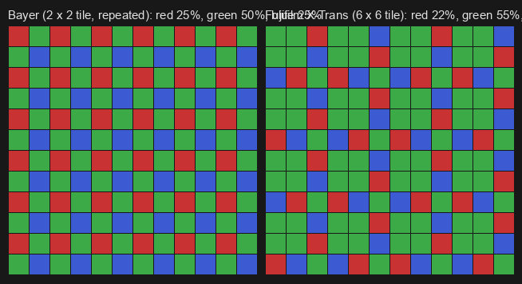
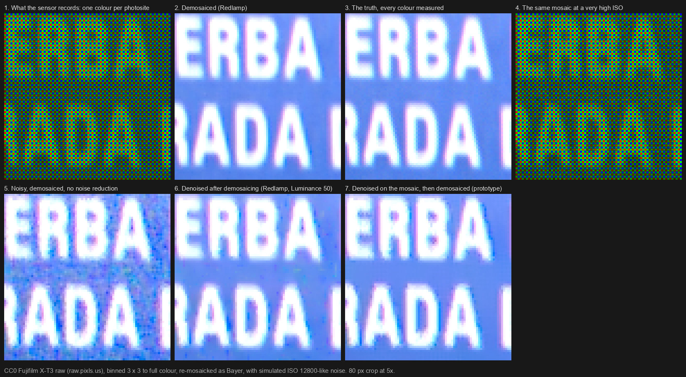
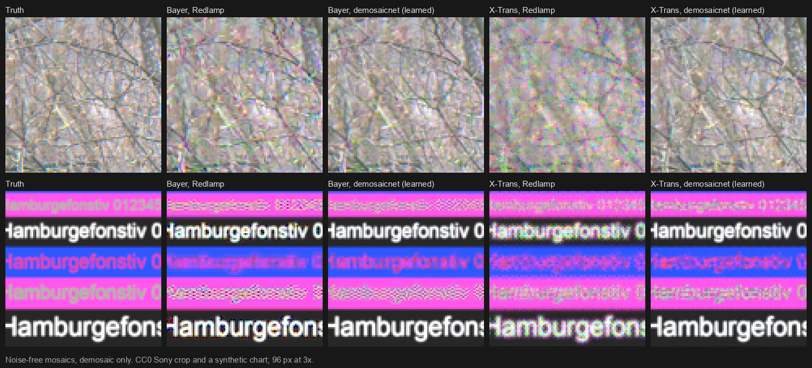
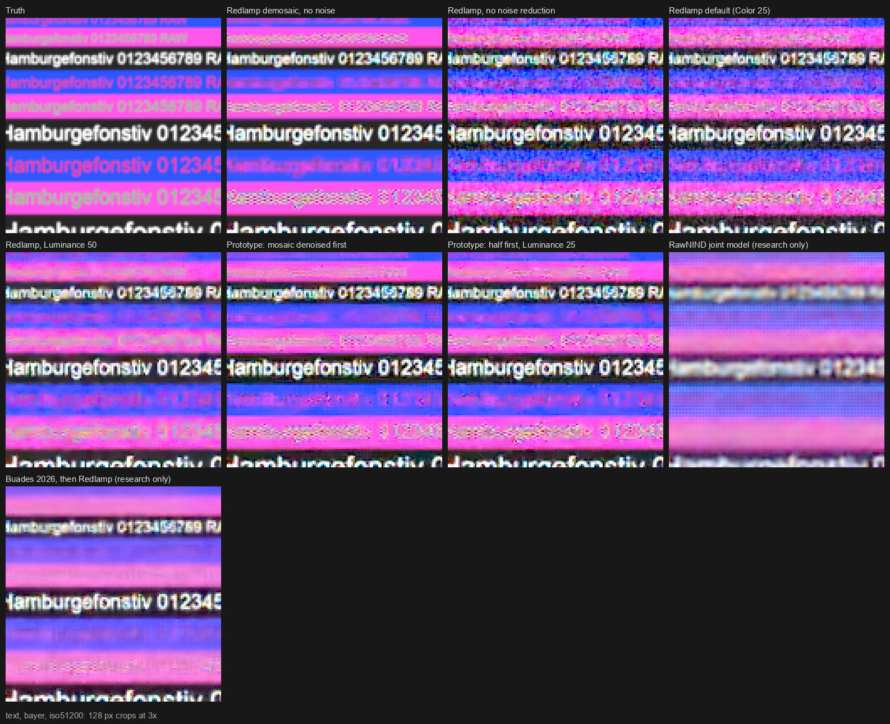
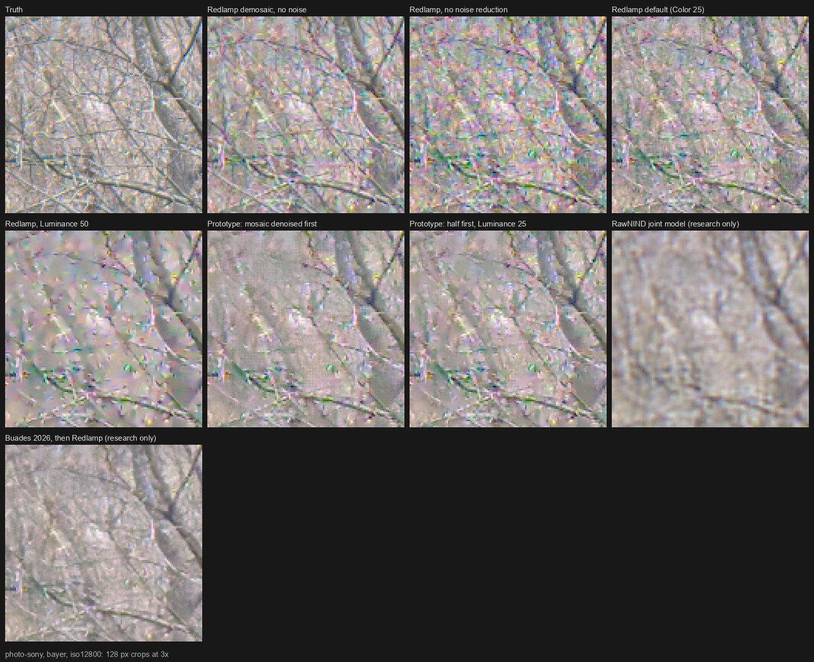

# DN-11: Lightroom's raw Denoise, joint demosaicing, and where Redlamp stands

**Date:** 7 October 2026. **Tracker:** DN-11. **Conventions:** [_conventions.md](_conventions.md): "Evidence" is sourced, "Assessment" is our judgement.
**Prompted by** a photographer's comment: "The biggest single reason to use Lightroom is their raw photo pre-demosaicing noise reduction. Nothing compares. It essentially makes almost any photo usable, and as a side effect increases real detail as if it were a higher resolution sensor."
**Builds on** [A-denoise.md](A-denoise.md) (raw denoise models, noise modelling, training data, integration) and [F-other.md](F-other.md) §6 (ML demosaic), and links to them rather than repeating them.
**Measurements:** [research/prototypes/raw_denoise](../../../research/prototypes/raw_denoise/README.md); nothing downloaded is committed.

## 0. Summary

- **What Lightroom does.** Denoise (April 2023) is one neural network that takes the noisy Bayer or X-Trans mosaic and produces a clean full-colour image: Adobe's models "perform both demosaicing and denoising in a single step", trained on "millions of pairs" of noisy and clean raw patches, a noise simulation and a large set of lens-cap dark frames. It includes Raw Details (2019), Adobe's learned demosaic. **Since June 2025 it is a cached, versioned Detail-panel edit, not a separate DNG**, and since October 2024 it also takes linear DNGs (ProRAW, Expert RAW, Pixel, HDR and panorama merges). Adobe has published no architecture, paper or measurement of it (§2).
- **"More real detail, as if from a higher-resolution sensor."** The effect photographers see is real, but it is not more resolution. No published measurement shows Denoise raising resolution. Jim Kasson's slanted-edge test of Adobe's learned demosaic found sharpness "essentially the same", with fewer false colours and more legible fine text (§2.5). This study measured the same thing: on a clean slanted edge Redlamp's Bayer demosaic already reaches the lens's limit, and a learned demosaic matches it rather than beating it, while halving false colour and recovering fine colour detail Redlamp loses (4.5 dB better on photos). Removing noise without smearing keeps texture that older noise reduction erased. A single frame cannot exceed the sensor's sampling; anything finer is the network's guess.
- **What Redlamp does today.** Its noise reduction is classical and runs after demosaicing (DN-02, done), with per-photo noise models (DN-01, DN-10). On the mosaic it only repairs hot photosites and removes banding. Its Bayer demosaic is Menon (2007), its X-Trans demosaic a generic interpolation. The AI raw denoiser that would match Lightroom (DN-06 to DN-09) hasn't started (§4).
- **How it compares, measured** (§5; synthetic scenes with exact truth and real RawNIND pairs, through Redlamp's real pipeline):
  - **X-Trans is the largest gap.** Redlamp's X-Trans interpolation keeps half the resolution of a clean edge (MTF50 0.185 against the lens's 0.347 cycles per pixel) with 12 times Bayer's false colour. A learned X-Trans demosaic doubles the resolution and scores 6 dB higher on photos.
  - **Learned denoising on the mosaic is 2 to 3 dB better than Redlamp's best setting** on real noise at the highest ISO (Buades 2026, a raw-to-raw network, then Redlamp's demosaic: +3.3 dB on scenes it never saw; RawNIND's joint model: +2.0 dB).
  - **Classical denoising on the mosaic, before Redlamp's demosaic, gains 0.4 to 1.2 dB**, and far more on fine text and colour noise (up to 5.8 dB and a third of the chroma noise at the highest level). The literature attributes gains like these to splitting denoising across the demosaic, not to the order itself (§3.2).
  - **Deep shadows at very high ISO are lifted and tinted** by the clamp at black in Redlamp's normalisation (red +39%, blue +27% on a dark patch); denoising before the clamp removes the cast.
- **Recommendations** (§6; all Proposed rows for the owner):
  1. **Now, classical:** prioritise a Markesteijn-class X-Trans demosaic (CAM-07); keep below-black values until after noise reduction (DN-12); add a noise-scaled clean-up of the mosaic before demosaicing (DN-13). Together these close part of the gap in Phase 2, without a model or a budget.
  2. **Next, the AI route:** make the planned raw network a **joint demosaic and denoise** model for Bayer and X-Trans (DEC-36), which also delivers Raw Details. Train its demosaic on full-colour ground truth from binned CC0 raws and pixel-shift captures (DN-14), which needs no new licence decisions.
  3. **Exceed Lightroom where it is weak:** a joint X-Trans model (nobody ships one), a live Amount on the cached result, an evictable cache rather than catalog bloat, a fidelity guard with a hallucination panel, and FP16 safety on the Neural Engine from day one.

## 1. What demosaicing and pre-demosaic noise reduction are

**What a raw file holds.** A sensor is a grid of photosites, each counting the light that reaches it, and none can tell colours apart. A colour filter array over the sensor gives each photosite one colour: red, green or blue. Most cameras use the Bayer pattern (US 3,971,065, 1976), a 2 × 2 tile with two greens, one red and one blue, so half the photosites see green and a quarter each see red and blue. Fujifilm's X-Trans repeats a less regular 6 × 6 tile with 20 greens, 8 reds and 8 blues, meant to reduce moiré without an optical low-pass filter. Many phone sensors use Quad Bayer, a Bayer pattern of 2 × 2 blocks of one colour. A raw file stores one number per photosite: a 24-megapixel raw holds 24 million single-colour samples, and the photo made from it has 72 million values, so two-thirds of them were never measured.

**Demosaicing** estimates the two missing colours at every photosite from its neighbours. Averaging same-colour neighbours (bilinear interpolation) blurs edges and leaves coloured fringes ("zippering") and false colour wherever detail is finer than a colour's own sampling. Better demosaicers decide which way an edge runs and interpolate along it, and use the fact that the colour channels of natural images vary together, so their differences are smoother than the channels themselves. Redlamp's Bayer demosaic is one of these (Menon, Andriani & Calvagno 2007, CAM-05); in flat areas it falls back to the plain average, so noise doesn't steer its direction choices (CAM-06).

**Noise.** Light arrives as photons, so even a perfect sensor counts with a random error that grows as the square root of the signal (shot noise); the electronics add a roughly constant error (read noise). Raising the ISO amplifies the signal, not the light, so at high ISO each photosite carries a larger relative error. On the mosaic this noise is in its simplest form: each photosite's error is independent of its neighbours', and its size follows from the brightness by the Poisson–Gaussian model (variance = a · signal + b) that Redlamp measures for every photo (DN-01, DN-10).

**Why noise and demosaicing interfere.** A demosaicer can't tell noise from detail. It reads noise as tiny edges and picks directions from it, which leaves maze-like patterns (the "worms" X-Trans users report), and it spreads each photosite's error into the colours it fills in next door. After demosaicing, noise is no longer independent from pixel to pixel: it is clumped, coloured and correlated between channels, and it looks more like texture, which makes it harder to separate from real detail later.

**Pre-demosaic and joint noise reduction.** Noise reduction "before demosaicing" works on the mosaic itself, where noise is simplest, so the demosaicer then makes its decisions on clean data. Adobe's Denoise goes one step further: one neural network takes the noisy mosaic and produces a clean full-colour image. A joint model learns both what real texture looks like and how a demosaicer goes wrong, so it can do better than either step alone. Whether the order matters by itself is a separate question, which the literature (§3.2) and this study's measurements (§5.3) answer.

**What "more real detail" can and can't mean.** Two effects are real:
- A better demosaic recovers detail a weaker one loses or garbles: Redlamp's X-Trans interpolation keeps half the resolution its Bayer demosaic does through the same lens (§5.2). Adobe's Raw Details (2019) was this step alone, and Denoise includes it.
- Removing noise without smearing reveals faint detail the noise was hiding.

Neither adds information the photosites didn't record. Detail finer than the sampling is either lost or aliased, and a model that draws it in is guessing from what it learned. Genuinely higher resolution needs more samples: pixel-shift captures, or bursts with hand shake (§3.4).

The figure shows the stages on a CC0 raw: what the sensor records, the demosaiced image, the same mosaic at a high ISO, and the two orders of noise reduction.

## 2. What Lightroom does, and what is published about it

Sources were read on 7 October 2026. Adobe's blog was fetched directly; Adobe's help pages refuse automated requests, so they were read from Internet Archive snapshots of August to October 2026. **[A]** is Adobe, **[A-staff]** an Adobe employee's forum post, **[LRQ]** The Lightroom Queen (Victoria Bampton's release tracking), **[I]** an independent measurement, **[P]** the press.

### 2.1 Three Enhance features from one team

- **Enhance Details, later Raw Details (February 2019)** [A]: "approaches demosaicing in a new way to better resolve fine details and fix issues like false colors and zippering … an extensively trained convolutional neural network"; "trained with over a billion examples"; "two models: one for the Bayer sensors, and another for the Fujifilm X-Trans sensors"; "up to 30% higher resolution on both Bayer and X-Trans raw files using Siemens Star resolution charts" (Adobe blog, 2019-02-12, https://blog.adobe.com/en/publish/2019/02/12/enhance-details). It wrote an `-Enhanced.dng`. DNG 1.5 added an "enhanced image data" directory (LinearRaw, NewSubFileType 16) with a proprietary `EnhanceParams` string for exactly this output (DNG Specification 1.7.1.0, pp. 17, 70).
- **Super Resolution (March 2021)** [A]: 2× upscaling trained on "millions of pairs of low-resolution and high-resolution image patches"; on raws "we train directly from the raw data … you're also getting the Enhance Details goodness as part of the deal" (Eric Chan, https://blog.adobe.com/en/publish/2021/03/10/from-the-acr-team-super-resolution). Built by Michaël Gharbi and Richard Zhang of Adobe Research.
- **Denoise (April 2023)** [A]: "our models are designed and trained to perform both demosaicing and denoising in a single step"; "millions of pairs of high-noise and low-noise image patches"; "an extensive noise simulation and data augmentation pipeline"; "a large data set of 'dark frames' which helps the model to understand and remove pattern noise in the shadows, especially in older cameras"; "we continued to train directly from the raw data … when you apply Denoise to a raw file, you're also getting Raw Details as part of the deal". The target was "clean, usable results for a 20 megapixel full-frame camera at ISO 51200". Built by Michaël Gharbi and Bo Sun; an Amount slider (default 50); the manual sliders set to zero; "a new raw file in the Digital Negative (DNG) format". Chan's outlook: "additional training data to improve resolution … combine Denoise with Super Resolution … not needing to make a new DNG file" (https://blog.adobe.com/en/publish/2023/04/18/denoise-demystified).

### 2.2 What changed from 2023 to 2026

- **No more separate DNG.** A Technology Preview in October 2024, then the default in June 2025 (Camera Raw 17.4, Lightroom Classic 14.4, Lightroom desktop): Denoise, Raw Details and Super Resolution became Detail-panel settings "instead of creating separate files for every enhancement" [A]. The generated pixels are stored in the catalog's `.lrcat-data`, the cloud, or `.acr` sidecars: about 5 MB extra for Denoise, 18 MB for Raw Details and 48 MB for Super Resolution on a 24 MB raw [LRQ]. Results are tied to a model version: an "AI Edit Status" button flags settings that "need to be updated", in a fixed order that puts "Denoise, Raw Details, Super Resolution" straight after HDR merge, and export warns about stale ones since April 2026 [A]. Since August 2025 changing Amount on a batch no longer recomputes, and Amount resets to its default when applied [A-staff] (Assessment: Amount is a blend after the network). Several help pages still describe the old DNG workflow.
- **Formats.** Since October 2024 Denoise also takes linear DNGs, including Adobe's own HDR and panorama merges, Apple ProRAW, Samsung Expert RAW, Google Pixel raws, linear and reduced-size raws from Canon, Nikon, Sony and Leica, monochrome raws and Smart Previews; never JPEG, TIFF, HEIC or other rendered files [A]. Raw Details is still Bayer and X-Trans only. Two Adobe pages disagree about Foveon, Sony ARQ and Pentax Pixel Shift files.
- **Not combined with Super Resolution.** Until at least August 2024 the two were exclusive; since June 2025 they sit in one stage of the order of operations, but nothing says they run as one model or can both be on [A, community].
- **Hardware.** Apple's Neural Engine was unused at launch, enabled in May 2024, disabled in October 2024 ("due to bugs in the engine that were causing quality issues" [LRQ]), and re-enabled in June 2026 with "updated Denoise models" [A-staff, A]. Requirements: 8 GB of GPU memory on Windows, 16 GB of unified memory on Macs [A]. darktable pins its raw denoise model to the CPU on Macs because its "intermediate activations overflow FP16 on Apple's ANE / GPU and produce NaN/Inf output" (darktable-ai model card). **Assessment:** raw denoisers are numerically fragile at FP16 on Apple's accelerators; Redlamp must test for it from the start.
- **Other:** "Improved Denoise quality for some Ricoh and Pentax cameras" (February 2026); background batch processing (April 2026); Denoise on M1-or-later iPads (August 2026), with nothing documented for iPhone or Android [A]. AI Sharpen ("powered by Topaz", June 2026) is a credit-metered generative step that writes a new image, separate from Enhance; nothing in Enhance changed after Adobe completed its acquisition of Topaz Labs on 2026-09-23 [A].
- **Known artefacts** (from Adobe's bug lists as tracked by [LRQ]): purple edges on some Fujifilm X-Trans files (2023, 2024), banding in brightened shadows, halos at clipped highlights in HDR merges, colour casts on panoramas. DPReview saw stair-stepping on fine grilles in both Adobe's and DxO's results (2023).

### 2.3 Research and patents behind it

Adobe has published no paper, architecture, parameter count or loss for any Enhance model. The 2016 joint demosaicking and denoising paper by Gharbi, Chaurasia, Paris and Durand (§3.3) is its ancestor in approach: mined hard patches, a raw-to-RGB network. Gharbi's later Adobe papers on raw noise and resolution are burst methods (basis prediction networks, CVPR 2020; self-supervised burst super-resolution, ICCV 2023), and his homepage now lists him at OpenAI. A patent search through Google Patents' query endpoint (detail pages were rate-blocked) found no Adobe filing on raw joint demosaicing and denoising or on enhanced-DNG generation. The one filing by both Denoise developers, US 2026/0080511 A1 (Bo Sun, Michael Gharbi, filed 2024-09-17), is an RGB denoiser trained with synthetic noise plus a discriminator on natural smartphone noise; it never mentions raw, mosaic or demosaicing. Adobe's other related filings are burst super-resolution (US 12,572,999 B2) and burst kernels (US 12,079,957 B2). **Assessment:** Adobe protects Enhance as a trade secret. Search terms for counsel are in the evidence file of this note's study (DEC-05).

Adobe Research's route to genuinely more resolution and less noise is multi-frame: Project Indigo "captured and merged 32 images … to reduce imaging noise" and uses "multi-frame super-r[esolution]" past 2× zoom (Levoy and Kainz, 2025-06-13, https://research.adobe.com/articles/indigo/indigo.html).

### 2.4 Comparable products in 2026

- **DxO DeepPRIME 3 and XD3:** learned demosaic and denoise for Bayer and X-Trans; DeepPRIME 3 adds chromatic-aberration correction in the same pass; XD3 is "built using a larger neural network" (dxo.com, archived 2026-08-27).
- **Topaz Photo, RAW Denoise:** Bayer only ("not needed for X trans sensors"), writes DNG ([H1-topaz-teardown.md](H1-topaz-teardown.md) §1.5).
- **darktable 5.x neural restore:** Bayer "denoised directly on the CFA mosaic, with denoise and demosaic combined into a single inference pass"; X-Trans demosaicked first, then denoised in linear Rec. 2020; a strength blend; models from RawNIND (GPL-3.0 weights). Measured here: the shipped Bayer model works at half resolution and is soft (§5.3).
- **Capture One 16.8 (May 2026), Enhanced Denoise:** "calculated once per image in the background and reused across all variants", a sidecar file, an Impact slider for "how much luminance noise is blended back"; "works with Bayer-pattern RAW files only", X-Trans "is planned" (support.captureone.com). It doesn't say whether it is learned.
- **Apple:** Pixelmator Pro's "Intelligent Denoise" (no details); Core Image's `CIRAWFilter` has classical noise sliders only.

### 2.5 The claim, against the evidence

- **For:** Adobe's "up to 30% higher resolution" (Siemens stars, 2019). DxO markets "the equivalent of an extra two stops of ISO of detail; with DeepPRIME XD3, it can be three stops".
- **Against, or qualifying it:**
  - Jim Kasson measured Enhance Details on a backlit razor-blade slanted edge: "Essentially the same" as Adobe's normal demosaic, with default sharpening, without it and on a softer target; "It may well be that the improvement in resolution is entirely due to the suppression of artifacts"; on text, "somewhat more readable … I think the better name for it would be 'Fix Demosaicing Errors'" [I] (blog.kasson.com, 2019-02-15 and 2019-02-17, read through the Archive).
  - DPReview on Super Resolution: "this feature isn't magic. Modern, high-resolution bodies with quality lenses will beat the algorithm anywhere you look" [P] (2021-04-13).
  - DPReview comparing Denoise with DxO DeepPRIME XD: where DxO looked more detailed, "most of the time, it doesn't have more detail, just the feeling of more detail thanks to greater sharpness" [P] (2023-06-21).
- No MTF, slanted-edge or noise measurement of Denoise itself was found.

**Assessment.** "Makes almost any photo usable" fits Adobe's ISO 51200 target and the press tests. "Increases real detail" is true in the sense of "loses less than the alternatives": a joint model avoids the false colour, zippering and smearing of a classical demosaic followed by classical noise reduction, so texture survives at high ISO where Lightroom's old sliders erased it. "As if it were a higher resolution sensor" is not supported; this study's measurements (§5.2) agree with Kasson's.

## 3. The research literature

Papers were read in full where arXiv, CVF, IPOL or open-access copies exist; for IEEE and SPIE papers that couldn't be opened, abstracts and other papers' tables were used. The raw denoiser survey, noise models and denoising datasets are in [A-denoise.md](A-denoise.md) §4–6 and aren't repeated.

### 3.1 Demosaicing

- **Why Bayer can resolve neutral detail but not colour.** Alleysson, Süsstrunk & Hérault (IEEE TIP 14(4), 2005, DOI 10.1109/TIP.2004.841200) model a mosaic as full-resolution luminance plus subsampled opponent colours modulated to the corners of the spectrum: "visual artifacts after demosaicing are due to aliasing between luminance and chrominance". Luminance can approach the sensor's Nyquist frequency; chrominance must stay below about a quarter of the sampling rate or it aliases into zippers, mazes and false colour. Bayer's patent (US 3,971,065, 1976) put green "at every other array position" for this reason.
- **Classical methods**, in order: bilinear; Hamilton & Adams (US 5,629,734, gradient-directed, expired); Kimmel 1999; Gunturk et al. 2002 (alternating projections); Malvar, He & Cutler 2004 (fixed 5 × 5 filters, "over 5.5 dB" over bilinear); Zhang & Wu 2005 (directional LMMSE); Hirakawa & Parks 2005 (AHD); Menon, Andriani & Calvagno 2007 (DOI 10.1109/TIP.2006.884928, Redlamp's); residual interpolation (Kiku et al. 2013, MLRI 2014, ARI by Monno et al. 2015 and 2017). Surveys: Gunturk et al. 2005 (DOI 10.1109/MSP.2005.1407714), Li, Gunturk & Zhang 2008 (DOI 10.1117/12.766768), Menon & Calvagno 2011.
- **How they score** (noise-free, sRGB test images re-mosaicked; colour PSNR). Under one protocol (Monno et al., Sensors 2017, DOI 10.3390/s17122787): Menon 34.27 dB on McMaster's saturated images and 40.72 on Kodak; ARI 37.60 and 41.47. Learned demosaics reach about 39–40 dB on McMaster and 42–43 on Kodak (Gharbi 2016; Kokkinos & Lefkimmiatis 2019; RSTCANet 2022). On Gharbi's mined hard patches the best classical methods score 30.8 (luminance artefacts) and 34.9 dB (moiré) against 34.3 and 37.0 for his network. Adobe Camera Raw 9's demosaic scored 32.2 dB on McMaster in Gharbi's table, level with bilinear. **Assessment:** Menon is 3 dB behind the best classical method and about 5 dB behind networks on saturated colour, and 1–2 dB on mostly grey images.
- **How much resolution, measured.** No paper states what fraction of Nyquist practical demosaics reach. A slanted-edge simulation for this study (Assessment; 8× supersampled, box pixel, 4:1 edge, `colour-demosaicing` 0.2.7, BSD-3) found Menon at 100% of full-colour (pixel-shift-like) MTF50 on a neutral edge, 74–85% on an orange-to-teal edge, and every method at 42–64% on a red-to-blue edge with no green contrast; Redlamp's X-Trans interpolation at 44–63% on the neutral edge. That agrees with this study's harness (§5.2). Imatest finds slanted-edge and dead-leaves MTF diverge above 0.3 cycles per pixel on a Panasonic raw, and agree on an undemosaiced plane: "discrepancies … are primarily caused by demosaicing" (imatest.com).
- **X-Trans.** Fujifilm's rationale: a "low-periodic color filter array" with "RGB … on any horizontal or vertical line", for "high resolution by eliminating an optical low-pass filter" (fujifilm-x.com). Markesteijn's algorithm has no paper; it exists as code in dcraw and LibRaw (`xtrans_interpolate`, LGPL-2.1 or CDDL-1.0). Published X-Trans work is thin: Rafinazari & Dubois (ICIP 2014, DOI 10.1109/ICIP.2014.7025132), universal demosaicking (Zhang et al., TIP 2016), and learned results on the MSR set (Gharbi 39.7 dB linear, Kokkinos MMNet 40.6). Program-searched hybrid demosaics for Bayer and X-Trans report "1 dB–3 dB higher quality at the same cost" (Ma, Gharbi et al., TOG 2022, DOI 10.1145/3508461; code without a licence).

### 3.2 Noise and demosaicing: does the order matter?

- **Demosaicing correlates and colours noise.** After demosaicing, luminance noise variance rises by a factor of 1.8 to 2.4 (standard deviation 1.27–1.56×, depending on the demosaic), chroma noise becomes low-frequency, and inter-channel correlation rises to 0.4–0.9 (Jin, Facciolo & Morel, CVPRW 2020, arXiv 2004.11577). In low light "the demosaicing step … [is] the leading cause of visually objectionable random noise patterns (splotches)" (Chatterjee et al., CVPR 2011, DOI 10.1109/CVPR.2011.5995371).
- **Denoising on the mosaic:** Hirakawa & Parks 2006 (one filter for both tasks, DOI 10.1109/TIP.2006.875241), PCA-CFA (Zhang, Lukac, Wu & Zhang 2009, DOI 10.1109/TIP.2008.2011384), BM3D-CFA (Danielyan et al. 2009, same-phase block matching, the idea behind this study's prototype), Park et al. 2009 ("about a third" of the processing), Akiyama et al. 2015 (pseudo four-channel), Condat & Mosaddegh 2012, Jeon & Dubois 2013.
- **The order, measured.**
  - Jin, Facciolo & Morel 2020: demosaicing first, then denoising with the noise parameter raised to about 1.5 × the mosaic's (1.4–1.7 for all seven demosaics tested), beats BM3D-CFA followed by the same demosaic by 1.8 dB on Kodak and 0.1 dB on McMaster, averaged over six noise levels, and wins 39.64 to 38.19 dB on real SIDD raws. Without the raised noise level, demosaicing first is no better, which they suggest is why the field long believed the opposite.
  - Guo, Jin, Morel & Facciolo (IPI 2024, arXiv 2408.06684) optimise a pipeline with denoising on both sides: up to σ = 20 the optimum is demosaic-first; from σ = 40 a partial denoise of the mosaic adds 0.2–0.4 dB, and the share before the demosaic grows with the noise.
  - For video, splitting a patch-based denoiser between the two sides beats either alone by 0.5–2 dB, more than 1 dB from ISO 6400; "denoising purely before demosaicking … leaves checkerboard artifacts, while doing so purely after … leaves spatially correlated residual noise" (Sánchez-Beeckman, Buades et al. 2024, arXiv 2410.02572).
  - Learned: separately trained networks prefer denoising first by 2.8 dB, but inside one end-to-end network the order changes results by under 1 dB (TENet, Qian et al., arXiv 1905.02538). On real raw pairs a joint Bayer-input network matches a demosaic-then-denoise network at a quarter of the compute (RawNIND, arXiv 2501.08924). Training a demosaic network first, then the denoiser, matches end-to-end training, which failed in 8 of 10 runs (Guo et al. 2023, arXiv 2009.06205).
- **Assessment.** Denoising before demosaicing is not better in itself. A classical pipeline that knows how demosaicing changes the noise (as Redlamp's does: DN-02 measures each scale's noise through the real demosaic) is a strong baseline; at high noise, taking part of the noise out on the mosaic adds a little. A joint network's advantage over a well-matched classical chain is small on PSNR (Gharbi's 29.95 against 29.98 dB on Kodak at σ = 20), and it loses when its noise model is wrong (38.54 against 39.64 on SIDD); its real gains are robustness on hard patches, one pass, and compute. This study's prototype gains (§5.3) are of the size the split-pipeline papers report.

### 3.3 Learned joint demosaicing and denoising

| Work | What it showed | Code, weights, data |
| --- | --- | --- |
| Khashabi et al. 2014 (TIP, DOI 10.1109/TIP.2014.2359774) | Learned random fields; the MSR demosaicing dataset (Bayer and X-Trans, linear) | MSR data non-commercial only |
| Klatzer et al. 2016 (ICCP) | Learned energy minimisation for any CFA layout | — |
| Gharbi, Chaurasia, Paris & Durand 2016 (SIGGRAPH Asia, DOI 10.1145/2980179.2982399) | A 15-layer CNN with the noise level as input; hard-patch mining (2.6 million 128² patches from 4×-downsampled web images); Bayer and X-Trans | MIT code and weights; training data of unknown terms. Ancestor of Adobe's approach |
| Henz, Gastal & Oliveira 2018 | Learns the CFA and the demosaic together | — |
| Kokkinos & Lefkimmiatis 2018, 2019 (arXiv 1803.05215, 1807.06403) | Iterative JDD around a residual denoiser; MSR noisy 40.1 dB against Gharbi's 38.6; X-Trans 40.6 | MIT code; weights from MSR (research only) |
| Ehret et al. 2019 (ICCV, arXiv 1905.05092) | Mosaic-to-mosaic: learns demosaicing from pairs of raw frames with no RGB ground truth (41.3 against 41.2 dB with it), and fine-tunes on one burst | AGPL code (idea usable) |
| Qian et al., TENet (ICCP 2022, arXiv 1905.02538) | The pipeline-order study above; PixelShift200 (Sony α7R III 4-shot pixel shift) as full-colour ground truth reduces moiré and colour artefacts against DIV2K training | MIT code, no weights; dataset without a licence |
| Liu et al. 2020, SGNet (CVPR) | Green-first guidance | No licence; built on non-commercial code |
| Xing & Egiazarian 2021 (CVPR) | Joint demosaic, denoise and 2× super-resolution | No licence |
| Sharif et al. 2021 (arXiv 2104.09398); Zeng et al. 2023; Tedla et al. 2025 (arXiv 2504.07145) | Quad Bayer; one network for Bayer, Quad and Nona with a pattern embedding; a Sony pixel-shift hard-demosaicing set | Tedla's code CC BY-NC-SA |
| Brummer & De Vleeschouwer 2025, RawNIND (arXiv 2501.08924) | Real noisy/clean raw pairs from 11 cameras including 668 X-Trans; Bayer-input and linear models of equal quality | GPL code; weights GPL and CC BY 4.0; data CC BY-SA 4.0 |
| Ma, Gharbi et al. 2022 (TOG) | Program-searched fast demosaics, Bayer and X-Trans | No licence (method only) |
| 2025–2026: DFENet (arXiv 2503.15800), JD3Net (arXiv 2601.00703), structural guidance (arXiv 2608.09995), SegDem (arXiv 2608.07916) | +0.6 to +3.8 dB on synthetic sets; SegDem warns generative models "may hallucinate details unsupported by RAW measurements" | DFENet MIT; the others without code or licence |

Challenges: MIPI 2022–2024 (Quad Bayer remosaic, RGBW, few-shot raw denoising), NTIRE 2024–2025 raw super-resolution and restoration (built on MIT-Adobe FiveK, non-commercial), AIM 2025 real-world raw denoising; none on raw demosaicing or JDD in 2026. No learned X-Trans JDD since 2022 beyond Ma et al. and the unified-CFA papers, which cover Bayer-family layouts only.

### 3.4 What genuinely adds resolution

- **A single frame can't exceed its sampling.** Content above Nyquist aliases and can't be separated linearly; resolving power falls with SNR (Wronski et al., SIGGRAPH 2019, arXiv 1905.03277). Denoising adds no information; it can make existing low-contrast detail visible and avoid noise-driven demosaic errors.
- **More samples do:** handheld multi-frame super-resolution replaces demosaicing with a burst merge (Wronski et al.: 42.86 / 41.26 dB on synthetic Kodak / McMaster bursts against 39.67 / 37.58 for Gharbi's single-frame network; real gains up to about 2×); deep burst super-resolution (Bhat et al., CVPR 2021, arXiv 2101.10997); camera pixel-shift modes (Sony 4- and 16-shot, Pentax, Olympus, Panasonic, Nikon, Fujifilm's Pixel Shift Multi Shot). Beyond 2× "the problem is more ill-posed and requires image priors" (Lafenetre, Facciolo & Eboli, IPOL 2023, DOI 10.5201/ipol.2023.460). Raw input helps single-frame super-resolution by 2.9–4.5 dB over 8-bit input (Zhang et al., CVPR 2019, arXiv 1905.05169).
- **Measured detail can mislead.** Dead-leaves texture MTF is penalised by noise reduction (McElvain et al. 2010, DOI 10.1117/12.838698); the plain power-spectrum method is biased by noise and artefacts (Kirk et al. 2014, DOI 10.1117/12.2039689); sharpening inflates it (Artmann 2015, DOI 10.1117/12.2079609); and a network trained with dead leaves scores better on dead leaves "without impairing fidelity" (Achddou, Gousseau & Ladjal 2023, arXiv 2404.07212). Edge-preserving noise reduction makes slanted-edge MTF look better than texture (Imatest). **Assessment:** report edge MTF, texture and fidelity separately, keep charts out of training, and include a hallucination panel.

### 3.5 Training data a joint model can use

- **Pixel shift as full-colour truth:** full colour at the same pitch (so still aliased above Nyquist; average 2 × 2 or reject aliased crops); static scenes only, with "a faint grid pattern" if anything moves (Sony); PixelShift200 and Tedla et al.'s set are the published examples, neither with clear terms. Our own captures are the clean route.
- **Binned or downsampled truth:** Gharbi downsampled web images 4×; MSR provides downscaled linear raws. Pitfalls: sRGB sources carry an ISP's processing; downsampled images are crisper at their new Nyquist than real sensor images, a domain gap and a hallucination risk; binning gives the colours sub-pixel offsets. Binning linear CC0 raws, as this study did, is licence-clean.
- **Synthetic images:** VibrantLeaves (Achddou et al., arXiv 2504.10201, MIT generator) comes within 0.72 dB of natural-image training for denoising; unmeasured for demosaicing.
- **Licences** (from each repository and dataset page, 7 October 2026): usable for evaluation are demosaicnet and its Caffe noise-aware model (MIT), Kokkinos' code (MIT; weights research only), TENet and DFENet code (MIT), `colour-demosaicing` (BSD-3), LibRaw's Markesteijn (LGPL-2.1 or CDDL-1.0), an IPOL burst super-resolution implementation (MIT; patent status unverified). Avoid: mosaic-to-mosaic (AGPL), RawNIND's code (GPL), Samsung's unified demosaicing and deep burst super-resolution (CC BY-NC-SA), zoom-learn-zoom (CC BY-NC), and every repository with no licence (SGNet, JDNDMSR, RSTCANet, BJDD, JD3Net, BSRAW, RawSR, the program search). Datasets: MSR is non-commercial only; PixelShift200, Gharbi's set, Kodak, McMaster and the pixel-shift hard set state no clear terms; raw.pixls.us CC0 and our own captures are usable.

## 4. Redlamp today, against Lightroom

| | Lightroom (October 2026) | Redlamp (main, 7 October 2026) |
| --- | --- | --- |
| Noise on the mosaic | Denoise: one learned network, demosaic and denoise together | Hot photosites repaired and banding subtracted (DN-03); no noise reduction (`docs/raw-pipeline.md` §8) |
| Demosaic | Raw Details (learned), inside Denoise; Adobe's classical demosaic otherwise | Bayer: Menon 2007 with a flat-area blend (CAM-05, CAM-06); X-Trans: a generic 5 × 5 interpolation (`rl_demosaic_generic`; Markesteijn-class is CAM-07, not started) |
| Noise reduction after demosaicing | The manual sliders, unchanged in about ten years by Adobe's account; set to zero by Denoise | NR v1 behind Lightroom's six sliders (DN-02): wavelet shrinkage in a noise-stabilised opponent space, luma-guided chroma, non-local means at 1:1 and in exports; 9–10 ms per slider drag at 1:1 |
| Noise model | Not disclosed (noise simulation and dark frames in training) | Per photo: the DNG NoiseProfile, a calibrated camera profile, or a blind estimate (DN-01, DN-10) |
| Sharpening | Separate; AI Sharpen (Topaz, credits) on Lightroom desktop | Noise-aware deconvolution that leaves noise alone (SHP-01) |
| Local control | Masks' Noise slider (manual noise reduction) | Masks' Noise slider (`local.noise`) |
| Formats | Bayer, X-Trans, linear DNG (ProRAW, Expert RAW, Pixel, HDR and panorama merges), sRAW/mRAW | All of these through NR v1; linear DNGs have no highlight headroom |
| AI denoise | Shipping; cached, versioned, non-destructive since June 2025; Neural Engine since June 2026 | Planned for Phase 3 (DN-06 to DN-09), not started; waiting on the capture programme and budget (DN-05, DEC-12) and on the data-licence decision (DEC-03) |
| Super resolution | 2×, raw-trained, includes Raw Details | Planned for Phase 4 (SR-01, SR-02) |

## 5. Measurements

### 5.1 Method

Everything ran on the M1 Ultra on 7 October 2026 while other sessions were building (load averages of 30 to 240), so no time here is a performance figure.

- **Test set with exact truth** (`make_testset.py`). Five charts rendered at 4× and box-filtered to the pixel grid after a Gaussian lens blur of 0.45 px: a slanted edge, a Siemens star, a zone plate reaching Nyquist, dead leaves (texture at every scale), and text in neutral and coloured pairs with flat and dark patches. Four photo crops from CC0 base-ISO raws in `tests/fixtures/raw` (Sony A7 III, Nikon Z 6, Canon EOS R6, Fujifilm X-T3), binned 2 × 2 (Bayer) or 3 × 3 (X-Trans) so every pixel has measured red, green and blue and no demosaic is involved. Each scene is mosaicked through Bayer and X-Trans with a daylight white balance removed, and given exact Poisson–Gaussian noise at three levels in normalised raw units: (a, b) = (6.4e-4, 1e-6), (2.56e-3, 1.6e-5) and (1.02e-2, 1.5e-4), labelled ISO 3200-, 12800- and 51200-like.
- **Real noise** (`fetch_rawnind.py`, `real_pairs.py`). RawNIND (Brummer & De Vleeschouwer, arXiv 2501.08924; Dataverse doi:10.14428/DVN/DEQCIM, CC BY-SA 4.0, used for evaluation only; DEC-03 still governs training): 7 Bayer scenes (Canon and Sony, ISO 6400 to 64000) and 5 X-Trans scenes (ISO 1600 to 6400), each against its tripod clean frame. A 768 px window is cropped from both, the noisy frame's exposure is matched per colour, and its Poisson–Gaussian profile is fitted from the difference, as a calibrated profile would give it. Two pairs were left out because their frames moved. Three Bayer scenes are in neither learned model's training data (RawNIND's `TEST_` scenes, less the one Buades trained on).
- **Redlamp through its real pipeline.** A Swift Testing harness (`harness/RawDenoiseHarnessTests.swift`, copied into the engine's test target in a throwaway worktree of `main` at 0872fef) sends each mosaic through `SessionBuilder` (normalisation, hot photosites, highlights, Menon with the dual blend, or the generic X-Trans interpolation) and `DetailStage` at full resolution, where non-local means joins the wavelet pass.
- **Pre-demosaic prototype** (`prototype.py`). Non-local means on the mosaic (Buades, Coll & Morel 2005), comparing a photosite's 5 × 5 (Bayer) or 7 × 7 (X-Trans) patch only with patches at offsets that keep the CFA phase (80 offsets for Bayer, 24 for X-Trans; the idea behind BM3D-CFA), with distances normalised by the predicted Poisson–Gaussian variance and averaging in linear raw units. Two variants: all of it, then Redlamp with Color 25; or half the noise removed, then Redlamp with Luminance 25. Redlamp is told the residual noise, measured against the clean mosaic (a product would predict it). A variant that only chooses the demosaic's directions on a denoised copy was not built: it needs Menon reimplemented outside the GPU code.
- **Open models** (`run_models.py`, §5.6), each with its own input conventions: RawNIND's joint Bayer model and its linear model (darktable-ai's ONNX export), Gharbi et al.'s noise-aware joint Bayer model (ported from its Caffe release) and its noise-free Bayer and X-Trans demosaics (demosaicnet), Sánchez-Beeckman & Buades 2026 and PMRID (raw to raw, then Redlamp's demosaic).
- **Scores** (`score.py`, `analyze.py`): colour PSNR and luma SSIM in a square-root encoding (as `NoiseBenchmarkTests` uses), texture kept (the share of the truth's 3 × 3 high-pass that survives), slanted-edge MTF50 (ISO 12233-style), false colour on the zone plate between 0.25 and 0.5 cycles per pixel, flat-patch noise and its coarseness, and the colour cast of a dark patch. Real pairs are scored at full resolution against the clean frame through Redlamp's own demosaic, and binned to full colour against the binned clean frame, which is fair to every demosaic but blind to the finest detail.

### 5.2 Demosaicing alone: the "Raw Details" question

Noise-free mosaics, demosaic only. Photo values are the mean of the four photo crops and dead leaves.

| CFA | Demosaic | Edge MTF50 (cycles/px) | MTF at Nyquist | Zone false colour | Photo colour PSNR | Texture kept | Text PSNR |
| --- | --- | --- | --- | --- | --- | --- | --- |
| — | Truth (lens and pixel aperture) | 0.347 | | 0 | | 1 | |
| Bayer | Redlamp (Menon, dual blend) | 0.353 | 0.248 | 0.0072 | 38.74 dB | 0.88 | 34.36 dB |
| Bayer | demosaicnet (learned) | 0.345 | 0.231 | 0.0039 | 43.20 dB | 0.90 | 38.75 dB |
| X-Trans | Redlamp (generic interpolation) | 0.185 | 0.063 | 0.0837 | 35.50 dB | 0.49 | 32.55 dB |
| X-Trans | demosaicnet (learned) | 0.344 | 0.239 | 0.0086 | 41.45 dB | 0.91 | 39.08 dB |

**Assessment.**
- On Bayer, a neutral edge is already resolved to the lens's limit by Redlamp's demosaic; a learned demosaic doesn't add sharpness there, exactly as Kasson found for Adobe's. Its gains are in colour: half the false colour, coloured text and fine colour detail that Menon smears (4.4 to 4.5 dB). That is what "Fix Demosaicing Errors" means in numbers.
- On X-Trans the gap is resolution itself: the generic interpolation loses half of it, and false colour is ten times the learned demosaic's. For Fujifilm users this matters more than noise reduction, and a classical Markesteijn-class demosaic (CAM-07) should recover much of it; this study didn't measure one.

### 5.3 Noise reduction, synthetic noise

Colour PSNR (dB) and texture kept, mean of the four photo crops and dead leaves:

| Method | Bayer ISO 3200-like | 12800-like | 51200-like | X-Trans 3200-like | 12800-like | 51200-like |
| --- | --- | --- | --- | --- | --- | --- |
| Redlamp, noise-free mosaic (its ceiling) | 38.74 / 0.88 | | | 35.50 / 0.49 | | |
| Redlamp default (Color 25) | 34.81 / 0.89 | 31.01 / 0.85 | 26.08 / 0.80 | 34.28 / 0.50 | 31.87 / 0.51 | 27.78 / 0.51 |
| Redlamp, Luminance 25 | 35.52 / 0.86 | 32.77 / 0.75 | 29.35 / 0.60 | 34.44 / 0.49 | 32.45 / 0.47 | 29.11 / 0.44 |
| Redlamp, Luminance 50 | 35.69 / 0.74 | 33.24 / 0.57 | 30.02 / 0.36 | 34.29 / 0.43 | 32.52 / 0.36 | 29.55 / 0.28 |
| Mosaic prototype, then Color 25 | 35.94 / 0.79 | 33.68 / 0.63 | 31.06 / 0.44 | 34.34 / 0.45 | 32.70 / 0.38 | 30.25 / 0.28 |
| Half mosaic prototype, then Luminance 25 | 36.03 / 0.82 | 33.78 / 0.68 | 30.99 / 0.51 | 34.57 / 0.46 | 33.11 / 0.42 | 30.67 / 0.34 |
| Gharbi 2016 joint, noise-aware | 37.76 / 0.77 | 34.74 / 0.64 | 29.63 / 0.49 | | | |
| RawNIND joint (darktable's model) | 34.02 / 0.32 | 33.03 / 0.29 | 31.29 / 0.23 | | | |
| Buades 2026, then Redlamp's demosaic | 36.98 / 0.75 | 35.23 / 0.61 | 33.04 / 0.45 | | | |
| PMRID, then Redlamp's demosaic | 36.40 / 0.72 | 34.51 / 0.59 | 31.54 / 0.42 | | | |
| RawNIND linear, after Redlamp's demosaic | | | | 33.41 / 0.29 | 32.44 / 0.27 | 30.83 / 0.23 |

On the charts at the 12800-like level (Bayer, then X-Trans):

| Method | Text PSNR | Flat chroma noise | Zone false colour | Shadow colour cast |
| --- | --- | --- | --- | --- |
| Redlamp, Luminance 50 | 28.51 / 28.13 dB | 0.0094 / 0.0126 | 0.0212 / 0.0658 | 0.0030 / 0.0024 |
| Mosaic prototype, then Color 25 | 32.13 / 30.95 dB | 0.0031 / 0.0026 | 0.0111 / 0.0693 | 0.0005 / 0.0005 |
| Buades 2026, then Redlamp | 30.04 dB | 0.0004 | 0.0135 | 0.0006 |
| Gharbi 2016 joint | 30.17 dB | 0.0035 | 0.0118 | 0.0071 |

**Assessment.**
- **Taking part of the noise out on the mosaic helps Redlamp's pipeline.** Denoising the mosaic before Redlamp's demosaic beats Redlamp's best slider setting at every level: 0.3 to 1.0 dB on Bayer photos, 0.1 to 1.1 dB on X-Trans, 1.2 to 5.8 dB on text (rising with the noise), with a third of the chroma noise and half the zone-plate false colour on Bayer. The cost is a little edge sharpness (MTF50 0.334 against 0.362 at the 12800-like level) and coarser residual chroma grain; the half-strength variant keeps most of the gain and more texture. The literature (§3.2) says the order alone isn't the reason: denoising on both sides of the demosaic beats either side alone, by about the margins measured here. Part of the gain may also come from the non-local filter itself and from denoising before the clamp at black (§5.5), which this study doesn't separate; DN-13 should first compare the same filter placed after the demosaic.
- **Learned raw denoising is the larger step:** Buades 2026 is 1.3 to 3.0 dB above Redlamp's best on Bayer photos, and its flat patches are almost noise-free. Gharbi's 2016 joint model is best at low noise (its learned demosaic) but falls behind at the highest level, beyond the noise it was trained for. darktable's RawNIND model scores well on PSNR at high noise but keeps a quarter of the texture: it works at half resolution and upsamples (edge MTF50 0.17 to 0.18), so it is soft.
- **On X-Trans nothing open helps much.** The only open path, RawNIND's linear model after Redlamp's demosaic, is below the prototype, because the demosaic has already lost the detail.

### 5.4 Noise reduction, real noise (RawNIND)

Colour PSNR (dB) at full resolution / binned to full colour; Bayer at the highest ISO of each scene (51200 to 64000, or 12800 for the 7D):

| Method | Bayer, 3 scenes neither model trained on | Bayer, all 7 scenes | X-Trans, 5 scenes (ISO 6400) |
| --- | --- | --- | --- |
| Redlamp default (Color 25) | 27.68 / 30.01 | 27.48 / 29.93 | 36.88 / 37.60 |
| Redlamp, Luminance 50 | 32.20 / 31.92 | 31.89 / 31.89 | 38.51 / 37.77 |
| Mosaic prototype, then Color 25 | 33.38 / 32.86 | 32.81 / 32.58 | 38.78 / 37.38 |
| Half mosaic prototype, then Luminance 25 | 33.13 / 32.82 | 32.73 / 32.70 | 39.42 / 38.10 |
| Gharbi 2016 joint | 31.10 / 31.16 | 31.17 / 31.51 | |
| RawNIND joint (darktable's model) | 34.18 / 33.29 | 33.79 / 33.36 | |
| RawNIND linear, after Redlamp's demosaic | | | 38.14 / 37.82 |
| Buades 2026, then Redlamp's demosaic | 35.47 / 33.83 | 34.80 / 33.83 | |

At the lower ISO of each pair the order is the same, with smaller gaps (Buades +2.2 dB, the prototype +0.6 dB over Luminance 50 on held-out scenes).

**Assessment.** Real noise confirms the synthetic results: the classical prototype gains about 1 dB at the highest ISO, a learned raw denoiser about 3 dB. The default (Color 25 only) is far behind at these ISOs, as Lightroom's manual default would be: high-ISO photos need Luminance, which Redlamp leaves at 0 by default as Lightroom does.

### 5.5 Deep shadows and the clamp at black

Redlamp normalises the mosaic as `max((raw − black) / (white − black) × gain, 0)` (`rl_cfa_normalize`). At high ISO, a dark photosite's noise exceeds its signal, so the clamp cuts the negative half of its noise and raises its mean. On the text scene's dark patch (0.017 linear) at the 51200-like level, the clamp lifts red by 39%, blue by 27% and green by 10% (the white balance amplifies red and blue, which start lower in the raw), a magenta cast and lifted blacks that later noise reduction can't undo: Redlamp's cast there is 0.0235 (chroma, square-root encoding), against 0.0011 when the mosaic is denoised before the clamp. At the 12800-like level the lift is 4% and 2%. **Assessment:** keeping below-black values until after noise reduction is a small change with a visible effect in the deepest shadows of very high ISO photos; Adobe names "clean shadows" as a Denoise goal.

### 5.6 Licences of the open models

All were run for internal evaluation only; none can ship. Full evidence: the study's model notes ([models/README.md](../../../research/prototypes/raw_denoise/models/README.md)).

| Model | Code | Weights | Training data | Internal evaluation | Verdict |
| --- | --- | --- | --- | --- | --- |
| RawNIND joint and linear (darktable-ai ONNX) | GPL-3.0 | GPL-3.0; source checkpoints GPL-3.0 and CC BY 4.0 | RawNIND (CC BY-SA 4.0, four artwork scenes "fair-use / research purpose only"), raw.pixls.us files (CC0 and CC BY-NC-SA), the author's own photos (terms not stated) | Allowed (GPL-3.0 §2: "unlimited permission to run the unmodified Program") | Avoid (GPL form); research only |
| demosaicnet, Bayer and X-Trans; Gharbi's noise-aware Bayer | MIT | MIT | ImageNet and MirFlickr patches (non-commercial and mixed terms) | Allowed | Fine-tune only |
| Sánchez-Beeckman & Buades 2026 | MIT | Not stated (release asset) | 460 clean raws from SID, ELD, SIDD, RawNIND, Nikon, CRVD (mixed, partly no terms) | Allowed | Fine-tune only |
| PMRID | Apache-2.0 | Apache-2.0 | SID subset (no terms) | Allowed | Fine-tune only |
| Ruled out | TENet (no weights), SGNet (no licence, NC dependency), DualDn and Samsung's unified demosaicing (non-commercial), YOND (obfuscated x86 runtime), JDNDMSR, JDMDN-TwoStage, RSTCANet (no licence) | | | | |

No open model with usable terms does joint demosaicing and denoising on X-Trans.

### 5.7 Caveats

- Binned photo truth is clean but not perfect: 2 × 2 binning gives red, green and blue from slightly different positions, and at base ISO the crops still carry a little noise. Every method is scored against the same truth, and the charts have exact truth.
- demosaicnet was trained on downsampled photos, which resemble binned truth; its photo margin may be flattered. Its chart results (edge, zone plate, text) are not.
- Real pairs are scored against the clean frame through Redlamp's demosaic, which favours methods that use it; the binned scores remove that bias and give the same ranking.
- RawNIND's checkpoint trained on RawNIND's non-`TEST_` scenes, and Buades' on one `TEST_` scene; the held-out column accounts for both.
- Noise is Poisson–Gaussian only: no banding, fixed-pattern noise, or lossy-compression artefacts (DN-05's captures would add them).
- Redlamp's noise model was exact (synthetic) or fitted from the pair (real); a blind estimate would add error to every Redlamp and prototype result.

### 5.8 Found along the way

`DetailStageTests.makeSession` gives an X-Trans session four black levels, while `SessionBuilder` reads one per pattern position (36 for X-Trans), so `rl_cfa_normalize` reads past the buffer for most photosites. Its flat neutral scenes hide this, but the X-Trans run of `calibration matches the pipeline`, which measures `NoiseCalibration`'s X-Trans table, does so through undefined black levels. The harness here passes one per position. Reported to the noise workstream rather than changed here.

## 6. How Redlamp can match or exceed Lightroom

### 6.1 Now, classical (Phase 2; no model, no budget)

1. **X-Trans demosaic (CAM-07): move it up.** It is the largest measured gap (half the resolution, ten times the false colour) and affects every Fujifilm photo at every ISO. Markesteijn's 3-pass algorithm is usable from LibRaw under CDDL (counsel to confirm, as the row says).
2. **Keep below-black values until after noise reduction (DN-12).** Normalisation would clamp only after the detail stage; every stage between (hot photosites, highlights, demosaic, the noise-stabilising transform) must accept negative values. Fixes the lifted, tinted deep shadows at very high ISO (§5.5). A rendering change, so a new process version.
3. **A noise-scaled clean-up of the mosaic before demosaicing (DN-13).** First compare the same filter after the demosaic, to see how much of the gain is the placement (§5.3). Then the prototype's non-local means between same-phase patches, on the GPU, with strength set by the photo's noise model rather than by a slider, so it is cached with the demosaic and the Detail panel works on the residual (whose noise the session then knows). Measured gain: 0.4 to 1.2 dB on photos at high ISO, much more on text and colour noise; at most a stop or two of the gap to a learned model. Estimated cost at 24 MP: 20–60 ms once per open, comparable with the 1:1 non-local means pass scaled to the mosaic's size (estimate). A new process version.

### 6.2 Next, the AI route (Phase 3)

4. **A joint demosaic and denoise network (DEC-36).** The planned DN-07 model is raw-to-raw (denoised Bayer, then Redlamp's demosaic). The measurements say the demosaic is half the gain: a learned demosaic alone is worth 4.5 dB on Bayer photos and 6 dB on X-Trans, and a learned denoiser 2 to 3 dB at high ISO. Adobe, DxO and darktable (for Bayer) all do both in one network, and it would deliver Raw Details with it (the Lightroom comparison's "Later" row). Recommended: DN-07 outputs linear camera RGB from the mosaic, for Bayer and X-Trans, with a noise-free mode that is Raw Details. The raw-to-raw design's advantages (smaller output, the classical demosaic stays in charge) don't outweigh the measured gain.
5. **Ground truth for the demosaic (DN-14).** A joint model needs full-colour truth that no demosaic produced. Two sources need no new licence decision: binning clean CC0 raws to full colour, as this study did (raw.pixls.us has 1,870 CC0 files), and pixel-shift captures (Sony, Panasonic, Olympus, Pentax, Nikon Z 8 and Z f, Fujifilm) added to the capture programme (DN-05). Noise synthesis follows A-denoise §6.2.
6. **Numerics on Apple's accelerators.** Adobe withdrew Neural Engine inference for a year and darktable pins its raw model to the CPU because activations overflow FP16. The Core ML plan (A-denoise §7.5) should scale activations (a fix reported for the RawNIND model is dividing the final output by 16) and test FP16 against FP32 from the first prototype.
7. **The evaluation harness (DN-09)** can start from this study's: exact-truth charts, binned CC0 photos, RawNIND pairs, MTF50 and false colour reported apart from PSNR, and a hallucination panel (fine text, Siemens stars, repeating textures), so a "more detail" claim is measured rather than felt.

### 6.3 Where Redlamp can be better than Lightroom

- **Joint X-Trans.** Lightroom and DxO do it; Topaz, Capture One and darktable don't (darktable demosaics first). A Redlamp X-Trans joint model would be ahead of three of the five.
- **A live Amount.** Lightroom can't set Amount before the first run and resets it when applied. Redlamp's planned blend over the cached result (A-denoise §7.2) can be live and settable at any time.
- **Storage.** Lightroom keeps 5–48 MB of generated pixels per photo in the catalog or sidecars. Redlamp's plan keeps an evictable cache that recomputes, with the model version in the recipe.
- **Fidelity.** No generative steps in Denoise or Super Resolution, a fidelity guard (SR-03's consistency check applied to denoise too), and the hallucination panel in the tests.
- **Denoise with Super Resolution (SR-02).** Adobe announced the goal in 2023 and hasn't shipped it; one Redlamp raw network with a 2× head would do both in one pass.

### 6.4 Effort (estimates, engineer-weeks)

| Item | Phase | Effort |
| --- | --- | --- |
| CAM-07 X-Trans demosaic | 2 | M (as tracked) |
| DN-12 below-black values through noise reduction | 2 | S (1–2), plus a process version |
| DN-13 mosaic clean-up before demosaicing | 2 | M (2–3), plus a process version |
| DEC-36 joint network | 3 | Within DN-07's 6–8 ew; the demosaic target adds data work, not model work |
| DN-14 full-colour ground truth (binning tool; pixel-shift captures in DN-05) | 2–3 | S–M (1–2) |

## 7. Risks and open questions

1. **Lightroom keeps moving.** Updated Denoise models shipped in June 2026, and Adobe now owns Topaz; a Denoise with Super Resolution, or Topaz's raw models inside Lightroom, would raise the bar again.
2. **The clean-up stage and the sliders.** A strength set by the noise model must not make the Detail panel's sliders feel different between photos; the residual noise model has to be right, or Luminance over- or under-smooths. To be measured with DN-13.
3. **Training data.** Every open model's weights are "fine-tune only" or GPL; the shipped network must be trained on our own data (DEC-03, DEC-12, DN-05 unchanged).
4. **Not verified:** whether Denoise and Super Resolution can now run together; what the June 2026 models changed; the legacy DNG path's status; Denoise on Foveon, Sony ARQ and Pentax Pixel Shift files (Adobe's pages disagree); whether Capture One's Enhanced Denoise is learned; how Lightroom web runs Denoise. No MTF or noise measurement of Adobe Denoise was found; measuring it is DN-09's job (publishing waits on DEC-13).
5. **Not measured here:** a Markesteijn-class X-Trans demosaic; the decision-only prototype (§5.1); timing of any of it on the GPU.

## 8. Verification log

- Adobe blog posts (fetched directly, 2026-10-07): Enhance Details (2019-02-12), Super Resolution (2021-03-10), Denoise demystified (2023-04-18), MAX 2024 (2024-10-14), 2024-12-15, 2026-06-15, Topaz acquisition (2026-09-23); Adobe Research, Project Indigo (2025-06-13).
- Adobe help and release notes through Internet Archive snapshots of August to October 2026: Camera Raw What's New and release notes; Lightroom Classic release notes (last updated 2026-09-29), What's New, Enhance, technical requirements and Denoise troubleshooting pages; Lightroom desktop and mobile release notes; AI Edit Status; DNG Specification 1.7.1.0.
- Adobe Community threads on the Neural Engine, Technology Preview, Denoise with Super Resolution; The Lightroom Queen's release posts (2023-04 to 2026-08).
- Independent: Jim Kasson's posts of 2019-02-12, -15, -17, 2019-10-14 and 2021-03-13 (Archive); DPReview 2021-04-13 and 2023-06-21 (Archive).
- Patents: Google Patents query endpoint (detail pages rate-blocked); US 2026/0080511 A1 read from the USPTO PDF by OCR; EPO and WIPO not searched.
- Competitors: dxo.com (Archive, 2026-08-27), Capture One help centre (2026-09-30), darktable development manual and darktable-ai model cards (documentation only, no code), apple.com and Apple developer documentation.
- Literature: arXiv, CVF, IPOL, ACM open access and Europe PMC full texts; OpenAlex abstracts for IEEE and SPIE papers that couldn't be opened (Menon & Calvagno 2011 and the ISO 12233 texts were not read); Fujifilm's X-Trans page and Sony's pixel-shift documentation; Imatest's documentation. Which Fujifilm bodies support Pixel Shift Multi Shot, and the terms of PixelShift200, McMaster and Kodak, could not be confirmed.
- Models and data: GitHub API licence checks and LICENSE files for every model in §5.6; RawNIND through the UCLouvain Dataverse API.

## 9. Follow-up: the Bayer noise table (SKIP-17, 7 October)

Noise reduction scales each slider's threshold, per à-trous scale and opponent axis, by the noise that scale carries for unit raw noise (`NoiseCalibration` in `DetailStage.swift`). After CAM-07 the calibration check (`DetailStageTests`, `TEST_RUNNER_REDLAMP_CALIBRATE_NOISE=1`) failed for Bayer by up to 30%: the finest luma scale measured 0.84 of the table, coarse red–blue up to 1.24, the finest green–magenta 0.70.

**Cause.** The table was measured through Malvar's demosaic, at 12:36 on 30 September with NR v1 (`b10832c6`). The Menon demosaic replaced Malvar at 15:25 (`17aa6487`) and its dual blend followed at 15:34 (`e89acb24`). Measured through Malvar, the check reproduces the table to three significant figures at every level, scale and axis. Through Menon without the dual blend, the colour axes measure as with it and only the finest luma changes (1.31 against 0.97), so Menon moved the colour noise and the blend most of the fine luma noise. The detail ladder's Bayer table (process 11, 4 October) was measured through Menon with the blend and passes.

**Measured.** An experimental process 15 used the table measured through Menon (level 0: luma 0.967, 0.313, 0.150, 0.078, 0.040). `calibration_compare.py` rendered the nine DN-11 scenes at three noise levels and the seven RawNIND Bayer pairs at two ISOs with Color 25, 50 and 75 and Luminance 25, 50, 75 and 100 at both versions:

- **At the same setting** process 15 is weaker in luma: it keeps 0.01 to 0.07 more texture, scores 0.4 to 1.0 dB lower at Luminance 25 and 0.1 to 0.2 dB lower at 50, and up to 0.3 dB higher at 100; on the text scene's flat patch, Luminance 25 leaves 45% more luma noise. The Color slider alone scores within 0.02 dB.
- **At equal texture kept**, interpolating process 14 between its settings, process 15 is within 0.1 dB: medians of +0.07, +0.09 and −0.11 dB on the real pairs at Luminance 25, 50 and 75, and +0.08, +0.10 and −0.01 dB on the synthetic scenes (the edge and star charts, whose texture measure stays near 1, are left out of the reading).

**Decision.** The table stays as it is. Menon's table moves each Luminance setting along the same trade-off between noise and texture rather than improving it, and the sliders' constants (energy radius, non-local means width, the chroma edge) were tuned on 2 October against the current table with Menon in place, so it defines the units the sliders are calibrated in. A new process version would make every slider weaker for no gain. The calibration check now measures Bayer through Malvar, the pipeline its table describes, so it passes and still catches a change to the pyramid or the wavelet; a change to Menon shows in the ladder's calibration. Recorded as SKIP-17.
