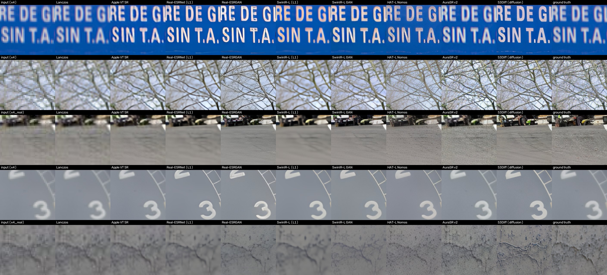
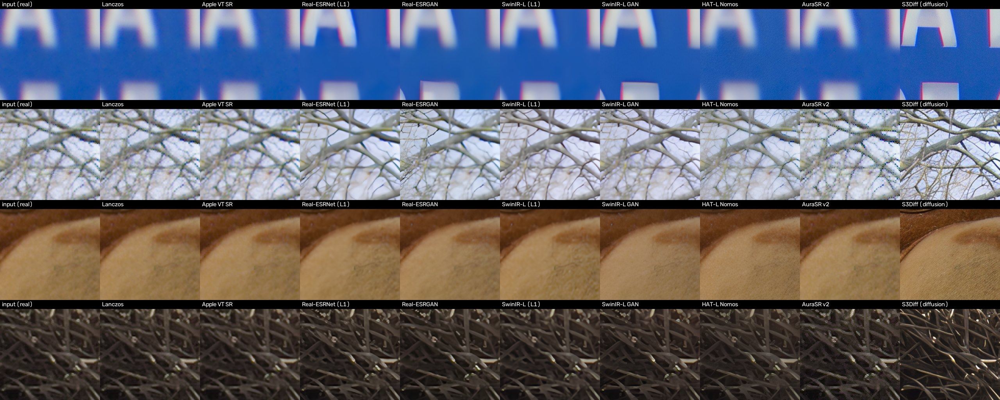
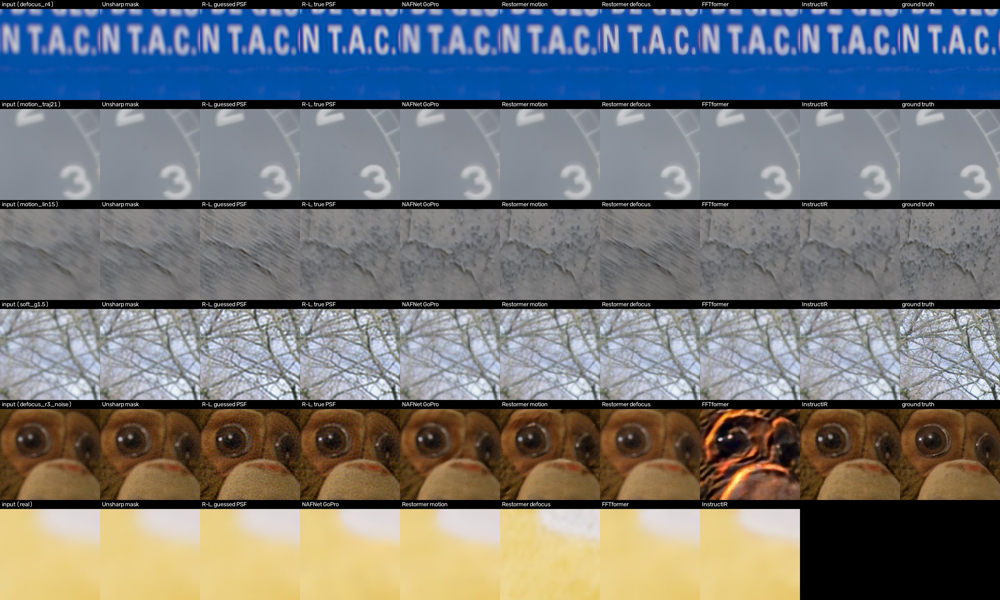
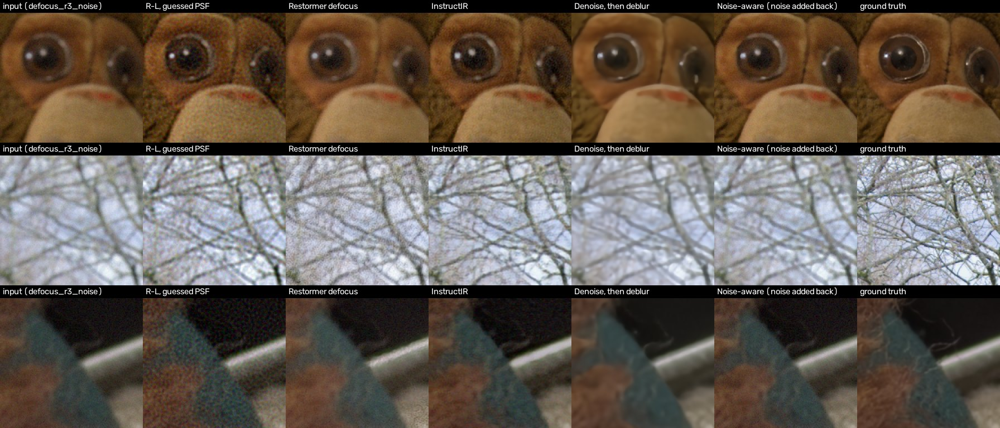
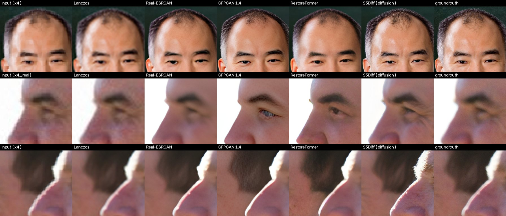
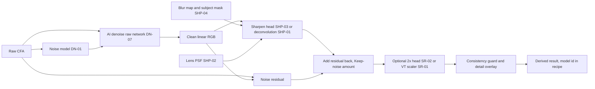

# H. Topaz-style upscaling and sharpening

Author: research agent, 2026-09-30. A supplement to
[B-super-resolution.md](B-super-resolution.md) (upscaling) and the lens-deblur line in
[F-other.md](F-other.md) §9. It follows [_conventions.md](_conventions.md). The full
evidence sits in two appendices:

- [H1-topaz-teardown.md](H1-topaz-teardown.md): Topaz's products, what Topaz has disclosed, the
  Adobe partnership and acquisition, and an inferred architecture for every mode, with a URL for
  every claim.
- [H2-open-model-survey.md](H2-open-model-survey.md): licences for about 50 open upscaling,
  deblur, all-in-one and face models and for evaluation tooling, including **whether a
  commercial project may even evaluate them**.

This note summarizes both and adds a measured bake-off (section 6). The scripts are in
[research/prototypes/restoration](../../../research/prototypes/restoration/). The measurements
were made on the Apple M1 Ultra (128 GB, macOS 26.6.2).

## TL;DR

- **Topaz is two products in one menu.**
  - A **fidelity tier** of small CNNs trained on synthetic degradations. Topaz calls this tier
    "Core", "non-generative" and local-only. It covers the Standard, High Fidelity and Low
    Resolution upscalers and the classic Sharpen models (Standard, Strong, Lens Blur, Motion
    Blur).
  - A **generative tier** of diffusion models: Wonder, Recover, Redefine, Super Focus, Denoise
    Max and Recover Faces 3. Topaz confirms these are "large diffusion-based image models". A
    user-posted log ties Wonder to the code of ByteDance's open SeedVR2 one-step diffusion
    transformer.
  - The generative tier is what makes the results look "quite good" at first glance, and it
    draws the "plastic", "invented" and "scrambled text" complaints (H1 §3).
- **Adobe completed its acquisition of Topaz on 2026-09-23.** Topaz models already power
  Photoshop's Generative Upscale and Lightroom's AI Sharpen (June 2026). Both are
  credit-metered, so they probably run in the cloud (H1 §2.9).
- **Topaz published the recipe for its Noise-Aware Sharpen**, the model inside Lightroom's AI
  Sharpen: "Noise is detected and removed. Image is sharpened. Noise is added back exactly as it
  was." We rebuilt it from open parts (section 6.3). It gave the best perceptual score on noisy
  blurred images while keeping the grain, where plain denoise-then-deblur looks waxy.
- **Bake-off, upscaling.**
  - Apple's VideoToolbox scaler (SR-01) is the best fidelity-first upscaler we measured. It has
    the best perceptual score among the non-generative methods on clean input, the best PSNR on
    realistic degraded input, and runs in 30–90 ms per 512 px output.
  - GAN and diffusion upscalers "look better" to a no-reference quality model. But they are the
    least consistent with their input: downscale their output and it no longer matches what went
    in. The diffusion model (S3Diff) was worst on consistency and best on "looks good".
  - This confirms B's recommendation and SKIP-10.
- **Bake-off, sharpening.**
  - **Knowing the blur beats every network.** Richardson–Lucy deconvolution with the true PSF
    won every noise-free synthetic blur, by 1.4–7.5 dB over the best network.
  - With only a guessed Gaussian PSF, it still added **+4.8 dB** on mild softness, the everyday
    "capture sharpening" case.
  - Blind deblur networks help only on blur like their training data. NAFNet trained on GoPro
    motion made defocus **5.4 dB worse** than doing nothing. FFTformer collapsed on noisy input.
    Restormer's defocus model "sharpened" real background bokeh into invented texture.
  - InstructIR, trained on many degradations at once, was the most robust network: it never did
    much harm and helped modestly everywhere.
- **Faces.** GFPGAN made faces look far "better" (no-reference score 0.92–0.94, against 0.73–0.89
  for Lanczos and Apple's scaler). But it changed a man's dark eye to blue and added stubble. All face
  models are trained on non-commercial FFHQ. **Skip face-specific restoration.**
- **Licences.**
  - For shipping, nothing changes from B: every open upscaler and face model is fine-tune only
    or worse.
  - **New:** the standard deblur datasets (GoPro, REDS, RealBlur) are **CC BY 4.0**. The
    NAFNet, Restormer-motion and FFTformer code is MIT. Deblur is therefore the one area where
    open weights or cheap retraining could be shippable (pending weights confirmation and
    counsel).
  - **Several popular models can't even be evaluated by a commercial project.** This covers
    CodeFormer, SUPIR, HYPIR, UltraSharp, MPRNet, PromptIR and Stripformer, and the `pyiqa`
    metrics package (now PolyForm Noncommercial).
- **Recommendation.**
  - **Phase 2:** build a classical **noise-aware capture sharpening** into the Detail stage
    (SHP-01, about 2–3 ew). Use NR v1 to split off the noise, deconvolve the clean estimate, and
    add the noise back. This answers Lightroom's AI Sharpen without cloud or credits.
  - **Phase 3–4:** add a learned **"AI Sharpen" head** (lens blur, motion blur, missed focus) to
    the AI denoise raw network (SHP-03, about 6–10 ew plus compute). Train it on broad synthetic
    PSF families and the calibrated noise model, and gate it by a blur map so that intentional
    bokeh is left alone (SHP-04).
  - **Keep** SR-01 and SR-02 as planned, and keep SKIP-10.
  - **Skip** face-specific generative restoration (SKIP-13).
  - Treat a generative "creative" tier as a separate owner decision (DEC-14), not a default.

## 1. How Topaz works (summary of H1)

### 1.1 Products and model menu

Evidence (H1 §1):

- **Lineup.** Topaz sells subscription-only apps: **Topaz Photo** (successor to Photo AI; the
  old Sharpen AI and DeNoise AI are discontinued and folded in), **Gigapixel** and **Video**,
  plus cloud apps (Bloom, Astra, Image Web). Perpetual licences ended on 2025-09-17.
- **Two tiers.** Topaz's docs split models into **Core**, "considered non-generative", which
  run locally only and are not cloud-rendered, and **Generative**, which need 8 GB VRAM on
  Windows or 16 GB unified memory on a Mac, and otherwise render in the cloud.
- **Gigapixel Core:** Standard, High Fidelity (v1–v3), Low Resolution, Text & Shapes, Art & CG.
  Sliders: Denoise, Sharpen and Fix Compression (1–100), whose strength "depends on the scale
  factor". Upscales go to 6x; output tops out at 32,000 px on the long side.
- **Generative:** Wonder 1/2/3/3.5 ("single-step"), Standard Max ("lightweight diffusion"),
  Recover 1–3 ("Our Best Diffusion Upscaling", best for inputs of 1 MP or less), and Redefine,
  which has an image-description prompt and Creativity and Texture sliders. Topaz's own docs say
  Redefine's "rendering results will differ between local systems and cloud servers".
- **Sharpen** (Topaz Photo): Standard, Strong, Lens Blur, Motion Blur, Natural, Refocus,
  Wildlife, Portrait and **Noise-Aware**. The controls are Strength and Minor Denoise. **Super
  Focus** is a separate generative tool "trained to work on missed focus cases". Topaz's docs
  warn "Do not use Super Focus on Backgrounds … it will create artifacts".
- **Recover Faces.** v2 is limited to a 512×512 face output, has Realistic and Creative modes,
  and "will sometimes change expressions slightly". v3 is generative and processes each face
  separately.
- **Autopilot** reads file type, metadata (ISO, camera, lens), noise, "subject detection and
  blur level", and faces, then picks tools and strengths from preference thresholds.

### 1.2 What Topaz has disclosed about the technology

Evidence (H1 §2):

- **Training data.** "Trained on millions of images". Staff say all training content "has been
  cleared and licensed". That claim predates the 2026 diffusion models, whose base checkpoints
  are unknown.
- **GAN to diffusion.** Topaz says its earlier models "utilize GAN technology" and the new ones
  use diffusion. The CEO wrote in 2026 that "the model architecture has remained basically
  unchanged" from 2018 until the Starlight diffusion series. Topaz names Wonder 2, Denoise Max,
  Super Focus 3 and Face Recovery 3 as "large diffusion-based image models".
- **Runtimes.**
  - The classic models run through ONNX Runtime, OpenVINO, TensorRT and Core ML, as fixed-tile
    `.tz` model files.
  - The large models run in **NeuroServer**, a bundled Python 3.12 + PyTorch server. On Mac it
    runs the diffusion network on MPS and the VAE as a Core ML `.mlpackage`.
  - **NeuroStream** streams weights from RAM and claims "up to 95%" less VRAM.
  - Topaz Photo needs 88 GB of disk on a Mac.
- **Lineage clue.** A Gigapixel log posted by a user on 2026-09-21 shows Wonder's package
  `bloom_precision` calling `VideoDiffusionInfer.vae_encode`. That is the exact class and method
  in ByteDance's Apache-2.0 **SeedVR/SeedVR2** repository. It also shows "DiT" tile settings,
  a fixed seed of 42 and padding to multiples of 16. A separate teardown found SeedVR2 strings
  in Topaz's video binaries. **Assessment:** the flagship generative models are latent diffusion
  transformers of the SeedVR2 line (one-step, adversarially post-trained). Whether Topaz uses
  SeedVR2's weights or only its code is unverified.
- **Noise-Aware Sharpen**, verbatim from Topaz's release page: "Noise is detected and removed.
  Image is sharpened. Noise is added back exactly as it was." It "separates image detail from
  noise before applying sharpening".
- **Adobe.**
  - Photoshop Generative Upscale is "now equipped with Topaz Labs' AI models" (2025-10-28).
  - "AI Sharpen brings Topaz Labs' Noise-Aware Sharpen model directly into Lightroom"
    (2026-06-15).
  - Lightroom's help charges 10–20 generative credits per Topaz Sharpen or Gigapixel run.
  - Adobe announced the acquisition on 2026-06-25, citing "deep expertise in optimizing large,
    complex AI models to run directly on device". It completed on 2026-09-23; "The Topaz Labs
    brand will remain".
- **Patents.** Google Patents shows no Topaz Labs assignee. Topaz relies on trade secrets
  (encrypted models, obfuscated code).

### 1.3 Inferred architecture

This section is **assessment**. The full table, with the evidence for each row, is H1 §4.

| Topaz mode | Most likely open-research analogue | Confidence |
|---|---|---|
| Core upscalers (Standard, High Fidelity, Low Res, …) | ESRGAN/RRDB-class CNNs trained on a Real-ESRGAN/BSRGAN-style synthetic degradation pipeline, mostly L1 + perceptual loss with a small GAN term. Sliders condition on degradation strength | Medium–high |
| Sharpen (Standard, Strong, Lens Blur, Motion Blur, …) | Blind deblurring CNNs (NAFNet/Restormer class) trained on synthetic defocus and motion PSFs; subject-specific fine-tunes for Portrait and Wildlife | Medium |
| Noise-Aware Sharpen (Lightroom AI Sharpen) | Residual decomposition: \(\hat x = D(y)\), output \(S(\hat x) + (y - \hat x)\) | High (vendor-stated) |
| Wonder, Standard Max, Super Focus 3, Denoise Max, Recover Faces 3 | One-step latent diffusion transformer (SeedVR2 lineage) on a 2D image VAE, run on tiles | High for Wonder; medium for the rest |
| Recover, Redefine | Text-conditioned latent diffusion image-to-image (StableSR/SUPIR family); Creativity ≈ denoising strength; Texture ≈ noise augmentation | Medium |
| Recover Faces 2 | GFPGAN/CodeFormer class: an aligned 512 px face with a generative face prior, pasted back | High |
| Autopilot | Small classifiers (noise, blur, faces, subject, "false resolution") feeding a rule table | Medium |

Assessment for Redlamp:

- The **fidelity tier is what photographers can trust, and it is small enough to ship on an
  iPhone.** It matches what Redlamp already plans in A (denoise) and B (upscaling).
- The **generative tier** needs multi-GB weights and at least 16 GB of memory. It isn't
  reproducible: Topaz's own docs admit that local and cloud results differ. It also invents
  content. All three conflict with Redlamp's 8 GB iPhone floor and its reproducible-recipe rule.
- Adobe bought Topaz explicitly for on-device large-model know-how. Expect generative upscale and
  sharpen to move on-device in Lightroom. Redlamp's durable differentiators are **no credits, no
  cloud, and results that are reproducible and faithful**, not "also generative".

## 2. The problem, split into parts

### 2.1 Upscaling: fidelity versus generation

A 2x upscale must add three out of every four pixels. There are two honest ways to do it.

- **Fidelity (regression).** Train with L1/L2 loss so that the output is the mean of all
  plausible high-resolution images. The result is sharp where the input constrains it, and
  smooth (not invented) where it doesn't. This is Adobe Super Resolution, Topaz's Core tier and
  Apple's VideoToolbox scaler.
- **Generative.** Sample one plausible high-resolution image (GAN, diffusion). It looks crisp
  everywhere because it invents texture where the input is silent. Blau and Michaeli (arXiv
  1711.06077) prove the trade-off: beyond the mean, better "perceptual quality" requires more
  distortion.

The bake-off measures both sides. **Full-reference scores** say how close the output is to the
truth. A **consistency score** asks whether the output, downscaled again, still reproduces the
input; generated detail that contradicts the input fails this. A **no-reference score** (CLIP-IQA)
asks how good the output looks.

### 2.2 Sharpening is deconvolution

Blur is (to first order) a convolution of the sharp image with a point-spread function (PSF).
The PSF can come from defocus (a disc), lens aberrations (a field-dependent blob), diffraction
(an Airy pattern), or camera shake or subject motion (a line or curve). Sharpening methods differ
in how much they know about that PSF.

- **Unsharp mask** assumes nothing. It boosts high frequencies, so edges gain contrast, but it
  doesn't undo blur, and it amplifies noise. This is Redlamp's current Detail-panel sharpening.
- **Non-blind deconvolution** (Wiener, Richardson–Lucy) inverts a *known* PSF. It is excellent
  when the PSF is right, and it rings or amplifies noise when the PSF is wrong or the image is
  noisy. RawTherapee's "capture sharpening" and DxO's lens modules are in this family: they use a
  Gaussian or measured per-lens PSF.
- **Blind deconvolution** estimates the PSF first. Classical examples are Levin et al. 2011,
  Krishnan et al. 2011, and Pan et al. 2016's dark-channel prior. Patent status is unverified.
- **Learned blind deblurring** (NAFNet, Restormer, FFTformer) folds PSF estimation and inversion
  into a network. It is only as good as the range of PSFs and noise levels it was trained on
  (section 6.2).
- **Generative "refocus"** (Topaz Super Focus, diffusion restorers) invents plausible sharp
  detail. It is the same hallucination question as upscaling.

### 2.3 Why "noise-aware" matters

Deconvolution divides by the PSF's frequency response, which is small at high frequencies, and
that is exactly where noise lives. So sharpening a noisy image sharpens the noise. The fixes are:

1. Denoise first, then sharpen. The noise is gone, but so is some real detail, and the result
   looks waxy.
2. Topaz's recipe: denoise, sharpen the clean estimate, then **add the removed residual back**.
   Any detail the denoiser removed returns with the noise, and the photo keeps its grain.
3. Condition a learned deblurrer on a noise map. Redlamp already estimates noise per image (DN-01).

### 2.4 Faces

Face restorers (GFPGAN, CodeFormer, RestoreFormer, diffusion face models) align the face to a
512 px template and regenerate it from a face prior learned on FFHQ. They produce convincing
faces from very little input, which is the point, and also the problem: the identity details
come from the prior (section 6.4).

### 2.5 How "strength" and "creativity" controls work

- **Output blending:** mix the model's output with a classical baseline (Adobe's Enhance amount;
  Topaz's Strength). Cheap, and faithful at low settings.
- **Degradation conditioning:** feed the degradation level (noise sigma, blur radius) as an input,
  as SRMD, S3Diff's degradation embedding and Topaz's Core sliders appear to do.
- **Two-branch guidance:** PiSA-SR (arXiv 2412.03017) trains a pixel-fidelity LoRA and a semantic
  LoRA and exposes two guidance scales. Raising λ_pix removes degradation; raising λ_sem adds
  generated detail. That is the cleanest published "fidelity versus creativity" dial. Its licence
  is UNCLEAR (H2 §2).
- **Diffusion strength:** the start timestep or noise level of a one-step or few-step diffusion
  model. This is likely Redefine's Creativity and Wonder 3's Low/Medium/High.

## 3. Open models that get similar effects

Verdicts follow `_conventions.md`. "Eval" means whether the terms allow a commercial project to
evaluate the model internally (H2 §0). Full rows, with sources, are in H2 §10.

| Category | Candidates (bold = in the bake-off) | Eval | Ship verdict |
|---|---|---|---|
| Fidelity upscalers | **Real-ESRNet**, **SwinIR-L (L1)**; HAT, DAT, DRCT, ATD | Yes | Fine-tune only (research-only data) |
| GAN upscalers | **Real-ESRGAN**, **SwinIR-L GAN**, **HAT-L Nomos8kSC** (OpenModelDB, CC BY 4.0 weights on tainted data), **AuraSR v2** (GigaGAN-style, Apache weights, data undisclosed); UltraSharp (CC BY-NC-SA) | Yes; UltraSharp no | Fine-tune only; UltraSharp research-only |
| One-step diffusion upscalers | **S3Diff** (Apache, SD-Turbo base), AdcSR (Apache, 456 M params, 65 ms on a phone per the paper), TSD-SR, OSEDiff; PiSA-SR (licence UNCLEAR) | Yes | Fine-tune only |
| Heavy diffusion upscalers | DiffBIR v2.1 (eval yes); SUPIR, HYPIR (eval **no**); DreamClear (AGPL base); LucidFlux (FLUX-dev NC, evaluation allowed) | Mixed | Research-only or avoid |
| Apple | **VideoToolbox super-resolution scaler** | Yes | Shippable (OS API) |
| Motion deblur | **NAFNet-GoPro**, **Restormer motion**, **FFTformer**, Uformer; MPRNet, Stripformer (eval **no**), MIMO-UNet (no licence) | Mostly yes | NAFNet, Restormer, FFTformer and Uformer are **shippable candidates**: MIT code, CC BY 4.0 data, weights need confirmation or cheap retraining |
| Defocus deblur | **Restormer defocus** (DPDD data, terms UNCLEAR); IFAN, DRBNet (AGPL) | Yes | Fine-tune only; AGPL ones avoid |
| All-in-one restoration | **InstructIR** (MIT code and weights); DA-CLIP, AdaIR; PromptIR (eval **no**) | Yes | Fine-tune only (mixed data) |
| Face restoration | **GFPGAN 1.4** (NVIDIA NC parts: evaluation only), **RestoreFormer**, PMRF; CodeFormer (eval **no**) | Mostly yes | Research-only or fine-tune only (all FFHQ, CC BY-NC-SA) |
| Classical | **Unsharp mask**, **Richardson–Lucy**, Wiener, blind kernel estimation | n/a | Implement from papers (patent check for the blind methods) |

## 4. Licence matrix (bake-off models)

Row format per `_conventions.md`, with an "Eval allowed" column. Checked 2026-09-30; sources in H2.

| Candidate | Code license (source) | Weights license (source) | Training data (terms) | Obligations (attribution, patents) | Verdict | Eval allowed |
|---|---|---|---|---|---|---|
| Apple VT super-resolution scaler | Apple SDK | Apple, OS-downloaded | Undisclosed | Developer Program terms | Shippable (OS API) | Yes |
| Real-ESRGAN / Real-ESRNet x4plus | BSD-3-Clause (xinntao/Real-ESRGAN) | Release assets, none stated: UNCLEAR | DF2K + OST (research-only / UNCLEAR) | BSD notice | Fine-tune only | Yes |
| SwinIR-L real-world (L1 and GAN) | Apache-2.0 (JingyunLiang/SwinIR) | Release assets, none stated: UNCLEAR | DF2K, OST, WED, FFHQ, … | Apache | Fine-tune only | Yes |
| 4xNomos8kSCHAT-L | Apache-2.0 (HAT) | CC BY 4.0 (HF `Phips/4xNomos8kSCHAT-L`) | Nomos8k, curated from research datasets; HAT-L ImageNet pretrain → UNCLEAR | CC BY attribution | Fine-tune only | Yes |
| AuraSR v2 | CC BY-SA 4.0 (fal-ai/aura-sr) | Apache-2.0 (HF `fal/AuraSR-v2`) | Undisclosed → UNCLEAR | Attribution; ShareAlike on code adaptations | Fine-tune only | Yes |
| S3Diff | Apache-2.0 (ArcticHare105/S3Diff) | Apache-2.0 (HF `zhangap/S3Diff`); base SD-Turbo (Stability AI Community Licence) | LSDIR + FFHQ 10k (NC) | Stability AUP; revenue cap | Fine-tune only | Yes |
| NAFNet GoPro width-32 | MIT (megvii-research/NAFNet) | Google Drive, none stated: UNCLEAR | GoPro (CC BY 4.0) | MIT; CC BY attribution | Shippable candidate (confirm weights or retrain) | Yes |
| Restormer motion / defocus / real denoise | MIT since 2025-10-23 (swz30/Restormer) | Release v1.0 (2022), none stated: UNCLEAR | GoPro (CC BY 4.0) / DPDD (UNCLEAR) / SIDD (MIT per site) | MIT; CC BY attribution | Motion: shippable candidate; defocus: fine-tune only | Yes |
| FFTformer GoPro | MIT (kkkls/FFTformer) | Release asset, none stated: UNCLEAR | GoPro (CC BY 4.0) | MIT; CC BY | Shippable candidate | Yes |
| InstructIR | MIT (mv-lab/InstructIR) | MIT (HF `marcosv/InstructIR`); text encoder MIT | Mixed, incl. MIT-Adobe FiveK (research) | MIT | Fine-tune only | Yes |
| GFPGAN 1.4 | Apache-2.0 except StyleGAN2 (NVIDIA NC) and DFDNet (CC BY-NC-SA) parts | Release assets | FFHQ (CC BY-NC-SA 4.0) | NVIDIA NC: "research or evaluation purposes only" | Research-only | Yes (NVIDIA part); DFDNet part unclear |
| RestoreFormer | Apache-2.0 | Release asset (TencentARC/GFPGAN v1.3.4) | FFHQ (NC) | Apache | Fine-tune only | Yes |
| YuNet face detector (bake-off helper) | MIT (opencv/opencv_zoo) | MIT | Not checked | MIT | Shippable (tooling) | Yes |
| LPIPS, DISTS, OpenAI CLIP (metrics) | BSD-2 / MIT / MIT | Bundled | BAPPS; KADID-10k (research); CLIP data undisclosed | Notices | Tooling OK | Yes |
| CodeFormer, SUPIR, HYPIR, UltraSharp, MPRNet, PromptIR, Stripformer, pyiqa | S-Lab / SupPixel / CC BY-NC-SA / Academic Public / modified MIT / PolyForm NC | NC | — | NC | Research-only; **not evaluated** | **No** |

CodeFormer was downloaded and run once before the licence check came back. Its weights and outputs
were then deleted, and it is excluded from all results.

## 5. Bake-off method

Evidence: `research/prototypes/restoration/`.

- **Test set** (`make_testset.py`).
  - Sources: the six CC0 raw fixtures (Sony A7 III, Fujifilm X-T2 X-Trans, Canon R6, Nikon,
    Leica Q3, iPhone ProRAW), rendered by the Redlamp CLI with the neutral base look and
    sharpening off, 16-bit sRGB. Plus four Wikimedia files: two NASA crew portraits (public
    domain) for faces, and the two CC0 photos note B used, for signage and tiny people.
  - **14 ground-truth crops**, each a 1024 px region area-reduced to 512 px. A 100% crop of an
    unsharpened raw render has almost no energy near Nyquist: in a first attempt, Lanczos
    recovered a 4x downscale of such a crop at 40 dB. Such crops can't separate upscalers, and
    they show how soft unsharpened raw renders are, which is why capture sharpening matters.
  - **8 degradations** with known ground truth: bicubic 2x and 4x; "real" 4x (Gaussian blur,
    4x, Poisson–Gaussian noise, JPEG q80); Gaussian softness σ = 1.5 px; disc defocus r = 4 px;
    linear motion 15 px; a camera-shake trajectory in a 21 px support; disc defocus r = 3 px with
    noise. All blur and noise are applied in linear light. That makes 112 degraded items.
  - **12 real items with no ground truth:** native 256 px crops for 2x upscaling, and two
    genuinely out-of-focus crops (bokeh).
- **Methods** (`run_bakeoff.py`, `run_vt.py`, `run_s3diff.py`).
  - Networks load through spandrel (MIT) and run in PyTorch 2.14 MPS fp32, untiled. A 4x-only
    model answers a 2x request by running 4x and area-downscaling, as B does for Apple's scaler.
  - Apple's scaler runs through a small Swift tool. The `async` form of
    `VTFrameProcessor.process` returned before writing its output on macOS 26.6; the
    completion-handler form works.
  - The face pipeline is Real-ESRGAN for the background, then YuNet detection, alignment to the
    FFHQ 5-point template, the face model, and a feathered paste-back.
- **Scores** (`score.py`).
  - Full-reference: PSNR (8 px border excluded), SSIM on luma, LPIPS-Alex and DISTS.
  - **Consistency PSNR:** re-degrade the output (bicubic downscale, or re-blur with the true PSF)
    and compare it with the input.
  - **Zero-shot CLIP-IQA** ("Good photo." against "Bad photo.", arXiv 2207.12396), reimplemented
    on OpenAI CLIP ViT-B/32 because pyiqa is non-commercial.
  - Times are the median wall time per item after a warm-up. Outputs are 512×512.
- **Caveats.**
  - 14 crops is a small sample.
  - Synthetic degradations favour methods trained on similar ones.
  - PyTorch MPS timings are not Core ML timings; the Neural Engine was not used.
  - Everything is sRGB display-referred, not Redlamp's linear pipeline.
  - CLIP-IQA is a weak, gameable metric, reported only next to consistency.

## 6. Bake-off results

### 6.1 Upscaling

Means over 14 crops. For LPIPS and DISTS, lower is better; for the rest, higher is better.

| Method | 4x clean: PSNR | LPIPS | DISTS | 4x realistic: PSNR | LPIPS | Consistency (4x clean) | CLIP-IQA (4x clean) | Median time |
|---|---|---|---|---|---|---|---|---|
| Lanczos | **32.96** | 0.340 | 0.196 | 28.52 | 0.546 | **45.5** | 0.454 | 1 ms |
| Lanczos + unsharp | **33.16** | 0.333 | 0.192 | 28.48 | 0.545 | **47.7** | 0.465 | 12 ms |
| **Apple VT scaler** | 31.73 | 0.233 | 0.146 | **29.34** | 0.350 | 40.8 | 0.525 | **50 ms** |
| Real-ESRNet (L1) | 29.18 | 0.299 | 0.206 | 27.67 | 0.370 | 35.7 | 0.545 | 70 ms |
| Real-ESRGAN | 26.59 | 0.246 | 0.172 | 26.01 | 0.276 | 32.1 | 0.563 | 70 ms |
| SwinIR-L (L1) | 29.38 | 0.297 | 0.211 | 28.13 | 0.371 | 35.4 | 0.522 | 0.85 s |
| SwinIR-L GAN | 27.85 | 0.218 | 0.158 | 26.65 | **0.256** | 33.2 | 0.546 | 0.62 s |
| HAT-L Nomos8kSC | 28.14 | 0.250 | 0.182 | 26.39 | 0.396 | 34.6 | 0.482 | 0.83 s |
| AuraSR v2 | 30.02 | **0.108** | **0.096** | 26.47 | 0.396 | 36.9 | 0.522 | 0.19 s |
| S3Diff (diffusion) | 26.05 | 0.245 | 0.173 | 25.60 | 0.272 | 32.6 | **0.646** | 2.0 s |

2x clean and the real (no ground truth) 2x crops rank the same way. On the real crops, consistency
was Lanczos 56.4, VT 45.9, AuraSR 43.0, the L1 models 37.5–37.7, the GANs 34.7–35.4 and S3Diff
29.4, while CLIP-IQA ranked S3Diff first (0.59). The full tables are in `summary.md` from
`score.py`.





Assessment:

- **"Looks better" and "is faithful" point in opposite directions.** Across all methods, CLIP-IQA
  rises as consistency falls. S3Diff tops CLIP-IQA and is bottom on consistency. The contact
  sheets show it inventing gravel texture on the road and new crack patterns in the concrete.
- **Apple's scaler is the right fidelity default.** It had the best LPIPS and DISTS among the
  non-generative methods on clean input (0.233 and 0.146 against Lanczos's 0.340 and 0.196), the
  best PSNR on realistic input, high consistency, and was the fastest network measured.
  This agrees with B's two-image probe and supports SR-01.
- **"Real-world" models carry the wrong prior for clean camera files.** Real-ESRNet and SwinIR-L
  (L1) lose 3.6–3.8 dB to Lanczos on clean input: they are trained to remove heavy blur, noise
  and JPEG, so they smooth away real texture. B found the same for Real-ESRGAN.
- **Each model is tuned to one degradation.** AuraSR v2 was outstanding on clean bicubic input
  (LPIPS 0.108) and joint-worst of the networks on realistic input (0.396). HAT-L Nomos8kSC did the same. A
  shipped model has to be trained on *our* degradation: raw, calibrated noise, lens blur.
- **The X-Trans crop shows magenta fringing from the demosaic,** and every upscaler amplified it
  (real-crop sheet, top row). That supports B's argument for joint demosaic + upscaling (SR-02).

### 6.2 Sharpening and deblur

PSNR in dB. "Input" is the untouched blurred image, so any number below it means the method made
the image worse.

| Method | Softness σ1.5 | Defocus r4 | Linear motion | Shake trajectory | Defocus + noise (PSNR / LPIPS) | Time |
|---|---|---|---|---|---|---|
| (input) | 32.98 | 30.23 | 27.97 | 29.42 | 28.48 / 0.368 | — |
| Unsharp mask | 34.32 | 30.59 | 27.88 | 29.53 | 27.07 / 0.481 | 11 ms |
| Richardson–Lucy, guessed Gaussian PSF | 37.74 | 31.32 | 27.47 | 29.83 | 27.28 / 0.418 | 1.0 s* |
| Richardson–Lucy, true PSF | **38.09** | **34.35** | **32.94** | **37.79** | 27.49 / 0.377 | 1.0 s* |
| NAFNet GoPro (w32) | 29.82 | 24.86 | 31.17 | 24.44 | 27.46 / 0.328 | 95 ms |
| Restormer motion | 30.96 | 30.65 | 31.54 | 29.94 | 24.67 / 0.392 | 0.73 s |
| Restormer defocus | 31.25 | 30.76 | 25.95 | 27.07 | 27.27 / 0.351 | 0.74 s |
| FFTformer GoPro | 32.89 | 30.78 | 30.81 | 29.08 | 19.06 / 0.542 | 3.0 s |
| InstructIR | 34.45 | 31.84 | 30.58 | 30.30 | 29.19 / 0.284 | 0.16 s |
| Denoise, then deblur (Restormer ×2) | | | | | **29.40** / 0.277 | 1.5 s |
| Noise-aware: denoise, deblur, add noise back | | | | | 28.21 / **0.274** | 1.5 s |

\* Unoptimized NumPy on the CPU, 30 iterations. A Metal version would take milliseconds.



Assessment:

- **Knowing the PSF is worth more than any network.** Richardson–Lucy with the true PSF beat every
  blind network on every noise-free blur: by 1.4 dB on linear motion, 2.5 dB on defocus, 3.6 dB on
  softness and 7.5 dB on the shake trajectory, each against the best network for that case. Measured lens PSFs (DxO's approach) and
  blind kernel estimation are therefore worth building, not just learned models.
- **The everyday case is cheap.** Unsharpened raw renders are mildly soft (section 5). Against
  that, a guessed Gaussian PSF with Richardson–Lucy gained 4.8 dB, where an unsharp mask gained
  1.3 dB. This is "deconvolution capture sharpening", already in TON-06.
- **Blind networks only work on blur like their training data, and fail badly outside it.**
  NAFNet and Restormer trained on GoPro motion gained 3.2–3.6 dB on linear motion. But NAFNet
  lost 5.4 dB on defocus and 5.0 dB on the shake trajectory; the defocus model lost 2.0 dB on
  motion; and FFTformer turned the noisy monkey into orange artifacts (−9.4 dB). A shipped
  sharpen model needs a broad synthetic PSF family *and* noise at training time.
- **Broad training is the most robust single model.** InstructIR (7 degradations, 0.16 s) was the
  only network that improved every blur case and the noisy case.
- **Real bokeh must be protected.** On the genuinely out-of-focus plush toys (bottom row), the
  defocus network "sharpened" smooth bokeh into invented texture. That is the failure Topaz warns
  about for Super Focus on backgrounds. A shipped feature needs a blur map or subject mask that
  decides where to act.

### 6.3 Noise-aware sharpening (Topaz's published recipe)

On the defocus + noise items, we compared a sharper that removes the noise with one that keeps it.
"PSNR vs noisy GT" scores against the sharp ground truth carrying the same noise pattern, which is
what "add the noise back" aims for.

| Method | PSNR vs clean GT | LPIPS | PSNR vs noisy GT |
|---|---|---|---|
| (input) | 28.48 | 0.368 | **32.06** |
| Richardson–Lucy, guessed PSF | 27.28 | 0.418 | 30.36 |
| Denoise, then deblur | **29.40** | 0.277 | 27.58 |
| Noise-aware (noise added back) | 28.21 | **0.274** | 30.29 |



Assessment:

- **The recipe does what Topaz claims.** Noise-aware had the best LPIPS of every method on noisy
  input (narrowly, 0.274 against 0.277), and it kept the grain, where denoise-then-deblur looks waxy (monkey fur, branch sky).
  Classical sharpening (Richardson–Lucy, unsharp mask) amplified the noise and made the image
  worse than the input.
- **But the sharpening stage limits it.** On "PSNR vs noisy GT", nothing beat the untouched input
  at this mild blur. The off-the-shelf defocus model was trained on a different camera's blur
  (Canon dual-pixel DPDD) and adds error of its own. The composition is right; the deblur stage
  has to be trained on our PSFs and noise model.
- For Redlamp this is natural: the noise model already exists (DN-01), NR v1 is the \(D\), and the
  residual \(y - D(y)\) is well defined in the linear pipeline.

### 6.4 Faces

On the two face crops at 4x (ground-truth PSNR / LPIPS / CLIP-IQA): Lanczos 33.88 / 0.452 / 0.889;
Apple VT 33.77 / 0.332 / 0.887; Real-ESRGAN (the face pipeline's background) 30.82 / 0.298 /
0.901; **GFPGAN 28.61 / 0.325 / 0.937**; RestoreFormer 28.64 / 0.282 / 0.881; S3Diff 29.00 / 0.276 /
0.949. On the realistic 4x version, GFPGAN's CLIP-IQA was 0.923 against VT's 0.812.



Assessment:

- The face models "look" much better and are further from the truth.
- The contact sheet shows why. On the profile face, GFPGAN renders the man's dark eye **blue**,
  and it adds stubble to a clean-shaven jaw. S3Diff
  turns the second man's hair into white tufts.
- This is Topaz's "will sometimes change expressions slightly" at a smaller scale. It is
  unacceptable for a photographer's tool that promises to develop *their* photo, and every face
  model is trained on non-commercial FFHQ. **Skip** (SKIP-13).

### 6.5 Speed on the M1 Ultra (PyTorch MPS fp32, 512×512 output)

Apple VT scaler 30–90 ms; Real-ESRGAN 70 ms (x4 from 128²); NAFNet w32 95 ms; InstructIR 0.16 s;
AuraSR v2 0.19 s; SwinIR-L and HAT-L 0.6–3.8 s; Restormer 0.73 s; S3Diff 2.0 s; FFTformer 3.0 s.

A 24 MP frame is about 92 such outputs. That puts the small CNNs (NAFNet class, as already
measured in Core ML for A) at seconds per frame, and diffusion at minutes.

## 7. How Redlamp could produce similar results

The Topaz look that photographers trust comes from the fidelity tier plus good sharpening. Redlamp
can build that from its own parts.



1. **Noise-aware capture sharpening, classical (Phase 2).**
   - Use NR v1 as \(D\).
   - Deconvolve \(D(y)\) with a few Richardson–Lucy or Wiener iterations in Metal. The Gaussian
     PSF comes from the Radius slider; later, a per-lens PSF replaces it.
   - Add \(y - D(y)\) back, scaled by a "keep noise" amount.
   - This is TON-06's "deconvolution-style capture sharpening" made noise-aware. No training, no
     licence risk, and it answers Lightroom's AI Sharpen without credits.
2. **Lens PSFs (Phase 3).** Measure PSFs per lens, aperture and field position with a
   slanted-edge chart, or estimate a defocus radius per tile. Richardson–Lucy with the right PSF
   beat the best network by 1.4–7.5 dB in the bake-off.
3. **Learned "AI Sharpen" head on A's raw network (Phase 3–4).**
   - Architecture: the NAFNet-class network already planned for denoise (DN-07), with a sharpen
     head.
   - Training data: our own clean raws, degraded with a broad PSF family (discs, Gaussians,
     measured lens PSFs, linear and trajectory shake), the calibrated noise model, and
     optionally GoPro, REDS and RealBlur (CC BY 4.0, subject to DEC-15).
   - Loss: L1/Charbonnier, as B specifies, for fidelity.
   - Output: composed noise-aware.
   - Strength: an output blend with the classical result.
4. **Blur-map gating (with 3).** Act only where blur is unintentional: the subject or focus plane,
   from Vision subject masks (MSK-08) and a per-tile blur estimate. Leave bokeh alone.
5. **Upscaling as planned (B).** Use Apple's scaler now (SR-01) and a 2x head on the raw network
   later (SR-02). Use the bake-off's **consistency PSNR** as the fidelity guard's metric: it
   cleanly separated every inventing method from every faithful one.
6. **Not recommended:** face restorers (SKIP-13), and GAN or diffusion upscalers as a default
   (SKIP-10).
   - If the owner wants a "creative" tier for parity with Topaz Wonder or Lightroom Generative
     Upscale (DEC-14), the only licence-viable routes are training our own one-step diffusion
     model (very large data and compute) or SeedVR2/AdcSR-class weights once counsel clears
     their data.
   - Either way it would be Mac-only (memory), opt-in, labelled, never baked silently, and it
     would carry a C2PA "AI-generated content" assertion (RM-03).

## 8. Recommendation, effort and roadmap

Proposed tracker rows (all `Proposed`; no existing decision changes):

| ID | Item | Recommended | Phase | Size | Depends on |
|---|---|---|---|---|---|
| SHP-01 | Noise-aware capture sharpening: NR v1 separates the noise, a few Richardson–Lucy or Wiener iterations deconvolve the clean estimate (Gaussian PSF from Radius), and the residual is added back with a "keep noise" amount | Build | P2 | M (2–3 ew) | TON-06, DN-02 |
| SHP-02 | Lens PSFs for deconvolution: slanted-edge measurement per lens, aperture and field position, plus a per-tile defocus-radius estimate | Build | P3 | M | LNS-01, SHP-01 |
| SHP-03 | "AI Sharpen" head on the AI denoise raw network (lens blur, motion blur, missed focus): broad synthetic PSFs + calibrated noise; L1 loss; noise-aware composition; strength blend; consistency guard | Build | P3–P4 | L (6–10 ew + compute) | DN-06, DN-07, DEC-15 |
| SHP-04 | Blur-map and subject gating so that sharpening leaves intentional bokeh alone | Build | With SHP-03 | S–M | MSK-08 |
| SHP-05 | Blind camera-shake kernel estimation feeding non-blind deconvolution (Levin 2011 / Pan 2016 class) | Build | P4 | M | DEC-05 (add these methods to the patent search) |
| SR-03 | Use the consistency PSNR from the restoration bake-off as SR-01's fidelity-guard metric; calibrate its thresholds on the bake-off set | Adopt | P4 | S | SR-01 |
| INF-09 | Fold the restoration bake-off (test-set generator, licence-checked model list, metrics without pyiqa) into the shared evaluation harness | Adopt | P2 | S | INF-05 |
| DEC-14 | Offer an opt-in, labelled, Mac-only generative "creative" upscale or refocus tier? (would reopen SKIP-10) | Not now; revisit if users ask for Topaz/Lightroom parity | — | — | counsel for any base model |
| DEC-15 | May shipped models be trained on CC BY 4.0 deblur datasets (GoPro, REDS, RealBlur) with attribution? *(counsel)* | Yes, if counsel agrees | — | — | — |
| SKIP-13 | Face-specific generative restoration (GFPGAN, CodeFormer, RestoreFormer, face diffusion) | Skip: changes identity details (eye colour, stubble in the bake-off); all FFHQ (NC) | — | — | — |

Effect on existing plans:

- **F's "Lens deblur / optical sharpening: Later, Phase 4+, 6–12 ew"** splits in two:
  - SHP-01, the classical part, moves to **Phase 2** as a small extension of TON-06.
  - The learned part (SHP-03) becomes a head on A's network in Phase 3–4. That makes it cheaper
    than a standalone model, the same argument B made for SR-02.
- **B's recommendation stands and is strengthened:** Apple's scaler measured best among fidelity
  upscalers on 14 crops, not 2.

## 9. Risks and open questions

- **Bake-off scope.**
  - 14 crops, synthetic degradations, sRGB rather than linear, PyTorch MPS rather than Core ML.
  - The rankings are indicative. Repeat them in the INF-05 harness on our own raws, with real
    handheld and missed-focus captures (the capture program, DN-05).
- **CLIP-IQA** is a weak stand-in for MUSIQ or MANIQA, whose official Apache implementations
  should replace it in INF-05. Never report it alone.
- **Apple's scaler** remains a black box: 4x only, clipped to [0, 1], and OS-updated weights (B §9).
- **Deblur weights** (NAFNet, Restormer, FFTformer) have no stated weights licence. Confirm with
  the authors or retrain on GoPro/REDS; retraining is cheap.
- **Richardson–Lucy and Wiener** are public-domain-era methods (1972–74, 1949). Blind kernel
  estimation methods need the patent search (DEC-05).
- **Competitive risk.** Adobe now owns Topaz and says it will optimize Topaz models to run on
  device. Lightroom may soon offer on-device generative sharpen and upscale. Redlamp's answer is
  faithfulness, reproducibility and no credits, which this note's measurements support.
- **Open question.** Would users accept "AI Sharpen" that never invents detail? Topaz's own
  docs show the market moving from Core to generative models. A blind study (DN-09 style)
  against Lightroom's AI Sharpen should decide whether SHP-03 alone is competitive.

## 10. Reproducing the bake-off

```bash
uv venv --python python3.12 build/restoration-venv
VIRTUAL_ENV=build/restoration-venv uv pip install -r research/prototypes/restoration/requirements.txt
cd research/prototypes/restoration
../../../build/restoration-venv/bin/python make_testset.py
../../../build/restoration-venv/bin/python fetch_models.py
../../../build/restoration-venv/bin/python run_bakeoff.py
../../../build/restoration-venv/bin/python run_vt.py
../../../build/s3diff-venv/bin/python run_s3diff.py   # optional, see its docstring
../../../build/restoration-venv/bin/python score.py
```

Total run time on the M1 Ultra is about 30 minutes. Downloads are about 4 GB of weights, plus
12 GB for the SD-Turbo snapshot that S3Diff needs.
