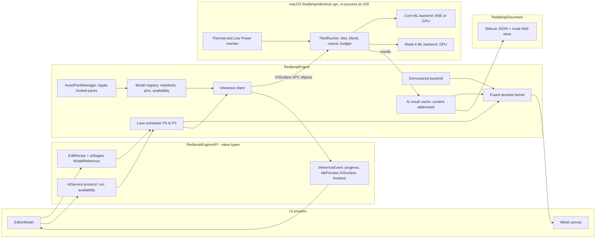

# INFRA: shared AI infrastructure for Redlamp

Scope: brief section 4 (runtime, quantization, delivery, versioning and caching, tiled inference, training, evaluation, legal). All sources checked 2026-09-29 unless noted. "Evidence:" means a primary source says it; "Assessment:" is my opinion.

## 0. Summary of recommendations

1. **Runtime.** Core ML (ML Program format, fp16) is the default for every shipped network, because it is the only public path to the Neural Engine (ANE). Networks are designed or modified to be ANE-friendly, and placement is checked in CI with `MLComputePlan`. Metal 4's `MTL4MachineLearningCommandEncoder` (OS 26) is the GPU path when a network has to live on the GPU timeline next to our kernels. Classical image operations stay in hand-written Metal (`RedlampKernels`). MLX is for training and experiments on Macs, not for the shipping app.
2. **Compression.** Ship fp16 first. Then try 8-bit or 6-bit weight palettization, which the coremltools docs describe as nearly free for classifiers. Treat W8A8 and anything at 4 bits or below as a research item for restoration networks: published super-resolution results show drops of 0.5–4 dB PSNR at 4 bits and below.
3. **Determinism.** Apple states that Core ML's precision and its split of work across compute units vary "based on the hardware and software versions". Bit-exact re-inference across devices therefore can't be guaranteed. Pixel-affecting outputs are **cached and treated as content**. Recipes pin the model's ID, version and SHA-256. Old edits keep their model version unless the user opts in to an update.
4. **Delivery.** Bundle no large models. Deliver each model as an **Apple-hosted Managed Background Assets** asset pack (OS 26+), usually with the `onDemand` policy, and give each immutable model version its own pack. On-Demand Resources (ODR) is deprecated as of iOS 27, and macOS never supported it.
5. **Tiled inference.** One engine-side `TiledInference` component handles tiling, CFA-phase alignment, overlap with valid-region crop plus a short cosine feather, IOSurface-backed fp16 I/O, per-tile cancellation, progress, lanes P0–P3, and thermal and Low Power Mode backoff. On macOS it runs in an XPC service and receives frames as IOSurfaces.
6. **Training.** A NAFNet-scale raw denoiser costs about 6–12 A100-days per full training run (estimated). A program covering denoise, a "Pro" denoiser, segmentation heads, SAM distillation and inpainting needs about 400–1,200 GPU-days per year, which is roughly $26–71k a year in cloud compute. The larger costs are data capture and people.

---

## 1. Runtime

### 1.1 Options

| Runtime | Neural Engine | GPU | Platforms | License | App Store fit |
|---|---|---|---|---|---|
| **Core ML** | Yes (the only public ANE path) | Yes (runs on MPS internally) | iOS/iPadOS/macOS | System framework | Native. Downloading and compiling models at runtime is documented ([Downloading and compiling a model on the user's device](https://developer.apple.com/documentation/coreml/downloading-and-compiling-a-model-on-the-user-s-device)). |
| **MPSGraph** | Framework says it uses "GPU, CPU, and Neural Engine" ([MPSGraph](https://developer.apple.com/documentation/metalperformanceshadersgraph)); in practice we have no ANE placement control | Yes | iOS 14+/macOS 11+ | System | Native. Has FFT (iOS 17/macOS 14) and SDPA ops. |
| **Metal 4 ML encoder + Shader ML** | No (GPU) | Yes; runs "entire networks on the GPU timeline" ([WWDC25-262](https://developer.apple.com/videos/play/wwdc2025/262/)) | `MTL4MachineLearningCommandEncoder` and `MTLTensor` on iOS/macOS 26.0 ([docs](https://developer.apple.com/documentation/metal/mtl4machinelearningcommandencoder)) | System | Native. The network comes from a Core ML ML Program via `metal-package-builder` into an `MTLPackage`. |
| **Custom Metal kernels** | No | Yes | All | Ours (MPL-2.0) | Native |
| **MLX / mlx-swift** | No. Devices are "currently the CPU and the GPU" ([mlx README](https://github.com/ml-explore/mlx)) | Yes | macOS and iOS (mlx-swift examples run on iOS and macOS, per its [README](https://github.com/ml-explore/mlx-swift)) | MIT (verified [LICENSE](https://github.com/ml-explore/mlx/blob/main/LICENSE)) | Possible, but no ANE, and we would ship an extra runtime. Use it for training and fine-tuning on Macs. |
| BNNS Graph (Accelerate) | No (CPU) | No | OS 18+ | System | For small real-time CPU models ([WWDC24-10211](https://developer.apple.com/videos/play/wwdc2024/10211/)); not relevant to us. |

Evidence: Core ML runs work on the CPU through BNNS, on the GPU through MPS and on the ANE through private frameworks. There is no public API for programming the ANE directly ([hollance/neural-engine, "ane-vs-gpu"](https://github.com/hollance/neural-engine/blob/master/docs/ane-vs-gpu.md), MIT, community source).

### 1.2 What runs well on the ANE

Primary Apple sources:
- **Data layout.** The ANE prefers 4D channels-first tensors. Transformers should use a `(B, C, 1, S)` layout. **The last axis is padded to 64 bytes**, so a singleton last axis "results in 32 times the memory cost in 16-bit" ([Deploying Transformers on the ANE, 2022](https://machinelearning.apple.com/research/neural-engine-transformers)).
- **Rank.** The ANE supports at most 5D tensors, so window partitioning has to be restructured. Window partition and reverse are faster in NHWC because small window sizes in the last axis waste the 64-byte padding: a 7-element row wastes 50 bytes ([Deploying Attention-Based Vision Transformers to ANE, Jan 2024](https://machinelearning.apple.com/research/vision-transformers)).
- **Attention.** Split the softmax per head. Replace `Linear` with `Conv2d 1×1`. Chunk the Q, K and V tensors so they stay resident in L2. Avoid reshapes and transposes: there should be one transpose of K, then an einsum `bchq,bkhc->bkhq` (same two sources). For high-resolution inputs, prefer local-window attention with a depthwise-conv positional embedding (LePE) over a large relative-position embedding table. The reported result for Apple's optimized distilbert was up to 10× faster with 14× less memory.
- **LayerNorm.** Apple's `LayerNormANE` normalizes over C in BC1S layout ([ml-ane-transformers `layer_norm.py`](https://github.com/apple/ml-ane-transformers/blob/main/ane_transformers/reference/layer_norm.py)). Its license is Apple's sample-code license, which expressly grants no patent rights (verified [LICENSE.md](https://github.com/apple/ml-ane-transformers/blob/main/LICENSE.md)). Implement the same idea from the article rather than copying the code.
- **Precision.** The GPU and the ANE use fp16. The CPU uses fp32. An fp32-typed ML Program "will run on a CPU as well as the GPU. Only the NE is barred" ([coremltools Typed Execution](https://apple.github.io/coremltools/docs-guides/source/typed-execution.html)). In practice, **the ANE is fp16 only**.

Community evidence (hollance, [unsupported-layers](https://github.com/hollance/neural-engine/blob/master/docs/unsupported-layers.md); the author calls it "incomplete and possibly wrong", and it predates ML Programs). It lists as problematic: gather, dilated convolutions, broadcastable/ND layers, some broadcasts such as `C×H×W * C×1×1` (which matters for the channel attention in NAFNet), pooling with kernel >13 or stride >2, upsampling with factor >2, RNNs and custom layers. It reports that upsampling (≤2×) and deconvolution work. It also reports that Core ML may choose the GPU even when every layer is ANE-compatible, especially for large models.

Assessment, for each op family relevant to us:

| Op | ANE expectation | Action |
|---|---|---|
| 3×3 / 1×1 conv, depthwise conv | Good (the ANE is conv-centric) | Default building block |
| Dilated conv | Risky (hollance) | Avoid in shipped nets |
| LayerNorm / GroupNorm over channels | OK if channel-axis (BC1S/NCHW) | Use Apple's formulation; verify |
| GELU / SiLU / sigmoid | Usually OK; verify | Prefer ReLU or SimpleGate if placement fails |
| Global avg pool + channel-scale broadcast (SE / SCA) | Broadcast `C×1×1` flagged as risky | Verify per model; rewrite as 1×1 conv on the pooled tensor followed by a mul |
| Softmax attention, global | Quadratic; memory-bound at high resolution | Only at low resolution (e.g. SAM encoder at 1024² with windows) |
| Large-window attention | ≤5D rank limit; 64-byte last-axis padding | NHWC partition, split heads |
| Gather / scatter, dynamic indexing | Falls back | Keep out of hot paths (e.g. SAM point embeddings on CPU are fine) |
| Upsampling ×2 nearest/bilinear, pixel shuffle | ×2 OK per hollance; pixel shuffle is reshape+transpose, which may copy | Prefer ×2 stages; verify pixel shuffle |
| FFT (LaMa's Fourier conv) | Not ANE (assessment). coremltools lowers `torch.fft.*` via a complex dialect ([ops.py](https://github.com/apple/coremltools/blob/main/coremltools/converters/mil/frontend/torch/ops.py)); MPSGraph has native FFT | GPU path |
| Non-power-of-two dims | Not a documented problem; the documented problem is the 64-byte last-axis alignment | Make the tile width a multiple of 32 (fp16) |
| Dynamic shapes | See 1.3 | Fixed or enumerated |

**ANE memory limits.** No public numeric limit exists (not verified from any Apple source). The only evidence is anecdotal: large models get placed on the GPU ([hollance "other"](https://github.com/hollance/neural-engine/blob/master/docs/other.md)). Assessment: treat it as unknown, and measure each tile size with `MLComputePlan` and Instruments.

### 1.3 Flexible and enumerated shapes

Evidence ([coremltools Flexible Inputs](https://apple.github.io/coremltools/docs-guides/source/flexible-inputs.html); [FAQ](https://apple.github.io/coremltools/docs-guides/source/faqs.html)):
- Use `EnumeratedShapes` for best performance, up to 128 shapes. Core ML preallocates the default shape.
- Unbounded ranges are not allowed for ML Programs. A bounded `RangeDim` is better than unbounded, but it is the least optimizable choice.
- A fixed-shape model that runs on the NE keeps running on the NE with `EnumeratedShapes`, "unless the conversion introduces dynamic layers not supported on the NE". Since iOS 18, several inputs can each have enumerated shapes, as long as they are matched by index.

Decision: fixed tile shapes, e.g. 512×512 plus a 256×256 fallback, as enumerated shapes or as separate functions in one multifunction model. No `RangeDim` in shipped models.

### 1.4 Diagnosing placement

- The **Xcode Core ML performance report** (Xcode 14+) shows per-layer compute-unit placement and whether each op is supported ([WWDC22-10027](https://developer.apple.com/videos/play/wwdc2022/10027/)). Since Xcode 16 it also shows estimated per-op time, hints about unsupported ops, and can export and compare reports ([WWDC24-10161](https://developer.apple.com/videos/play/wwdc2024/10161/)).
- **`MLComputePlan`** is available from iOS 17.4 and macOS 14.4 ([docs](https://developer.apple.com/documentation/coreml/mlcomputeplan-1w21n)). It gives `deviceUsage(for:)` (supported and preferred devices) and `estimatedCost(of:)` for each ML Program op. **We run it in CI and fail the build if a shipped model's ops leave the ANE unexpectedly.**
- Instruments has Core ML and Neural Engine instruments ([WWDC23-10049](https://developer.apple.com/videos/play/wwdc2023/10049/)).

### 1.5 Core ML features by OS (relevant subset)

| OS | Feature | Source |
|---|---|---|
| 16 / macOS 13 | fp16 `MLMultiArray` and `OneComponent16Half` image I/O; `MLMultiArray(pixelBuffer:shape:)` (IOSurface-backed, macOS 12+); `MLPredictionOptions.outputBackings`; `.cpuAndNeuralEngine` | [coremltools I/O types](https://apple.github.io/coremltools/docs-guides/source/model-input-and-output-types.html), [MLMultiArray init](https://developer.apple.com/documentation/coreml/mlmultiarray/init(pixelbuffer:shape:)), [outputBackings](https://developer.apple.com/documentation/coreml/mlpredictionoptions/outputbackings) |
| 17 / macOS 14 | `async` prediction, which is thread-safe and "will do its best to respond to cancellation"; W8A8 | [prediction(from:options:) async](https://developer.apple.com/documentation/coreml/mlmodel/prediction(from:options:)-3vg03), [WWDC23-10049](https://developer.apple.com/videos/play/wwdc2023/10049/) |
| 17.4 / macOS 14.4 | `MLComputePlan`, `MLOptimizationHints`. Core ML Model Deployment (`MLModelCollection`) is deprecated: "Use BackgroundAssets or URLSession instead" | [MLModelCollection](https://developer.apple.com/documentation/coreml/mlmodelcollection) |
| 18 / macOS 15 | `MLTensor`, `MLState` (stateful), multifunction models (`MLModelConfiguration.functionName`), `MLSendableFeatureValue`, per-block int4, grouped-channel palettization, 3-bit | [MLTensor](https://developer.apple.com/documentation/coreml/mltensor), [MLState](https://developer.apple.com/documentation/coreml/mlstate), [functionName](https://developer.apple.com/documentation/coreml/mlmodelconfiguration/functionname), [coremltools What's New](https://apple.github.io/coremltools/docs-guides/source/opt-whats-new.html) |
| 26 | No new Core ML entries: Apple's Core ML "notable changes" page stops at June 2024 ([updates/coreml](https://developer.apple.com/documentation/updates/coreml)). OS 26 additions around ML: Metal 4 `MTLTensor` and ML encoder, Shader ML, `BGContinuedProcessingTask` with background GPU, Managed and Apple-hosted Background Assets | cited in sections 1.1, 4 and 5 |

Relevance: multifunction models let one asset hold several tile shapes, or a luma-only and a full denoiser, with shared weights. `MLState` isn't useful for image restoration. `MLTensor` is useful as glue (for example SAM's post-processing).

### 1.6 Runtime decision table

| Workload | Runtime | Compute units | Shape | Notes |
|---|---|---|---|---|
| Conv raw denoiser (NAFNet-class, packed Bayer or X-Trans) | Core ML ML Program, fp16 | `.all` (target ANE); fallback `.cpuAndGPU` | Fixed 512² tile (+256²) | ANE-friendly blocks; verify SCA and LayerNorm placement |
| ViT encoder (SAM-class) | Core ML fp16 | `.all`; on Mac compare with `.cpuAndGPU` | Fixed (e.g. 1024²) | Apple ViT principles; run once per photo; cache the embedding |
| Small prompt decoder | Core ML fp16 | `.cpuAndNeuralEngine` or `.all` | Enumerated point counts | Target under 30 ms per hover |
| FFT-based inpainting (LaMa-class) | Core ML GPU or MPSGraph | `.cpuAndGPU` | Fixed crops around the hole | FFT is not an ANE op (assessment) |
| Tiny nets fused with our kernels (e.g. learned focus measure) | Metal 4 Shader ML or ML encoder | GPU | n/a | OS 26 only, which is fine because we require 26+ |
| Classical (demosaic, guided filter, pyramids, fusion) | Custom Metal (`RedlampKernels`) | GPU | n/a | `MTLCompileOptions.mathMode = .safe` for reproducibility ([docs](https://developer.apple.com/documentation/metal/mtlcompileoptions/mathmode)) |
| Training and fine-tuning | PyTorch (CUDA) primary; MLX or PyTorch MPS on Mac for fine-tuning | n/a | n/a | Not shipped |

---

## 2. Quantization and compression

Evidence (coremltools [Overview](https://apple.github.io/coremltools/docs-guides/source/opt-overview.html), [Quantization perf](https://apple.github.io/coremltools/docs-guides/source/opt-quantization-perf.html), [Palettization perf](https://apple.github.io/coremltools/docs-guides/source/opt-palettization-perf.html), [Pruning perf](https://apple.github.io/coremltools/docs-guides/source/opt-pruning-perf.html)):
- Palettization supports {1,2,3,4,6,8} bits. Linear quantization supports int8 or int4 weights and int8 activations.
- Palettization "typically works the best on the Neural Engine". W8A8 "can lead to considerable latency benefits on the Neural Engine by leveraging the faster int8-int8 compute path supported in newer hardware (A17 pro, M4)". INT4 per-block "works really well for models using the GPU on a Mac". For models on the NE, per-channel scales are recommended over per-block.
- "In most cases, you do not lose much accuracy with 6 or 8 bits of palettization or 8 bits of weight-only quantization."
- Activation quantization can slow down the CPU and GPU, so it is recommended only when the model runs "fully or mostly" on the NE.
- Grouped-channel palettization (iOS 18): "group size of 8 or 16 gives good accuracy".
- Pruning at ≥75% unstructured sparsity, or with block sparsity, lets the NE skip compute.

**Quantization evidence table** (classifiers are Apple's own numbers; restoration models are from papers):

| Model / task | Config | Size ratio | Quality | Latency | Source |
|---|---|---|---|---|---|
| ResNet50 / ImageNet | fp16 | 1.0 | 76.14% top-1 | 1.52 ms (A16), 1.38 ms (A17 Pro) | coremltools quant perf |
| ResNet50 | W8 weight-only, post-training | 1.99 | 76.10% | 1.49 / 1.50 ms | same |
| ResNet50 | W8A8, training time | 1.98 | 76.80% | 0.94 / **0.77 ms** | same |
| MobileNetV2 | W8A8 | 1.92 | 71.66% vs 71.86% | 0.48 → 0.20 ms (A17 Pro) | same |
| ResNet50 | palettized 8 / 6 / 4 / 2 bit | 1.99 / 2.65 / 3.9 / 7.63 | (accuracy not in the perf table) | 1.40 / 1.37 / 1.41 / 1.43 ms vs 1.52 | coremltools palettization perf |
| ResNet50 | 75% unstructured sparsity | 3.17 | n/a | 1.28 ms vs 1.52 | coremltools pruning perf |
| EDSR ×4 SR, Set5 | W8A8 PAMS (QAT) | ~2.42 | 32.124 vs 32.095 dB (**+0.03**) | n/a | [PAMS, arXiv 2011.04212](https://arxiv.org/abs/2011.04212), Table 1 |
| EDSR ×4 SR, Urban100 | W4A4 PAMS | n/a | 25.321 vs 26.035 dB (**−0.71**) | n/a | same |
| RDN ×4 SR, Urban100 | W4A4 PAMS | n/a | 24.523 vs 26.293 dB (**−1.77**) | n/a | same |
| EDSR ×4, Set5, naive 8-bit | Dorefa / TF-Lite / PACT W8A8 | n/a | 30.19 / 31.91 / 31.52 vs 32.10 dB (**−0.2 to −1.9**) | n/a | PAMS Table 2 |
| SwinIR-light ×2 SR, Urban100 | W4A4 MinMax PTQ | n/a | 28.40 vs 32.76 dB (**−4.4**) | n/a | [2DQuant, arXiv 2406.06649](https://arxiv.org/abs/2406.06649) |
| SwinIR-light ×2, Urban100 | W4A4 2DQuant (best PTQ) | n/a | 31.84 vs 32.76 dB (**−0.92**) | n/a | same |
| SwinIR-light ×4, Set5 | W3A3 MinMax PTQ | n/a | 19.41 vs 32.45 dB (collapse) | n/a | same |

Hardware conditions: the coremltools latencies are on an iPhone 14 Pro (A16) and an iPhone 15 Pro (A17 Pro) with iOS 17 and Xcode 15. The SR results are GPU fake-quant results from the papers, not Core ML.

Evidence of sensitivity: the DAQ paper says SR networks "suffer from a severe performance drop in ultra-low precision of 4 or lower bit-widths", which it attributes to per-channel and per-image activation distributions and outliers ([arXiv 2012.11230](https://arxiv.org/abs/2012.11230)). PAMS attributes the problem to the large dynamic range of SR networks that have no BatchNorm. Linear-HDR raw denoisers have exactly that property. I found **no published Core ML palettization numbers for denoisers**, which makes this a prototype item.

Assessment and policy:
1. Ship fp16. A raw denoiser at 512² tiles will be activation-bound, not weight-bound. Weight compression mainly saves disk space (1.5–4×), and on the ANE palettization barely changes latency (ResNet50: 1.52 → 1.37–1.43 ms).
2. Weight-only palettization at 8 bits, then 6 bits, is acceptable if the golden suite shows ΔPSNR ≤ 0.05 dB and no visible banding in deep shadows (tested at +4 EV push).
3. **W8A8 is off by default for pixel-output networks.** The inputs are linear scene-referred with a dynamic range of about 1e-4 to 1e1, and per-tensor activation scales (the only supported mode for activations) are a poor fit. It is only worth considering with quantization-aware training (QAT) and a log or variance-stabilizing (Anscombe) input transform. Note that our M1 Ultra test machine does not have the A17 Pro/M4 int8 fast path, so W8A8 speed has to be measured on an A17 Pro iPhone.
4. Segmentation and embedding networks (SAM, sky segmentation) tolerate compression like classifiers do. Use 6-bit palettization or W8A8 where it helps latency on A17 Pro and M4.

---

## 3. Determinism, versioning and caching

### 3.1 Evidence

- "The Core ML runtime dynamically partitions the network graph into sections for the NE, GPU, and CPU… The GPU and NE use float 16 precision, and the CPU uses float 32. **The execution precision varies based on the hardware and software versions, since the partitioning of the graph varies with hardware and software.**" ([Typed Execution](https://apple.github.io/coremltools/docs-guides/source/typed-execution.html)).
- An fp16-typed ML Program "may run with float 32 precision as well, depending on the availability of the float 16 version of the op, which in turn may depend on the hardware and software versions" (same source). Only a CPU-only fp32 configuration is a "guaranteed path" for fp32.
- On the GPU, weights and intermediates are fp16 with fp32 accumulation by default, and `allowLowPrecisionAccumulationOnGPU` changes that ([MLModelConfiguration](https://developer.apple.com/documentation/coreml/mlmodelconfiguration/allowlowprecisionaccumulationongpu); hollance "16-bit").
- Core ML may pick the GPU over the ANE depending on system load (hollance "other", anecdotal).
- Our own Metal kernels: fast math is the default, and `mathMode = .safe` disables transformations "that could affect the results" (OS 18+). Even then, different GPU families aren't documented to produce bit-identical results (assessment).

Conclusion: re-running the same model on another device, another OS or under different load **can produce different pixels**. The size of the difference is usually tiny, but it is unbounded for fp16 overflow cases. There is no primary source for typical magnitudes, so we measure it in the evaluation suite (section 7).

### 3.2 Policy

1. **Outputs that affect pixels are data, not a function.** Masks, denoised planes and inpainted patches are stored once and reused. Re-inference only happens when there is no cached output.
2. **Recipes pin models.** Every AI stage in `EditRecipe` stores `ModelReference(id, version, sha256)` plus its parameters and a `resultHash`. This follows the existing precedent: `ProfileReference.contentHash` in `packages/RedlampEngineAPI/Sources/EditRecipe.swift` already "pins the exact content for imported profiles so a missing or changed file is detectable".
3. **Old edits never change silently.** A model update adds a new version. Existing recipes keep the old one. The UI offers "Update to Denoise 3" per photo or in batch, which is a normal undoable edit.
4. **Fallback when the pinned model is unavailable** (for example the asset pack was archived or the platform lacks it): if a cached result exists, use it. If not, render with the same model ID's nearest version, badge the photo "rendered with a newer model", and never write that result back to the recipe unless the user accepts.
5. **Cross-device.** Small results (masks) travel in the sidecar data. Large results (denoised raw) are recomputed on the new device with the pinned version, or carried in an optional portable bake (linear DNG). The tolerance for recompute is tested (section 7).

### 3.3 Model manifest (JSON, one per model version; lives in the asset pack and in the repo)

```json
{
  "schema": "app.redlamp.model/1",
  "id": "app.redlamp.denoise.raw-bayer",
  "version": "3.1.0",
  "sha256": "9f2c…",
  "assetPackID": "model.denoise.raw-bayer.3.1.0",
  "format": "mlpackage",
  "minOS": { "iOS": "26.0", "macOS": "26.0" },
  "platforms": ["macOS", "iOS", "iPadOS"],
  "sizeBytes": { "download": 31457280, "installed": 62914560 },
  "functions": [
    { "name": "tile512", "inputs": [{ "name": "raw", "dtype": "float16", "shape": [1, 4, 512, 512], "layout": "NCHW",
                                      "colorSpace": "camera-linear", "normalization": "black-subtracted, white=1.0" },
                                    { "name": "noiseMap", "dtype": "float16", "shape": [1, 2, 512, 512] }],
                          "outputs": [{ "name": "clean", "dtype": "float16", "shape": [1, 4, 512, 512] }] }
  ],
  "tile": { "size": [512, 512], "overlap": 48, "alignment": 32, "cfaPhase": "bayer2x2", "blend": "crop+cosine16" },
  "compute": { "preferred": "all", "fallback": "cpuAndGPU", "expectedANEOpFraction": 0.98 },
  "compression": { "weights": "fp16", "activations": "fp16" },
  "memory": { "peakBytesPerTile": 402653184 },
  "pixelAffecting": true,
  "license": {
    "code":    { "spdx": "MPL-2.0", "source": "https://github.com/pdcgomes/redlamp" },
    "weights": { "spdx": "MPL-2.0", "source": "trained by Redlamp" },
    "architecture": { "paper": "arXiv:2204.04676", "referenceCode": { "spdx": "MIT", "url": "https://github.com/megvii-research/NAFNet" } },
    "attribution": ["NAFNet: Chen et al. 2022"]
  },
  "trainingData": [
    { "id": "redlamp-captures-2026", "license": "Redlamp-owned", "manifest": "data/manifests/captures-2026.jsonl", "sha256": "…" },
    { "id": "raw.pixls.us-cc0", "license": "CC0-1.0", "url": "https://raw.pixls.us", "checked": "2026-09-29" }
  ],
  "training": { "gitCommit": "…", "config": "configs/denoise/v3.yaml", "seed": 1234, "dataManifestHash": "…" },
  "eval": { "suite": "golden-v4", "psnr": 0, "reportURL": "…" }
}
```

### 3.4 Recipe references (fit into `RedlampEngineAPI`, value types)

```swift
public struct ModelReference: Codable, Sendable, Hashable {
    public var id: String            // "app.redlamp.denoise.raw-bayer"
    public var version: String       // "3.1.0" (semantic; major bump = different pixels)
    public var sha256: String
}

public struct AIStage: Codable, Sendable, Hashable {
    public var kind: Kind            // .denoise, .mask, .inpaint, .superResolution
    public var model: ModelReference
    public var parameters: [String: Double]      // sparse, like EditRecipe.values
    public var region: NormalizedRect?           // nil = whole image
    public var resultHash: String?               // content address of the cached output
    public enum Kind: String, Codable, Sendable { case denoise, mask, inpaint, superResolution }
}
// EditRecipe gains: public var aiStages: [AIStage] = []   (formatVersion stays 1; unknown keys already ignored)
```

There is uncommitted mask work in the working tree (`packages/RedlampEngineAPI/Sources/Masks.swift`: `MaskShape`, `MaskKind`, `MaskComponent`, `MaskLayer`). AI masks should become a `MaskShape` case carrying `ModelReference` + prompt + `resultHash` rather than living in `aiStages`. `aiStages` would then hold only whole-image stages such as denoise and super resolution.

`EditRecipe`'s decoder already ignores unknown keys, so older builds skip `aiStages` instead of failing. They will render without the stage, which should be surfaced in the UI as "this edit needs a newer Redlamp".

### 3.5 Cache keys, storage and eviction

- `resultHash = SHA256(sourceFileHash ‖ model.sha256 ‖ canonicalJSON(parameters) ‖ region ‖ upstreamStateHash ‖ outputSpec)`. Here `upstreamStateHash` covers anything that feeds the model, such as the demosaic algorithm version for RGB-domain models. For raw-domain denoise it is the black-level and white-level calibration.
- `sourceFileHash`: SHA-256 of the raw file, computed lazily and memoized by `(inode, size, mtime)`.
- **Masks** go in a sidecar companion store, since they are small and must be portable. Today's sidecar is one JSON file (`IMG_1234.ARW.redlamp`, `SidecarStore` in `packages/RedlampDocument/Sources/Sidecar.swift`). I propose a companion `IMG_1234.ARW.redlamp-data/` holding content-addressed blobs (`<resultHash>.rlmask`, compressed 8-bit or 16-bit), referenced from JSON by hash. The alternative is turning the sidecar into a package; see the open questions.
- **Denoised planes and SAM embeddings** go in a local derived-data cache (`Library/Caches/app.redlamp/ai/<resultHash>`). They are large: 24 MP × 4 ch × fp16 is about 192 MB before compression. Eviction is LRU with a budget of 10 GB on Mac and 2 GB on iPhone and iPad, never evicting results for the currently open folder. Anything evicted can be recomputed, because the recipe pins the model.
- An optional "Bake denoise to DNG" export covers the Adobe-style portable workflow.

---

## 4. Model delivery

### 4.1 Verified facts

| Fact | Source |
|---|---|
| Maximum uncompressed app size: **4 GB** on iOS/iPadOS; **200 GB on macOS** | [Maximum build file sizes](https://developer.apple.com/help/app-store-connect/reference/app-uploads/maximum-build-file-sizes) |
| **ODR is deprecated "as of iOS 27, iPadOS 27, tvOS 27, and visionOS 27, and support will be removed in future releases. Migrating to Background Assets is recommended."** "macOS and watchOS don't support on-demand resources." `NSBundleResourceRequest` is deprecated in 27.0: "Use Background Assets instead." | [ODR size limits](https://developer.apple.com/help/app-store-connect/reference/app-uploads/on-demand-resources-size-limits), [NSBundleResourceRequest](https://developer.apple.com/documentation/foundation/nsbundleresourcerequest) |
| At WWDC25 Apple said: "On-Demand Resources is a legacy technology, and it will be deprecated. Its successor is Background Assets." | [WWDC25-325](https://developer.apple.com/videos/play/wwdc2025/325/) |
| **Managed Background Assets** requires apps targeting OS 26+ (iOS, iPadOS, macOS, tvOS, visionOS). Apple-hosted packs are for TestFlight and App Store apps. | [Overview of Apple-hosted asset packs](https://developer.apple.com/help/app-store-connect/manage-asset-packs/overview-of-apple-hosted-asset-packs) |
| Download policies are `essential` (part of install; ready at first launch), `prefetch` (starts during install, may finish later) and `onDemand` (only when the API requests it). `installationEventTypes` can be `firstInstallation` and/or `subsequentUpdate`. | [Creating managed asset packs](https://developer.apple.com/documentation/backgroundassets/creating-managed-asset-packs) |
| Apple-hosted limits: **200 GB total** (the maximum size of each pack across its live versions, summed) and **200 asset packs** per app record | [Apple-hosted asset pack size limits](https://developer.apple.com/help/app-store-connect/reference/app-uploads/apple-hosted-asset-pack-size-limits) |
| Apple lists ML models explicitly as a supported asset type. Packs can hold "CPU and GPU executables… but not macOS executables". | [Downloading Apple-hosted asset packs](https://developer.apple.com/documentation/backgroundassets/downloading-apple-hosted-asset-packs) |
| **A newly approved asset pack version replaces the old one for all installed app versions**: "make sure that it will work on older app builds". Asset packs go through App Review separately from app builds. | WWDC25-325 |
| APIs: `AssetPackManager` (iOS/macOS 26.0), `ensureLocalAvailability(of:)`, `remove(assetPackWithID:)`, downloader extension `shouldDownload(_:)` | [AssetPackManager](https://developer.apple.com/documentation/backgroundassets/assetpackmanager) |
| App Review 4.2.3(ii): "If your app needs to download additional resources in order to function on initial launch, disclose the size of the download and prompt users." 2.5.2 bans downloading *code* that changes functionality. | [App Review Guidelines](https://developer.apple.com/app-store/review/guidelines/) |
| Localized asset packs (iOS 27+) exist; not relevant to us. | Apple-hosted overview |
| **Cellular download limit (the "Ask If Over 200 MB" default): NOT VERIFIED.** Search engines were blocked from this environment and I couldn't fetch an Apple support page. Treat 200 MB as a design constraint until it is verified. | n/a |

Assessment: a compiled or uncompiled Core ML model is data. Apple documents downloading and compiling models on-device, and lists ML models as a Background Assets use case, so on-demand models comply with 2.5.2. Packs are reviewed.

### 4.2 Recommendation

- **Bundle**: no network weights, except tiny ones under 5 MB. Vision-framework masks cover Phase 2 with zero download.
- **One Apple-hosted pack per immutable model version** (`model.<id>.<version>`). This neutralizes the "a new pack version replaces old versions everywhere" behavior: we never replace a pack's contents, only add new packs. Re-uploading the same pack ID is only for packaging fixes with an identical `sha256`. There is enough headroom: 200 packs allow about 25 model lines × 8 versions, and old versions get archived only after a long deprecation window (see risks).
- **Policies**: `onDemand` for everything on iPhone and iPad. On Mac, `prefetch` for the current denoise model because users expect it immediately and the disk impact is small. Use `shouldDownload(_:)` to skip Mac-only "Pro" variants on iPhone.
- **UX**: the first use of a feature shows a size-disclosed download prompt (guideline 4.2.3), a progress indicator, and "Remove downloaded models" in Settings. Storage per model appears in a Models pane.
- **Updates**: a new model version means a new pack plus an app-side registry entry saying it is available. No app release is needed if the manifest schema is unchanged, because pack review is faster than an app update.

### 4.3 Size budgets (on-disk download; runtime peak is separate)

| Feature (typical model) | Mac | iPad (8–16 GB) | iPhone (8 GB A17 Pro floor) |
|---|---|---|---|
| AI denoise, raw (Bayer + X-Trans variants) | ≤ 120 MB (fp16, Pro variant allowed) | ≤ 60 MB | ≤ 40 MB (8-bit palettized if it passes) |
| SAM-class masks (encoder + decoder) | ≤ 200 MB | ≤ 80 MB | ≤ 50 MB (MobileSAM-class 5.8 M-param encoder, per [arXiv 2306.14289](https://arxiv.org/abs/2306.14289)) |
| Sky, background and matting heads | ≤ 60 MB | ≤ 40 MB | ≤ 30 MB |
| Inpainting (LaMa-class: 27–51 M params per [arXiv 2109.07161](https://arxiv.org/abs/2109.07161)) | ≤ 120 MB | ≤ 70 MB | ≤ 50 MB (6-bit) |
| Super resolution 2×/4× | ≤ 150 MB | ≤ 80 MB | ≤ 50 MB |
| Depth | ≤ 120 MB | ≤ 60 MB | ≤ 50 MB |
| **Total AI on disk (all features)** | **≤ 800 MB** | **≤ 400 MB** | **≤ 300 MB** |
| **Peak AI runtime memory** (model + tiles in flight) | ≤ 4 GB | ≤ 1.5 GB | ≤ 1.0 GB; check `os_proc_available_memory()` before each job ([docs](https://developer.apple.com/documentation/os/os_proc_available_memory)); consider `com.apple.developer.kernel.increased-memory-limit` ([docs](https://developer.apple.com/documentation/bundleresources/entitlements/com.apple.developer.kernel.increased-memory-limit)) |

Keep each pack under 200 MB so the (unverified) cellular prompt doesn't block it. The parameter budgets come from the fp16 rule of 2 bytes per parameter.

---

## 5. Tiled inference framework

### 5.1 Engine grounding (what exists today)

- `EditingEngine` (`packages/RedlampEngineAPI/Sources/EditingEngine.swift`) is the only surface the UI sees. It has `open`, `render(_ RenderRequest)`, `frames()`, `renderStill`, and analysis calls.
- `RedlampEngine` (`packages/RedlampEngine/Sources/RedlampEngine.swift`) has one serial `renderQueue` (`qos: .userInteractive`) with latest-wins `RenderState.pending`, and calls `waitUntilCompleted` on each command buffer. There are no lanes yet: "Render scheduler with priority lanes, tile cancellation, and thermal awareness" is still a Phase 1 item in the README.
- `ImageSession.pyramid` is an `.rgba16Float`, `.private`, mipmapped camera-RGB texture that hasn't been oriented yet (`SessionBuilder.swift`). Frames reach the UI through `SurfacePool`, which uses IOSurfaces of `kCVPixelFormatType_64RGBAHalf` aliased as `.rgba16Float` Metal textures.
- The module graph (`Tuist/ProjectDescriptionHelpers/Module.swift`) is: engine → engineAPI, kernels, color, services; and document → engineAPI only. A new engine-side module `RedlampInference` (depending on engineAPI and kernels) fits cleanly. `RedlampEngine` would add it as a dependency, and the purity gate needs extending.

### 5.2 Design decisions

**Tile size vs receptive field.** A U-Net with k downsamplings needs tile sides that are multiples of 2^k. The ANE wants the last axis to be a multiple of 64 bytes, which is 32 fp16 elements. The raw domain also needs the tile origin to be **CFA-phase aligned**: even offsets for Bayer, multiples of 6 for X-Trans. The default is 512² (packed half-resolution for Bayer, so it covers 1024² sensor pixels), with a 256² fallback for memory pressure and a 1:1 loupe preview. The overlap is set per model from measurement, not from the theoretical receptive field. The test runs full-frame against tiled inference on 20 golden crops and picks the smallest overlap with max |Δ| < 1e-3 (linear) and ΔE2000 p99 < 0.1 after a standard render. The effective receptive field of deep U-Nets is much smaller than the theoretical one (assessment).

**Blending.** The default is **valid-region crop** (discard the margin) plus a 16-pixel raised-cosine (Hann) feather in the seam band. Crop alone is exact when the overlap ≥ the effective receptive field. The feather hides residual low-frequency drift, such as global-pooling channel attention (NAFNet's SCA pools the entire tile, so its outputs depend on the tile). For models with global pooling, make the pooling context identical across tiles: either compute the pooled statistics once on a low-resolution pass and feed them in, or train the model with tile-sized crops so tile-local pooling is in-distribution. Linear feathering is an option for SR. A full Hann window with 50% overlap (4× compute) is only for models that fail the crop test.

**Batching.** Evidence: async predictions can run concurrently for about 2× throughput in Apple's demo, but "having many sets of model inputs and outputs loaded in memory concurrently can greatly increase the peak memory" ([WWDC23-10049](https://developer.apple.com/videos/play/wwdc2023/10049/)). So there are no batch dimensions. Instead there is a bounded number of in-flight tiles (`maxInFlight` of 1–3 depending on tier and thermal state).

**Zero-copy interop.**
- Input: `MLMultiArray(pixelBuffer:shape:)` creates an "IOSurface-backed `MLMultiArray` that reduces the inference latency by avoiding the buffer copy to and from some compute units". It requires `kCVPixelFormatType_OneComponent16Half`, so the array is fp16 ([docs](https://developer.apple.com/documentation/coreml/mlmultiarray/init(pixelbuffer:shape:))). Plan: a pool of IOSurface-backed `OneComponent16Half` CVPixelBuffers sized W × (C·H) for shape [1,C,H,W]. A Metal compute kernel packs the pyramid or raw plane into them through an `r16Float` texture aliasing the IOSurface. Whether that planar-in-rows layout is accepted for a rank-4 shape still needs verifying in the prototype.
- Output: `MLPredictionOptions.outputBackings` lets us hand Core ML client-allocated buffers (iOS 16) ([docs](https://developer.apple.com/documentation/coreml/mlpredictionoptions/outputbackings)). Use the same IOSurface pool.
- `MLFeatureValue(pixelBuffer:)` supports only `32BGRA`, `OneComponent8` and `OneComponent16Half` ([docs](https://developer.apple.com/documentation/coreml/mlfeaturevalue/init(pixelbuffer:))), so there is no fp16 RGBA image input. Use fp16 multiarrays.
- GPU path: an `MTLTensor` made from an `MTLBuffer` with explicit strides, dispatched with `MTL4MachineLearningCommandEncoder` on the same GPU timeline as our kernels ([WWDC25-262](https://developer.apple.com/videos/play/wwdc2025/262/)).

**Cancellation.** `MLModel` has no per-prediction cancel API. The async `prediction(from:options:)` (iOS 17) "will do its best to respond to cancellation", and Apple recommends an extra `Task.isCancelled` check before preparing inputs (WWDC23-10049). So cancellation granularity is one tile. That is one reason to keep tile latency ≤ 150 ms on iPhone, which also bounds how long a P0 frame can be delayed if the GPU is shared.

**Progress.** Report `completedTiles/totalTiles`, weighted by tile area, through an `AsyncStream`. Emit preview surfaces per tile so the UI can reveal results progressively. `BGContinuedProcessingTask` requires progress reporting and "prioritizes the termination of tasks that reflect minimal or no progress" ([docs](https://developer.apple.com/documentation/backgroundtasks/bgcontinuedprocessingtask)).

**Priority lanes** (only P0 and P3 are defined by the brief; P1 and P2 are my proposal):

| Lane | Work | Policy |
|---|---|---|
| P0 | Interactive develop render (existing latest-wins) | Always wins. AI tiles never hold the render queue. |
| P1 | AI for the visible viewport or 1:1 loupe (e.g. denoise preview crop, SAM decode on hover) | Preempts P2 and P3 at tile boundaries |
| P2 | Export and still renders that need AI results | Runs when P0 is idle |
| P3 | Full-image AI (denoise whole photo, SAM embeddings for the filmstrip, batch) | Yields between tiles; paused while P0 has frames pending |

Assessment: the ANE runs in parallel with the GPU, so P3 ANE work barely competes with P0 GPU renders. GPU-placed models do compete, which is why P3 is suspended while a slider is being dragged (when a P0 request arrived within the last 100 ms).

**Thermal and power.** `ProcessInfo.thermalState` and `thermalStateDidChangeNotification`: read the property before registering for the notification ([docs](https://developer.apple.com/documentation/foundation/processinfo/thermalstatedidchangenotification)). `isLowPowerModeEnabled` is available on iOS 9+ and macOS 12+, with `NSProcessInfoPowerStateDidChange`. Low Power Mode is "reducing CPU and GPU performance… pausing discretionary and background activities" ([docs](https://developer.apple.com/documentation/foundation/processinfo/islowpowermodeenabled)).

| State | maxInFlight | P3 speculative work (filmstrip embeddings) | User-initiated P3 |
|---|---|---|---|
| nominal | tier default (Mac 3, iPad 2, iPhone 1–2) | on | on |
| fair | 1 | on, throttled (sleep between tiles) | on |
| serious | 1 | **off** | on, with the user told it is running slowly because the device is hot |
| critical | 0 | off | paused at a tile boundary; resumes automatically |
| Low Power Mode | 1 | **off** | on |

**iOS background.** `BGContinuedProcessingTask` (iOS/iPadOS 26) must be started from a user action. It shows a Live Activity, the user can cancel it, and it can use the GPU in the background with `requiredResources = .gpu`. That requires checking `BGTaskScheduler.supportedResources` and holding the `com.apple.developer.background-tasks.continued-processing.gpu` entitlement ([guide](https://developer.apple.com/documentation/backgroundtasks/performing-long-running-tasks-on-ios-and-ipados)). The guide names "Core ML processing" as a use case. Neural Engine use in the background is **not documented; to be verified**. `BGProcessingTaskRequest` suits deferred cache warm-up, not user jobs.

**macOS XPC helper.**
- `IOSurfaceCreateXPCObject` and `IOSurfaceLookupFromXPCObject` pass surfaces across processes ([docs](https://developer.apple.com/documentation/iosurface/iosurfacecreatexpcobject(_:))).
- `MTLSharedEventHandle` travels over XPC to synchronize GPU work across processes ([docs](https://developer.apple.com/documentation/metal/mtlsharedeventhandle)).
- `makeSharedTexture` works across processes only on the same GPU and only for private storage.
- Core ML and ANE use inside a *sandboxed* XPC service is **not documented either way; to be verified by prototype** (risk R3).
- Recommendation: a separate `RedlampInference.xpc` rather than the decode helper, so a jetsam or crash in inference doesn't take out decoding. It is launched on demand, and killed after idle so models unload. Model files are shared through an App Group container, so the helper reads the asset-pack location and doesn't download anything itself.

### 5.3 API sketch

Public (in `RedlampEngineAPI`, value types only):

```swift
public struct InferenceRequest: Sendable, Hashable {
    public var stage: AIStage                 // model + params + region (section 3.4)
    public var lane: Lane                     // .viewport (P1), .export (P2), .background (P3)
    public var preview: PreviewPolicy         // .none, .progressiveTiles
    public enum Lane: Sendable { case viewport, export, background }
    public enum PreviewPolicy: Sendable { case none, progressiveTiles }
}

public struct InferenceProgress: Sendable, Hashable {
    public var completedTiles: Int, totalTiles: Int
    public var phase: Phase                   // .downloadingModel(fraction), .loadingModel, .running, .throttled(reason)
    public enum Phase: Sendable, Hashable { case downloadingModel(Double), loadingModel, running, throttled(ThrottleReason) }
    public enum ThrottleReason: Sendable, Hashable { case thermal, lowPower, memory }
}

public enum InferenceEvent: @unchecked Sendable {
    case progress(InferenceProgress)
    case tilePreview(region: PixelRect, surface: IOSurfaceRef)   // same zero-copy convention as RenderedFrame
    case finished(resultHash: String)
}

public struct ModelAvailability: Sendable, Hashable {
    public var reference: ModelReference
    public var state: State                   // .notDownloaded(bytes), .downloading(Double), .ready, .unsupportedOnDevice
    public enum State: Sendable, Hashable { case notDownloaded(Int64), downloading(Double), ready, unsupportedOnDevice }
}

public protocol AIService: AnyObject, Sendable {
    func availability(of models: [ModelReference]) async -> [ModelAvailability]
    func latestModel(for kind: AIStage.Kind) async -> ModelReference?
    /// Cancel by cancelling the Task that iterates the stream; the job stops at the next tile boundary.
    func run(_ request: InferenceRequest) -> AsyncThrowingStream<InferenceEvent, any Error>
    func removeDownloadedModels(except pinned: Set<ModelReference>) async
}
// EditingEngine gains `var ai: any AIService { get }`; render() consumes cached results via recipe.aiStages[].resultHash.
```

Engine-internal (`RedlampInference`):

```swift
struct TileSpec: Sendable, Hashable, Codable {
    var size: PixelSize            // 512x512
    var overlap: Int               // from manifest, measured
    var alignment: Int             // lcm(2^downsamplings, 32, cfaPeriod)
    var blend: Blend               // .crop(featherPixels: 16), .hann, .linear(pixels:)
}

struct ExecutionBudget: Sendable {
    var maxInFlight: Int
    var maxBytes: Int
    var computeUnits: MLComputeUnits
    static func current(tier: DeviceTier, thermal: ProcessInfo.ThermalState, lowPower: Bool) -> ExecutionBudget
}

protocol TileBackend: Sendable {        // CoreMLBackend (ANE/GPU), Metal4Backend (GPU timeline)
    func predict(_ input: TileBuffers, function: String) async throws -> TileBuffers
}

actor TiledRunner {
    func run(source: some TileSource, spec: TileSpec, backend: some TileBackend,
             sink: some TileSink, budget: @Sendable () -> ExecutionBudget,
             progress: (InferenceProgress) -> Void) async throws
    // loop: plan tiles (CFA-aligned, row-major, viewport-first) → acquire IOSurface-backed buffers from pool
    //   → Metal pack kernel → try Task.checkCancellation() → backend.predict → Metal unpack+blend into sink
    //   → yield to lane scheduler between tiles; re-read budget each tile
}
```

---

## 6. Training pipeline

### 6.1 Published budgets

| Model | Published training setup | Source |
|---|---|---|
| NAFNet (SIDD) | 8 GPUs, batch 8/GPU (64 total), 256² crops, 400k iterations | [NAFNet-width64.yml](https://github.com/megvii-research/NAFNet/blob/main/options/train/SIDD/NAFNet-width64.yml) (MIT) |
| Restormer (real denoise) | 8 GPUs, progressive patches 128→384, 300k iterations | [RealDenoising_Restormer.yml](https://github.com/swz30/Restormer/blob/main/Denoising/Options/RealDenoising_Restormer.yml) (MIT) |
| Big LaMa | "eight NVidia V100 GPUs for approximately 240 hours" (1,920 V100-h); other LaMa models 1M iterations at batch 30 | [arXiv 2109.07161](https://arxiv.org/abs/2109.07161) |
| SAM ViT-H | "68 hours on 256 A100 GPUs" (17,408 A100-h); ViT-B/L need 128 GPUs | quoted in [MobileSAM, arXiv 2306.14289](https://arxiv.org/abs/2306.14289) |
| MobileSAM (distilled encoder) | "single GPU within less than one day" | same |

Neither the NAFNet nor the Restormer config states GPU hours. My estimate for NAFNet-scale is 150–300 A100-hours per run. That assumes 3–6 iterations per second for a 64 × 256² batch across 8 A100s, which I have not verified; the prototype should measure it.

### 6.2 Prices (public on-demand pages, 2026-09-29)

- Lambda: H100 SXM 80 GB **$3.99–4.29 /GPU-h** (8× down to 1× nodes), A100 SXM 80 GB $2.79, A100 40 GB $1.99; reserved H100 $5.54–6.16 per GPU-h for 2 weeks to 1 year (the reserved price is as listed, oddly higher than on-demand) ([lambda.ai/pricing](https://lambda.ai/pricing)).
- RunPod: H100 about $2.9–3.5 and A100 80 GB about $1.6–1.8 per GPU-h. These were parsed from the HTML page and the label alignment is approximate ([runpod.io/pricing](https://www.runpod.io/pricing)).

### 6.3 Cost table (estimates; planning rate $2.50/A100-h, $3.50/H100-h)

| Item | GPU-hours per run | Runs per year (incl. ablations) | GPU-h per year | Cost per year |
|---|---|---|---|---|
| Raw denoiser, Bayer + X-Trans (NAFNet-scale, our data) | 150–300 A100 | 30–40 (sweeps, noise-model variants, 2 CFAs, QAT/palettization) | 4,500–12,000 | $11k–30k |
| Denoiser "Pro" larger variant (Mac) | 400–800 A100 | 6–10 | 2,400–8,000 | $6k–20k |
| Sky or background segmentation head on a frozen permissive backbone | 10–50 | 20 | 200–1,000 | $0.5k–2.5k |
| SAM-class distillation (MobileSAM recipe) from a permissively licensed teacher | 24–100 | 5–10 | 120–1,000 | $0.3k–2.5k |
| LaMa-scale inpainting from scratch | ~700–1,000 A100 (1,920 V100-h ÷ 2–3) | 4–6 | 2,800–6,000 | $7k–15k |
| Evaluation and conversion CI (cloud part) | n/a | n/a | 500 | $1.3k |
| **Total compute** | n/a | n/a | **~10k–29k GPU-h (≈ 400–1,200 GPU-days)** | **≈ $26k–71k** |

Other costs:
- **Data.** Our own captures: 4 bodies (Sony, Canon, Nikon, Fuji X-Trans) plus a calibration target and a tripod session protocol. About 2–4 engineer-weeks per capture campaign, and bodies can be rented at roughly $50–150 per week each (assessment, not sourced).
- **Storage.** Around 5–20 TB of raws plus derived data in object storage (a few hundred dollars a month, assessment).
- **People.** One ML engineer full-time. This is the dominant cost, at about 5–10× the compute.

### 6.4 Training on Apple Silicon

- MLX is MIT-licensed and targets training, fine-tuning and distributed learning on Apple Silicon ([WWDC25-360](https://developer.apple.com/videos/play/wwdc2025/360/)). PyTorch's MPS backend exists too.
- Assessment: the M1 Ultra is fine for inference prototyping, conversion, data pipelines, small fine-tunes (segmentation heads, LoRA-style adapters) and QAT fine-tuning of a pretrained denoiser for a few thousand iterations. Full denoiser training runs should go to CUDA cloud GPUs. The M1 Ultra's fp16 matmul throughput is an order of magnitude below an H100's. This has to be benchmarked in the prototype (no source yet).

### 6.5 Reproducible training

- **Data manifests** in JSONL, one row per sample: `sha256, source, license (SPDX or "Redlamp-owned"), camera, ISO, capture date, consent/release, split`. The manifest hash goes into the model manifest.
- **Synthetic data.** Clean low-ISO raws from our captures and CC0 sources ([raw.pixls.us](https://raw.pixls.us), already used as fixtures), plus calibrated Poisson–Gaussian noise with row and column noise. The noise profiles are shared with the Phase 2 classical denoiser, which is one calibration pipeline serving both.
- **Seeds, pinned environment and determinism flags.** Seeded runs, a pinned container with a lockfile, and `torch.use_deterministic_algorithms` where affordable. Every checkpoint records git commit, config and data-manifest hash.
- **Experiment tracking.** A self-hosted MLflow (Apache-2.0; license not re-verified in this pass) or plain structured JSON in object storage. Avoid SaaS lock-in for an open-source project.
- **Conversion as code.** `tools/models/convert_<id>.py` turns the checkpoint into an `.mlpackage` with coremltools (BSD-3-Clause, verified [LICENSE.txt](https://github.com/apple/coremltools/blob/main/LICENSE.txt)), then compresses it, runs the `MLComputePlan` placement report, runs the golden evaluation, and writes the manifest.

---

## 7. Evaluation suite (shared by all AI features)

### 7.1 Metrics and their licenses

| Metric | Use | Code license (verified) | Weights / data | Verdict for internal eval |
|---|---|---|---|---|
| PSNR, SSIM, MS-SSIM, ΔE2000 | Full-reference, all features | Implement ourselves from the papers | n/a | Use |
| LPIPS ([arXiv 1801.03924](https://arxiv.org/abs/1801.03924)) | Perceptual, full-reference | BSD-2-Clause ([LICENSE](https://github.com/richzhang/PerceptualSimilarity/blob/master/LICENSE)) | Linear layers trained on BAPPS; the README states no dataset license. Backbones are ImageNet-pretrained AlexNet/VGG. **UNCLEAR** | Internal evaluation only, never shipped; legal to confirm |
| DISTS ([arXiv 2004.07728](https://arxiv.org/abs/2004.07728)) | Texture-tolerant full-reference (good for SR and denoise texture) | MIT ([LICENSE](https://github.com/dingkeyan93/DISTS/blob/master/LICENSE)) | VGG ImageNet backbone plus learned weights; data terms **UNCLEAR** | Internal only |
| MUSIQ ([arXiv 2108.05997](https://arxiv.org/abs/2108.05997)) | No-reference | Apache-2.0 (google-research repo) | Checkpoints trained on KonIQ/SPAQ/AVA; dataset terms not verified, **UNCLEAR** | Internal only |
| CLIP-IQA | No-reference | **S-Lab License 1.0, non-commercial** ([LICENSE](https://github.com/IceClear/CLIP-IQA/blob/main/LICENSE)) | CLIP weights MIT ([openai/CLIP](https://github.com/openai/CLIP/blob/main/LICENSE)) | **Avoid** (reimplementing the idea on CLIP-MIT would be possible) |
| NIQE | No-reference, classical | Implement from the paper (Mittal et al., IEEE SPL 2013) | Fit our own pristine model on CC0 and our captures | Use |
| pyiqa / IQA-PyTorch (a metric toolbox) | n/a | **PolyForm Noncommercial 1.0.0** ([LICENSE](https://github.com/chaofengc/IQA-PyTorch/blob/main/LICENSE)) | n/a | **Avoid**, even though it is popular |

### 7.2 Golden sets and regression thresholds (proposal)

- **Sets.**
  - `golden-denoise`: 60 of our own high-ISO raws across 4 bodies, with low-ISO tripod references at the same framing to use as pseudo-ground truth.
  - `golden-masks`: 200 hand-annotated images.
  - `golden-inpaint`: 100 images with holes.
  - `golden-tiling`: 20 crops for full-frame vs tiled comparison.
  - Everything is CC0 or Redlamp-owned, which lets us publish the golden set with the repo; public benchmarks with research-only terms are used only where their terms allow evaluation.
- **Model regression** (new model vs the previous approved one): no PSNR drop over 0.1 dB on the suite mean, and no single image worse than 0.5 dB. The LPIPS and DISTS means must not get worse by more than 0.005. Blind pairwise preference must be at least parity (section 7.4).
- **Compression gate** (fp16 vs compressed): ΔPSNR ≤ 0.05 dB, plus a ΔE2000 p99 threshold on a +4 EV shadow-push render.
- **Tiling gate**: ΔE2000 p99 < 0.1 between tiled and full-frame output.
- **Cross-device drift report**: the same model and inputs on M1 Ultra, M4 (or newer), A17 Pro and an iPad. Record max |Δ| and ΔE2000 p99. **Target p99 < 0.5**; above that, the recompute-on-another-device policy isn't acceptable for that model and its output must travel as portable data (section 3.2).
- The existing Phase 0 ΔE2000 golden tests for develop renders stay separate and bit-tolerance based, with AI stages supplied from fixed cached results.

### 7.3 Device benchmarks

On each tier (M1 Ultra now; later M4 Mac, A17 Pro iPhone, M-series iPad), measure:
- median and p95 tile latency, and total time for a 24 MP image;
- model load time, cold and cached;
- peak footprint (`os_proc_available_memory` deltas);
- ANE op fraction from `MLComputePlan`;
- energy (Instruments Power Profiler);
- sustained behavior: 10 minutes of back-to-back jobs while recording thermal state transitions.

These run in the planned performance lab with per-tier gates. Suggested initial targets for AI denoise on 24 MP: under 10 s on Mac and under 30 s on A17 Pro. The 1:1 loupe preview (512² tile) should be under 300 ms on every tier.

### 7.4 Blind human comparison protocol

- **Design.** Pairwise 2AFC with side-by-side, randomized left/right, at 1:1 and fit views, on a calibrated neutral-grey UI. Conditions are ours vs the previous version vs Lightroom Denoise vs DxO vs Topaz, with competitor outputs exported by us from licensed copies.
- **Analysis.** Bradley–Terry / Thurstone scaling with bootstrap confidence intervals ([Pérez-Ortiz & Mantiuk, arXiv 1712.03686](https://arxiv.org/abs/1712.03686); I could not fetch their `pwcmp` software's license, so it is UNCLEAR and we should reimplement the scaling). Use Elo only for an ongoing leaderboard, not for decisions.
- **Size.** 20–30 raters, a mix of expert and casual; 40–60 images; each pair seen about 5 times. ITU-R BT.500 and ITU-T P.910 are the usual references for observer counts and viewing conditions. **The ITU pages could not be fetched in this pass, so their exact recommendations are not verified here.** Pre-register the decision rule: ship if the scaled preference is ≥ 0 with the 95% CI excluding a loss of more than 0.1 JOD.

### 7.5 CI integration

- **Per PR** (Mac runner): manifest schema check and license gate (section 8), `MLComputePlan` placement check, a tiling-exactness test on 4 crops, and a 10-image smoke evaluation.
- **Nightly**: full golden evaluation on Mac, plus device runs from the performance lab.
- **Per model release**: full suite, human study, a signed evaluation report whose URL goes into the manifest.

---

## 8. Legal: license matrix and license-audit gate

### 8.1 Obligations reference

- **Apache-2.0**: express patent grant (section 3) with patent-retaliation termination. Section 4(d) requires including the `NOTICE` text in the distribution, meaning the in-app Acknowledgements.
- **MIT and BSD**: include the copyright and permission notice. No express patent grant.
- **MPL-2.0** (ours): has an express patent grant in section 2.1(b).
- **CC-BY-4.0** (data or weights): in-app attribution. Fine for training data.
- **CC-BY-SA**: share-alike could arguably attach to derived weights, so it needs review. The lensfun precedent is data-only.
- **Apple sample-code license** (ml-ane-transformers): permissive, but "no… patent rights" are granted. Treat it as MIT-like and prefer reimplementing from the article.
- **OpenRAIL-M**: use-based restrictions (Attachment A) "MUST be included as an enforceable provision… in any type of legal agreement… governing the use and/or distribution", and "You shall require all of Your users… to comply" ([CreativeML OpenRAIL-M](https://huggingface.co/spaces/CompVis/stable-diffusion-license/raw/main/license.txt)). Assessment: that means flowing restrictions down into Redlamp's App Store EULA and our MPL-2.0 distribution, which conflicts with MPL-2.0 section 3 (no additional restrictions on recipients for Covered Software). The weights would be a separate work, so the conflict might be avoidable legally, but it is messy and the model isn't "open" for our users. **Default verdict: Avoid** unless counsel approves.
- **PolyForm Noncommercial, S-Lab and other "non-commercial" licenses**: Avoid for anything shipped, and also for internal tooling (pyiqa, CLIP-IQA).

### 8.2 License matrix template (conventions format)

| Candidate | Code license (source) | Weights license (source) | Training data (terms) | Obligations (attribution, patents) | Verdict |
|---|---|---|---|---|---|
| *example:* NAFNet architecture, retrained by us | MIT ([LICENSE](https://github.com/megvii-research/NAFNet/blob/main/LICENSE)) | Ours (MPL-2.0) | Redlamp captures + CC0 raw.pixls.us | MIT notice if code is used; paper citation; no patent grant from MIT | Shippable (retrain) |
| *example:* LaMa code | Apache-2.0 ([LICENSE](https://github.com/advimman/lama/blob/main/LICENSE)) | Released weights: check (Places2 data terms) | Places2: **UNCLEAR** (not verified here) | NOTICE; patent grant (code) | Fine-tune only until data verified |
| *example:* MLX | MIT | n/a | n/a | Notice | Shippable (tooling) |
| *example:* IQA-PyTorch | PolyForm NC 1.0.0 | n/a | n/a | n/a | Avoid |

Each row also records the check date, the SPDX IDs, and the verbatim key sentence from each license.

### 8.3 CI license-audit gate for models (`scripts/check-model-licenses` + `models/**/manifest.json`)

The build fails if any of these holds:
1. The manifest is missing, doesn't match the schema, or its `sha256` doesn't match the artifact.
2. `license.code`, `license.weights` or any `trainingData[].license` is missing, set to `UNCLEAR`, or lacks `source` and `checked`.
3. Any SPDX ID or tag is on the denylist: `GPL-*`, `LGPL-*`, `AGPL-*`, `*-NC-*`, `CC-BY-NC*`, `PolyForm-Noncommercial*`, `S-Lab-1.0`, `OpenRAIL*`, `research-only`, `evaluation-only`, `LicenseRef-unknown`.
4. Any SPDX ID is outside the allowlist (`MIT`, `BSD-2-Clause`, `BSD-3-Clause`, `Apache-2.0`, `MPL-2.0`, `CC0-1.0`, `CC-BY-4.0`, `Redlamp-owned`) without an `approvedBy` review record. `CC-BY-SA-4.0` always requires review.
5. **Taint rule**: permissive weights trained on a non-permissive dataset fail. The dataset license wins.
6. `attribution` is missing for licenses that require it. The gate generates `Acknowledgements.plist` for the in-app credits, concatenating Apache `NOTICE` texts and CC-BY credits.

It runs alongside the planned clean-room and license gate in Phase 0, and is the same script used when a model is promoted to an asset pack.

---

## 9. Recommended engine AI architecture



Notes:
- On iOS, the helper box is an in-process actor, and `BGContinuedProcessingTask` wraps user-initiated batch jobs.
- The develop kernel treats cached AI output as an extra input. Denoise replaces the source plane before demosaic for raw-domain models. Masks feed the planned layer and mask engine.
- `RedlampDocument` only sees `EditRecipe` references and blobs, which respects the existing rule that document depends only on engineAPI.

---

## 10. Effort estimates (engineer-weeks, infrastructure only)

| Work item | Weeks | Depends on |
|---|---|---|
| Model manifest schema, registry, `ModelReference`/`AIStage` in API, license-audit gate | 2–3 | none |
| Conversion + compression pipeline (coremltools scripts, `MLComputePlan` CI check) | 2–3 | none |
| `TiledRunner` + Core ML backend (IOSurface pools, blending, CFA alignment, cancellation, progress) | 4–6 | none |
| Lane scheduler integration and thermal/Low Power budget | 2–3 | Phase 1 scheduler |
| macOS `RedlampInference.xpc` (IOSurface/XPC, shared events, lifecycle, sandbox verification) | 3–4 | XPC decode helper pattern |
| Result cache + sidecar blob store + model-update UX flow | 3–4 | layer/mask engine |
| Background Assets delivery (Apple-hosted packs, download UI, storage management) | 2–3 | App Store Connect setup |
| iOS continued-processing integration | 1–2 | iOS shell |
| Metal 4 ML backend (optional, GPU-timeline models) | 2–3 | none |
| Evaluation harness (metrics reimplementation, golden sets, device bench, pairwise study tooling) | 4–6 | performance lab |
| Training infrastructure (data manifests, synthetic noise pipeline shared with classical NR, cloud runner, tracking) | 4–6 | noise calibration (Phase 2) |
| **Total** | **29–43** | n/a |

Suggested order: build the registry, conversion pipeline and a `TiledRunner` prototype in Phase 2, alongside classical NR and its noise calibration. That way Phase 3 AI denoise and SAM start on finished infrastructure.

---

## 11. Risks and open questions

| # | Risk or question | Impact | Mitigation / next step |
|---|---|---|---|
| R1 | Cross-device drift of re-inferred denoise is too large for "recompute on another device" | Edits look different on iPhone vs Mac | Measure (7.2). If above threshold, sync the denoised plane (large), or bake to DNG. |
| R2 | NAFNet-style global pooling (SCA) makes tiled output tile-dependent | Visible seams | Low-resolution global statistics pass, or train with tile-sized crops. Tiling gate in CI. |
| R3 | ANE availability inside a sandboxed XPC service is undocumented | Could force in-process inference on Mac | Prototype first (1 week). Fallback is in-process on Mac too, with a separate process only for decode. |
| R4 | ANE placement silently changes with OS updates | Latency regressions | Nightly `MLComputePlan` diffs on the latest OS betas |
| R5 | Neural Engine in the iOS background is not documented | Batch jobs slower, GPU-only in the background | Verify; use `.cpuAndGPU` in the background if needed |
| R6 | Asset-pack semantics (new version replaces old for all installs) | Old edits get new pixels | Immutable pack per model version (4.2) |
| R7 | 200-pack cap and archiving old model versions | Old recipes can't be re-rendered | Long deprecation window; cached results; "nearest version" fallback with a badge |
| R8 | Quantized restoration nets degrade subtly (shadows, banding) | Quality below competitors | fp16 default; gated compression |
| R9 | Evaluation metric weights have UNCLEAR data terms (LPIPS, DISTS, MUSIQ) | Legal exposure in tooling | Internal use only, legal sign-off; fall back to PSNR/SSIM/NIQE plus human studies |
| R10 | 8 GB iPhone jetsam during large tiles | Crashes | `os_proc_available_memory` check, 256² fallback, maxInFlight 1 |

Open questions:
1. Should mask blobs live in a companion directory or should the sidecar become a package? This affects iCloud coordination, which is still a Phase 1 item.
2. Does `MLMultiArray(pixelBuffer:shape:)` accept a W × (C·H) `OneComponent16Half` buffer for rank-4 shapes? This needs a prototype.
3. What exactly is the cellular download threshold on iOS 26? It is unverified.
4. What do BT.500 and P.910 exactly recommend for observer counts? Fetch the PDFs.
5. Is a paid or "Pro" tier planned? If so, it affects whether any "non-commercial" tooling could ever be argued as acceptable. Assessment: no, it should be avoided regardless.
6. Should Mac run a larger denoiser than iPhone? That would break "same model everywhere", so recipes would need to carry the model per device class, or accept that the Mac variant is the canonical one with iPhone rendering from the cache.

## Sources (primary; checked 2026-09-29)

Apple documentation: Core ML ([MLComputePlan](https://developer.apple.com/documentation/coreml/mlcomputeplan-1w21n), [MLTensor](https://developer.apple.com/documentation/coreml/mltensor), [MLState](https://developer.apple.com/documentation/coreml/mlstate), [MLMultiArray(pixelBuffer:shape:)](https://developer.apple.com/documentation/coreml/mlmultiarray/init(pixelbuffer:shape:)), [outputBackings](https://developer.apple.com/documentation/coreml/mlpredictionoptions/outputbackings), [MLModelCollection](https://developer.apple.com/documentation/coreml/mlmodelcollection), [updates](https://developer.apple.com/documentation/updates/coreml)); [Background Assets](https://developer.apple.com/documentation/backgroundassets); [BGContinuedProcessingTask](https://developer.apple.com/documentation/backgroundtasks/bgcontinuedprocessingtask); [ProcessInfo thermal](https://developer.apple.com/documentation/foundation/processinfo/thermalstatedidchangenotification) and [Low Power](https://developer.apple.com/documentation/foundation/processinfo/islowpowermodeenabled); [IOSurface XPC](https://developer.apple.com/documentation/iosurface/iosurfacecreatexpcobject(_:)); [MTL4MachineLearningCommandEncoder](https://developer.apple.com/documentation/metal/mtl4machinelearningcommandencoder); [MPSGraph](https://developer.apple.com/documentation/metalperformanceshadersgraph). App Store Connect help: build sizes, ODR limits, Apple-hosted pack limits; [App Review Guidelines](https://developer.apple.com/app-store/review/guidelines/). WWDC: 22-10027, 23-10049, 24-10161, 24-10211, 25-227, 25-262, 25-325, 25-360. Apple ML Research: [Transformers on ANE](https://machinelearning.apple.com/research/neural-engine-transformers), [ViTs on ANE](https://machinelearning.apple.com/research/vision-transformers). coremltools docs: optimization overview, quantization, palettization and pruning performance, what's new, typed execution, flexible inputs, FAQ. Community: [hollance/neural-engine](https://github.com/hollance/neural-engine) (MIT). Papers: arXiv 2011.04212, 2012.11230, 2406.06649, 2105.07825, 2105.08629, 2109.07161, 2306.14289, 2204.04676, 1801.03924, 2004.07728, 2108.05997, 1712.03686. Price pages: Lambda, RunPod.
