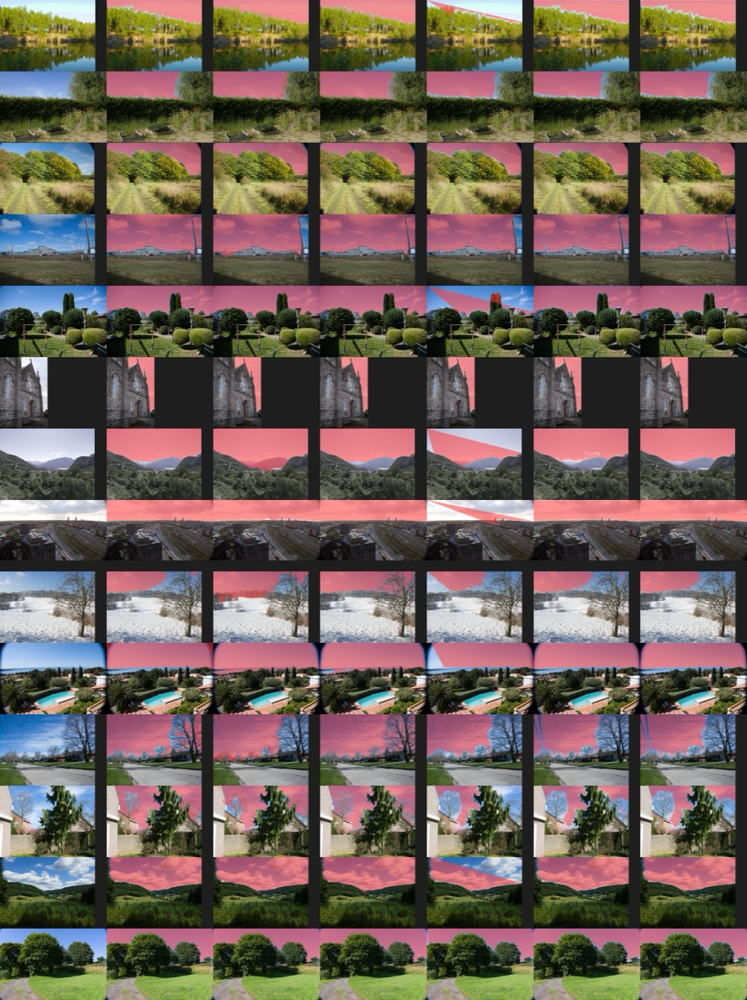
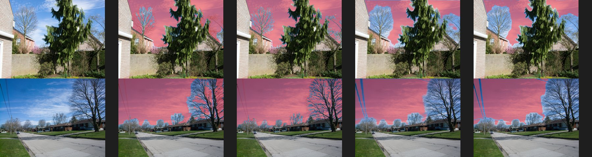
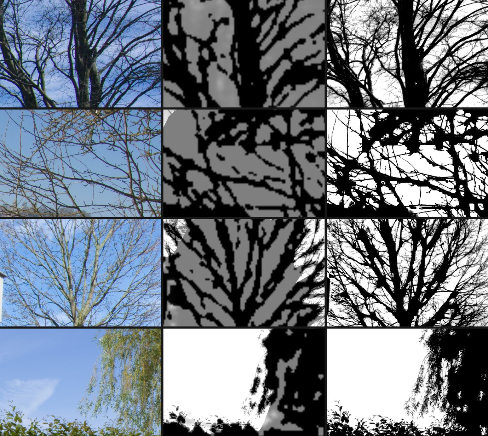
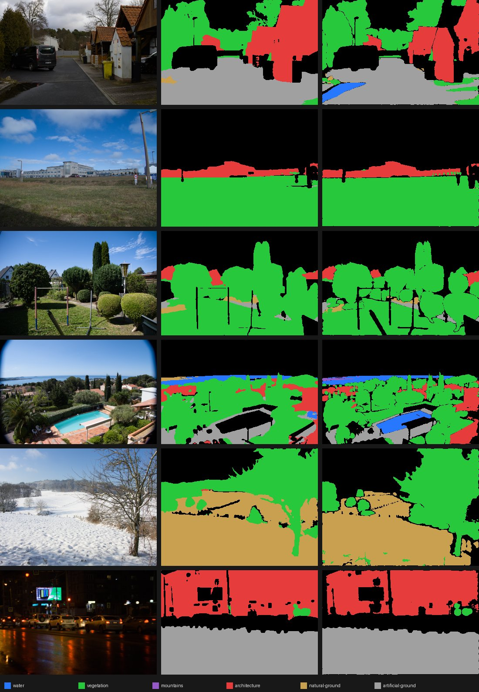

# MSK-17: Sky mask bake-off

Run 2026-10-01 on an M1 Ultra (macOS 26.6), by `research/prototypes/masking/sky_bakeoff.py`. Raw scores are in `research/prototypes/masking/sky-bakeoff-results.json`. Conventions follow [`_conventions.md`](_conventions.md).

## Question

Redlamp's Sky mask has no Apple API behind it. Can an open model, or Segment Anything without any training, give a Sky mask good enough to ship, or do we need to train our own head (MSK-12)?

## Method

- **Photos:** the 14 photos tagged "sky" in the CC0 look-development set (`research/look-dev/manifest.json`), as analysis renders: the default develop, sRGB, 2048 px. That is what every AI mask is computed from.
- **Reference:** OneFormer (ADE20K, Swin-L), the strongest open semantic segmenter. It is trained on ADE20K, whose terms are non-commercial, so it can never ship. It stands in for ground truth until a hand-labelled set exists (see Limits).
- **Scores:** IoU, and a boundary F-score that counts edges within 1% of the image diagonal, both against the reference. Times are wall clock per photo, including the CLI opening the raw.

| Candidate | What it is | Licence verdict |
| --- | --- | --- |
| Classical estimate | `SkyEstimator`: bright, smooth, sky-coloured pixels grown from the top edge, then a guided filter | Ours |
| Auto-prompted SAM 2.1 | Segment Anything 2.1 tiny, prompted with up to four points deep inside the classical estimate (`SkyEstimator.seeds`) | Apache-2.0 weights by the data's owner (Meta). Shippable once DEC-02 is accepted |
| Florence-2 base | `<REFERRING_EXPRESSION_SEGMENTATION>` "sky", rasterised polygons | MIT weights; training data (FLD-5B) unclear. A labeller at most |
| OneFormer ADE20K | The ceiling | Non-commercial data: never ships |
| Depth Anything 3 Mono-L (sky output) | The sky head of `depth-anything/DA3MONO-LARGE` (0.35B parameters, 1.2 GB), at 504 px, PyTorch on the GPU (MPS) | Apache-2.0 weights; data "public academic datasets" (not audited): UNCLEAR |
| SAM 3 (text prompt "sky") | `facebook/sam3` (0.85B parameters, 3.4 GB) through Transformers 5 on the GPU (MPS), every instance merged; `sam3_sky.py` in its own environment | Custom SAM License (gated; pass-through and no-reverse-engineering terms): UNCLEAR, counsel |

## Results

| Candidate | Found sky | Mean IoU | Mean boundary F | Worst IoU | Time per photo |
| --- | --- | --- | --- | --- | --- |
| **Redlamp, both models** (`REDLAMP_SKY_METHOD=auto`): refined SAM 2.1 averaged with DA3, in Swift | 14 / 14 | **0.945** | **0.938** | 0.757 (FZ28) | 5.5–8.8 s (CLI, cold) |
| **Redlamp, SAM 2.1 refined between branches**, in Swift | 14 / 14 | 0.940 | 0.918 | 0.695 (FZ28) | 1.9–5.4 s (CLI, cold) |
| **Redlamp, Depth Anything 3** (Core ML, 8-bit weights), in Swift | 14 / 14 | 0.931 | 0.888 | 0.699 (Coolpix P7700) | 4.5–5.8 s (CLI, cold); 0.13 s once loaded |
| Mean of unrefined SAM 2.1 and DA3 (Python) | 14 / 14 | 0.945 | 0.937 | 0.709 (FZ28) | both |
| Depth Anything 3 Mono-L sky (PyTorch) | 14 / 14 | 0.929 | 0.887 | 0.697 (Coolpix P7700) | 0.26–0.61 s warm (MPS) |
| SAM 3, text prompt "sky" | 14 / 14 | 0.924 | 0.894 | 0.579 (FZ28) | 0.95 s warm (MPS), 72 s to load |
| Auto-prompted SAM 2.1, unrefined | 14 / 14 | 0.920 | 0.894 | 0.585 (FZ28) | 1.6–3.1 s (CLI, cold) |
| Classical estimate | 14 / 14 | 0.898 | 0.821 | 0.622 (Coolpix P7700) | 1.3–6.5 s (CLI, cold) |
| Florence-2 base | 14 / 14 | 0.661 | 0.657 | 0.138 | 19–80 s (CPU) |

The rows in bold are Redlamp's second round, measured through `redlamp mask` and scored against the same reference; the other rows are the first round, run in Python. These score the region each method finds. Redlamp now also solves every edge pixel at full size, which this reference can't measure: see the third round below.

The SAM–DA3 combination averages the two soft masks. Their union scores 0.931 / 0.892 and their intersection 0.918 / 0.888, so neither helps. Adding SAM 3 to any mix doesn't help either: SAM 2.1 with SAM 3 scores 0.924 / 0.895, DA3 with SAM 3 0.923 / 0.889, and all three 0.930 / 0.902.

The columns of the contact sheet are the render, OneFormer, the classical estimate, Depth Anything 3, Florence-2, auto-prompted SAM 2.1 and SAM 3.

- **Auto-prompted SAM 2.1 is the best shippable candidate.** Its edges are clearly better: boundary F is 0.894 against 0.821. Where the classical estimate fails it recovers most of the sky. On the Coolpix P7700 (a tree line) it scores 0.937 against 0.622, on the Panasonic TZ200D 0.947 against 0.869, and on the Pixel 6 Pro (distant mountains the estimate spills into) 0.976 against 0.876.
- **It has one clear failure.** On the Panasonic FZ28 it scores 0.585 against the estimate's 0.808: SAM took a sub-region of a cloudy sky as "the object".
- **The classical estimate is good on clear skies** (0.94–0.99 on eight of the photos). It fails where the sky's brightness or colour changes across the frame.
- **Depth Anything 3's sky head is the best single model** on overlap (IoU 0.929), close to SAM on edges, and fast: about 0.3 s on the GPU once loaded. Its failures are the opposite of SAM's. It loses the Coolpix tree line (0.697, where SAM gets 0.937), and keeps the FZ28's cloudy sky that SAM drops (0.839 against 0.585).
- **SAM 3 adds nothing over SAM 2.1.** Asked for "sky" by text, its score is within 0.02 of SAM 2.1's (seeded from the classical estimate) on every photo, and it fails on the same two. It is also 0.85B parameters and under a custom licence.
- **Where the SAM models fail, it is bare trees.** Both treat a leafless tree crown as an object and cut around its silhouette, leaving out the sky seen between the branches (and power lines). OneFormer and DA3 count that sky as sky, and so would an editor darkening it. So the lower scores on those photos are a real weakness, not only the reference's bias:

- **Averaging the two is clearly best:** 0.945 / 0.937, with a worst case of 0.709. Each covers the other's failure.
- **Florence-2 is not competitive.** Its polygons are coarse and it often selects only part of the sky. It is also far too slow on the CPU to be interactive.

## Second round: sky between branches, and Depth Anything 3 in Swift

Two follow-ups to the bare-tree failure, both now in Redlamp.

**Refining SAM between branches** (`SkyEstimator.refineBetweenBranches`, prototyped in `branch_refine.py`). The sky's colour is learnt in OKLab from where SAM is sure (above 0.9), as a median per band of rows, because skies brighten towards the horizon. Pixels of that colour are then added if they are four-connected to SAM's sky and lie no lower than the sky reaches in nearby columns, plus 4% of the height. The falloff is soft, so pixels mixed with thin twigs get partial coverage. It needs no model. It raises SAM from 0.920 / 0.894 to 0.940 / 0.918.

- On the two bare-tree photos, the FX150 goes from 0.779 / 0.429 to 0.799 / 0.484 and the FZ28 from 0.585 / 0.519 to 0.695 / 0.669. The rest of the FZ28's loss is the part of its cloudy sky SAM leaves out, whose colour is too far from the sure sky for the rule to add safely.
- Letting the fill cross small gaps (bridging) was tried and rejected: it leaked into the Coolpix tree line.

**Depth Anything 3 on Core ML** (`DepthAnything3`, converted by `convert_da3.py` and `compress_da3.py`). There is no official conversion. DA3 Mono-L exports through `torch.export` with PyTorch 2.7 and coremltools 9 (`.venv-coreml`), at a fixed input size. One model gives both a sky mask and relative depth, so Depth Range uses it too when it is installed.

Portrait photos need their own input. Turning them a quarter for the landscape input (the first version) hid small skies: on a portrait street scene, the patch of sky between two buildings is 0.75% of the frame upright and 0.31% sideways, under the 0.5% Redlamp then required, so Sky found nothing. The package now has two functions, `landscape` (504 × 336) and `portrait` (336 × 504). Their weights are identical, so Core ML stores them once (manifest version 2).

| Package | Size | GPU, once loaded | Neural Engine |
| --- | --- | --- | --- |
| fp16, one orientation | 637 MB | 89 ms | slower, and 5–20 minutes to compile on first load |
| 8-bit weights, both orientations (manifest v2) | 336 MB | 125 ms either way | as above |

Small skies also no longer fall through: a sky covering 0.1% of the frame is kept (it was 0.5%), and when the classical estimate finds no sky to seed SAM in (it needs 2% of the frame), SAM is seeded inside DA3's sky instead.

It runs on the GPU. In Swift it scores 0.931 / 0.888, matching PyTorch's 0.929 / 0.887, after reading its output with the multi-array's strides (row padding first gave streaks and 0.663).

**Both together** (`auto`, the default when both models are present): the mean of refined SAM and DA3 scores 0.945 / 0.938. The worst photo improves from 0.709 to 0.757 (FZ28, where DA3 alone gets 0.855 but the sky SAM leaves out pulls the mean down). On the FX150 it is 0.860 / 0.886. On the Coolpix tree line it is 0.911, against DA3's 0.699 and the classical estimate's 0.622.

The method can be forced with `REDLAMP_SKY_METHOD` set to `sam`, `da3` or `classical`.

## Third round: every twig, per pixel

In use, Sky still struggled with trees and anything else partly covering the sky. The cause wasn't the models' choice of region but resolution: SAM predicts at 256 × 256, DA3 at 504 × 336, and masks were stored at 2048 px, so a twig or wire one or two pixels wide at full size was gone before any refinement ran. The guided filter that refined edges (luminance only, radius 4–8 px) blurs fine structure into a halo rather than giving each mixed pixel its own coverage. The bake-off above can't see this: OneFormer cuts crowns out whole, and its boundary score forgives 1% of the diagonal (25 px).

**An edge benchmark with known coverage** (`edge_bench.py`). Twelve scenes at 4096 px, the size the renderer stores masks at: real skies (the all-sky bands of five bake-off photos, without vignetted corners, plus clear, sunset and overcast gradients) behind procedurally drawn bare trees (branches tapering to sub-pixel twigs), leafy trees, power lines and a skyline with antennae. They are drawn at 4× supersampling, so coverage is exact, and composited in linear light with a lens blur and sensor noise. Scores: the mean coverage error where the truth is mixed or within 16 px of it (band error), the same over thin structures (under 4 px wide), and leaks into solid foreground.

**`SkyMatte`** (prototyped in `sky_matte.py`) takes the coarse sky and solves every pixel near its edge at 4096 px. Sky is smooth, so the sky colour behind any pixel is estimated from the sure sky around it (pull-push from 4 × 4 blocks that are entirely sure sky); the foreground's from the sure foreground, weighted towards pure pixels. A pixel's coverage is where its colour lies between the two in linear light: blue-screen matting with a known, smoothly varying backing (Smith and Blinn, 1996; pull-push from Gortler et al., 1996, so any patents on either have long expired). It solves three regions:

- a band of 1.2% of the long side around the coarse edge;
- up to 6% into the coarse foreground, sky-coloured pixels connected to the sky through sky-coloured ones (a crown SAM cut out whole);
- inside the coarse sky, pixels clearly not sky (twigs and wires the models never saw).

Where the two colours are too close to tell apart, the coarse mask stays. Two passes; the second learns its colours from the first's result.

SAM and DA3 are now arbitrated rather than averaged: where one covers under 30% of the other's sky, it missed the sky (DA3 misses some overcast skies whole) and the other stands alone. Averaging would leave such a sky half covered, with no sure sky to learn its colour from. On the 14 photos, arbitration scores the same as the mean (0.945 / 0.938).

| On the edge benchmark (12 scenes) | Band error | Thin-structure error | Thin structures kept out of the sky | Leak into foreground | IoU |
| --- | --- | --- | --- | --- | --- |
| Classical estimate | 0.307 | 0.394 | 37% | 4.1% | 0.773 |
| SAM 2.1 refined | 0.209 | 0.293 | 79% | 0.2% | 0.929 |
| SAM and DA3, averaged | 0.209 | 0.280 | 65% | 2.3% | 0.667 |
| SAM and DA3, arbitrated | 0.179 | 0.259 | 66% | 1.4% | 0.882 |
| **Arbitrated, then `SkyMatte` (Redlamp now, in Swift)** | **0.050** | **0.114** | **99.8%** | **0%** | **0.988** |
| Classical estimate, then `SkyMatte` | 0.210 | 0.349 | 49% | 1.3% | 0.800 |
| The truth shrunk to 256 px, then `SkyMatte` (a perfect coarse model) | 0.028 | 0.072 | 99.9% | 0% | 0.995 |

The rows of the image are the FX150, the Coolpix P7700, the FZ28 and the EOS R50's willow; the columns the render, the arbitrated coarse mask, and the mask with `SkyMatte`.

- **Edges are four times more accurate,** and close to what a perfect coarse model would give (0.050 against 0.028). Twigs and wires survive at full size.
- **Against OneFormer on the 14 photos it scores lower, 0.932 / 0.888,** because OneFormer itself cuts crowns out whole (on the Coolpix it marks the whole crown as not sky; `SkyMatte` gives the sky between the twigs back) and counts the TZ200D's vignetted corners as sky. The edge benchmark is the measure for edges now.
- **Its one leak:** a sea whose blue matches the sky at the horizon gets a thin line of partial coverage.
- **Cost:** about 1.5 s on an M1 Ultra (the 4096 px render and two passes), for a mask computed once. A cold Sky is 5.5–7 s in the CLI, most of it loading the models.

`REDLAMP_SKY_MATTE=off` keeps the models' edges, for comparison.

## People: hair and beards

Person and subject masks had the same problem worse: Vision's mattes are stored at 1536 px and refined with the same luminance guided filter, so stray hairs and beard curls were lost.

**A colour model, as for sky, doesn't hold up** (`refine_subject` in `sky_matte.py`, research only). On `hair_bench.py`, a synthetic benchmark of a head with 600 strands and a curly beard over real backgrounds, it keeps 61% of strands (the coarse silhouette keeps none). But a person and what's behind them aren't smooth like a sky: on real portraits it makes visible mistakes (background above a head called person, holes under a beard), and against the reference below it scores worse than Vision's own mask (0.127 against 0.077).

**Closed-form matting does** (`ClosedFormMatte`, prototyped in `cf_matte.py`): Levin, Lischinski and Weiss (2008). Within every 3×3 window coverage is taken to be a linear function of colour, and the coverage that best fits that across an uncertain band is solved for, with sure subject inside the band and sure background outside it. It needs no estimate of the background behind a strand. Its matrix is never built: it is applied through 3×3 window sums (He, Sun and Tang, 2010), and conjugate gradients run over the uncertain pixels only, in double precision, preconditioned by the diagonal and started from Vision's mask, coarse to fine (400 iterations at about 1500 px, 100 at 2048, 40 at 4096).

- **The band:** 0.6% of the long side inside Vision's edge, 2% outside it (where hair pokes out), plus wherever Vision is itself unsure (between 10% and 90%: it leaves much of a dancer's costume grey).
- **Regularisation:** ε = 10⁻⁵. Smaller follows JPEG blocks; larger smooths strands away.

**Measured on real portraits** (`portrait_bench.py`). There is no hand-matted set, so ViTMatte (Composition-1k: research-only data, never ships) stands in for ground truth, given the widest trimap so it decides every pixel any candidate might. Four stills (a man with a grey goatee, a man with grey hair in a dark, low-key photo, a woman with dark hair against a busy background, an older woman), and a raw of a dancer in a feathered costume:

| Error around the edge, against ViTMatte | Four portraits | Dancer (raw, 4096 px) |
| --- | --- | --- |
| Vision's mask (before) | 0.085 | 0.182 |
| **`ClosedFormMatte` (Redlamp now, in Swift)** | **0.067** | **0.122** |
| Closed-form, pymatting (the same solve, for reference) | 0.068 | 0.120 (2048 px) |
| KNN matting / learning-based matting (pymatting) | 0.103 / 0.125 | not run |

It brings back beard curls and the curls at the side of a head, and it sharpens soft edges along shirts and hands. Two weaknesses remain: on dark backgrounds it leaves a light haze above grey hair (ViTMatte does too), and on JPEGs it can follow compression blocks in dark areas. Raws don't have those.

**Cost:** 0.3–1.2 s for a 2048 px photo; on a 4096 px render with a large uncertain area (the dancer, 3 million uncertain pixels), 2.9 s on top of Vision's 0.75 s. It runs once per mask. `REDLAMP_EDGE_MATTE=off` keeps Vision's edges, to compare.

**Objects too.** Segment Anything's selections (256 × 256 logits, then the same guided filter) go through `ClosedFormMatte` as well; the hover preview keeps the model's edges, to stay instant. On four selections from the same stills (a bicycle, a helmet with its visor, a woman with her hair, a toy figure), against ViTMatte given the widest trimap: 0.165 to 0.120, every one better, for 0.2–0.6 s more per selection. The same 0.6% inward band is best (1.5% scores 0.154, 3% 0.180). Its limit is the model's region: Segment Anything fills a bicycle wheel as a disc, and since the disc's middle is sure, no matting opens the spokes up (the reference doesn't either). A mask sure of nothing on one side (a thin object Segment Anything is never confident of) is left as it is.

**A missed head.** In the low-key portrait, Vision's person segmentation left out the man's head entirely, while its Subject mask had it. People masks are now checked against detected faces: a face mostly outside every person mask gets the part of the Subject mask connected to it, added to the person it overlaps most.

**Licences and patents.** Both papers' methods are ours to implement, but closed-form matting and the window-sum solve may be patented; they are added to the freedom-to-operate search with the guided filter (DEC-05).

## Getting masks ready

Opening the Masking tool now warms AI masks in the background, at low priority, for the open photo and every photo opened after it: the 2048 px and 4096 px analysis renders (both cached per photo), Segment Anything (loaded, its embedding of the photo computed, and one throwaway decode, since Core ML prepares the decoder's GPU work on its first prediction) and Depth Anything 3 (its depth and sky). Sky also no longer pays for an Objects edge solve on the Segment Anything mask it starts from: `SkyMatte` solves those edges.

Measured on the dancer raw (Release build, M1 Ultra), first mask of each kind after the photo opened:

| | Before | After warming up |
| --- | --- | --- |
| Sky | 3.1 s | 1.3 s |
| People | 4.1–5.1 s | 3.6–4.3 s |
| Subject | 2.5–2.8 s | 2.1–2.6 s |
| Objects | 1.4–1.8 s | 1.0–1.3 s |

What remains is the edge solvers themselves: 1–3 s for `ClosedFormMatte` at 4096 px, and for `SkyMatte` about 0.45 s, down from 1.04 s once its remaining single-core loops (the pull-push downsampling, the sample and result updates, the colour conversion and the mask resize, which `ClosedFormMatte` shares) were split across cores, with bit-identical output. A GPU port of `SkyMatte` would save at most a few hundred milliseconds more; its two flood fills (65 ms each) are the largest serial part left. Halving the closed-form iterations would save 0.2–0.6 s, and costs nothing on the portraits, but loses accuracy where Vision is unsure of much (the dancer: 0.122 to 0.131); they stay.

**Closed-form matting on the GPU was tried and set aside.** Metal kernels for the window sums, the matrix application and the conjugate-gradient scalars matched the CPU to 2 × 10⁻⁶ per application. But Apple GPUs have no double precision, and at the ε that makes good mattes (10⁻⁵) the system is too ill-conditioned for single precision: a probe solve agreed with the CPU to 10⁻⁴ at ε = 10⁻², 0.008 at 10⁻³, 0.14 at 10⁻⁴ and 0.28 at 10⁻⁵ (worst pixel). Rewriting the fitted value centred on each window's mean, and freezing the iteration once converged, weren't enough. Flexible conjugate gradients in double on the CPU, with short GPU solves as search directions, made it converge (portraits 0.073 against the CPU's 0.067, the dancer 0.129–0.142 against 0.122), but the CPU's share (window statistics, the double-precision applications, the trimap) then dominated: no faster on portraits, at best 1.5 s faster on the dancer (2.6 s against 4.0 s), always less accurate. Raising ε until single precision copes costs as much quality (portraits 0.076 at 10⁻⁴, 0.083 at 3 × 10⁻⁴, against Vision's 0.085). What would make it pay is a GPU-side double emulation or a multigrid preconditioner, both large; for now the CPU solve stays.

## Landscape: SAM 3 text prompts

Lightroom splits Landscape into Sky (done above) and six more classes: Water, Vegetation, Mountains, Architecture, Natural Ground and Artificial Ground. `landscape_bakeoff.py` runs OneFormer (ADE20K; never ships) as the reference on all 40 look-development photos, its 150 classes grouped into those six; `sam3_landscape.py` asks SAM 3 for each class by text (water, sea, lake, river; tree, grass, lawn, meadow, bush, plant; mountain, hill; building; ground, sand, rock, dirt; road, pavement, floor), every instance merged. As in Lightroom the classes are then made exclusive, by precedence (water, vegetation, architecture, mountains, artificial ground, natural ground).

| Class | Photos with it | Mean IoU against OneFormer | False positives (photos without it) |
| --- | --- | --- | --- |
| Water | 5 | 0.833 | 3.0% |
| Vegetation | 30 | 0.687 | 0% |
| Mountains | 4 | 0.655 | 0.25% |
| Artificial ground | 19 | 0.611 | 0.17% |
| Architecture | 19 | 0.592 | 0% |
| Natural ground | 14 | 0.351 | 0.7% |

- **SAM 3 finds every class, with Lightroom-like regions.** Several of its "errors" are the reference's: it marks a swimming pool and a street puddle as water, which ADE20K has no label for.
- **Natural ground is a taxonomy question as much as a model one.** ADE20K files grassy fields under natural ground ("field"), the lawn prompts file them under vegetation; without exclusive classes, "ground" also fires on roads (11% false positives). Where Lightroom draws that line needs checking against Lightroom itself.
- **It is not shippable as it stands.** SAM 3 is 0.85B parameters (3.4 GB), takes 17–27 s per photo for all six classes on the GPU (MPS, through PyTorch), has no Core ML conversion, and is under Meta's custom SAM License (gated; pass-through and no-reverse-engineering terms), which needs counsel.
- **The routes from here:** counsel on the SAM License, then a Core ML conversion of SAM 3's image encoder and text-prompted decoder (large, like Depth Anything 3's, with prompts cached per class); or the trained head of MSK-13 on data we have rights to (the CC-licensed part of COCO-Stuff, whose stuff classes map onto these six), with SAM 3 as a labeller if its licence allows that much.

## Decision

- **Sky ships as SAM 2.1 refined between branches, then `SkyMatte`** when SAM's model is on the Mac, with the classical estimate (also through `SkyMatte`) as the fallback. An embedded sky matte, when the file has one, wins over both.
- **Depth Anything 3 is an evaluation model** (Settings › Models, with evaluation models turned on), behind the same gate as SAM 2.1. With it installed, Sky arbitrates between both models before `SkyMatte` (band error 0.050 on the edge benchmark). It is not published: its manifest is marked `published: false`, so the app won't download it, and the licence gate refuses to clear it. Before it can be cleared it needs a training-data audit ("public academic datasets", unaudited) by counsel, with DEC-02, and a hosted copy of the converted package.
- **Subject, Background, People and Objects ship through `ClosedFormMatte`** (error around the edge 0.085 to 0.067 against ViTMatte on four portraits, 0.165 to 0.120 on four object selections), with missed heads filled in from the Subject mask. Embedded iPhone mattes and face parts are left as they are. Pending DEC-05.
- **No Sky head training (MSK-12) for now.** Revisit it if hand-labelled scores show tree lines and hair need better than SAM's edges.
- **Landscape:** SAM 3 by text gives usable masks for all six classes (water 0.833 to natural ground 0.351 against OneFormer), but at 3.4 GB, 17–27 s per photo and under the SAM License it waits on counsel and a Core ML conversion; otherwise a trained head (MSK-13). People parts still need a trained head: every open model that knows those classes (OneFormer, Mask2Former, SegFormer) is trained on non-commercial data.

## Limits

- **The reference is a model, not ground truth.** Scores measure agreement with OneFormer, so a candidate that beats OneFormer at an edge is scored down for it. The next step is a hand-labelled set: 50 photos we have rights to, labelled by drafting with SAM 2.1 and checking by hand.
- **The edge benchmarks are synthetic.** Their skies and backgrounds are real, but trees, wires and hair are drawn: straighter and more regular than the real thing. They measure edges given a region, not whether a model finds the region (DA3 misses some of their frame-filling skies, which arbitration covers).
- **The set is small** and nearly all landscapes in daylight. Sunsets, night, fog, snow fields and window reflections are missing.
- **Running DA3 here took workarounds.** Its package requires xformers (which doesn't build on macOS, and it falls back without it). `pycolmap` and PyTorch each load an OpenMP runtime, so the script needs `KMP_DUPLICATE_LIB_OK=TRUE`. Its preprocessing pool is forced to run sequentially.
- **SAM 3 runs in its own environment** (`.venv-sam3`, Transformers 5), because Florence-2's remote code needs Transformers 4.x.
- **Shipping SAM waits on DEC-02 (counsel).** Until it is accepted, the model is offered only with evaluation models turned on (Settings › Models).
