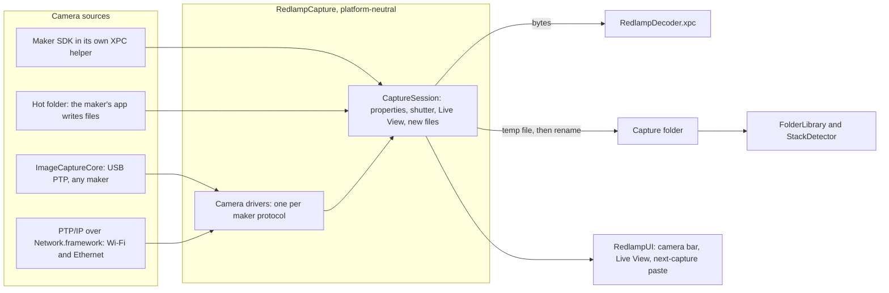

# Tethered capture in Redlamp: architecture, workflow, testing and support

Evidence for the [tethered capture findings](../tethering-findings.md): how tethering would fit Redlamp's code and its way of working, checked against the code on `main` at e86e6e2 (5 October 2026). "Assessment" marks proposals; the rest describes the code as it is.

## 1. How a shoot would run

**Assessment.** Redlamp is "an editor, not a catalog": a working set of folders, with edits in sidecars beside the photos. That is the model Capture One recommends for tethering, its Sessions (plain folders), not its Catalogs ([teardown](TC-capture-one-teardown.md#the-next-captures)). So tethering needs no library:

1. **Start a shoot.** Choose a capture folder (it becomes a Folders root and opens in the filmstrip), a file-name template with a counter, what the next captures get (the default edit, the last capture's edit, a recipe, or a Copy Settings checklist from a chosen photo), where frames are saved (Mac, card, or both) and an optional second folder for backups.
2. **Shoot.** Each frame is written to the capture folder, shows in the filmstrip and, if the photographer isn't busy on another photo, opens in Develop with the next-capture settings already applied. The embedded preview shows first, the developed raw replaces it, and AI masks carried by the settings are recomputed after it is on screen, as Capture One 16.8's "When Preview Is Ready" does.
3. **Control the camera.** A camera bar (exposure mode, shutter, aperture, ISO, compensation, white balance, drive, file format, battery, frames left) and a Live View window with zoom, focus, grid, a composition overlay, focus peaking and clipping.
4. **Review.** Ratings, flags and labels work as today. A client view on a second display (planned in Phase 4 as "Secondary display") follows the latest capture; later an iPad on the local network does the same.
5. **Focus brackets.** A run of frames with the same settings, under 30 s apart, already raises the filmstrip's "Focus stack detected" banner (`StackDetector.maximumGap`, `minimumFrames = 3`); with a camera that brackets focus, Merge opens the Stack workspace on the frames just shot. Capture One sends such runs to Helicon Focus.
6. **After the shoot** the folder is like any other.

## 2. What exists and what changes

| Area | Today | For tethering |
| --- | --- | --- |
| Folders | Read-only: "nothing on disk is created, renamed or moved" ([folders design](../../plans/2026-10-02-folders-design.md)). | A capture session writes new files into the folder the user chose for it. That is a deliberate exception for the owner to accept. |
| New files | `FolderWatcher` (FSEvents, 0.3 s latency) relists the directory; `FolderLibrary.merge` marks any file modified under 2 s ago as settling (`settleDelay = 2`) and requests its thumbnail only after it settles. | A complete capture would wait 2.3 s or more. The capture session should insert the item itself once the file is complete (written under a temporary name and renamed, so the watcher never sees part of one). |
| Decoding | `ImageDecoding.decode(_ url: URL)`; on the Mac the app reads the file and sends its bytes to `RedlampDecoder.xpc` (`DecodeServiceProtocol.decode(_ file: Data, path:)`). | Decode from the bytes as they arrive from the camera, in parallel with writing them to disk: one more entry point on the app side; the service already takes bytes. |
| Opening a raw | 70 to 250 ms for 24 to 26 MP on an unloaded M1 Ultra (README); 502 ms measured for the 24 MP Sony α7 III fixture on 5 October 2026 with the Mac busy (load average 26 to 45). | Transfer, not decoding, sets the pace for 60 MP files; see the probe. |
| Next-capture settings | Copy Settings with a checklist (`SettingsSelection`), Paste from Previous, recipes, and `settingsSync.run(.paste(source, selection), on: [photo])`, which pastes onto a photo that isn't open, in the background, and recomputes pasted AI masks for it. | Next Capture Adjustments is that paste, run on each new capture before it opens. |
| Stacks | `StackDetector` finds runs of three or more frames with the same body, lens, focal length, aperture, ISO and shutter speed, under 30 s apart, confirmed from thumbnails. | Works on tethered brackets unchanged; the session can also tell it which frames belong together. |
| Sandbox | The app isn't sandboxed; the decoder service is (`com.apple.security.app-sandbox` only). Phase 4 ships to the Mac App Store. | Tethering needs USB and network entitlements in the sandboxed build (see the routes note). |

## 3. Architecture

**Assessment.**

- **A `RedlampCapture` package** on the engine side of the boundary: platform-neutral (ImageCaptureCore and Network.framework exist on macOS and iPadOS), no UI imports, upstream `[.engineAPI]`, and added to `ENGINE_PACKAGES` in `scripts/check-engine-purity.sh`. `RedlampUI` gains it upstream. It holds the PTP containers, a driver per maker protocol (standard PTP, then each maker's extension), the capture session and its file handling.
- **Transports:** ImageCaptureCore for USB (it owns the device; the app sends PTP commands through `requestSendPTPCommand` and receives events through `ptpEventHandler`), PTP/IP over TCP with Network.framework for cameras on Wi-Fi or Ethernet, and the hot folder.
- **Makers' binary SDKs**, where one is the only route, each in its own XPC helper beside `RedlampDecoder.xpc`:
  - Crashes: a vendor library crashing takes down the helper, not the editor. Capture One's notes record crashes "during tethering with Live View enabled" on specific Sony cameras (16.7.1).
  - Licences: closed binaries stay out of the MPL-2.0 sources. The helper is built only where the SDK is present (the release Mac), and builds from source leave it out, as builds from source leave out Sparkle's update feed today.
  - Sandbox: each helper gets only the USB or network entitlement it needs.
- **Live View:** the camera's JPEG frames decoded by ImageIO into IOSurfaces and drawn by the canvas as rendered frames are, with grid, overlay image, focus peaking (UX-06) and clipping as Metal passes. The recipe's look can be applied to the frames as a preview, labelled as approximate, since the camera has already rendered them.
- **Ordering and safety:**
  - Every frame is on disk (or the card) before anything else happens to it.
  - The camera's own card copy is the default, where the camera allows it.
  - Reconnection imports frames shot while unplugged, as ReTether does.
  - Pasted settings never block a frame from appearing.

## 4. Testing

**Assessment.**

- **No camera in CI.** A PTP simulator in the test target answers the standard operations and replays recorded sessions: requests, responses, events and data captured from real bodies on the owner's Mac or contributors' (our own recordings of the cameras' traffic, holding no maker code). Every driver is tested against these, including faults: a disconnect mid-transfer, a full card, a busy response, an unknown property.
- **Hardware in the loop** before each release that touches tethering: every body the owner can reach, wired and wireless, through a scripted session (connect, set each property, shoot ten frames, Live View for a minute, unplug and replug).
- **Reports from photographers,** as the camera bench does for decoding (CAM-14 to CAM-17): a "Test Your Camera's Tethering" check that connects, reads DeviceInfo, sets a harmless property and back, takes and times three frames, and sends only the capabilities and timings, never serial numbers. Support tiers follow DEC-28's pattern, so the cameras page says which bodies are verified, reported working, or reported broken. "No report, no support claim."

## 5. Support and upkeep

**Evidence.** Tethering fixes or notes appear in 88 of Capture One's 111 release notes in its help centre, from Capture One 12 to 16.8.6 ([teardown](TC-capture-one-teardown.md#3-upkeep)). Its troubleshooting starts with macOS permissions, then cables, hubs and power; since 16.5 it warns that macOS's Spotlight indexing of a camera's card slows the connection.

**Assessment.** Tethering is a standing commitment:

- Each new body and firmware needs checking, and makers' SDK or protocol releases need tracking (Sony's Camera Remote Command 2.02.00 added the α7R VI on 10 June 2026).
- macOS releases can change how cameras are claimed.
- Photographers need per-maker setup guides (Sony's network Access Authentication, Nikon's transmitters) and a troubleshooting page.
- The raw decoder gates it: tethering a body is no use until LibRaw reads its files. The Sony α7 V doesn't open today (CAM-13), and Capture One tethered it in 16.7.3.
