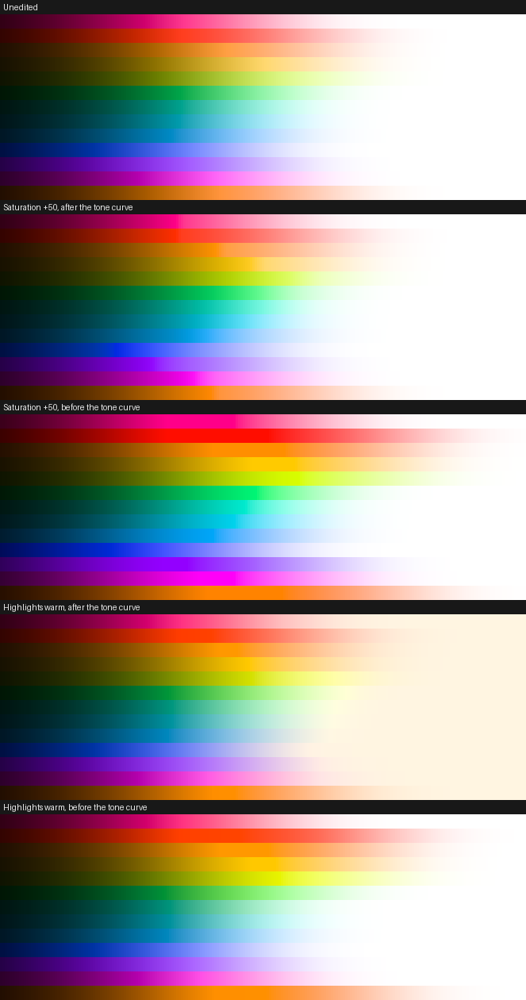
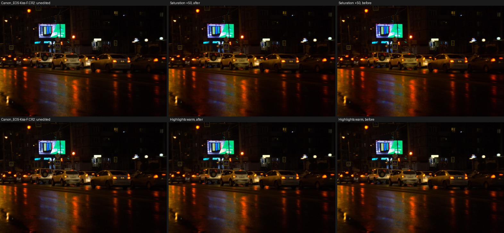

# Where the colour controls sit (TON-31)

Redlamp runs white balance, exposure and tone on scene-referred light, and Vibrance, Saturation, the Color Mixer, Color Grading and masks' colour controls after the tone curve, on display-referred values. The darktable study asked whether they should move before the tone curve, as darktable's do, and proposed keeping them where they are after an A/B on skies, skin and LEDs ([open question 2](../darktable/notes/B-color-science.md#5-open-questions)). A Reddit comment raised it again, and the owner accepted TON-31 on 5 October 2026, to settle before Point Color (TON-29) is built. This note is that A/B, written on 5 October 2026.

## Summary

- **Recommendation: keep the colour controls after the tone curve.** There, Saturation and Vibrance hold hue exactly, clip nothing, and leave the path every colour takes to white as the tone curve made it. Before the tone curve, the same edits push bright colours past the output gamut, where they clip and lose their gradation, hold them saturated about a stop further into the highlights, and move hue a little.
- **The numbers** (Saturation +50, 12 CC0 raws): after the tone curve, no pixel is newly clipped and hue moves less than 0.02° on average; before it, the final gamut map clips 7–12% of pixels on average (up to 22% in one photo), hue moves 1.3–2.6° at the 95th percentile, and bright areas gain 26–73% more chroma. On a wedge of saturated colours, they reach white 3.2 stops above middle grey after the tone curve, as they do unedited, and 4.4 stops above it before.
- **Why today's order behaves:** Saturation's boost approaches the output gamut's edge at each pixel's displayed lightness and hue (TON-07). That edge only exists after the tone curve. A version before it would need the output gamut's limit carried back through the curve, which is the display-referred knowledge it set out to drop.
- **What moving would buy:** bright colours that keep their colour longer (sunsets, LEDs), highlight tints that fade to white rather than tinting it, and colour controls that don't depend on the display's peak, which matters for HDR output. That last one is the real case for moving, and it belongs with Phase 4's HDR work, where this prototype can run against an HDR tone curve.
- **For TON-29:** Point Color goes beside the Color Mixer, after the tone curve, as [its design](../../plans/2026-10-05-point-color-design.md) put it.

## 1. Method

[`research/prototypes/colour/stage_ab.py`](../../../research/prototypes/colour/stage_ab.py) ports the tone curve and the colour block from `rl_develop` (`Develop.metal`) to NumPy and runs them both ways on the same scene light.

- **After** is the kernel's arithmetic. Checked against the `redlamp` CLI: a 270-patch chart (a 16-bit TIFF, which Redlamp opens through the tone curve's inverse) rendered with each of the nine edits below differs from the port by 0.05 levels on average and 1.05 at most (8-bit).
- **Before** applies the same controls to scene light just before the tone curve (white point 1), in forms that don't depend on exposure: chroma scaled at constant OKLab lightness and hue, approaching the edge of positive Rec.2020 (scene light has no upper bound; the tone curve and the final gamut map then take it to the display); hue rotated by the same angle; the Color Mixer's and Color Grading's luminance as exposure, sized so middle grey moves as far on screen as after the curve; Color Grading's offsets in proportion to lightness.
- **The same weights in both:** which band, how colourful, skin protection, and shadows to highlights all come from the pixel's displayed colour before the edit. Only where each change is applied differs. Vibrance suffers from this before the curve (section 2).
- **Edits,** each alone on the default edit: Saturation +50 and −50, Vibrance +50, the Color Mixer's Blue saturation +60 and luminance −40, Orange saturation +40 and hue −30, and Color Grading's Highlights warm (hue 45°, saturation 50) and Shadows teal (hue 200°, saturation 50).
- **Photos:** 12 CC0 raws from the look-development set (`build/look-dev`, from raw.pixls.us): six skies (Canon EOS R50, Sony ILCE-6700, Panasonic DC-TZ200D, Fujifilm X-S20, Google Pixel 6 Pro, Samsung Galaxy S21 Ultra), three night and tungsten scenes (Canon EOS Kiss F, Sony ILME-FX3, Panasonic DC-S5), and three saturated still lifes (Sigma fp with a colour chart, Pentax KF, Sony ILCE-9M3). LibRaw (rawpy) decodes them to linear Rec.2020, at 1200 px, and each is scaled by one exposure so its median displayed lightness matches the CLI's default render (−0.2 to +3.1 stops; the phones' DNGs need the most). Skin: the four portraits from the masking edge-case set, JPEGs opened through the tone curve's inverse as Redlamp opens a JPEG, with skin taken as the person mask's pixels between 30° and 90° of hue (36,000 to 59,000 a face; not committed).
- **Wedges:** 13 hues (every 30°, and skin's 55°), from 4 stops under middle grey to 7 over it in steps of 0.05, at 80% of the chroma sRGB holds at middle grey's lightness, and again at 80% of what positive Rec.2020 holds, as LEDs and lasers are.
- **Measures,** on the final output in OKLab: how far hue moves where colour is (chroma-weighted mean and 95th percentile, for edits that shouldn't move hue); the share of pixels the final gamut map has to clip that it didn't unedited (their gradation lost); the change in chroma in midtones (lightness 0.3 to 0.7) and bright areas (above 0.85); and on the wedges, the exposure where a colour's chroma falls under 0.02 on its way to white, its hue against the unedited one at the same exposure, the stops clipped by the final gamut map, and the largest step between neighbouring exposures, where an abrupt change shows.

## 2. Results

**Photos,** each group's mean (hue in degrees; chroma in OKLab units):

| Group, edit | Order | Hue moved (mean, 95th) | Newly clipped | Midtone chroma | Bright chroma |
| --- | --- | --- | --- | --- | --- |
| Skies, Saturation +50 | After | 0.0005°, 0.002° | 0% | +0.0236 | +0.0109 |
| | Before | 0.49°, 1.34° | 9.6% | +0.0267 | +0.0147 |
| Skies, Vibrance +50 | After | 0.0004°, 0.001° | 0% | +0.0144 | +0.0092 |
| | Before | 0.26°, 0.88° | 3.2% | +0.0148 | +0.0115 |
| Skies, Blue saturation +60 | After | 0.0002°, 0° | 0% | +0.0120 | +0.0071 |
| | Before | 0.48°, 1.55° | 2.0% | +0.0142 | +0.0098 |
| Night and tungsten, Saturation +50 | After | 0.02°, 0.14° | 0% | +0.0141 | +0.0052 |
| | Before | 1.12°, 2.61° | 7.0% | +0.0173 | +0.0090 |
| Night and tungsten, Orange saturation +40 | After | 0.01°, 0.09° | 0% | +0.0062 | +0.0001 |
| | Before | 0.62°, 1.85° | 2.6% | +0.0076 | +0.0005 |
| Saturated, Saturation +50 | After | 0.0005°, 0.001° | 0% | +0.0202 | +0.0078 |
| | Before | 0.99°, 2.52° | 12.3% | +0.0253 | +0.0098 |

- **Clipping per photo,** Saturation +50 before the curve: 22% on the Sigma fp's colour chart, 17% and 16% on the Samsung and Sony skies, 12% on the Sony FX3's tungsten interior, 8% on the night street; 0% only on the Pixel 6 Pro. After the curve it is 0% on all twelve.
- **Strength:** the same slider is 13–25% stronger in midtones before the curve, and 26–73% stronger in bright areas. The midtone difference could be calibrated away; the bright one is the curve no longer having the last word on highlights.
- **Color Grading:** its offsets aren't limited by the gamut in either order. Shadows teal newly clips 4–12% of pixels after the curve and 11–21% before it; Highlights warm clips under 2% either way.
- **Darkening a band** (Blue luminance −40) leaves chroma unchanged after the curve; before it, as exposure, the band also gets slightly denser (+0.0006 in midtones, +0.0017 in bright sky).

**Skin,** the four faces' mean:

| Edit | Order | Chroma | Hue | Lightness |
| --- | --- | --- | --- | --- |
| Saturation +50 | After | +0.0198 | 0° | 0 |
| | Before | +0.0203 | +0.73° | +0.0035 |
| Vibrance +50 | After | +0.0090 | 0° | 0 |
| | Before | +0.0088 | +0.35° | +0.0013 |
| Orange hue −30 | After | 0 | −7.41° | 0 |
| | Before | +0.0002 | −7.69° | −0.0003 |

Skin barely tells the two apart: its colours sit in the midtones, where the tone curve is nearly a straight line.

**Wedges,** the mean over 13 hues:

| Wedge, edit | Order | Reaches white | Hue against unedited | Stops newly clipped | Largest step (worst hue) |
| --- | --- | --- | --- | --- | --- |
| In sRGB, unedited | | +3.24 stops | | | 0.009 |
| In sRGB, Saturation +50 | After | +3.24 | 0.08° | 0 | 0.018 |
| | Before | +4.35 | 2.2° | 4.2 | 0.011 |
| In sRGB, Vibrance +50 | After | +3.24 | 0.07° | 0 | 0.009 |
| | Before | +4.24 | 1.3° | 2.5 | 0.016 |
| In sRGB, Saturation −50 | After | +2.88 | 0.8° | 0 | 0.009 |
| | Before | +2.34 | 1.3° | 0 | 0.009 |
| Beyond sRGB, unedited | | +4.35 | | | 0.009 |
| Beyond sRGB, Saturation +50 | After | +4.35 | 0.002° | 0 | 0.010 |
| | Before | +5.69 | 5.1° | 1.9 | 0.026 |
| Beyond sRGB, Vibrance +50 | After | +4.35 | 0° | 0 | 0.009 |
| | Before | +5.89 | 2.9° | 1.5 | 0.118 |

- **After the curve,** Saturation +50 deepens the darks and midtones and leaves the highlights' way to white as it was. **Before it,** red, yellow, magenta and blue stay saturated about a stop further into the highlights, in flat bands where the final gamut map clips them.
- **The one sharp step after the curve** is in blue-violet (270°), 1.65 stops under middle grey, where chroma jumps from 0.246 to 0.264 between neighbouring exposures, against a median step of 0.005; the `redlamp` CLI renders the same step (0.019) on that ramp. It looks like the gamut-relative boost meeting the gamut's corner at blue. It has nothing to do with where the controls sit, but it is today's rendering.
- **Beyond sRGB,** Saturation +50 before the curve makes an abrupt step from saturated to pale (2.6 times the largest step after it), most visibly in blue ([figure](../images/ton31-wedge-beyond-srgb.png)). Vibrance's step of 0.118, with chroma rising again after its peak, comes partly from the method: its weight follows the displayed colour, which the curve has nearly whitened, while the boost lands on scene light that is still saturated. A design made for scene light would weigh Vibrance by the scene's own colourfulness.
- **Color Grading's warm highlights,** after the curve, tint the brightest colours and white itself cream (hue 33° from unedited on average, with 3.3 stops clipped where tinted white leaves the gamut); before it, the tint fades into a neutral white (8.5°, 1.3 stops).

The sky photo ([figure](../images/ton31-sky.jpg), Sony ILCE-6700, CC0) shows the same more gently: before the curve, the sunlit grass and the brightest sky are pushed to the gamut's edge, and that's where its 16% of newly clipped pixels are.

## 3. What it means

- **Today's order is the safer one for sliders people drag.** Its saturation knows the output gamut at each pixel's displayed colour, so a boost slows down as it nears the edge instead of clipping, and the tone curve keeps deciding how bright colours reach white.
- **Before the curve looks different, not better.** More colourful highlights, highlight tints that fade to white and denser darkened bands are looks some photographers want, darktable's among them, and they come with clipping and abrupt steps unless the scene-referred version gets its own gamut mapping. Matching today's behaviour would mean carrying the output gamut's edge back through the curve.
- **HDR is the open part.** For HDR output (Phase 4) the tone curve gets a brighter peak; colour controls after it will need their ranges and the gamut limit for it, and ones before it wouldn't. Phase 4's HDR work should rerun this prototype against an HDR curve before deciding again.

## 4. Recommendation

- Keep the colour controls after the tone curve, with no new process version, and mark TON-31 done as decided once the owner agrees.
- Revisit with HDR output in Phase 4.
- Build Point Color (TON-29) after the Color Mixer, as designed.
- Found along the way, both in today's rendering and both needing a new process version to change, if the owner wants them changed:
  - Color Grading's offsets aren't gamut-relative, so strong shadow tints clip 4–12% of pixels. Limiting them as Saturation is limited would be a small change.
  - Saturation's boost steps abruptly once, in blue-violet near the gamut's corner at blue (the wedge above). Its cause isn't confirmed.

## 5. What wasn't checked

- The scene light comes from LibRaw, not Redlamp's decoder, so its highlight reconstruction, camera profiles and lens corrections aren't in it; each photo is matched to Redlamp's exposure by one number.
- The before forms are one reasonable design. Others, such as darktable's color balance rgb in its own colour space with its own gamut mapping, would behave differently; this prototype measures moving Redlamp's controls as they are.
- Skin comes from four JPEG portraits, and its pixels from people masks narrowed by hue.
- Masks' Hue and Saturation use the global arithmetic, scaled by coverage, so the global edits cover them. Masks' Color swatches (MSK-23, new on 5 October) tint as Color Grading's Global wheel does and weren't run on their own.
- The default Base Look's parameters are neutral; film looks and look tables weren't included.
- Lightroom wasn't measured: whether its colour controls behave like either order is unknown.
