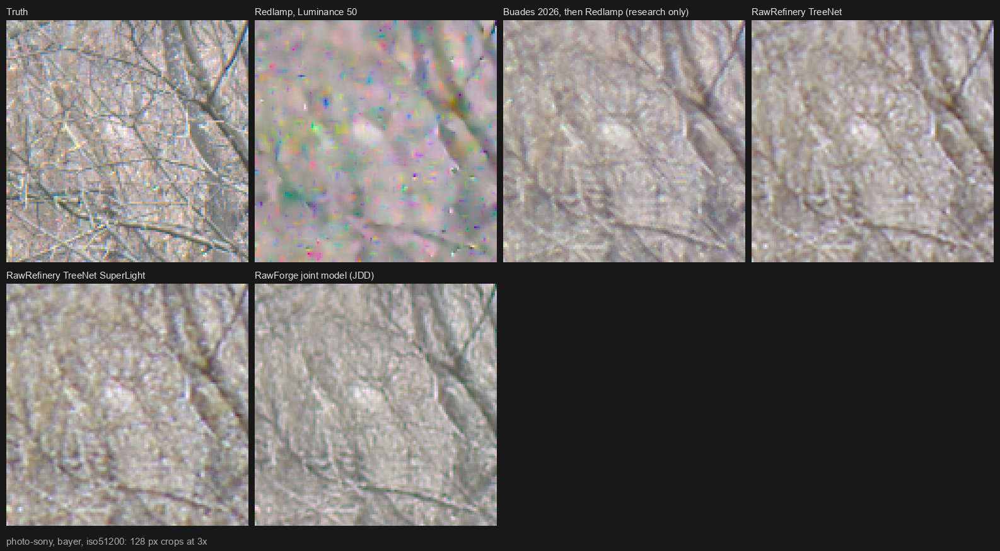
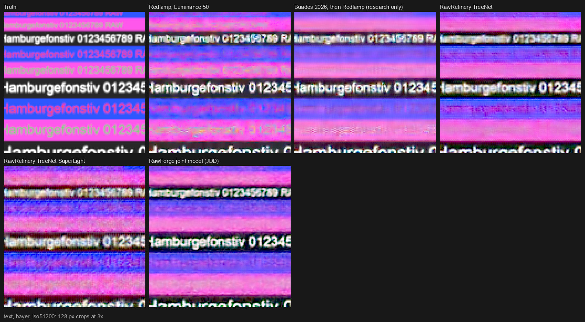
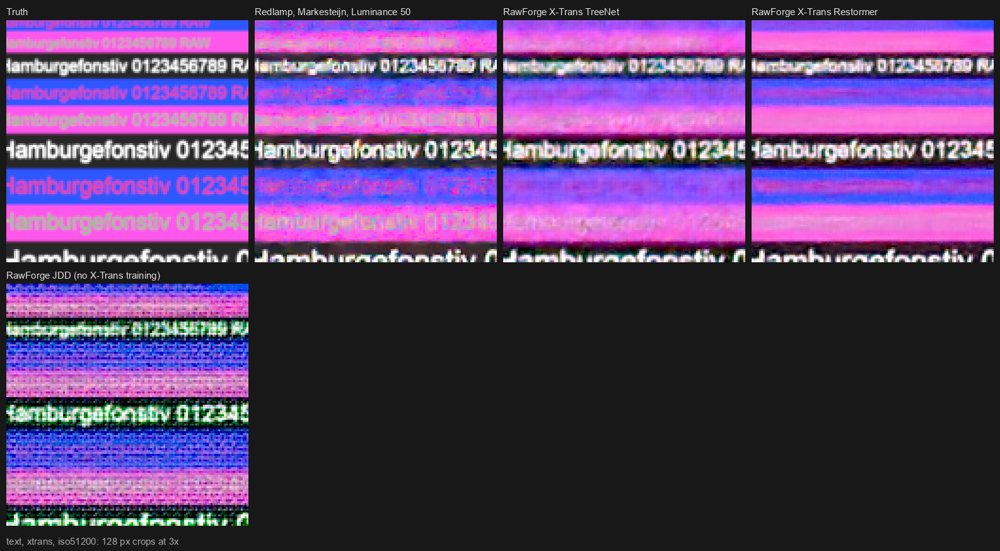

# What Redlamp Can Learn from RawRefinery

**Date:** 7 October 2026. **Subject:** RawRefinery (`main` at `4428865`, 17 December 2025; 1.3.4 on PyPI), its backend RawForge 0.2.3 (`main` at `79f1770`, 3 July 2026), the author's training code in Restorer (`JDD` branch at `ff9a22b`, 1 June 2026), RawHandler 0.2.2, and the models RawForge's registry downloads.
**Decisions and status:** on 7 October 2026 the owner added the study's proposals to the [research intake tracker](research-tracker.md): DN-15 as a Proposed row, and notes on DEC-36, DN-04, DN-07, DN-08, DN-09, DN-14 and INF-02 ([section 10](#10-decisions-and-tracker-rows)). The bugs in section 9 aren't reported upstream, and a message to the author about his weights is drafted for the owner to send.

RawRefinery is an open-source raw denoiser by Ryan Mueller, written in Python with PyTorch and Qt, for macOS, Linux and Windows. A photographer opens a folder of raws, previews a 512-pixel crop, and saves a denoised DNG for any raw editor to open. It started in July 2025 and has been an alpha since October 2025; on 7 October 2026 it had 99 stars and 21 issues on GitHub. Since December 2025 its processing has moved into a command-line backend, RawForge, which in 2026 added X-Trans models, an ONNX runtime, a local HTTP server and two models that demosaic and denoise the mosaic in one pass. Every model was trained by the author on one public dataset, RawNIND. This study asked what it does, how it does it, how well, and where it might fit in Redlamp's pipeline.

## How this was done

- RawRefinery, RawForge, Restorer (all three branches), RawHandler, TreeNet and Demosaicing were read from clones in `build/oss/` (gitignored) at the commits above, with their issues and release notes, on 7 October 2026. All are MIT-licensed; no code was copied into Redlamp.
- The ten TorchScript models RawForge's registry names, and its default denoiser's ONNX export, were downloaded from the author's GitHub releases and checked against his RSA-PSS signatures: all eleven verified.
- The models were measured on [DN-11](notes/DN-11-lightroom-raw-denoise.md)'s test set with DN-11's own scorer, beside the numbers DN-11 recorded for Redlamp and other open models. That set has synthetic charts and binned CC0 photos with exact truth, which no RawRefinery model has seen, and real RawNIND pairs, which it trained on. Each model got the input RawForge gives it. Redlamp's X-Trans figures are CAM-07's Markesteijn renders. The script is [`run_rawrefinery.py`](../../research/prototypes/raw_denoise/run_rawrefinery.py).
- Everything ran on the M1 Ultra's GPU through PyTorch, in float32 unless stated, while other sessions were building (load averages of 46 to 100), so no time here is a performance figure.
- RawForge 0.2.3 was installed from PyPI and run on the CC0 Sony A7 III fixture, and its DNG opened with Redlamp's CLI (a Debug build of `9808b3de`, merged with `main` at `49ae4a1f`).
- Licences were read from GitHub's licence API and the LICENSE files; RawNIND's terms are as DN-11 §5.6 records them.

## Contents

1. [Executive summary](#1-executive-summary)
2. [RawRefinery at a glance](#2-rawrefinery-at-a-glance)
3. [How it works](#3-how-it-works)
4. [How well it works](#4-how-well-it-works)
5. [Where it fits in Redlamp's pipeline](#5-where-it-fits-in-redlamps-pipeline)
6. [What to adopt](#6-what-to-adopt)
7. [What not to follow](#7-what-not-to-follow)
8. [Licensing](#8-licensing)
9. [Bugs found, for the author](#9-bugs-found-for-the-author)
10. [Decisions and tracker rows](#10-decisions-and-tracker-rows)

---

## 1. Executive summary

**RawRefinery shows that the AI denoiser DEC-36 proposes is within reach at a small size: one person, one public dataset and an 11-million-parameter network came within about a decibel of the best open raw denoiser DN-11 measured, and kept more detail than any of them.** Redlamp can't ship its weights, and shouldn't copy its pipeline, but it should take its design ideas into DN-07 and its models into DN-09's comparisons.

**What was measured.** On synthetic Bayer photos at the highest noise level (51200-like), RawForge's joint demosaic-and-denoise model ("JDD") scores 32.0 dB and keeps 0.55 of the fine texture. DN-11's best open model, Buades 2026 followed by Redlamp's demosaic, scores 33.0 dB and keeps 0.45. RawRefinery's default denoiser, TreeNet, scores 31.5 dB and keeps 0.51, and Redlamp's best setting (Luminance 50) 30.0 dB and 0.36. At that level only the joint model keeps a clean edge as sharp as the lens leaves it (MTF50 0.344 cycles per pixel against the lens's 0.347; Buades 0.284, Redlamp 0.315), and it leaves under a quarter of Redlamp's colour cast in deep shadows. On noise-free mosaics, though, its demosaic is weaker than Redlamp's (37.1 dB against 38.7 on photos): it was trained to reproduce LibRaw's AHD demosaic of the clean frames, so its gains come from denoising, not demosaicing. On X-Trans it fails, since it was trained without Fujifilm files. RawForge's two X-Trans models, which denoise after LibRaw's Markesteijn demosaic, beat Redlamp's Markesteijn with Luminance 50 by 2 dB at the highest level and trail it by 0.7 to 0.9 dB at the lowest.

**What stands in the way.** As published, the joint model doesn't run on a Mac: it was traced on a CUDA machine with `cuda:0` written into it. With that patched, it returns NaN for every pixel in float16 on Apple's GPU with RawForge's 768-pixel tiles, though it works in float16 with 512-pixel tiles. Its weights carry no licence of their own, and like every RawRefinery model they were trained on RawNIND alone (CC BY-SA 4.0, with four research-only scenes), which is DEC-03's open question.

**Lessons, in priority order:**

| # | Lesson | Verdict | Phase |
| --- | --- | --- | --- |
| 1 | **DEC-36 is practical at a small size.** A joint network from the mosaic to camera RGB, at 11.3 million parameters and about 370 GFLOPs per megapixel, gains 2.0 dB over Redlamp's best setting at the highest noise and keeps the lens's edge. Record it as evidence for DEC-36, and size DN-07 from it | Adopt | P3 |
| 2 | **Ground truth decides the demosaic half** (DN-14). Trained on AHD's output, the joint model demosaics worse than Redlamp's Menon on clean mosaics, with twice its false colour and overshoot at edges | Adopt | P3 |
| 3 | **One input for every CFA:** each photosite in its colour's plane, plus the three planes' masks. RawForge's model wasn't trained on X-Trans, so this is a design to train, not a result | Adopt (design) | P3 |
| 4 | **Test float16 at the tile sizes and noise levels a model will run at,** from the first prototype (DN-04, INF-02). The joint model's float16 failures depend on the tile's shape and the noise; TreeNet, built of convolutions and pooled channel gates, matches float32 on every scene tested | Adopt | P3 |
| 5 | **Condition on the photo's noise model, not its ISO.** TreeNet's ISO input moves its score by at most 1 dB across ISO 800 to 204,800; Redlamp knows each photo's noise (DN-01) | Do better | P3 |
| 6 | **Keep values below black into the network** (DN-12). The joint model sees the mosaic with its black level still in, and its deep-shadow cast is under a quarter of Redlamp's | Adopt (evidence) | P2 |
| 7 | **Two amounts after the network,** one for luminance and one for colour, as RawForge blends them back (DN-08) | Adopt | P3 |
| 8 | **Honour a DNG's NoiseReductionApplied tag:** start noise reduction at zero for files another tool has denoised, as the DNG specification asks | Adopt | P2 |
| 9 | **RawRefinery's models as baselines in DN-09's harness,** with their training overlap stated | Adopt | P3 |

**What Redlamp already does better, and should keep:** a demosaic stronger than the Malvar interpolation TreeNet starts from, and CAM-07's Markesteijn for X-Trans; the colour matrix applied after demosaicing, never on the mosaic; each photo's measured noise model; highlight headroom in raw mosaics that isn't clipped at 1.0 before noise reduction; denoising as a stage in the edit rather than a new file; a pipeline with no Python runtime; and a licence gate that refuses weights with unclear terms.

---

## 2. RawRefinery at a glance

| | RawRefinery and RawForge | Redlamp |
| --- | --- | --- |
| Licence | MIT (code); the weights carry none of their own | MPL-2.0 |
| What it is | A denoiser: raw in, DNG out, for another editor | A raw editor with noise reduction in its pipeline |
| Platforms | macOS (a PyInstaller DMG), Linux and Windows through PyPI | macOS 26 on Apple Silicon; iPad and iPhone in Phase 5 |
| Stack | Python, PyTorch (CUDA, MPS, CPU) or ONNX Runtime (CUDA, DirectML, Core ML, WebGPU), PySide6, rawpy (LibRaw) | Swift, Metal, Core ML; LibRaw to unpack only |
| Models | Ten in RawForge's registry: four sizes of TreeNet for Bayer, two deblur models, two X-Trans denoisers, two joint models (section 3.2) | Classical noise reduction (DN-02); the AI denoiser is planned (DN-06 to DN-09) |
| Training data | RawNIND only: the joint models' list holds 2,161 noisy and clean pairs from about 300 scenes, ISO 100 to 204,800 | Not yet chosen (DEC-03, DN-05) |
| Output | A 16-bit uncompressed DNG: re-mosaicked RGGB for TreeNet, the camera's own pattern for the joint models | A cached stage, re-rendered from the original raw |
| Interface | Open a folder, click the thumbnail, preview a 512-pixel crop, set ISO and Grain (a blend with the original), save; RawForge adds a CLI and a local HTTP server | The Detail panel's six noise sliders |
| Activity | 169 commits to RawRefinery (last 17 December 2025), 96 to RawForge (last 3 July 2026), about 90 experimental checkpoints in RawForge's releases | — |
| Reach | 99 stars, 21 issues; the default model downloaded 685 times, the v1.3.0 DMG 327 times | — |

---

## 3. How it works

### 3.1 The app and the backend

RawRefinery is a single PySide6 window: a list of the folder's raws (`.cr2 .cr3 .nef .arw .dng`), a thumbnail, a 512-pixel preview of the region clicked, a model menu, an ISO slider (defaulting to the file's ISO), a "Grain" slider (0 to 100, the share of the original blended back), an exposure control for viewing only, and **Save CFA dng**. Inference runs in a `QThread` and can be cancelled.

RawForge (`rawforge`, `rawforgeserver`) is the same pipeline without the window: `rawforge <models> <in> <out> [--cfa] [--lumi] [--chroma] [--affine] [--clip_highlights] [--onnx] [--device]`. Models chain (`TreeNetDenoise,DeepSharpen`), and a FastAPI server on `127.0.0.1:8000` exposes `/process` for an editor to call. The ONNX backend gives Core ML, DirectML, CUDA and WebGPU; the Torch backend autocasts to float16 on any GPU.

**Model delivery.** Models are downloaded on first use from the author's GitHub releases into the user's data folder, and each is verified against a detached RSA-PSS (SHA-256, 4096-bit) signature with a public key compiled into the app; a file that fails is deleted. Redlamp's manifests pin each file's SHA-256 inside the signed app (INF-01), which protects as much without a second key to manage.

### 3.2 The models

| Registry name | Architecture | Parameters | GFLOPs per MP | Input | Trained for |
| --- | --- | --- | --- | --- | --- |
| TreeNetDenoise | ForestNet (the author's TreeNet repository): a U-Net of NAFNet-style blocks whose pooled channel gates also take the ISO, with additive skips and a global residual | 4.94 M | 151 | Malvar demosaic, linear Rec. 2020 | Bayer denoising |
| TreeNetDenoiseLight, SuperLight | The same, narrower | 0.66 M, 0.32 M | 19, 11 | The same | The same |
| TreeNetDenoiseHeavy | The same, deeper | 10.7 M | 283 | The same | The same |
| Deblur, DeepSharpen | ForestNet, conditioned | 4.79 M | 152 | The same | Synthetic motion and Gaussian blur on RawNIND |
| TreeNetDenoiseXTrans | Forest, fixed per-channel gains in front | 4.94 M | 151 | LibRaw's Markesteijn, camera RGB | X-Trans denoising |
| RestormerXTrans | Restormer (Zamir et al., CVPR 2022), with a gamma of 0.6 applied before it | 26.1 M | 4,727 | The same | The same |
| JDD | "DemoRestormerDiT": a Restormer U-Net with a three-block transformer bottleneck (2-D rotary embeddings, normalised queries and keys) | 11.3 M | about 370 | Six channels from the mosaic | Joint demosaicing and denoising, Bayer |
| JDD256 | The same, an earlier checkpoint | 11.3 M | about 320 | The same, black level subtracted | The same |

Parameters were counted from the TorchScript files, and operations with PyTorch's FLOP counter on one tile (the joint models' bottleneck attention isn't counted by it; about 55 GFLOPs per megapixel at 768-pixel tiles is added by hand). Despite "DiT" in its name, the joint model is not a diffusion model: its transformer blocks take no timestep, nothing is sampled, and the same input always gives the same output.

The joint model's input is the idea worth taking. Each photosite's value goes into the plane of its colour, with zeros elsewhere, and three more planes mark which colour each photosite measured. The network therefore never needs to know the pattern: the same six channels describe a Bayer, X-Trans or Quad Bayer mosaic. RawForge's training run left X-Trans files out (`no_raf`), so this model can't show it working; Restorer's synthetic-noise dataset already mixes Bayer and X-Trans patterns.

### 3.3 How a raw reaches the network

- **TreeNet's path** (RawHandler): black and white levels normalised; the camera-to-linear-Rec. 2020 matrix (LibRaw's Adobe-derived matrix, no white balance) applied **to each 2 × 2 block of the mosaic**, so each photosite becomes a mix of its block's colours; Malvar, He and Cutler's (2004) demosaic; clipped to [0, 1]; ISO divided by 6,400 as the conditioning. The matrix on the mosaic is only correct where the image is flat, so the network has to clean up its errors at edges, and clipping at 1.0 loses every highlight above white.
- **The X-Trans path:** LibRaw's own development with AHD selected, which on X-Trans runs Markesteijn's three passes, in camera RGB without white balance, black subtracted, divided by the white level.
- **The joint path:** the six channels above, in camera RGB divided by the white level with the black level left in, clipped to [0, 1]; the mean black level is subtracted from the output. Leaving the black in keeps the noise below black, which Redlamp's normalisation clamps (DN-12).
- **Tiling:** 256-pixel tiles overlapping by a quarter, blended, or 768 pixels for the joint model. TreeNet's channel attention averages over the whole tile, so its output depends a little on the tile size; the joint model's scores at 256, 512 and 768 pixels are within 0.1 dB.
- **After the network:** optionally a per-channel affine fit of the output to the input (a censored regression that ignores clipped values), applied to the deblur models so they don't shift colour; a blend of the original's luminance and chroma noise back in (`--lumi`, `--chroma`: the input projected onto the denoised colour's direction is its luminance, the rest its chroma); and optionally the input's clipped pixels kept clipped.

### 3.4 What it writes

TreeNet's result goes back to camera RGB through the inverse matrix and is **re-mosaicked into an RGGB pattern**, whatever the camera's, with black 0 and white 65,535, ColorMatrix1 as the camera's D65 matrix, AsShotNeutral from its white balance, uncompressed: 48 MB for a 24-megapixel photo. The joint models' output is re-mosaicked into the camera's own pattern with its own black and white levels. RawForge's writer for TreeNet's output names the camera "Custom" "Synthetic Camera", and copies the capture metadata in only if `exiftool` is installed. The editor then demosaics the denoised mosaic again.

### 3.5 Training

- **Data:** RawNIND, fetched file by file from UCLouvain's Dataverse. Each noisy frame is paired with its scene's lowest-ISO frame, aligned (feature matching, then ECC to sub-pixel precision), and matched in exposure by a per-channel linear fit that treats clipped values as censored. 400 of the 2,161 pairs are flagged as bad and left out. The 80/20 split is over pairs, not scenes, and RawNIND's `TEST_` scenes are in the training lists: after the joint model's filters, 74 of its 1,377 Bayer pairs come from 18 `TEST_` scenes, among them six of the seven Bayer scenes DN-11 uses for real noise. TreeNet's list isn't published.
- **Targets:** LibRaw's default development (AHD on Bayer, Markesteijn on X-Trans) of the clean frame, in camera RGB. A joint model learns to reproduce that demosaic, its errors included (section 4.2).
- **Loss:** `ShadowWeightedL1`, an L1 loss weighted by 0.2 + 0.8 · 0.2 / (luminance + 0.2), so an error at black counts three times as much as one at white; earlier runs added MS-SSIM and VGG perceptual terms.
- **Schedule:** Adam with a linear decay, crops growing from 128 to 196 to 256 pixels as training proceeds, rotation and flip augmentation, bfloat16 autocast, logged in MLflow; the published joint model's name says it was then trained further at 768-pixel crops, on RawNIND.
- **Since June 2026:** experiments with learned highlight reconstruction (the six-channel input with clipped photosites masked), Mamba blocks and texture losses, none yet in the registry.

---

## 4. How well it works

### 4.1 Method

The test set is DN-11's (§5.1). There are five charts with exact truth (slanted edge, Siemens star, zone plate, dead leaves, text), four binned CC0 photo crops (Sony A7 III, Nikon Z 6, Canon EOS R6, Fujifilm X-T3), all mosaicked through Bayer and X-Trans patterns with exact Poisson–Gaussian noise at three levels, and twelve real RawNIND scenes, each at two ISOs. The synthetic camera's colour matrix is its white balance, so RawHandler's matrix on the mosaic doesn't mix colours there as it does for a real camera; this favours TreeNet slightly. The joint model was given a Sony 14-bit black level (512 of 16,383), the commonest in its training data. Scores are DN-11's: colour PSNR in a square-root encoding, the share of fine texture kept, slanted-edge MTF50, false colour on the zone plate, flat-patch noise and the deep-shadow colour cast.

### 4.2 Bayer

Photos and dead leaves (5 scenes), colour PSNR (dB) / texture kept:

| Method | 3200-like | 12800-like | 51200-like |
| --- | --- | --- | --- |
| Redlamp default (Color 25) | 34.81 / 0.89 | 31.01 / 0.85 | 26.08 / 0.80 |
| Redlamp, Luminance 50 | 35.69 / 0.74 | 33.24 / 0.57 | 30.02 / 0.36 |
| Half mosaic NL-means, then Luminance 25 (DN-13's prototype) | 36.03 / 0.82 | 33.78 / 0.68 | 30.99 / 0.51 |
| Buades 2026, then Redlamp's demosaic | 36.98 / 0.75 | 35.23 / 0.61 | 33.04 / 0.45 |
| PMRID, then Redlamp's demosaic | 36.40 / 0.72 | 34.51 / 0.59 | 31.54 / 0.42 |
| Gharbi 2016, joint | 37.76 / 0.77 | 34.74 / 0.64 | 29.63 / 0.49 |
| RawNIND joint (darktable's model) | 34.02 / 0.32 | 33.03 / 0.29 | 31.29 / 0.23 |
| **RawRefinery TreeNet** | 36.40 / 0.75 | 34.32 / 0.64 | 31.52 / 0.51 |
| RawRefinery TreeNet Heavy | 36.39 / 0.73 | 34.33 / 0.63 | 31.74 / 0.50 |
| RawRefinery TreeNet Light | 36.15 / 0.69 | 34.18 / 0.58 | 31.68 / 0.44 |
| RawRefinery TreeNet SuperLight | 35.88 / 0.71 | 33.86 / 0.61 | 31.16 / 0.48 |
| **RawForge JDD** | 35.82 / 0.81 | 34.36 / 0.69 | 32.01 / 0.55 |
| RawForge JDD256 | 35.34 / 0.53 | 34.12 / 0.48 | 31.98 / 0.35 |

Charts at the 51200-like level (the truth's edge MTF50 is 0.347 cycles per pixel):

| Method | Edge MTF50 | Zone false colour | Text PSNR | Flat chroma noise | Shadow colour cast |
| --- | --- | --- | --- | --- | --- |
| Redlamp, Luminance 50 | 0.315 | 0.0261 | 24.42 dB | 0.0200 | 0.0235 |
| Buades 2026, then Redlamp | 0.284 | 0.0173 | 29.15 dB | 0.0007 | 0.0016 |
| PMRID, then Redlamp | 0.266 | 0.0057 | 28.92 dB | 0.0015 | 0.0432 |
| RawRefinery TreeNet | 0.246 | 0.0079 | 27.69 dB | 0.0035 | 0.0154 |
| RawForge JDD | 0.344 | 0.0056 | 29.22 dB | 0.0016 | 0.0054 |

Noise-free mosaics, demosaic only:

| Demosaic | Photo colour PSNR | Texture kept | Edge MTF50 | Zone false colour | Text PSNR |
| --- | --- | --- | --- | --- | --- |
| Redlamp (Menon, dual blend) | 38.74 dB | 0.88 | 0.353 | 0.0072 | 34.36 dB |
| demosaicnet (learned on full-colour images) | 43.20 dB | 0.90 | 0.345 | 0.0039 | 38.75 dB |
| RawForge JDD | 37.11 dB | 0.94 | 0.384 | 0.0152 | 31.38 dB |

**Assessment.**
- **TreeNet is a good small denoiser, not a leading one.** It matches PMRID, beats Redlamp's best setting by 0.7 to 1.5 dB with more texture kept at high noise, and trails Buades 2026 by 0.6 to 1.5 dB. It softens edges more than Buades 2026 and PMRID (MTF50 0.246 at the highest level, against 0.284 and 0.266), because it starts from Malvar's demosaic and smooths what it is given. Size buys little: Heavy, at twice the parameters, gains at most 0.2 dB, and SuperLight, at a fifteenth of the parameters and a fourteenth of the operations, loses at most 0.5 dB.
- **The joint model is the find.** At the two higher noise levels it keeps the most texture of the learned models (0.69 and 0.55, against TreeNet's 0.64 and 0.51 and Buades 2026's 0.61 and 0.45), the sharpest edge of any of them, and the least zone-plate false colour but for its blurrier sibling JDD256, at 0.9 and 1.0 dB below Buades 2026 in PSNR. At the highest level its edge is the only one of any method as sharp as the lens leaves it, and its deep-shadow cast is under a quarter of Redlamp's. At the lowest level it falls behind TreeNet, PMRID, Buades 2026 and Gharbi 2016 (35.8 dB against 36.4 to 37.8), and its noise-free result shows why: trained to reproduce AHD, it demosaics worse than Redlamp's Menon, with twice the false colour, and it sharpens edges past the lens (MTF50 0.384 against 0.347), which shows as overshoot.
- **All the learned models lose faint coloured detail.** On the text chart, every one of them erases or blurs away most of the low-contrast coloured lines that Redlamp's render keeps, noisily. DN-11's hallucination panel, and a loss that values such detail, belong in DN-07 from the start.

### 4.3 X-Trans

Photos and dead leaves, colour PSNR (dB) / texture kept; Redlamp with CAM-07's Markesteijn demosaic:

| Method | 3200-like | 12800-like | 51200-like |
| --- | --- | --- | --- |
| Redlamp, Markesteijn, Color 25 | 34.54 / 0.89 | 30.19 / 0.88 | 24.89 / 0.88 |
| Redlamp, Markesteijn, Luminance 50 | 36.06 / 0.74 | 33.19 / 0.58 | 29.44 / 0.40 |
| RawNIND linear, after Redlamp's earlier X-Trans demosaic | 33.41 / 0.29 | 32.44 / 0.27 | 30.83 / 0.23 |
| RawForge X-Trans TreeNet, after LibRaw's Markesteijn | 35.20 / 0.78 | 33.58 / 0.67 | 31.39 / 0.52 |
| RawForge X-Trans Restormer, after LibRaw's Markesteijn | 35.41 / 0.83 | 33.97 / 0.67 | 31.48 / 0.48 |
| RawForge JDD (trained without X-Trans) | 18.31 / 0.77 | 18.45 / 0.75 | 18.80 / 0.65 |

At the 51200-like level the X-Trans Restormer reads text at 28.13 dB against Redlamp's 24.32, with flat chroma noise of 0.0016 against 0.0279, but it needs 4.7 TFLOPs per megapixel, thirty times TreeNet. At the 12800-like level the two RawForge models lead Redlamp's Markesteijn with Luminance 50 by 0.4 and 0.8 dB; at the 3200-like level Redlamp leads by 0.7 and 0.9 dB. These two models sit where Redlamp's own X-Trans path would put a learned denoiser: after a Markesteijn demosaic that Redlamp now matches to 41–87 dB (CAM-07).

### 4.4 Real RawNIND pairs, which it trained on

Colour PSNR (dB) at full resolution / binned to full colour, and texture kept. By its branch's list the joint model trained on six of the seven Bayer scenes, and TreeNet and the X-Trans models trained on RawNIND too, so their scores are flattered; Buades 2026 trained on one of the Bayer scenes, and RawNIND's model on four.

| Method | Bayer, highest ISO (7 pairs) | Bayer, lower ISO (7) | X-Trans, ISO 6400 (5) |
| --- | --- | --- | --- |
| Redlamp, Luminance 50 | 31.89 / 31.89, 0.23 | 35.25 / 34.56, 0.34 | 36.79 / 37.88, 0.38 (earlier demosaic) |
| Buades 2026, then Redlamp | 34.80 / 33.83, 0.30 | 37.41 / 35.67, 0.41 | |
| RawNIND joint, or linear on X-Trans | 33.79 / 33.36, 0.20 | 36.18 / 35.37, 0.25 | 35.97 / 37.82, 0.20 |
| RawRefinery TreeNet (Bayer) or X-Trans TreeNet | 34.43 / 34.04, 0.43 | 36.57 / 35.71, 0.55 | 37.73 / 38.22, 0.49 |
| RawForge X-Trans Restormer | | | 37.98 / 38.04, 0.49 |
| RawForge JDD | 34.19 / 33.51, 0.38 | 36.60 / 35.24, 0.49 | |

On real noise the ranking holds: the learned models are 1.9 to 2.9 dB above Redlamp's best setting at the highest ISO (1.5 to 2.2 dB binned), and TreeNet is level with Buades 2026 (0.4 dB below at full resolution, 0.2 dB above binned), on scenes it likely trained on. On X-Trans at ISO 6400 everything scores within 0.5 dB binned; CAM-07 found Redlamp's Markesteijn scores the same as its earlier demosaic there.

### 4.5 Speed, size and float16

| Model | File | Per 768-pixel image on the M1 Ultra's GPU (float32, under load) |
| --- | --- | --- |
| TreeNet / Light / SuperLight / Heavy | 20 / 3.2 / 1.8 / 44 MB | 0.33 / 0.22 / 0.24 / 0.55 s |
| X-Trans TreeNet / X-Trans Restormer | 20 / 106 MB | 0.39 / 2.5 s |
| JDD (one 768-pixel tile) | 46 MB | 0.23 s |

RawForge itself took 68 seconds for the 24-megapixel Sony fixture with TreeNet on the GPU, most of it outside the network: at the per-tile rate above, the network accounts for about 15 seconds (an estimate).

**Float16.** RawForge autocasts to float16 on any GPU. TreeNet's output in float16 matches float32 to 86–88 dB on the three scenes tested (the Sony photo, text, dead leaves) at every level. The joint model's does not:

| Joint model, Apple GPU, float16 | 3200-like | 12800-like | 51200-like |
| --- | --- | --- | --- |
| 768-pixel tiles (RawForge's default) | NaN everywhere | NaN everywhere | NaN everywhere |
| 512-pixel tiles | Matches float32 | Matches float32 | Matches float32 |
| 384-pixel tiles | Finite (35.80 dB) | NaN everywhere | NaN everywhere |

The first non-finite values appear in the first channel attention: its query–key product, a float16 matrix product summed over all 589,824 pixels of a 768-pixel tile, came out non-finite in 32 of its 1,024 entries on Apple's GPU. The same inputs are finite when summed over 65,536 or 262,144 pixels, or when the product is taken in float32, and the attention's softmax then spreads the infinities to every pixel. The failure depends on the tile's shape and the noise level, so a model with attention over whole tiles has to be checked at each tile size and noise level it will run at, on the GPU and on the Neural Engine, as DN-11 §2.2 warned after Adobe's and darktable's float16 troubles.

**Conditioning.** TreeNet's ISO input works as a strength control: at each noise level, its nominal ISO scores within 0.06 dB of the best value, and moving it anywhere from ISO 800 to 204,800 changes the score by at most 1 dB, trading texture for smoothness (at the 3200-like level, texture falls from 0.76 to 0.58). The network estimates most of the noise from the image itself.

### 4.6 Its DNGs in Redlamp

A photographer can denoise with RawForge today and edit the result in Redlamp. Redlamp opens RawForge's TreeNet DNG of the Sony fixture as "Custom Synthetic Camera", 6024 × 4024, RGGB, with the same as-shot white balance (4538 K against 4539 K, tint +12). Rendered at the default edit beside the original ARW with its lens corrections off, the two differ by a mean ΔE76 of 1.2 at an eighth of full size (0.6 at a thirty-second), 0.01 EV in exposure, and slightly in yellow (b +0.33). What is lost:

- **The camera, the capture and the lens,** unless `exiftool` is installed: no ISO, shutter, aperture or lens in Redlamp's info, no calibrated noise profile for the camera (DN-01), and no lens corrections. The ARW carries Sony's own distortion and vignetting tables, which Redlamp applies; the DNG doesn't, and with them on the two renders differ by a mean ΔE76 of 11.7.
- **That it was denoised.** The DNG doesn't set NoiseReductionApplied, so Redlamp's default Color 25 runs again on clean data.
- **Highlights above white,** clipped in linear Rec. 2020 before the network.
- **Space:** 48 MB uncompressed beside a 24 MB raw.

Redlamp read the colour correctly by luck. RawForge writes the camera's XYZ-to-camera matrix as a ForwardMatrix, which should map white-balanced camera RGB to XYZ, but writes it as tag 50764, which isn't a DNG tag (ForwardMatrix1 is 50964). Redlamp, like every reader, ignores the unknown tag and uses ColorMatrix1. If only the tag number were corrected, every reader that prefers ForwardMatrix, Redlamp included (`DNGColor.cameraToWorking`), would render it with strongly wrong colours.

---

## 5. Where it fits in Redlamp's pipeline

Redlamp's raw stages run in `SessionBuilder`: normalise (black, banding, white balance), hot photosites, highlight reconstruction, gain maps, then the demosaic into the pyramid, which holds balanced camera RGB; noise reduction and sharpening follow in `DetailStage`, then development to linear Rec. 2020 ([raw pipeline](../raw-pipeline.md) §7–9). Each piece of RawRefinery has a place in that order:

| RawRefinery piece | Where it would sit | Redlamp's plan | Verdict |
| --- | --- | --- | --- |
| The joint model | In place of the demosaic, fed the normalised mosaic after hot photosites, highlights and gain maps, writing level 0 of the pyramid once per photo, cached; the Detail panel then works on its residual | DEC-36, DN-07, DN-08 | The design reference |
| TreeNet | After the demosaic, before `DetailStage` | DN-07's X-Trans route ("X-Trans in linear RGB") | A baseline |
| The X-Trans models | After the Markesteijn demosaic (CAM-07), on the pyramid's camera RGB divided by the white balance | The same | A baseline, and the closest fit to today's pipeline |
| Deblur, DeepSharpen | After denoising, as RawForge chains them | SHP-03's head on the raw network | Evidence that synthetic blur on RawNIND trains a deblur model |
| Highlight experiments | In place of CAM-08's reconstruction | — | Worth watching; nothing published to measure |
| RawForge as an external step | Before Redlamp: raw to DNG, then Redlamp opens the DNG | — | Works today, with the losses in section 4.6 |

**What Redlamp could do with it, best first:**

1. **Take its design into DN-07 (adopt).** The six-channel input for any CFA, the black level kept, the shadow-weighted loss, the luminance and colour blends, and the measured size of a joint model that works. Train it on Redlamp's own data, conditioned on the noise model, with full-colour ground truth (DN-14), so the demosaic half is better than a classical one rather than a copy of it.
2. **Use its models as baselines (adopt).** `run_rawrefinery.py` runs all of them through DN-11's harness now; DN-09's blind study can include them, labelled research-only and with their training overlap stated.
3. **Make external denoisers work better (adopt).** Honour NoiseReductionApplied (section 6.4), so files from any denoiser that sets it (RawForge doesn't yet) start with noise reduction off, as the DNG specification asks.
4. **Ship its weights (not now).** No licence of their own, training data under CC BY-SA 4.0 with research-only scenes (DEC-03), trained on its own test scenes, the joint model Bayer-only and failing in float16 at its default tiles. The licence gate (INF-01) would refuse them, rightly.
5. **Bundle RawForge (avoid).** A Python and PyTorch runtime inside a sandboxed App Store app, a second raw pipeline outside the process versions, and a new file per photo: everything Redlamp's design avoids.
6. **Work with the author.** The code is MIT and the author is active. He might license his weights, or train on Redlamp's capture programme (DN-05) once it exists; the owner is writing to him.

---

## 6. What to adopt

### 6.1 A joint network, sized from this one (lessons 1 and 3)

DEC-36 proposes making DN-07 a joint demosaic and denoise network from the mosaic to linear camera RGB. RawForge's joint model is a working instance at 11.3 million parameters and about 370 GFLOPs per megapixel (8.9 TFLOPs for a 24-megapixel photo), running at 0.23 seconds per 768-pixel tile on the M1 Ultra's GPU in float32. It gains 2.0 dB over Redlamp's best setting at the highest noise, and keeps the lens's edge. DN-07 should take from it:

- **The input:** each photosite in its colour's plane plus the three masks, so one network takes Bayer, X-Trans and Quad Bayer, trained on all of them together (Restorer's synthetic-noise dataset already mixes them).
- **The black level kept** in the input, or Redlamp's normalisation without the clamp (DN-12), so the noise below black reaches the network.
- **Its conditioning replaced** by the photo's noise model: the Poisson–Gaussian *a* and *b* per channel that DN-01 measures, as Buades 2026 takes its sigma map. ISO, as TreeNet uses it, is a weak proxy (section 4.5).
- **The loss:** try `ShadowWeightedL1` (an L1 weighted towards shadows) against plain L1 in DN-06's first runs; it is one line.
- **Attention that survives float16,** or none in the full-resolution levels: TreeNet's convolution-only blocks match float32 everywhere, and the joint model's Restormer blocks don't (lesson 4).

### 6.2 Ground truth that isn't a demosaic's output (lesson 2)

RawForge's targets are LibRaw's AHD development of the clean frames. Its joint model learned that demosaic, errors included: on clean mosaics it scores 1.6 dB below Redlamp's Menon on photos and 3.0 dB below it on text, with twice the zone-plate false colour and an edge sharper than the lens (overshoot). demosaicnet, trained on full-colour images, scores 4.5 dB above Menon. A joint model is only as good a demosaicer as its targets: this is the measured case for DN-14's binned CC0 raws and pixel-shift captures.

### 6.3 Float16 checked where it will run (lesson 4)

DN-04 (Core ML timing on an A17 Pro) and INF-02 (placement checks in CI) should run every candidate network at each tile size and noise level it will use, in float16 on the GPU and on the Neural Engine, and compare with float32. Section 4.5 shows a network that works at 512-pixel tiles, fails at 384 and 768, and fails at 384 only when the noise is high: a single check at one size wouldn't have caught it.

### 6.4 Honour NoiseReductionApplied (lesson 8)

The DNG specification's NoiseReductionApplied (tag 50935) says how much noise reduction a file's raw data has had: 1.0 means the reader shouldn't apply any by default. Redlamp doesn't read it today ([A-denoise](notes/A-denoise.md) §4.2 mentions it only as a hint). Reading it, and starting new edits of such files with noise reduction off (Color at 0; Luminance is 0 by default), makes Redlamp a better second step after any external denoiser. Existing edits keep their stored settings. RawForge doesn't write the tag yet (section 9). Size S.

### 6.5 Smaller points

- **Two blends after the network** (lesson 7): RawForge blends the input's luminance noise and its chroma noise back separately; DN-08's Amount could be the same pair, live over the cached result, letting a photographer keep grain without colour blotches.
- **A per-channel affine guard:** RawForge fits each channel of a deblur model's output to its input, by a regression that treats clipped values as censored, to stop colour drift. DN-08's fidelity guard could use the same fit as a check: an output whose fitted gain strays from 1 has shifted colour.
- **RawRefinery's models in DN-09** (lesson 9): `run_rawrefinery.py fetch` downloads and verifies them, and writes the patched copies the joint models need to run on a Mac.

---

## 7. What not to follow

- **The colour matrix on the mosaic.** RawHandler mixes each 2 × 2 block's colours before demosaicing; it is only correct on flat areas, and costs the network capacity to undo.
- **Clipping at 1.0 before the network,** which loses highlights a later stage could have rebuilt.
- **A new DNG per photo,** re-mosaicked and demosaicked again by the editor: 48 MB per 24-megapixel photo, outside the edit's history and process versions. Lightroom moved away from this in June 2025 (DN-11 §2.2); DN-08's cached stage is the right design.
- **ISO as the only noise information** (section 4.5).
- **Training on the test scenes.** With RawNIND's `TEST_` scenes in its training set, RawRefinery can't measure itself on real noise; DN-09 should keep its held-out scenes out of any training.
- **Models traced on one machine for another.** TorchScript traces bake in devices (here `cuda:0`); Redlamp converts to Core ML and checks placement in CI (INF-02).
- **Weights without terms.** INF-01's licence gate already refuses them.

---

## 8. Licensing

Read from GitHub's licence API and the LICENSE files on 7 October 2026.

| Piece | Licence | Verdict for Redlamp |
| --- | --- | --- |
| RawRefinery, RawForge, Restorer, RawHandler, TreeNet, Demosaicing | MIT, © 2025–2026 rymuelle | Ideas usable; code could be adapted with attribution, but it is Python and PyTorch, so its ideas carry over and its code doesn't |
| The model weights (GitHub release assets) | None stated | **UNCLEAR**: no licence of their own |
| Their training data, RawNIND | CC BY-SA 4.0; four artwork scenes "fair-use / research purpose only" (DN-11 §5.6) | DEC-03 governs any shipped model trained on it |
| Overall, by the conventions in [_conventions.md](notes/_conventions.md) | | **Research-only**: internal evaluation only, as the author distributes them for use; never shipped |
| NAFNet (the blocks TreeNet builds on) | MIT (megvii-research/NAFNet) | Implementable from the paper (Chen et al., arXiv 2204.04676) |
| Restormer (the joint and X-Trans models' blocks) | The architecture from the paper (Zamir et al., CVPR 2022); Restorer's code is a reimplementation | Implementable from the paper |
| LibRaw, rawpy | LGPL-2.1 or CDDL-1.0; MIT | Already Redlamp's decoder; rawpy not needed |

---

## 9. Bugs found, for the author

Found while measuring. On 7 October 2026 the owner chose not to report them upstream; they are kept here for whoever runs these models next. The first two decide whether its best model runs on a Mac at all.

1. **The joint models don't run on a Mac or a CPU.** `DemoRestormerDiT_to_demo_cont_cont_768_RawNIND.pt` and `DemoRestormerDiT_to_demo_cont.pt` were traced on CUDA, and `DiTBottlneck.py`'s rotary embedding calls `torch.arange(..., device=torch.device("cuda:0"))`, so loading them on MPS or CPU fails ("Could not run 'aten::empty.memory_format' with arguments from the 'CUDA' backend"). Building the position grid on the input's device before tracing, or scripting rather than tracing, fixes it.
2. **The joint model returns NaN in float16 on Apple's GPU** at 768-pixel tiles, from the first channel attention's query–key product (section 4.5). 512-pixel tiles, or the attention's matrix products in float32, avoid it.
3. **ForwardMatrix1 is written to the wrong tag with the wrong matrix** (`dng_utils.to_dng`): tag 50764 instead of 50964, and the XYZ-to-camera matrix where a white-balanced-camera-to-XYZ D50 matrix belongs. Readers ignore the tag today; fixing only its number would break every DNG's colour. RawHandler's own `calculate_forward_matrix` computes the right one.
4. **Make and Model are "Custom" and "Synthetic Camera"** unless exiftool is installed, which hides the camera from editors' profiles and noise models (possibly behind RawRefinery issue #28, darktable's "color matrix not found"). NoiseReductionApplied isn't written.
5. **`cond *= cond * self.model_params["cond_scale"]`** in `InferenceWorker._build_conditioning` squares the conditioning rather than scaling it; harmless while the only `cond_scale` is 0.

---

## 10. Decisions and tracker rows

**Decided by the owner on 7 October 2026:**

1. **The tracker changes below,** as a Proposed row and notes on existing rows, with this study among the tracker's sources (source tag **RRF**, since **RR** is RapidRAW's).
2. **Section 9's bugs aren't reported upstream.**
3. **A message to the author,** about a licence for his weights and about training on Redlamp's capture programme (DN-05) once it exists, is drafted for the owner to send.

**New row:**

| ID | Item | Recommended | Phase | Size | Depends on |
| --- | --- | --- | --- | --- | --- |
| DN-15 | Honour a DNG's NoiseReductionApplied (tag 50935): when it is 1, new edits of the file start with noise reduction off (Color at 0; Luminance is 0 by default), as the DNG specification asks; values between 0 and 1 scale Color's default; existing edits keep their settings | Adopt | P2 | S | — |

**Notes added to existing rows:**

| Row | Note to add |
| --- | --- |
| DEC-36 | Evidence (RRF §4.2): RawForge's joint model, 11.3 million parameters trained on RawNIND alone, is 2.0 dB above Redlamp's best setting on Bayer photos at the highest noise, about 1 dB below Buades 2026, and at that level the only method keeping the lens's edge (MTF50 0.344 against 0.347); trained on AHD's output, it demosaics clean mosaics 1.6 dB worse than Menon |
| DN-07 | Design (RRF §6.1): the six-channel input for every CFA, trained on Bayer and X-Trans together; values below black kept (DN-12); conditioned on the noise model, not ISO; ShadowWeightedL1 to try; full-resolution blocks that hold in float16 |
| DN-14 | Evidence (RRF §6.2): a joint model trained on a classical demosaic's output inherits its errors (37.1 dB on clean photos against Menon's 38.7 and demosaicnet's 43.2) |
| DN-08 | Two amounts after the network, Luminance and Color, live over the cached result (RRF §6.5) |
| DN-04, INF-02 | Check each network at every tile size and noise level it will run at, in float16 on the GPU and the Neural Engine: RawForge's joint model fails at 384 and 768 pixels and works at 512 (RRF §4.5) |
| DN-09 | RawRefinery's and RawForge's models as research-only baselines, run by `research/prototypes/raw_denoise/run_rawrefinery.py`, their training on RawNIND's test scenes stated |

No row is added for shipping RawRefinery's models or bundling RawForge.
