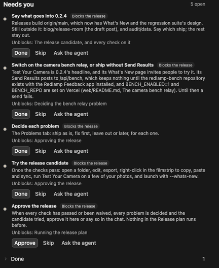
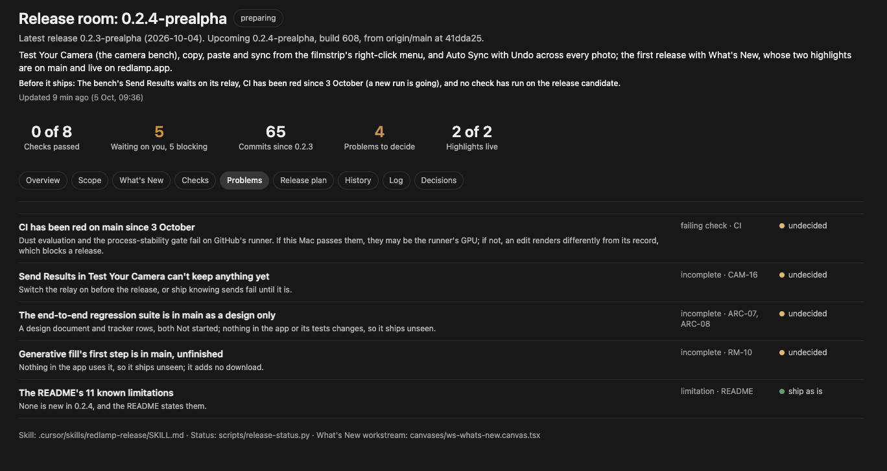
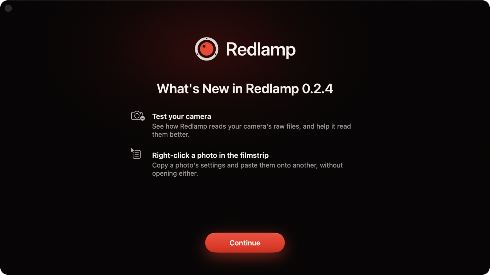
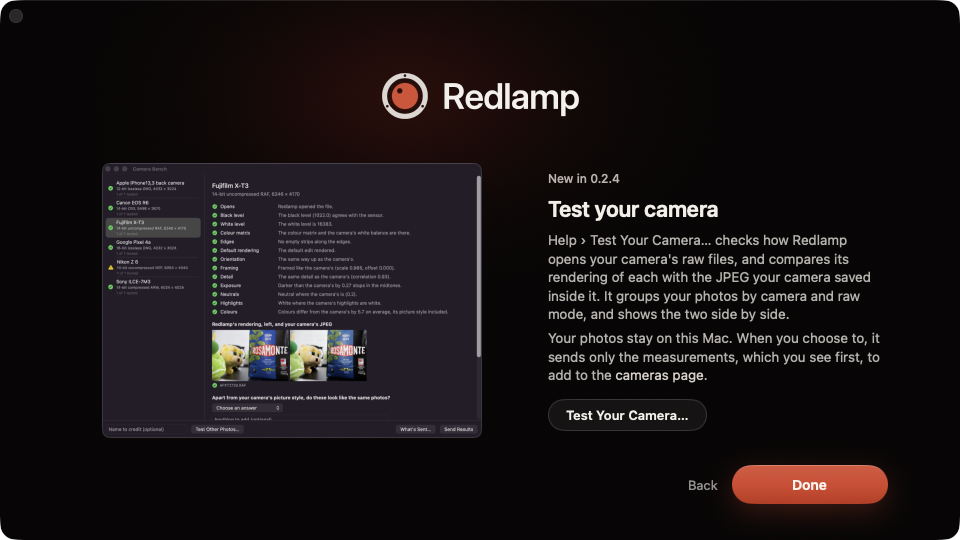
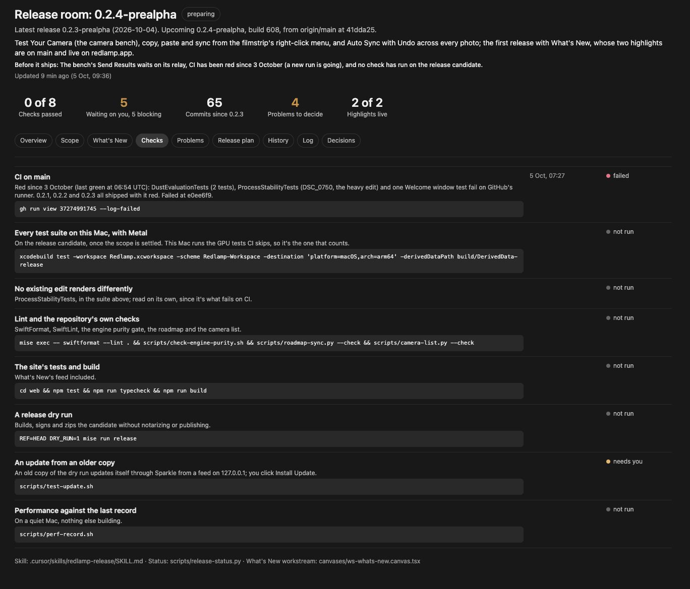

Redlamp's first release went out on the 1st of October. By the evening of the 4th there had been six. That isn't me showing off, it's a symptom. At any moment a bunch of agents are working on Redlamp, each on its own branch in its own copy of the repository, and things land on main all day. As I write this there are more than a dozen of those copies on my SSD.

Building quickly is the easy part now. Releasing is where I have to slow down, because it's the one moment when what the agents did reaches other people's Macs. Once a release is out, every installed copy is offered the update, and I can't take it back.

## What a release is

Mechanically, a release is one command, [`mise run release`](https://github.com/pdcgomes/redlamp/blob/main/mise/tasks/release). It builds origin/main in a clean worktree, so nothing uncommitted on my Mac can sneak in, bumps the patch number if the version is already tagged, then signs, notarises, tags and publishes it on GitHub with the update feed beside it. Installed copies check redlamp.app/appcast.xml, which points at the latest release, so publishing the release publishes the update.

That part works. The trouble was everything before I typed it.

The first few times, I'd ask an agent what was going into the release, and the answer was mostly right. Mostly. An agent knows what it did in its own chat, not what's on origin/main, and those aren't the same thing. A branch that's finished but not merged doesn't ship. Commits on my local main that I haven't pushed don't ship. And a known problem, like a failing test, doesn't get decided by anyone. It just ships with everything else.

That last one isn't hypothetical. CI on main hasn't passed since the morning of the 3rd of October, and 0.2.1, 0.2.2 and 0.2.3 all went out with it red. More on that below.

## The release room

So I asked for a skill to prepare releases, with a canvas as the checklist, where nothing runs until I've approved everything. I wanted to keep a chat open on it, or start it whenever, and for it to always know what the latest release is and what the upcoming one is. In my words at the time: treat this canvas and skill as the coordination room where all things release happen.

A canvas is a small React page that Cursor shows beside the chat. Each line of work on Redlamp already keeps one (a [workstream canvas](https://github.com/pdcgomes/redlamp/blob/main/.cursor/skills/workstream-canvas/SKILL.md)), so I can see where it stands without reading the transcript. The release room is the same idea, but there's only ever one: when a release ships, it goes into the room's history and the next one opens.

The room doesn't remember versions, it works them out. Every time the skill starts, it runs [`scripts/release-status.py`](https://github.com/pdcgomes/redlamp/blob/main/scripts/release-status.py) first, which asks GitHub and git and nothing else. This is part of what it said this morning:

```
Latest release:   0.2.3-prealpha (2026-10-04, from GitHub)
Upcoming release: 0.2.4-prealpha, build 601 (the next patch, …)
origin/main:      1065b5b Blog: publish Testing cameras I don't own

Changes since 0.2.3-prealpha: 59 commits
  CAM-14  Done         Camera bench: decode diagnostics …  (10 commits)
  CAM-15  Done         The Camera Bench window: …  (8 commits)
  CAM-16  In progress  Camera bench submissions: …  (2 commits)
  EDT-19  Done         The filmstrip's context menu: …  (3 commits)
  RM-10   In progress  Opt-in generative fill on Macs …  (2 commits)
  UX-14   Done         What's New: after an update, …  (10 commits)
  …

What's New for 0.2.4-prealpha on origin/main: Test your camera
CI on main: in_progress at 1065b5b
```

The last time the room had read it, origin/main was 33 commits past 0.2.3 and the build would have been 567. Then I pushed main, with What's New and a few other sessions' merges in it, and it became 59 commits and build 601. An agent going from memory would have been wrong within the hour.

From there, the room fills itself in:

- **Scope.** What's on origin/main ships, and nothing else. Changes are listed by tracker row, and a row that isn't Done gets flagged, since part of a feature is shipping. For 0.2.4 that's mostly research notes, plus the first step of generative fill, which nothing in the app uses yet. Anything not on origin/main goes under Held back, and the agent asks me what goes in. It never merges another session's branch on its own.
- **What's New.** The release's highlights, more on which below.
- **Checks.** Each with its result, the commit it ran on and when. One that hasn't run says "not run", never "passed".
- **Problems.** Every failing check, partly shipped feature, open bug report and risk, each with my decision: ship as is, fix first, leave out, or later.
- **The release plan.** The steps that actually ship it, from pushing main to checking that an installed copy of the previous version updates.

## Needs you

The part I use most is a list on the right called Needs you. It only holds things I have to do or decide, each with what it unblocks and the command to copy if there is one.

Each item has three buttons. **Done** and **Skip** fold it away, with an Undo, and the agent picks up my marks the next time it updates the room. **Ask the agent** opens a new chat with the room attached and a prompt naming the item, and marks it "With an agent". So when something needs looking into, like why CI is red, I can hand it off without writing the brief myself.



The last item is always **Approve the release**, and it always blocks. Its Done button says Approve. Nothing in the release plan runs until I press it or say so in the chat, and even then the agent tells me what it's about to run before it runs it. If anything changes after I approve, say a new commit on origin/main or a check failing again, the approval lapses and it asks again.

For 0.2.4 there were six items. Approving What's New's copy is done, so five are left as I write this: say what goes in, switch on the camera bench's relay or ship without Send Results, decide each problem, try the release candidate myself, and approve the release.



## What's New

0.2.4 is also the first release with What's New, a window that opens once after an update with the release's highlights, at most four. Sparkle's update window already lists every commit; this is the short version. Its content comes from redlamp.app rather than the app, so a highlight can be corrected after a release.





That changes the order of things: the highlights have to be live before the release is. In the room, each one goes from candidate to drafted to approved, which only I can do, to published, which means the live feed actually serves it. This release has two, both live already: [Test your camera](/blog/testing-cameras-i-dont-own), which has a post of its own, and copying settings from the filmstrip's right-click menu.

## The checks, and why my Mac counts more than CI

The checks run on the release candidate: origin/main plus whatever I've put in scope. The main one is every test suite on my Mac, which runs the GPU tests CI skips. Within it, the process-stability tests are read on their own: they render real edits and compare them with what was recorded, and an existing edit that renders differently blocks the release. Then lint, the website's build, a dry run of the release, an update from an older copy through Sparkle (I click Install Update), and performance on a quiet Mac.



Now, CI. The latest finished run on main fails in three places: two dust detection evaluations, the process-stability tests, and a test of the welcome window. Some of that may be GitHub's runner rather than Redlamp, but that's exactly the kind of thing I don't want waved through. In the room it was a problem waiting for my decision, and I decided to fix it first. An agent is on it as I write this, on its own branch, and the release waits until CI is green again.

## The regression suite

All of those checks look at pieces: pixels, cameras, old edits. Nothing checks the app as a whole, and the release task itself runs no tests at all. Today, what tells me a menu item still does something is me, trying the candidate, and that won't last as the app grows.

So the other thing being built is an end-to-end regression suite. What I asked for, roughly: as the features grow, it gets harder to test everything by hand, so ideally the suite runs the app and exercises all of its features. Of course it can't judge the photo edits themselves (the engine tests do that), but it should show that every feature is there, wired up, behaves, doesn't crash and performs well. And ideally it runs before every single release.

I approved the [design](https://github.com/pdcgomes/redlamp/blob/main/docs/plans/2026-10-05-regression-suite-design.md) this morning. In short:

- **It drives the real app from inside a test build of the same commit.** Keys, menu items, clicks and drags go through AppKit's own path, the same one a key press takes, so a broken shortcut or a disabled menu item gets caught. It runs in the background without taking over the mouse and keyboard, which matters on a Mac I'm using. Apple's XCUITest would take over the Mac for the whole run, and needs accessibility values on every custom control first, which Redlamp doesn't have yet.
- **Every feature has to be claimed.** Redlamp already has catalogues a test can walk: 97 actions on 96 key bindings, 152 parameters (118 of them sliders), and 131 features in 16 areas, the same IDs the in-app bug reports carry. Tests in CI will fail if any of them has no scenario and no written reason why not, so a new feature without one fails CI.
- **It leaves nothing behind.** The test build has its own bundle ID, its own home folder and no network. Bug reports and camera bench results go to a stand-in relay on the Mac that records what it's sent, so the suite can also check that a report holds no file paths, folder names or serial numbers.
- **It comes in tiers.** A smoke run under five minutes, a full run under thirty, performance budgets that only count on a quiet Mac, random walks through the app whose failures can be replayed, and a black-box check of the signed app itself.
- **It gates the release.** `mise run release` will refuse to ship without a passing run for the same commit.

To be honest about where it is: the design and its two tracker rows, [ARC-07](https://github.com/pdcgomes/redlamp/issues/212) and [ARC-08](https://github.com/pdcgomes/redlamp/issues/213), landed this morning, and both still say Not started. An agent is working on a spike on its own branch, to find out whether events sent to a background app reach AppKit the way real ones do, and whether the app keeps rendering while hidden. Nothing runs yet, so there's no run to show you. When there is, it becomes one more check in the room, and a failing run becomes a problem like any other.

## What's next

0.2.4 ships once its Needs you list is empty. For the suite, the smoke tier and the release gate come first (ARC-07), then scenarios for every area, from Develop to the camera bench (ARC-08).

The room will keep changing as I find out what's missing. Its [skill](https://github.com/pdcgomes/redlamp/blob/main/.cursor/skills/redlamp-release/SKILL.md) and [template](https://github.com/pdcgomes/redlamp/blob/main/.cursor/skills/redlamp-release/template.tsx) are in the repository if you'd like to borrow the idea.

Thanks for reading,\
Pedro
