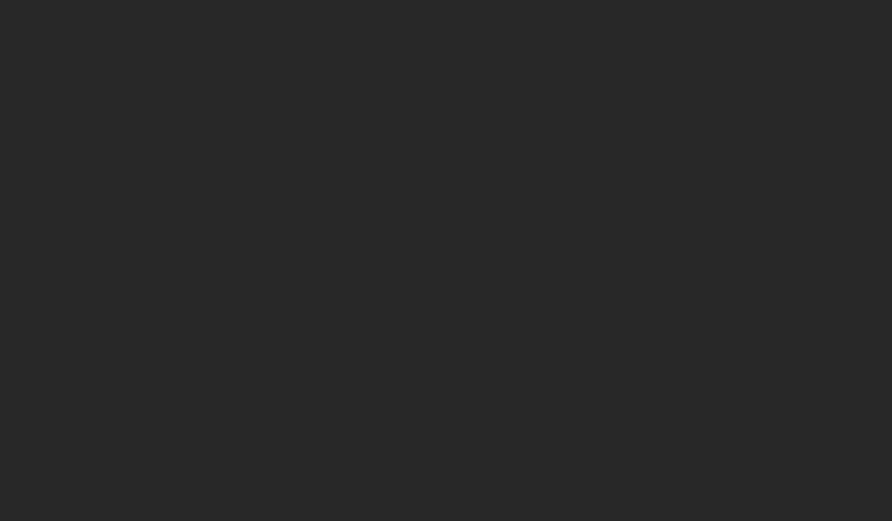
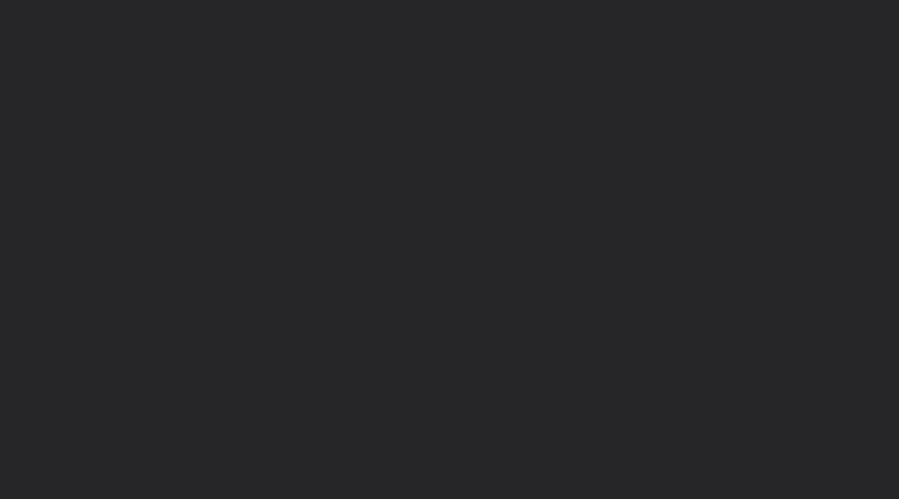

This morning I asked for a library. Lightroom Classic's Library module, more or less, but built for the libraries professionals actually have, which run to hundreds of thousands of photos and sometimes millions, some on spinning disks and some on a NAS. Search should answer as you type, every action should feel instant, and holding an arrow key should fly through the photos.

By the evening it had a plan, 35 rows in the tracker with an issue each, a research study, a stress harness, and the first half of its foundation merged on its own branch. Eleven agents had worked on it, most in copies of the repository of their own, and a twelfth was running.

Something that size doesn't fit in one chat. No conversation holds the whole plan, and I can't read every transcript to find out where things stand. This post is about how I keep a feature like this on track: a plan, the tracker, a board I can read in a minute, and the rules that keep the board honest. How the library itself is built (the budgets, the test fixtures, the benchmarks and what they changed) gets its own series once the feature is done.

## Start with a plan, and only the questions that change it

The request started in Cursor's plan mode, where the agent reads and asks but doesn't change anything. Before writing a line, it found out what Redlamp already had. Three exploring agents mapped the Folders panel and its performance budgets (50,000 photos listed in 209 ms), the sidecars that hold each photo's edit, the command palette and the shortcut registry. They came back with what the library could build on and what it lacked: no database anywhere, ratings that reach only the open photo and can't be undone, and thumbnails cached by path, so a renamed photo loses its own.

Then it asked me two questions, the two whose answers would change the plan. The first was where a photo's ratings, keywords and collections should live. I chose the photo's own sidecar, with the database only an index that can always be rebuilt, and other apps' XMP read but only written when I turn it on. The second was where the library sits on the roadmap. I chose to start now, with the core in 1.0.

Over the afternoon I added more, as messages while it worked:

- Performance had to be nailed from the start, with a stress harness to prove it.
- Mouse navigation matters as much as the keyboard.
- Library and Develop should be modules of one window, as in Lightroom Classic.
- I asked where sidecars should live, and how Lightroom handles it. I got a short comparison of Lightroom, Camera Raw, Capture One, darktable, RawTherapee and DxO before choosing: beside each photo by default, or in Redlamp on the Mac for folders it can't write to.

Each answer became a decision row in the tracker, DEC-35 to DEC-44, with what was decided and why. The two I haven't decided are there too, marked Proposed.

## The plan becomes the tracker, and the tracker becomes issues

Redlamp's roadmap lives in one file, the [research tracker](https://github.com/pdcgomes/redlamp/blob/main/docs/research/research-tracker.md), and every open row has a GitHub issue. One script keeps the issues in step with the rows. Another keeps the README's roadmap and the [Lightroom comparison](https://redlamp.app/compare) in step with the tracker. So the plan's milestones became 35 rows, LIB-01 to LIB-35, and one sync created issues #215 to #249. The 30 rows of the 1.0 core went into the Phase 4 milestone, and the 5 that come after 1.0 have none.

While the plan was being written, the tethered-capture session merged its own decisions and took DEC-29 to DEC-34, the IDs the plan had counted on. So the library's decisions start at DEC-35. It's a small thing, but it's the kind that goes wrong when several sessions share one tracker, and it's why the tracker is the source of truth rather than any one chat.

## The board

Every line of work on Redlamp keeps a canvas, a small React page that Cursor shows beside the chat. For most work, a list of steps and a log is enough. For this one I wanted progress per milestone and overall, like the production board I keep for another project, so the canvas became a board.

It reads from the top down:

- **Overall progress:** one bar across the 30 rows of the 1.0 core, coloured by state, then a tile for each milestone with its own bar. The milestones are the groundwork (research, the design and the performance lab), then M1, the foundation; M2, modules, grid and culling; M3, organising; M4, files on disk; and M5, coming from other apps.
- **Now:** what's being built at this moment, what's waiting on me and what's next, with buttons that open the design, the findings, the tracker and the plan.
- **Needs you:** what only I can do.
- **Each milestone's rows:** every tracker row with its state, a line on what's in and what's left, and a link to its issue.
- **Measured so far:** charts and figures from the stress harness, each with what it was measured against.
- **Agents:** every agent that has worked on the feature, how it ended, and a button that opens its conversation.
- **Record:** the plan's steps, the log and the decisions, folded away at the bottom.

### Built isn't done

A row has one of five states: done, built, in progress, waiting on me, or not started. Built means merged and tested, but with something still to check, usually a budget at a million photos or a small part that's left. A row is done only when its "done when" is met. In the tracker, a row stays In progress until its code reaches main, because a done row closes its GitHub issue.

When I wrote this, six of the thirty rows were built and none was done. A headline of 0% done looks odd, but it's honest, and the bar shows the built rows beside it.

The same rule runs through the whole board: only what was checked goes on it. Commits come from git, test counts from runs, and measurements come with what they were measured against and how busy the Mac was. The indexer has to make the first 1,000 photos searchable within 2 s. It managed that in one of four runs on a busy Mac, so its row says exactly that, and the chart draws the budget as a line.

### Needs you

The Needs you list holds what only I can do. Each item is written so I can do it without opening the transcript, says what it unblocks, and says whether work is waiting on it. Today's are:

- Run the cold-cache benchmark in Terminal, with the command to copy. Cursor's sandbox can't attach the disk image the benchmark needs.
- Decide the two proposed decisions.
- Choose when the tracker rows reach main.
- Mount a share from my NAS, so the simulated network numbers can be checked against real ones.

None of them blocks anything.

I answer on the board itself: Done, Skip, or Ask the agent, which opens a new chat with the canvas attached. The agent reads my marks at its next update.

## Performance first

I said at the start that performance had to be nailed first, so the plan put a stress harness before any feature. It has three parts:

- synthetic libraries of up to two million photos, with a manifest of what every query must return;
- a file layer that behaves like a spinning disk, a NAS, Wi-Fi or a VPN;
- benchmarks that end in PASS or FAIL.

The budgets were on the board from the first hour: search results within 16 ms at a million photos, every action on screen within a frame, and no blank frame while an arrow key is held.

It has already paid for itself twice. The index's first measurements showed SQLite on its own taking 60 ms to count two filters across a million photos, four times the search budget. So the design added columns held in memory, and the query engine built on them answers in 2.1 ms. Then the indexer's benchmark caught a cold index of 20,000 photos taking 185 s, because its readers held their places while parsing and their number collapsed to one. With the fix, it takes 26 s.

Both are under the board's Measured so far, and both will be in the series.

## A checkout of its own, and agents that own their paths

The library is built in its own worktree, on its own branch, with main merged in at every step. Main moved by 65 commits between the morning and the first merge.

Each agent works in a worktree of its own too, and owns a list of paths: the harness agent the file-system layer, fixtures and benchmarks, the index agent the SQLite code, and so on. Before they start, the design document says which files belong to which component, so the agents agree on the interfaces.

Not everything went to plan, and the board is where it showed.

- **Service limits.** Launching several agents at once failed on service limits, twice. One agent stopped halfway, and another finished its work from its commits. Agents now run one at a time, and the board's Agents table says which one is running.
- **A stale tracker.** Syncing the tracker from the library's branch would have reopened two issues another session had just closed on main, because the branch's copy of the tracker was an hour old. From the branch, the sync now updates only the library's own rows.

## What it gives me

- I can tell where a feature this size stands in a minute, without reading a transcript.
- Decisions are a history. They're appended, never rewritten, each with its reason and who made it: me, a measurement or a default.
- What needs me is explicit, with what it unblocks, so nothing waits on me without my knowing.
- Progress is measured against the plan's own "done when", not against a feeling.
- Any agent can pick the work up from the board and the tracker, because neither depends on a chat's memory. So can I.

## Borrow it

The skill is in Redlamp's repository, and you can copy its folder into your own project's `.cursor/skills/`:

- [`SKILL.md`](https://github.com/pdcgomes/redlamp/blob/main/.cursor/skills/workstream-canvas/SKILL.md): when an agent keeps a canvas, what goes on it, and how it's kept current.
- [`template.tsx`](https://github.com/pdcgomes/redlamp/blob/main/.cursor/skills/workstream-canvas/template.tsx): the canvas for a single line of work.
- [`board-template.tsx`](https://github.com/pdcgomes/redlamp/blob/main/.cursor/skills/workstream-canvas/board-template.tsx): the board for a feature with milestones, the one in this post.

It leans on a few Redlamp conventions that you can swap for your own:

- the tracker and its two scripts, [`tracker-issues.py`](https://github.com/pdcgomes/redlamp/blob/main/scripts/tracker-issues.py) and [`roadmap-sync.py`](https://github.com/pdcgomes/redlamp/blob/main/scripts/roadmap-sync.py);
- the rules for agents working in parallel, in [`AGENTS.md`](https://github.com/pdcgomes/redlamp/blob/main/AGENTS.md).

Cursor's own canvas skill does the drawing. The workstream skill only says what goes on the page and when it changes.

## What's next

The library is a long way from done. M1 still needs its store for thumbnails and previews, its photo lists and its choice of where sidecars live, and then a check against a million-photo fixture. When the whole feature is done, I'll write about how it was built: the budgets and where they came from, the fixtures, the benchmarks, the measurements, and what changed because of them.
