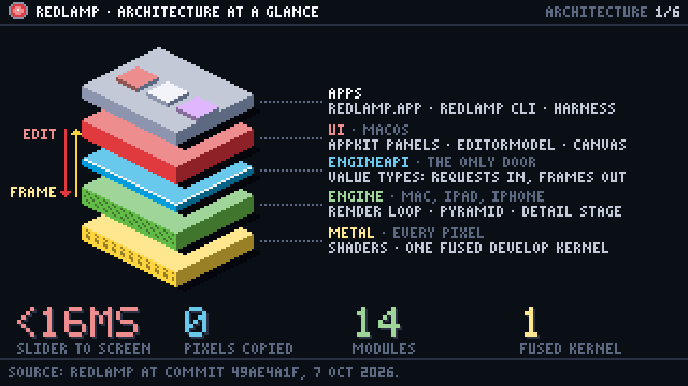
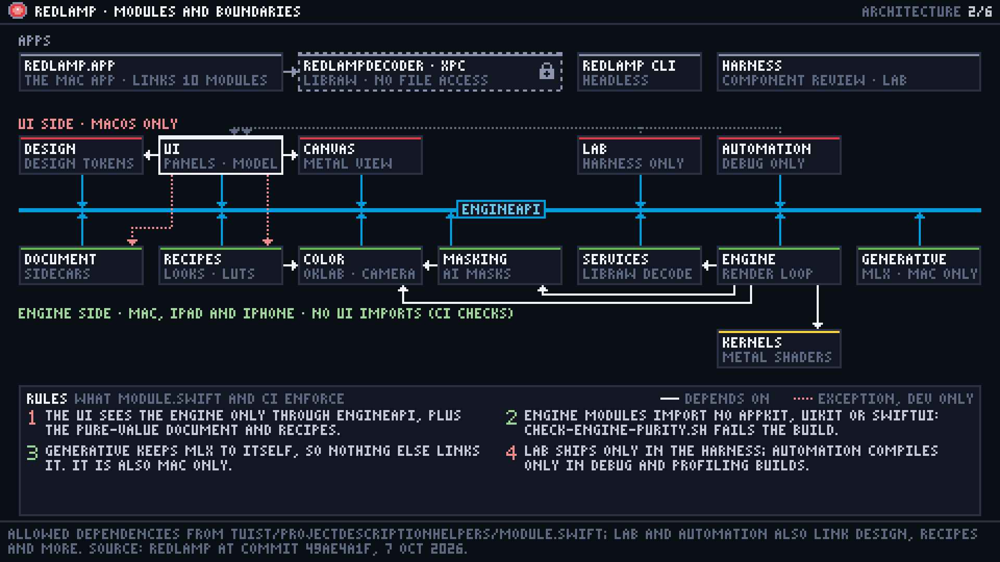
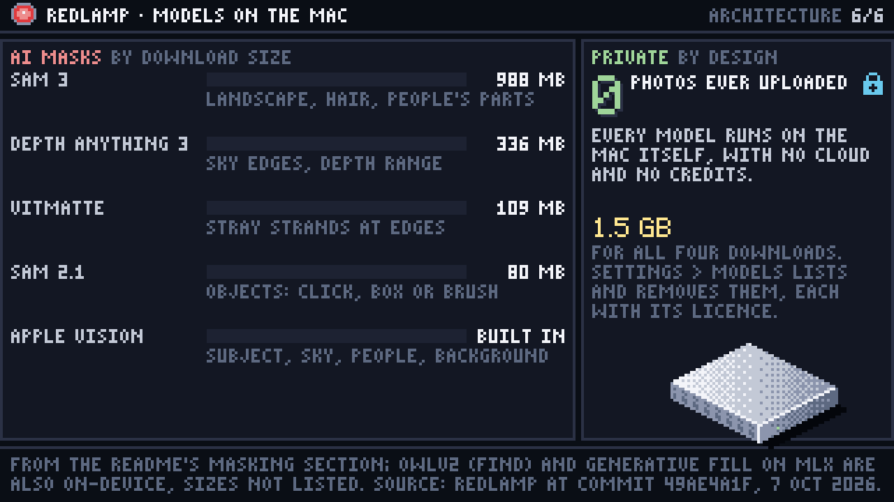

Redlamp is a free, open-source raw photo editor for the Mac that works like Lightroom. I've written about [how I manage the AI agents that build it](/blog/how-i-run-a-big-feature) and [how I release it](/blog/how-i-release-redlamp). This post is about the app itself.

I've been putting together a small kit for drawing pixel-art graphics for this blog, and Redlamp's architecture was its first real test. So this one is mostly pictures: six of them, from the layers at the top down to where your edits are saved. They're animated, but every label stays put while something moves through the picture, so you can stop and read them. The numbers come from Redlamp's README and code as of 7 October.

## At a glance

Redlamp stacks into five layers. The apps sit on top: Redlamp itself, a command-line tool and a harness I use to review UI components. Under them is the UI, which is macOS only for now, then a small API, then the engine, which already builds for the iPad and iPhone as well. At the bottom, Metal shaders handle every pixel.

The UI and the engine only meet through that API, and only by passing plain values: a request goes in, a frame comes out. Frames come back in memory the engine, the UI and the GPU all share (an IOSurface), so their pixels are never copied on the way.

## Modules and boundaries

In code, that's fourteen modules, and one file decides which of them may depend on which. Twelve of them link the API, the blue rail in the middle. If anything on the engine side imports AppKit, UIKit or SwiftUI, or the UI reaches into the engine's internals, the build fails.

Photos are decoded in a separate process, sandboxed with no access to your files. Redlamp sends it a photo's bytes, never the file, so a damaged raw can't crash the editor while it decodes.

## From raw to screen

LibRaw unpacks the sensor data inside that sandbox, and everything after it runs on the GPU. The photo is demosaiced into full colour and kept at several sizes. Noise reduction, sharpening, texture and clarity run as a stage of their own and keep their results, so moving any other slider doesn't redo them.

Then a single Metal kernel does the rest in one pass over each pixel: every mask first, then every slider, always in the same order. White balance, exposure and tone work on the light the camera recorded, and colour, curves, vignette and grain on the image after the tone curve.

On an M1 Ultra, opening a 24 to 26 megapixel raw takes 70 to 250 ms. Redrawing it at Fit after you move a slider takes 0.6 to 3 ms.

## A frame in under 16 ms

One of Redlamp's goals is that a slider change reaches the screen within a frame, which is under 16 ms, and that the UI never waits on the engine, the disk or the GPU. The main thread handles the event and hands the engine a request. If requests arrive faster than frames, each new one replaces the one waiting, so a burst of slider movement renders once.

Getting there took two changes: rendering moved off the main thread, then the panels moved from SwiftUI to AppKit controls that only redraw what changed. With every panel open and a slider being dragged, the main thread went from busy all of the time to about a third of it.

## Where an edit lives

Your photos are never written to. Each edit is saved next to its photo, at most 2 seconds after you make it, in a small package that Finder shows as one file: the edit as JSON, AI masks as images, and every step of its history.

Every edit carries two version numbers. The format version is the file's syntax, and older ones are migrated when they're read. The process version is how the edit renders. A change to how something renders comes with a new process version, and edits made before it keep the old one, so a photo you edited before an update still looks the way you left it. A sidecar written by a newer version of Redlamp opens read-only, and is never overwritten.

## Models on the Mac

The AI masks run on the Mac. Subject, sky, people and background start from Apple Vision's built-in models, so there's nothing to download for those. The rest use four downloads, from 80 MB to 988 MB and about 1.5 GB in all, which Settings › Models lists and removes. Photos are never uploaded, and there are no credits to buy.

## How I drew them

Each picture is a short Python script, drawn on a grid of 320 by 180 pixels (480 by 270 for the two busiest ones) and scaled up four times, so every pixel stays sharp. The animations are drawn the same way, frame by frame, as a function of time. The kit, the six scripts and [a tall poster of all six](/synced/blog/redlamp-architecture/poster.png) are in [pixelartvisuals](https://github.com/pdcgomes/pixelartvisuals) on GitHub, with an agent skill for Cursor and Claude Code if you'd like to draw your own.

For more detail than the pictures give, the [architecture section of the README](https://github.com/pdcgomes/redlamp#architecture) goes deeper.

Thanks for reading,\
Pedro
