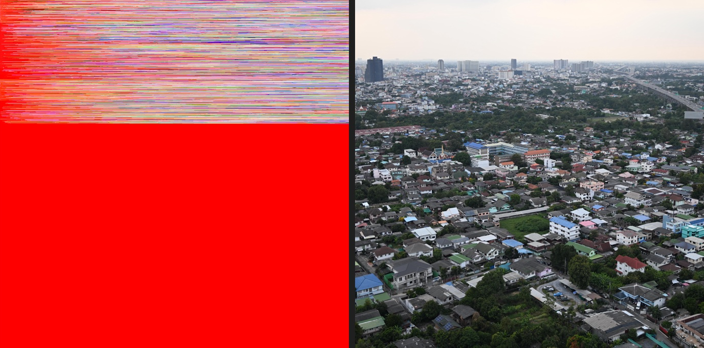
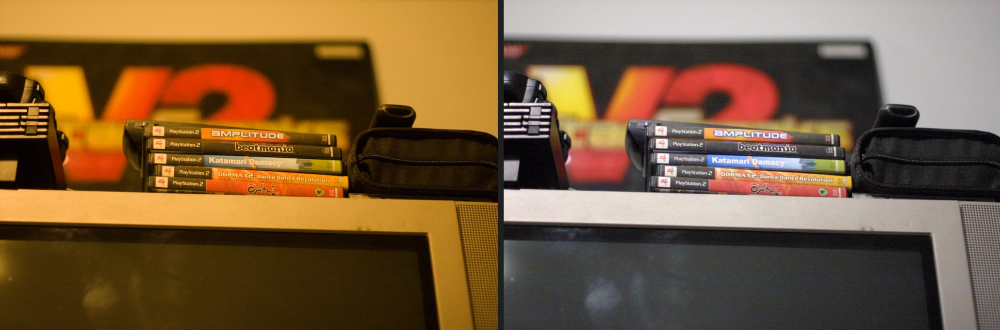

Shortly after the first release, someone asked whether Redlamp could handle Hasselblad raw files. I didn't have a particularly good answer. I don't own a Hasselblad, and I don't know anyone with a modern one, although I'd quite like to try the 100-megapixel X2D.

Fortunately, [raw.pixls.us](https://raw.pixls.us) had CC0 samples from the X1D II and X2D. I added them to Redlamp's tests, so those two cameras are now checked on every change.

That led me to look more closely at the rest of the camera support. Redlamp uses LibRaw to read raw files, and the version it uses lists 1,258 cameras. When I built the [cameras page](/cameras), I counted how many were actually covered by Redlamp's tests: 25.

I own one camera, so closing that gap needs a different approach.

## What “supported” means

Being able to decode a file is only part of the work. LibRaw provides sensor data and metadata, but Redlamp still has to handle black and white levels, colour conversion, cropping and orientation correctly. Getting those wrong can produce washed-out shadows, magenta highlights, dark edges or less obvious colour differences.

There are also several possible raw formats within a single camera model. Compressed, lossless and uncompressed files, different bit depths and crop modes can follow different decoder paths. Nikon's High Efficiency raws, for example, aren't readable by the LibRaw version Redlamp currently uses, even when lossless raws from the same body work.

For someone using the app professionally, a list of camera names isn't enough. They need some indication that their camera and the raw mode they use have actually been tested.

I wanted a way for people to help establish that using photos they already have.

## A test people can run locally

The initial idea was a small testing tool bundled with Redlamp. You point it at your photos, it identifies the camera and raw mode from the metadata, runs checks and lets you submit the results. Over time, those reports would tell me which cameras were working and where there were problems.

The main question was what to compare the rendering against. For a camera I don't own, I don't have my own reference images.

Most raw files contain an embedded JPEG rendered by the camera. It has limitations as a reference: the camera's picture style is baked in, lens corrections may have been applied, and the preview can be small. Still, it's useful for checking orientation, framing, brightness, neutral colours and highlights. A substantial disagreement can point to a processing problem worth investigating.

Other checks can use the raw data itself. Many sensors have masked photosites around the border that can help establish the black level. Missing colour matrices or an unexpected dark strip at the edge can also indicate problems without requiring a reference rendering.

I considered having people upload their raws. They would be useful for debugging, but that would also mean storing other people's photos and dealing with sharing permissions and whatever was submitted. I wasn't keen on adding that responsibility, and I wouldn't expect everyone to be comfortable sharing their images anyway.

The bench therefore sends measurements only. Reports contain no pixels, filenames, GPS coordinates, serial numbers or capture times. You can inspect the complete report before sending it.

For people who do want to contribute a raw file, raw.pixls.us remains the route for CC0 samples that can become permanent tests.

I also wanted to use infrastructure I already had. Redlamp's bug reporter sends reports through redlamp.app into GitHub. The bench uses the same approach, storing each report as a JSON file in a private repository. A script aggregates those files into the data used by the cameras page. There's no new database or account system to maintain, and the reports retain their history.

## Showing what has actually been tested

Originally, I thought each camera could have a confidence score. I changed my mind because a score wouldn't tell anyone what was missing. If a camera scores 0.8, it's difficult to know which test would make the result more useful.

Instead, each camera and raw mode has explicit criteria:

- **Reported working:** at least one photo opened without a failing check.
- **Tested by photographers:** at least three contributors have submitted ten photos between them, covering base and high ISO, portrait orientation, clipped highlights and warm light. No more than 10% fail a check, and at least two visual comparisons report that the renderings look equivalent.
- **Problem reported:** two contributors encounter the same failure, or someone reports a visible difference between the renderings.
- **Verified:** a CC0 sample is included in Redlamp's automated tests.

That also lets the bench tell contributors what would help. If a camera has no high-ISO example yet, it can ask for one. These thresholds are an initial approach, and I expect to revise them as real reports come in.

## Using the bench

In Redlamp, **Help › Test Your Camera…** opens the Camera Bench. Select a folder or a few raw files, and it identifies the camera and raw mode, chooses up to eight photos per mode and runs the checks.

It then displays Redlamp's rendering beside the embedded camera JPEG and asks for a visual comparison: allowing for the camera's picture style, do they look like the same photo?

There's a [step-by-step guide with screenshots](/cameras/test). Getting from the initial idea to a working bench took about a day, with agents implementing it.

## Checking the checks

Before asking anyone to use it, I wanted evidence that the bench could distinguish working files from broken rendering.

It passes all the cameras already verified by Redlamp's tests. I also introduced five deliberate faults: incorrect orientation, a colour filter pattern shifted by one column, an excessively high black level, a white level three stops too high, and a green channel reduced by a third. It detected all five.

I then ran it against CC0 samples from raw.pixls.us, downloading one file at a time and deleting it after testing. The run covered 820 photos across 742 camera and raw-mode combinations. Of those combinations, 675 opened without a failing check and 65 showed a problem.

It found several issues I hadn't been aware of:

- Leica M Monochrom and Pentax K-3 Mark III Monochrome files don't open. Redlamp doesn't yet have a processing path for their sensors without colour filters.
- Nikon Z50 II and Z5 II files are newer than the bundled LibRaw version. Rather than being rejected, they decode as coloured noise.
- Twelve older Fujifilm SuperCCD cameras crash the decoder.
- A Canon EOS D30 sample with no white balance information renders orange.
- Some newer Fujifilm files have a 12-pixel dark strip down the right edge.
- A Leaf Aptus 22 sample renders with the wrong orientation.

These are now tracked as `CAM-20` through `CAM-26`.

The run also exposed problems in the checks themselves. Canon PowerShots using CHDK record bad pixels as zeros, which the black-level check initially interpreted as a sensor problem. Some cameras zero their masked borders, and 360° cameras intentionally leave parts of the frame black. Those cases required changes to the checks.

Each check is versioned. When its behaviour changes, older reports can either be re-evaluated from the measurements they contain or excluded if those measurements are no longer sufficient.

## Contributing results

The bench is included in Redlamp 0.2.4. Once you have that release, open **Help › Test Your Camera…**, select some raws and submit the results. It takes a few minutes, and you can use existing photos.

The most useful set includes a base-ISO shot, one at ISO 3200 or above, a portrait-oriented frame, clipped highlights, warm indoor lighting, and examples of each raw mode your camera supports.

If something looks wrong, **Report This Problem** opens a bug report with the diagnostic information already filled in. You only need to describe what you saw.

If you're willing to share a raw under CC0, upload it to [raw.pixls.us](https://raw.pixls.us) and [open an issue](https://github.com/pdcgomes/redlamp/issues) with the link. That's how the Hasselblad samples became part of the test suite, and it's how a problem found by the bench can become something Redlamp checks on every change.

Thanks for reading,\
Pedro
